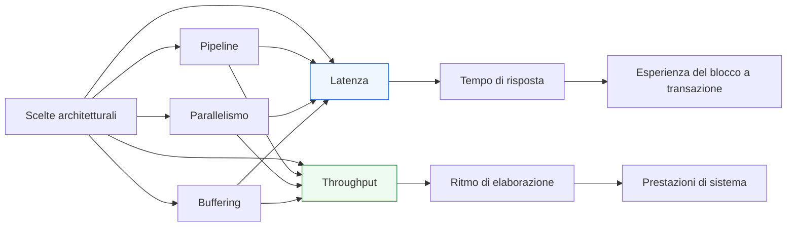
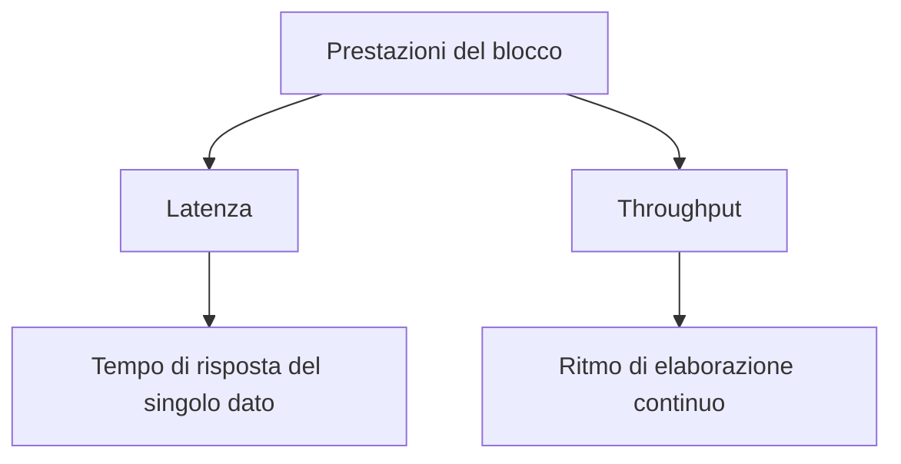
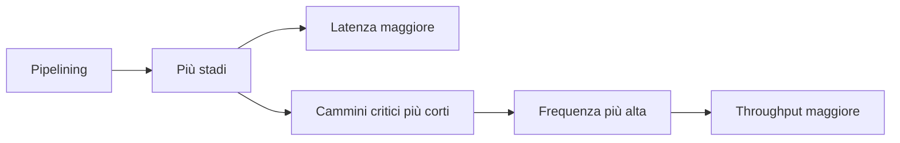

# Latenza e throughput

Dopo aver introdotto **pipeline**, **interfacce con handshake**, **datapath e controllo**, e i meccanismi di **parametrizzazione** della RTL, il passo successivo naturale è consolidare due concetti che ricorrono continuamente nella progettazione hardware: **latenza** e **throughput**.

Questi due termini vengono spesso usati insieme, e a volte confusi, ma rappresentano aspetti diversi delle prestazioni di un blocco digitale. Capirne bene la differenza è fondamentale perché molte decisioni architetturali — come introdurre pipeline, aumentare il parallelismo, aggiungere buffering o modificare il protocollo di interfaccia — migliorano uno di questi aspetti al prezzo di cambiare l’altro.

Dal punto di vista progettuale, latenza e throughput sono il punto in cui si incontrano in modo molto diretto:
- architettura;
- RTL;
- timing;
- pipeline;
- handshake;
- buffering;
- implementazione FPGA;
- implementazione ASIC.

Questa pagina introduce i due concetti con un taglio sistematico e progettuale, mettendo in evidenza il loro ruolo nella costruzione di blocchi hardware reali e nelle scelte di compromesso che accompagnano tutto il flusso di sviluppo.

## 1. Perché distinguere tra latenza e throughput

In un blocco hardware reale non basta dire che “è veloce” o “è lento”. Bisogna capire **in che senso** lo è.

### 1.1 Due domande diverse
Le due domande corrette sono:
- quanto tempo impiega un singolo dato o una singola richiesta per attraversare il blocco?
- quanti dati o quante richieste il blocco può elaborare in un certo intervallo di tempo?

La prima domanda riguarda la **latenza**.  
La seconda riguarda il **throughput**.

### 1.2 Perché conta davvero
Molte scelte progettuali ottimizzano uno dei due aspetti senza migliorare automaticamente l’altro. Per esempio:
- una pipeline può aumentare la frequenza e il throughput, ma aumentare la latenza;
- un’architettura molto parallela può aumentare il throughput, ma non necessariamente ridurre il tempo di risposta di una singola operazione;
- un buffering può migliorare la fluidità del trasferimento, ma introdurre ritardo aggiuntivo.

### 1.3 Impatto metodologico
Capire bene questa distinzione aiuta a:
- formulare correttamente i requisiti;
- leggere meglio i risultati di sintesi e integrazione;
- scegliere la struttura del datapath;
- valutare compromessi di area, timing e complessità di controllo.

## 2. Che cos’è la latenza

La **latenza** è il tempo necessario affinché un ingresso, una richiesta o un dato producano l’effetto o il risultato atteso all’uscita del blocco.

### 2.1 Significato intuitivo
La latenza risponde alla domanda:
- “quanto devo aspettare prima di vedere il risultato?”

### 2.2 Come può essere espressa
La latenza può essere espressa in:
- numero di cicli di clock;
- tempo assoluto;
- numero di stadi attraversati;
- distanza temporale tra accettazione dell’ingresso e validità dell’uscita.

### 2.3 Visione architetturale
Dal punto di vista dell’architettura, la latenza misura il tempo di attraversamento del blocco. È particolarmente importante quando:
- il risultato serve per una decisione successiva;
- il blocco è parte di una catena di controllo;
- una risposta rapida è più importante del massimo ritmo di elaborazione;
- il sistema ha vincoli sul tempo di reazione.

## 3. Che cos’è il throughput

Il **throughput** misura la quantità di lavoro che il blocco riesce a completare in una certa unità di tempo.

### 3.1 Significato intuitivo
Il throughput risponde alla domanda:
- “con quale frequenza il blocco può accettare o produrre nuovi dati?”

### 3.2 Come può essere espresso
Può essere espresso, per esempio, come:
- risultati per ciclo;
- transazioni per secondo;
- parole per ciclo;
- operazioni per unità di tempo.

### 3.3 Visione architetturale
Il throughput è cruciale quando interessa il rendimento globale del sistema, per esempio:
- elaborazione continua di stream di dati;
- canali di comunicazione;
- acceleratori numerici;
- pipeline profonde;
- blocchi che devono sostenere un certo ritmo di traffico.

## 4. Latenza e throughput non sono la stessa cosa

Uno dei punti più importanti da fissare è che latenza e throughput non coincidono.

### 4.1 Un blocco può avere:
- bassa latenza e basso throughput;
- alta latenza e alto throughput;
- bassa latenza e alto throughput;
- alta latenza e basso throughput.

### 4.2 Esempio concettuale
Un blocco semplice che esegue una piccola operazione in un ciclo può avere:
- latenza molto bassa;
- throughput limitato se non riesce ad accettare un nuovo dato a ogni ciclo o se il clock massimo è basso.

Una pipeline profonda può avere:
- latenza più alta;
- throughput molto alto una volta riempita.

### 4.3 Conseguenza progettuale
Non basta chiedere “quanto è veloce?”. Bisogna chiedere:
- serve una risposta rapida per il singolo dato?
- oppure serve sostenere una grande quantità di dati nel tempo?

## 5. Latenza in cicli e latenza in tempo assoluto

Nella progettazione RTL è utile distinguere due modi di leggere la latenza.

### 5.1 Latenza in cicli
Questa misura dice quanti cicli passano tra:
- accettazione dell’ingresso;
- disponibilità del risultato.

È molto naturale in RTL, perché la struttura del blocco è spesso scandita da clock, registri e pipeline stage.

### 5.2 Latenza in tempo assoluto
Questa misura dipende anche dal periodo di clock. Un blocco con più cicli di latenza può comunque avere un tempo assoluto competitivo se opera a frequenza molto più alta.

### 5.3 Perché la distinzione è importante
Due architetture possono avere:
- latenza diversa in cicli;
- latenza simile o diversa in tempo reale;
- throughput molto diverso.

Per questo, il numero di cicli da solo non basta sempre a valutare il comportamento del blocco.

## 6. Throughput e frequenza di clock

Anche il throughput non dipende solo dalla struttura logica, ma anche dalla frequenza a cui il blocco può operare.

### 6.1 Throughput per ciclo
Un blocco può accettare:
- un dato ogni ciclo;
- un dato ogni due cicli;
- più dati per ciclo;
- un dato solo quando una certa risorsa è libera.

### 6.2 Throughput nel tempo reale
Il throughput effettivo dipende anche dalla frequenza di clock raggiungibile. Un blocco che accetta un dato per ciclo ma a frequenza bassa può risultare meno performante di un blocco con struttura diversa ma clock più alto.

### 6.3 Collegamento con il timing
Per questo throughput e timing closure sono strettamente legati:
- migliorare la Fmax può aumentare il throughput reale;
- introdurre pipeline può aiutare a raggiungere frequenze superiori;
- il protocollo di interfaccia può limitare la cadenza di trasferimento.

## 7. Effetto della pipeline sulla latenza

La pipeline è uno dei casi più didatticamente importanti per capire la latenza.

### 7.1 Più stadi, più cicli
Quando un’elaborazione viene suddivisa in più stadi:
- il dato deve attraversare più registri;
- il risultato arriva dopo più cicli;
- la latenza aumenta.

### 7.2 Effetto naturale
Questo aumento non è un errore: è il risultato naturale del fatto che il blocco è stato segmentato temporalmente.

### 7.3 Collegamento con il controllo
Quando si introduce pipeline, il controllo deve essere consapevole della nuova latenza, perché:
- il risultato non è più immediato;
- i segnali di validità devono avanzare insieme al dato;
- il sistema deve sapere dopo quanti cicli aspettarsi l’uscita.

## 8. Effetto della pipeline sul throughput

Se la latenza aumenta con la pipeline, il throughput spesso migliora.

### 8.1 Perché migliora
Una volta riempita la pipeline:
- diversi dati si trovano contemporaneamente in stadi diversi;
- il blocco può produrre risultati con ritmo più elevato;
- il lavoro complessivo del sistema viene distribuito meglio nel tempo.

### 8.2 Collegamento con la frequenza
Poiché la pipeline riduce il cammino critico per stadio, spesso permette anche di aumentare la frequenza di clock. Questo rafforza ulteriormente il throughput.

### 8.3 Distinzione centrale
Questo è uno dei compromessi più classici dell’architettura digitale:
- **più latenza**
- **più throughput**
- **migliore timing closure**

## 9. Parallelismo e throughput

Oltre alla pipeline, un altro modo per migliorare il throughput è aumentare il **parallelismo**.

### 9.1 Parallelismo strutturale
Si possono introdurre:
- più lane;
- più canali;
- più unità di elaborazione;
- più istanze replicate.

### 9.2 Effetto sul throughput
Il blocco può così elaborare più dati nello stesso intervallo di tempo.

### 9.3 Effetto sulla latenza
Il parallelismo non riduce necessariamente la latenza del singolo dato. Spesso migliora soprattutto il throughput globale.

### 9.4 Costo del parallelismo
Aumentare il parallelismo comporta:
- maggiore area;
- maggiore complessità del controllo;
- maggiore pressione sul routing;
- fanout più elevato;
- consumi più alti.

Per questo, anche il parallelismo è una leva architetturale da valutare con attenzione.

## 10. Buffering, code e decoupling

Il buffering è un altro elemento importante nel rapporto tra latenza e throughput.

### 10.1 Perché serve
Un buffer o una coda possono:
- assorbire differenze di ritmo tra produttore e consumatore;
- ridurre stalli;
- migliorare l’utilizzo medio delle risorse;
- aumentare la fluidità del traffico.

### 10.2 Effetto sulla latenza
L’inserimento di buffering può però aggiungere ritardo nel percorso del dato, quindi aumentare la latenza.

### 10.3 Effetto sul throughput
Se il buffer evita blocchi frequenti, il throughput globale del sistema può migliorare anche in modo significativo.

### 10.4 Visione sistemica
Questo è un altro caso in cui il sistema nel suo insieme può beneficiare di una scelta che non riduce il tempo di risposta del singolo elemento.

## 11. Handshake e limiti di throughput

Il throughput teorico di un blocco può essere diverso dal throughput effettivo raggiunto in sistema, a causa del protocollo di handshake.

### 11.1 `valid` / `ready`
Con un canale `valid` / `ready`, il trasferimento può avvenire a ogni ciclo solo se:
- il produttore presenta dati validi;
- il consumatore è pronto.

### 11.2 Backpressure
Se il ricevente applica backpressure:
- alcuni trasferimenti vengono ritardati;
- il throughput effettivo si riduce;
- la pipeline può introdurre bolle o stalli.

### 11.3 `start` / `done`
In modelli a transazione, il throughput può essere limitato dal fatto che una nuova operazione può iniziare solo dopo certe condizioni di completamento o disponibilità interna.

### 11.4 Conseguenza pratica
Non basta valutare il throughput interno del blocco. Bisogna considerare anche:
- l’interfaccia;
- la presenza di backpressure;
- la latenza interna;
- eventuali vincoli sulle richieste concorrenti.

## 12. Latenza, throughput e datapath

Nel datapath, questi due concetti si riflettono in modo molto concreto.

### 12.1 Latenza del datapath
Dipende da:
- numero di registri attraversati;
- profondità della pipeline;
- presenza di buffering;
- numero di fasi dell’algoritmo.

### 12.2 Throughput del datapath
Dipende da:
- capacità di accettare nuovi dati;
- frequenza di clock;
- grado di parallelismo;
- assenza o presenza di stalli;
- struttura del controllo.

### 12.3 Collegamento con il controllo
Il controllo deve essere costruito in modo coerente con:
- tempo di propagazione delle informazioni;
- cadenza di accettazione del dato;
- validità delle uscite;
- gestione degli arresti temporanei.

## 13. Latenza, throughput e controllo

Anche il controllo ha un ruolo decisivo.

### 13.1 Controllo troppo rigido
Un controllo che accetta nuove operazioni solo dopo il completamento della precedente può limitare il throughput, anche se il datapath potrebbe supportare un ritmo più alto.

### 13.2 Controllo pipeline-aware
Un controllo capace di seguire dati in volo e più transazioni contemporanee può aumentare il throughput, ma introduce maggiore complessità.

### 13.3 Latenza di controllo
In alcuni casi, anche il percorso decisionale del controllo incide sulla latenza percepita del blocco, specialmente nelle operazioni multi-ciclo o nei protocolli request/response.

## 14. Implicazioni per la verifica

Latenza e throughput devono essere verificati in modo esplicito.

### 14.1 Verifica della latenza
Bisogna controllare che:
- il risultato arrivi dopo il numero corretto di cicli;
- i segnali di validità siano allineati;
- eventuali stall o flush modifichino la latenza nel modo previsto.

### 14.2 Verifica del throughput
Bisogna osservare se il blocco:
- accetta dati al ritmo atteso;
- mantiene la cadenza prevista in regime;
- degrada correttamente in presenza di backpressure o conflitti;
- non perde o duplica trasferimenti.

### 14.3 Casi limite
È importante verificare:
- pipeline vuota;
- pipeline piena;
- burst di richieste;
- rallentamento del consumatore;
- operazioni consecutive;
- cambi di configurazione o reset.

### 14.4 Debug
Una buona osservabilità della latenza e del throughput richiede waveform leggibili, segnali di validità chiari e visibilità dei punti in cui il dato entra, si ferma o viene accettato.

## 15. Implicazioni per il timing

Dal punto di vista del timing, latenza e throughput non vanno letti separatamente dalla struttura fisica del blocco.

### 15.1 Throughput e Fmax
Aumentare il throughput reale spesso richiede:
- frequenza più alta;
- cammini critici più corti;
- migliore organizzazione della pipeline.

### 15.2 Latenza e registrazione
Aumentare il numero di registri può migliorare il timing ma aggiunge cicli alla latenza.

### 15.3 Compromesso fondamentale
Molto spesso il progetto deve scegliere tra:
- meno stadi e meno latenza;
- più stadi e maggiore throughput;
- migliore timing closure al prezzo di risposta più lunga.

### 15.4 Valutazione corretta
La soluzione migliore dipende dai requisiti del sistema, non da una preferenza astratta.

## 16. Impatto su FPGA

Su FPGA, latenza e throughput sono strettamente legati alla disponibilità di pipeline, registri distribuiti e risorse dedicate.

### 16.1 Pipeline favorevole
In molti casi, introdurre pipeline è una tecnica molto efficace per:
- aumentare la frequenza;
- sfruttare meglio DSP e carry chain;
- ridurre la difficoltà del routing.

### 16.2 Parallelismo configurabile
Replicare canali o lane può aumentare molto il throughput, ma va confrontato con:
- utilizzo di LUT;
- utilizzo di flip-flop;
- consumo di DSP e BRAM;
- qualità del placement e del routing.

### 16.3 Lettura pratica
Su FPGA, la soluzione migliore emerge spesso dal confronto tra:
- report di timing;
- risorse usate;
- throughput desiderato;
- latenza accettabile.

## 17. Impatto su ASIC

Anche in ASIC il compromesso tra latenza e throughput è centrale.

### 17.1 Pipeline e frequenza
Per raggiungere frequenze elevate è spesso necessario introdurre pipeline, anche a costo di aumentare la latenza.

### 17.2 Parallelismo e area
Aumentare il throughput con più unità parallele può avere un costo importante in:
- area;
- clock tree load;
- potenza dinamica;
- complessità del floorplanning.

### 17.3 Buffering e traffico
Nelle interconnessioni e nei sottosistemi, buffering e code possono migliorare il throughput sistemico ma vanno valutati rispetto a:
- area;
- latenza;
- verificabilità;
- backpressure.

### 17.4 Visione da backend
Nel flusso ASIC, queste scelte si riflettono su:
- sintesi;
- floorplanning;
- PnR;
- CTS;
- signoff.

## 18. Errori comuni

Alcuni errori ricorrenti rendono difficile ragionare correttamente su latenza e throughput.

### 18.1 Confondere i due concetti
È l’errore più comune: assumere che migliorare uno significhi migliorare anche l’altro.

### 18.2 Valutare solo i cicli e non il clock
Una latenza minore in cicli non implica sempre una risposta più rapida in tempo assoluto.

### 18.3 Ignorare l’interfaccia
Un blocco internamente veloce può avere throughput limitato dall’handshake o dal backpressure.

### 18.4 Guardare solo il blocco isolato
In sistema, buffering, consumatore, produttore e traffico reale possono cambiare molto le prestazioni percepite.

### 18.5 Non allineare controllo e datapath
Una pipeline ben fatta nel datapath può essere penalizzata da un controllo che non supporta il ritmo desiderato.

## 19. Buone pratiche di modellazione

Per trattare bene latenza e throughput nella progettazione RTL, alcune pratiche sono particolarmente efficaci.

### 19.1 Esplicitare il requisito
Bisogna chiarire se il blocco è guidato soprattutto da:
- tempo di risposta;
- ritmo di elaborazione;
- equilibrio tra i due.

### 19.2 Documentare la latenza
La latenza del blocco dovrebbe essere chiara:
- in cicli;
- rispetto ai punti di ingresso e uscita;
- nelle diverse condizioni operative.

### 19.3 Capire il throughput sostenibile
Occorre definire se il blocco può accettare:
- un dato per ciclo;
- un dato ogni N cicli;
- burst seguiti da stalli;
- più dati in parallelo.

### 19.4 Progettare il controllo in modo coerente
Interfaccia, handshake, buffering e controllo devono essere allineati con l’obiettivo prestazionale.

### 19.5 Misurare sulle configurazioni reali
La valutazione finale deve avvenire su:
- configurazioni RTL realmente usate;
- report di timing;
- simulazioni con traffico significativo;
- scenari di integrazione realistici.

## 20. Collegamento con il resto della sezione

Questa pagina raccoglie e organizza molti concetti già emersi:
- **`pipelining.md`** ha mostrato il legame tra stadi, latenza e ritmo di elaborazione;
- **`interfaces-and-handshake.md`** ha introdotto il ruolo dei protocolli nel determinare il throughput effettivo;
- **`datapath-and-control.md`** ha evidenziato la necessità di coordinare elaborazione e controllo nel tempo;
- **`parameters-and-configuration.md`** ha mostrato che parallelismo e profondità sono scelte configurabili;
- **`arrays-and-generate.md`** ha fornito gli strumenti per costruire strutture scalabili che incidono direttamente sulle prestazioni.

Latenza e throughput sono quindi il punto di sintesi naturale tra scelte architetturali e implementazione RTL.

## 21. In sintesi

Latenza e throughput sono due misure diverse e complementari delle prestazioni di un blocco hardware. La latenza descrive il tempo di risposta del singolo dato o della singola operazione; il throughput descrive il ritmo con cui il blocco può elaborare dati nel tempo.

Molte delle scelte più importanti della progettazione digitale — pipeline, parallelismo, buffering, handshake, organizzazione del controllo — influenzano questi due aspetti in modo diverso. Per questo motivo, un progetto RTL maturo deve sempre chiedersi:
- quanto velocemente arriva il risultato?
- con quale ritmo il blocco può lavorare in modo sostenibile?

Rispondere bene a queste domande significa costruire un’architettura più consapevole, una RTL più corretta e un percorso più solido verso sintesi, timing closure e integrazione di sistema su FPGA o ASIC.

## Prossimo passo

Il passo più naturale ora è **`coding-style-rtl.md`**, perché dopo aver consolidato i concetti strutturali e prestazionali conviene aprire il ramo metodologico dedicato a:
- convenzioni di scrittura
- leggibilità
- nomi dei segnali
- separazione delle responsabilità
- stile coerente per moduli, FSM, pipeline e interfacce
- qualità complessiva della RTL SystemVerilog

In alternativa, un altro passo molto naturale è **`verification-basics.md`**, se vuoi iniziare il ramo dedicato alla verifica dei moduli SystemVerilog.
