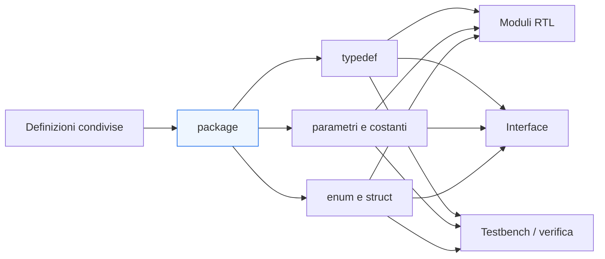
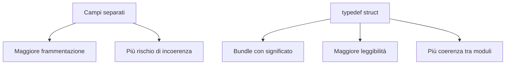

# Package e typedef in SystemVerilog

Dopo aver introdotto le `interface` come strumento per organizzare i collegamenti tra moduli, il passo successivo naturale è affrontare l’organizzazione delle **definizioni condivise** all’interno del progetto. In una base RTL che cresce, infatti, non basta strutturare bene i segnali di interfaccia: diventa fondamentale mantenere coerenti anche:
- tipi;
- costanti;
- enumerazioni;
- strutture dati;
- parametri comuni;
- definizioni usate da più moduli e, spesso, anche dall’ambiente di verifica.

In SystemVerilog, due strumenti centrali per questo scopo sono:
- `package`
- `typedef`

Questi costrutti permettono di ridurre duplicazioni, migliorare la leggibilità, rendere più chiara la semantica dei segnali e mantenere allineati **RTL**, **interfacce** e **verifica**. Dal punto di vista metodologico, rappresentano uno dei passaggi con cui un progetto smette di essere una semplice raccolta di moduli isolati e diventa una base codice più coerente, riusabile e manutenibile.

Questa pagina introduce `package` e `typedef` con un taglio progettuale, mettendo in evidenza il loro impatto su:
- qualità del codice;
- modularità;
- riuso;
- leggibilità delle interfacce;
- coerenza tra design e testbench;
- robustezza del flusso su FPGA e ASIC.

## 1. Perché servono definizioni condivise

Quando un progetto è molto piccolo, può sembrare sufficiente definire tutto localmente dentro ogni modulo. Ma appena la complessità cresce, questo approccio diventa fragile.

### 1.1 Problemi delle definizioni locali duplicate
Se più moduli definiscono in modo autonomo:
- la stessa codifica di stati;
- lo stesso formato di un bus;
- la stessa costante di configurazione;
- la stessa struttura dati;
- la stessa lista di opcodes o tipi di transazione;

si rischiano facilmente:
- incoerenze;
- errori di manutenzione;
- divergenze tra RTL e testbench;
- scarsa leggibilità del progetto.

### 1.2 Necessità di una fonte unica
Una base codice ordinata tende a definire certi elementi una sola volta, in un punto condiviso, per poi riusarli dove serve.

### 1.3 Collegamento con la crescita del progetto
Più il progetto cresce in:
- numero di moduli;
- numero di interfacce;
- livello di integrazione;
- profondità della verifica;

più diventa importante avere definizioni centralizzate e semanticamente chiare.

## 2. Che cos’è un `package`

In SystemVerilog, un `package` è un contenitore di definizioni condivise che possono essere utilizzate da più parti del progetto.

### 2.1 Cosa può contenere
Un `package` può contenere:
- `typedef`
- `enum`
- `struct`
- `union`
- `parameter` e `localparam`
- costanti
- funzioni
- task
- dichiarazioni utili in più moduli o ambienti di verifica

### 2.2 Significato progettuale
Dal punto di vista metodologico, un `package` è il luogo in cui si raccolgono elementi comuni del progetto che non appartengono a un singolo modulo, ma all’ecosistema RTL nel suo insieme.

### 2.3 Perché è utile
Un `package` permette di:
- centralizzare le definizioni;
- ridurre duplicazioni;
- rendere più facile il riuso;
- mantenere coerenza tra moduli diversi;
- semplificare aggiornamenti e manutenzione.

## 3. Che cos’è un `typedef`

`typedef` permette di assegnare un nome a un tipo. Questo è molto utile quando il tipo ha un significato progettuale e non deve essere trattato soltanto come una forma anonima di bit.

### 3.1 Valore semantico del tipo
Un vettore di bit può rappresentare:
- un dato;
- un indirizzo;
- uno stato;
- un opcode;
- un identificatore;
- una struttura di controllo.

Senza `typedef`, questi ruoli possono restare impliciti. Con `typedef`, il codice può esprimere meglio il significato del segnale.

### 3.2 Benefici pratici
Usare `typedef` aiuta a:
- migliorare leggibilità;
- evitare ripetizioni;
- uniformare la dichiarazione dei segnali;
- rendere più chiaro l’intento progettuale;
- allineare meglio moduli e interfacce.

### 3.3 Non è solo una scorciatoia
`typedef` non va visto soltanto come abbreviazione sintattica. In un progetto ben strutturato, serve a dare **identità progettuale** ai tipi.

## 4. `typedef` come strumento di modellazione

L’uso di `typedef` è particolarmente utile quando si vuole costruire una RTL leggibile come descrizione di un sistema, non come semplice lista di bit.

### 4.1 Tipi con significato
È diverso dichiarare un segnale come:
- “un vettore di N bit”
oppure come:
- “un tipo che rappresenta un campo di controllo”
- “un tipo che rappresenta lo stato della FSM”
- “un tipo che rappresenta il payload di una transazione”

### 4.2 Effetto sulla leggibilità
Con tipi nominati:
- il codice è più autoesplicativo;
- le interfacce diventano più chiare;
- i moduli esprimono meglio il proprio ruolo;
- la documentazione implicita del design migliora.

### 4.3 Effetto sulla manutenzione
Se la dimensione o la forma di un tipo cambiano, una definizione centralizzata evita di dover aggiornare manualmente molte dichiarazioni sparse.

## 5. `typedef enum` per stati e codifiche simboliche

Uno degli usi più naturali di `typedef` in SystemVerilog è la definizione di `enum`, soprattutto per FSM e campi di controllo.

### 5.1 Perché è importante
Gli stati di una FSM hanno un significato logico e dovrebbero essere trattati come simboli, non come numeri privi di contesto.

### 5.2 Benefici di `typedef enum`
L’uso di `typedef enum`:
- migliora la leggibilità della RTL;
- rende più chiare le waveform;
- riduce errori da costanti numeriche sparse;
- aiuta a mantenere coerenza tra moduli e verifica.

### 5.3 Oltre le FSM
Le enumerazioni possono essere utili anche per:
- tipi di operazione;
- categorie di pacchetti;
- esiti di una transazione;
- modalità operative di un blocco.

## 6. `typedef struct` per raggruppare informazioni correlate

Un altro uso molto importante di `typedef` è la definizione di `struct`, utile quando più campi fanno parte dello stesso oggetto logico.

### 6.1 Perché serve
In molti casi un trasferimento o un’informazione interna non è un singolo vettore, ma un insieme di campi:
- dato;
- indirizzo;
- codice operazione;
- bit di validità;
- flag;
- identificatore.

### 6.2 Benefici di `typedef struct`
Usare una struttura:
- raggruppa campi correlati;
- rende più leggibile il significato del bundle;
- riduce errori di cablaggio;
- aiuta a mantenere allineati i campi tra moduli diversi.

### 6.3 Collegamento con interfacce e pipeline
Le `struct` sono particolarmente utili per:
- payload trasportati da un’interfaccia;
- dati e metadati che attraversano una pipeline;
- canali di richiesta e risposta;
- descrizione ordinata di informazioni di stato o contesto.

## 7. Package come punto di incontro tra moduli, interfacce e verifica

Uno degli aspetti più importanti di `package` è che può essere usato come livello comune tra più parti del progetto.

### 7.1 Moduli RTL
I moduli possono condividere:
- tipi di stato;
- formati di bus;
- parametri comuni;
- codifiche di controllo.

### 7.2 Interface
Le interfacce possono usare gli stessi tipi definiti nel package, migliorando coerenza tra:
- payload trasportato;
- segnali del protocollo;
- semantica del collegamento.

### 7.3 Testbench
La verifica può usare le stesse definizioni per:
- generare transazioni coerenti;
- controllare campi e significati;
- costruire checker e monitor;
- mantenere allineamento con la RTL.

### 7.4 Beneficio sistemico
Il package diventa così una sorta di “vocabolario tecnico condiviso” del progetto.

## 8. Coerenza progettuale e riduzione degli errori

L’uso corretto di package e typedef riduce una grande categoria di errori strutturali.

### 8.1 Errori da duplicazione
Se la stessa definizione è copiata in più punti, un aggiornamento può essere applicato in modo incompleto.

### 8.2 Errori da interpretazione
Se un segnale è dichiarato solo come vettore anonimo, il suo significato può essere interpretato in modo diverso da modulo a modulo.

### 8.3 Errori di integrazione
Quando interfacce e moduli condividono tipi centralizzati, il rischio di mismatch diminuisce.

### 8.4 Beneficio per la review
Un reviewer riesce a capire più facilmente il progetto se:
- i tipi hanno nomi significativi;
- le definizioni comuni sono centralizzate;
- i moduli usano un linguaggio coerente.

## 9. `package` e organizzazione del progetto

L’introduzione di package è anche una questione di organizzazione dell’intera base codice.

### 9.1 Dal modulo isolato al progetto strutturato
Con i package, si passa da una logica in cui ogni file è quasi autosufficiente a una logica in cui esiste una struttura condivisa del progetto.

### 9.2 Ordine e layering
È utile distinguere tra:
- definizioni globali condivise;
- definizioni locali di un sottoblocco;
- tipi specifici di un protocollo;
- costanti legate a una certa famiglia di moduli.

### 9.3 Manutenzione
Una buona organizzazione dei package rende più facile:
- evolvere il design;
- introdurre nuovi moduli;
- allineare la verifica;
- documentare il progetto.

## 10. Effetti su leggibilità e documentazione implicita

Uno dei vantaggi più concreti di package e typedef è che migliorano la **leggibilità semantica** della RTL.

### 10.1 Codice più autoesplicativo
Nomi di tipo ben scelti aiutano a leggere la RTL come descrizione del sistema:
- che cosa rappresenta un segnale;
- quale ruolo ha una struttura;
- quali campi compongono un bundle;
- quale insieme di valori è ammesso.

### 10.2 Documentazione distribuita nel codice
Quando i tipi sono nominati bene e condivisi in un package, il codice stesso diventa una forma più robusta di documentazione tecnica.

### 10.3 Beneficio sul lungo periodo
Questo diventa particolarmente importante quando:
- il progetto viene mantenuto nel tempo;
- nuove persone entrano nel team;
- si fanno review o debug a distanza di mesi;
- si riutilizzano blocchi in contesti diversi.

## 11. Effetti sulla verifica

Package e typedef sono molto utili anche in verifica, perché aiutano a parlare lo stesso linguaggio tra design e testbench.

### 11.1 Allineamento tra DUT e testbench
Se i tipi usati per payload, opcodes o stati sono definiti una sola volta, design e verifica restano più facilmente coerenti.

### 11.2 Checker più leggibili
Un monitor o una assertion che usa tipi con significato è più leggibile di uno basato solo su bit anonimi.

### 11.3 Meno ambiguità
La verifica beneficia del fatto che:
- i campi sono strutturati;
- i nomi sono coerenti;
- le enumerazioni sono condivise;
- il protocollo può essere osservato con semantica più chiara.

### 11.4 Valore nei progetti grandi
Quando la complessità cresce, il package aiuta a evitare che RTL e verifica evolvano in modo divergente.

## 12. Effetti sul timing e sull’implementazione

Dal punto di vista fisico, package e typedef non modificano direttamente il comportamento temporale del circuito, ma hanno effetti indiretti molto importanti.

### 12.1 Nessun beneficio automatico sul timing
Definire un tipo in modo più pulito non migliora da solo il cammino critico o la Fmax.

### 12.2 Beneficio indiretto
Tuttavia, una base codice meglio organizzata:
- riduce errori di modellazione;
- rende più leggibili le interfacce;
- aiuta a identificare meglio il contenuto dei bundle;
- facilita la revisione dei segnali che attraversano i confini di modulo.

### 12.3 Impatto su FPGA e ASIC
Questo è utile sia in:
- **FPGA**, dove il debug e l’integrazione rapida beneficiano di codice più chiaro;
- **ASIC**, dove la tracciabilità e la coerenza dei segnali sono importanti lungo sintesi, DFT, integrazione e backend.

## 13. Package, interfacce e payload strutturati

Dopo la pagina sulle `interface`, è importante evidenziare il collegamento naturale con package e typedef.

### 13.1 Interfaccia come contenitore del canale
L’`interface` raccoglie i segnali del collegamento.

### 13.2 Package come contenitore delle definizioni comuni
Il `package` raccoglie i tipi che danno significato ai segnali trasportati.

### 13.3 Combinazione molto potente
Quando un’`interface` usa `typedef struct` definiti in un `package`, il progetto ottiene:
- migliore leggibilità;
- payload più coerenti;
- minori errori di integrazione;
- miglior dialogo tra RTL e verifica.

Questa combinazione è particolarmente utile in:
- interfacce pipelined;
- canali request/response;
- bus interni;
- protocolli custom.

## 14. Errori comuni

L’uso di package e typedef è molto utile, ma può essere degradato da alcune cattive pratiche.

### 14.1 Usare package senza criterio
Un package troppo generico o disordinato può diventare difficile da leggere e mantenere.

### 14.2 Creare typedef senza significato reale
Se i nomi dei tipi non aggiungono informazione progettuale, il beneficio diminuisce.

### 14.3 Duplicare comunque le definizioni
Se alcune parti del progetto continuano a usare versioni locali modificate degli stessi tipi, si perde la coerenza.

### 14.4 Nascondere troppo la struttura
L’astrazione non deve cancellare la comprensione dell’hardware. Bisogna mantenere chiaro:
- quali campi esistono;
- quanto sono larghi;
- come attraversano moduli e pipeline;
- quali implicazioni hanno su timing e integrazione.

### 14.5 Non coordinare design e verifica
Se RTL e testbench non importano davvero le stesse definizioni, si torna al problema iniziale della divergenza.

## 15. Buone pratiche di modellazione

Per usare bene `package` e `typedef` in SystemVerilog, alcune pratiche sono particolarmente efficaci.

### 15.1 Centralizzare solo ciò che è davvero condiviso
Conviene mettere nel package ciò che appartiene davvero a più moduli o a un protocollo comune.

### 15.2 Dare nomi con significato architetturale
I tipi dovrebbero riflettere il ruolo funzionale degli oggetti che rappresentano.

### 15.3 Usare `enum` e `struct` per aumentare chiarezza
Questi costrutti aiutano a trasformare il codice da lista di bit a descrizione più semantica del sistema.

### 15.4 Mantenere allineati moduli, interface e testbench
Le definizioni comuni dovrebbero essere davvero condivise, non replicate.

### 15.5 Pensare alla crescita del progetto
Un buon package non serve solo oggi: serve a mantenere il progetto leggibile anche quando la base codice crescerà.

## 16. Collegamento con il resto della sezione

Questa pagina si collega direttamente a più temi già introdotti:
- **`fsm.md`** e **`state-encoding.md`** hanno mostrato il valore di stati e codifiche simboliche;
- **`interfaces-and-handshake.md`** ha introdotto il ruolo architetturale delle interfacce;
- **`systemverilog-interfaces.md`** ha mostrato come il linguaggio organizza i collegamenti;
- **`datapath-and-control.md`** e **`pipelining.md`** hanno evidenziato la necessità di mantenere coerenti dati, metadati e controllo.

Package e typedef rappresentano quindi il livello che tiene insieme l’organizzazione semantica dell’intero progetto.

## 17. In sintesi

`package` e `typedef` sono strumenti centrali per strutturare un progetto SystemVerilog in modo più coerente, leggibile e riusabile. Permettono di:
- centralizzare definizioni condivise;
- dare significato ai tipi;
- ridurre duplicazioni;
- mantenere allineati moduli, interfacce e verifica;
- rendere più robusta la manutenzione del codice.

L’uso di `typedef enum` e `typedef struct` è particolarmente importante perché consente di descrivere stati, payload e bundle di segnali in modo più semantico e più vicino all’architettura reale del sistema.

Per questo motivo, package e typedef non sono semplici comodità sintattiche: sono uno dei fondamenti della costruzione di una base RTL ordinata e professionale, adatta sia a flussi FPGA sia a flussi ASIC.

## Prossimo passo

Il passo più naturale ora è **`arrays-and-generate.md`**, perché dopo aver strutturato tipi e definizioni condivise conviene affrontare gli strumenti che permettono di scalare il progetto:
- array packed e unpacked
- vettori di istanze
- generate
- parametrizzazione strutturale
- costruzione di architetture ripetitive e configurabili

In alternativa, un altro passo molto naturale è **`latency-and-throughput.md`**, se vuoi restare ancora sul ramo architetturale e prestazionale iniziato con pipeline e handshake.
