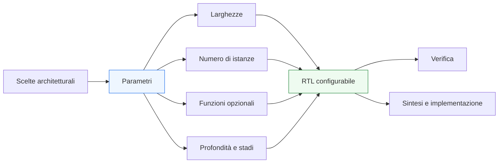
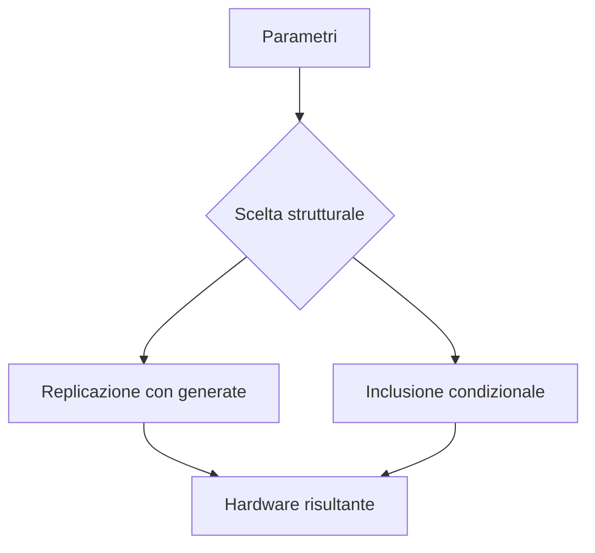

# Parametri e configurazione in SystemVerilog

Dopo aver introdotto **array** e **`generate`**, il passo successivo naturale è approfondire il meccanismo che rende possibile la vera **configurabilità** di una descrizione RTL: l’uso dei **parametri**. In SystemVerilog, infatti, molti moduli non sono pensati per esistere in una sola forma fissa, ma per adattarsi a esigenze diverse in termini di:
- larghezza dei dati;
- numero di canali;
- profondità di strutture;
- numero di stadi;
- caratteristiche opzionali;
- varianti architetturali.

Questa capacità di adattamento è fondamentale sia in ambito **FPGA** sia in ambito **ASIC**, perché permette di costruire blocchi riusabili, di esplorare compromessi architetturali e di mantenere una sola base RTL capace di coprire più configurazioni significative.

Dal punto di vista metodologico, i parametri non sono solo una comodità per evitare costanti hard-coded. Sono uno strumento centrale per collegare:
- architettura;
- organizzazione della RTL;
- scalabilità strutturale;
- verifica;
- sintesi;
- implementazione fisica.

Questa pagina introduce `parameter`, `localparam` e i principali temi legati alla configurazione del progetto, con attenzione non solo alla sintassi, ma soprattutto al loro ruolo nella costruzione di una base codice ordinata, leggibile e progettualmente robusta.

## 1. Perché servono i parametri

Quando un modulo viene scritto in modo completamente fisso, ogni modifica architetturale richiede una riscrittura o una duplicazione del codice. Questo approccio diventa rapidamente inefficiente.

### 1.1 Problemi di una RTL rigida
Una descrizione troppo rigida può causare:
- duplicazione di moduli quasi identici;
- difficoltà nel riuso;
- maggiore rischio di errori tra versioni simili;
- scarsa capacità di esplorare alternative architetturali;
- minore coerenza tra varianti del progetto.

### 1.2 Obiettivo della configurazione
I parametri permettono di scrivere una descrizione più generale, in cui alcuni aspetti sono lasciati configurabili. Questo è utile quando:
- la stessa struttura deve esistere con larghezze diverse;
- il numero di canali cambia tra versioni;
- una funzione può essere attivata o esclusa;
- la profondità della pipeline dipende dagli obiettivi di prestazione;
- il blocco viene riusato in contesti diversi.

### 1.3 Vantaggio progettuale
La parametrizzazione rende il progetto più vicino alla sua natura architetturale reale: non un blocco isolato e immutabile, ma una famiglia controllata di implementazioni correlate.

## 2. Che cos’è un `parameter`

In SystemVerilog, un `parameter` è una costante configurabile associata a un modulo, un’interfaccia o altre entità del linguaggio, e può essere usata per controllarne struttura e comportamento statico.

### 2.1 Significato fondamentale
Un parametro rappresenta una scelta definita **prima** della realizzazione dell’hardware. Non cambia dinamicamente durante il funzionamento del circuito, ma contribuisce a determinarne la forma finale.

### 2.2 Che cosa può controllare
Un parametro può essere usato per definire:
- larghezza di bus;
- numero di elementi in un array;
- numero di istanze generate;
- profondità di code o storage;
- presenza o assenza di funzioni opzionali;
- costanti di progetto;
- limiti, soglie e dimensionamenti.

### 2.3 Parametro come leva architetturale
Un parametro non è solo un valore numerico: è spesso l’espressione RTL di una scelta architetturale.

## 3. Che cos’è un `localparam`

Accanto a `parameter`, SystemVerilog mette a disposizione `localparam`, che rappresenta una costante locale non pensata per essere ridefinita dall’esterno.

### 3.1 Ruolo di `localparam`
`localparam` è utile quando si vuole definire:
- un valore derivato da altri parametri;
- una costante interna al modulo;
- una grandezza ausiliaria che non deve essere modificata da fuori;
- una convenzione locale della struttura RTL.

### 3.2 Differenza concettuale rispetto a `parameter`
In modo semplice:
- `parameter` esprime qualcosa che il progettista dell’istanza può configurare;
- `localparam` esprime qualcosa che il modulo usa internamente come valore fisso o derivato.

### 3.3 Valore metodologico
Questa distinzione aiuta a capire quali aspetti fanno parte dell’interfaccia configurabile del modulo e quali invece appartengono alla sua implementazione interna.

## 4. Parametri come parte dell’interfaccia del modulo

Uno dei punti più importanti da fissare è che i parametri fanno parte, in un certo senso, dell’**interfaccia progettuale** del modulo.

### 4.1 Oltre le porte
Le porte descrivono i segnali con cui il modulo comunica durante il funzionamento. I parametri descrivono invece:
- la forma del modulo;
- le sue dimensioni;
- alcune sue varianti strutturali;
- i limiti entro cui il modulo è pensato per essere usato.

### 4.2 Significato di progetto
Per questo motivo, la scelta dei parametri di un modulo dovrebbe essere progettata con attenzione, non improvvisata.

### 4.3 Buona pratica
Un modulo ben costruito tende ad avere:
- pochi parametri davvero utili;
- parametri con nomi chiari;
- significato architetturale ben definito;
- relazioni interne ben controllate tramite `localparam`.

## 5. Parametri per larghezze e dimensionamento

Uno degli usi più comuni e naturali dei parametri è il controllo delle larghezze.

### 5.1 Larghezza dei dati
Molti moduli devono poter lavorare su:
- 8 bit;
- 16 bit;
- 32 bit;
- 64 bit;
- o altre larghezze dipendenti dal contesto.

### 5.2 Larghezza di indirizzi o contatori
Anche:
- indirizzi;
- indici;
- contatori;
- campi di tag;
- identificatori

possono dipendere da parametri architetturali.

### 5.3 Beneficio progettuale
Parametrizzare le larghezze aiuta a:
- riusare la stessa struttura in più contesti;
- mantenere coerenza tra varianti;
- esplorare costi e prestazioni;
- evitare modifiche manuali invasive.

### 5.4 Attenzione metodologica
La larghezza non è solo un dettaglio numerico: può influenzare area, timing, profondità della logica, numero di bit di controllo e comportamento di interfacce e pipeline.

## 6. Parametri per numero di istanze e parallelismo

Un altro uso molto importante dei parametri è il controllo del **numero di copie strutturali** di una certa risorsa.

### 6.1 Canali paralleli
Un blocco può avere:
- 1 canale;
- 2 canali;
- 4 canali;
- 8 canali;

a seconda degli obiettivi di throughput o integrazione.

### 6.2 Unità replicate
Si possono parametrizzare:
- numero di lane;
- numero di istanze di un sottoblocco;
- numero di porte;
- numero di stage identici;
- numero di entry in una struttura regolare.

### 6.3 Legame con array e `generate`
Questo tipo di configurazione si combina naturalmente con:
- array, per rappresentare gli insiemi di segnali;
- `generate`, per costruire l’hardware ripetuto.

### 6.4 Impatto architetturale
Il parametro che controlla il parallelismo è spesso una delle scelte più importanti del progetto, perché influisce su:
- throughput;
- area;
- potenza;
- fanout;
- complessità del controllo.

## 7. Parametri per funzioni opzionali e varianti architetturali

I parametri non servono solo a cambiare dimensioni: possono anche selezionare diverse forme della struttura.

### 7.1 Funzionalità opzionali
Un modulo può prevedere opzioni come:
- pipeline attivata o no;
- canale di errore presente o no;
- supporto a una modalità estesa;
- inclusione di logica di buffering;
- abilitazione di monitoraggio o statistiche interne.

### 7.2 Varianti architetturali
Alcuni parametri possono determinare vere scelte strutturali, come:
- presenza di uno stadio aggiuntivo;
- tipo di organizzazione del datapath;
- inclusione di logiche alternative;
- modalità compatta o prestazionale del blocco.

### 7.3 Uso consapevole
Questa flessibilità è potente, ma deve essere usata con disciplina, perché troppe varianti possono rendere la verifica e la manutenzione molto più difficili.

## 8. Parametri, `localparam` e relazioni derivate

In un progetto ben organizzato, molti valori interni non dovrebbero essere parametrizzati direttamente, ma derivati da un insieme più piccolo di parametri principali.

### 8.1 Valori derivati
Per esempio, può essere naturale derivare:
- larghezza di un indice;
- profondità di un contatore;
- numero di bit necessari a codificare un insieme di elementi;
- costanti di supporto;
- limiti interni usati dalla struttura.

### 8.2 Perché usare `localparam`
Usare `localparam` per questi valori:
- evita configurazioni incoerenti;
- rende più chiaro cosa è davvero esterno e cosa è interno;
- semplifica la manutenzione;
- riduce il rischio di errori di override.

### 8.3 Struttura progettuale più pulita
Il risultato è un modulo con:
- interfaccia configurabile compatta;
- implementazione interna coerente;
- relazioni tra dimensioni più facili da seguire.

## 9. Parametri e leggibilità della RTL

Uno dei vantaggi principali della parametrizzazione ben fatta è che migliora la qualità generale del codice.

### 9.1 Riduzione delle costanti sparse
Un modulo con molte costanti numeriche “magiche” è più difficile da capire, mantenere e adattare.

### 9.2 Chiarezza dell’intento
Un parametro ben nominato rende esplicito:
- che cosa è variabile;
- quale aspetto del blocco controlla;
- quale dimensione architetturale rappresenta.

### 9.3 Coerenza tra moduli
Quando più moduli usano parametri e tipi coerenti, il progetto risulta molto più uniforme e comprensibile.

### 9.4 Equilibrio necessario
Parametrizzare tutto indiscriminatamente non migliora la leggibilità. Serve invece una scelta attenta di ciò che ha davvero senso rendere configurabile.

## 10. Parametri e riuso

La parametrizzazione è uno degli strumenti più forti per ottenere riuso reale.

### 10.1 Riuso del modulo
Un modulo configurabile può essere usato:
- in versioni leggere;
- in versioni più larghe;
- in versioni a più canali;
- in versioni con diverse opzioni strutturali.

### 10.2 Riuso dell’architettura
La stessa architettura può essere adattata a prodotti o contesti diversi senza dover riscrivere da zero la RTL.

### 10.3 Beneficio di manutenzione
Avere una sola base codice parametrica è spesso preferibile rispetto ad avere molte varianti copiate e modificate manualmente.

### 10.4 Limite da ricordare
Il riuso utile non coincide con la massima genericità possibile. Un modulo troppo generalizzato può diventare meno leggibile e più difficile da verificare.

## 11. Parametri, `generate` e costruzione strutturale

I parametri esprimono il “che cosa varia”, mentre `generate` costruisce l’hardware corrispondente.

### 11.1 Ruolo combinato
Molte configurazioni strutturali si realizzano con la coppia:
- parametro che controlla la variante;
- `generate` che seleziona o replica la struttura.

### 11.2 Esempi concettuali
Questo vale per:
- numero di canali;
- numero di istanze;
- presenza di blocchi opzionali;
- configurazione di pipeline;
- strutture a profondità variabile.

### 11.3 Beneficio architetturale
L’uso combinato di parametri e `generate` consente di trasformare una famiglia di scelte progettuali in una sola descrizione RTL coerente.

## 12. Parametri e verifica

La configurabilità del modulo ha un impatto diretto sulla verifica.

### 12.1 Verifica di più configurazioni
Se un modulo è parametrico, bisogna decidere:
- quali configurazioni sono supportate;
- quali configurazioni sono effettivamente usate;
- quali configurazioni devono essere verificate in regressione.

### 12.2 Rischio di esplosione combinatoria
Se il numero di parametri e combinazioni cresce troppo, la verifica può diventare molto più complessa.

### 12.3 Strategia realistica
In pratica, conviene distinguere tra:
- configurazioni teoricamente possibili;
- configurazioni ufficialmente supportate;
- configurazioni realmente usate nel prodotto.

### 12.4 Beneficio della progettazione disciplinata
Una parametrizzazione ben pensata aiuta la verifica perché mantiene:
- significato chiaro dei parametri;
- relazioni interne controllate;
- minore spazio di configurazioni inutilmente ambiguo.

## 13. Parametri e timing

Le scelte configurabili hanno quasi sempre conseguenze temporali.

### 13.1 Aumento delle larghezze
Un dato più largo può:
- aumentare la logica combinatoria;
- modificare il fanout;
- cambiare la profondità di certi operatori;
- influire sulla frequenza raggiungibile.

### 13.2 Aumento del parallelismo
Più istanze o più canali possono:
- aumentare area e routing;
- alzare il fanout di segnali di controllo;
- complicare la distribuzione del clock;
- richiedere floorplanning più attento.

### 13.3 Funzioni opzionali
L’introduzione di pipeline, buffering o logiche alternative può migliorare o peggiorare il timing a seconda del caso.

### 13.4 Conclusione progettuale
Per questo motivo, i parametri devono essere letti non solo come numeri astratti, ma come scelte che modificano il comportamento fisico del blocco.

## 14. Parametri e implementazione FPGA

Su FPGA, la parametrizzazione è molto utile perché consente di adattare il design alle risorse disponibili e agli obiettivi di frequenza.

### 14.1 Vantaggi pratici
È utile per:
- scalare larghezze di datapath;
- adattare il numero di lane o canali;
- selezionare profondità di pipeline;
- attivare o disattivare funzionalità.

### 14.2 Impatto reale
Ogni configurazione può cambiare:
- utilizzo di LUT;
- utilizzo di flip-flop;
- uso di DSP o BRAM;
- complessità del routing;
- timing closure.

### 14.3 Disciplina necessaria
Per questo, le configurazioni usate su FPGA vanno sempre valutate con:
- report di sintesi;
- report di timing;
- verifica delle risorse;
- prove di integrazione reali.

## 15. Parametri e implementazione ASIC

Anche su ASIC i parametri sono molto importanti, ma le conseguenze strutturali devono essere valutate con ancora maggiore attenzione.

### 15.1 Area e potenza
Configurazioni diverse possono modificare in modo sensibile:
- numero di celle;
- area;
- carico del clock tree;
- potenza dinamica e statica.

### 15.2 Timing e backend
Varianti di larghezza, parallelismo o pipeline influenzano:
- sintesi;
- fanout;
- floorplanning;
- PnR;
- CTS;
- signoff.

### 15.3 Ruolo nel progetto ASIC
Nel flusso ASIC, la parametrizzazione è molto utile nelle fasi di esplorazione architetturale e definizione del blocco, ma le configurazioni finali devono essere chiaramente fissate e verificate con attenzione lungo tutto il backend.

## 16. Errori comuni

Alcuni errori ricorrono spesso nell’uso dei parametri.

### 16.1 Parametrizzare troppo
Rendere configurabile ogni dettaglio può produrre:
- moduli difficili da leggere;
- troppe combinazioni da verificare;
- maggiore rischio di inconsistenze.

### 16.2 Parametrizzare troppo poco
Al contrario, una parametrizzazione insufficiente può impedire il riuso e costringere a duplicazioni inutili.

### 16.3 Parametri con significato poco chiaro
Se il nome o il ruolo di un parametro non sono evidenti, il modulo diventa più difficile da usare correttamente.

### 16.4 Esporre parametri che dovrebbero essere interni
Valori derivati o dettagli implementativi dovrebbero spesso essere `localparam`, non `parameter`.

### 16.5 Non valutare le configurazioni reali
Una configurazione teoricamente possibile ma mai verificata può diventare una fonte di problemi nascosti.

## 17. Buone pratiche di modellazione

Per usare bene `parameter` e `localparam` in SystemVerilog, alcune pratiche sono particolarmente efficaci.

### 17.1 Parametrizzare solo gli aspetti architetturalmente significativi
Conviene rendere configurabili gli aspetti che rappresentano vere decisioni progettuali.

### 17.2 Usare `localparam` per i valori derivati
Questo mantiene l’interfaccia del modulo più pulita e riduce il rischio di configurazioni incoerenti.

### 17.3 Dare nomi espliciti
I parametri dovrebbero essere leggibili come parte della documentazione del modulo.

### 17.4 Pensare alla verifica fin dall’inizio
Ogni parametro aggiunge spazio di configurazione, e quindi potenziale complessità di verifica.

### 17.5 Misurare sulle configurazioni reali
Timing, area e utilizzo risorse devono essere valutati sulle configurazioni effettivamente impiegate, non solo su quelle teoricamente possibili.

## 18. Collegamento con il resto della sezione

Questa pagina si collega direttamente ai temi introdotti nelle pagine precedenti:
- **`arrays-and-generate.md`** ha mostrato come costruire strutture scalabili e replicate;
- **`packages-and-typedefs.md`** ha organizzato tipi e definizioni condivise;
- **`systemverilog-interfaces.md`** ha strutturato i collegamenti tra moduli;
- **`datapath-and-control.md`** e **`pipelining.md`** hanno evidenziato come larghezze, stadi e parallelismo siano scelte architetturali reali.

I parametri sono il punto in cui tutte queste dimensioni diventano configurabili in modo controllato.

## 19. In sintesi

I parametri sono uno degli strumenti più importanti di SystemVerilog per costruire una RTL scalabile, riusabile e coerente con l’architettura del progetto. Permettono di controllare:
- dimensioni;
- numero di elementi;
- varianti strutturali;
- opzioni funzionali;
- compromessi tra area, timing e prestazioni.

La distinzione tra `parameter` e `localparam` aiuta a mantenere chiara la separazione tra:
- ciò che è configurabile dall’esterno;
- ciò che appartiene all’implementazione interna del modulo.

Usati con disciplina, i parametri rendono possibile una progettazione più matura e professionale, adatta sia all’esplorazione architetturale sia alla costruzione di blocchi robusti per FPGA e ASIC.

## Prossimo passo

Il passo più naturale ora è **`latency-and-throughput.md`**, perché dopo aver consolidato parametrizzazione, pipeline e handshake conviene fissare in modo sistematico il rapporto tra:
- latenza;
- throughput;
- parallelismo;
- buffering;
- prestazioni di sistema;
- implicazioni su timing e architettura.

In alternativa, un altro passo molto naturale è **`coding-style-rtl.md`**, se vuoi aprire il ramo più metodologico dedicato a convenzioni di scrittura, leggibilità e qualità della RTL SystemVerilog.
