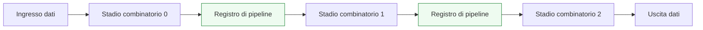
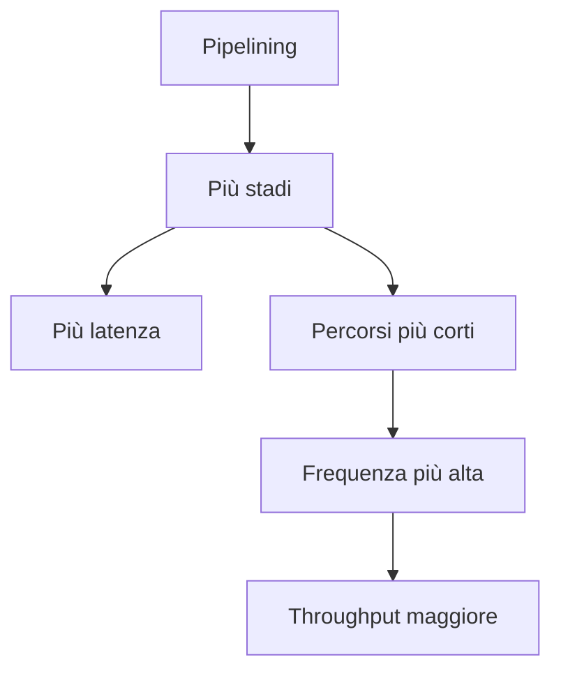

# Pipeline e pipelining

Dopo aver distinto tra **datapath** e **controllo**, il passo successivo naturale è capire come un percorso dati possa essere suddiviso in più stadi temporali per migliorare le prestazioni complessive del blocco. Questa tecnica prende il nome di **pipelining** ed è uno dei concetti più importanti in tutta la progettazione digitale, perché collega in modo diretto:
- architettura;
- RTL;
- timing;
- verifica;
- implementazione su FPGA;
- implementazione su ASIC.

Il pipelining non è soltanto una tecnica di ottimizzazione locale. È una scelta architetturale che modifica il modo in cui il dato attraversa il blocco, il numero di cicli necessari per ottenere un risultato e la struttura dei percorsi critici. Per questo motivo, comprenderlo bene è fondamentale per scrivere RTL capace di tradursi in hardware efficiente e temporizzabile.

## 1. Che cos’è una pipeline

Una pipeline è una struttura in cui un’elaborazione viene suddivisa in più **stadi**, separati da registri. Ogni stadio esegue una parte del lavoro, mentre i registri di pipeline memorizzano i risultati intermedi e li trasferiscono allo stadio successivo al clock seguente.

### 1.1 Idea di base
Senza pipeline, un blocco può eseguire una lunga catena combinatoria tra due registri. Con la pipeline, quella catena viene spezzata in più parti:
- meno logica per stadio;
- più registri intermedi;
- minore ritardo per ogni tratto combinatorio;
- maggiore frequenza raggiungibile.

### 1.2 Visione temporale
Il dato non attraversa più tutto il blocco in un solo ciclo. Attraversa invece:
- uno stadio nel primo ciclo;
- uno stadio nel secondo;
- uno stadio nel terzo;
- e così via.

### 1.3 Visione architetturale
La pipeline trasforma un’elaborazione monolitica in una sequenza di fasi temporali coordinate. Per questo motivo è uno strumento architetturale, non soltanto un dettaglio di implementazione.

## 2. Perché il pipelining è importante

Il pipelining è importante perché permette di gestire meglio il compromesso tra:
- frequenza di clock;
- latenza;
- throughput;
- complessità di controllo;
- area;
- potenza.

### 2.1 Miglioramento del timing
Il vantaggio più immediato è la riduzione del percorso combinatorio tra registri, che aiuta la chiusura temporale.

### 2.2 Maggiore throughput
Una volta riempita la pipeline, il blocco può produrre risultati con maggiore regolarità, spesso uno per ciclo o con ritmo più elevato rispetto a una struttura non pipelined.

### 2.3 Costo architetturale
Questo beneficio ha però un costo:
- più registri;
- più latenza;
- maggiore complessità nella gestione dei segnali di controllo;
- necessità di allineare dati, validità e dipendenze.

### 2.4 Collegamento ai flussi reali
Il pipelining è fondamentale sia in:
- **FPGA**, dove aiuta a contenere routing e profondità logica;
- **ASIC**, dove è spesso necessario per raggiungere obiettivi di frequenza e timing closure.

## 3. Pipeline, latenza e throughput

Per capire davvero il pipelining, bisogna distinguere con chiarezza due concetti che spesso vengono confusi: **latenza** e **throughput**.

### 3.1 Latenza
La latenza è il tempo necessario affinché un dato attraversi il blocco e produca un risultato. In una pipeline a più stadi, la latenza aumenta perché il dato richiede più cicli per raggiungere l’uscita.

### 3.2 Throughput
Il throughput indica quanto frequentemente il blocco può produrre risultati. Una pipeline ben progettata può aumentare il throughput perché, mentre un dato è in uno stadio avanzato, nuovi dati possono già entrare negli stadi iniziali.

### 3.3 Distinzione fondamentale
Una pipeline spesso:
- **aumenta la latenza**
- **migliora il throughput**
- **migliora la frequenza massima**

Questa distinzione è uno dei punti più importanti da fissare.

## 4. Pipeline come spezzatura del cammino critico

Uno dei motivi principali per cui si introduce una pipeline è ridurre il **cammino critico**.

### 4.1 Cammino critico senza pipeline
In una struttura non pipelined, il percorso più lungo può includere:
- molti mux;
- operatori aritmetici;
- comparatori;
- logiche di selezione;
- fanout elevato.

Questo rende difficile rispettare il periodo di clock desiderato.

### 4.2 Effetto della pipeline
Inserendo registri intermedi, si suddivide il percorso:
- ogni stadio esegue meno lavoro combinatorio;
- il ritardo per stadio diminuisce;
- la frequenza massima raggiungibile aumenta.

### 4.3 Non è una soluzione magica
Il pipelining non risolve automaticamente tutti i problemi. Se i registri sono inseriti male, o se il controllo non viene adattato, si possono introdurre:
- squilibri tra stadi;
- percorsi critici spostati ma non eliminati;
- fanout peggiori;
- aumento inutile di latenza.

## 5. Struttura RTL di una pipeline

Dal punto di vista RTL, una pipeline è un datapath organizzato in stadi separati da registri.

### 5.1 Logica combinatoria per stadio
Ogni stadio contiene una porzione della logica di elaborazione.

### 5.2 Registri di pipeline
Tra uno stadio e il successivo vengono inseriti registri che:
- memorizzano i risultati intermedi;
- sincronizzano il trasferimento;
- delimitano il confine temporale tra stadi.

### 5.3 Segnali associati ai dati
Oltre ai dati veri e propri, spesso devono essere propagati anche:
- bit di validità;
- segnali di controllo associati al dato;
- tag o identificatori;
- informazioni di eccezione o stato.

### 5.4 Visione completa
Una pipeline ben modellata non trasporta solo “numeri”, ma un insieme coerente di informazioni che devono avanzare allineate da uno stadio al successivo.

## 6. Bilanciamento degli stadi

Non basta introdurre registri: bisogna anche distribuire il lavoro in modo ragionevole tra gli stadi.

### 6.1 Stadi sbilanciati
Se uno stadio contiene molta più logica degli altri:
- il cammino critico può restare concentrato lì;
- la frequenza massima continuerà a essere limitata;
- il vantaggio del pipelining sarà ridotto.

### 6.2 Obiettivo del bilanciamento
L’obiettivo è avvicinare i ritardi dei diversi stadi, in modo che nessuno di essi diventi il collo di bottiglia dominante.

### 6.3 Bilanciamento e architettura
Il bilanciamento dipende da:
- struttura dell’algoritmo;
- costo delle operazioni;
- fanout;
- disponibilità di risorse dedicate;
- esigenze di interfaccia e controllo.

### 6.4 Aspetto pratico
Un buon bilanciamento richiede spesso iterazione tra:
- progetto architetturale;
- scrittura RTL;
- sintesi;
- analisi di timing.

## 7. Pipeline e controllo

Quando si introduce una pipeline, il controllo del blocco cambia. Non basta più sapere “quando parte” e “quando finisce” un’operazione: bisogna sapere **dove si trova il dato** in ogni ciclo.

### 7.1 Controllo della validità
Uno dei problemi centrali è tracciare quali stadi contengano dati validi. Questo porta all’uso di segnali come:
- `valid`
- `ready`
- `stall`
- `flush`

### 7.2 Sincronizzazione del controllo con i dati
Il controllo deve avanzare insieme al dato. Se il dato attraversa tre stadi, anche le informazioni di controllo associate devono attraversarli in modo coerente.

### 7.3 Pipeline semplice e pipeline controllata
Una pipeline molto semplice può avanzare automaticamente a ogni clock. Una pipeline più realistica, invece, può richiedere:
- abilitazioni condizionate;
- arresti temporanei;
- svuotamento di stadi;
- gestione di conflitti o dipendenze.

### 7.4 Interazione con FSM
In alcuni casi:
- la pipeline è controllata da una FSM;
- in altri casi, la pipeline stessa definisce un comportamento temporale regolare e il controllo si distribuisce nei vari stadi.

## 8. Valid, stall e flush

Questi tre concetti sono particolarmente importanti nelle pipeline reali.

### 8.1 Valid
`valid` indica se il contenuto di uno stadio è significativo. Questo è essenziale quando:
- la pipeline non è sempre piena;
- ci sono bolle o cicli senza dato utile;
- il risultato deve essere considerato solo in certe condizioni.

### 8.2 Stall
`stall` indica che uno stadio o l’intera pipeline devono fermarsi temporaneamente. Questo può accadere, per esempio, quando:
- uno stadio successivo non è pronto;
- c’è una dipendenza da un dato non ancora disponibile;
- una risorsa condivisa è occupata.

### 8.3 Flush
`flush` serve a invalidare dati presenti nella pipeline. È utile quando:
- si scopre che un dato non deve più essere elaborato;
- una condizione di errore richiede di svuotare il percorso;
- una decisione di controllo rende inutili i dati in volo.

### 8.4 Significato progettuale
Questi segnali mostrano che la pipeline non è soltanto una questione di registri, ma di **coordinamento temporale del flusso dei dati**.

## 9. Pipeline e dipendenze

Quando più dati avanzano contemporaneamente nella pipeline, possono emergere dipendenze che influenzano la correttezza del comportamento.

### 9.1 Dipendenze di dato
Una fase può aver bisogno di un risultato che non è ancora arrivato da uno stadio precedente o parallelo.

### 9.2 Dipendenze di controllo
Una decisione presa in uno stadio avanzato può richiedere di modificare il comportamento di stadi precedenti o successivi.

### 9.3 Effetti progettuali
Per gestire queste situazioni, il controllo può dover:
- ritardare l’avanzamento;
- bloccare una parte della pipeline;
- invalidare dati già inseriti;
- riallineare informazioni di contesto.

### 9.4 Collegamento con l’architettura
Le dipendenze mostrano che la pipeline è strettamente legata al modo in cui l’algoritmo o il protocollo sono stati partizionati in stadi.

## 10. Pipeline e datapath

Il pipelining è una forma particolarmente importante di organizzazione del datapath.

### 10.1 Registro come confine temporale
Ogni registro di pipeline segna il punto in cui:
- termina uno stadio;
- il risultato viene stabilizzato;
- inizia il tratto combinatorio successivo.

### 10.2 Mux e selezioni nei diversi stadi
In un datapath pipelined, le selezioni dati possono essere distribuite su più livelli invece di concentrarsi in un unico blocco combinatorio.

### 10.3 Trasporto dei metadati
Oltre ai dati, la pipeline deve trasportare:
- segnali di controllo;
- codici operazione;
- bit di validità;
- eventuali tag per la correlazione dei risultati.

### 10.4 Pipeline come struttura sistemica
Per questo motivo, la pipeline non riguarda solo un operatore o un percorso locale, ma spesso l’intera organizzazione del blocco RTL.

## 11. Effetti sulla verifica

Il pipelining migliora il timing, ma aumenta la complessità della verifica.

### 11.1 Verifica della latenza
Bisogna verificare che il dato esca:
- nel ciclo corretto;
- con la latenza prevista;
- accompagnato dai segnali di validità coerenti.

### 11.2 Verifica dell’allineamento
Dato e controllo devono rimanere allineati lungo tutti gli stadi.

### 11.3 Verifica di stall e flush
Se esistono meccanismi di blocco o svuotamento, vanno verificati in modo esplicito:
- cosa si ferma;
- cosa continua ad avanzare;
- quali dati restano validi;
- quali vengono invalidati.

### 11.4 Debug
Nelle waveform, una pipeline ben strutturata deve permettere di seguire il dato stadio per stadio. Questo richiede:
- nomi coerenti;
- stadi riconoscibili;
- segnali di validità leggibili;
- eventuali contatori o tag di osservabilità.

## 12. Effetti sulla sintesi e sull’implementazione FPGA

Su FPGA, il pipelining è spesso uno strumento essenziale.

### 12.1 Riduzione della profondità logica
Spezzare la logica aiuta il tool a:
- mappare meglio su LUT;
- sfruttare meglio carry chain e DSP;
- ridurre la pressione sul routing.

### 12.2 Maggiore frequenza
Con stadi più corti, il timing closure diventa spesso più realistico.

### 12.3 Costo in risorse
Il pipelining però aumenta l’uso di:
- flip-flop;
- segnali di controllo associati;
- eventuali risorse per buffering.

### 12.4 Aspetto pratico
Nelle FPGA moderne, l’uso dei registri è spesso relativamente conveniente rispetto al vantaggio ottenuto sul timing. Per questo il pipelining è una tecnica molto frequente.

## 13. Effetti sulla sintesi e sull’implementazione ASIC

Anche in ASIC il pipelining è centrale, ma il bilanciamento dei compromessi può essere diverso.

### 13.1 Timing closure
Per raggiungere frequenze elevate è spesso necessario introdurre pipeline in punti architetturalmente strategici.

### 13.2 Area e potenza
Ogni stadio in più porta:
- più flip-flop;
- più carico sul clock tree;
- più consumo dinamico;
- possibile aumento di area.

### 13.3 Collegamento con il backend
Il pipelining influenza direttamente:
- sintesi;
- floorplanning;
- distribuzione del clock;
- CTS;
- PnR;
- signoff.

### 13.4 Visione completa
Su ASIC, il pipelining va valutato come parte di un equilibrio tra:
- frequenza;
- latenza;
- area;
- potenza;
- complessità del backend.

## 14. Errori comuni

Il pipelining è molto utile, ma anche facile da applicare in modo poco efficace.

### 14.1 Inserire registri senza ripensare il controllo
Se il controllo non viene aggiornato, il comportamento del blocco può diventare incoerente.

### 14.2 Non propagare i segnali associati al dato
Un dato può arrivare corretto ma con controllo o validità disallineati.

### 14.3 Sbilanciare gli stadi
Una pipeline con stadi molto irregolari può non migliorare davvero il cammino critico.

### 14.4 Aumentare la latenza senza beneficio reale
Se il percorso critico non migliora in modo significativo, il costo della pipeline può non essere giustificato.

### 14.5 Non considerare stall e flush
In molte pipeline reali, ignorare questi aspetti porta a errori funzionali difficili da scoprire.

## 15. Buone pratiche di modellazione RTL

Per progettare bene una pipeline in SystemVerilog, alcune pratiche sono particolarmente efficaci.

### 15.1 Pensare per stadi
Ogni stadio dovrebbe avere un ruolo chiaro e riconoscibile.

### 15.2 Registrare insieme dato e contesto
Dato, validità e controllo associato dovrebbero avanzare in modo coerente.

### 15.3 Tenere visibile la latenza
La latenza introdotta dalla pipeline dovrebbe essere chiara nella documentazione e nella RTL.

### 15.4 Verificare l’allineamento ciclo per ciclo
La correttezza di una pipeline dipende molto dall’allineamento temporale.

### 15.5 Valutare con i report reali
Il beneficio del pipelining va misurato con:
- sintesi;
- report di timing;
- utilizzo risorse;
- comportamento in verifica.

## 16. Collegamento con il resto della sezione

Questa pagina si collega direttamente ai temi introdotti fin qui:
- **`datapath-and-control.md`** ha mostrato come il controllo coordini il percorso dati;
- **`combinational-vs-sequential.md`** ha chiarito il ruolo dei registri nel delimitare i cammini temporali;
- **`fsm.md`** e **`state-encoding.md`** hanno mostrato come il controllo possa reagire a fasi operative e stati;
- qui questi concetti vengono estesi a un datapath diviso in più stadi temporali.

Il pipelining è quindi uno dei punti in cui la relazione tra architettura e timing diventa più concreta.

## 17. In sintesi

Il pipelining è una tecnica fondamentale della progettazione digitale perché consente di suddividere un’elaborazione in più stadi separati da registri. Questa suddivisione:
- riduce il lavoro combinatorio per stadio;
- aiuta il timing closure;
- aumenta spesso il throughput;
- introduce più latenza;
- richiede maggiore attenzione a controllo, validità e allineamento dei dati.

Dal punto di vista RTL, una pipeline non è soltanto una serie di registri: è una struttura temporale che deve trasportare in modo coerente dati, segnali di controllo e informazioni di validità.

Per questo il pipelining rappresenta uno dei collegamenti più forti tra:
- progettazione architetturale;
- scrittura RTL;
- verifica funzionale;
- implementazione FPGA;
- backend ASIC.

## Prossimo passo

Il passo più naturale ora è **`interfaces-and-handshake.md`**, perché molti problemi pratici di pipeline e controllo emergono proprio quando i blocchi devono dialogare tramite:
- `valid`
- `ready`
- `start`
- `done`
- backpressure
- sincronizzazione del trasferimento dati

In alternativa, un altro passo molto naturale è **`latency-and-throughput.md`**, se vuoi isolare e approfondire ancora di più il compromesso prestazionale introdotto dal pipelining.
