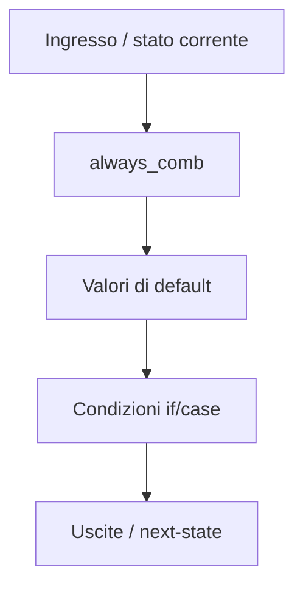
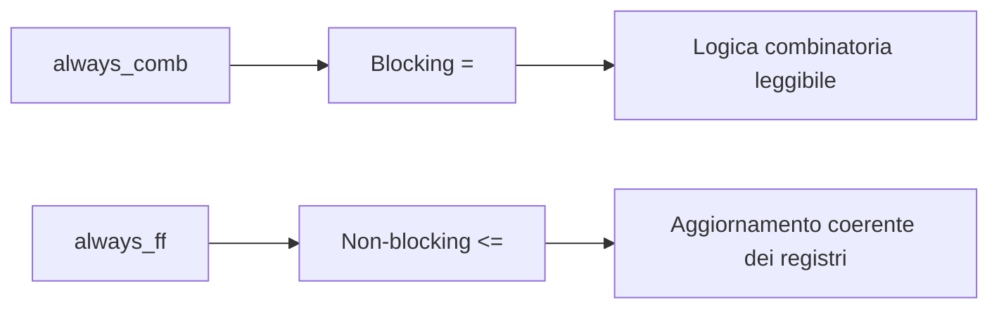

# Blocchi procedurali in SystemVerilog

I blocchi procedurali sono uno degli elementi centrali di SystemVerilog, perché permettono di descrivere il comportamento dinamico della logica digitale in modo strutturato e leggibile. Nella pratica RTL, rappresentano il punto in cui il progettista definisce **come** un segnale viene calcolato, **quando** viene aggiornato e **quale tipo di hardware** si intende modellare.

In un linguaggio ampio come SystemVerilog, è essenziale distinguere tra i blocchi procedurali usati per la **descrizione sintetizzabile dell’hardware** e quelli che, pur esistendo nel linguaggio, sono più adatti a simulazione o verifica. Per questo motivo, in una documentazione orientata a FPGA, ASIC e progettazione RTL, il riferimento principale è a tre costrutti:

- `always_comb`
- `always_ff`
- `always_latch`

Questi blocchi non sono soltanto alternative sintattiche. Esprimono un’intenzione progettuale precisa, aiutano i tool a controllare la correttezza del codice e rendono più chiaro il legame tra descrizione RTL, sintesi, timing e implementazione fisica.

## 1. Che cosa sono i blocchi procedurali

Un blocco procedurale è una sezione di codice in cui le istruzioni vengono valutate secondo una semantica definita dal linguaggio. All’interno di questi blocchi, il progettista descrive:
- logica combinatoria;
- aggiornamento di registri;
- calcolo di next-state;
- generazione di uscite dipendenti da stato e ingressi;
- comportamento di controllo.

Nella pratica RTL, i blocchi procedurali servono a modellare due grandi categorie di hardware:
- **logica combinatoria**, priva di memoria interna esplicita;
- **logica sequenziale**, che aggiorna lo stato su eventi di clock o di reset.

Per scrivere descrizioni corrette, leggibili e sintetizzabili, non basta conoscere la sintassi. Bisogna capire la relazione tra:
- semantica di simulazione;
- inferenza hardware;
- impatto sul timing;
- qualità della verifica;
- prevedibilità in implementazione FPGA o ASIC.

## 2. Perché SystemVerilog introduce `always_comb`, `always_ff` e `always_latch`

Nel Verilog classico, la descrizione procedurale si basava soprattutto su blocchi `always` con sensitivity list esplicita, per esempio:
- blocchi sensibili a tutti gli ingressi per la combinatoria;
- blocchi sensibili a clock e reset per la sequenziale.

SystemVerilog introduce forme più espressive:
- `always_comb`
- `always_ff`
- `always_latch`

L’obiettivo è doppio:
1. rendere più chiara l’intenzione del progettista;
2. consentire ai tool di fare controlli più rigorosi e coerenti.

### 2.1 Vantaggi metodologici
Questi costrutti aiutano a:
- evitare errori nella sensitivity list;
- distinguere meglio combinatoria e sequenziale;
- migliorare la leggibilità del codice;
- ridurre ambiguità in simulazione;
- produrre RTL più allineata alla struttura hardware reale.

### 2.2 Vantaggi lungo il flusso
Una descrizione proceduralmente ordinata semplifica:
- sintesi;
- analisi temporale;
- debug su waveform;
- implementazione fisica su FPGA;
- implementazione backend su ASIC.

In altre parole, il blocco procedurale non è solo una “scelta di stile”: è una scelta che condiziona la qualità del progetto.

## 3. Semantica generale di un blocco procedurale

Ogni blocco procedurale si attiva in risposta a determinati eventi e, una volta attivato, esegue le istruzioni secondo le regole del linguaggio. Questo significa che due aspetti vanno sempre tenuti distinti:

- **quando** il blocco viene eseguito;
- **come** le istruzioni al suo interno aggiornano i segnali.

### 3.1 Attivazione del blocco
L’attivazione dipende dal tipo di blocco:
- in `always_comb`, dalla variazione dei segnali rilevanti per la logica combinatoria;
- in `always_ff`, da un evento di clock e, se previsto, di reset;
- in `always_latch`, dalle condizioni che rendono trasparente il latch.

### 3.2 Esecuzione interna
Una volta attivato, il blocco esegue istruzioni:
- condizionali (`if`, `case`);
- assegnamenti;
- uso di variabili intermedie;
- calcolo di next-state o output.

### 3.3 Simulazione e hardware
La simulazione segue una semantica procedurale, ma l’obiettivo finale è generare hardware. Per questo motivo, è essenziale che il blocco procedurale:
- sia compatibile con la sintesi;
- rappresenti chiaramente la struttura hardware attesa;
- non dipenda da dettagli troppo sottili dell’ordine di esecuzione.

## 4. `always_comb`: il blocco per la logica combinatoria

`always_comb` è il costrutto raccomandato per descrivere logica combinatoria in SystemVerilog. Il suo uso comunica in modo esplicito che il blocco non deve memorizzare stato e che le sue uscite devono dipendere unicamente dagli ingressi e dalle variabili lette nel blocco.

### 4.1 Cosa modella
`always_comb` è usato per:
- reti combinatorie;
- mux;
- decodificatori;
- logica di controllo;
- calcolo di next-state;
- logica di output di FSM;
- piccole trasformazioni di datapath.

### 4.2 Perché è preferibile a `always @(*)`
Pur avendo uno scopo simile, `always_comb` è preferito perché:
- esprime meglio l’intenzione progettuale;
- evita errori di sensitivity list manuale;
- offre ai tool una base più forte per controlli di correttezza;
- rende il codice più moderno e coerente con le linee guida RTL.

### 4.3 Aspettative sul contenuto del blocco
Un blocco `always_comb` dovrebbe:
- assegnare tutti i segnali pilotati in tutte le condizioni;
- evitare dipendenze da stato implicito;
- rimanere puramente combinatorio;
- non contenere logica temporizzata o dipendente dal clock.

### 4.4 Valori di default
Una tecnica molto importante in `always_comb` è l’uso di valori di default all’inizio del blocco. Questa pratica:
- riduce il rischio di latch involontari;
- rende espliciti i casi di comportamento “di base”;
- migliora leggibilità e manutenzione.

## 5. `always_ff`: il blocco per registri e stato

`always_ff` è il costrutto raccomandato per descrivere elementi sequenziali basati su flip-flop. Serve a modellare registri che si aggiornano in corrispondenza di un fronte di clock e, se necessario, di un reset.

### 5.1 Cosa modella
`always_ff` è il blocco tipico per:
- registri di pipeline;
- contatori;
- registri di configurazione;
- stato corrente di una FSM;
- sincronizzatori;
- latch di dati su eventi di clock.

### 5.2 Perché è importante
Usare `always_ff` comunica in modo chiaro che:
- il blocco descrive memoria sincrona;
- il valore dei registri cambia solo su un evento definito;
- le uscite del blocco hanno una semantica di stato.

Questa chiarezza migliora la relazione tra:
- simulazione RTL;
- inferenza di flip-flop in sintesi;
- analisi temporale;
- osservabilità in verifica.

### 5.3 Clock e reset
Nel blocco `always_ff` il clock è il riferimento temporale principale. Il reset definisce il comportamento iniziale del registro e ha un impatto diretto su:
- integrazione del blocco nel sistema;
- strategia di inizializzazione;
- timing;
- metodologia FPGA o ASIC.

La scelta tra reset sincrono e asincrono va fatta a livello architetturale e metodologico, ma in ogni caso deve risultare chiara dalla RTL.

### 5.4 Update simultaneo dei registri
Una delle caratteristiche concettuali fondamentali della logica sequenziale è che i registri si aggiornano logicamente “insieme” sul fronte di clock. Per questo, in `always_ff`, la pratica corretta è usare assegnamenti non-blocking, in modo coerente con il comportamento di un banco di flip-flop.

## 6. `always_latch`: blocco per latch trasparenti

`always_latch` è il costrutto pensato per descrivere latch intenzionali. Anche se fa parte del linguaggio e ha una sua coerenza tecnica, viene usato molto meno frequentemente rispetto a `always_comb` e `always_ff` nei flussi RTL ordinari.

### 6.1 Quando può avere senso
`always_latch` può essere usato in:
- blocchi specializzati;
- librerie custom;
- metodologie ASIC controllate;
- casi in cui il latch è una scelta intenzionale e verificata.

### 6.2 Perché non è il default
Nella maggior parte dei progetti introduttivi e in molti flussi industriali standard:
- i latch complicano il timing;
- richiedono più attenzione in STA;
- rendono la verifica meno immediata;
- non sono la soluzione preferita in FPGA.

### 6.3 Uso consapevole
Se si usa `always_latch`, deve essere una scelta architetturale consapevole. In caso contrario, la regola pratica è evitare latch accidentali e mantenere il design basato su combinatoria più sequenziale sincrona.

## 7. Sensibilità implicita e robustezza della descrizione

Uno dei vantaggi più importanti di `always_comb` rispetto ai vecchi blocchi `always` è la gestione implicita della sensitivity list. In un blocco combinatorio, infatti, l’esecuzione deve avvenire quando cambiano i segnali rilevanti per il risultato.

### 7.1 Problema storico della sensitivity list manuale
Nei blocchi tradizionali, una sensitivity list incompleta poteva causare:
- simulazione errata;
- mismatch tra simulazione e hardware sintetizzato;
- bug difficili da individuare.

### 7.2 Beneficio pratico
Con `always_comb`, questo rischio si riduce e il progettista può concentrarsi di più sulla correttezza funzionale del blocco.

### 7.3 Cosa non risolve automaticamente
Anche con la sensibilità implicita, il progettista deve comunque:
- assegnare tutti i segnali in tutte le condizioni;
- evitare dipendenze non volute;
- mantenere separazione chiara tra combinatoria e sequenziale.

La sensibilità implicita aiuta, ma non sostituisce la disciplina RTL.

## 8. Assegnamenti nei blocchi procedurali

Il comportamento dei blocchi procedurali dipende anche dal tipo di assegnamento usato al loro interno.

### 8.1 Blocking assignment
L’assegnamento blocking (`=`):
- aggiorna il valore in ordine procedurale;
- è naturale per calcoli combinatori;
- rende leggibile il passaggio tramite variabili intermedie.

### 8.2 Non-blocking assignment
L’assegnamento non-blocking (`<=`):
- pianifica l’aggiornamento alla fine del passo di simulazione;
- rappresenta bene il comportamento dei registri;
- evita dipendenze artificiali dall’ordine delle istruzioni in logica sequenziale.

### 8.3 Convenzione consigliata
La convenzione più comune e robusta è:
- usare **blocking** in `always_comb`;
- usare **non-blocking** in `always_ff`.

Questa regola rende il codice:
- più prevedibile;
- più leggibile;
- più vicino alla struttura hardware attesa;
- meno soggetto a bug di simulazione.

## 9. Ordine semantico e intenzione hardware

All’interno di un blocco procedurale, l’ordine delle istruzioni conta dal punto di vista della simulazione. Tuttavia, nel design RTL, non bisogna abusare di questo aspetto per “forzare” comportamenti che non riflettono una struttura hardware chiara.

### 9.1 Nei blocchi combinatori
L’ordine può essere utile per:
- costruire un valore passo dopo passo;
- assegnare default;
- sovrascrivere selettivamente in condizioni specifiche.

### 9.2 Nei blocchi sequenziali
L’ordine non dovrebbe essere usato per simulare dipendenze irreali tra registri aggiornati nello stesso clock. Qui il riferimento corretto è la natura simultanea dell’aggiornamento dei flip-flop.

### 9.3 Principio generale
La descrizione procedurale deve aiutare a vedere il circuito, non a nasconderlo. Se un blocco richiede un ragionamento troppo “da linguaggio software”, probabilmente la RTL non sta esprimendo l’hardware in modo sufficientemente diretto.

## 10. Separare blocchi procedurali per chiarezza progettuale

Una buona pratica molto diffusa è usare blocchi distinti per responsabilità distinte. Per esempio:
- un blocco `always_ff` per lo stato corrente;
- un blocco `always_comb` per il next-state;
- un blocco `always_comb` separato per le uscite, se utile.

### 10.1 Vantaggi
Questa separazione rende più semplice:
- leggere il design;
- verificare la correttezza;
- eseguire review di progetto;
- fare debug;
- correlare l’RTL al timing.

### 10.2 FSM come caso tipico
Le FSM sono l’esempio classico:
- stato corrente nel blocco sequenziale;
- transizioni nel blocco combinatorio;
- uscite eventualmente separate.

### 10.3 Datapath e controllo
Anche nei datapath complessi può essere utile distinguere:
- logica di selezione;
- logica di registrazione;
- controllo di enable;
- stato di avanzamento di una pipeline.

## 11. Errori tipici nei blocchi procedurali

Molti problemi in RTL nascono proprio da un uso impreciso dei blocchi procedurali. Alcuni errori sono ricorrenti.

### 11.1 Latch involontari in `always_comb`
Se non si assegna un segnale in tutte le condizioni, il tool può inferire memoria non voluta.

### 11.2 Uso improprio di `always_ff`
Inserire logica non realmente sequenziale o mescolare comportamenti poco coerenti all’interno di un blocco pensato per registri può rendere la descrizione meno chiara e più fragile.

### 11.3 Mescolare blocking e non-blocking senza criterio
Questo può produrre comportamenti difficili da interpretare e rendere la simulazione meno affidabile come modello dell’hardware.

### 11.4 Blocchi troppo grandi
Un singolo blocco con troppe responsabilità:
- è difficile da leggere;
- rende più complicata la manutenzione;
- nasconde il confine tra controllo, datapath e stato.

### 11.5 Reset poco chiari
La mancanza di una strategia chiara di reset complica:
- la verifica;
- il bring-up;
- l’integrazione nel sistema;
- il comportamento iniziale dopo sintesi.

## 12. Impatto su sintesi e inferenza hardware

I blocchi procedurali influenzano direttamente il modo in cui il tool di sintesi inferisce l’hardware.

### 12.1 Inferenza di flip-flop
Un `always_ff` ben scritto porta naturalmente all’inferenza di registri con comportamento coerente.

### 12.2 Inferenza di combinatoria
Un `always_comb` completo e ordinato viene tradotto in logica combinatoria più prevedibile.

### 12.3 Inferenza indesiderata
Una descrizione ambigua può generare:
- latch involontari;
- logica di priorità non prevista;
- fanout e profondità combinatoria eccessivi;
- strutture meno ottimizzabili.

### 12.4 Connessione con il backend
Queste scelte si propagano lungo il flusso:
- in FPGA influenzano mapping su LUT, flip-flop, DSP e routing;
- in ASIC influenzano sintesi, area, timing, DFT e implementazione fisica.

## 13. Impatto sui percorsi di timing

Il blocco procedurale, pur essendo una descrizione ad alto livello rispetto al layout fisico, ha un impatto reale sui percorsi di timing.

### 13.1 Combinatoria troppo lunga
Un blocco combinatorio che concentra troppa logica può creare un cammino critico difficile da chiudere.

### 13.2 Priorità e profondità logica
Catene di condizioni o mux complessi possono introdurre ritardi aggiuntivi.

### 13.3 Registrazione strategica
Un uso corretto di `always_ff` consente di spezzare il percorso critico e costruire pipeline più equilibrate.

### 13.4 Collegamento a FPGA e ASIC
- In **FPGA**, la qualità della struttura procedurale influisce su packing, placement e routing.
- In **ASIC**, influisce su sintesi, floorplanning, CTS, PnR e signoff.

La semantica del blocco procedurale non è quindi un dettaglio locale del codice: è parte del comportamento fisico futuro del progetto.

## 14. Impatto sulla verifica

La qualità dei blocchi procedurali si riflette anche sulla verifica.

### 14.1 Simulazione più affidabile
Se combinatoria e sequenziale sono ben separate, il comportamento in simulazione è più facile da interpretare.

### 14.2 Waveform più leggibili
Con blocchi ben strutturati, diventa più semplice distinguere:
- stato corrente;
- next-state;
- uscite combinatorie;
- registri di pipeline.

### 14.3 Assertion e coverage
Una struttura chiara rende più naturale scrivere:
- assertion su transizioni di stato;
- controlli di protocollo;
- coverage funzionale significativa.

### 14.4 Debug
In debug, una cattiva organizzazione procedurale rallenta l’analisi. Al contrario, una buona separazione aiuta a localizzare rapidamente il problema:
- nella logica combinatoria;
- nel percorso sequenziale;
- nel reset;
- nella gestione delle priorità.

## 15. Buone pratiche per l’uso dei blocchi procedurali

Per ottenere una RTL robusta e leggibile, alcune linee guida sono particolarmente efficaci.

### 15.1 Usare il blocco giusto per il comportamento giusto
- `always_comb` per la combinatoria;
- `always_ff` per i registri;
- `always_latch` solo quando il latch è davvero voluto.

### 15.2 Separare stato, next-state e uscite
Questa struttura chiarisce il comportamento e aiuta la verifica.

### 15.3 Assegnare sempre valori completi in combinatoria
Riduce il rischio di inferenze indesiderate.

### 15.4 Mantenere i blocchi compatti e leggibili
Meglio più blocchi ben separati che un unico blocco difficile da analizzare.

### 15.5 Pensare al comportamento fisico
Ogni blocco procedurale dovrebbe essere scritto chiedendosi:
- quale hardware sto descrivendo;
- come verrà sintetizzato;
- quali segnali diventeranno critici;
- come verrà osservato in verifica o in debug.

## 16. Collegamento con le altre pagine della sezione

Questa pagina si colloca come ponte tra:
- la sintassi di base del linguaggio;
- i costrutti RTL;
- la modellazione concreta di datapath e controllo.

In particolare:
- **`language-basics.md`** introduce i mattoni del linguaggio;
- **`rtl-constructs.md`** definisce il sottoinsieme sintetizzabile e il rapporto con l’hardware;
- questa pagina chiarisce la semantica dei principali blocchi procedurali;
- le pagine successive potranno approfondire:
  - logica combinatoria contro sequenziale;
  - FSM;
  - parametrizzazione;
  - interfacce e strutture dati;
  - aspetti di verifica e stile.

## 17. In sintesi

I blocchi procedurali in SystemVerilog sono il cuore della descrizione comportamentale RTL. Usarli correttamente significa esprimere con precisione:
- quando una logica deve reagire;
- se il comportamento è combinatorio o sequenziale;
- come il codice corrisponde a registri, mux, pipeline e controllo.

`always_comb`, `always_ff` e `always_latch` non sono solo costrutti del linguaggio: sono strumenti metodologici che aiutano a scrivere RTL più chiara, più sintetizzabile e più robusta.

Una buona padronanza dei blocchi procedurali porta benefici concreti:
- simulazione più affidabile;
- verifica più leggibile;
- sintesi più prevedibile;
- timing più controllabile;
- implementazione FPGA e ASIC più coerente con l’intento architetturale.

## Prossimo passo

Il passo più naturale è **`combinational-vs-sequential.md`**, per consolidare in modo ancora più esplicito la distinzione tra:
- logica combinatoria;
- logica sequenziale;
- stato;
- cammini di dato;
- implicazioni su timing, pipeline e verifica.

In alternativa, un altro passo molto naturale è **`fsm.md`**, se vuoi passare subito a un caso strutturato in cui i blocchi procedurali trovano applicazione diretta e molto chiara.
