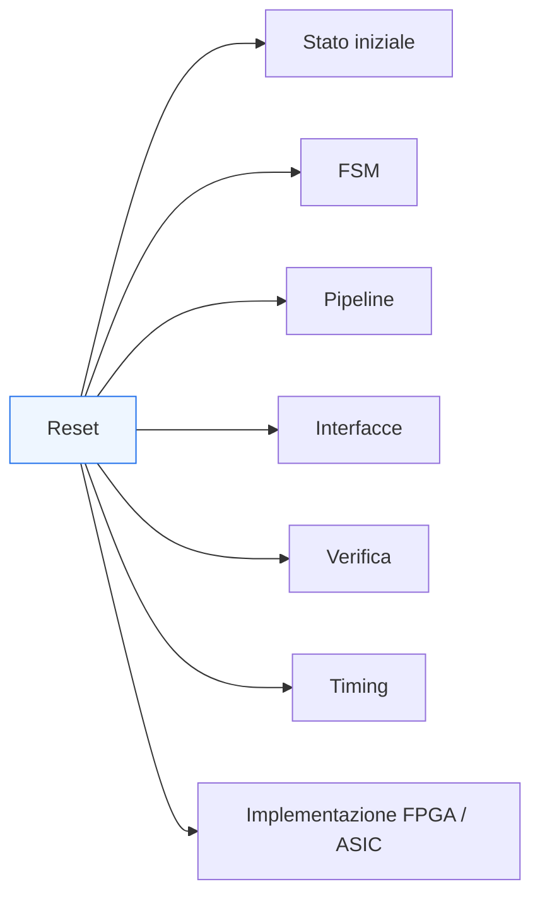
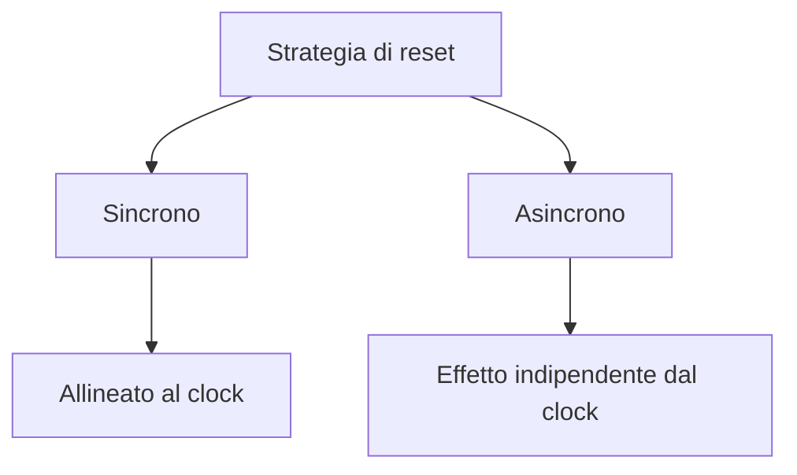

# Strategie di reset in SystemVerilog

Dopo aver costruito il quadro della progettazione e della verifica RTL in SystemVerilog — dai **costrutti base** alle **FSM**, dalle **pipeline** alle **interfacce**, fino a **testbench**, **assertion** e **coverage** — il passo successivo naturale è affrontare un tema che attraversa quasi tutte queste dimensioni: il **reset**.

Il reset è uno dei meccanismi più importanti di un sistema digitale, perché definisce come il blocco entra in uno stato iniziale noto e controllato. Questa funzione può sembrare semplice a prima vista, ma in realtà ha implicazioni profonde su:
- architettura;
- RTL;
- FSM e stato interno;
- pipeline e validità dei dati;
- protocolli di interfaccia;
- verificabilità;
- timing;
- implementazione FPGA;
- implementazione ASIC.

In altre parole, il reset non è solo un segnale in più nella lista porte. È una scelta progettuale che incide sul comportamento complessivo del blocco e sulla sua integrabilità nel sistema. Una strategia di reset poco chiara può rendere difficile:
- capire lo stato iniziale reale del DUT;
- garantire il corretto avvio;
- verificare la coerenza del comportamento;
- chiudere il timing;
- mantenere affidabilità in presenza di più sottoblocchi o più domini.

Questa pagina introduce le principali strategie di reset con un taglio coerente con il resto della documentazione:
- didattico ma tecnico;
- orientato alla progettazione RTL;
- attento al rapporto tra comportamento funzionale e conseguenze implementative;
- consapevole delle differenze pratiche tra FPGA e ASIC.

## 1. Perché il reset è così importante

In un circuito digitale, molti segnali interni rappresentano stato:
- registri;
- contatori;
- FSM;
- flag;
- validità di pipeline;
- code o buffer;
- registri di controllo.

Senza una strategia chiara di reset, il blocco può trovarsi in una condizione iniziale non ben definita oppure difficile da interpretare.

### 1.1 Stato iniziale noto
Il primo ruolo del reset è portare il DUT in una condizione iniziale nota e coerente con l’architettura.

### 1.2 Avvio controllato
Il reset definisce anche come il blocco passa da:
- stato inattivo;
- inizializzazione;
- eventuale flushing interno;

a:
- funzionamento normale.

### 1.3 Impatto sul sistema
In un sistema reale, la strategia di reset influenza:
- ordine di inizializzazione dei blocchi;
- corretto avvio delle interfacce;
- comportamento dei protocolli nei primi cicli;
- convergenza verso uno stato operativo stabile.

## 2. Reset come scelta architetturale, non solo sintattica

È facile pensare al reset come a un dettaglio di codifica, ma in realtà è una scelta architetturale.

### 2.1 Che cosa decide davvero il reset
Una strategia di reset decide:
- quali registri devono avere uno stato iniziale esplicito;
- quali stati della FSM sono legittimi all’avvio;
- quali segnali di output devono essere definiti subito;
- quali parti della pipeline devono risultare invalide o vuote;
- quali interfacce devono presentarsi come inattive.

### 2.2 Quanto reset è davvero necessario
Non tutto deve necessariamente essere resettato nello stesso modo. Una scelta matura distingue tra:
- stato che deve essere rigorosamente inizializzato;
- dati intermedi che possono essere trattati come non validi;
- strutture il cui contenuto interno non è osservabile finché i bit di controllo non diventano validi.

### 2.3 Collegamento con la progettazione del blocco
Per questo il reset va pensato insieme a:
- semantica del protocollo;
- strategia di validità dei dati;
- comportamento della FSM;
- organizzazione del datapath.

## 3. Obiettivi di una buona strategia di reset

Una strategia di reset ben progettata tende a soddisfare alcuni obiettivi fondamentali.

### 3.1 Stato deterministico
Il blocco deve partire da una configurazione funzionale chiara.

### 3.2 Semplicità di verifica
Dopo il reset, il testbench deve poter sapere in modo ragionevole:
- quali segnali sono significativi;
- quali stati sono attesi;
- quando il DUT è pronto per operare.

### 3.3 Coerenza con il protocollo
Le interfacce devono ripartire in modo coerente:
- niente trasferimenti spurii;
- niente validità falsa;
- niente `done` inattesi;
- niente stati di handshake ambigui.

### 3.4 Compatibilità con timing e implementazione
La strategia di reset deve essere sostenibile dal punto di vista:
- della distribuzione del segnale;
- della logica associata;
- della sintesi;
- del backend fisico.

## 4. Reset sincrono e reset asincrono

Una delle distinzioni più classiche è quella tra **reset sincrono** e **reset asincrono**.

### 4.1 Reset sincrono
Nel reset sincrono, lo stato del blocco viene riportato alla condizione iniziale in corrispondenza del clock. Questo significa che il reset viene “campionato” come parte del comportamento sequenziale del blocco.

#### Significato concettuale
Il blocco torna in uno stato noto in modo allineato al ritmo del sistema.

### 4.2 Reset asincrono
Nel reset asincrono, il ritorno allo stato iniziale può avvenire indipendentemente dal clock. In termini concettuali, il segnale di reset ha effetto immediato sullo stato dei registri.

### 4.3 Perché la distinzione conta
Questa differenza influisce su:
- modalità di inizializzazione;
- verifica del comportamento iniziale;
- robustezza temporale;
- complessità di distribuzione del reset;
- implicazioni su timing e integrazione.

## 5. Reset sincrono: vantaggi e considerazioni

Il reset sincrono è spesso apprezzato per la sua coerenza con il modello di progettazione sincrona.

### 5.1 Vantaggi
Tra i vantaggi più comuni:
- comportamento più naturalmente allineato al clock;
- maggiore coerenza con la semantica sequenziale del design;
- minor rischio di certi problemi legati al rilascio asincrono;
- ragionamento temporale spesso più semplice.

### 5.2 Considerazioni progettuali
Il reset sincrono richiede che:
- il clock sia disponibile;
- il blocco possa attendere il fronte utile per entrare nello stato iniziale;
- il sistema accetti questa modalità di inizializzazione.

### 5.3 Collegamento con la verifica
Nella simulazione, il reset sincrono rende spesso più immediato ragionare su:
- in quale ciclo il DUT entra nello stato iniziale;
- da quando le uscite devono essere considerate valide;
- come si allineano stato e controllo.

## 6. Reset asincrono: vantaggi e considerazioni

Il reset asincrono viene spesso scelto quando è importante poter forzare il blocco in uno stato noto indipendentemente dal clock.

### 6.1 Vantaggi
Può essere utile quando:
- si vuole garantire una rapida inizializzazione;
- il clock non è ancora stabilizzato nelle prime fasi;
- il sistema richiede una capacità di forzare subito uno stato di sicurezza.

### 6.2 Considerazioni progettuali
Questa scelta introduce però particolare attenzione a:
- modalità di rilascio del reset;
- interazione con il dominio di clock;
- sincronizzazione del ritorno al funzionamento normale;
- robustezza in presenza di più sottoblocchi.

### 6.3 Punto delicato: il rilascio
Anche quando l’asserzione del reset è asincrona, il rilascio deve spesso essere trattato con grande attenzione, perché è lì che il blocco torna ad affidarsi al comportamento sincrono.

## 7. Affermazione e rilascio del reset

Un tema molto importante, spesso più importante del tipo di reset stesso, è distinguere tra:
- **asserzione del reset**
- **deassertion del reset**, cioè il suo rilascio

### 7.1 Perché conta
Molti problemi reali non nascono tanto dal fatto che il blocco venga forzato nello stato iniziale, ma dal modo in cui ne esce.

### 7.2 Rilascio controllato
Il rilascio deve essere coerente con:
- clock del dominio;
- comportamento della FSM;
- attivazione delle pipeline;
- inizio dei protocolli di interfaccia;
- stabilizzazione del contesto esterno.

### 7.3 Significato progettuale
Una strategia di reset robusta non pensa solo a “come portare il blocco a zero”, ma anche a:
- quando il blocco torna vivo;
- quali dati o segnali possono diventare significativi;
- come evitare transizioni spurie nei primi cicli utili.

## 8. Reset delle FSM

Le FSM sono uno dei punti in cui il reset è più chiaramente necessario.

### 8.1 Stato iniziale
Il reset deve portare la FSM in uno stato ben definito, tipicamente:
- `IDLE`
- `RESET`
- `INIT`
- stato di attesa sicuro

### 8.2 Perché è fondamentale
Senza uno stato iniziale chiaro:
- le transizioni successive possono risultare ambigue;
- le uscite associate allo stato possono essere imprevedibili;
- il comportamento del blocco all’avvio può essere incoerente con il protocollo.

### 8.3 FSM e recovery
Il reset è spesso anche il meccanismo più chiaro per riportare la FSM da condizioni anomale a uno stato noto.

## 9. Reset di pipeline e datapath

Nel datapath e nelle pipeline, il reset va trattato con una logica leggermente diversa rispetto alle FSM.

### 9.1 Dati contro validità
Spesso non è necessario che ogni dato interno venga portato a un valore “utile” dopo reset. Molto più importante è che:
- i bit di validità siano coerenti;
- gli stadi risultino considerati vuoti o inattivi;
- il controllo non tratti come validi contenuti non inizializzati.

### 9.2 Pipeline vuota come stato iniziale
Una strategia molto comune e robusta è fare in modo che, dopo reset:
- la pipeline sia logicamente vuota;
- nessun output sia considerato valido;
- i metadati di controllo siano coerenti con l’assenza di dati significativi.

### 9.3 Perché è importante
Questo approccio evita di sprecare logica di reset su contenuti che non hanno ancora significato osservabile e concentra l’attenzione sul vero requisito funzionale: la correttezza del flusso.

## 10. Reset di interfacce e handshake

Le interfacce sono un altro punto critico.

### 10.1 Condizione iniziale del protocollo
Dopo reset, l’interfaccia dovrebbe presentarsi in una condizione sicura e non ambigua:
- nessun trasferimento spurio;
- nessuna risposta inattesa;
- nessun dato presentato come valido se non lo è davvero.

### 10.2 Segnali tipicamente sensibili
Particolare attenzione va data a:
- `valid`
- `ready`
- `start`
- `done`
- segnali di errore
- bit di validità associati ai dati

### 10.3 Reset e inizio del traffico
Il testbench e il sistema devono poter sapere da quale momento:
- l’interfaccia è stabile;
- il DUT può ricevere richieste;
- eventuali output possono essere considerati significativi.

## 11. Reset e verificabilità

Una buona strategia di reset rende il blocco molto più facile da verificare.

### 11.1 Stato iniziale osservabile
Se il reset porta il DUT in una configurazione semplice e chiara, il testbench può:
- verificare subito lo stato iniziale;
- sapere quali uscite attendersi;
- iniziare gli stimoli in un contesto noto.

### 11.2 Verifica del reset stesso
Il reset non è solo una premessa del testbench: è anche un comportamento da verificare. Occorre controllare che:
- il DUT entri correttamente nello stato iniziale;
- le FSM tornino nello stato giusto;
- la pipeline venga svuotata;
- le interfacce non producano eventi illegali.

### 11.3 Reset come parte della regressione
Ogni flusso di verifica serio dovrebbe includere scenari che coprano:
- startup da reset;
- reset durante attività;
- ritorno a operatività;
- effetti su latenza, validità e stato.

## 12. Reset e assertion

Le assertion sono particolarmente utili per verificare il comportamento del reset.

### 12.1 Proprietà tipiche
Si possono esprimere proprietà come:
- dopo reset, la FSM deve trovarsi in `IDLE`;
- quando il reset è attivo, certi output non devono risultare validi;
- al rilascio del reset, la pipeline deve essere logicamente vuota;
- nessuna transazione deve essere completata finché il DUT non è uscito correttamente dalla fase iniziale.

### 12.2 Perché è utile
Il reset coinvolge spesso molte parti del blocco e quindi può essere fonte di bug sottili. Le assertion aiutano a rendere esplicite le regole di inizializzazione.

### 12.3 Legame con il debug
Quando una assertion sul reset fallisce, il problema viene identificato molto più vicino alla sua origine che non tramite il solo fallimento di un test successivo.

## 13. Reset e coverage

Anche la coverage può essere usata per capire se i comportamenti legati al reset sono stati davvero esercitati.

### 13.1 Casi da coprire
Può essere utile sapere se la verifica ha effettivamente esercitato:
- stato iniziale post-reset;
- transizioni della FSM dopo reset;
- reset durante attività;
- svuotamento della pipeline;
- condizioni di protocollo prima e dopo reset.

### 13.2 Perché serve
Molti test nominali esercitano solo il reset iniziale. Questo può non bastare a garantire robustezza in condizioni più realistiche.

### 13.3 Visione più completa
Coverage, testbench e assertion insieme aiutano a evitare che il reset resti una parte poco esplorata del design.

## 14. Reset, timing e fanout

Dal punto di vista implementativo, il reset non è neutro.

### 14.1 Segnale ampiamente distribuito
Il reset può raggiungere molti registri e quindi avere:
- fanout elevato;
- impatto sulla distribuzione del segnale;
- effetto sui percorsi temporali;
- costo in termini di complessità di sintesi e implementazione.

### 14.2 Reset e timing closure
Una strategia di reset troppo estesa o poco selettiva può complicare:
- chiusura temporale;
- qualità del placement e del routing;
- buffering e distribuzione del segnale.

### 14.3 Conseguenza pratica
Per questo è importante resettare in modo consapevole:
- ciò che deve essere deterministico;
- ciò che è architetturalmente importante;
- evitando, quando non necessario, di introdurre reset ovunque in modo indiscriminato.

## 15. Differenze pratiche tra FPGA e ASIC

Le scelte di reset hanno conseguenze diverse a seconda del target.

### 15.1 Su FPGA
Nelle FPGA, il reset va valutato tenendo conto di:
- risorse di registrazione abbondanti ma non gratuite;
- impatto del fanout sul routing;
- strategie di inizializzazione supportate dal dispositivo;
- necessità di debug e bring-up ordinato.

In molti casi, una strategia chiara sui bit di validità e sullo stato di controllo è più importante del forzare ogni dato interno a un valore preciso.

### 15.2 Su ASIC
Negli ASIC, il reset ha impatti molto forti su:
- sintesi;
- area;
- distribuzione del segnale;
- CTS;
- floorplanning;
- robustezza dell’integrazione di sistema;
- logiche di test e DFT.

Per questo, la strategia di reset deve essere molto consapevole e coerente con l’architettura del blocco e con il flusso complessivo fino al tape-out.

### 15.3 Nessuna regola universale
Non esiste una strategia unica valida in assoluto. Esistono però criteri solidi:
- stato iniziale chiaro;
- rilascio controllato;
- reset dei segnali davvero significativi;
- attenzione all’impatto fisico del segnale.

## 16. Errori comuni

Alcuni errori ricorrono spesso nella progettazione del reset.

### 16.1 Considerare il reset solo come dettaglio di sintassi
Questo porta a strategie incoerenti o poco adatte al comportamento reale del blocco.

### 16.2 Resettare tutto senza chiedersi se serva davvero
Una strategia indiscriminata può peggiorare area, timing e complessità senza migliorare davvero la robustezza funzionale.

### 16.3 Non pensare al rilascio
Molti problemi nascono proprio nella fase in cui il blocco esce dal reset.

### 16.4 Ignorare pipeline e validità
Portare i dati a zero non basta se i segnali di validità e controllo non sono coerenti.

### 16.5 Trascurare le interfacce
Un blocco può uscire dal reset con handshake o output in condizioni ambigue, causando problemi di integrazione.

### 16.6 Verificare poco il reset
Il reset iniziale da solo non basta: vanno considerati anche reset in condizioni operative o intermedie.

## 17. Buone pratiche di modellazione

Per gestire bene il reset in SystemVerilog RTL, alcune linee guida sono particolarmente efficaci.

### 17.1 Definire chiaramente lo stato iniziale desiderato
Bisogna sapere che cosa il blocco debba “significare” subito dopo reset.

### 17.2 Resettare ciò che ha significato architetturale
FSM, validità, stato di controllo e condizioni di protocollo sono spesso più importanti del contenuto puro dei dati interni.

### 17.3 Distinguere tra dato e controllo
Nei datapath e nelle pipeline, conviene spesso inizializzare soprattutto i segnali che decidono se il contenuto sia valido o meno.

### 17.4 Verificare il rilascio del reset
Il comportamento nei primi cicli post-reset deve essere chiaro e osservabile.

### 17.5 Pensare già a timing e implementazione
Il reset deve essere progettato non solo per simulare bene, ma anche per essere sostenibile in FPGA e ASIC.

## 18. Collegamento con il resto della sezione

Questa pagina si collega in modo diretto a molti temi già sviluppati:
- **`fsm.md`** e **`state-encoding.md`** hanno introdotto il ruolo dello stato e della sua inizializzazione;
- **`datapath-and-control.md`** ha mostrato la distinzione tra contenuto dei dati e logica di controllo;
- **`pipelining.md`** e **`latency-and-throughput.md`** hanno evidenziato l’importanza della validità dei dati nel tempo;
- **`interfaces-and-handshake.md`** ha chiarito che il protocollo deve avere una condizione iniziale non ambigua;
- **`verification-basics.md`**, **`assertions-basics.md`** e **`coverage-basics.md`** hanno mostrato che il reset è anche un comportamento da verificare in modo esplicito;
- **`coding-style-rtl.md`** ha evidenziato il valore di una scrittura chiara e prevedibile del comportamento sequenziale.

Il reset è quindi uno dei temi più trasversali dell’intera sezione SystemVerilog.

## 19. In sintesi

Il reset è uno dei meccanismi più importanti nella progettazione digitale perché definisce come un blocco entra in uno stato iniziale noto, sicuro e coerente con l’architettura del sistema. In SystemVerilog, una buona strategia di reset deve tenere insieme:
- correttezza funzionale;
- chiarezza dello stato iniziale;
- coerenza di FSM, pipeline e interfacce;
- verificabilità;
- impatto su timing e implementazione fisica.

La distinzione tra reset sincrono e asincrono è importante, ma ancora più importante è progettare in modo consapevole:
- che cosa va davvero inizializzato;
- come avviene il rilascio del reset;
- quali segnali devono risultare validi o inattivi dopo l’avvio;
- come il blocco torna a uno stato operativo stabile.

Per questo motivo, il reset non va trattato come dettaglio secondario, ma come parte integrante dell’architettura, della RTL e della qualità complessiva del progetto.

## Prossimo passo

Il passo più naturale ora è **`verification-vs-validation.md`**, perché dopo aver completato il primo arco della verifica RTL può essere utile chiarire una distinzione metodologica molto importante tra:
- correttezza del blocco rispetto alla sua implementazione;
- correttezza rispetto alla specifica e all’uso nel sistema.

In alternativa, un altro passo molto naturale è **`clock-domain-crossing.md`**, se vuoi aprire il ramo sui temi temporali avanzati e sull’integrazione tra domini di clock diversi.
