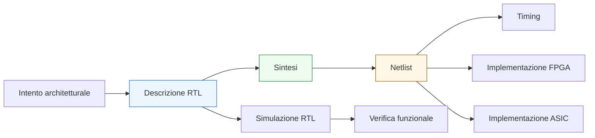
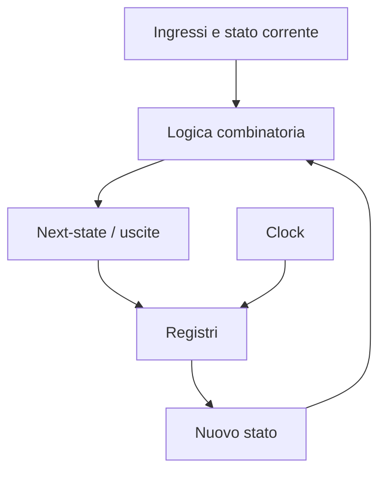
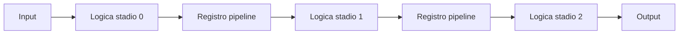

# Costrutti RTL in SystemVerilog

SystemVerilog è un linguaggio ampio, usato sia per descrivere hardware sintetizzabile sia per costruire ambienti di verifica. In una documentazione orientata a **RTL design**, però, è importante distinguere con chiarezza il sottoinsieme del linguaggio che porta a una struttura hardware ben definita da quello pensato per simulazione, modellazione astratta o testbench.

Questa pagina introduce i costrutti RTL più importanti in SystemVerilog, con un obiettivo preciso: mostrare come scrivere descrizioni leggibili, sintetizzabili e coerenti con i flussi di implementazione su **FPGA** e **ASIC**. Il punto centrale non è soltanto “far compilare” il codice, ma produrre una descrizione che corrisponda in modo prevedibile a registri, logica combinatoria, mux, pipeline e macchine a stati.

## 1. Che cosa si intende per RTL

RTL significa **Register Transfer Level**. A questo livello di astrazione, il progetto viene descritto come:
- insieme di **registri** aggiornati in corrispondenza di un clock;
- **logica combinatoria** che calcola i valori successivi;
- trasferimento di dati tra registri e blocchi logici;
- comportamento temporale scandito principalmente da clock e reset.

In pratica, una descrizione RTL cerca di rispondere a domande come:
- quali segnali sono memorizzati in flip-flop;
- quali segnali sono puramente combinatori;
- in quali condizioni un registro cambia stato;
- come si propaga il dato lungo una pipeline o una FSM.

Questa separazione è fondamentale perché i tool di sintesi e implementazione costruiscono l’hardware proprio a partire da queste informazioni. Una RTL poco chiara può produrre:
- inferenze hardware inattese;
- peggior timing;
- verifiche più fragili;
- maggiore difficoltà in debug e closure.

## 2. Sottoinsieme sintetizzabile e disciplina progettuale

SystemVerilog contiene costrutti molto potenti, ma non tutti hanno senso in una descrizione RTL destinata alla sintesi. Dal punto di vista pratico, conviene ragionare in tre categorie:

### 2.1 Costrutti tipici RTL
Sono i costrutti usati per descrivere direttamente hardware sintetizzabile:
- `module`
- porte di input/output
- tipi come `logic`, vettori, `enum`, `struct`
- assegnamenti continui con `assign`
- blocchi `always_comb`
- blocchi `always_ff`
- in alcuni casi `always_latch`
- `if`, `case`, `for` con limiti statici
- costanti, parametri e `localparam`

### 2.2 Costrutti utili ma da usare con criterio
Sono costrutti che possono essere sintetizzabili ma richiedono attenzione:
- array multidimensionali
- loop generativi o strutturali
- funzioni per logica combinatoria
- `generate`
- `unique case` e `priority if`
- tipi aggregati per migliore leggibilità

### 2.3 Costrutti da evitare in RTL sintetizzabile
Sono costrutti più adatti a simulazione o testbench:
- ritardi espliciti come `#10`
- `initial` usati come meccanismo funzionale generico
- task e classi orientate alla verifica
- sincronizzazioni complesse da testbench
- randomizzazione
- costrutti dinamici non mappabili in hardware fisso

Dal punto di vista metodologico, una buona regola è questa: **ogni costrutto RTL dovrebbe suggerire in modo quasi immediato la struttura hardware che verrà generata**.

## 3. Logica combinatoria e logica sequenziale

La distinzione più importante in una pagina RTL è quella tra:
- **logica combinatoria**, che dipende soltanto dai valori correnti degli ingressi;
- **logica sequenziale**, che conserva stato e dipende dal clock.

### 3.1 Logica combinatoria
La logica combinatoria rappresenta funzioni booleane, mux, decodifiche, confronti, operazioni aritmetiche o generazione di segnali di controllo. In SystemVerilog viene spesso descritta con:
- `assign`
- `always_comb`

### 3.2 Logica sequenziale
La logica sequenziale rappresenta registri, contatori, pipeline stage, FSM state register e più in generale qualsiasi elemento che memorizza informazione nel tempo. In SystemVerilog viene descritta con:
- `always_ff`

### 3.3 Perché la distinzione è importante
Separare chiaramente le due parti porta diversi vantaggi:
- la sintesi inferisce hardware più prevedibile;
- il timing è più leggibile nei report;
- la verifica distingue meglio stato corrente e logica di next-state;
- l’implementazione fisica su FPGA o ASIC beneficia di una struttura più pulita.

## 4. `always_comb`: descrivere la logica combinatoria

`always_comb` è il costrutto raccomandato per descrivere logica combinatoria in SystemVerilog. A differenza del vecchio `always @(*)`, esprime in modo più chiaro l’intenzione progettuale e consente ai tool di effettuare controlli più rigorosi.

### 4.1 Quando usarlo
`always_comb` è adatto a:
- calcolo del next-state di una FSM;
- selezione tra percorsi dati;
- logiche di controllo;
- funzioni combinatorie con più condizioni;
- costruzione di output dipendenti da ingressi e stato corrente.

### 4.2 Proprietà pratiche
Un blocco `always_comb` dovrebbe:
- assegnare sempre un valore a ogni uscita o variabile controllata;
- evitare dipendenze implicite da stato non voluto;
- non contenere logica temporizzata;
- rimanere leggibile anche in presenza di condizioni multiple.

### 4.3 Rischio principale: latch involontari
Il problema classico della logica combinatoria incompleta è l’inferenza di **latch**. Se in un blocco combinatorio un segnale non riceve valore in tutte le condizioni, il tool può inferire un elemento di memoria per “ricordare” il valore precedente.

Questo è spesso indesiderato perché:
- introduce stato non pianificato;
- rende più difficile l’analisi temporale;
- complica la verifica;
- su FPGA raramente è una scelta ideale;
- su ASIC richiede una consapevolezza molto maggiore di timing e metodologia.

Una tecnica molto usata consiste nell’assegnare **valori di default** all’inizio del blocco e poi sovrascriverli nelle condizioni necessarie.

## 5. `always_ff`: descrivere registri e stato

`always_ff` è il costrutto raccomandato per la logica sequenziale pilotata da clock. Serve a esprimere chiaramente che il blocco rappresenta flip-flop o registri.

### 5.1 Quando usarlo
`always_ff` si usa per:
- registri di pipeline;
- contatori;
- registri di configurazione;
- stato corrente di una FSM;
- sincronizzatori;
- memorizzazione di output temporizzati.

### 5.2 Clock e reset
In un blocco sequenziale, i segnali più importanti sono:
- **clock**, che scandisce gli aggiornamenti;
- **reset**, che inizializza lo stato in modo controllato.

La scelta tra reset sincrono e asincrono dipende dalla metodologia di progetto, dal target FPGA o ASIC e dai vincoli di integrazione. In entrambi i casi, la descrizione RTL deve rendere esplicito il comportamento iniziale del blocco.

### 5.3 Stato e datapath
Molto spesso conviene separare:
- registro di stato;
- logica che calcola il prossimo stato;
- uscite derivate dallo stato o dal datapath.

Questo approccio rende il design più modulare e riduce le ambiguità tra comportamento combinatorio e sequenziale.

## 6. `always_latch`: uso limitato e consapevole

SystemVerilog mette a disposizione anche `always_latch`, pensato per descrivere latch trasparenti. Dal punto di vista teorico è un costrutto corretto; dal punto di vista metodologico, però, il suo uso in RTL general-purpose è molto meno comune rispetto a `always_ff` e `always_comb`.

### 6.1 Quando compare davvero
Può avere senso in:
- librerie dedicate;
- blocchi custom particolari;
- metodologie ASIC molto controllate;
- casi in cui la presenza di latch è deliberata e verificata.

### 6.2 Perché spesso si evita
Nei progetti introduttivi o nei flussi standard:
- i latch aumentano la complessità di timing;
- richiedono maggiore attenzione nella verifica;
- possono creare problemi di integrazione;
- su FPGA non sono normalmente la scelta più naturale.

Per questo motivo, nella maggior parte dei design RTL ordinati e portabili, l’obiettivo è evitare latch accidentali e usare prevalentemente:
- `always_comb` per la logica combinatoria;
- `always_ff` per la logica sequenziale.

## 7. Assegnamenti blocking e non-blocking

Uno dei temi più importanti in SystemVerilog RTL è la distinzione tra:
- **blocking assignment**: `=`
- **non-blocking assignment**: `<=`

Questa scelta non è puramente sintattica: influenza la semantica della simulazione e il modo in cui il progettista ragiona sul comportamento del circuito.

### 7.1 Blocking assignment
L’assegnamento blocking viene eseguito in ordine sequenziale all’interno del blocco procedurale. È tipicamente usato in logica combinatoria, dove si vuole modellare il calcolo passo dopo passo di variabili intermedie all’interno dello stesso istante logico.

### 7.2 Non-blocking assignment
L’assegnamento non-blocking pianifica l’aggiornamento del valore alla fine del passo di simulazione corrente. È il modello naturale per registri che si aggiornano simultaneamente sul fronte di clock.

### 7.3 Regola progettuale pratica
Nella maggior parte delle linee guida RTL:
- in `always_comb` si usano assegnamenti **blocking**;
- in `always_ff` si usano assegnamenti **non-blocking**.

Questa convenzione migliora:
- leggibilità;
- corrispondenza tra simulazione e hardware;
- prevenzione di bug sottili;
- robustezza della verifica.

### 7.4 Perché mescolarli è rischioso
Mescolare senza criterio i due tipi di assegnamento può causare:
- divergenze tra intento e simulazione;
- comportamenti difficili da interpretare;
- dipendenze dall’ordine delle istruzioni;
- errori nei passaggi da RTL a gate-level reasoning.

## 8. Modellare mux, registri e pipeline

Un buon RTL non si limita a essere sintetizzabile: deve rendere leggibile la struttura del datapath.

### 8.1 Mux
Un mux è tipicamente descritto come logica combinatoria. La chiarezza del codice è importante perché selettori complessi possono diventare percorsi critici nel timing.

### 8.2 Registri
Un registro è descritto come logica sequenziale con aggiornamento sul clock. Esplicitare bene le condizioni di enable, reset e load aiuta sia la sintesi sia la verifica.

### 8.3 Pipeline
Una pipeline nasce dalla combinazione di:
- blocchi combinatori tra stadi;
- registri che separano i livelli.

Dal punto di vista architetturale, introdurre pipeline significa scambiare:
- maggiore latenza;
- maggiore frequenza massima;
- migliore suddivisione del percorso critico.

Dal punto di vista RTL, questo si riflette in una sequenza ordinata di registri e logica combinatoria tra uno stadio e il successivo.

Questa modellazione è fondamentale sia in FPGA sia in ASIC:
- in **FPGA** aiuta a sfruttare meglio LUT, carry chain, DSP e routing;
- in **ASIC** aiuta a controllare profondità logica, fanout, floorplanning e closure temporale.

## 9. FSM: separare stato e next-state

Le **Finite State Machine** sono uno dei casi in cui la disciplina RTL emerge con più chiarezza. In SystemVerilog, una FSM ben scritta usa di norma:
- un registro di stato in `always_ff`;
- una logica di next-state in `always_comb`;
- eventualmente una logica distinta per le uscite.

### 9.1 Vantaggi della separazione
Questo schema rende più semplice:
- leggere la macchina a stati;
- verificare copertura e transizioni;
- debuggare lo stato corrente in simulazione;
- analizzare il timing dei percorsi tra registri.

### 9.2 Uso di `enum`
SystemVerilog permette di usare `enum` per rappresentare gli stati in modo più chiaro rispetto a costanti numeriche sparse. Questo migliora:
- leggibilità del codice;
- chiarezza nelle waveform;
- robustezza della manutenzione;
- allineamento tra documentazione e implementazione.

### 9.3 Uscite dipendenti dallo stato
Le uscite di una FSM possono dipendere:
- solo dallo stato corrente;
- dallo stato e dagli ingressi.

La scelta architetturale influisce sia sulla logica combinatoria sia sul timing delle uscite, e deve essere coerente con il comportamento desiderato del blocco.

## 10. `if`, `case`, `unique`, `priority`

Le strutture di selezione sono centrali nella modellazione RTL perché corrispondono a reti decisionali, mux e logica di priorità.

### 10.1 `if` e priorità implicita
Una catena di `if / else if / else` introduce naturalmente un ordine di priorità. Questo è utile quando una condizione deve prevalere sulle altre, ma può anche generare logica più profonda o meno bilanciata.

### 10.2 `case`
`case` è spesso più leggibile quando si seleziona un comportamento in base a uno stato o a un codice di controllo. Per le FSM è quasi sempre la scelta più naturale nella logica di next-state.

### 10.3 `unique` e `priority`
Le parole chiave `unique` e `priority` servono a dichiarare meglio l’intenzione del progettista:
- `unique` indica che i casi sono mutuamente esclusivi;
- `priority` indica che l’ordine è significativo.

Usarle con cognizione aiuta:
- la simulazione a rilevare situazioni anomale;
- la sintesi a ottimizzare meglio;
- la documentazione implicita del codice a essere più chiara.

Naturalmente devono riflettere un’intenzione reale, non essere aggiunte in modo meccanico.

## 11. Funzioni, task e riuso della logica

Nella scrittura RTL è comune voler riusare porzioni di comportamento. SystemVerilog offre strumenti diversi, ma non tutti hanno lo stesso ruolo in un design sintetizzabile.

### 11.1 Funzioni
Le funzioni sono molto utili per incapsulare:
- piccole trasformazioni combinatorie;
- codifiche e decodifiche;
- calcoli di supporto;
- logiche ripetute.

In un contesto RTL, sono particolarmente adatte quando mantengono un comportamento puramente combinatorio e chiaro.

### 11.2 Task
I task sono più flessibili, ma nel design RTL vengono usati con più cautela. Sono spesso più naturali in testbench e ambienti di verifica.

### 11.3 Obiettivo del riuso
Il riuso non dovrebbe nascondere l’hardware. Una buona astrazione RTL:
- riduce duplicazioni;
- mantiene esplicito il comportamento;
- non complica la tracciabilità verso netlist e timing.

## 12. Generate, parametrizzazione e scalabilità

Un progetto RTL serio deve spesso essere scalabile: numero di bit, numero di canali, profondità pipeline, larghezza bus e numero di istanze possono cambiare in base al contesto.

### 12.1 Parametri
I parametri permettono di costruire moduli riutilizzabili e adattabili. Sono fondamentali per:
- riuso architetturale;
- configurabilità;
- prototipazione rapida;
- confronto tra soluzioni.

### 12.2 `generate`
`generate` consente di creare strutture ripetitive o condizionali a tempo di elaborazione. È particolarmente utile quando la struttura hardware cambia in funzione dei parametri.

### 12.3 Collegamento ai flussi FPGA e ASIC
La parametrizzazione è molto utile sia in FPGA sia in ASIC, ma va gestita con equilibrio:
- troppe configurazioni rendono la verifica più onerosa;
- alcune combinazioni possono avere impatti diversi su timing e area;
- l’implementazione fisica finale deve comunque essere verificata nella configurazione effettivamente usata.

## 13. Errori comuni nella scrittura RTL

Molti problemi di progetto nascono non da grandi errori architetturali, ma da piccole ambiguità nella codifica.

### 13.1 Latch involontari
Sono spesso causati da assegnamenti mancanti in logica combinatoria.

### 13.2 Uso scorretto di blocking e non-blocking
Può produrre simulazioni fuorvianti o comportamenti inattesi.

### 13.3 Logica troppo compressa
Un codice troppo compatto può essere difficile da leggere, verificare e correlare alla struttura hardware.

### 13.4 Reset non ben definito
Un comportamento di inizializzazione poco chiaro complica integrazione, verifica e bring-up.

### 13.5 Confusione tra RTL e testbench
Inserire costrutti tipici della verifica in moduli destinati alla sintesi è una fonte comune di errori metodologici.

### 13.6 Scarsa separazione tra datapath e controllo
Quando tutto è mescolato in un unico blocco procedurale, la manutenzione peggiora e l’analisi del timing diventa meno intuitiva.

## 14. Impatto dei costrutti RTL su timing, verifica e implementazione

La scrittura RTL non è un livello isolato: determina direttamente la qualità del resto del flusso.

### 14.1 Impatto sul timing
La scelta di come descrivere mux, pipeline, priorità e registrazione dei segnali influenza:
- lunghezza del cammino critico;
- fanout;
- bilanciamento tra stadi;
- facilità di chiusura temporale.

### 14.2 Impatto sulla verifica
Una RTL ordinata facilita:
- testbench più leggibili;
- assertion più mirate;
- coverage più significativa;
- debug più rapido in simulazione e post-sintesi.

### 14.3 Impatto sull’implementazione FPGA
Su FPGA, costrutti RTL chiari aiutano il tool a:
- inferire bene LUT, flip-flop, carry chain e DSP;
- gestire meglio packing e placement;
- evitare strutture inefficienti dovute a descrizioni ambigue.

### 14.4 Impatto sull’implementazione ASIC
Su ASIC, la disciplina RTL si riflette lungo tutto il backend:
- sintesi più controllabile;
- migliore prevedibilità della netlist;
- supporto più solido a DFT e scan insertion;
- floorplanning e PnR più coerenti;
- CTS e signoff meno penalizzati da strutture mal modellate.

In altre parole, una buona pagina RTL è già il primo passo verso una buona implementazione fisica.

## 15. Buone pratiche operative

Nel lavoro quotidiano, alcune pratiche aiutano molto a mantenere qualità e coerenza.

### 15.1 Esplicitare sempre l’intenzione
Ogni blocco dovrebbe rendere subito chiaro se descrive:
- combinatoria;
- registri;
- stato;
- uscita;
- next-state.

### 15.2 Separare le responsabilità
Conviene distinguere:
- controllo e datapath;
- stato corrente e stato futuro;
- logica locale e logica di interfaccia.

### 15.3 Preferire leggibilità e prevedibilità
Un design leggibile è anche più verificabile e più robusto nelle revisioni di progetto.

### 15.4 Pensare già al passo successivo
Quando si scrive RTL, vale la pena chiedersi:
- come sintetizzerà;
- dove potrebbero nascere percorsi critici;
- come si osserverà in simulazione;
- come si debugggerà su FPGA o in regressione ASIC;
- come impatterà il backend fisico.

## 16. In sintesi

I costrutti RTL di SystemVerilog sono il punto in cui il linguaggio incontra davvero l’hardware. La distinzione tra `always_comb`, `always_ff` e, più raramente, `always_latch`, insieme all’uso corretto di assegnamenti blocking e non-blocking, consente di costruire descrizioni più chiare, sintetizzabili e affidabili.

Una buona RTL non serve solo a “descrivere un comportamento”, ma a esprimere in modo ordinato:
- dove si trova lo stato;
- come evolve nel tempo;
- quali parti sono combinatorie;
- come la struttura architetturale si traduce in registri, mux, pipeline e controllo.

Questa disciplina produce vantaggi concreti lungo tutto il flusso:
- verifica più solida;
- timing più controllabile;
- implementazione FPGA più efficiente;
- implementazione ASIC più prevedibile fino a sintesi, PnR e signoff.

## Prossimo passo

Il passo più naturale ora è **`procedural-blocks.md`** oppure, in alternativa più orientata al flusso hardware, **`combinational-vs-sequential.md`**.

La scelta consigliata è **`procedural-blocks.md`**, per approfondire in modo sistematico:
- `always_comb`
- `always_ff`
- `always_latch`
- sensibilità implicita
- ordine semantico degli assegnamenti
- linee guida pratiche per evitare errori di modellazione
