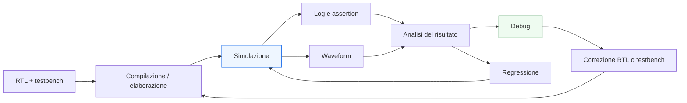
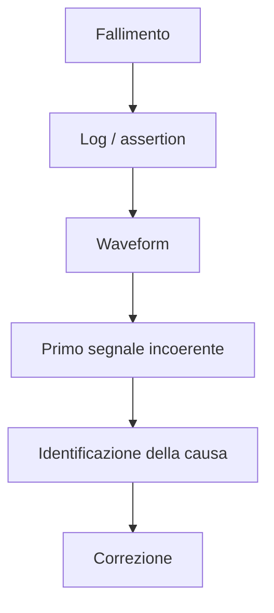

# Flusso di simulazione RTL

Dopo aver introdotto i **fondamenti della verifica**, la **struttura del testbench** e il ruolo delle **assertion**, il passo successivo naturale è descrivere il **flusso operativo** con cui una verifica RTL viene effettivamente eseguita. In altre parole: una volta scritto il DUT, costruito il testbench e definite le proprietà più importanti, come si procede in pratica per simulare, osservare, correggere e consolidare il comportamento del progetto?

Questa domanda è molto importante perché la qualità della verifica non dipende soltanto dalla bontà del singolo test, ma anche dal modo in cui l’intero ciclo di lavoro viene organizzato. Un flusso di simulazione ordinato aiuta a:
- trovare gli errori più rapidamente;
- distinguere tra bug del DUT e bug del testbench;
- rendere i risultati ripetibili;
- costruire regressioni affidabili;
- migliorare progressivamente la qualità del progetto.

Dal punto di vista metodologico, il flusso di simulazione è il punto in cui si incontrano in modo molto diretto:
- architettura;
- RTL;
- testbench;
- assertion;
- waveform;
- debug;
- iterazione progettuale.

Questa pagina affronta il tema con un taglio volutamente pratico ma concettuale: non entra in dettagli tool-specifici, ma descrive il processo generale che vale nella maggior parte dei flussi di verifica RTL seri, sia in contesti accademici sia in contesti professionali.

## 1. Perché serve un flusso di simulazione ordinato

La simulazione RTL non è un singolo comando lanciato una volta. È un processo iterativo che accompagna gran parte della vita del blocco.

### 1.1 Il problema di una verifica improvvisata
Se la simulazione viene eseguita in modo disordinato, si rischia di:
- non sapere quali casi siano stati davvero verificati;
- non riuscire a riprodurre un errore;
- confondere fallimenti del DUT con fallimenti del testbench;
- correggere un bug introducendone altri;
- perdere tempo in debug non strutturato.

### 1.2 Vantaggio di un flusso chiaro
Un flusso ordinato permette di:
- partire da casi piccoli e ripetibili;
- estendere progressivamente la copertura;
- capire da dove nasce una violazione;
- consolidare il comportamento dopo ogni correzione;
- costruire fiducia nel design.

### 1.3 Simulazione come ciclo di apprendimento
Ogni simulazione produce informazione utile:
- conferma che qualcosa funziona;
- evidenzia una discrepanza;
- chiarisce una latenza;
- mostra una violazione di protocollo;
- suggerisce dove la RTL o il testbench vanno migliorati.

## 2. Punto di partenza: DUT, testbench e proprietà

Prima di simulare, bisogna avere chiaro che cosa si sta effettivamente eseguendo.

### 2.1 DUT
Il DUT è il modulo o sottosistema che si vuole verificare.

### 2.2 Testbench
Il testbench fornisce:
- clock e reset;
- stimoli;
- monitor;
- checking;
- contesto temporale e funzionale.

### 2.3 Assertion
Le assertion trasformano regole del design in controlli espliciti durante la simulazione.

### 2.4 Configurazione del caso di prova
È importante sapere:
- quale configurazione parametrica del DUT si sta simulando;
- quale scenario il testbench sta esercitando;
- quale risultato o proprietà ci si aspetta.

Questa chiarezza iniziale rende tutto il flusso successivo molto più solido.

## 3. Fase di compilazione o elaborazione

Prima che la simulazione possa partire, RTL e testbench devono essere elaborati dal simulatore.

### 3.1 Scopo della fase iniziale
In questa fase si controlla che:
- i file siano coerenti;
- i moduli siano collegati correttamente;
- package, typedef e interfacce siano risolti;
- non ci siano errori sintattici o incompatibilità immediate.

### 3.2 Perché è già una fase utile
Molti problemi vengono intercettati qui:
- porte non coerenti;
- nomi mancanti;
- tipi incompatibili;
- uso scorretto di costrutti del linguaggio;
- dipendenze non risolte.

### 3.3 Valore metodologico
Anche se non è ancora simulazione funzionale, questa fase è già parte della qualità del flusso, perché impone coerenza strutturale al progetto.

## 4. Avvio della simulazione

Una volta preparato l’ambiente, la simulazione può essere eseguita.

### 4.1 Che cosa accade
Il simulatore esegue il comportamento combinatorio e sequenziale del DUT nel tempo, sotto gli stimoli prodotti dal testbench.

### 4.2 Che cosa si osserva
Durante l’esecuzione si possono osservare:
- messaggi del testbench;
- successi o fallimenti di checking;
- violazioni di assertion;
- waveform;
- eventi di protocollo;
- avanzamento degli stati e della pipeline.

### 4.3 Valore del primo run
Il primo run di un caso di test serve spesso a verificare che:
- il banco di prova parta correttamente;
- il reset sia coerente;
- i segnali principali si muovano come previsto;
- lo scenario abbia senso prima di aumentare la complessità.

## 5. Ruolo di clock e reset nel flusso di simulazione

Clock e reset non sono solo dettagli del testbench: sono la base su cui si interpreta l’intera simulazione.

### 5.1 Clock come riferimento temporale
La lettura dei risultati avviene quasi sempre in relazione ai cicli di clock:
- quando un input viene accettato;
- quando lo stato cambia;
- quando l’output diventa valido;
- quando una assertion temporale deve valere.

### 5.2 Reset come riferimento di validità
Molti test e molte proprietà hanno significato solo:
- durante il reset;
- immediatamente dopo il reset;
- dopo che il DUT è entrato in regime normale.

### 5.3 Buona disciplina
Un flusso ordinato rende sempre chiaro:
- quando il DUT è in reset;
- da quando i dati sono significativi;
- in quali fasi i risultati devono essere interpretati come validi.

## 6. Log della simulazione

Una parte molto importante del flusso è rappresentata dai messaggi generati durante la simulazione.

### 6.1 Perché i log sono utili
I log permettono di capire senza aprire subito le waveform:
- quale test è stato eseguito;
- in quale scenario si è verificato un problema;
- se una assertion è fallita;
- se il checking ha trovato una discrepanza;
- in quale ciclo o condizione.

### 6.2 Cosa dovrebbero contenere
Un log utile tende a riportare:
- nome del caso di prova;
- momento della simulazione o ciclo;
- descrizione del problema;
- valori o stato rilevanti;
- differenza tra atteso e osservato.

### 6.3 Perché servono log leggibili
Se i log sono troppo poveri, il debug rallenta. Se sono troppo rumorosi, si perde il segnale nel rumore. Il flusso di simulazione funziona meglio quando i messaggi sono informativi ma selettivi.

## 7. Ruolo delle assertion nel flusso operativo

Le assertion diventano parte attiva del flusso di simulazione.

### 7.1 Assertion come sensori
Durante il run, le assertion sorvegliano:
- protocolli;
- invarianti;
- condizioni di stato;
- relazioni temporali;
- latenza;
- stabilità del dato;
- handshake.

### 7.2 Perché aiutano tanto
Quando una assertion fallisce, spesso:
- il problema viene rilevato vicino alla sua origine;
- la proprietà violata è già esplicita;
- il debug inizia da un’informazione più forte rispetto a un semplice output sbagliato a fine sequenza.

### 7.3 Integrazione con log e waveform
Il valore massimo si ottiene quando:
- la assertion segnala il problema;
- il log lo contestualizza;
- la waveform permette di ricostruire il comportamento nel dettaglio.

## 8. Waveform: vedere il comportamento nel tempo

Le waveform sono uno degli strumenti centrali del debug RTL.

### 8.1 Perché sono importanti
Molti errori hardware non si capiscono guardando solo un risultato finale. Serve vedere:
- come si sono mossi i segnali nel tempo;
- in quale ordine sono avvenuti gli eventi;
- quali condizioni erano attive in ogni ciclo;
- come si sono comportati stato, pipeline e handshake.

### 8.2 Segnali tipicamente utili
È spesso utile osservare:
- clock e reset;
- ingressi principali;
- uscite principali;
- valid e ready;
- stato e next-state;
- registri di pipeline;
- enable e select;
- segnali di stall o flush.

### 8.3 Waveform come strumento di spiegazione
La waveform non serve solo a “vedere qualcosa che si muove”, ma a costruire una spiegazione del comportamento:
- perché il dato non è avanzato;
- perché una transizione non è avvenuta;
- perché un risultato è arrivato in ritardo;
- perché un protocollo si è bloccato.

## 9. Dalla violazione al debug

Quando qualcosa fallisce, il flusso corretto porta dal sintomo alla causa.

### 9.1 Punto di ingresso del debug
Il debug può iniziare da:
- una assertion fallita;
- un mismatch nel checking;
- un timeout;
- un output mancante;
- una waveform anomala.

### 9.2 Domande giuste
Le prime domande utili sono:
- il problema è nel DUT o nel testbench?
- l’ingresso è stato applicato correttamente?
- il protocollo è stato rispettato?
- il reset è stato gestito bene?
- il comportamento atteso era formulato correttamente?
- l’errore nasce nella logica combinatoria, nel controllo, nella pipeline o nell’interfaccia?

### 9.3 Procedere per livelli
Un buon debug cerca di:
1. localizzare il ciclo in cui il comportamento devia;
2. capire il primo segnale che diventa incoerente;
3. distinguere effetto e causa;
4. verificare se il bug è strutturale o legato a un caso specifico.

## 10. DUT o testbench? distinguere la causa del problema

Uno degli aspetti più importanti del flusso di simulazione è capire se il bug è nel design o nell’ambiente di verifica.

### 10.1 Bug del DUT
Esempi tipici:
- transizione di stato errata;
- output combinatorio non corretto;
- pipeline disallineata;
- protocollo non rispettato;
- reset incompleto.

### 10.2 Bug del testbench
Esempi tipici:
- stimolo applicato nel ciclo sbagliato;
- aspettativa temporale errata;
- checker troppo rigido o scritto male;
- interpretazione scorretta del protocollo;
- errore nella generazione del reset.

### 10.3 Perché è una distinzione cruciale
Se si corregge il DUT per compensare un testbench errato, il progetto peggiora. Se si corregge il testbench quando il bug è nel DUT, si rischia di nascondere un difetto reale. Il flusso di simulazione deve quindi aiutare a distinguere chiaramente i due casi.

## 11. Correzione e rerun

Una volta identificata la causa del problema, il ciclo continua con la correzione e una nuova simulazione.

### 11.1 Correzione locale
La correzione può riguardare:
- RTL del DUT;
- assertion;
- checker;
- testbench;
- definizione della latenza attesa;
- gestione del reset o del protocollo.

### 11.2 Importanza del rerun
Dopo ogni correzione, conviene:
- rieseguire il caso che ha fallito;
- verificare che il problema sia davvero sparito;
- controllare che non siano comparsi nuovi fallimenti correlati.

### 11.3 Disciplina dell’iterazione
Il ciclo corretto è:
- osserva il problema;
- capisci la causa;
- correggi;
- riesegui;
- consolida.

Questo approccio è molto più affidabile di modifiche multiple fatte senza controllo.

## 12. Regressione: non verificare solo l’ultimo bug

Quando il progetto cresce, non basta più verificare il solo caso appena corretto.

### 12.1 Che cos’è una regressione
Una regressione è l’esecuzione di un insieme di test già definiti, con lo scopo di verificare che nuove modifiche non abbiano rotto comportamenti già funzionanti.

### 12.2 Perché è fondamentale
Molti bug vengono introdotti non nel punto appena modificato, ma come effetto collaterale su:
- protocolli già stabili;
- latenza di casi già verificati;
- segnali di controllo condivisi;
- configurazioni parametriche diverse;
- casi limite già coperti in passato.

### 12.3 Beneficio progettuale
La regressione aumenta la fiducia nel design e rende il flusso di sviluppo molto più solido.

## 13. Organizzare i casi di simulazione

Un flusso di simulazione efficace beneficia di una struttura chiara dei casi di prova.

### 13.1 Dai casi semplici a quelli complessi
Conviene distinguere:
- smoke test iniziali;
- casi nominali;
- corner case;
- casi di protocollo;
- casi di stall / flush / backpressure;
- casi di reset;
- casi di latenza e throughput.

### 13.2 Vantaggio di una libreria di scenari
Avere casi di prova riconoscibili permette di sapere:
- che cosa è già coperto;
- cosa va rilanciato dopo una modifica;
- quali aspetti del DUT sono più fragili;
- dove concentrare il debug.

### 13.3 Collegamento con la manutenzione
Quando il DUT evolve, una buona organizzazione dei test rende più facile aggiornare la verifica senza perdere coerenza.

## 14. Flusso di simulazione e verifica incrementale

Una buona verifica cresce in modo incrementale, non da un ambiente enorme costruito tutto in una volta.

### 14.1 Primo livello
Si parte spesso da:
- compilazione pulita;
- reset corretto;
- un caso base;
- checking elementare;
- una o due assertion importanti.

### 14.2 Secondo livello
Poi si aggiungono:
- sequenze multiple;
- casi di backpressure;
- pipeline più piena;
- corner case;
- coverage più significativa;
- regressione.

### 14.3 Perché questo approccio funziona
Crescere per passi controllati permette di:
- mantenere leggibilità;
- localizzare più facilmente gli errori;
- evitare che testbench e DUT diventino opachi troppo presto.

## 15. Ruolo dello stile RTL nel flusso di simulazione

La qualità del flusso dipende molto anche da come è scritta la RTL.

### 15.1 RTL leggibile, debug più rapido
Se il DUT ha:
- segnali con nomi chiari;
- separazione tra combinatoria e sequenziale;
- FSM ordinate;
- interfacce ben modellate;
- pipeline leggibili;

allora anche la lettura delle waveform e dei log risulta molto più efficace.

### 15.2 RTL confusa, debug lento
Quando il codice è troppo compatto o ambiguo:
- le waveform sono più difficili da interpretare;
- il primo punto di divergenza è più difficile da trovare;
- i fallimenti delle assertion sono meno immediati da capire.

### 15.3 Verificabilità come proprietà del design
Il flusso di simulazione funziona meglio quando la verificabilità è stata considerata già durante la scrittura della RTL.

## 16. Ruolo delle configurazioni e dei parametri

Nei progetti parametrizzati, il flusso di simulazione deve tenere conto anche delle diverse configurazioni.

### 16.1 Configurazione simulata
È importante sapere sempre:
- con quali parametri il DUT è stato istanziato;
- se la latenza o il numero di canali dipendono dalla configurazione;
- se il protocollo cambia in base alle opzioni abilitate.

### 16.2 Perché è importante
Una proprietà verificata in una configurazione potrebbe non valere automaticamente in un’altra.

### 16.3 Strategia realistica
Conviene identificare:
- configurazioni principali;
- configurazioni supportate;
- configurazioni più critiche da regredire.

## 17. Collegamento con FPGA e ASIC

Anche se il flusso di simulazione RTL è concettualmente indipendente dal target, il suo ruolo pratico cambia in funzione del contesto.

### 17.1 Su FPGA
Nel flusso FPGA, la simulazione RTL è spesso il passaggio che precede:
- sintesi;
- implementazione;
- prototipazione;
- debug sul dispositivo.

Questo significa che una buona simulazione riduce molto il costo del debug successivo.

### 17.2 Su ASIC
Nel flusso ASIC, la simulazione RTL ha un peso ancora maggiore, perché:
- intercettare bug tardi è molto più costoso;
- sintesi, DFT, floorplanning, PnR e signoff dipendono da una forte fiducia nella correttezza del design;
- la regressione RTL è una base essenziale prima delle fasi più avanzate.

### 17.3 Visione comune
In entrambi i casi, la simulazione RTL ben organizzata è il fondamento della fiducia nel blocco.

## 18. Errori comuni nel flusso di simulazione

Alcuni errori ricorrono spesso e compromettono l’efficacia della verifica.

### 18.1 Simulare senza obiettivi chiari
Lanciare test senza sapere che cosa si vuole verificare produce poco valore.

### 18.2 Non distinguere sintomo e causa
Correggere il primo segnale sbagliato senza capire l’origine dell’errore può peggiorare il progetto.

### 18.3 Fare debug solo sulle waveform
Le waveform sono essenziali, ma senza log e checking adeguati il debug diventa più lento e meno sistematico.

### 18.4 Non regredire
Correggere un bug e non rilanciare gli scenari principali espone il progetto a regressioni silenziose.

### 18.5 Testbench poco chiaro
Un banco di prova confuso può rendere il flusso di simulazione meno affidabile del dovuto.

## 19. Buone pratiche operative

Per impostare un buon flusso di simulazione RTL, alcune pratiche risultano particolarmente efficaci.

### 19.1 Partire da test piccoli e ripetibili
Meglio casi chiari e controllabili che scenari enormi e poco leggibili.

### 19.2 Rendere i fallimenti informativi
Log, checker e assertion dovrebbero indicare subito il contesto del problema.

### 19.3 Usare le waveform come strumento di ricostruzione
La waveform deve aiutare a spiegare il comportamento, non solo a constatare che qualcosa è diverso dal previsto.

### 19.4 Iterare in modo disciplinato
Ogni correzione dovrebbe essere seguita da:
- rerun del caso fallito;
- regressione dei casi principali;
- consolidamento della fiducia nel design.

### 19.5 Mantenere allineati DUT, testbench e proprietà
Il flusso funziona bene quando design, scenari di prova e assertion evolvono insieme in modo coerente.

## 20. Collegamento con il resto della sezione

Questa pagina chiude in modo naturale il primo blocco della verifica e si collega direttamente ai temi già introdotti:
- **`verification-basics.md`** ha definito che cosa significa verificare un DUT;
- **`testbench-structure.md`** ha mostrato come organizzare il banco di prova;
- **`assertions-basics.md`** ha introdotto il checking dichiarativo di proprietà e protocolli;
- **`interfaces-and-handshake.md`**, **`pipelining.md`** e **`latency-and-throughput.md`** hanno mostrato che gran parte della correttezza del blocco è temporale e protocollare;
- **`coding-style-rtl.md`** ha evidenziato che una RTL ben scritta rende anche il flusso di simulazione più leggibile ed efficace.

Il flusso di simulazione è quindi il punto in cui tutti questi elementi diventano pratica quotidiana di progettazione e verifica.

## 21. In sintesi

Il flusso di simulazione RTL è il processo iterativo con cui il progetto viene compilato, eseguito, osservato, corretto e consolidato. Non riguarda solo lanciare una simulazione, ma organizzare in modo disciplinato:
- il contesto di verifica;
- l’osservazione del comportamento;
- la diagnosi dei problemi;
- la correzione;
- la regressione.

Un buon flusso rende la verifica più ripetibile, il debug più rapido e il progetto più affidabile. Per questo motivo, è una parte essenziale della maturità progettuale in SystemVerilog, sia in percorsi orientati a FPGA sia in flussi ASIC più rigorosi.

## Prossimo passo

Il passo più naturale ora è **`coverage-basics.md`**, perché dopo aver costruito il flusso di simulazione conviene affrontare una domanda fondamentale della verifica:
- quanto abbiamo davvero verificato?

Questa pagina potrebbe introdurre in modo ordinato:
- significato della coverage
- coverage funzionale e strutturale
- stati e transizioni visitate
- casi esercitati e casi mancanti
- rapporto tra coverage, qualità del testbench e fiducia nel design

In alternativa, un altro passo molto naturale è **`reset-strategies.md`**, se vuoi tornare su un tema RTL/verification trasversale molto importante per robustezza, integrazione e debug.
