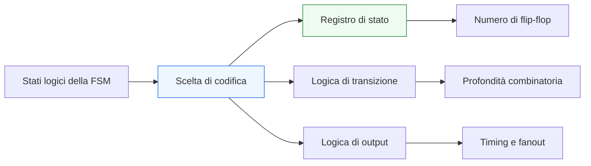
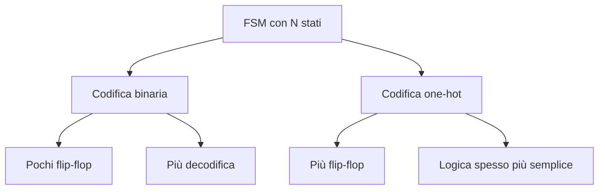

# Codifica degli stati nelle FSM

Dopo aver introdotto le **Finite State Machine** come struttura fondamentale della progettazione RTL, il passo successivo naturale è capire **come gli stati vengono rappresentati fisicamente** all’interno dell’hardware. Questa scelta prende il nome di **state encoding** e ha un impatto molto concreto su:
- numero di flip-flop usati;
- complessità della logica combinatoria;
- timing;
- area;
- consumi;
- leggibilità del debug;
- comportamento dei tool di sintesi.

Dal punto di vista concettuale, una FSM nasce come insieme di stati simbolici: `IDLE`, `WAIT`, `LOAD`, `RUN`, `DONE`, `ERROR`. Tuttavia, quando il progetto viene sintetizzato, ogni stato deve essere tradotto in una rappresentazione binaria o equivalente, cioè in un insieme di bit memorizzati nei registri di stato.

Questa pagina analizza le principali strategie di codifica degli stati in SystemVerilog e nel flusso RTL, collegandole in modo esplicito a **verifica**, **timing**, **FPGA**, **ASIC** e qualità complessiva della descrizione hardware.

## 1. Perché la codifica degli stati è importante

Quando si progetta una FSM, è naturale concentrarsi prima sul comportamento funzionale:
- quali stati servono;
- quando avvengono le transizioni;
- quali uscite devono essere generate.

Tuttavia, una volta fissata la struttura logica, resta una scelta implementativa non banale: **come rappresentare quegli stati nei registri**.

### 1.1 Non è solo un dettaglio interno
La codifica degli stati influenza:
- quanta memoria serve per rappresentare la FSM;
- quanta logica serve per decodificare stato e transizioni;
- quanto sarà facile chiudere il timing;
- quanto sarà leggibile il comportamento in simulazione e debug;
- quanto il tool di sintesi potrà ottimizzare il blocco.

### 1.2 Impatto lungo il flusso
La scelta di encoding si riflette lungo tutto il flusso:
- in **RTL**, cambia il modo in cui si ragiona sulla FSM;
- in **sintesi**, cambia il compromesso tra flip-flop e logica combinatoria;
- in **timing**, cambia la profondità dei percorsi;
- in **verifica**, cambia la leggibilità degli stati;
- in **FPGA** e **ASIC**, cambia il modo in cui la FSM si adatta al target fisico.

### 1.3 Principio chiave
Non esiste una codifica universalmente migliore. Esiste invece una codifica più adatta a:
- un certo numero di stati;
- un certo obiettivo di area o prestazioni;
- un certo tipo di implementazione;
- una certa metodologia di verifica e manutenzione.

## 2. Stato logico e stato fisico

Per capire bene lo state encoding, conviene distinguere due livelli.

### 2.1 Stato logico
Lo stato logico è il significato funzionale della FSM:
- `IDLE`
- `WAIT_REQ`
- `LOAD_DATA`
- `PROCESS`
- `DONE`

Questi nomi descrivono fasi operative, non numeri.

### 2.2 Stato fisico
Lo stato fisico è la rappresentazione effettiva di quegli stati nei flip-flop del registro di stato. Per esempio, uno stato può essere codificato come:
- `000`
- `001`
- `010`
- `011`

oppure come:

- `00001`
- `00010`
- `00100`
- `01000`

a seconda della strategia scelta.

### 2.3 Perché la distinzione è utile
Questa separazione aiuta a capire che:
- l’architettura della FSM non coincide automaticamente con la sua codifica;
- la stessa FSM può essere implementata con codifiche diverse;
- la scelta di encoding cambia la struttura hardware senza cambiare il comportamento funzionale.

## 3. Ruolo di SystemVerilog nella codifica degli stati

SystemVerilog aiuta molto nella gestione della codifica perché permette di rappresentare gli stati con costrutti più espressivi rispetto al Verilog classico.

### 3.1 Uso di `enum`
L’uso di `enum` è particolarmente importante perché consente di:
- esprimere gli stati con nomi simbolici;
- migliorare leggibilità del codice;
- migliorare leggibilità delle waveform;
- ridurre il rischio di errori da costanti numeriche sparse.

### 3.2 Astrazione utile ma non totale
L’uso di `enum` migliora la qualità della RTL, ma non elimina il problema della codifica:
- il progettista può scegliere la codifica esplicita;
- il tool può inferire o ottimizzare una certa codifica;
- alcune metodologie impongono uno stile o una scelta precisa.

### 3.3 Beneficio metodologico
Con `enum`, il codice della FSM resta leggibile anche quando la codifica fisica cambia. Questo è molto utile in:
- manutenzione;
- verifica;
- review del design;
- confronto tra versioni diverse del blocco.

## 4. Codifica binaria compatta

La codifica binaria compatta è una delle strategie più intuitive. Gli stati vengono rappresentati usando il numero minimo di bit necessario a codificare tutti gli stati.

### 4.1 Idea di base
Se una FSM ha `N` stati, la codifica binaria usa circa:
- `ceil(log2(N))` bit di stato.

Per esempio:
- 4 stati → 2 bit
- 8 stati → 3 bit
- 16 stati → 4 bit

### 4.2 Vantaggi
I vantaggi principali sono:
- meno flip-flop;
- minore occupazione di memoria di stato;
- buona efficienza quando il numero di stati cresce;
- spesso area più contenuta in contesti ASIC sensibili al numero di registri.

### 4.3 Svantaggi
Gli svantaggi principali sono:
- logica di decodifica più articolata;
- possibile aumento della profondità combinatoria;
- maggiore complessità nella logica di transizione;
- talvolta timing meno favorevole rispetto a codifiche più esplicite.

### 4.4 Quando è adatta
La codifica binaria è spesso una buona scelta quando:
- il numero di stati è elevato;
- l’obiettivo di area è importante;
- il costo dei flip-flop è un fattore rilevante;
- la logica di transizione resta gestibile.

## 5. Codifica one-hot

La codifica **one-hot** assegna un bit dedicato a ciascuno stato. In ogni istante, un solo bit del registro di stato vale `1`, mentre tutti gli altri valgono `0`.

### 5.1 Idea di base
Se una FSM ha `N` stati, la codifica one-hot usa:
- `N` flip-flop.

Per esempio:
- 5 stati → 5 bit
- 10 stati → 10 bit

### 5.2 Vantaggi
I vantaggi principali sono:
- decodifica degli stati molto semplice;
- logica combinatoria spesso più diretta;
- transizioni più leggibili;
- buon comportamento temporale in molti casi;
- particolarmente favorevole in molti contesti FPGA.

### 5.3 Svantaggi
Gli svantaggi principali sono:
- uso più elevato di flip-flop;
- possibile aumento del fanout dei segnali di stato;
- costo meno favorevole quando il numero di stati cresce molto;
- area o potenza non sempre ottimali in ASIC.

### 5.4 Quando è adatta
La codifica one-hot è spesso molto utile quando:
- il numero di stati è moderato;
- la semplicità della logica combinatoria è prioritaria;
- il timing è critico;
- il target è FPGA;
- si vuole rendere il debug molto leggibile.

## 6. Codifica gray e codifiche speciali

Oltre a binaria compatta e one-hot, esistono altre strategie di codifica, usate in casi specifici.

### 6.1 Codifica Gray
Nella codifica Gray, stati adiacenti vengono rappresentati in modo che cambi un solo bit alla volta tra alcune transizioni.

#### Possibili vantaggi
- riduzione di alcune commutazioni;
- utilità in percorsi specifici;
- migliore gestione di alcune proprietà di switching.

#### Limiti
- non sempre naturale per FSM generiche;
- richiede che la struttura delle transizioni la renda davvero utile;
- spesso non è la scelta principale nelle FSM di controllo standard.

### 6.2 Codifiche custom
In alcuni progetti si usano codifiche specifiche per:
- vincoli di timing particolari;
- esigenze di sicurezza;
- rilevazione di errori;
- ottimizzazione di transizioni dominanti;
- compatibilità con logiche già esistenti.

### 6.3 Quando ha senso uscire dagli schemi comuni
Una codifica custom ha senso quando:
- esiste una motivazione architetturale concreta;
- il guadagno è verificabile;
- il costo in leggibilità e manutenzione è accettabile.

## 7. Compromesso tra flip-flop e logica combinatoria

La scelta dell’encoding può essere vista come un compromesso tra due risorse fondamentali:
- **numero di registri**
- **complessità della logica combinatoria**

### 7.1 Codifica binaria
Tende a:
- minimizzare i flip-flop;
- aumentare la logica di decodifica;
- rendere alcune transizioni più dense dal punto di vista combinatorio.

### 7.2 Codifica one-hot
Tende a:
- aumentare i flip-flop;
- semplificare la decodifica;
- rendere più immediato il riconoscimento dello stato attivo.

### 7.3 Visione hardware
Questo compromesso è centrale perché:
- i flip-flop hanno costo;
- la logica combinatoria introduce ritardo;
- il fanout può crescere;
- il comportamento reale dipende anche dal target fisico.

## 8. Impatto sul timing

Lo state encoding influisce in modo diretto sul timing della FSM.

### 8.1 Profondità della logica di transizione
Con codifiche compatte, il riconoscimento di uno stato e il calcolo delle transizioni possono richiedere più logica combinatoria.

### 8.2 Decodifica delle uscite
Se molte uscite dipendono dallo stato, una codifica più semplice da decodificare può ridurre il ritardo combinatorio.

### 8.3 Fanout
Con la one-hot, ogni bit di stato può avere fanout verso molte transizioni o uscite. Questo può essere favorevole oppure no, a seconda del design e del target.

### 8.4 Timing closure
La scelta migliore dal punto di vista del timing dipende spesso da:
- numero di stati;
- struttura delle transizioni;
- complessità delle uscite;
- target FPGA o ASIC;
- capacità del tool di sintesi di ottimizzare il caso specifico.

In altre parole, il timing non dipende solo “dal numero di bit”, ma dalla forma complessiva della logica risultante.

## 9. Impatto su area e consumo

Anche area e consumo possono essere influenzati in modo significativo.

### 9.1 Area
- La codifica binaria tende a usare meno flip-flop.
- La codifica one-hot tende a usare più flip-flop ma talvolta meno logica combinatoria.
- L’area finale dipende dal bilancio tra registri e combinatoria.

### 9.2 Potenza
Il consumo dipende da:
- numero di elementi che commutano;
- frequenza di commutazione;
- fanout;
- struttura delle transizioni.

Non è quindi corretto assumere in modo automatico che una codifica sia sempre migliore anche dal punto di vista energetico.

### 9.3 Visione pratica
In progetti reali, area e consumo si valutano sulla netlist sintetizzata e, se necessario, dopo implementazione fisica. L’encoding è una leva importante, ma va giudicato nel contesto del blocco reale.

## 10. Differenze pratiche tra FPGA e ASIC

Una delle ragioni per cui lo state encoding è così importante è che il suo effetto cambia a seconda del target.

## 10.1 Su FPGA
Nelle FPGA, i flip-flop sono spesso abbondanti e distribuiti insieme alla logica configurabile. Per questo motivo:
- una codifica one-hot può essere molto naturale;
- la riduzione della logica combinatoria può aiutare il timing;
- la leggibilità del debug è spesso buona;
- il costo aggiuntivo in registri può essere accettabile.

### 10.2 Su ASIC
Negli ASIC, i flip-flop hanno un costo più esplicito in:
- area;
- clock tree load;
- potenza dinamica e statica;
- complessità del backend.

Per questo una codifica binaria o più compatta può risultare più favorevole, soprattutto quando:
- il numero di stati è elevato;
- l’area è sensibile;
- il clock tree è già critico;
- la logica combinatoria resta sotto controllo.

### 10.3 Nessuna regola assoluta
Anche qui non esiste una regola universale. Esistono però tendenze pratiche:
- **FPGA**: spesso one-hot è competitiva o preferibile;
- **ASIC**: spesso encoding più compatti sono interessanti, ma il timing può comunque favorire altre scelte.

## 11. Ruolo dei tool di sintesi

In molti flussi di progetto, la codifica degli stati non è determinata solo dal progettista, ma anche dal comportamento del tool di sintesi.

### 11.1 Riconoscimento automatico della FSM
I tool moderni spesso riconoscono automaticamente le FSM e possono:
- ottimizzarne la codifica;
- cambiare encoding per migliorare area o timing;
- applicare strategie diverse in base al target.

### 11.2 Controllo del progettista
Il progettista può comunque voler:
- mantenere una codifica esplicita;
- guidare il tool con direttive o attributi;
- evitare cambiamenti che rendano il debug meno prevedibile;
- confrontare più strategie in sintesi.

### 11.3 Attenzione metodologica
Quando la codifica viene lasciata al tool, conviene ricordare che:
- il comportamento funzionale deve restare invariato;
- debug e correlazione con la RTL possono diventare meno immediati;
- i risultati vanno verificati su report di sintesi e timing, non solo assunti a priori.

## 12. Debug e leggibilità delle waveform

La codifica degli stati ha un impatto pratico anche sul debug.

### 12.1 Leggibilità simbolica
Se gli stati sono descritti con `enum`, le waveform risultano spesso molto più leggibili, indipendentemente dalla codifica interna.

### 12.2 Interpretazione del registro di stato
In alcuni casi, una codifica one-hot rende più immediato capire quale stato è attivo anche a basso livello, perché ogni bit corrisponde a una fase specifica.

### 12.3 Correlazione con il comportamento
Una codifica poco leggibile o ottimizzata in modo aggressivo può rendere più difficile:
- capire transizioni anomale;
- correlare il comportamento ai report di sintesi;
- fare debug post-sintesi o post-implementazione.

Per questo la scelta di encoding ha anche una dimensione metodologica, non solo hardware.

## 13. Robustezza e stati illegali

Un altro tema importante è la gestione degli stati non validi o corrotti.

### 13.1 Stati illegali
A seconda della codifica, possono esistere combinazioni di bit che non corrispondono a nessuno stato legittimo.

### 13.2 Implicazioni
Questo può avere impatto su:
- robustezza del blocco;
- comportamento in presenza di upset o corruzioni;
- gestione di recovery;
- verifica delle condizioni anomale.

### 13.3 Codifiche e rilevazione errori
Alcune codifiche rendono più facile:
- riconoscere stati illegali;
- costruire meccanismi di recovery;
- intercettare corruzioni del registro di stato.

Questo può essere rilevante in sistemi affidabili, safety-oriented o particolarmente esposti a condizioni anomale.

## 14. Buone pratiche di modellazione in SystemVerilog

Per gestire bene lo state encoding in una FSM SystemVerilog, alcune pratiche sono particolarmente utili.

### 14.1 Pensare prima agli stati logici
Prima di scegliere la codifica, è importante che gli stati abbiano significato architetturale chiaro.

### 14.2 Usare `enum`
Aiuta leggibilità, manutenzione, review e verifica.

### 14.3 Separare semantica e rappresentazione
La descrizione RTL dovrebbe rendere chiaro il comportamento della FSM anche se la codifica viene modificata.

### 14.4 Valutare l’encoding rispetto all’obiettivo
La scelta va fatta considerando:
- numero di stati;
- timing;
- area;
- target FPGA o ASIC;
- facilità di debug;
- comportamento del tool.

### 14.5 Verificare sui risultati reali
Quando l’encoding è una leva importante, conviene confrontare:
- report di sintesi;
- utilizzo risorse;
- timing;
- fanout;
- comportamento di debug.

## 15. Errori comuni

Alcuni errori ricorrenti legati allo state encoding meritano attenzione.

### 15.1 Pensare che una codifica sia sempre migliore
Una scelta valida in FPGA può non esserlo in ASIC, e viceversa.

### 15.2 Ignorare il ruolo del tool
Il tool può cambiare encoding o ottimizzarlo in modi non immediatamente visibili.

### 15.3 Confondere leggibilità RTL e struttura fisica
Una FSM leggibile con `enum` può comunque avere implicazioni hardware molto diverse a seconda dell’encoding finale.

### 15.4 Non considerare il timing
Lo state encoding non va scelto solo in base al numero di flip-flop, ma anche alla complessità della logica risultante.

### 15.5 Non valutare il debug
Una codifica che rende il debug difficile può rallentare molto bring-up, verifica e manutenzione.

## 16. Collegamento con il resto della sezione

Questa pagina si collega direttamente a:
- **`fsm.md`**, che ha introdotto struttura, stato, next-state e uscite;
- **`combinational-vs-sequential.md`**, che ha chiarito la separazione tra stato e logica di transizione;
- **`procedural-blocks.md`**, che ha mostrato come modellare correttamente la parte combinatoria e sequenziale;
- le future pagine su controllo, datapath, timing e verifica, dove le FSM avranno un ruolo ancora più concreto.

Lo state encoding rappresenta quindi il livello in cui una scelta apparentemente locale sulla FSM diventa una decisione con impatto architetturale e fisico.

## 17. In sintesi

La codifica degli stati nelle FSM è il ponte tra la rappresentazione logica del comportamento e la sua implementazione fisica nei registri. Scegliere l’encoding significa decidere come bilanciare:
- numero di flip-flop;
- complessità della logica combinatoria;
- timing;
- area;
- leggibilità;
- robustezza del debug.

La codifica binaria compatta e la one-hot sono le due strategie più comuni, ma la scelta corretta dipende sempre dal contesto:
- numero di stati;
- obiettivi di progetto;
- target FPGA o ASIC;
- comportamento del tool di sintesi;
- priorità tra area, prestazioni e manutenzione.

In una progettazione RTL matura, lo state encoding non è un dettaglio nascosto, ma una leva importante per ottenere FSM più efficienti, più verificabili e più coerenti con gli obiettivi reali del sistema.

## Prossimo passo

Il passo più naturale ora è **`datapath-and-control.md`**, per mostrare come una FSM si inserisce davvero in un blocco RTL più ampio e come interagisce con:
- registri;
- mux;
- enable;
- pipeline;
- unità di controllo.

In alternativa, un altro passo molto naturale è **`case-statements-fsm.md`**, se vuoi approfondire prima la scrittura concreta e ordinata della logica di transizione e delle uscite nelle FSM SystemVerilog.
