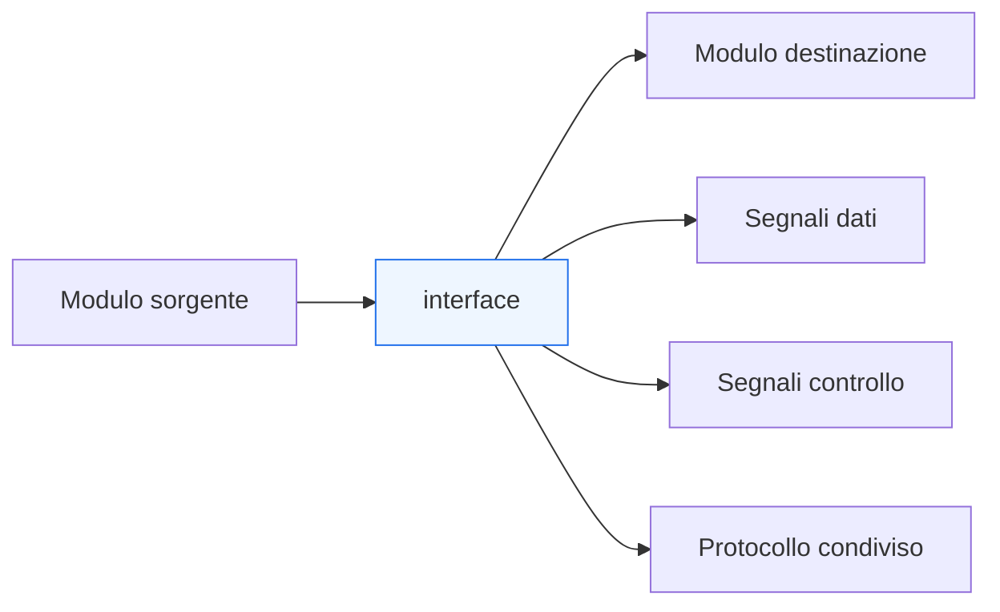
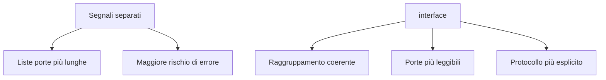

# Le `interface` in SystemVerilog

Dopo aver chiarito il ruolo delle **interfacce** e dei **meccanismi di handshake** dal punto di vista architetturale e RTL, il passo successivo naturale è introdurre il costrutto `interface` di **SystemVerilog**. Questo costrutto nasce per organizzare in modo più ordinato i segnali che collegano moduli diversi, ridurre la frammentazione delle porte e rendere più chiara la struttura dei collegamenti in un progetto digitale.

In una progettazione reale, infatti, molti moduli comunicano attraverso gruppi di segnali che hanno un significato comune:
- bus dati;
- segnali di validità;
- segnali di disponibilità;
- comandi;
- risposte;
- segnali di errore;
- clock e reset associati a un certo dominio o protocollo.

Quando questi segnali vengono gestiti solo come porte separate del modulo, il codice può diventare rapidamente più verboso, più fragile e meno leggibile. Il costrutto `interface` serve proprio a raccogliere questi segnali in un’unità coerente, rendendo più esplicita la struttura del collegamento.

Questa pagina introduce `interface` e `modport` con un taglio coerente con il resto della sezione: non come semplice caratteristica sintattica del linguaggio, ma come strumento progettuale con effetti su:
- leggibilità dell’RTL;
- modularità;
- riuso;
- verifica;
- integrazione tra blocchi;
- qualità del flusso FPGA e ASIC.

## 1. Perché introdurre `interface`

Quando un progetto cresce, i collegamenti tra moduli diventano più numerosi e più ricchi di significato. Un semplice scambio di dati può richiedere:
- bus dati;
- `valid`;
- `ready`;
- segnali di start e done;
- codici operazione;
- identificatori;
- segnali di errore;
- reset e clock associati.

Gestire tutto questo con liste di porte separate può rendere il design:
- difficile da leggere;
- soggetto a errori di connessione;
- più faticoso da mantenere;
- meno riusabile.

### 1.1 Obiettivo del costrutto
`interface` serve a:
- raggruppare segnali correlati;
- rappresentare meglio un protocollo o un canale;
- evitare duplicazioni inutili nelle dichiarazioni di porta;
- chiarire quali segnali fanno parte dello stesso collegamento logico.

### 1.2 Effetto metodologico
Usare `interface` significa passare da una visione in cui i segnali sono elencati in modo sparso a una visione in cui l’interfaccia è un oggetto logico del progetto.

## 2. Che cos’è una `interface`

In SystemVerilog, una `interface` è una struttura che contiene una collezione di segnali e, opzionalmente, anche altri elementi del linguaggio utili a descrivere il comportamento del collegamento tra moduli.

### 2.1 Contenuto tipico
Una `interface` può contenere:
- segnali `logic`;
- vettori e strutture dati;
- clock e reset associati;
- parametri;
- assegnazioni;
- task o funzioni;
- `modport` per definire il punto di vista dei moduli collegati.

### 2.2 Significato progettuale
Dal punto di vista RTL, una `interface` rappresenta un **canale di comunicazione strutturato**. Non è solo un contenitore sintattico: è il modo in cui si rende esplicito che un gruppo di segnali appartiene allo stesso protocollo o alla stessa relazione tra moduli.

### 2.3 Differenza rispetto a un semplice bundle informale
Senza `interface`, il progettista può comunque “pensare” a un insieme di segnali come a un’interfaccia, ma il linguaggio non lo rende un’entità esplicita. Con `interface`, questa relazione diventa parte formale del codice.

## 3. Quando ha senso usare `interface`

Il costrutto `interface` non è sempre necessario, ma diventa molto utile in diversi casi.

### 3.1 Collegamenti ricchi di segnali
Se più moduli condividono un protocollo con molti segnali correlati, `interface` aiuta a mantenere ordine.

### 3.2 Riuso di protocolli o canali
Quando lo stesso tipo di collegamento compare in più parti del progetto, usare `interface` rende più facile il riuso.

### 3.3 Sistemi gerarchici
In progetti con molti livelli gerarchici, `interface` può ridurre la complessità delle liste porte.

### 3.4 Verifica e testbench
Le `interface` sono molto utili anche in verifica, perché permettono di osservare e guidare un protocollo in modo ordinato.

### 3.5 Integrazione tra moduli
Quando un blocco viene integrato in una struttura più ampia, avere interfacce ben definite riduce il rischio di errori di cablaggio e semplifica la documentazione.

## 4. `interface` come estensione del concetto architetturale di interfaccia

Nella pagina precedente, il termine “interfaccia” è stato usato in senso progettuale: come contratto tra moduli. Il costrutto `interface` porta questa idea dentro il linguaggio.

### 4.1 Dall’idea al costrutto
Prima si definisce il protocollo:
- quali segnali servono;
- quale significato hanno;
- come avviene il trasferimento.

Poi, con `interface`, si traduce questo protocollo in una struttura formale del codice.

### 4.2 Beneficio concettuale
Questo riduce la distanza tra:
- documentazione dell’architettura;
- implementazione RTL;
- visione del collegamento in verifica.

### 4.3 Collegamento con handshake
Se un canale usa `valid` / `ready`, oppure `start` / `done`, l’uso di `interface` aiuta a mantenere insieme:
- dato;
- controllo;
- eventuale stato o metadata associati.

## 5. Organizzazione dei segnali in una `interface`

Uno dei vantaggi principali di `interface` è la possibilità di raccogliere i segnali in modo semanticamente ordinato.

### 5.1 Dati e controllo nello stesso contenitore
In un’interfaccia di trasferimento, è naturale voler tenere insieme:
- bus dati;
- bit di validità;
- disponibilità alla ricezione;
- segnale di errore;
- eventuale identificatore o tipo operazione.

### 5.2 Coerenza del collegamento
Quando questi segnali sono definiti nello stesso oggetto:
- è più chiaro che appartengono allo stesso protocollo;
- è più difficile dimenticarne uno;
- è più semplice documentare il canale.

### 5.3 Riduzione del rumore nelle porte dei moduli
Al posto di dichiarare molte porte indipendenti, il modulo può ricevere una o più interfacce con nome significativo. Questo rende la struttura del modulo più leggibile.

## 6. Il ruolo di `modport`

Uno degli aspetti più importanti di `interface` in SystemVerilog è il costrutto `modport`, che permette di definire il **punto di vista** di ciascun modulo rispetto ai segnali dell’interfaccia.

### 6.1 Perché serve `modport`
Un’interfaccia contiene molti segnali, ma non tutti hanno la stessa direzione per tutti i moduli. Un lato può produrre `data` e `valid`, mentre l’altro lato produce `ready`.

Senza un meccanismo di vista parziale e orientata, si perderebbe chiarezza su:
- chi guida cosa;
- chi osserva cosa;
- quale ruolo ha ogni modulo nel protocollo.

### 6.2 Che cosa definisce `modport`
`modport` specifica:
- quali segnali sono visibili a un certo modulo;
- quali sono in input;
- quali sono in output;
- quale ruolo ha quel modulo rispetto all’interfaccia.

### 6.3 Significato progettuale
Con `modport`, la stessa `interface` può essere vista in modi diversi da:
- modulo sorgente;
- modulo ricevente;
- logica di monitoraggio;
- ambiente di testbench.

Questo è molto utile perché rende il protocollo unico, ma con ruoli distinti e ben formalizzati.

## 7. `interface` e chiarezza delle direzioni

Uno dei vantaggi metodologici più forti di `modport` è la chiarificazione delle direzioni dei segnali.

### 7.1 Problema senza `modport`
Se un gruppo di segnali viene trattato solo come bundle, può diventare meno chiaro:
- chi è responsabile della guida del segnale;
- da quale lato il segnale è osservato;
- come interpretare il verso del protocollo.

### 7.2 Beneficio con `modport`
Con `modport`, ogni modulo vede l’interfaccia secondo il proprio ruolo. Questo:
- migliora la leggibilità del codice;
- riduce errori di connessione;
- rende la review più semplice;
- chiarisce l’architettura del collegamento.

### 7.3 Effetto su manutenzione e riuso
Quando il protocollo evolve, avere ruoli espliciti aiuta a modificare il design in modo più controllato.

## 8. `interface` e riuso

Un vantaggio molto importante delle `interface` è il riuso.

### 8.1 Riuso del protocollo
Se più moduli usano lo stesso schema di collegamento, definire una `interface` consente di riusare:
- la struttura dei segnali;
- i ruoli definiti dai `modport`;
- eventuali parametri;
- eventuali convenzioni interne al protocollo.

### 8.2 Riuso dei moduli
Moduli che usano interfacce ben definite tendono a essere più facili da riutilizzare, perché dipendono meno da liste porte lunghe e poco standardizzate.

### 8.3 Riuso nella verifica
In ambienti di testbench, la stessa interfaccia può essere usata per:
- driver;
- monitor;
- checker;
- componenti di osservazione e stimolo.

Questo rafforza il legame tra RTL e verifica.

## 9. `interface` e verifica

SystemVerilog è un linguaggio usato sia per RTL sia per verifica, e le `interface` sono uno dei punti in cui questa doppia natura si vede meglio.

### 9.1 Valore per la verifica
In verifica, una `interface` consente di:
- collegare facilmente testbench e DUT;
- osservare in modo ordinato tutti i segnali del protocollo;
- evitare ridondanza nelle connessioni;
- definire punti di osservazione coerenti con il canale reale.

### 9.2 Coerenza tra design e testbench
Quando lo stesso protocollo è rappresentato con una `interface`, design e verifica parlano più facilmente lo stesso linguaggio.

### 9.3 Monitoraggio del protocollo
Poiché l’interfaccia raccoglie i segnali correlati, diventa anche più naturale costruire checker o assertion che ragionano sul protocollo come unità logica.

## 10. `interface` e timing

Anche se `interface` è un costrutto di organizzazione del codice, le sue implicazioni non sono solo sintattiche.

### 10.1 Nessun vantaggio temporale automatico
Usare `interface` non migliora automaticamente il timing. Il percorso fisico resta determinato da:
- struttura della logica;
- registrazione dei segnali;
- fanout;
- implementazione del protocollo.

### 10.2 Migliore leggibilità del confine di modulo
Tuttavia, una `interface` ben progettata può aiutare a capire meglio:
- quali segnali attraversano un confine di modulo;
- quali appartengono allo stesso protocollo;
- dove ha senso introdurre registrazione o buffering;
- come documentare i percorsi critici tra blocchi.

### 10.3 Collegamento con pipeline e handshake
In sistemi pipelined, le `interface` possono rendere più evidente:
- quali segnali devono avanzare insieme;
- dove si trovano valid e ready;
- quali segnali sono parte del controllo di flusso.

## 11. `interface` e implementazione FPGA / ASIC

Il costrutto `interface` viene interpretato dai tool come una struttura del linguaggio, ma il suo uso si riflette anche indirettamente sulla qualità del flusso.

### 11.1 Su FPGA
Su FPGA, una buona organizzazione delle interfacce:
- rende più leggibile il progetto gerarchico;
- aiuta a mantenere chiari i collegamenti tra pipeline e blocchi;
- facilita il debug del protocollo;
- riduce errori di integrazione.

### 11.2 Su ASIC
Su ASIC:
- aiuta a mantenere più pulita la gerarchia RTL;
- semplifica la tracciabilità dei canali tra sottoblocchi;
- rende più chiari i confini di modulo in sintesi e review;
- supporta una documentazione più coerente del blocco.

### 11.3 Effetto indiretto ma reale
Anche se l’implementazione fisica finale non “vede” l’interfaccia come concetto astratto, il fatto che la RTL sia più ordinata e coerente ha un impatto positivo su manutenzione, review e affidabilità del flusso.

## 12. `interface` e astrazione del protocollo

Uno dei contributi più utili di `interface` è che permette di trattare il protocollo come una vera entità progettuale.

### 12.1 Dal segnale al canale
Invece di ragionare su segnali isolati, il progettista può ragionare su:
- canale di richiesta;
- canale di risposta;
- bus di trasferimento;
- interfaccia di streaming;
- interfaccia di controllo.

### 12.2 Vantaggio di modellazione
Questo livello di astrazione:
- migliora la chiarezza concettuale;
- aiuta il riuso;
- facilita il dialogo tra documentazione, RTL e verifica;
- rende il progetto più vicino alla sua architettura reale.

### 12.3 Limite da ricordare
L’astrazione non deve nascondere il comportamento reale. Bisogna sempre rimanere consapevoli di:
- direzioni dei segnali;
- timing del trasferimento;
- semantica dell’handshake;
- registrazione e latenza.

## 13. Errori comuni

L’uso di `interface` è molto utile, ma può essere applicato in modo poco efficace se non si mantiene disciplina progettuale.

### 13.1 Usarla solo per “nascondere” segnali
Se l’interfaccia viene usata come contenitore opaco senza chiarezza sul protocollo, il design può diventare meno leggibile invece che più leggibile.

### 13.2 Ruoli non chiari nei `modport`
Se i ruoli sorgente, destinazione o monitor non sono definiti bene, l’uso di `modport` perde gran parte del suo valore.

### 13.3 Astrarre troppo presto
Conviene usare `interface` quando esiste un vero gruppo coerente di segnali e un protocollo ben riconoscibile, non come artificio puramente stilistico.

### 13.4 Dimenticare il legame con timing e verifica
Anche se la struttura è più pulita, resta necessario verificare:
- latenza;
- validità dei trasferimenti;
- comportamento in stall o backpressure;
- correttezza dei confini di modulo.

## 14. Buone pratiche di modellazione

Per usare bene `interface` in SystemVerilog RTL, alcune pratiche risultano particolarmente efficaci.

### 14.1 Usare `interface` per protocolli veri
È utile quando il gruppo di segnali rappresenta davvero un canale o un protocollo coerente.

### 14.2 Definire `modport` chiari
I ruoli dei moduli collegati dovrebbero essere espliciti e facilmente leggibili.

### 14.3 Mantenere il protocollo documentabile
L’interfaccia dovrebbe rendere più semplice spiegare:
- quali segnali esistono;
- chi li guida;
- quando avviene il trasferimento;
- come si gestiscono le attese.

### 14.4 Allineare RTL e verifica
Quando possibile, conviene che la stessa interfaccia aiuti sia la connessione tra moduli RTL sia l’osservazione in verifica.

### 14.5 Non perdere la visione hardware
Anche se `interface` migliora l’organizzazione, il progettista deve continuare a ragionare in termini di:
- segnali reali;
- registri;
- temporizzazione;
- fanout;
- implementazione.

## 15. Collegamento con il resto della sezione

Questa pagina si collega in modo diretto a:
- **`interfaces-and-handshake.md`**, che ha definito il significato architetturale dell’interfaccia e dell’handshake;
- **`datapath-and-control.md`**, che ha mostrato il dialogo tra percorso dati e logica di controllo;
- **`pipelining.md`**, che ha evidenziato l’importanza di trasportare insieme dato e controllo;
- **`fsm.md`**, che ha mostrato come il controllo possa guidare il comportamento dei canali.

Qui questi concetti vengono portati dentro il linguaggio SystemVerilog, mostrando come l’organizzazione del codice possa riflettere meglio la struttura del sistema.

## 16. In sintesi

Il costrutto `interface` di SystemVerilog è uno strumento molto utile per organizzare i collegamenti tra moduli in modo più chiaro, riusabile e coerente con l’architettura del progetto. Permette di:
- raggruppare segnali correlati;
- trattare un protocollo come entità logica;
- ridurre la complessità delle liste porte;
- migliorare integrazione e manutenzione;
- supportare meglio verifica e riuso.

L’uso di `modport` aggiunge un elemento fondamentale: la possibilità di definire ruoli distinti rispetto alla stessa interfaccia, chiarendo direzioni e responsabilità dei segnali.

Per questo, `interface` non va vista solo come comodità sintattica, ma come uno strumento di modellazione che aiuta a collegare in modo più pulito:
- protocollo;
- RTL;
- verifica;
- integrazione di sistema;
- flussi FPGA e ASIC.

## Prossimo passo

Il passo più naturale ora è **`packages-and-typedefs.md`**, perché dopo aver organizzato i collegamenti tra moduli conviene consolidare anche l’organizzazione globale delle definizioni condivise:
- `package`
- `typedef`
- `enum`
- `struct`
- costanti e parametri condivisi
- impatto su leggibilità, riuso e coerenza progettuale

In alternativa, un altro passo molto naturale è **`latency-and-throughput.md`**, se vuoi continuare invece lungo il ramo prestazionale iniziato con pipeline e handshake.
