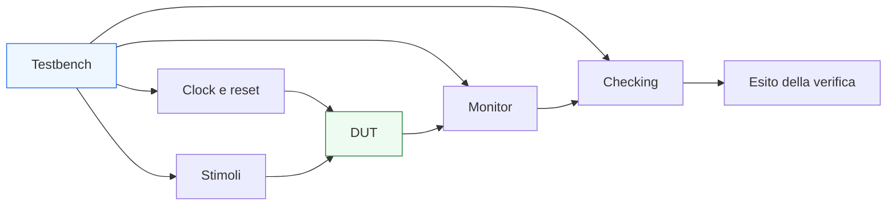
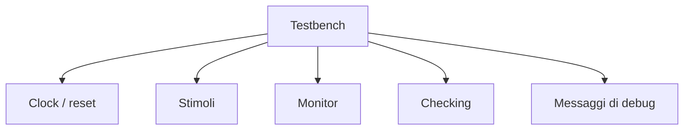

# Struttura di un testbench in SystemVerilog

Dopo aver introdotto i **fondamenti della verifica RTL**, il passo successivo naturale è capire come si costruisce concretamente un **testbench** in SystemVerilog. Se la pagina precedente ha chiarito perché la verifica è necessaria e quali obiettivi deve coprire, questa pagina affronta la domanda pratica successiva: **come si organizza un banco di prova in modo ordinato, leggibile e utile al debug**.

In un progetto reale, infatti, il testbench non è soltanto un file che “dà qualche stimolo” al DUT. È un ambiente strutturato che deve:
- generare clock e reset;
- applicare ingressi significativi;
- osservare il comportamento del blocco;
- controllare la correttezza delle uscite;
- aiutare a diagnosticare rapidamente gli errori;
- crescere insieme alla complessità del design.

In SystemVerilog, il testbench può assumere forme molto semplici oppure molto sofisticate. In questa sezione ci concentriamo sulla struttura di base, cioè su un banco di prova ordinato e concettualmente robusto, adatto a verificare moduli RTL senza entrare ancora in framework avanzati o metodologie troppo pesanti.

Questa pagina ha quindi un obiettivo preciso: mostrare come organizzare un testbench in modo coerente con il resto della documentazione, mantenendo il legame tra:
- architettura del blocco;
- qualità della RTL;
- osservabilità del comportamento;
- debug;
- verificabilità di FSM, interfacce, pipeline e handshake.

## 1. Che cos’è un testbench

Un testbench è l’ambiente di simulazione che circonda il **Design Under Test** (DUT) e ne controlla il comportamento.

### 1.1 Ruolo del testbench
Il testbench ha il compito di:
- creare il contesto temporale del DUT;
- guidare gli ingressi;
- osservare le uscite;
- confrontare il comportamento osservato con quello atteso;
- segnalare errori in modo leggibile.

### 1.2 Perché serve una struttura
Anche per moduli relativamente semplici, un testbench costruito in modo disordinato può diventare difficile da:
- leggere;
- estendere;
- riutilizzare;
- debuggare.

### 1.3 Testbench come modello del contesto esterno
Dal punto di vista architetturale, il testbench rappresenta il mondo esterno al DUT:
- i segnali che arrivano;
- il ritmo temporale del sistema;
- i protocolli che il modulo deve rispettare;
- le condizioni normali e anomale di funzionamento.

## 2. DUT e ambiente di verifica

La distinzione tra DUT ed ambiente di verifica deve essere chiara fin dall’inizio.

### 2.1 DUT
Il DUT è il blocco RTL che si vuole verificare:
- un modulo combinatorio;
- una FSM;
- un datapath;
- una pipeline;
- una interfaccia con handshake;
- un controllore.

### 2.2 Ambiente di verifica
L’ambiente di verifica comprende tutto ciò che serve a esercitare e osservare il DUT:
- generatori di clock e reset;
- sorgenti di stimolo;
- monitor;
- checker;
- eventuali modelli di riferimento;
- meccanismi di logging e debug.

### 2.3 Beneficio della separazione
Separare nettamente DUT e testbench aiuta a:
- capire dove nasce un bug;
- evitare confusione tra logica verificata e logica di supporto;
- mantenere il banco di prova più ordinato.

## 3. Componenti fondamentali di un testbench di base

Anche senza introdurre metodologie avanzate, un testbench ben costruito contiene alcune componenti riconoscibili.

### 3.1 Generazione di clock
Necessaria per i blocchi sequenziali e per tutti i moduli sincronizzati.

### 3.2 Gestione del reset
Fondamentale per verificare:
- stato iniziale;
- inizializzazione;
- ritorno a condizioni note;
- comportamento durante o dopo il reset.

### 3.3 Stimoli
Gli stimoli applicano al DUT dati, comandi e sequenze di protocollo.

### 3.4 Monitoraggio
Il monitor osserva il comportamento del DUT, spesso raccogliendo informazioni utili al checking e al debug.

### 3.5 Checking
La parte di checking verifica se il comportamento è corretto.

### 3.6 Logging e diagnostica
Messaggi ordinati e intelligibili aiutano a capire subito:
- in quale condizione si è verificato un problema;
- a quale transazione o ciclo appartiene;
- se l’errore riguarda valore, latenza o protocollo.

## 4. Clock e reset come base temporale del testbench

La prima responsabilità di un testbench per logica sequenziale è definire il contesto temporale del DUT.

### 4.1 Perché il clock è centrale
Il clock scandisce:
- aggiornamento dei registri;
- avanzamento delle FSM;
- propagazione della pipeline;
- momento in cui handshake e trasferimenti diventano significativi.

### 4.2 Perché il reset è altrettanto importante
Il reset permette di verificare che il DUT:
- parta da uno stato noto;
- inizializzi registri e segnali correttamente;
- gestisca bene il rientro in stato iniziale.

### 4.3 Una buona sequenza iniziale
Un testbench ben strutturato chiarisce:
- quando il reset è attivo;
- quando viene rilasciato;
- da quale momento gli ingressi diventano significativi;
- quali uscite sono attese durante e subito dopo il reset.

## 5. Generazione degli stimoli

Gli stimoli sono il cuore dinamico del testbench.

### 5.1 Scopo degli stimoli
Devono esercitare il DUT in modo abbastanza ricco da:
- coprire i casi nominali;
- attraversare gli stati della FSM;
- verificare le transizioni;
- sollecitare le interfacce;
- evidenziare problemi di timing logico, handshake o latenza.

### 5.2 Stimoli elementari e progressivi
Di solito è utile partire da:
- casi semplici;
- una sola transazione;
- configurazioni facili da osservare;

per poi passare a:
- sequenze più lunghe;
- casi limite;
- richieste ravvicinate;
- stall, flush o backpressure;
- condizioni temporali meno favorevoli.

### 5.3 Stimoli coerenti con l’architettura
Un buon testbench non genera solo valori casuali, ma stimoli coerenti con:
- protocollo dell’interfaccia;
- significato dei campi;
- latenza attesa;
- ruolo del blocco nel sistema.

## 6. Stimoli diretti e stimoli strutturati

Anche in un testbench semplice, è utile distinguere tra diversi modi di costruire gli stimoli.

### 6.1 Stimoli diretti
Sono scritti in modo esplicito nel testbench:
- assegnazioni ai segnali;
- sequenze temporali precise;
- casi manuali ben leggibili.

### 6.2 Stimoli strutturati
Sono costruiti con maggiore organizzazione:
- task;
- procedure;
- sequenze ripetibili;
- generatori di transazioni.

### 6.3 Quando usare cosa
Per i primi passi o per moduli molto semplici, gli stimoli diretti sono spesso sufficienti. Quando il numero di casi cresce, conviene introdurre una struttura che eviti ripetizioni e mantenga leggibilità.

## 7. Monitor: osservare senza alterare

Il **monitor** è la parte del testbench che osserva il DUT senza modificarne il comportamento.

### 7.1 Ruolo del monitor
Serve a raccogliere informazioni su:
- ingressi accettati;
- uscite prodotte;
- transazioni completate;
- stati o segnali significativi;
- eventi del protocollo.

### 7.2 Perché è utile separarlo dagli stimoli
Separare monitor e stimolo aiuta a mantenere il testbench più ordinato:
- una parte guida;
- una parte osserva;
- una parte controlla.

### 7.3 Valore per il debug
Il monitor è particolarmente utile perché trasforma il comportamento temporale del DUT in eventi leggibili:
- richiesta ricevuta;
- output valido;
- trasferimento accettato;
- stato cambiato;
- pipeline avanzata o fermata.

## 8. Checking: da osservazione a verifica

Un testbench serio non si limita a osservare. Deve anche decidere se il comportamento è corretto.

### 8.1 Perché il checking è indispensabile
Senza checking esplicito, il testbench rischia di affidarsi soltanto all’interpretazione manuale delle waveform.

### 8.2 Che cosa si controlla
Il checking può riguardare:
- valori di uscita;
- latenza;
- correttezza delle transizioni;
- handshake;
- rispetto del protocollo;
- presenza o assenza di eventi attesi;
- allineamento tra dato e controllo.

### 8.3 Errori leggibili
Un buon checking dovrebbe segnalare:
- che cosa era atteso;
- che cosa è stato osservato;
- in quale momento;
- in quale contesto.

Questo rende il debug molto più rapido rispetto a un semplice fallimento non spiegato.

## 9. Modello atteso e confronto

Per verificare davvero un DUT, serve una nozione di comportamento atteso.

### 9.1 Aspettativa semplice
Per moduli semplici, il comportamento atteso può essere costruito direttamente nel testbench.

### 9.2 Modello di riferimento
Per blocchi più complessi, può essere utile avere una forma di modello atteso separato, anche semplificato, che produca l’uscita corretta data una certa sequenza di ingressi.

### 9.3 Confronto
Il testbench confronta:
- ciò che il DUT produce;
- ciò che il modello o il checker si aspetta.

### 9.4 Importanza metodologica
Questo passaggio è centrale perché sposta la verifica dal “sembra giusto” a un controllo più sistematico.

## 10. Organizzare il testbench per casi di prova

Quando la verifica cresce, è importante che il banco di prova non diventi un flusso indistinto di stimoli.

### 10.1 Casi nominati
È utile pensare il testbench come insieme di scenari distinti:
- reset e startup;
- caso nominale base;
- sequenza di più richieste;
- caso di backpressure;
- caso di pipeline piena;
- caso limite.

### 10.2 Beneficio di leggibilità
Questa organizzazione permette di capire più facilmente:
- cosa si sta testando;
- cosa è fallito;
- quali funzionalità sono già coperte.

### 10.3 Progressione
Una struttura per casi aiuta anche a far crescere il testbench in modo progressivo senza perdere il controllo del suo comportamento.

## 11. Testbench e interfacce

Quando il DUT usa handshake o segnali raggruppati in interfacce, il testbench dovrebbe riflettere questa struttura.

### 11.1 Verificare il protocollo
Nel caso di interfacce con:
- `valid`
- `ready`
- `start`
- `done`
- segnalazioni di errore

il testbench deve sapere:
- quando un trasferimento è valido;
- quando una transazione è considerata accettata;
- quando il DUT dovrebbe rispondere.

### 11.2 Allineare stimolo e monitor al canale
È utile trattare l’interfaccia come canale logico, non come elenco sparso di segnali indipendenti.

### 11.3 Beneficio sul debug
Questo rende più chiaro:
- quando il problema è nell’input;
- quando è nel protocollo;
- quando è nella risposta del DUT.

## 12. Testbench e pipeline

I blocchi pipelined richiedono un’attenzione particolare nella struttura del testbench.

### 12.1 Verifica della latenza
Il testbench deve sapere dopo quanti cicli aspettarsi il risultato.

### 12.2 Verifica di validità e allineamento
Deve controllare che:
- il dato esca nel momento corretto;
- il segnale di validità sia coerente;
- eventuali stall o flush modifichino il comportamento come previsto.

### 12.3 Osservazione per stadio
Per il debug, può essere utile osservare:
- registri di pipeline;
- segnali di validità dei diversi stadi;
- condizioni di avanzamento o blocco.

## 13. Testbench e FSM

Anche le FSM beneficiano di una struttura di testbench pensata appositamente.

### 13.1 Transizioni
Il testbench dovrebbe esercitare:
- transizioni normali;
- permanenza nello stato;
- ritorni in idle;
- condizioni di errore o recovery.

### 13.2 Stato iniziale
Va verificato esplicitamente il comportamento dopo reset.

### 13.3 Coerenza tra stato e output
Il monitor o il checker dovrebbe poter correlare:
- stato osservato;
- input applicato;
- output atteso.

## 14. Logging e messaggi di errore

Un testbench ben costruito non si limita a fallire: spiega in modo utile il motivo del fallimento.

### 14.1 Perché il logging è importante
Messaggi leggibili aiutano a:
- localizzare il problema;
- capire la sequenza che l’ha causato;
- evitare lunghe ispezioni manuali inutili.

### 14.2 Informazioni utili in un messaggio
Un messaggio utile tende a includere:
- istante o ciclo;
- caso di test;
- input rilevanti;
- output osservato;
- output atteso;
- eventuale stato o condizione di protocollo.

### 14.3 Equilibrio
Troppi messaggi generano rumore; troppo pochi rendono il debug difficile. Il testbench dovrebbe essere informativo senza diventare caotico.

## 15. Riutilizzabilità del testbench

Anche senza usare framework avanzati, conviene pensare il testbench come qualcosa che possa evolvere.

### 15.1 Struttura che cresce bene
Una buona organizzazione:
- evita la duplicazione di sequenze;
- permette di aggiungere nuovi casi senza rompere quelli esistenti;
- separa compiti diversi;
- aiuta la manutenzione.

### 15.2 Collegamento con la parametrizzazione del DUT
Se il DUT è parametrico, il testbench dovrebbe essere costruito in modo da poter verificare in modo controllato le configurazioni rilevanti.

### 15.3 Beneficio pratico
Un testbench riusabile accelera:
- regressioni;
- evoluzioni della RTL;
- confronto tra versioni;
- integrazione in moduli più grandi.

## 16. Errori comuni nella costruzione del testbench

Alcune cattive pratiche ricorrono spesso.

### 16.1 Stimoli e checking mescolati in modo confuso
Quando tutto è nello stesso blocco senza struttura, il banco di prova diventa difficile da capire.

### 16.2 Assenza di checking automatico
Guardare solo le waveform non è sufficiente.

### 16.3 Reset trattato superficialmente
Molti bug emergono proprio nella fase iniziale o nel rientro a condizioni note.

### 16.4 Test troppo “felici”
Se il banco di prova considera solo i casi nominali, molti problemi di protocollo, timing logico o FSM restano nascosti.

### 16.5 Messaggi di errore poco utili
Un fallimento che non spiega il contesto rallenta enormemente il debug.

## 17. Buone pratiche di organizzazione

Per costruire un testbench di base ordinato, alcune linee guida sono particolarmente efficaci.

### 17.1 Separare i ruoli
Conviene distinguere:
- generazione di clock e reset;
- stimoli;
- monitor;
- checking;
- logging.

### 17.2 Rendere leggibili i casi di test
Ogni scenario dovrebbe avere un obiettivo riconoscibile.

### 17.3 Progettare per il debug
Il testbench dovrebbe aiutare a capire gli errori, non solo a segnalarli.

### 17.4 Crescere in modo progressivo
Meglio partire da pochi casi chiari e poi estendere il banco di prova in modo controllato.

### 17.5 Allinearsi alla struttura del DUT
FSM, pipeline, handshake e interfacce dovrebbero essere riconoscibili anche nel modo in cui il testbench è costruito.

## 18. Collegamento con il resto della sezione

Questa pagina si collega direttamente ai temi già introdotti:
- **`verification-basics.md`** ha chiarito obiettivi e principi della verifica RTL;
- **`interfaces-and-handshake.md`** ha mostrato l’importanza del protocollo nel comportamento osservato;
- **`pipelining.md`** e **`latency-and-throughput.md`** hanno introdotto i temi di latenza, validità e ritmo di trasferimento;
- **`fsm.md`** e **`datapath-and-control.md`** hanno mostrato strutture che richiedono testbench con checking mirato;
- **`coding-style-rtl.md`** ha evidenziato che una buona RTL è anche più facile da verificare con un banco di prova ordinato.

Il testbench è quindi il punto in cui tutti questi elementi diventano pratica concreta di verifica.

## 19. In sintesi

Un testbench in SystemVerilog è l’ambiente che rende possibile la verifica concreta del DUT. Per essere davvero utile, non deve limitarsi a generare pochi stimoli, ma deve organizzare in modo chiaro:
- clock e reset;
- scenari di prova;
- osservazione del comportamento;
- checking;
- messaggi diagnostici.

Una buona struttura del testbench migliora non solo la capacità di trovare errori, ma anche la velocità con cui li si comprende e li si corregge. Per questo il banco di prova va progettato con la stessa cura con cui si progetta la RTL.

## Prossimo passo

Il passo più naturale ora è **`assertions-basics.md`**, perché dopo aver costruito la struttura del testbench conviene introdurre uno degli strumenti più utili per rendere il checking più esplicito e rigoroso:
- ruolo delle assertion
- proprietà temporali di base
- controllo di protocolli
- controllo di latenza e handshake
- supporto al debug e alla verifica

In alternativa, un altro passo molto naturale è **`simulation-workflow.md`**, se vuoi descrivere il flusso pratico con cui una verifica RTL viene eseguita, osservata e iterata.
