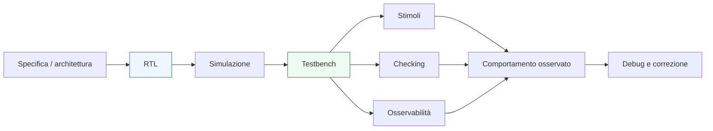
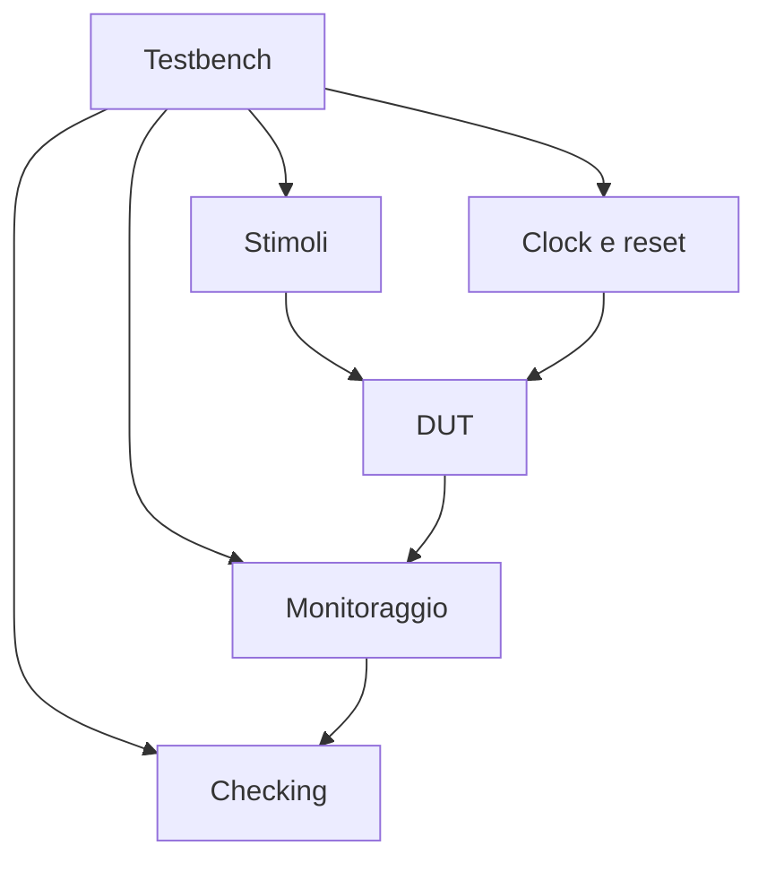

# Fondamenti di verifica in SystemVerilog

Dopo aver costruito il quadro della progettazione RTL in SystemVerilog — dal linguaggio ai costrutti sintetizzabili, dalle **FSM** alle **interfacce**, dalla **pipeline** alla **parametrizzazione**, fino allo **stile di codifica** — il passo successivo naturale è affrontare la **verifica**. In un flusso di progettazione serio, infatti, non basta descrivere un hardware corretto “per intenzione”: bisogna dimostrare, con metodi sistematici, che il comportamento del blocco corrisponde davvero a quanto previsto.

La verifica è il processo con cui si controlla che una descrizione RTL:
- faccia ciò che deve fare;
- non faccia ciò che non deve fare;
- reagisca correttamente alle condizioni normali e ai casi limite;
- si comporti in modo coerente nel tempo;
- rispetti il protocollo di interfaccia e le ipotesi architetturali.

In SystemVerilog, la verifica occupa un ruolo particolarmente importante perché il linguaggio è usato sia per descrivere hardware sintetizzabile sia per costruire ambienti di simulazione e controllo. Questo crea un forte collegamento tra:
- struttura della RTL;
- qualità del testbench;
- osservabilità del comportamento;
- metodo di debug;
- affidabilità complessiva del progetto.

Questa pagina introduce i fondamenti della verifica con un taglio coerente con il resto della documentazione:
- didattico ma tecnico;
- orientato a una base seria di progettazione;
- attento al rapporto tra architettura, RTL, timing e integrazione;
- centrato soprattutto sulla **verifica funzionale RTL**, non sugli aspetti tool-specifici.

## 1. Perché la verifica è indispensabile

Nella progettazione digitale, anche blocchi apparentemente semplici possono contenere errori sottili. Questi errori non sempre emergono leggendo il codice o osservando pochi casi di prova manuali.

### 1.1 L’errore non è un’eccezione rara
Errori possibili includono:
- condizioni di stato non gestite;
- allineamento errato tra dato e controllo;
- uso scorretto di handshake;
- reset incompleto o ambiguo;
- condizioni limite dimenticate;
- latenza diversa da quella attesa;
- gestione errata di stall, flush o backpressure;
- codifica o transizione di FSM non coerente.

### 1.2 La simulazione non basta se usata male
Una simulazione eseguita con pochi stimoli “di buon senso” può dare una falsa sensazione di correttezza. Verificare davvero significa costruire un processo più disciplinato.

### 1.3 Verifica come parte del progetto
La verifica non è un’attività separata da fare “alla fine”. È una componente essenziale del flusso di sviluppo, perché influenza:
- come si scrive la RTL;
- quanto è osservabile il comportamento;
- quanto rapidamente si localizzano gli errori;
- quanto il progetto è affidabile in integrazione.

## 2. Che cosa significa verificare un blocco RTL

Verificare un blocco RTL significa confrontare il suo comportamento con l’intento progettuale.

### 2.1 Confronto tra implementazione e aspettativa
In pratica, si tratta di chiedersi:
- le uscite sono corrette dato un certo input?
- la sequenza temporale è quella prevista?
- gli stati evolvono correttamente?
- i protocolli vengono rispettati?
- i casi limite sono gestiti?

### 2.2 Non solo “funziona”
La verifica riguarda non solo la correttezza funzionale nominale, ma anche:
- robustezza su corner case;
- coerenza temporale;
- rispetto del protocollo;
- assenza di comportamenti inattesi;
- prevedibilità dell’integrazione nel sistema.

### 2.3 Livello RTL
A questo livello, la verifica si concentra soprattutto sul comportamento della descrizione RTL:
- prima della sintesi fisica;
- con attenzione a stato, combinatoria e sequenziale;
- nel contesto delle interfacce e del flusso dei dati.

## 3. Obiettivi principali della verifica RTL

Una verifica di base ben impostata tende a coprire diversi obiettivi.

### 3.1 Correttezza funzionale
Il blocco deve produrre i risultati attesi nelle condizioni previste.

### 3.2 Correttezza temporale a livello logico
Le uscite devono apparire:
- nel ciclo corretto;
- con la latenza prevista;
- in coerenza con il protocollo dell’interfaccia.

### 3.3 Robustezza
Il blocco deve reagire correttamente anche a:
- ingressi estremi;
- sequenze ravvicinate;
- reset;
- backpressure;
- condizioni anomale previste dalla specifica.

### 3.4 Osservabilità e diagnosi
La struttura della verifica deve rendere possibile capire rapidamente:
- che cosa è andato storto;
- in quale punto del flusso;
- in quale condizione;
- con quale relazione tra stato, dati e controllo.

## 4. Simulazione come strumento di verifica

Il meccanismo più naturale e diffuso per iniziare la verifica RTL è la **simulazione**.

### 4.1 Che cosa fa la simulazione
La simulazione esegue il modello RTL nel tempo, osservando come reagisce a una sequenza di stimoli.

### 4.2 Perché è così utile
Permette di:
- provare casi funzionali;
- osservare waveform;
- verificare evoluzioni di stato;
- controllare il rispetto dei protocolli;
- individuare bug nelle prime fasi del progetto.

### 4.3 Limite fondamentale
La simulazione mostra solo ciò che viene effettivamente testato. Per questo la qualità della verifica dipende fortemente dalla qualità del testbench e della strategia di checking.

## 5. Il ruolo del testbench

Il **testbench** è l’ambiente di verifica che stimola il blocco RTL e ne osserva il comportamento.

### 5.1 Funzione del testbench
Il testbench:
- genera ingressi;
- applica sequenze temporali;
- controlla uscite e handshake;
- osserva segnali interni o esterni;
- decide se il comportamento è corretto o no.

### 5.2 Testbench come contesto del DUT
Il blocco verificato, spesso chiamato DUT (Design Under Test), non viene eseguito da solo: il testbench crea il contesto che rende possibile valutarlo.

### 5.3 Qualità del testbench
Un buon testbench non si limita a “far partire il blocco”, ma costruisce un ambiente abbastanza chiaro e robusto da:
- riprodurre gli scenari rilevanti;
- esercitare i casi limite;
- produrre errori leggibili;
- aiutare il debug.

## 6. Clock, reset e scenario iniziale

Ogni verifica di base parte dalla costruzione di un contesto temporale coerente.

### 6.1 Clock
Il clock scandisce il comportamento del DUT e deve essere presente in modo chiaro nel testbench.

### 6.2 Reset
Il reset è fondamentale per verificare:
- stato iniziale del blocco;
- corretto ritorno in condizioni note;
- comportamento dopo inizializzazione;
- robustezza della macchina a stati o della pipeline.

### 6.3 Stato iniziale noto
Un testbench ben costruito chiarisce:
- quando il DUT esce dal reset;
- da quale momento i dati sono significativi;
- quali condizioni iniziali sono attese sulle interfacce.

## 7. Stimoli: che cosa significa “testare”

La verifica non consiste soltanto nel mettere qualche ingresso casuale. Serve una scelta ragionata degli stimoli.

### 7.1 Stimoli nominali
Sono i casi attesi nel funzionamento normale del blocco.

### 7.2 Stimoli di frontiera
Servono a verificare:
- valori minimi e massimi;
- transizioni critiche;
- casi di saturazione o overflow;
- passaggi tra stati particolari;
- sequenze ravvicinate.

### 7.3 Stimoli temporali
Per molti blocchi è importante verificare non solo “quali valori”, ma anche “quando” vengono applicati:
- richieste consecutive;
- dati con pause;
- backpressure;
- reset durante attività;
- cambi di configurazione.

### 7.4 Stimoli significativi rispetto all’architettura
Gli stimoli migliori sono quelli che riflettono davvero:
- il protocollo;
- la pipeline;
- la latenza;
- il ruolo del controllo;
- le dipendenze tra input e stato.

## 8. Checking: controllare davvero il comportamento

Uno degli aspetti più importanti della verifica è il **checking**, cioè il controllo sistematico del comportamento osservato.

### 8.1 Perché non basta guardare le waveform
Le waveform sono utili per il debug, ma non possono essere l’unico meccanismo di verifica. Servono controlli espliciti che dicano quando qualcosa è sbagliato.

### 8.2 Che cosa si controlla
Il checking può riguardare:
- correttezza dei risultati;
- latenza prevista;
- validità dei segnali;
- evoluzione degli stati;
- rispetto dell’handshake;
- assenza di trasferimenti illegali;
- allineamento tra dato e controllo.

### 8.3 Valore metodologico
Un testbench con checking chiaro:
- riduce il rischio di bug non notati;
- accelera il debug;
- rende le regressioni più affidabili;
- migliora la qualità complessiva del flusso.

## 9. Osservabilità dei segnali

La verifica funziona molto meglio quando la RTL è scritta in modo osservabile.

### 9.1 Che cosa significa osservabilità
Significa che lo stato interno del blocco e i suoi passaggi principali sono leggibili nelle waveform e nei punti di controllo del testbench.

### 9.2 Segnali importanti da osservare
Spesso è utile poter seguire:
- stato corrente e next-state;
- validità dei dati;
- enable dei registri;
- canali di handshake;
- segnali di stall e flush;
- contatori di avanzamento;
- registri di pipeline.

### 9.3 Collegamento con lo stile RTL
Una RTL ben strutturata facilita la verifica perché rende più chiari:
- i ruoli dei segnali;
- i confini temporali;
- la separazione tra controllo e datapath;
- il significato dei blocchi procedurali.

## 10. Verifica di combinatoria e sequenziale

Le due grandi componenti della RTL richiedono attenzione leggermente diversa.

### 10.1 Logica combinatoria
Per la combinatoria si controlla tipicamente:
- correttezza del risultato;
- completezza della selezione;
- comportamento per tutte le condizioni previste;
- assenza di dipendenze inattese.

### 10.2 Logica sequenziale
Per la parte sequenziale si verifica:
- aggiornamento al clock corretto;
- gestione del reset;
- evoluzione degli stati;
- latenza dei risultati;
- progressione dei dati attraverso la pipeline.

### 10.3 Importanza della separazione
Se il codice distingue bene combinatoria e sequenziale, anche la verifica diventa più ordinata e più facile da capire.

## 11. Verifica delle FSM

Le FSM sono tra gli oggetti più naturali da verificare, ma richiedono comunque attenzione.

### 11.1 Che cosa controllare
Conviene verificare:
- stato iniziale;
- transizioni lecite;
- permanenza nello stato quando necessario;
- gestione dei casi di errore o recovery;
- coerenza tra stato e output.

### 11.2 Coverage delle transizioni
Una buona verifica di una FSM non si limita a visitare gli stati, ma cerca anche di esercitare le transizioni più importanti.

### 11.3 Beneficio delle enumerazioni
Se gli stati sono modellati con `enum`, la leggibilità del debug migliora molto e la diagnosi diventa più rapida.

## 12. Verifica di interfacce e handshake

In molti blocchi moderni, gran parte degli errori si manifesta sulle interfacce.

### 12.1 Aspetti da verificare
È importante controllare:
- momento del trasferimento;
- relazione tra `valid` e `ready`;
- coerenza di `start` e `done`;
- stabilità del dato quando il protocollo lo richiede;
- gestione del backpressure;
- corretto comportamento in presenza di stall.

### 12.2 Perché è cruciale
Un blocco può essere internamente corretto ma integrarsi male se l’handshake non è verificato con attenzione.

### 12.3 Valore per il sistema
La verifica delle interfacce è fondamentale perché il sistema complessivo dipende spesso più dal rispetto dei protocolli che dalla singola operazione combinatoria interna.

## 13. Verifica di pipeline, latenza e throughput

Quando il blocco contiene pipeline o buffering, la verifica deve considerare anche il tempo.

### 13.1 Latenza attesa
Bisogna verificare che il dato emerga:
- dopo il numero corretto di cicli;
- con la validità allineata;
- in coerenza con eventuali stall o flush.

### 13.2 Throughput atteso
Bisogna osservare se il blocco:
- accetta nuovi dati con il ritmo previsto;
- mantiene il flusso in regime;
- si comporta correttamente sotto backpressure;
- non perde o duplica transazioni.

### 13.3 Debug temporale
In una pipeline, seguire i segnali di validità e i registri di stadio è spesso essenziale per capire dove nasce un errore.

## 14. Test semplici, casi limite e progressione della verifica

Una buona verifica non nasce sempre da ambienti complessi. Anche una strategia semplice può essere molto efficace, se costruita bene.

### 14.1 Partire dai casi semplici
Conviene iniziare da:
- reset;
- una transazione elementare;
- condizioni nominali;
- sequenze brevi e leggibili.

### 14.2 Estendere progressivamente
Poi si aggiungono:
- casi limite;
- sequenze multiple;
- condizioni di stallo;
- reset in momenti non banali;
- combinazioni più complesse di ingressi.

### 14.3 Approccio incrementale
Questa progressione aiuta a:
- costruire fiducia;
- localizzare i problemi più rapidamente;
- evitare che un testbench diventi opaco troppo presto.

## 15. Il debug come parte della verifica

Quando un controllo fallisce, inizia il lavoro di debug.

### 15.1 Scopo del debug
Il debug serve a capire:
- quale condizione ha generato l’errore;
- in quale ciclo è comparso;
- se il problema nasce da ingresso, controllo, pipeline, interfaccia o stato;
- se l’errore è nel DUT o nel testbench.

### 15.2 Perché la struttura della RTL conta
Una RTL ben scritta aiuta enormemente il debug perché:
- segnali e stati sono leggibili;
- i ruoli sono chiari;
- controllo e datapath sono separati;
- pipeline e handshake sono osservabili.

### 15.3 Perché la struttura del testbench conta
Anche il testbench deve essere abbastanza ordinato da rendere l’errore intelligibile, non solo da segnalarlo.

## 16. Verifica e qualità della RTL

La verifica non è indipendente dalla qualità del codice RTL.

### 16.1 RTL leggibile, verifica migliore
Una RTL con:
- naming chiaro;
- separazione tra combinatoria e sequenziale;
- FSM ordinate;
- interfacce ben modellate;
- uso disciplinato di parametri e tipi condivisi;

è molto più facile da verificare bene.

### 16.2 RTL confusa, verifica fragile
Se il codice è ambiguo o disordinato:
- i test diventano più difficili da scrivere;
- il debug rallenta;
- i bug si nascondono più facilmente;
- le regressioni diventano meno affidabili.

### 16.3 Relazione bidirezionale
La verifica, a sua volta, aiuta a migliorare la RTL perché rende visibili:
- punti poco osservabili;
- protocolli poco chiari;
- latenze mal documentate;
- strutture troppo accorpate o troppo implicite.

## 17. Collegamento con FPGA e ASIC

Anche se la verifica di base è principalmente funzionale e indipendente dal target, il contesto applicativo conta.

### 17.1 Su FPGA
In FPGA:
- la verifica RTL è spesso il primo filtro prima di sintesi e bring-up;
- segnali interni possono risultare più facilmente osservabili anche in prototipazione;
- è utile pensare già a debug e integrazione.

### 17.2 Su ASIC
In ASIC:
- intercettare gli errori in RTL è ancora più importante;
- i costi di correzione crescono molto nelle fasi successive;
- la verifica deve supportare una maggiore fiducia nel design prima di sintesi, DFT, backend e tape-out.

### 17.3 Visione comune
In entrambi i casi, la verifica RTL resta il fondamento della qualità del blocco.

## 18. Errori comuni nelle fasi iniziali di verifica

Alcuni errori ricorrono spesso quando si inizia a verificare moduli RTL.

### 18.1 Stimoli troppo pochi o troppo “felici”
Testare solo il caso nominale nasconde molti bug.

### 18.2 Mancanza di checking esplicito
Guardare le waveform senza controlli automatici non è sufficiente.

### 18.3 Reset trascurato
Molti problemi emergono proprio all’avvio o nel ritorno a condizioni note.

### 18.4 Ignorare i tempi
Verificare solo i valori e non il ciclo in cui compaiono porta a errori sottili, specialmente in pipeline e handshake.

### 18.5 Testbench poco leggibile
Se il testbench è confuso, anche il debug dei bug reali diventa più difficile.

## 19. Buone pratiche di base

Per avviare una verifica efficace in SystemVerilog RTL, alcune linee guida sono particolarmente utili.

### 19.1 Partire da obiettivi chiari
Bisogna sapere che cosa si vuole verificare:
- funzione;
- latenza;
- protocollo;
- robustezza;
- casi limite.

### 19.2 Mantenere testbench e DUT leggibili
La qualità della verifica dipende anche dalla chiarezza del contesto.

### 19.3 Verificare il tempo oltre ai valori
Clock, reset, validità, handshake e latenza sono parte della correttezza del blocco.

### 19.4 Rendere il fallimento informativo
Un errore segnalato bene accelera il debug molto più di una semplice divergenza visiva in waveform.

### 19.5 Costruire la verifica in modo progressivo
Meglio una base semplice ma solida che un ambiente grande ma poco controllabile.

## 20. Collegamento con il resto della sezione

Questa pagina si collega direttamente a tutto il percorso fatto fin qui:
- **`rtl-constructs.md`** e **`procedural-blocks.md`** hanno definito la struttura di base della RTL;
- **`combinational-vs-sequential.md`** ha chiarito il comportamento temporale essenziale da verificare;
- **`fsm.md`**, **`state-encoding.md`** e **`datapath-and-control.md`** hanno introdotto strutture che richiedono checking mirato;
- **`pipelining.md`**, **`interfaces-and-handshake.md`** e **`latency-and-throughput.md`** hanno mostrato che il tempo, la validità dei dati e il ritmo di trasferimento fanno parte della correttezza;
- **`coding-style-rtl.md`** ha evidenziato che una buona RTL è anche una RTL più verificabile.

La verifica di base è quindi il naturale punto di incontro tra qualità del codice e fiducia nel comportamento del design.

## 21. In sintesi

La verifica RTL in SystemVerilog è il processo con cui si controlla che il blocco implementi davvero l’intento architetturale previsto, non solo nel valore delle uscite ma anche nel loro significato temporale. Verificare significa costruire un ambiente che:
- generi stimoli significativi;
- osservi il comportamento;
- controlli risultati, protocolli e latenze;
- renda i fallimenti chiari e diagnostici.

La simulazione e il testbench sono gli strumenti di base di questo processo, ma la loro efficacia dipende molto dalla qualità della RTL e dalla disciplina del metodo adottato.

Per questo motivo, la verifica non è un’aggiunta opzionale alla progettazione RTL: è una parte essenziale della costruzione di hardware affidabile, integrabile e pronto a proseguire verso sintesi, implementazione FPGA o flusso ASIC.

## Prossimo passo

Il passo più naturale ora è **`testbench-structure.md`**, perché dopo aver introdotto i fondamenti della verifica conviene passare alla struttura concreta dell’ambiente di simulazione:
- componenti di base di un testbench
- generazione di clock e reset
- stimoli
- monitor
- checking
- organizzazione ordinata del banco di prova

In alternativa, un altro passo molto naturale è **`assertions-basics.md`**, se vuoi approfondire subito il ruolo dei controlli espliciti e delle proprietà nella verifica SystemVerilog.
