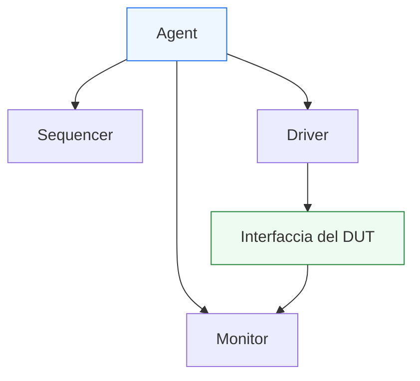
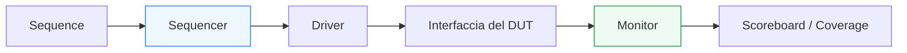

# `agent` in UVM

Dopo aver introdotto il **`driver`** e il **`monitor`**, il passo successivo naturale è affrontare il componente che li raccoglie e li organizza come unità coerente di verifica di una interfaccia: l’**`agent`**.

L’agent è uno dei blocchi più caratteristici della metodologia UVM, perché rende esplicita un’idea molto importante: una interfaccia del DUT non è solo un gruppo di segnali, ma un **canale architetturale** che può richiedere:
- generazione di stimolo;
- osservazione del comportamento;
- conoscenza del protocollo;
- configurazione locale;
- riuso in più test o ambienti;
- modalità attiva o passiva.

In questo senso, l’agent non è un semplice contenitore tecnico. È una vera unità strutturale del testbench, il cui scopo è raccogliere in modo ordinato tutti i componenti necessari a verificare una certa interfaccia del DUT.

Dal punto di vista metodologico, l’agent è importante perché:
- dà una struttura chiara al lato interfaccia del testbench;
- favorisce il riuso di driver, monitor e sequencer;
- permette di passare da ambienti semplici ad ambienti più complessi;
- rende naturale la distinzione tra agent attivi e passivi;
- avvicina la struttura del testbench alla struttura reale del DUT.

Questa pagina introduce l’agent con un taglio coerente con il resto della sezione UVM:
- didattico ma tecnico;
- attento al suo significato architetturale;
- centrato sul ruolo di unità riusabile della verifica;
- collegato a protocolli, interfacce, DUT reali e crescita del testbench.

## 1. Che cos’è un `agent`

Un `agent` è il componente UVM che raccoglie e organizza i blocchi di verifica relativi a una specifica interfaccia o protocollo del DUT.

### 1.1 Significato essenziale
In modo tipico, un agent contiene:
- un `sequencer`
- un `driver`
- un `monitor`

### 1.2 Significato architetturale
L’agent rappresenta il fatto che una certa interfaccia del DUT:
- può ricevere stimolo;
- può essere osservata;
- segue un certo protocollo;
- deve poter essere verificata come unità coerente.

### 1.3 Perché è un componente chiave
L’agent rende il testbench più modulare perché sposta il focus da:
- “gruppi sparsi di componenti”
a:
- “unità di verifica per interfaccia”.

## 2. Perché serve un `agent`

La prima domanda importante è: perché UVM non lascia semplicemente driver, monitor e sequencer come componenti separati nell’environment?

### 2.1 Il problema della frammentazione
Se i componenti relativi a una certa interfaccia rimanessero dispersi:
- la struttura del testbench sarebbe meno leggibile;
- il riuso diventerebbe più difficile;
- l’ambiente crescerebbe in modo meno modulare;
- la relazione tra protocollo e componenti di verifica sarebbe meno chiara.

### 2.2 La risposta UVM
L’agent raggruppa in una sola unità logica:
- lato attivo dello stimolo;
- lato osservativo;
- coordinazione del traffico transazionale locale.

### 2.3 Beneficio metodologico
Questo aiuta a:
- leggere meglio il testbench;
- riusare facilmente la verifica di un protocollo;
- configurare ogni interfaccia in modo più ordinato;
- scalare verso DUT con più canali o più protocolli.

## 3. L’agent come rappresentazione della interfaccia del DUT

Uno dei modi migliori per capire l’agent è vederlo come la rappresentazione nel testbench di una interfaccia significativa del DUT.

### 3.1 Una interfaccia non è solo segnali
Dal punto di vista UVM, una interfaccia è:
- un protocollo;
- un flusso di transazioni;
- un punto di stimolo;
- un punto di osservazione;
- un possibile oggetto di coverage;
- un possibile canale di controllo o dati.

### 3.2 Che cosa significa per il testbench
Il testbench quindi costruisce attorno a questa interfaccia una unità dedicata:
- chi genera traffico;
- chi lo guida;
- chi osserva il risultato del protocollo.

### 3.3 Perché è utile
Questa corrispondenza tra struttura del DUT e struttura del testbench migliora:
- leggibilità;
- debug;
- riuso;
- crescita dell’ambiente.

## 4. Componenti tipici di un `agent`

L’agent è spesso descritto come la combinazione di tre componenti fondamentali.

### 4.1 `sequencer`
Coordina il flusso dei `sequence item` verso il lato attivo dell’interfaccia.

### 4.2 `driver`
Traduce la transazione in segnali del protocollo del DUT.

### 4.3 `monitor`
Osserva i segnali del DUT e ricostruisce le transazioni effettivamente avvenute.

### 4.4 Perché questi tre insieme
Questi tre blocchi coprono i ruoli essenziali del lato protocollo:
- generazione coordinata dello stimolo;
- applicazione sull’interfaccia;
- osservazione indipendente del comportamento.

## 5. `agent` attivo e `agent` passivo

Una delle caratteristiche più importanti dell’agent è che può operare in modalità diverse.

### 5.1 Agent attivo
Un agent attivo contiene il lato completo dello stimolo e dell’osservazione:
- sequencer;
- driver;
- monitor.

Viene usato quando il testbench deve pilotare quell’interfaccia del DUT.

### 5.2 Agent passivo
Un agent passivo osserva soltanto l’interfaccia e tipicamente contiene:
- monitor

oppure, in forma più ampia, solo i componenti necessari all’osservazione.

Viene usato quando:
- l’interfaccia è guidata da un altro blocco;
- il testbench deve solo osservare;
- si vuole riusare il monitor in contesti più grandi;
- si verifica un sistema già stimolato altrove.

### 5.3 Perché questa distinzione è molto utile
La distinzione attivo/passivo è uno dei motivi per cui l’agent è una vera unità di riuso.

## 6. L’agent e il riuso del protocollo

Uno dei più grandi vantaggi dell’agent è il riuso.

### 6.1 Riuso del lato attivo
Se il protocollo è lo stesso, lo stesso agent attivo può essere riusato in:
- test diversi;
- configurazioni diverse;
- blocchi simili;
- ambienti più grandi.

### 6.2 Riuso del lato osservativo
Lo stesso monitor, incapsulato in un agent passivo, può essere riutilizzato per:
- osservazione di un sottosistema;
- debug;
- coverage;
- checking di integrazione.

### 6.3 Beneficio di manutenzione
Questo riduce la necessità di:
- duplicare driver e monitor;
- creare versioni locali del testbench;
- ricostruire da zero la verifica di una interfaccia già nota.

## 7. Agent e DUT con una sola interfaccia

Anche nei casi semplici l’agent ha valore.

### 7.1 DUT semplice
Per un DUT con una sola interfaccia, si potrebbe pensare che un agent sia quasi superfluo.

### 7.2 Perché ha comunque senso
Anche in questo caso l’agent:
- organizza i componenti;
- prepara il testbench al riuso;
- rende più chiara la relazione tra protocollo e verifica;
- mantiene la coerenza con la metodologia UVM.

### 7.3 Visione corretta
L’agent non serve solo a gestire la complessità estrema; serve anche a costruire una struttura ordinata fin dall’inizio.

## 8. Agent e DUT con più interfacce

Il valore dell’agent cresce molto quando il DUT ha più canali o protocolli.

### 8.1 Più interfacce
Per esempio:
- canale di input;
- canale di output;
- canale di configurazione;
- canale di risposta;
- interfacce di controllo.

### 8.2 Un agent per interfaccia o protocollo
Diventa molto naturale costruire:
- un agent per ogni interfaccia significativa;
- agent diversi per protocolli diversi;
- configurazioni miste con agent attivi e passivi.

### 8.3 Beneficio architetturale
L’environment può così essere costruito come integrazione di agent coerenti con la struttura reale del DUT.

## 9. Agent e environment

L’agent si comprende bene anche nel suo rapporto con l’`environment`.

### 9.1 Ruolo dell’agent
L’agent è una unità locale di verifica di interfaccia.

### 9.2 Ruolo dell’environment
L’environment integra più agent e altri componenti di checking o coverage.

### 9.3 Perché la distinzione è importante
Questa separazione permette di mantenere:
- l’agent focalizzato sul protocollo locale;
- l’environment focalizzato sulla verifica complessiva del DUT.

### 9.4 Effetto metodologico
L’agent è il mattone dell’ambiente. L’environment è la struttura che li mette insieme.

## 10. Agent e configurazione

L’agent è uno dei luoghi in cui la configurazione del testbench è particolarmente utile.

### 10.1 Configurazione tipica
Si può configurare:
- attivo o passivo;
- opzioni del monitor;
- livelli di logging;
- parametri di protocollo;
- presenza di coverage locale;
- comportamento del driver o del sequencer.

### 10.2 Perché è utile
Questo consente di riusare la stessa struttura di agent in:
- test diversi;
- ambienti diversi;
- modalità di verifica diverse.

### 10.3 Collegamento con la factory
In ambienti più ricchi, la factory può permettere anche di sostituire:
- driver;
- monitor;
- sequencer;
- varianti specializzate dell’agent stesso.

## 11. Agent e protocollo locale

L’agent è fortemente legato al protocollo dell’interfaccia che rappresenta.

### 11.1 Perché questo legame è importante
L’agent deve raccogliere componenti che condividono:
- conoscenza del protocollo;
- semantica dei sequence item;
- struttura della virtual interface;
- regole di handshake e timing locale.

### 11.2 Coerenza interna
Driver, monitor e sequencer devono vivere insieme proprio perché appartengono allo stesso canale logico.

### 11.3 Vantaggio
Questo riduce accoppiamenti inutili tra protocolli diversi e rende più naturale il riuso di ciascun agent.

## 12. Agent e virtual interface

Per funzionare sul mondo RTL, i componenti interni dell’agent devono poter accedere all’interfaccia del DUT.

### 12.1 Perché il tema conta
Sia driver sia monitor devono interagire con:
- clock;
- reset;
- segnali del protocollo;
- campi dati e controllo.

### 12.2 Punto di connessione
Questo avviene tipicamente tramite una `virtual interface`, che rappresenta il ponte tra:
- il mondo class-based UVM;
- il mondo a segnali RTL.

### 12.3 Ruolo dell’agent
L’agent è il luogo naturale in cui questa connessione viene organizzata per il protocollo locale.

## 13. Agent e coverage locale

In alcuni ambienti, l’agent può anche essere il punto in cui si raccoglie coverage relativa alla propria interfaccia.

### 13.1 Coverage di protocollo
Per esempio:
- tipi di transazione;
- pattern di handshake;
- casi di backpressure;
- burst;
- combinazioni di campi.

### 13.2 Perché è utile
Parte della coverage ha senso locale al protocollo e quindi si integra bene vicino all’agent.

### 13.3 Distinzione importante
Coverage locale dell’interfaccia e coverage di sistema non coincidono sempre. L’agent copre bene la prima; l’environment o livelli superiori possono coprire la seconda.

## 14. Agent e debug

Anche dal punto di vista del debug l’agent è molto utile.

### 14.1 Unità naturale di diagnosi
Se c’è un problema su un protocollo, spesso si comincia a guardare:
- l’agent corrispondente;
- il driver locale;
- il monitor locale;
- i log relativi a quella interfaccia.

### 14.2 Vantaggio della modularità
Questa organizzazione rende più semplice:
- isolare il canale problematico;
- distinguere bug di protocollo da bug funzionali;
- capire se il problema è nel lato attivo o osservativo.

### 14.3 Beneficio sistemico
Un testbench modulare per agent è molto più debuggabile di un ambiente in cui tutti i protocolli sono mescolati.

## 15. Errori comuni

Alcuni errori ricorrono spesso nella comprensione o nell’uso degli agent.

### 15.1 Vedere l’agent come puro contenitore formale
Questo fa perdere il suo vero valore architetturale e di riuso.

### 15.2 Mescolare protocolli diversi nello stesso agent
L’agent dovrebbe corrispondere a una interfaccia o a un protocollo coerente.

### 15.3 Non usare la distinzione attivo/passivo
Si perde così una delle leve più forti di flessibilità e riuso.

### 15.4 Far dipendere troppo l’agent dal singolo test
Un agent ben fatto serve il protocollo, non uno scenario locale troppo specifico.

### 15.5 Mettere troppo checking dentro l’agent
Una parte del checking può essere locale, ma scoreboard e confronto di sistema appartengono tipicamente a livelli superiori.

## 16. Buone pratiche di modellazione

Per progettare bene un agent UVM, alcune linee guida sono particolarmente utili.

### 16.1 Pensare in termini di interfaccia reale del DUT
L’agent dovrebbe riflettere un canale significativo del design.

### 16.2 Tenerlo focalizzato sul protocollo locale
Questo ne migliora riuso e leggibilità.

### 16.3 Usare chiaramente attivo e passivo
Questa distinzione rende l’agent molto più versatile.

### 16.4 Progettarlo come unità riusabile
Un buon agent dovrebbe poter vivere:
- in test diversi;
- in environment diversi;
- in block-level e subsystem-level.

### 16.5 Mantenerne chiari i confini
L’agent non sostituisce l’environment, né il test, né lo scoreboard globale.

## 17. Collegamento con il resto della sezione

Questa pagina si collega direttamente a:
- **`driver.md`**, che rappresenta il lato attivo dell’interfaccia;
- **`monitor.md`**, che rappresenta il lato osservativo;
- **`sequencer.md`**, che coordina il flusso transazionale del lato attivo;
- **`uvm-architecture.md`**, che ha mostrato l’agent come blocco della gerarchia del testbench;
- **`uvm-factory-config.md`**, perché l’agent è uno dei luoghi in cui configurazione e override diventano molto rilevanti.

Prepara inoltre in modo naturale le pagine successive:
- **`virtual-interface.md`**
- **`tlm-connections.md`**
- **`environment.md`**
- **`test.md`**

perché tutte si appoggiano al fatto che l’agent sia la vera unità locale della verifica di protocollo.

## 18. In sintesi

L’`agent` è il componente UVM che organizza i blocchi di verifica relativi a una specifica interfaccia del DUT. In forma tipica raccoglie:
- `sequencer`
- `driver`
- `monitor`

e li trasforma in una unità coerente, riusabile e configurabile.

Il suo valore non è solo organizzativo: l’agent rende esplicito che una interfaccia del DUT è un canale architetturale che merita una propria struttura di verifica. Questo permette al testbench di crescere in modo molto più ordinato, soprattutto quando il DUT ha più interfacce, più protocolli o scenari di verifica più complessi.

Capire l’agent significa quindi capire una delle unità fondamentali con cui UVM costruisce un testbench modulare e scalabile.

## Prossimo passo

Il passo più naturale ora è **`virtual-interface.md`**, perché dopo aver chiarito driver, monitor e agent conviene spiegare il ponte che collega questi componenti class-based al mondo RTL:
- accesso ai segnali del DUT
- legame con clock e reset
- connessione tra UVM e interfacce SystemVerilog
- ruolo della virtual interface nella struttura dell’agent
