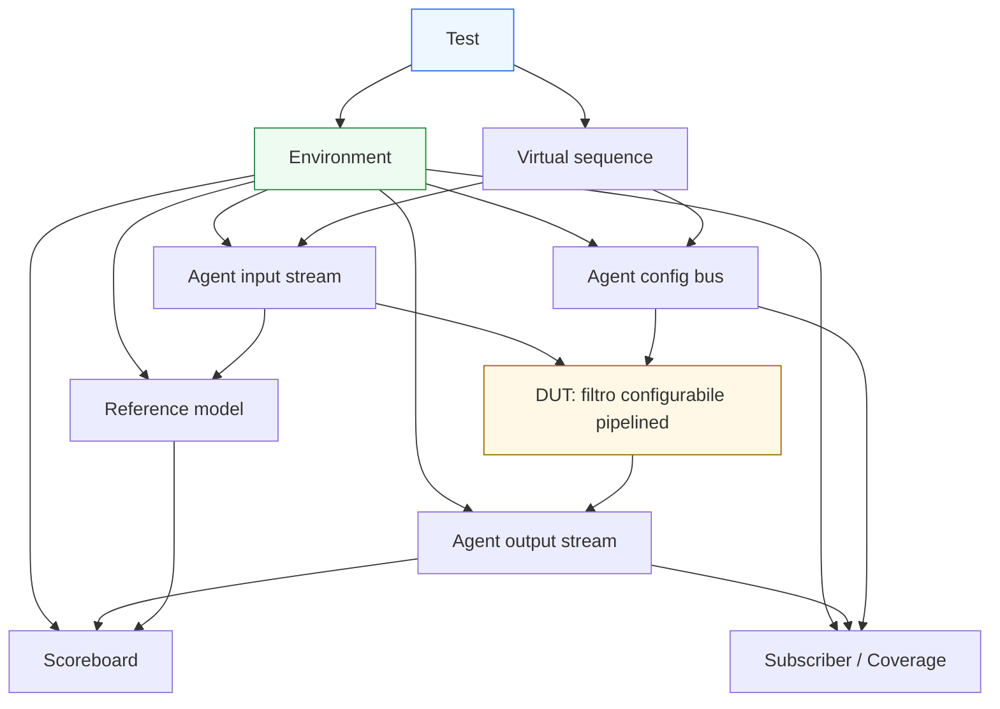

# Caso di studio UVM

Dopo aver costruito l’intera sezione UVM — dai **fondamenti metodologici** fino all’**integrazione con il DUT reale** — il passo conclusivo naturale è raccogliere tutti questi concetti in un **caso di studio** coerente. L’obiettivo di questa pagina non è introdurre nuovi meccanismi isolati, ma mostrare come i blocchi della metodologia collaborino davvero quando si verifica un DUT realistico.

Nel corso della sezione abbiamo affrontato:
- architettura del testbench;
- componenti fondamentali;
- phasing;
- factory e configurazione;
- sequence, sequencer e virtual sequence;
- driver, monitor, agent, environment;
- scoreboard, reference model e subscriber;
- test, objections, reporting, coverage e regressione;
- handshake, pipeline, latenza, reset e panoramica RAL.

Questa pagina li ricompone in un esempio unitario, con un taglio coerente con il resto della documentazione:
- didattico ma tecnico;
- ordinato e progressivo;
- centrato sul significato progettuale del testbench;
- orientato a mostrare le relazioni tra protocollo, architettura del DUT e architettura della verifica.

Il caso di studio proposto non è tool-specific e non entra in codice UVM dettagliato. L’obiettivo è capire **come si struttura la verifica**, non memorizzare API o sintassi.

## 1. Obiettivo del caso di studio

Per chiudere bene la sezione UVM è utile scegliere un DUT che sia:
- abbastanza semplice da restare leggibile;
- abbastanza ricco da giustificare l’uso reale della metodologia.

### 1.1 Il DUT scelto
Consideriamo un **blocco di elaborazione stream configurabile**, con queste caratteristiche:
- interfaccia di ingresso a handshake `valid/ready`;
- interfaccia di uscita a handshake `valid/ready`;
- piccola pipeline interna;
- latenza dipendente dalla modalità operativa;
- registro di configurazione accessibile tramite bus di controllo;
- reset che può arrivare sia all’inizio sia durante il traffico;
- output deterministico in funzione di input e configurazione.

### 1.2 Perché questo DUT è adatto
Questo esempio mette insieme, in forma compatta:
- protocollo a handshake;
- pipeline;
- latenza;
- configurazione register-based;
- checking funzionale;
- coverage di protocollo e di scenario;
- necessità di un environment con più agent.

### 1.3 Che cosa vogliamo mostrare
Vogliamo far vedere come UVM organizzi:
- stimolo;
- osservazione;
- configurazione;
- confronto atteso/osservato;
- coverage;
- debug;
- regressione.

## 2. Descrizione funzionale del DUT

Prima di parlare del testbench, conviene chiarire il DUT a livello concettuale.

### 2.1 Funzione del blocco
Il DUT riceve una parola di input e applica una trasformazione semplice ma configurabile, per esempio:
- pass-through;
- offset additivo;
- saturazione;
- mascheramento di alcuni bit;
- modalità bypass o filtro.

### 2.2 Interfacce
Il blocco ha:
- una interfaccia stream di ingresso;
- una interfaccia stream di uscita;
- una interfaccia di configurazione a registri;
- reset e clock.

### 2.3 Comportamento temporale
Il DUT:
- può accettare una nuova parola ogni ciclo in condizioni nominali;
- può introdurre latenza di uno o più cicli;
- può subire stall sul lato uscita se l’ambiente applica backpressure;
- può essere resettato durante attività.

## 3. Perché UVM ha senso per questo DUT

A prima vista si potrebbe pensare che un blocco del genere sia verificabile con un testbench molto semplice. In parte è vero, ma il caso diventa rapidamente più interessante quando si considerano tutti i requisiti insieme.

### 3.1 Temi da verificare
Bisogna controllare:
- correttezza della trasformazione dati;
- rispetto del protocollo di ingresso;
- rispetto del protocollo di uscita;
- coerenza tra registri e comportamento;
- gestione di stall e backpressure;
- reset durante traffico;
- ordering delle transazioni;
- latenza sotto modalità diverse.

### 3.2 Perché un banco monolitico peggiora rapidamente
Un testbench non strutturato finirebbe per mescolare:
- generazione dello stimolo;
- guida del bus di configurazione;
- guida dello stream input;
- osservazione dell’output;
- checking del dato;
- controllo dei registri;
- coverage;
- gestione del reset.

### 3.3 Vantaggio di UVM
UVM consente di separare questi ruoli in componenti ordinati e riusabili.

## 4. Architettura generale del testbench

Per questo DUT si può costruire un environment con più agent e componenti analitici dedicati.

### 4.1 Agent di input stream
Serve per:
- guidare il traffico di ingresso;
- osservare ciò che viene realmente accettato;
- supportare coverage locale del protocollo di input.

### 4.2 Agent di output stream
Serve principalmente per:
- osservare l’uscita;
- ricostruire le transazioni prodotte;
- misurare throughput e backpressure lato uscita.

### 4.3 Agent di configurazione
Serve per:
- leggere e scrivere registri;
- verificare accessi register-based;
- supportare scenari di riconfigurazione durante la simulazione.

### 4.4 Componenti globali
A livello environment troviamo:
- scoreboard;
- reference model;
- subscriber di coverage;
- eventuali checker aggiuntivi.

## 5. Sequence e scenari di test

Uno dei primi punti da progettare in modo chiaro è la libreria di sequence.

### 5.1 Sequence di configurazione
Alcune sequence servono a:
- programmare i registri;
- verificare valori di reset;
- cambiare modalità operative;
- impostare soglie o flag di controllo.

### 5.2 Sequence di traffico input
Altre sequence generano:
- traffico nominale;
- burst;
- dati limite;
- pattern ripetitivi;
- combinazioni utili per coverage.

### 5.3 Virtual sequence
Una virtual sequence coordina:
- scrittura dei registri;
- attivazione del traffico input;
- eventuale riconfigurazione mentre il DUT è già attivo;
- scenari multi-agent più ricchi.

### 5.4 Perché è importante
Questo mostra bene la distinzione tra:
- scenario globale di test;
- traffico locale sui singoli agent.

## 6. Il ruolo del `driver`

Nel caso di studio, i driver hanno ruoli ben distinti.

### 6.1 Driver dello stream input
Deve:
- tradurre i sequence item in segnali `valid/data`;
- rispettare `ready`;
- sostenere burst consecutivi;
- comportarsi correttamente durante reset e backpressure.

### 6.2 Driver del bus di configurazione
Deve:
- tradurre operazioni register-based in accessi al bus;
- rispettare il protocollo del canale di controllo;
- rendere possibile la programmazione del DUT in modo leggibile e coerente col RAL.

### 6.3 Perché è importante separarli
I due protocolli hanno semantica diversa e devono restare indipendenti nel testbench.

## 7. Il ruolo del `monitor`

Il monitor è decisivo in questo caso di studio.

### 7.1 Monitor di input
Deve ricostruire:
- quali transazioni sono state realmente accettate dal DUT;
- in quale ordine;
- con quali pause o stall.

### 7.2 Monitor di output
Deve osservare:
- quali risultati sono stati realmente prodotti;
- quando;
- con quale ordering;
- sotto quali condizioni di backpressure.

### 7.3 Monitor di configurazione
Può ricostruire:
- accessi ai registri;
- letture e scritture;
- valori trasferiti;
- relazioni tra configurazione e fase del test.

### 7.4 Perché il monitor è così importante
Tutto il checking serio del caso di studio dipende dalla qualità dei dati osservati.

## 8. Il ruolo del `reference model`

Il reference model è il cuore del lato atteso.

### 8.1 Che cosa usa
Riceve:
- transazioni input osservate;
- configurazione corrente del DUT;
- contesto di reset;
- eventuali informazioni rilevanti sul protocollo.

### 8.2 Che cosa produce
Genera:
- output attesi;
- ordering atteso;
- relazione tra input, configurazione e risultato;
- contesto corretto per il confronto nello scoreboard.

### 8.3 Perché è centrale
In questo DUT il comportamento dipende sia dai dati sia dalla configurazione register-based, quindi il model è molto più credibile di un confronto locale e ingenuo.

## 9. Il ruolo dello `scoreboard`

Lo scoreboard integra il lato osservato e il lato atteso.

### 9.1 Che cosa confronta
Confronta:
- output osservati dal monitor di uscita;
- output attesi dal reference model.

### 9.2 Temi da gestire
Deve tenere conto di:
- latenza;
- ordering;
- eventuali stall;
- reset in presenza di transazioni in volo;
- configurazioni cambiate tra uno scenario e l’altro.

### 9.3 Perché è uno dei punti più importanti
Se il DUT è corretto ma lo scoreboard è ingenuo, il caso di studio genera falsi mismatch. Se il DUT è scorretto ma lo scoreboard è debole, i bug possono sfuggire.

## 10. Il ruolo del RAL

Il blocco di configurazione rende utile introdurre il RAL.

### 10.1 Perché
Il DUT ha registri che controllano:
- modalità operative;
- eventuale bypass;
- parametri della trasformazione;
- flag di stato o controllo.

### 10.2 Come aiuta il RAL
Permette di ragionare in termini di:
- registro e campo;
- reset value;
- configurazione attiva;
- semantica dell’accesso;

invece che in termini di soli indirizzi e dati grezzi.

### 10.3 Collegamento col model
Il reference model può usare il RAL per interpretare correttamente la configurazione in vigore.

## 11. Coverage del caso di studio

Una buona coverage deve andare oltre il semplice conteggio dei test.

### 11.1 Coverage di configurazione
Verifica se sono state esercitate:
- modalità operative diverse;
- combinazioni di campi significativi;
- reset value e cambi configurazione.

### 11.2 Coverage di protocollo
Verifica se sono stati osservati:
- trasferimenti nominali;
- backpressure;
- stall;
- burst consecutivi;
- reset durante traffico.

### 11.3 Coverage di scenario
Verifica se sono stati esercitati:
- traffico con configurazione costante;
- riconfigurazione in run;
- reset in presenza di dati in volo;
- carico continuo della pipeline;
- casi con ordering e latenza variabili.

### 11.4 Perché è importante
La coverage guida il miglioramento delle sequence e della regressione.

## 12. Reset nel caso di studio

Il reset è uno dei punti più istruttivi dell’esempio.

### 12.1 Reset iniziale
Serve a:
- verificare valori di reset dei registri;
- controllare che il DUT parta da stato noto;
- allineare il model e lo scoreboard.

### 12.2 Reset durante traffico
Serve a verificare:
- annullamento o sopravvivenza di transazioni in volo secondo specifica;
- corretto comportamento di driver e monitor;
- capacità dello scoreboard di riallinearsi;
- recovery del DUT.

### 12.3 Perché è importante
Mostra bene come reset, protocollo, latenza e checking siano strettamente intrecciati.

## 13. Reporting e debug nel caso di studio

Un ambiente del genere deve essere molto leggibile in debug.

### 13.1 Reporting utile
Serve sapere:
- quale modalità era configurata;
- quale sequence era attiva;
- quando è stato applicato reset;
- quale transazione ha prodotto mismatch;
- quale output era atteso e quale osservato.

### 13.2 Debug metodico
In caso di fail, si può seguire questo percorso:
- test e configurazione attiva;
- sequence e virtual sequence;
- driver input e bus;
- monitor input/output;
- reference model;
- scoreboard;
- coverage del caso.

### 13.3 Perché è un buon caso di studio
Mostra bene come il debug UVM non sia solo “guardare waveform”, ma seguire una struttura ordinata di componenti e responsabilità.

## 14. Regressione del caso di studio

Il caso di studio si presta bene a una regressione progressiva.

### 14.1 Smoke test
- reset iniziale
- configurazione base
- pochi input nominali

### 14.2 Test nominali
- diverse modalità del registro
- flusso input continuo
- output atteso stabile

### 14.3 Corner case
- valori limite
- backpressure
- burst
- reset vicino al completamento di una transazione

### 14.4 Test di stress
- traffico continuo
- riconfigurazione durante attività
- più transazioni in volo
- combinazione di stall e reset

### 14.5 Beneficio
La regressione mostra molto bene il valore della separazione tra environment stabile e scenari variabili.

## 15. Che cosa insegna questo caso di studio

Questo esempio non serve solo a “riassumere la teoria”. Serve a mettere in evidenza alcune lezioni forti.

### 15.1 UVM è utile quando il DUT ha più dimensioni da verificare
Non solo dati, ma anche:
- protocollo;
- configurazione;
- latenza;
- reset;
- coverage;
- regressione.

### 15.2 La separazione dei ruoli è essenziale
Sequence, driver, monitor, scoreboard e model non sono burocrazia: sono il motivo per cui il testbench resta leggibile.

### 15.3 Il livello transazionale è il ponte giusto
Permette di collegare:
- scenario di test;
- comportamento del protocollo;
- checking funzionale;
- coverage.

### 15.4 La qualità del debug dipende dalla qualità dell’architettura
Questo è uno dei messaggi più importanti dell’intera sezione.

## 16. Errori comuni che questo caso aiuta a evitare

Il caso di studio aiuta anche a riconoscere errori frequenti.

### 16.1 Checking troppo locale
Confrontare solo input e output senza model o scoreboard coerente con latenza e configurazione.

### 16.2 Driver troppo semplice
Che non stressa davvero backpressure o pipeline.

### 16.3 Monitor poco rigoroso
Che confonde trasferimenti presentati e trasferimenti completati.

### 16.4 Test troppo monolitico
Che mescola configurazione, traffico, checking e debug.

### 16.5 Coverage debole
Che non misura scenari di reset, riconfigurazione o ordering.

## 17. Come usare questo caso di studio nella lettura della sezione

Questa pagina può essere riletta in due modi.

### 17.1 Come sintesi finale
Dopo aver letto tutta la sezione, aiuta a collegare i concetti in una vista unica.

### 17.2 Come mappa di ripasso
Può essere usata anche per tornare alle singole pagine:
- se il dubbio riguarda il traffico, si torna a sequence e driver;
- se riguarda l’osservazione, si torna a monitor;
- se riguarda il confronto, si torna a scoreboard e model;
- se riguarda la configurazione, si torna a RAL e test;
- se riguarda la diagnosi, si torna a reporting, coverage e debug.

## 18. Collegamento con il resto della sezione

Questa pagina si collega trasversalmente a tutta la sezione UVM, in particolare a:
- **`uvm-architecture.md`**
- **`uvm-components.md`**
- **`sequences.md`**
- **`virtual-sequences.md`**
- **`driver.md`**
- **`monitor.md`**
- **`environment.md`**
- **`scoreboard.md`**
- **`reference-model.md`**
- **`subscriber.md`**
- **`test.md`**
- **`coverage-uvm.md`**
- **`debug-uvm.md`**
- **`regression.md`**
- **`uvm-handshake-protocols.md`**
- **`uvm-pipelines-latency.md`**
- **`uvm-reset.md`**
- **`uvm-ral-overview.md`**

In questo senso, è la pagina che chiude il percorso e mostra come i singoli argomenti non siano isolati, ma parti di un’unica architettura di verifica.

## 19. In sintesi

Questo caso di studio mostra come un DUT apparentemente “moderato” diventi un ottimo terreno per UVM quando si combinano:
- interfacce a handshake;
- configurazione register-based;
- pipeline;
- latenza;
- reset;
- checking funzionale;
- coverage e regressione.

La metodologia UVM si rivela utile non perché aggiunga complessità astratta, ma perché organizza in modo leggibile e riusabile un insieme di problemi che, in un banco di prova monolitico, tenderebbero a confondersi.

Capire bene questo caso di studio significa vedere la sezione UVM non come una lista di componenti, ma come una architettura completa di verifica.

## Prossimo passo

Il passo più naturale, a questo punto, è preparare il **`nav` completo della sezione UVM** oppure l’**`index.md` finale rifinito**, così da consolidare l’intera documentazione in una struttura MkDocs pronta da integrare con le sezioni SoC, ASIC, FPGA e SystemVerilog.
