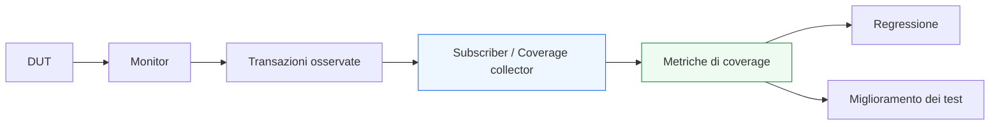

# Coverage in UVM

Dopo aver introdotto **messaging e reporting**, il passo successivo naturale è affrontare uno dei temi più importanti per valutare la qualità reale della verifica: la **coverage** in ambiente UVM.

In un testbench serio non basta dire:
- ho eseguito molti test;
- il DUT non ha dato errori;
- lo scoreboard non ha segnalato mismatch;
- il log finale è pulito.

Queste informazioni sono necessarie, ma non bastano. Resta infatti una domanda fondamentale:

- **quanto bene il testbench ha davvero esplorato il comportamento del DUT?**

È proprio qui che entra in gioco la coverage.

Dal punto di vista metodologico, la coverage è importante perché aiuta a capire:
- quali scenari sono stati effettivamente esercitati;
- quali parti del protocollo sono state osservate;
- quali combinazioni di campi o condizioni sono state coperte;
- quali corner case mancano ancora;
- quanto la regressione sta avanzando verso una verifica più completa.

In UVM, la coverage si integra molto bene con:
- monitor;
- subscriber;
- transazioni osservate;
- sequence;
- regressione;
- debug;
- reporting finale.

Questa pagina introduce la coverage in UVM con un taglio coerente con il resto della sezione:
- didattico ma tecnico;
- centrato sul suo significato architetturale;
- attento al rapporto tra coverage, checking e qualità della verifica;
- orientato a far capire che la coverage non è una statistica ornamentale, ma una guida concreta per far crescere il testbench.

## 1. Perché serve la coverage

La prima domanda importante è: perché non basta che i test “passino”?

### 1.1 Il limite del solo pass/fail
Un test che non fallisce ci dice che:
- il DUT non ha violato le aspettative osservate in quello scenario;
- lo scoreboard non ha rilevato mismatch;
- il protocollo, per quanto visto, sembra corretto.

Ma non ci dice:
- quali casi il testbench non ha ancora esercitato;
- quali zone del comportamento sono rimaste inesplorate;
- quali combinazioni di eventi non sono mai state viste;
- se i test stanno realmente coprendo i corner case più importanti.

### 1.2 La risposta della coverage
La coverage aggiunge una dimensione diversa:
- non misura solo se il DUT ha fallito;
- misura quanto la verifica ha esplorato il comportamento atteso del sistema.

### 1.3 Beneficio metodologico
Questo rende la coverage uno strumento fondamentale per:
- pianificare la crescita del testbench;
- migliorare le sequence;
- guidare la regressione;
- capire quando la verifica è ancora troppo superficiale.

## 2. Che cos’è la coverage in UVM

Nel contesto UVM, la coverage è l’insieme delle misure con cui il testbench osserva e registra quali scenari, transazioni, condizioni o combinazioni di eventi siano stati realmente esercitati.

### 2.1 Significato essenziale
La coverage serve a rispondere a domande come:
- abbiamo visto tutti i tipi di transazione previsti?
- abbiamo esercitato tutte le modalità operative rilevanti?
- abbiamo osservato condizioni di stall, burst, reset, backpressure?
- abbiamo coperto combinazioni importanti di campi o stati?

### 2.2 Livello naturale
In UVM, la coverage lavora molto bene a livello:
- transazionale;
- di protocollo;
- di scenario;
- di interazione tra componenti.

### 2.3 Perché questo è importante
La metodologia UVM si presta bene alla coverage proprio perché:
- usa sequence item e transazioni;
- ha monitor che ricostruiscono il comportamento osservato;
- ha subscriber che possono raccogliere dati senza sporcare il resto del testbench.

## 3. Coverage e checking: differenze fondamentali

Uno degli equivoci più frequenti è confondere coverage e checking.

### 3.1 Il checking
Il checking risponde alla domanda:
- il comportamento osservato è corretto?

### 3.2 La coverage
La coverage risponde alla domanda:
- quali comportamenti abbiamo effettivamente esercitato?

### 3.3 Perché servono entrambe
Si può avere:
- buona coverage ma checking debole;
- buon checking ma coverage povera;
- molti test passati ma scarsa esplorazione del DUT.

### 3.4 Visione corretta
Checking e coverage sono complementari:
- il checking misura la correttezza;
- la coverage misura la completezza dell’esplorazione.

## 4. Coverage e transazioni osservate

Uno dei punti più naturali della coverage UVM è l’uso delle transazioni osservate.

### 4.1 Perché è il livello giusto
Invece di ragionare solo su segnali grezzi, è spesso più utile raccogliere coverage su:
- richieste;
- risposte;
- pacchetti;
- operazioni;
- eventi di protocollo ricostruiti.

### 4.2 Beneficio
Questo rende la coverage:
- più leggibile;
- più vicina alla semantica del DUT;
- più utile per guidare i test successivi.

### 4.3 Collegamento metodologico
È uno dei motivi per cui monitor e subscriber sono così centrali in UVM.

## 5. Perché la coverage vive bene nei `subscriber`

Uno degli usi più naturali del subscriber è proprio la raccolta della coverage.

### 5.1 Il monitor osserva
Il monitor ricostruisce le transazioni osservate.

### 5.2 Il subscriber raccoglie
Il subscriber può consumare queste transazioni e aggiornare le metriche di coverage.

### 5.3 Perché è una buona separazione
Così:
- il monitor resta focalizzato sull’osservazione;
- il subscriber resta focalizzato sull’analisi;
- la coverage non inquina la logica di protocollo o di checking.

### 5.4 Beneficio architetturale
Il testbench resta più pulito, estendibile e riusabile.

## 6. Tipi di coverage rilevanti in UVM

Nel contesto di UVM, ci sono vari modi utili di pensare la coverage.

### 6.1 Coverage di protocollo
Per esempio:
- tipi di handshake osservati;
- burst;
- stall;
- backpressure;
- reset in momenti rilevanti;
- modalità di accettazione o completamento delle transazioni.

### 6.2 Coverage di transazione
Per esempio:
- opcodes;
- campi di comando;
- indirizzi;
- payload;
- combinazioni di attributi;
- pattern di sequenza.

### 6.3 Coverage di scenario
Per esempio:
- traffico nominale;
- corner case;
- reset durante attività;
- combinazione di più agent;
- scenari multi-interfaccia;
- casi di ordering e latenza.

### 6.4 Coverage di configurazione
Per esempio:
- modalità diverse del DUT;
- opzioni attivate o disattivate;
- setting del protocollo o del testbench.

## 7. Coverage e DUT con protocollo semplice

Anche nei DUT semplici la coverage ha valore.

### 7.1 Caso base
Per un DUT con una sola interfaccia, si può comunque voler sapere:
- se tutti i tipi di operazione previsti sono stati visti;
- se i range significativi dei campi sono stati coperti;
- se i casi di protocollo importanti sono stati osservati.

### 7.2 Perché conta
Anche test relativamente piccoli possono restare ciechi a:
- combinazioni rare;
- valori limite;
- casi di temporizzazione poco frequenti.

### 7.3 Beneficio
La coverage rende visibili queste lacune.

## 8. Coverage e DUT con latenza

Il valore della coverage cresce molto quando il DUT ha latenza.

### 8.1 Perché
Non basta sapere che un output corretto è arrivato. Può essere utile sapere se sono stati esercitati:
- casi di latenza minima;
- casi di latenza massima;
- combinazioni con traffico continuo;
- condizioni in cui più transazioni erano in volo.

### 8.2 Collegamento col comportamento osservabile
La coverage può aiutare a capire se il testbench ha davvero esplorato il comportamento temporale del DUT.

### 8.3 Beneficio metodologico
Questo è molto importante per DUT pipelined o con dinamiche di throughput non banali.

## 9. Coverage e DUT con pipeline

Per DUT pipelined, la coverage è spesso uno strumento molto ricco.

### 9.1 Casi interessanti
Si può voler sapere se sono stati osservati:
- pipeline vuota;
- pipeline in riempimento;
- traffico continuo;
- stall dello stadio finale;
- burst ravvicinati;
- flush o reset in momenti significativi;
- interazioni tra validità e backpressure.

### 9.2 Perché è utile
Molti bug reali emergono proprio nelle zone non esercitate della pipeline.

### 9.3 Beneficio
La coverage rende queste zone più visibili e aiuta a progettare sequence più efficaci.

## 10. Coverage e DUT con più interfacce

Quando il DUT ha più interfacce, la coverage assume una dimensione ancora più ricca.

### 10.1 Coverage locale
Ogni agent o subscriber locale può raccogliere coverage sul proprio protocollo.

### 10.2 Coverage di sistema
A livello environment si può raccogliere coverage su:
- interazione tra ingressi e uscite;
- combinazioni di eventi su più canali;
- scenari multi-agent;
- configurazione + traffico;
- request/response su interfacce separate.

### 10.3 Perché è importante
Molti problemi interessanti si manifestano non nei singoli canali, ma nelle loro interazioni.

## 11. Coverage e sequence

Le sequence e la coverage sono strettamente collegate.

### 11.1 Le sequence generano scenari
Le sequence decidono quali transazioni e pattern di traffico il DUT vedrà.

### 11.2 La coverage misura ciò che è successo
La coverage rivela:
- quali sequence stanno davvero esercitando il DUT;
- quali casi non vengono mai raggiunti;
- dove la libreria di stimolo è debole o incompleta.

### 11.3 Beneficio
Questo crea un ciclo molto utile:
- si misura la coverage;
- si identificano i buchi;
- si migliorano le sequence;
- si riesegue la regressione.

## 12. Coverage e regressione

La coverage è uno dei pilastri della regressione seria.

### 12.1 Perché
Una regressione non serve solo a “ripetere test”, ma a costruire nel tempo una verifica più completa.

### 12.2 Cosa permette la coverage
Permette di capire:
- se la regressione sta coprendo nuovi casi;
- quali scenari restano scoperti;
- se certe sequence sono ridondanti;
- se mancano intere aree della specifica.

### 12.3 Beneficio architetturale
La regressione smette di essere solo una lista di pass/fail e diventa uno strumento di crescita della qualità della verifica.

## 13. Coverage e reporting

La coverage ha una relazione naturale anche con il reporting.

### 13.1 Perché
Non basta raccoglierla: bisogna anche saperla leggere e sintetizzare.

### 13.2 Che cosa può aiutare a capire
Per esempio:
- aree coperte;
- aree scoperte;
- casi ancora da esercitare;
- zone in cui il testbench si comporta bene o male.

### 13.3 Collegamento con il report finale
La coverage può contribuire al report finale del test, della regressione o del ciclo di verifica.

## 14. Coverage e debug

La coverage non serve solo a misurare il progresso: aiuta anche il debug.

### 14.1 Perché
Quando un certo bug è difficile da riprodurre, può essere utile capire:
- se il testbench ha davvero esercitato la condizione sospetta;
- se quella combinazione di eventi è stata vista;
- se il protocollo è entrato nella zona interessante;
- se il caso problematico era stato realmente coperto.

### 14.2 Beneficio
La coverage aiuta a rispondere non solo a:
- “il test fallisce?”
ma anche a:
- “il test è davvero arrivato nella regione che volevo osservare?”

## 15. Errori comuni

Alcuni errori ricorrono spesso nell’uso della coverage in UVM.

### 15.1 Confonderla col checking
Un test che passa non garantisce buona coverage.

### 15.2 Raccogliere coverage sui segnali sbagliati o troppo bassi di livello
Se la coverage è troppo distante dalla semantica del DUT, diventa meno utile.

### 15.3 Metterla tutta nel monitor
Questo rende il monitor troppo carico e meno riusabile.

### 15.4 Ignorare la coverage di scenario
Concentrarsi solo sui campi delle transazioni può far perdere interazioni importanti di protocollo o di sistema.

### 15.5 Guardare solo la percentuale finale
La coverage è utile soprattutto se aiuta a ragionare su **che cosa manca**, non solo su un numero.

## 16. Buone pratiche di modellazione

Per costruire bene la coverage in UVM, alcune linee guida sono particolarmente utili.

### 16.1 Raccoglierla su transazioni osservate
Questo la rende più vicina al comportamento reale del DUT.

### 16.2 Usare subscriber dedicati
La coverage cresce meglio quando è separata da monitor e scoreboard.

### 16.3 Progettarla in funzione della specifica
Le metriche dovrebbero riflettere:
- modalità operative;
- corner case;
- protocolli;
- interazioni;
- vincoli funzionali rilevanti.

### 16.4 Legarla alle sequence
La coverage dovrebbe guidare il miglioramento dello stimolo.

### 16.5 Usarla come strumento di evoluzione
Una buona coverage serve a capire come far crescere il testbench nel tempo.

## 17. Collegamento con il resto della sezione

Questa pagina si collega direttamente a:
- **`subscriber.md`**, che è uno dei luoghi naturali per raccogliere coverage;
- **`monitor.md`**, che produce le transazioni osservate;
- **`reporting.md`**, che aiuta a comunicare e sintetizzare i risultati della coverage;
- **`regression.md`**, perché la coverage è una delle leve più forti per guidare la regressione;
- **`debug-uvm.md`**, perché coverage e debug si rafforzano a vicenda.

Prepara inoltre in modo naturale le pagine successive:
- **`debug-uvm.md`**
- **`regression.md`**
- **`case-study-uvm.md`**

perché tutti questi temi dipendono da quanto bene il testbench riesca a misurare la propria esplorazione del DUT.

## 18. In sintesi

La coverage in UVM misura quanto bene il testbench ha effettivamente esplorato il comportamento del DUT. Non sostituisce il checking, ma lo completa:
- il checking dice se il comportamento è corretto;
- la coverage dice se i casi importanti sono stati davvero esercitati.

Il suo valore cresce moltissimo quando è:
- raccolta a livello transazionale;
- collegata a monitor e subscriber;
- letta insieme a sequence, regressione e specifica del DUT.

Capire bene la coverage significa capire come il testbench passi da semplice esecuzione di test a verifica guidata, misurabile e migliorabile nel tempo.

## Prossimo passo

Il passo più naturale ora è **`debug-uvm.md`**, perché dopo aver chiarito checking, reporting e coverage conviene affrontare in modo diretto:
- come si diagnosticano i problemi in un ambiente UVM
- come leggere i log, i flussi e i mismatch
- come isolare errori di DUT, protocollo o testbench
