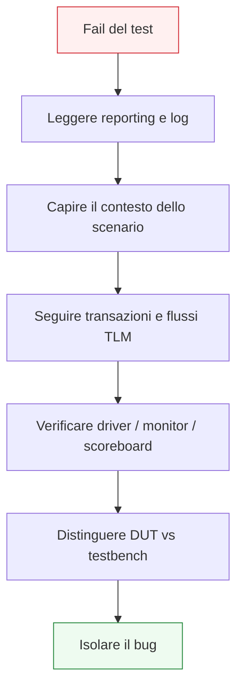

# Debug del testbench UVM

Dopo aver introdotto **reporting**, **coverage**, **scoreboard**, **monitor** ed **environment**, il passo successivo naturale è affrontare uno dei temi più pratici e importanti dell’uso quotidiano di UVM: il **debug**.

Un ambiente UVM ben progettato non serve solo a stimolare il DUT e a produrre un verdetto finale. Deve anche aiutare a rispondere in modo ordinato a domande come:
- dove si è verificato il problema?
- il bug è nel DUT o nel testbench?
- il traffico generato era corretto?
- il protocollo è stato pilotato bene?
- il monitor ha ricostruito correttamente le transazioni?
- lo scoreboard ha confrontato in modo giusto?
- il problema è di configurazione, timing, scenario o checking?

Dal punto di vista metodologico, il debug in UVM è molto più di una semplice ispezione di waveform. È il risultato della collaborazione tra:
- struttura del testbench;
- qualità dei messaggi;
- chiarezza delle transazioni;
- organizzazione di monitor e scoreboard;
- uso corretto di coverage;
- configurazione dei test;
- disciplina nella separazione delle responsabilità.

Questo significa che un ambiente UVM “facile da debuggare” non nasce per caso. Nasce da scelte architetturali corrette.

Questa pagina introduce il debug UVM con un taglio coerente con il resto della sezione:
- didattico ma tecnico;
- centrato sul metodo;
- attento a distinguere i diversi livelli in cui un bug può nascere;
- orientato a far capire che il debug è una proprietà del testbench, non solo una fase finale del lavoro.

## 1. Perché il debug è un tema centrale in UVM

La prima domanda importante è: perché dedicare una pagina specifica al debug?

### 1.1 Un testbench non serve solo a trovare bug
Serve anche a renderli:
- localizzabili;
- comprensibili;
- riproducibili;
- distinguibili tra bug del DUT e bug del testbench.

### 1.2 Il costo di un ambiente poco debuggabile
Se il testbench è disordinato:
- i log diventano inutili;
- i mismatch sono poco spiegati;
- i componenti si accoppiano troppo;
- il punto reale del problema resta ambiguo;
- la regressione produce fallimenti opachi.

### 1.3 La risposta metodologica
UVM, se usato bene, offre una struttura che rende il debug molto più disciplinato.

## 2. Il debug come proprietà dell’architettura del testbench

È importante capire che il debug non dipende solo dagli strumenti, ma dalla qualità dell’architettura UVM.

### 2.1 Se i ruoli sono ben separati
È più facile capire se il problema nasce in:
- sequence;
- driver;
- monitor;
- scoreboard;
- subscriber;
- configurazione del test;
- DUT.

### 2.2 Se i ruoli sono mescolati
Allora:
- i sintomi si sovrappongono;
- il punto del guasto è meno chiaro;
- il debugging richiede più tempo;
- il testbench diventa meno affidabile.

### 2.3 Visione corretta
Una buona architettura UVM è già una forma di preparazione al debug.

## 3. Le grandi categorie di bug in un ambiente UVM

Uno dei primi passi del debug è capire **che tipo di problema** si sta osservando.

### 3.1 Bug del DUT
Per esempio:
- dato sbagliato;
- ordering errato;
- violazione di protocollo;
- comportamento scorretto in reset;
- latenza inattesa;
- output mancante.

### 3.2 Bug del testbench
Per esempio:
- sequence sbagliata;
- driver che pilota male il protocollo;
- monitor che ricostruisce male le transazioni;
- scoreboard che confronta in modo scorretto;
- reference model errato;
- connessioni TLM sbagliate.

### 3.3 Bug di configurazione
Per esempio:
- agent attivo/passivo errato;
- logging o coverage non coerenti;
- factory override non desiderato;
- scenario di test diverso da quello inteso.

### 3.4 Perché la classificazione è importante
Aiuta a non trattare tutti i fallimenti come se avessero la stessa origine.

## 4. Il primo passo: capire il contesto del fallimento

Quando un test fallisce, il primo obiettivo non è aprire subito tutto il codice, ma capire **in quale scenario** il problema è avvenuto.

### 4.1 Domande utili
- quale test era in esecuzione?
- quale sequence o virtual sequence era attiva?
- quali agent erano attivi o passivi?
- quale configurazione era abilitata?
- c’erano reset, stall, traffico di stress o multi-agent?

### 4.2 Perché è utile
Il contesto restringe subito il campo e aiuta a evitare debug cieco.

### 4.3 Collegamento con il reporting
Per questo il reporting ben fatto è il primo alleato del debug.

## 5. Leggere i log con metodo

I log sono una fonte fondamentale, ma vanno letti in modo ordinato.

### 5.1 Che cosa cercare prima
Conviene cercare:
- primo errore significativo;
- warning che lo precedono;
- componenti coinvolti;
- stato del testbench al momento del fallimento.

### 5.2 Evitare un errore comune
Non sempre l’ultimo messaggio del log è la vera causa del problema. Spesso è solo la conseguenza finale.

### 5.3 Che cosa deve emergere dai log
- scenario attivo;
- flusso delle transazioni;
- punto di mismatch;
- componente che ha rilevato l’anomalia.

## 6. Reporting e debug

Il reporting UVM è uno dei punti più importanti per rendere il debug rapido.

### 6.1 Messaggi informativi
Aiutano a ricostruire:
- inizio delle sequence;
- configurazioni attive;
- step principali del test.

### 6.2 Warning
Possono indicare:
- segnali sospetti;
- setup non ideale;
- comportamento inatteso ma non ancora fatale.

### 6.3 Errori
Indicano il punto in cui il testbench considera il comportamento non più accettabile.

### 6.4 Fatal
Segnalano condizioni strutturalmente gravi.

### 6.5 Perché tutto questo conta
Un buon sistema di reporting trasforma il log in una guida di debug, non in una semplice traccia rumorosa.

## 7. Debug e sequence

Le sequence sono uno dei primi punti da verificare quando lo scenario sembra sbagliato.

### 7.1 Domande utili
- la sequence corretta è stata davvero lanciata?
- stava generando il tipo di traffico atteso?
- i sequence item erano coerenti con lo scenario?
- la virtual sequence coordinava davvero gli agent previsti?

### 7.2 Perché è importante
Un problema di stimolo può sembrare un bug del DUT se non si controlla bene il lato sequence.

### 7.3 Segnale tipico
Se il DUT riceve traffico incoerente o incompleto, il primo sospetto deve includere le sequence.

## 8. Debug del `driver`

Il driver è un altro punto critico del debug, perché è il luogo in cui la transazione diventa protocollo a segnali.

### 8.1 Domande utili
- il driver ha ricevuto il giusto item dal sequencer?
- ha pilotato i segnali nel modo corretto?
- ha rispettato reset, clock e handshake?
- ha mantenuto `valid` o altri segnali di controllo nel modo previsto?
- ha interpretato correttamente il protocollo?

### 8.2 Perché è importante
Un driver scorretto può generare sintomi molto simili a un bug del DUT.

### 8.3 Segnale tipico
Se il monitor osserva qualcosa di diverso da ciò che il test si aspettava di inviare, il driver è uno dei primi sospetti.

## 9. Debug del `monitor`

Anche il monitor è centrale nel debug, perché è la sorgente del comportamento osservato.

### 9.1 Domande utili
- il monitor sta campionando i segnali nel momento giusto?
- ricostruisce correttamente la transazione?
- gestisce bene reset e condizioni di handshake?
- interpreta correttamente burst, stall, ordering e completamento?

### 9.2 Perché è importante
Un monitor scorretto può generare mismatch falsi nello scoreboard.

### 9.3 Segnale tipico
Se il protocollo in waveform sembra corretto ma lo scoreboard riceve transazioni inconsistenti, il monitor va analizzato con grande attenzione.

## 10. Debug dello `scoreboard`

Lo scoreboard è spesso il luogo in cui il problema emerge, ma non sempre il luogo in cui nasce.

### 10.1 Domande utili
- il lato osservato è corretto?
- il lato atteso è corretto?
- il confronto considera bene latenza e ordering?
- i mismatch sono descritti con abbastanza contesto?
- il criterio di pass/fail è coerente con la specifica?

### 10.2 Perché è importante
Uno scoreboard sbagliato produce:
- falsi errori;
- falsi successi;
- regressioni poco affidabili.

### 10.3 Visione corretta
Quando compare un mismatch, lo scoreboard è il punto di visibilità del problema, non necessariamente la sua origine.

## 11. Debug del `reference model`

Quando lo scoreboard usa un reference model, anche il modello atteso può essere fonte di problemi.

### 11.1 Domande utili
- il modello riflette davvero la specifica?
- usa gli input corretti?
- tiene conto della configurazione del DUT?
- gestisce bene ordering, latenza e modalità operative?
- produce attesi coerenti con lo scenario?

### 11.2 Perché è importante
Un model errato può far sembrare il DUT scorretto quando invece il difetto è nel testbench.

### 11.3 Segnale tipico
Se le waveform e il monitor sembrano coerenti ma l’atteso è sospetto, il reference model va riesaminato.

## 12. Debug delle connessioni TLM

Un problema può nascere non nei componenti, ma nelle connessioni tra loro.

### 12.1 Domande utili
- il monitor sta davvero inviando le transazioni al consumer giusto?
- lo scoreboard riceve ciò che dovrebbe?
- i subscriber sono collegati correttamente?
- i flussi osservato/atteso arrivano completi?

### 12.2 Perché è importante
Un errore di connessione può produrre:
- dati mancanti;
- coverage parziale;
- scoreboards “silenziosi”;
- mismatch dovuti ad assenza di input corretti.

### 12.3 Segnale tipico
Se un componente sembra inattivo o “cieco”, le connessioni TLM vanno verificate subito.

## 13. Debug della configurazione del test

Molti problemi nascono prima ancora che la simulazione parta davvero, cioè nella configurazione del test.

### 13.1 Domande utili
- il test giusto è stato lanciato?
- gli agent sono configurati correttamente?
- coverage e subscriber attesi sono attivi?
- gli override di factory sono quelli giusti?
- la virtual interface corretta è stata passata ai componenti?

### 13.2 Perché è importante
Una configurazione sbagliata può simulare in apparenza correttamente ma produrre un comportamento del testbench molto diverso da quello inteso.

### 13.3 Segnale tipico
Se lo scenario eseguito non corrisponde a quello progettato, il problema è spesso di configurazione.

## 14. Coverage e debug

La coverage è molto utile anche nel debug.

### 14.1 Perché
Aiuta a rispondere a domande come:
- il caso che cercavo di esercitare è stato davvero raggiunto?
- la combinazione sospetta è stata osservata?
- il DUT è entrato nello stato o nel pattern di protocollo atteso?
- il bug è assente perché corretto, o perché il test non arriva davvero lì?

### 14.2 Beneficio
Questo evita di debuggare a vuoto scenari che il testbench in realtà non ha mai esercitato.

### 14.3 Visione corretta
La coverage non sostituisce il debug, ma dice se il debug sta guardando una regione del comportamento davvero visitata.

## 15. Waveform e debug UVM

Le waveform restano importanti, ma in UVM vanno lette insieme alla struttura del testbench.

### 15.1 Cosa mostrano bene
- clock e reset;
- handshake;
- segnali del protocollo;
- ordine temporale degli eventi;
- condizioni di stall, backpressure o reset.

### 15.2 Cosa non mostrano da sole
Non spiegano automaticamente:
- quale sequence ha generato il traffico;
- quale transazione il monitor ha ricostruito;
- quale atteso lo scoreboard stesse usando;
- quale parte del testbench fosse configurata in un certo modo.

### 15.3 Visione corretta
Le waveform sono molto potenti, ma diventano veramente efficaci quando lette insieme a:
- reporting;
- transazioni;
- flussi TLM;
- struttura UVM.

## 16. Debug e DUT con latenza o pipeline

Il debug diventa più delicato nei DUT con latenza o pipeline.

### 16.1 Perché
I bug possono dipendere da:
- correlazione errata input/output;
- ordering;
- accumulo di più transazioni in volo;
- output che arrivano più tardi del previsto;
- interazione tra traffico, stall e reset.

### 16.2 Componenti chiave
In questi casi diventano particolarmente importanti:
- scoreboard;
- reference model;
- monitor;
- coverage di scenario;
- logging ben contestualizzato.

### 16.3 Beneficio di un buon ambiente UVM
Se la struttura è pulita, il debug di pipeline e latenza diventa molto più gestibile.

## 17. Debug e DUT multi-agent

In un ambiente multi-agent, il debug deve distinguere anche l’origine del flusso problematico.

### 17.1 Domande utili
- il problema nasce sul canale di input?
- sull’output?
- sulla configurazione?
- nell’interazione tra più agent?
- nella virtual sequence?

### 17.2 Perché è importante
Molti bug di integrazione non sono locali a una sola interfaccia.

### 17.3 Beneficio architetturale
La struttura per agent e environment aiuta moltissimo a separare i livelli del problema.

## 18. Errori comuni nel debug UVM

Alcuni errori ricorrono spesso.

### 18.1 Guardare subito troppo in basso
Aprire subito tutte le waveform senza capire prima scenario e log porta spesso a perdere tempo.

### 18.2 Dare per scontato che il bug sia nel DUT
In molti casi il problema è nel testbench:
- sequence;
- driver;
- monitor;
- scoreboard;
- model;
- configurazione.

### 18.3 Non usare la struttura del testbench
UVM offre già una decomposizione in livelli. Ignorarla rende il debug molto più difficile.

### 18.4 Log troppo poveri o troppo rumorosi
Entrambi peggiorano il triage del problema.

### 18.5 Non isolare il livello del bug
Mescolare problemi di scenario, protocollo e checking crea molta confusione.

## 19. Un metodo pratico di debug in UVM

Un approccio ordinato può essere questo.

### 19.1 Capire il contesto
- quale test?
- quale configurazione?
- quali sequence?

### 19.2 Trovare il primo sintomo forte
- primo errore;
- primo warning utile;
- primo mismatch significativo.

### 19.3 Seguire il flusso della transazione
- item generato;
- driver;
- protocollo sui segnali;
- monitor;
- scoreboard;
- atteso del model.

### 19.4 Distinguere DUT e testbench
- lo stimolo era corretto?
- il protocollo era corretto?
- l’osservazione era corretta?
- il confronto era corretto?

### 19.5 Ridurre il problema
- meno traffico;
- meno agent;
- logging più mirato;
- scenario più semplice ma riproducibile.

## 20. Buone pratiche di modellazione per facilitare il debug

Il debug efficace si costruisce prima che il bug compaia.

### 20.1 Mantenere i ruoli ben separati
Questo rende più facile localizzare il problema.

### 20.2 Curare reporting e messaggi
Messaggi utili riducono molto il tempo di diagnosi.

### 20.3 Tenere puliti monitor e scoreboard
Più i componenti hanno responsabilità chiare, più i sintomi sono interpretabili.

### 20.4 Usare coverage in modo intelligente
La coverage aiuta a capire se il caso sospetto è stato davvero esercitato.

### 20.5 Configurare il testbench per il debug
Subscriber dedicati, logging selettivo e scenari ridotti sono strumenti molto preziosi.

## 21. Collegamento con il resto della sezione

Questa pagina si collega direttamente a:
- **`reporting.md`**, che ha introdotto il lato comunicativo del testbench;
- **`coverage-uvm.md`**, che aiuta a capire se i casi sospetti sono stati davvero esercitati;
- **`scoreboard.md`**, dove il mismatch spesso emerge;
- **`reference-model.md`**, che fornisce il lato atteso;
- **`monitor.md`** e **`driver.md`**, che aiutano a distinguere problemi di protocollo e osservazione;
- **`test.md`** e **`test-configuration.md`**, perché il contesto del test è parte centrale del debug.

Prepara inoltre in modo naturale la pagina successiva:
- **`regression.md`**

perché una buona regressione dipende anche dalla capacità di leggere, classificare e correggere i fallimenti in modo ordinato.

## 22. In sintesi

Il debug in UVM non è solo una fase finale della verifica, ma una proprietà dell’intero testbench. Un ambiente ben progettato rende più facile distinguere:
- bug del DUT;
- bug del protocollo;
- bug del testbench;
- errori di configurazione;
- mismatch dovuti a model o scoreboard.

Il debug efficace nasce dalla collaborazione tra:
- reporting;
- coverage;
- monitor;
- scoreboard;
- reference model;
- struttura per agent ed environment.

Capire bene il debug UVM significa capire come usare la metodologia non solo per trovare bug, ma per isolarli e spiegarli in modo rapido e credibile.

## Prossimo passo

Il passo più naturale ora è **`regression.md`**, perché dopo aver chiarito stimolo, checking, coverage, reporting e debug conviene chiudere il ramo operativo della verifica spiegando:
- come si organizza una regressione UVM
- come si leggono molti test insieme
- come coverage, reporting e debug convergono in una campagna di verifica strutturata
