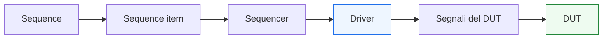

# `driver` in UVM

Dopo aver introdotto il **`sequence item`**, il **`sequencer`**, le **`sequence`** e le **`virtual sequence`**, il passo successivo naturale è affrontare il componente che mette in contatto il livello transazionale del testbench con il mondo reale dei segnali del DUT: il **`driver`**.

Il driver è uno dei blocchi più importanti di un agent UVM, perché è il punto in cui una transazione astratta smette di essere solo un oggetto di verifica e diventa:
- attività su un’interfaccia;
- temporizzazione rispetto al clock;
- rispetto di un protocollo;
- applicazione concreta di handshake, reset, attese e sequenze di segnali.

Dal punto di vista metodologico, il driver è cruciale perché rappresenta il confine tra:
- scenario di test;
- flusso transazionale;
- comportamento del DUT a livello RTL.

Per questo motivo, il driver non va letto solo come “chi guida i pin”, ma come il componente che traduce in modo disciplinato l’intenzione dello stimolo in una forma coerente con:
- protocollo del DUT;
- struttura dell’interfaccia;
- timing logico;
- regole di handshake;
- semantica del reset;
- eventuali condizioni di backpressure o latenza.

Questa pagina introduce il driver con un taglio coerente con il resto della sezione UVM:
- didattico ma tecnico;
- centrato sulla separazione delle responsabilità;
- attento al rapporto tra transazione, protocollo e verifica del DUT;
- orientato a far capire perché il driver è una parte architetturalmente importante del testbench, non un semplice dettaglio implementativo.

## 1. Che cos’è un `driver`

Il `driver` è il componente UVM che riceve transazioni dal lato sequence/sequencer e le converte in attività concreta sui segnali di un’interfaccia del DUT.

### 1.1 Significato essenziale
Il driver:
- ottiene un `sequence item`;
- interpreta i suoi campi nel contesto del protocollo da verificare;
- guida i segnali dell’interfaccia;
- sincronizza il comportamento con il clock;
- rispetta le regole del protocollo;
- completa l’operazione dal punto di vista del lato attivo del testbench.

### 1.2 Livello di astrazione
Il driver si colloca tra due mondi:
- sopra di lui c’è il livello transazionale;
- sotto di lui c’è il livello a segnali.

### 1.3 Perché questo ruolo è così importante
Se il driver non è progettato bene, il testbench rischia di:
- applicare male il protocollo;
- generare stimoli non realistici;
- mascherare bug del DUT;
- introdurre bug del testbench stesso;
- rendere poco affidabile il checking successivo.

## 2. Perché il driver serve davvero

La prima domanda importante è: perché UVM separa driver e sequence, invece di lasciare che la sequence guidi direttamente i segnali?

### 2.1 Il problema da evitare
Se la sequence guidasse direttamente i segnali del DUT, si mescolerebbero nello stesso punto:
- descrizione dello scenario;
- generazione della transazione;
- dettaglio del protocollo;
- sincronizzazione col clock;
- gestione del timing.

### 2.2 La risposta UVM
UVM separa questi ruoli:
- la `sequence` descrive lo scenario;
- il `sequencer` coordina il flusso;
- il `driver` implementa il protocollo a segnali.

### 2.3 Beneficio metodologico
Questa separazione migliora:
- riuso delle sequence;
- riuso del driver;
- leggibilità del testbench;
- chiarezza del protocollo;
- facilità di debug.

## 3. Driver e livello di protocollo

Uno dei modi migliori per leggere il driver è vederlo come il **custode del protocollo** sul lato attivo dell’interfaccia.

### 3.1 Che cosa significa
Il driver è il componente che conosce:
- come vanno guidati i segnali;
- in quale ordine;
- in quali cicli;
- con quali dipendenze temporali;
- con quali regole di handshake.

### 3.2 Esempio concettuale
Per un protocollo `valid/ready`, il driver deve sapere:
- quando presentare il dato;
- quando attivare `valid`;
- come attendere `ready`;
- quando considerare completata la transazione;
- quando rilasciare o aggiornare i segnali.

### 3.3 Conseguenza progettuale
Il driver è fortemente legato al protocollo dell’interfaccia, ma non dovrebbe essere legato al significato di alto livello del test. Questo resta responsabilità delle sequence.

## 4. Relazione tra `driver` e `sequence item`

Il sequence item rappresenta la transazione. Il driver ne realizza la manifestazione a segnali.

### 4.1 Che cosa riceve il driver
Riceve un oggetto che descrive:
- payload;
- campi di controllo;
- tipo di operazione;
- opcode;
- indirizzo;
- eventuali tag o metadati.

### 4.2 Che cosa fa con quell’oggetto
Interpreta quei campi nel contesto del protocollo e li traduce in:
- valori sui bus;
- sequenze di controllo;
- attese temporali;
- pattern di handshake;
- segnali coerenti col clock e col reset.

### 4.3 Perché è utile questa relazione
Permette di mantenere:
- le transazioni come oggetti riusabili;
- il driver focalizzato sul livello fisico/logico del trasferimento.

## 5. Relazione tra `driver` e `sequencer`

Il driver non riceve transazioni “in aria”: le riceve tramite il `sequencer`.

### 5.1 Ruolo del sequencer
Il sequencer coordina il flusso degli item.

### 5.2 Ruolo del driver
Il driver consuma gli item dal sequencer e li applica all’interfaccia.

### 5.3 Perché la distinzione conta
Il sequencer non conosce il protocollo a segnali. Il driver sì.  
Il driver non decide lo scenario. Il sequencer e le sequence sì.

### 5.4 Beneficio
Questo mantiene pulita la catena:
- scenario
- coordinazione
- protocollo

che è uno dei principi più importanti di UVM.

## 6. Il driver non è il monitor

Un altro punto fondamentale è distinguere bene driver e monitor.

### 6.1 Il driver è attivo
Il driver agisce sull’interfaccia del DUT.

### 6.2 Il monitor è osservativo
Il monitor osserva ciò che accade realmente sui segnali e ricostruisce le transazioni.

### 6.3 Perché è essenziale separarli
Il driver sa che cosa ha tentato di fare.  
Il monitor sa che cosa è realmente accaduto.

Mescolare questi ruoli porta a:
- checking meno robusto;
- minore indipendenza dell’osservazione;
- debug più ambiguo.

## 7. Il driver non è il test

Anche il rapporto tra driver e test va chiarito bene.

### 7.1 Il test decide il tipo di scenario
Il test sceglie:
- configurazione;
- sequence da lanciare;
- obiettivi della simulazione.

### 7.2 Il driver non decide il caso di test
Il driver non dovrebbe conoscere:
- perché una certa transazione è stata generata;
- quale coverage si sta cercando;
- quale corner case si vuole colpire.

### 7.3 Livello corretto del driver
Il driver dovrebbe essere specializzato nel **come applicare** una transazione, non nel **perché** quella transazione faccia parte dello scenario.

## 8. Driver e clock

Il driver è uno dei componenti UVM più fortemente legati alla nozione di tempo.

### 8.1 Sincronizzazione col clock
Poiché guida segnali del DUT, il driver deve essere consapevole del clock del dominio che sta verificando.

### 8.2 Perché è importante
Molti protocolli richiedono che:
- il dato sia presentato in un certo ciclo;
- il controllo sia attivato in relazione a un fronte;
- certi segnali restino stabili fino a una certa condizione;
- la transazione venga considerata completata solo dopo certe regole temporali.

### 8.3 Driver come punto di contatto col tempo
Le sequence vivono a livello transazionale. Il driver traduce questo livello nel tempo reale della simulazione RTL.

## 9. Driver e reset

Il reset è un altro aspetto molto importante del comportamento del driver.

### 9.1 Perché conta
Il driver non può comportarsi come se il DUT fosse sempre pronto a ricevere traffico. Deve sapere che:
- durante reset certi segnali non vanno pilotati in modo attivo;
- certi protocolli devono ripartire da una condizione nota;
- il traffico dopo reset deve essere coerente con lo stato del DUT.

### 9.2 Responsabilità del driver
Il driver deve rispettare:
- stato dell’interfaccia in reset;
- momento di ripresa del traffico;
- eventuale necessità di mantenere i segnali in condizioni inattive o sicure.

### 9.3 Perché è importante
Un driver che ignora il reset può:
- generare traffico spurio;
- violare il protocollo;
- produrre bug falsi del DUT;
- rendere la verifica poco affidabile.

## 10. Driver e handshake

Molti DUT usano interfacce con handshake. In questi casi il driver ha un ruolo ancora più importante.

### 10.1 Protocollo `valid/ready`
Il driver deve sapere:
- quando presentare la transazione;
- come mantenere `valid`;
- come attendere `ready`;
- quando il trasferimento è completato.

### 10.2 Protocollo `start/done`
Il driver può dover:
- avviare una richiesta;
- attendere certe condizioni;
- rispettare il contratto di inizio operazione.

### 10.3 Backpressure
In alcuni protocolli il driver deve anche gestire:
- attese;
- stalli;
- mancata disponibilità del DUT o del canale;
- variazioni nel tempo delle condizioni di accettazione.

### 10.4 Perché è cruciale
Gran parte della correttezza dello stimolo dipende dal fatto che il driver implementi bene il protocollo.

## 11. Driver e DUT con pipeline o latenza

Il driver non è direttamente responsabile della latenza interna del DUT, ma deve sapere come il protocollo interagisce con essa.

### 11.1 Driver e input pipelined
Se il DUT può accettare nuove transazioni anche mentre elabora le precedenti, il driver deve essere capace di sostenere quel ritmo se lo scenario lo richiede.

### 11.2 Driver e backpressure di input
Se il DUT può bloccare l’accettazione di nuovi item, il driver deve rispettare questa dinamica.

### 11.3 Perché conta
Anche se la latenza interna viene poi osservata da monitor e scoreboard, il driver è parte fondamentale nel creare il ritmo corretto di stimolo.

## 12. Driver e DUT con più interfacce

In ambienti con più interfacce, ogni agent attivo ha tipicamente il proprio driver.

### 12.1 Un driver per protocollo
Questo consente a ogni driver di rimanere specializzato su:
- la propria interfaccia;
- il proprio timing;
- il proprio protocollo.

### 12.2 Coordinamento
L’orchestrazione globale può essere fatta da:
- test;
- virtual sequence;
- configurazione del testbench.

### 12.3 Beneficio
Così i driver restano modulari e riusabili, mentre la complessità multi-canale viene gestita a un livello superiore.

## 13. Driver e virtual interface

Il driver, per poter guidare i segnali del DUT, deve accedere in modo ordinato all’interfaccia verificata.

### 13.1 Collegamento al mondo RTL
Questo collegamento avviene tipicamente tramite una `virtual interface`, che permette al componente class-based UVM di interagire con i segnali del mondo RTL.

### 13.2 Perché è importante
Senza un meccanismo chiaro di accesso all’interfaccia, il driver non potrebbe:
- leggere le condizioni del protocollo;
- guidare i bus;
- sincronizzarsi con il clock;
- rispettare il reset.

### 13.3 Collegamento con pagine future
Questo tema verrà approfondito in modo dedicato nella pagina su **`virtual-interface.md`**, ma è importante vedere già ora quanto sia centrale per il driver.

## 14. Driver e riuso

Uno dei grandi vantaggi di UVM è il riuso, e il driver è uno dei componenti che più beneficiano di una progettazione disciplinata.

### 14.1 Riuso del protocollo
Se il driver è ben progettato, può essere riusato con:
- molte sequence diverse;
- test diversi;
- scenari nominali e di corner case;
- ambienti più grandi che usano lo stesso protocollo.

### 14.2 Condizione per il riuso
Per essere riusabile, il driver deve restare:
- focalizzato sul protocollo;
- separato dagli obiettivi del test;
- poco accoppiato a dettagli inutili del singolo scenario.

### 14.3 Beneficio
Questo riduce la duplicazione e rende il testbench più robusto.

## 15. Driver e debug

Il driver è anche un punto molto importante nel debug dei problemi di stimolo.

### 15.1 Domande tipiche di debug
Quando qualcosa va storto, è utile chiedersi:
- il sequence item era corretto?
- il driver lo ha applicato correttamente?
- il protocollo è stato rispettato?
- il DUT ha ricevuto davvero il traffico atteso?
- il problema è nel driver o nel DUT?

### 15.2 Perché il driver aiuta il debug
Poiché è il punto in cui la transazione diventa segnale, il driver è spesso uno dei primi posti in cui cercare quando:
- il DUT non vede il traffico atteso;
- il protocollo risulta violato;
- il monitor osserva qualcosa di diverso da quanto previsto.

### 15.3 Beneficio della separazione dei ruoli
Se il driver è ben separato da test, sequence e monitor, il debug risulta molto più chiaro.

## 16. Errori comuni

Alcuni errori ricorrono spesso nella progettazione o nella comprensione del driver.

### 16.1 Mettere troppo scenario nel driver
Questo lo rende meno riusabile e mescola livelli di astrazione diversi.

### 16.2 Trattare il driver come checker
Il driver non è il luogo naturale per verificare in modo indipendente il comportamento del DUT.

### 16.3 Ignorare reset e handshake
Un driver che non rispetta queste dimensioni genera stimoli poco realistici o sbagliati.

### 16.4 Guidare i segnali in modo troppo “libero”
Il driver deve rispettare il protocollo del DUT, non limitarsi a “buttare valori” sull’interfaccia.

### 16.5 Accoppiarlo troppo a un solo test
Il driver dovrebbe servire il protocollo, non essere scritto per uno scenario troppo particolare.

## 17. Buone pratiche di modellazione

Per progettare bene un driver UVM, alcune linee guida sono particolarmente utili.

### 17.1 Pensare in termini di protocollo
Il driver dovrebbe essere la formalizzazione operativa del protocollo dell’interfaccia.

### 17.2 Tenerlo separato dalla logica di scenario
Scenario e sequenza stanno nelle sequence; il driver esegue il trasferimento.

### 17.3 Gestire bene clock, reset e handshake
Questi aspetti sono parte integrante del ruolo del driver.

### 17.4 Progettarlo per il riuso
Un buon driver deve poter essere riutilizzato in più test e più scenari.

### 17.5 Mantenerlo osservabile e debuggabile
Il suo comportamento dovrebbe risultare leggibile nelle waveform e nei log di simulazione.

## 18. Collegamento con il resto della sezione

Questa pagina si collega direttamente a:
- **`sequence-item.md`**, che ha definito la forma della transazione;
- **`sequencer.md`**, che coordina il flusso degli item;
- **`sequences.md`** e **`virtual-sequences.md`**, che descrivono scenari locali e multi-agent;
- **`uvm-architecture.md`**, che colloca il driver dentro l’agent;
- **`uvm-components.md`**, che ne ha introdotto il ruolo generale.

Prepara inoltre in modo naturale le pagine successive:
- **`monitor.md`**, che affronterà il lato osservativo dell’interfaccia;
- **`agent.md`**, che integrerà driver, sequencer e monitor nella struttura dell’agent;
- **`virtual-interface.md`**, che chiarirà come il driver acceda al mondo RTL;
- **`tlm-connections.md`**, che mostrerà meglio i canali di comunicazione tra i componenti UVM.

## 19. In sintesi

Il `driver` è il componente UVM che traduce la transazione in attività concreta sui segnali del DUT. È il punto in cui il livello transazionale del testbench incontra:
- protocollo;
- clock;
- reset;
- handshake;
- timing logico dell’interfaccia.

Il suo valore non sta solo nel “guidare i pin”, ma nel farlo in modo disciplinato, coerente con il protocollo e separato sia dallo scenario di test sia dall’osservazione indipendente del comportamento del DUT.

Capire bene il driver significa capire uno dei confini più importanti del testbench UVM: quello tra intenzione dello stimolo e realtà dei segnali RTL.

## Prossimo passo

Il passo più naturale ora è **`monitor.md`**, perché completa in modo diretto il lato dell’interfaccia affrontando il componente complementare al driver:
- osservazione indipendente dei segnali
- ricostruzione delle transazioni
- supporto a scoreboard, coverage e debug
- separazione tra ciò che il testbench ha tentato di fare e ciò che il DUT ha realmente visto
