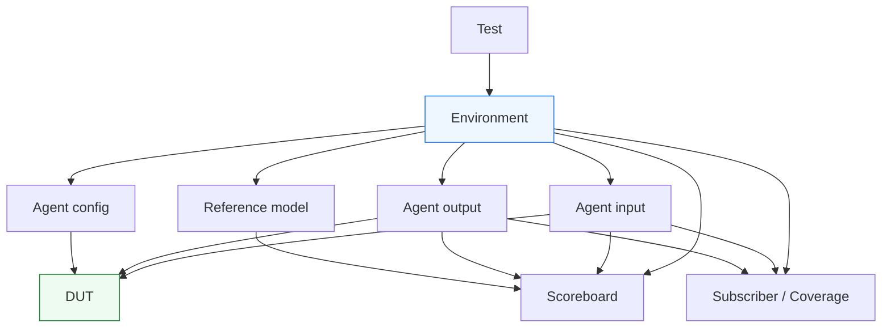
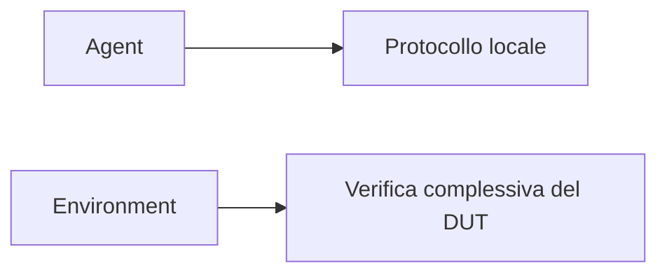

# `environment` in UVM

Dopo aver introdotto **agent**, **virtual interface** e **connessioni TLM**, il passo successivo naturale è affrontare il componente che mette insieme questi elementi in una struttura complessiva coerente: l’**`environment`**.

L’environment è uno dei blocchi più importanti di UVM, perché rappresenta il livello in cui la verifica smette di essere “locale a una singola interfaccia” e diventa una vista più completa del DUT. Se l’agent è l’unità di verifica di protocollo o di canale, l’environment è il contenitore che integra:
- più agent;
- scoreboard;
- subscriber e coverage;
- eventuali reference model o predictor;
- checker aggiuntivi;
- connessioni tra i componenti.

Dal punto di vista metodologico, l’environment è molto importante perché rende esplicita una distinzione fondamentale:
- il **protocollo locale** vive nell’agent;
- la **verifica complessiva del DUT** vive nell’environment.

Questo significa che l’environment non è un semplice contenitore “di livello superiore”, ma il punto in cui la struttura del testbench viene organizzata in modo coerente con la struttura e con i bisogni reali del DUT.

Questa pagina introduce l’environment con un taglio coerente con il resto della sezione UVM:
- didattico ma tecnico;
- attento al suo ruolo architetturale;
- centrato sull’integrazione tra componenti;
- orientato a mostrare come si passa dalla verifica locale di interfaccia alla verifica complessiva del blocco o sottosistema.

## 1. Che cos’è un `environment`

L’`environment`, spesso abbreviato in `env`, è il componente UVM che integra i blocchi principali della verifica per un certo DUT o sottosistema.

### 1.1 Significato essenziale
L’environment ospita:
- agent relativi alle interfacce del DUT;
- scoreboard per il checking;
- subscriber per coverage e analisi;
- eventuali reference model;
- altri componenti di supporto alla verifica.

### 1.2 Livello architetturale
Se l’agent rappresenta una interfaccia, l’environment rappresenta la **vista complessiva della verifica del DUT**.

### 1.3 Perché è importante
L’environment rende il testbench più leggibile perché separa:
- il livello delle interfacce;
- il livello dell’integrazione della verifica.

## 2. Perché serve un `environment`

La prima domanda utile è: perché UVM non lascia che il test contenga direttamente tutti gli agent e tutti i componenti?

### 2.1 Il problema di un test troppo carico
Se il `test` diventasse il luogo in cui si istanziano direttamente:
- agent;
- scoreboard;
- subscriber;
- monitor aggiuntivi;
- reference model;

allora finirebbe per mescolare:
- configurazione dello scenario;
- struttura stabile dell’ambiente;
- dettagli di integrazione del testbench;
- logica di verifica complessiva.

### 2.2 La risposta UVM
UVM introduce l’environment per separare:
- **il test**, che sceglie e configura lo scenario;
- **l’environment**, che rappresenta l’infrastruttura stabile della verifica.

### 2.3 Beneficio metodologico
Questo migliora:
- modularità;
- riuso;
- leggibilità;
- estendibilità del testbench;
- chiarezza del ruolo del test.

## 3. Environment come contenitore della verifica del DUT

Uno dei modi migliori per capire l’environment è vederlo come la rappresentazione della **strategia complessiva di verifica** del DUT.

### 3.1 Che cosa integra
L’environment mette insieme:
- chi stimola;
- chi osserva;
- chi confronta;
- chi raccoglie coverage;
- chi modella il comportamento atteso.

### 3.2 Che cosa non dovrebbe fare
Non dovrebbe diventare:
- il luogo del traffico a basso livello del protocollo;
- il posto dove si descrive manualmente ogni caso di test;
- un contenitore disordinato di logica locale degli agent.

### 3.3 Livello corretto
Il suo livello corretto è quello dell’integrazione architetturale del testbench.

## 4. Agent ed environment: differenza concettuale

Distinguere bene `agent` ed `environment` è essenziale.

### 4.1 Agent
L’agent è l’unità locale di verifica di una interfaccia o protocollo.

### 4.2 Environment
L’environment è il contenitore che integra:
- più agent;
- i componenti che usano le loro informazioni;
- le strutture di checking e coverage di livello più alto.

### 4.3 Perché la distinzione conta
Questa distinzione evita di:
- mettere troppo checking negli agent;
- rendere l’ambiente troppo dipendente da una sola interfaccia;
- perdere la visione complessiva del DUT.

## 5. Componenti tipici di un `environment`

Un environment può contenere combinazioni diverse di componenti, ma alcune strutture sono molto comuni.

### 5.1 Uno o più agent
Per ogni interfaccia significativa del DUT può esserci un agent dedicato.

### 5.2 Scoreboard
Per confrontare atteso e osservato.

### 5.3 Subscriber / coverage
Per raccogliere coverage, statistiche e analisi.

### 5.4 Reference model o predictor
Per produrre il comportamento atteso o aiutare il confronto.

### 5.5 Checker aggiuntivi
Per controlli specifici di sistema o integrazione.

### 5.6 Sotto-environment
In ambienti più grandi, possono esistere sub-env che organizzano parti del DUT o del subsystem.

## 6. Environment e DUT con una sola interfaccia

Anche in casi semplici l’environment mantiene un suo valore.

### 6.1 DUT piccolo
Se il DUT ha una sola interfaccia, si può avere:
- un solo agent;
- uno scoreboard semplice;
- subscriber minimi.

### 6.2 Perché l’environment è comunque utile
Anche in questo caso:
- separa il test dall’infrastruttura;
- prepara il testbench al riuso;
- mantiene la coerenza con la struttura UVM;
- facilita l’evoluzione futura del banco di prova.

### 6.3 Visione corretta
L’environment non serve solo quando il DUT è enorme. Serve anche a dare una struttura chiara fin dall’inizio.

## 7. Environment e DUT con più interfacce

Il valore dell’environment cresce molto quando il DUT ha più interfacce.

### 7.1 Esempi tipici
Per esempio:
- ingresso dati;
- uscita dati;
- canale di configurazione;
- canale di stato;
- request/response separati;
- linee di controllo dedicate.

### 7.2 Ruolo dell’environment
L’environment integra i relativi agent e coordina i componenti che devono usare i dati provenienti da più flussi.

### 7.3 Beneficio architetturale
Questo permette di costruire un testbench che rispecchi la struttura reale del DUT.

## 8. Environment e scoreboard

Lo scoreboard trova il suo posto naturale dentro l’environment.

### 8.1 Perché è lì
Lo scoreboard spesso ha bisogno di ricevere dati da:
- più monitor;
- più agent;
- eventuali reference model;
- più canali di osservazione.

### 8.2 Perché non metterlo nell’agent
Lo scoreboard non appartiene al protocollo locale di una sola interfaccia, ma al confronto complessivo del comportamento del DUT.

### 8.3 Conseguenza metodologica
Questo rende lo scoreboard un componente naturalmente “di environment”.

## 9. Environment e coverage

Anche subscriber e coverage collector vivono spesso nell’environment.

### 9.1 Coverage locale e coverage globale
Una parte della coverage può essere locale all’agent, ma molta coverage interessante è di livello più alto:
- interazione tra canali;
- combinazioni di eventi;
- rapporto tra input e output;
- casi di sistema;
- sequenze multi-agent.

### 9.2 Perché l’environment è il posto giusto
È il livello in cui si vedono contemporaneamente:
- più agent;
- più flussi osservati;
- più sorgenti di eventi.

### 9.3 Beneficio
La coverage globale del DUT può così essere costruita in modo più naturale.

## 10. Environment e reference model

Molti ambienti UVM seri includono un reference model o un predictor.

### 10.1 Perché serve
Serve a produrre o derivare il comportamento atteso del DUT.

### 10.2 Perché sta nell’environment
Il reference model spesso utilizza:
- input osservati;
- configurazione del DUT;
- più flussi di dati;
- relazioni di sistema.

Per questo il suo posto naturale è vicino allo scoreboard, cioè nell’environment.

### 10.3 Beneficio
Questo mantiene separati:
- protocollo locale degli agent;
- comportamento atteso del sistema verificato.

## 11. Environment e connessioni TLM

L’environment è il luogo in cui si materializzano molte delle connessioni TLM del testbench.

### 11.1 Flussi tipici
Per esempio:
- monitor di un agent → scoreboard;
- monitor di un agent → coverage subscriber;
- reference model → scoreboard;
- monitor multipli → checker globale.

### 11.2 Perché è importante
L’environment non è solo una gerarchia di contenimento, ma anche un nodo di organizzazione del flusso informativo.

### 11.3 Visione corretta
Per leggere un environment bisogna capire:
- chi contiene chi;
- chi invia cosa a chi.

## 12. Environment e configurazione

L’environment è uno dei luoghi principali in cui la configurazione del testbench si applica in modo concreto.

### 12.1 Esempi di configurazione
Si può decidere:
- quali agent sono attivi o passivi;
- quali componenti di coverage abilitare;
- quali scoreboards usare;
- quali checker rendere operativi;
- quali reference model inserire;
- quanti canali o sottocomponenti includere.

### 12.2 Perché è utile
Questo permette di adattare la stessa struttura base a:
- smoke test;
- regressione;
- debug approfondito;
- scenari di subsystem;
- configurazioni diverse del DUT.

### 12.3 Legame con la factory
In ambienti più ricchi, anche la factory può intervenire per sostituire componenti dentro l’environment in modo controllato.

## 13. Environment e phasing

L’environment vive pienamente dentro il phasing UVM.

### 13.1 Build
Crea agent, scoreboard, subscriber e altri componenti.

### 13.2 Connect
Collega i flussi tra monitor, scoreboard, coverage e model.

### 13.3 Run
Durante la run phase, l’environment ospita il funzionamento dinamico dell’intero banco di prova.

### 13.4 Check e report
Contribuisce alla chiusura ordinata della verifica.

### 13.5 Perché è importante
L’environment è uno dei componenti in cui il phasing si vede con maggiore chiarezza, perché passa da contenitore strutturale a nodo operativo dell’intera verifica.

## 14. Environment e test

Il rapporto tra test ed environment è uno dei punti più importanti da capire.

### 14.1 Il test non è l’environment
Il test:
- seleziona lo scenario;
- configura l’ambiente;
- sceglie quali sequence lanciare.

### 14.2 L’environment non è il test
L’environment:
- costruisce la struttura della verifica;
- integra i componenti;
- offre il “terreno operativo” su cui il test agisce.

### 14.3 Perché questa distinzione è utile
Così il testbench resta molto più pulito:
- il test decide;
- l’environment realizza l’infrastruttura.

## 15. Environment e block-level / subsystem-level

L’environment è uno dei componenti che meglio mostra la scalabilità di UVM.

### 15.1 Block-level
Può essere relativamente semplice:
- pochi agent;
- uno scoreboard;
- coverage essenziale.

### 15.2 Subsystem-level
Può diventare più ricco:
- più agent;
- più scoreboard;
- più subscriber;
- sotto-environment;
- flussi multipli di checking e coverage.

### 15.3 Perché è importante
L’environment è il livello naturale in cui il testbench scala dal blocco al sottosistema.

## 16. Environment e riuso

Il riuso è uno dei grandi vantaggi dell’environment.

### 16.1 Riuso della struttura
Una volta definito un buon environment, si possono cambiare:
- test;
- sequence;
- configurazioni;
- modalità degli agent;
- componenti specializzati.

### 16.2 Stabilità dell’infrastruttura
L’environment funge da struttura stabile, sopra cui la verifica può evolvere senza essere continuamente ricostruita.

### 16.3 Beneficio pratico
Questo è molto utile in regressione, manutenzione e crescita del progetto.

## 17. Environment e debug

Anche dal punto di vista del debug l’environment è molto importante.

### 17.1 Perché aiuta
Fornisce una vista ordinata di:
- quali agent sono presenti;
- quali componenti analitici sono attivi;
- come sono connessi monitor, scoreboard e subscriber;
- dove può essersi interrotto il flusso informativo.

### 17.2 Livello di diagnosi
Se il problema non è in un singolo protocollo ma nella relazione tra componenti, l’environment è spesso il primo posto da guardare.

### 17.3 Effetto metodologico
Un environment ben progettato rende i problemi di integrazione molto più leggibili.

## 18. Errori comuni

Alcuni errori ricorrono spesso nella progettazione dell’environment.

### 18.1 Usarlo come contenitore generico senza struttura
Questo lo rende poco leggibile e poco manutenibile.

### 18.2 Mettere troppo scenario nell’environment
Scenario e orchestrazione restano responsabilità di test e sequence.

### 18.3 Fare troppo checking locale negli agent
Così si perde la distinzione tra verifica di protocollo locale e verifica complessiva del DUT.

### 18.4 Non riflettere la struttura reale del DUT
Un environment poco allineato al design rende più difficile debug e coverage.

### 18.5 Non pensarlo per il riuso
Se è troppo rigido o troppo legato a un singolo test, perde gran parte del suo valore.

## 19. Buone pratiche di modellazione

Per progettare bene un environment UVM, alcune linee guida sono particolarmente utili.

### 19.1 Pensarlo come vista della verifica del DUT
L’environment dovrebbe riflettere i bisogni reali della verifica complessiva del blocco.

### 19.2 Mantenere separati agent e checking globale
Gli agent servono il protocollo locale; scoreboard e coverage globale vivono a livello environment.

### 19.3 Curare le connessioni TLM
L’environment dovrebbe rendere chiaro il flusso delle informazioni osservate e attese.

### 19.4 Tenerlo configurabile
La stessa struttura dovrebbe poter supportare:
- test diversi;
- agent attivi o passivi;
- modalità di debug o regressione;
- scenari più o meno ricchi.

### 19.5 Progettarlo per crescere
Un buon environment dovrebbe poter evolvere da block-level a scenari più ricchi senza perdere chiarezza.

## 20. Collegamento con il resto della sezione

Questa pagina si collega direttamente a:
- **`agent.md`**, che fornisce i mattoni locali del protocollo;
- **`tlm-connections.md`**, che ha mostrato il flusso dei dati tra componenti;
- **`scoreboard.md`**, **`reference-model.md`** e **`subscriber.md`**, che trovano qui il loro contenitore naturale;
- **`uvm-phasing.md`**, perché l’environment vive pienamente nelle fasi di costruzione, connessione ed esecuzione;
- **`uvm-factory-config.md`**, perché è uno dei principali luoghi di configurazione e riuso dell’ambiente.

Prepara inoltre in modo naturale le pagine successive:
- **`scoreboard.md`**
- **`reference-model.md`**
- **`subscriber.md`**
- **`test.md`**

perché chiarisce la relazione tra infrastruttura stabile della verifica e scenario di test.

## 21. In sintesi

L’`environment` è il componente UVM che integra i blocchi principali della verifica del DUT:
- agent;
- scoreboard;
- subscriber e coverage;
- reference model;
- connessioni TLM;
- eventuali checker aggiuntivi.

Il suo valore non è solo organizzativo: l’environment rappresenta la vista complessiva della strategia di verifica del DUT, mantenendo separati il livello locale delle interfacce e il livello globale del checking e della coverage.

Capire l’environment significa capire il punto in cui il testbench UVM passa da collezione di componenti a vera architettura di verifica integrata.

## Prossimo passo

Il passo più naturale ora è **`scoreboard.md`**, perché dopo aver chiarito il contenitore globale conviene entrare nel componente che svolge uno dei ruoli più centrali del checking:
- confronto tra atteso e osservato
- integrazione con monitor e reference model
- ruolo nello yielding del verdetto funzionale della verifica
