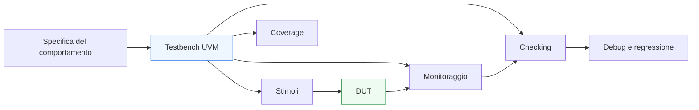

# UVM

La **Universal Verification Methodology (UVM)** è una metodologia standard per costruire ambienti di verifica riusabili, scalabili e strutturati, ampiamente usata nella verifica di design digitali complessi. In un flusso moderno di progettazione, UVM rappresenta uno dei punti di incontro più importanti tra:
- specifica funzionale;
- verifica RTL;
- architettura del testbench;
- riuso di componenti;
- regressione;
- coverage;
- debug sistematico.

Dal punto di vista pratico, UVM non è soltanto una libreria di classi SystemVerilog. È soprattutto un modo di organizzare la verifica in blocchi con ruoli chiari, interazioni ben definite e forte attenzione alla separazione tra:
- generazione degli stimoli;
- osservazione del DUT;
- checking;
- raccolta di coverage;
- configurazione dell’ambiente;
- riuso tra test e sottosistemi.

Questa sezione introduce UVM con un taglio coerente con il resto della documentazione:
- didattico ma tecnico;
- ordinato e progressivo;
- adatto a un contesto universitario/professionale introduttivo ma serio;
- orientato alla comprensione metodologica, non a un uso meccanico del framework.

L’obiettivo non è trattare UVM come un insieme di macro o convenzioni da memorizzare, ma come un’architettura di verifica che aiuta a passare da testbench semplici e locali a ambienti più robusti, modulari e manutenibili.

## 1. Perché una sezione UVM

Dopo aver costruito la sezione **SystemVerilog**, il passo naturale sul lato verifica è affrontare UVM. Questo perché molti dei temi già introdotti trovano in UVM una forma più strutturata e scalabile:
- testbench;
- assertion;
- coverage;
- gestione di protocolli;
- verifica di interfacce;
- regressione;
- organizzazione gerarchica dell’ambiente di verifica.

### 1.1 Continuità con SystemVerilog
UVM si basa su SystemVerilog, ma non coincide con “saper usare classi”. Richiede di capire:
- ruoli dei componenti;
- flusso delle transazioni;
- separazione tra generazione e osservazione;
- configurazione dell’ambiente;
- meccanismi di comunicazione tra componenti;
- strategia di riuso e scalabilità.

### 1.2 Perché è importante in pratica
UVM è particolarmente rilevante quando:
- il DUT cresce in complessità;
- esistono più interfacce o protocolli;
- servono test multipli con configurazioni diverse;
- si vuole riusare il testbench tra blocchi simili;
- la verifica deve supportare regressione e coverage in modo ordinato.

### 1.3 Obiettivo della sezione
Questa sezione vuole costruire una comprensione progressiva di UVM, non solo descrivere i nomi dei componenti. Per questo metterà sempre in evidenza il legame tra:
- architettura del DUT;
- struttura del testbench;
- stimolo transazionale;
- osservabilità;
- checking;
- coverage;
- debug.

## 2. Che cosa è UVM

UVM è una metodologia standardizzata per la verifica funzionale, costruita sopra SystemVerilog, pensata per favorire:
- modularità;
- riuso;
- configurabilità;
- gerarchia strutturata del testbench;
- separazione chiara dei ruoli.

### 2.1 Non solo libreria, ma metodologia
UVM fornisce:
- classi base;
- convenzioni;
- meccanismi di factory e configurazione;
- canali di comunicazione;
- pattern architetturali per il testbench.

Il suo vero valore, però, sta nel modo in cui aiuta a organizzare l’ambiente di verifica.

### 2.2 Visione concettuale
In un ambiente UVM, il testbench non è più un singolo blocco che applica stimoli e controlla uscite, ma una struttura composta da elementi distinti, per esempio:
- sequenze che descrivono lo stimolo;
- driver che convertono transazioni in segnali;
- monitor che osservano le interfacce;
- scoreboard che confrontano atteso e osservato;
- agent che raggruppano componenti relativi a una certa interfaccia;
- environment che integra più agent e checker;
- test che configurano e orchestrano lo scenario.

### 2.3 Perché questo approccio è utile
Questo modello aiuta a:
- cambiare facilmente i test senza riscrivere il testbench;
- riusare agent e componenti su più DUT o configurazioni;
- separare meglio generazione degli stimoli e checking;
- rendere più leggibile il flusso della verifica.

## 3. Che cosa tratterà questa sezione

La sezione UVM sarà costruita una pagina alla volta, con progressione coerente. I temi naturali da sviluppare includono:

### 3.1 Fondamenti metodologici
- che cos’è UVM
- perché usarlo
- differenza tra testbench RTL semplice e ambiente UVM
- ruolo della verifica transazionale

### 3.2 Struttura del testbench UVM
- test
- environment
- agent
- driver
- sequencer
- monitor
- scoreboard
- subscriber e coverage

### 3.3 Flusso delle transazioni
- sequence item
- sequenze
- relazione tra transazione e segnale
- collegamento tra driver, monitor e interfacce

### 3.4 Configurazione e riuso
- configurazione dell’ambiente
- factory
- override
- riuso di componenti
- adattabilità del testbench

### 3.5 Fasi UVM
- build
- connect
- run
- report
- significato metodologico delle fasi

### 3.6 Checking, coverage e debug
- scoreboard
- checker
- coverage funzionale
- logging
- messaggi UVM
- regressione

### 3.7 Collegamento con il DUT reale
- protocolli di interfaccia
- reset
- latenza
- pipeline
- backpressure
- verifica di FSM e datapath tramite approccio UVM

## 4. Come leggere UVM nel contesto del corso

Per chi arriva da una base RTL/SystemVerilog, UVM può sembrare inizialmente più “software-oriented” per via dell’uso di classi, gerarchia e configurazione. In realtà, il suo senso si capisce meglio se lo si legge come un modo per modellare la **strategia di verifica** del design hardware.

### 4.1 Il DUT resta hardware
Il DUT continua a essere:
- RTL;
- interfacce a segnali;
- timing legato al clock;
- handshake, pipeline, stato, reset.

### 4.2 UVM organizza il lato verifica
UVM si occupa di:
- descrivere gli scenari di prova;
- trasformare transazioni in attività sulle interfacce;
- osservare il comportamento;
- confrontare atteso e osservato;
- raccogliere informazione diagnostica e coverage.

### 4.3 UVM come ponte di astrazione
In questo senso, UVM sta tra:
- livello di protocollo e transazione;
- livello di segnale e clock;
- livello di scenario di test e verifica strutturata.

## 5. Relazione con le altre sezioni

Questa sezione si collega naturalmente a quanto già costruito.

### 5.1 Collegamento con SystemVerilog
La sezione SystemVerilog ha introdotto:
- testbench;
- assertion;
- coverage;
- interfacce;
- reset;
- pipeline;
- handshake;
- organizzazione della RTL.

UVM si appoggia a questi concetti e li riorganizza in una metodologia più strutturata.

### 5.2 Collegamento con FPGA, ASIC e SoC
Nei flussi reali:
- su **FPGA**, ambienti di verifica UVM possono essere usati per validare blocchi e protocolli prima della prototipazione;
- su **ASIC**, UVM è spesso centrale nella verifica block-level e subsystem-level, prima di procedere verso integrazione più ampia;
- in contesti **SoC**, il riuso di agent, environment e sequenze è particolarmente importante per scalare la verifica di sottoblocchi e interconnessioni.

### 5.3 Ruolo nel percorso didattico
Questa sezione è quindi il completamento naturale del ramo verifica dopo:
- progettazione RTL;
- testbench di base;
- assertion;
- coverage;
- flusso di simulazione.

## 6. In sintesi

UVM è una metodologia di verifica costruita sopra SystemVerilog che permette di organizzare il testbench in modo più modulare, riusabile e scalabile. Il suo valore non sta solo nei componenti che mette a disposizione, ma nella disciplina con cui separa:
- generazione degli stimoli;
- osservazione del DUT;
- checking;
- coverage;
- configurazione;
- regressione.

Capire UVM significa quindi capire come la verifica evolva da banco di prova locale e monolitico a infrastruttura progettata in modo serio, adatta a blocchi più complessi e a flussi professionali.

Questa sezione affronterà UVM con progressione ordinata, collegando sempre:
- concetti metodologici;
- struttura dei componenti;
- significato architetturale del DUT;
- verificabilità reale di protocolli, pipeline, reset e controllo.

## Prossimo passo

Il passo più naturale ora è **`uvm-overview.md`**, per chiarire in modo diretto:
- che cos’è UVM
- quando conviene usarlo
- che problema risolve rispetto a un testbench SystemVerilog semplice
- quali sono i suoi blocchi principali
- come si legge la sua architettura prima di entrare nei singoli componenti
