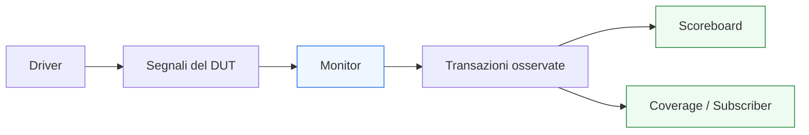
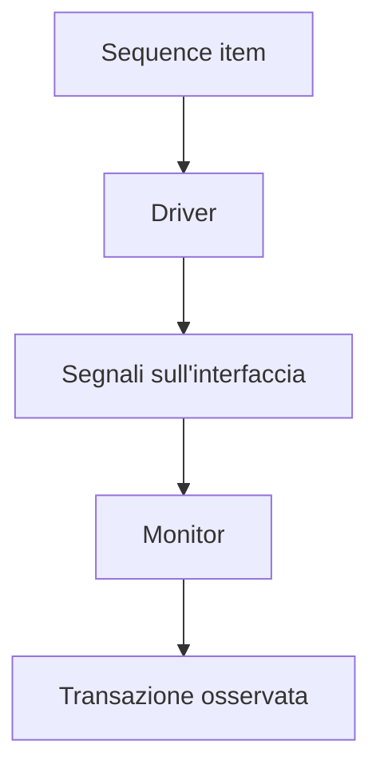

# `monitor` in UVM

Dopo aver introdotto il **`driver`** come componente che traduce la transazione in segnali del DUT, il passo successivo naturale è affrontare il suo complemento metodologico: il **`monitor`**.

Il monitor è uno dei componenti più importanti di un testbench UVM, perché rappresenta il lato **osservativo** dell’interfaccia. Se il driver è il punto in cui il testbench cerca di applicare uno stimolo, il monitor è il punto in cui il testbench osserva ciò che è **realmente accaduto** sui segnali del DUT.

Questa distinzione è fondamentale nella verifica seria. In un ambiente di test non strutturato, si rischia facilmente di assumere che:
- ciò che si è tentato di inviare sia ciò che il DUT abbia ricevuto;
- ciò che il driver ha guidato sia automaticamente il comportamento vero dell’interfaccia;
- ciò che ci si aspettava di osservare coincida con ciò che è stato effettivamente trasferito.

UVM evita questa semplificazione separando chiaramente:
- chi guida i segnali;
- chi osserva i segnali;
- chi ricostruisce le transazioni;
- chi confronta atteso e osservato.

Dal punto di vista metodologico, il monitor è quindi essenziale perché:
- osserva il comportamento reale del DUT;
- ricostruisce transazioni a partire dai segnali;
- fornisce dati a scoreboard e coverage;
- supporta il debug;
- rende il checking più indipendente e affidabile.

Questa pagina introduce il monitor in modo coerente con il resto della sezione UVM:
- con taglio didattico ma tecnico;
- centrato sul suo ruolo architetturale nella verifica;
- attento al rapporto tra protocollo, osservazione e checking;
- orientato a far capire perché il monitor non è un “accessorio”, ma uno dei pilastri della robustezza del testbench.

## 1. Che cos’è un `monitor`

Il `monitor` è il componente UVM che osserva i segnali di una interfaccia del DUT e ricostruisce, a partire da questi segnali, le transazioni o gli eventi di protocollo che si sono realmente verificati.

### 1.1 Significato essenziale
Il monitor:
- non guida l’interfaccia;
- non decide lo scenario di test;
- non genera direttamente stimolo;
- osserva i segnali;
- interpreta il protocollo;
- ricostruisce transazioni coerenti con ciò che è accaduto;
- inoltra queste informazioni ai componenti che ne hanno bisogno.

### 1.2 Livello di astrazione
Il monitor si trova in una posizione simmetrica ma opposta rispetto al driver:
- il driver va da transazione a segnali;
- il monitor va da segnali a transazione osservata.

### 1.3 Perché questo ruolo è importante
È il componente che permette alla verifica di basarsi su una osservazione indipendente del DUT, non solo sull’intenzione del testbench.

## 2. Perché serve un `monitor`

La prima domanda fondamentale è: se il driver sa già quali transazioni sono state inviate, perché introdurre anche un monitor?

### 2.1 Il problema della fiducia cieca nello stimolo
Il fatto che il driver abbia cercato di applicare un certo item non garantisce automaticamente che:
- il DUT l’abbia accettato davvero;
- il protocollo si sia completato correttamente;
- il trasferimento sia avvenuto nel ciclo previsto;
- il valore osservabile sull’interfaccia corrisponda a quello atteso;
- non ci siano stati stall, reset, backpressure o altre condizioni che abbiano modificato il comportamento.

### 2.2 La risposta metodologica
Il monitor osserva l’interfaccia dall’esterno e ricostruisce in modo indipendente ciò che è realmente successo.

### 2.3 Beneficio progettuale
Questo rende il testbench:
- più robusto;
- più diagnostico;
- meno accoppiato al lato attivo dello stimolo;
- più adatto a checking e coverage affidabili.

## 3. Il `monitor` come osservatore indipendente

Uno dei concetti più importanti da fissare è l’indipendenza del monitor.

### 3.1 Perché l’indipendenza è importante
Un monitor utile deve osservare il DUT senza dipendere dal driver come fonte primaria della verità.

### 3.2 Che cosa osserva
Osserva:
- livelli dei segnali;
- handshake;
- eventi di protocollo;
- condizioni di validità;
- completamento di trasferimenti;
- tempi e relazioni tra segnali.

### 3.3 Che cosa non dovrebbe fare
Non dovrebbe:
- guidare i segnali;
- correggere il comportamento dell’interfaccia;
- sostituirsi al driver;
- assumere automaticamente che ogni item del driver sia diventato una transazione valida.

## 4. Dal segnale alla transazione osservata

Il modo più utile di leggere il monitor è come blocco che esegue la trasformazione inversa del driver.

### 4.1 Il driver
Prende un `sequence item` e lo traduce in segnali.

### 4.2 Il monitor
Osserva i segnali e ricostruisce una transazione osservata.

### 4.3 Perché questa dualità è preziosa
Grazie a questa simmetria:
- il testbench può confrontare atteso e osservato;
- il protocollo viene verificato in modo più realistico;
- coverage e logging lavorano su oggetti transazionali leggibili;
- il debug può distinguere meglio i livelli del problema.

## 5. Che cosa osserva il monitor

Il monitor osserva tutto ciò che è rilevante per il protocollo e per il significato della transazione.

### 5.1 Segnali dati
Per esempio:
- payload;
- bus dati;
- indirizzi;
- codici operazione;
- tag;
- metadati.

### 5.2 Segnali di controllo
Per esempio:
- `valid`
- `ready`
- `start`
- `done`
- enable
- flag di errore
- segnalazioni di completamento

### 5.3 Relazioni temporali
Il monitor deve anche capire:
- quando un trasferimento è effettivamente avvenuto;
- in quale ciclo;
- in quali condizioni;
- con quale sequenza di handshake;
- se ci sono stall, pause o interruzioni.

## 6. Monitor e protocollo

Il monitor è, insieme al driver, uno dei componenti che più devono conoscere il protocollo dell’interfaccia.

### 6.1 Differenza rispetto al driver
Il driver conosce il protocollo per guidarlo.  
Il monitor conosce il protocollo per interpretarlo.

### 6.2 Perché è importante
Un monitor ben progettato deve sapere:
- quando una transazione può considerarsi valida;
- quali segnali vanno campionati insieme;
- quali condizioni segnano l’inizio o la fine di una operazione;
- come distinguere un trasferimento completato da un tentativo non accettato.

### 6.3 Conseguenza progettuale
Il monitor è un componente fortemente dipendente dal protocollo, ma indipendente dallo scenario specifico del test.

## 7. Monitor e clock

Il monitor, come il driver, è strettamente legato al tempo di simulazione.

### 7.1 Perché il clock è centrale
Molti protocolli sono sincronizzati al clock, quindi il monitor deve osservare:
- eventi significativi ai fronti giusti;
- relazioni temporali tra cicli;
- validità dei segnali nel momento corretto;
- completamento delle operazioni in rapporto al timing del DUT.

### 7.2 Monitor e campionamento corretto
Se il monitor osserva il protocollo nel momento sbagliato, può:
- ricostruire male la transazione;
- perdere eventi;
- interpretare segnali instabili;
- introdurre errori di checking o coverage.

### 7.3 Significato metodologico
Il monitor è uno dei punti in cui il testbench deve essere più rigoroso nella lettura del comportamento temporale reale del DUT.

## 8. Monitor e reset

Anche il reset ha un ruolo molto importante nel comportamento del monitor.

### 8.1 Perché conta
Durante reset o subito dopo il suo rilascio, il significato dei segnali può essere diverso:
- certi valori non sono validi;
- l’interfaccia può trovarsi in stato inattivo;
- certi handshake non devono essere interpretati come trasferimenti veri;
- il DUT può stare ancora entrando in una condizione operativa coerente.

### 8.2 Responsabilità del monitor
Il monitor deve sapere:
- quando il protocollo è da considerare attivo;
- quando ignorare attività spurie o non significative;
- come trattare i segnali durante e subito dopo il reset.

### 8.3 Perché è importante
Un monitor che non rispetta la semantica del reset può introdurre:
- false transazioni;
- errori di coverage;
- mismatch artificiali nello scoreboard;
- debug molto più difficile.

## 9. Monitor e handshake

Nei protocolli con handshake, il monitor svolge un ruolo particolarmente importante.

### 9.1 Esempio `valid/ready`
Il monitor deve sapere che un trasferimento è avvenuto solo quando:
- il dato è valido;
- il ricevente è pronto;
- il contratto del protocollo considera completata la transazione.

### 9.2 Esempio `start/done`
Deve poter distinguere:
- avvio dell’operazione;
- stato intermedio;
- completamento reale.

### 9.3 Backpressure e stall
Il monitor deve anche riconoscere:
- dati presentati ma non ancora accettati;
- transazioni ferme in attesa;
- momenti in cui il protocollo non conclude il trasferimento.

### 9.4 Perché è cruciale
Molti bug di interfaccia emergono proprio qui, e il monitor è uno dei primi componenti in grado di renderli visibili in modo strutturato.

## 10. Monitor e DUT con pipeline o latenza

In DUT più complessi, il monitor è ancora più importante.

### 10.1 Latenza
Il monitor non decide la latenza, ma è spesso la fonte primaria per sapere:
- quando un output è realmente diventato valido;
- in quale sequenza di cicli è avvenuto un certo evento;
- come si è comportata l’interfaccia nel tempo.

### 10.2 Pipeline
Per DUT pipelined, il monitor aiuta a osservare:
- ritmo del traffico;
- continuità del protocollo;
- eventuali stall;
- burst di trasferimenti;
- comportamento di input e output sotto carico.

### 10.3 Ruolo nel checking temporale
Lo scoreboard e la coverage possono usare l’osservazione del monitor per ragionare in termini di:
- latenza;
- throughput;
- eventi completati;
- ordine delle transazioni.

## 11. Monitor e scoreboard

Il monitor è uno dei principali fornitori di informazione per lo scoreboard.

### 11.1 Che cosa invia
Tipicamente invia:
- transazioni osservate;
- pacchetti ricostruiti;
- eventi di protocollo;
- informazioni già organizzate a livello transazionale.

### 11.2 Perché lo scoreboard ne ha bisogno
Lo scoreboard confronta:
- atteso;
- osservato.

La parte “osservata” deve essere costruita in modo credibile, e il monitor è il componente più naturale per farlo.

### 11.3 Vantaggio
Il monitor permette di mantenere indipendente la sorgente del comportamento osservato rispetto a chi ha generato lo stimolo.

## 12. Monitor e coverage

La coverage in UVM si appoggia molto spesso al monitor.

### 12.1 Perché è naturale
La coverage dovrebbe basarsi su ciò che è stato davvero osservato, non solo su ciò che il testbench ha provato a inviare.

### 12.2 Casi tipici
Il monitor può alimentare coverage su:
- tipi di transazione;
- combinazioni di campi;
- pattern di protocollo;
- burst;
- backpressure;
- reset;
- sequenze di eventi.

### 12.3 Beneficio
Questo rende la coverage più affidabile e più vicina al comportamento reale del DUT.

## 13. Monitor e debug

Il monitor è uno degli strumenti più preziosi nel debug.

### 13.1 Che cosa aiuta a capire
Permette di capire:
- che cosa è stato realmente trasferito;
- quando;
- con quale handshake;
- con quali valori;
- in quale ordine;
- se il DUT ha visto davvero il traffico previsto.

### 13.2 Distinguere i livelli del bug
Aiuta a separare:
- bug nella sequence;
- bug nel driver;
- bug del DUT;
- bug nel protocollo;
- bug nello scoreboard o nella coverage.

### 13.3 Effetto metodologico
Un monitor ben fatto rende la diagnosi dei fallimenti molto più rapida e meno ambigua.

## 14. Monitor e agent passivi

Il ruolo del monitor diventa particolarmente chiaro negli agent passivi.

### 14.1 Agent passivo
Un agent passivo osserva una interfaccia senza pilotarla.

### 14.2 Perché il monitor è centrale
In questo caso il monitor è il componente principale dell’agent, perché l’obiettivo dell’agent è:
- osservare;
- ricostruire;
- inviare informazione a scoreboard, coverage o checker.

### 14.3 Valore nel riuso
Questo rende il monitor particolarmente riusabile in:
- ambienti più grandi;
- verifiche di subsystem;
- situazioni in cui il DUT o un altro blocco guida già l’interfaccia.

## 15. Monitor e riuso

Anche il monitor, come il driver, è un punto forte del riuso UVM.

### 15.1 Riuso del protocollo osservato
Se il monitor è ben progettato, può essere riusato in molti scenari che condividono lo stesso protocollo.

### 15.2 Riuso in test diversi
Può servire:
- in test nominali;
- in corner case;
- in regressione;
- in ambienti più grandi;
- in modalità attiva o passiva dell’agent.

### 15.3 Condizione per il riuso
Per essere davvero riusabile, il monitor deve restare:
- indipendente dallo scenario di test;
- focalizzato sul protocollo;
- ben separato da checking troppo specifici.

## 16. Errori comuni

Alcuni errori ricorrono spesso nella progettazione o nell’uso del monitor.

### 16.1 Usarlo come estensione del driver
Questo riduce l’indipendenza dell’osservazione e peggiora il checking.

### 16.2 Fare troppo checking nel monitor
Il monitor dovrebbe principalmente osservare e ricostruire. Se assorbe troppo checking funzionale, diventa meno riusabile.

### 16.3 Ignorare reset e timing
Un monitor che non tiene conto di questi aspetti rischia di ricostruire transazioni false.

### 16.4 Campionare i segnali in modo scorretto
Questo porta a oggetti osservati incoerenti e rende poco affidabili scoreboard e coverage.

### 16.5 Accoppiarlo troppo a un singolo test
Il monitor dovrebbe servire il protocollo e l’osservazione, non uno scenario di verifica troppo specifico.

## 17. Buone pratiche di modellazione

Per progettare bene un monitor UVM, alcune linee guida sono particolarmente utili.

### 17.1 Pensarlo come osservatore del protocollo
Il monitor deve essere il luogo in cui il protocollo viene interpretato dal lato osservativo.

### 17.2 Tenerlo indipendente dal driver
Questa indipendenza è uno dei pilastri della qualità del testbench.

### 17.3 Ricostruire transazioni pulite e significative
Gli oggetti prodotti dal monitor devono essere utili per:
- scoreboard;
- coverage;
- logging;
- debug.

### 17.4 Rispettare clock, reset e handshake
Questi aspetti fanno parte integrante della correttezza del monitor.

### 17.5 Progettarlo per il riuso
Un buon monitor deve poter vivere in:
- agent attivi;
- agent passivi;
- ambienti diversi;
- scenari differenti.

## 18. Collegamento con il resto della sezione

Questa pagina si collega direttamente a:
- **`driver.md`**, che rappresenta il lato attivo dell’interfaccia;
- **`sequence-item.md`**, perché il monitor ricostruisce oggetti transazionali analoghi;
- **`scoreboard.md`**, che userà l’output del monitor per il checking;
- **`subscriber.md`** e **`coverage-uvm.md`**, che useranno i dati osservati per coverage e analisi;
- **`agent.md`**, che integrerà driver, sequencer e monitor nella struttura di interfaccia.

Prepara inoltre in modo naturale le pagine successive:
- **`agent.md`**
- **`virtual-interface.md`**
- **`tlm-connections.md`**

perché il monitor è uno dei componenti che più chiaramente dipendono dalla connessione corretta al mondo RTL e dalla distribuzione ordinata dei dati osservati.

## 19. In sintesi

Il `monitor` è il componente UVM che osserva i segnali dell’interfaccia del DUT e ricostruisce le transazioni realmente avvenute. Il suo ruolo è fondamentale perché rende la verifica meno dipendente da ciò che il testbench ha provato a fare e più basata su ciò che il DUT ha effettivamente visto o prodotto.

Questo lo rende un componente chiave per:
- scoreboard;
- coverage;
- debug;
- agent passivi;
- riuso del testbench.

Capire il monitor significa capire uno dei pilastri della robustezza della verifica UVM: l’indipendenza tra stimolo e osservazione.

## Prossimo passo

Il passo più naturale ora è **`agent.md`**, perché dopo aver chiarito bene driver e monitor conviene integrarli nella struttura che li organizza insieme al sequencer:
- ruolo dell’agent
- agent attivo e passivo
- relazione con l’interfaccia del DUT
- riuso dell’agent come unità architetturale del testbench
