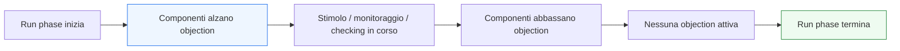

# `objections` in UVM

Dopo aver introdotto il ruolo del **`test`** e la **configurazione dei test**, il passo successivo naturale è affrontare uno dei meccanismi più caratteristici del controllo della simulazione in UVM: le **`objections`**.

Questo tema è molto importante perché, in un testbench UVM, la simulazione non è semplicemente un processo che:
- parte;
- esegue qualche riga di codice;
- termina automaticamente quando finisce una certa procedura locale.

Al contrario, l’ambiente UVM è composto da più componenti concorrenti:
- test;
- environment;
- sequence;
- driver;
- monitor;
- scoreboard;
- subscriber;
- eventuali checker o modelli di riferimento.

Quando questi componenti partecipano alla `run_phase`, si pone una domanda fondamentale:

- **quando il testbench deve considerare conclusa la simulazione attiva?**

Le objections servono proprio a rispondere a questa domanda in modo ordinato.

Dal punto di vista metodologico, le objections sono importanti perché permettono di:
- coordinare la durata della `run_phase`;
- evitare che il test termini troppo presto;
- rappresentare in modo esplicito che una certa attività è ancora in corso;
- chiudere la simulazione quando il lavoro significativo è realmente completato.

Questa pagina introduce le objections con un taglio coerente con il resto della sezione UVM:
- didattico ma tecnico;
- centrato sul loro significato architetturale e metodologico;
- attento al rapporto tra phasing, test, sequence ed esecuzione concorrente;
- orientato a far capire che le objections non sono solo un dettaglio di controllo, ma una parte importante della disciplina del testbench.

## 1. Perché servono le `objections`

La prima domanda importante è: perché UVM ha bisogno di un meccanismo esplicito per controllare la fine della `run_phase`?

### 1.1 Il problema della concorrenza
Nel testbench UVM, più componenti possono essere attivi contemporaneamente:
- il test può lanciare sequence;
- i driver possono ancora applicare traffico;
- i monitor possono ancora osservare eventi;
- lo scoreboard può ancora aspettare risultati;
- i subscriber possono ancora ricevere transazioni.

### 1.2 Il rischio senza coordinamento
Senza un meccanismo di coordinamento, la simulazione potrebbe:
- terminare troppo presto;
- ignorare attività ancora in corso;
- chiudersi prima che output o transazioni finali siano stati osservati;
- produrre risultati incompleti o fuorvianti.

### 1.3 La risposta UVM
Le objections permettono ai componenti di dichiarare in modo esplicito:
- “non ho ancora finito”
- “la run phase deve restare aperta”
- “c’è ancora lavoro significativo da completare”

## 2. Che cos’è una `objection`

Una objection è una forma di segnalazione con cui un componente UVM indica che una certa fase, tipicamente la `run_phase`, non deve ancora terminare.

### 2.1 Significato essenziale
Alzare una objection significa:
- dichiarare che un’attività rilevante è ancora in corso.

Abbassare una objection significa:
- dichiarare che quell’attività è terminata.

### 2.2 Significato operativo
Finché esistono objections attive, la fase non viene considerata conclusa.

### 2.3 Perché è importante
Questo crea un modello di sincronizzazione molto utile per ambienti concorrenti e gerarchici.

## 3. Le objections e la `run_phase`

Anche se il concetto può essere generalizzato, le objections si capiscono soprattutto in relazione alla `run_phase`.

### 3.1 Perché proprio la run phase
La `run_phase` è la fase dinamica del testbench:
- traffico;
- protocollo;
- reset;
- monitoraggio;
- checking;
- coverage;
- concorrenza tra componenti.

### 3.2 Il problema specifico
A differenza di build o connect, la run phase non è semplicemente “finita” quando termina una funzione locale. Deve tener conto dell’attività complessiva del testbench.

### 3.3 Ruolo delle objections
Le objections forniscono la regola con cui la run phase resta aperta finché c’è lavoro ancora rilevante da completare.

## 4. Alzare e abbassare una `objection`

Per capire davvero il meccanismo, conviene fissare bene questi due momenti.

### 4.1 Alzare una objection
Un componente alza una objection quando inizia un’attività che richiede che la fase resti aperta.

### 4.2 Abbassare una objection
Lo stesso componente abbassa l’objection quando quell’attività è stata completata.

### 4.3 Significato metodologico
Il meccanismo non dice “questo codice è importante in assoluto”, ma dice:
- “questa attività partecipa alla decisione su quando la fase può essere chiusa”

## 5. Objections e ciclo di vita del test

Uno dei modi più naturali per usare le objections è all’interno del test.

### 5.1 Il test come regia di alto livello
Il test spesso sa quando:
- uno scenario viene avviato;
- una sequence significativa sta partendo;
- il contesto principale del test è in corso.

### 5.2 Perché il test usa objections
Può quindi:
- alzare l’objection quando lo scenario inizia;
- abbassarla quando il lavoro del test è veramente terminato.

### 5.3 Beneficio
Questo rende molto chiaro che il test è uno dei principali controllori della durata utile della run phase.

## 6. Objections e sequence

Anche le sequence possono essere lette nel contesto delle objections, almeno concettualmente.

### 6.1 Perché è rilevante
Le sequence rappresentano spesso il cuore dello stimolo:
- traffico nominale;
- burst;
- corner case;
- scenari multi-agent;
- test di protocollo.

### 6.2 Connessione col tempo della simulazione
Se una sequence importante è ancora in corso, la simulazione non dovrebbe terminare.

### 6.3 Visione corretta
Anche quando il meccanismo concreto è controllato dal test o da livelli superiori, il senso architetturale è che le objections rappresentano la vita utile dello scenario in esecuzione.

## 7. Objections e componenti concorrenti

Uno dei motivi per cui le objections sono così utili è che UVM non è un ambiente puramente sequenziale.

### 7.1 Concorrenza del testbench
Mentre il driver guida il DUT:
- il monitor osserva;
- lo scoreboard può ancora aspettare output;
- i subscriber possono ancora raccogliere informazioni;
- un reference model può ancora produrre attesi;
- più agent possono essere attivi contemporaneamente.

### 7.2 Problema di chiusura precoce
La simulazione non dovrebbe chiudersi solo perché un pezzo del testbench ha “finito il suo blocco locale”.

### 7.3 Beneficio del meccanismo
Le objections forniscono una forma di coordinamento adatta a questa concorrenza.

## 8. Objections e phasing

Le objections non si comprendono bene se separate dal phasing UVM.

### 8.1 Build e connect
In queste fasi il problema della durata è meno critico, perché si tratta di attività di costruzione e connessione.

### 8.2 Run
Nella run phase, invece, il problema della durata è centrale.

### 8.3 Perché il legame è forte
Le objections sono uno dei modi con cui UVM rende la `run_phase`:
- esplicita;
- controllata;
- coordinata tra più componenti.

## 9. Objections e fine ordinata della simulazione

Uno degli effetti più importanti delle objections è la possibilità di una chiusura ordinata della simulazione.

### 9.1 Senza objections
La run phase potrebbe finire:
- troppo presto;
- in modo dipendente da un solo componente;
- senza attendere il completamento del traffico;
- senza lasciare al monitor il tempo di osservare gli ultimi eventi.

### 9.2 Con objections
La simulazione resta aperta finché i componenti rilevanti dichiarano di essere ancora attivi.

### 9.3 Beneficio
Questo riduce:
- test incompleti;
- mismatch apparenti dovuti a chiusura prematura;
- perdita di osservazioni importanti;
- regressioni poco affidabili.

## 10. Objections e DUT con latenza

Il valore delle objections cresce molto quando il DUT ha latenza.

### 10.1 Perché
In DUT con latenza:
- gli input possono essere già stati inviati;
- ma gli output attesi potrebbero non essere ancora comparsi;
- lo scoreboard potrebbe stare ancora aspettando il completamento della risposta.

### 10.2 Rischio senza controllo
Se la simulazione terminasse subito dopo l’invio dello stimolo:
- i risultati finali non verrebbero osservati;
- il checking sarebbe incompleto;
- la coverage potrebbe restare parziale.

### 10.3 Ruolo delle objections
Le objections aiutano a mantenere aperta la run phase finché il comportamento del DUT si è veramente manifestato.

## 11. Objections e DUT con più agent

Anche in ambienti multi-agent le objections diventano particolarmente importanti.

### 11.1 Più canali attivi
Un test può coinvolgere:
- agent di input;
- agent di output;
- agent di configurazione;
- traffici concorrenti;
- virtual sequence.

### 11.2 Perché qui servono ancora di più
La conclusione della simulazione non può essere affidata in modo ingenuo a un solo ramo del testbench.

### 11.3 Beneficio architetturale
Le objections permettono una forma di coordinamento più adatta a scenari complessi.

## 12. Objections e scoreboard

Anche se lo scoreboard non è sempre il componente che controlla direttamente la durata della fase, il suo ruolo è importante per capire il senso delle objections.

### 12.1 Il problema
Lo scoreboard può aver bisogno di tempo per:
- ricevere gli ultimi output;
- correlare osservato e atteso;
- completare il confronto;
- confermare che non mancano ancora transazioni.

### 12.2 Perché conta
La simulazione non dovrebbe chiudersi prima che la parte di checking abbia avuto il tempo di concludere in modo credibile.

### 12.3 Visione corretta
Le objections aiutano il testbench a rispettare non solo il completamento dello stimolo, ma anche il completamento dell’osservazione e del checking.

## 13. Objections e debug

Le objections aiutano anche il debug, soprattutto quando la simulazione sembra terminare “troppo presto” o “troppo tardi”.

### 13.1 Problemi tipici
Per esempio:
- il test finisce prima che il DUT produca l’output;
- la run phase non termina mai;
- uno scoreboard resta in attesa di dati mancanti;
- una sequence non viene considerata completata;
- il flusso globale della simulazione è poco chiaro.

### 13.2 Valore diagnostico
Ragionare in termini di objections aiuta a capire:
- chi sta ancora trattenendo la fase;
- chi ha concluso;
- dove il testbench considera ancora aperto il lavoro della simulazione.

### 13.3 Effetto pratico
La gestione corretta delle objections rende i problemi temporali del testbench molto più leggibili.

## 14. Objections e regressione

In regressione, la gestione delle objections è cruciale.

### 14.1 Perché
Una regressione efficace richiede test che:
- partano in modo ripetibile;
- durino quanto serve;
- non si chiudano prematuramente;
- non restino appesi senza motivo.

### 14.2 Beneficio
Le objections aiutano a rendere il comportamento temporale dei test:
- più stabile;
- più ripetibile;
- più coerente con gli obiettivi della simulazione.

### 14.3 Conseguenza
La qualità della regressione dipende anche da quanto bene il testbench sa dichiarare:
- quando è ancora vivo;
- quando ha davvero finito.

## 15. Errori comuni

Alcuni errori ricorrono spesso nell’uso delle objections.

### 15.1 Non usarle quando servono
Questo può portare a test che terminano troppo presto.

### 15.2 Usarle in modo incoerente
Per esempio:
- alzare senza abbassare;
- abbassare troppo presto;
- non riflettere il vero completamento dello scenario.

### 15.3 Trattenere la run phase senza motivo
Il testbench può restare aperto inutilmente, producendo simulazioni lunghe o apparentemente bloccate.

### 15.4 Pensare che siano un dettaglio secondario
In realtà sono parte importante del controllo ordinato della simulazione.

### 15.5 Non collegarle al comportamento del DUT
Le objections hanno valore solo se riflettono davvero il completamento dello stimolo, dell’osservazione e del checking.

## 16. Buone pratiche di modellazione

Per usare bene le objections in UVM, alcune linee guida sono particolarmente utili.

### 16.1 Pensarle come dichiarazione di lavoro in corso
Questo è il modello mentale più utile e meno fuorviante.

### 16.2 Legarle al completamento reale dello scenario
La run phase dovrebbe chiudersi quando il lavoro significativo è davvero concluso.

### 16.3 Tenerle coerenti col test e con le sequence
Il controllo della durata della simulazione deve riflettere la logica dello scenario.

### 16.4 Non abusarne
Devono servire a coordinare la fase, non a mascherare problemi di architettura del testbench.

### 16.5 Considerare anche latenza e checking finale
Il completamento dello stimolo non coincide sempre con il completamento del test.

## 17. Collegamento con il resto della sezione

Questa pagina si collega direttamente a:
- **`uvm-phasing.md`**, che ha introdotto il significato delle fasi e il ruolo della `run_phase`;
- **`test.md`**, che ha chiarito il ruolo del test come regia dello scenario;
- **`test-configuration.md`**, che ha mostrato come il test prepari l’ambiente;
- **`sequences.md`** e **`virtual-sequences.md`**, perché le objections sono strettamente legate alla durata utile dello stimolo;
- **`scoreboard.md`**, perché la chiusura del test deve rispettare anche il completamento del checking.

Prepara inoltre in modo naturale le pagine successive:
- **`reporting.md`**
- **`coverage-uvm.md`**
- **`regression.md`**

perché la qualità del reporting, della coverage e della regressione dipende molto da una gestione ordinata della durata della simulazione.

## 18. In sintesi

Le `objections` in UVM sono il meccanismo con cui i componenti del testbench dichiarano che una fase, in particolare la `run_phase`, deve restare aperta finché un’attività significativa è ancora in corso.

Il loro valore metodologico è molto forte perché permettono di:
- coordinare componenti concorrenti;
- evitare chiusure premature della simulazione;
- rispettare latenza, checking e completamento del traffico;
- rendere più ordinato e leggibile il ciclo di vita del test.

Capire bene le objections significa capire come UVM controlla in modo esplicito **quando la simulazione è davvero finita**, e non solo quando una parte locale del testbench ha smesso di eseguire codice.

## Prossimo passo

Il passo più naturale ora è **`reporting.md`**, perché dopo aver chiarito come UVM controlla la durata della simulazione conviene spiegare come comunica in modo strutturato:
- esiti del test
- messaggi informativi
- warning ed errori
- report finali e leggibilità della regressione
