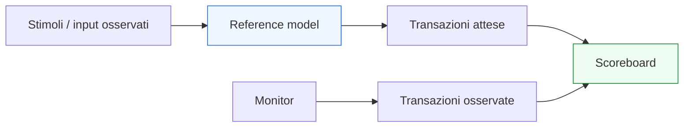

# `reference model` in UVM

Dopo aver introdotto lo **`scoreboard`**, il passo successivo naturale è affrontare il componente che più spesso fornisce il lato **atteso** del confronto funzionale: il **`reference model`**.

Se il monitor ricostruisce il comportamento realmente osservato del DUT e lo scoreboard esegue il confronto, il reference model è uno dei modi più importanti con cui il testbench costruisce una risposta alla domanda:

- che cosa avrebbe dovuto fare il DUT in questa situazione?

Dal punto di vista metodologico, il reference model è fondamentale perché permette di mantenere separati:
- il design verificato;
- il comportamento atteso;
- il confronto tra osservato e atteso.

Questa separazione è molto importante nella verifica seria, perché evita di confondere:
- il comportamento reale del DUT;
- le ipotesi del testbench;
- il meccanismo di confronto.

In UVM, il reference model è quindi uno dei componenti che più chiaramente collegano:
- specifica funzionale;
- architettura del DUT;
- checking;
- latenza;
- protocolli;
- scoreboard;
- qualità complessiva della verifica.

Questa pagina introduce il reference model con un taglio coerente con il resto della sezione UVM:
- didattico ma tecnico;
- centrato sul suo significato architetturale;
- attento al rapporto con DUT, monitor e scoreboard;
- orientato a far capire che un buon modello atteso non è una copia del DUT, ma uno strumento di verifica con ruolo proprio.

## 1. Che cos’è un `reference model`

Un `reference model` è un modello del comportamento atteso del DUT usato dal testbench per produrre una vista di riferimento con cui confrontare ciò che il DUT ha realmente fatto.

### 1.1 Significato essenziale
Il reference model:
- riceve informazione rilevante sugli input o sul contesto del DUT;
- elabora ciò che dovrebbe accadere secondo la specifica;
- produce risultati attesi;
- alimenta lo scoreboard o altri meccanismi di checking.

### 1.2 Livello di astrazione
Può operare a un livello:
- molto vicino alla funzione del DUT;
- più astratto rispetto all’implementazione RTL;
- orientato al comportamento, non alla struttura fisica.

### 1.3 Perché è importante
Il reference model è uno dei modi più solidi per evitare che il checking si riduca a controlli troppo locali o troppo deboli.

## 2. Perché serve un `reference model`

La prima domanda importante è: perché introdurre un modello di riferimento invece di confrontare semplicemente input e output in modo diretto?

### 2.1 Il limite del confronto banale
In alcuni DUT molto semplici, si può confrontare l’output con una regola immediata. Ma quando aumentano:
- complessità funzionale;
- trasformazioni sul dato;
- latenza;
- stato interno;
- protocolli multipli;
- configurazioni diverse;

il confronto diretto diventa meno naturale o meno affidabile.

### 2.2 La risposta UVM
Il reference model fornisce una rappresentazione autonoma del comportamento atteso, che può essere usata per generare:
- output attesi;
- eventi attesi;
- relazioni attese tra input e output;
- sequenze di comportamento corretto.

### 2.3 Beneficio metodologico
Questo rende il checking:
- più strutturato;
- più leggibile;
- più credibile;
- meno dipendente da confronti informali sparsi nel testbench.

## 3. Il reference model non è il DUT

Uno dei punti più importanti da fissare è che il reference model non coincide con il DUT.

### 3.1 Il DUT
Il DUT è il blocco che si vuole verificare:
- RTL;
- segnali;
- reset;
- clock;
- pipeline;
- FSM;
- protocollo implementato.

### 3.2 Il reference model
Il reference model è una rappresentazione del comportamento corretto atteso.

### 3.3 Perché la distinzione è essenziale
Se il modello atteso fosse troppo vicino o troppo dipendente dal DUT:
- il checking diventerebbe meno indipendente;
- si rischierebbe di replicare gli stessi errori;
- la credibilità della verifica diminuirebbe.

### 3.4 Visione corretta
Il DUT implementa.  
Il reference model rappresenta ciò che ci si aspetta che venga implementato correttamente.

## 4. Il reference model come espressione della specifica

Il modo più corretto di leggere il reference model è come traduzione della specifica in una forma verificabile.

### 4.1 Dalla specifica al checking
La specifica del DUT dice:
- che cosa il blocco dovrebbe fare;
- come dovrebbe reagire agli input;
- quali trasformazioni dovrebbe produrre;
- quali relazioni dovrebbe mantenere.

### 4.2 Ruolo del modello
Il reference model prende questa conoscenza e la rende:
- operativa;
- confrontabile;
- integrabile con lo scoreboard.

### 4.3 Perché è utile
Questo aiuta a trasformare il checking da idea qualitativa a confronto sistematico.

## 5. Reference model e scoreboard

Il reference model ha una relazione molto stretta con lo scoreboard.

### 5.1 Che cosa fa il model
Produce la vista attesa.

### 5.2 Che cosa fa lo scoreboard
Confronta la vista attesa con quella osservata.

### 5.3 Perché tenerli separati
Separare model e scoreboard aiuta a mantenere distinti:
- costruzione dell’atteso;
- logica di confronto;
- gestione dei mismatch;
- reporting del risultato.

### 5.4 Beneficio architetturale
Il testbench resta più leggibile e più modulare.

## 6. Il reference model non è lo scoreboard

Questa distinzione è molto importante e spesso sottovalutata.

### 6.1 Il model
Il model risponde alla domanda:
- che cosa dovrebbe succedere?

### 6.2 Lo scoreboard
Lo scoreboard risponde alla domanda:
- ciò che è successo coincide con ciò che doveva succedere?

### 6.3 Perché non vanno confusi
Se il model e lo scoreboard vengono fusi troppo:
- il testbench perde modularità;
- la diagnosi dei mismatch peggiora;
- il riuso diventa più difficile.

## 7. Da dove prende input il `reference model`

Il reference model ha bisogno di informazione coerente con il comportamento del DUT.

### 7.1 Sorgenti tipiche
Può ricevere:
- transazioni di input osservate;
- comandi o richieste inviate al DUT;
- configurazione corrente;
- stato di protocollo rilevante;
- eventi di controllo.

### 7.2 Perché è importante usare input osservati
In molti casi è preferibile che il modello lavori su input osservati o comunque consolidati, così da riflettere ciò che è realmente entrato nel DUT e non solo ciò che il driver ha tentato di inviare.

### 7.3 Beneficio
Questo rafforza la coerenza tra:
- comportamento realmente accettato dal DUT;
- comportamento atteso generato dal modello.

## 8. Che cosa produce il `reference model`

Il modello di riferimento produce la rappresentazione dell’uscita o del comportamento atteso.

### 8.1 Uscite attese
Può produrre:
- dati attesi;
- transazioni di risposta;
- eventi attesi;
- pacchetti attesi;
- sequenze attese di comportamento.

### 8.2 Forma della produzione
Spesso è utile che il model produca oggetti transazionali coerenti con quelli usati da scoreboard e monitor.

### 8.3 Perché è importante
Questo rende il confronto molto più naturale, soprattutto in presenza di:
- protocolli complessi;
- più campi;
- latenza;
- ordering;
- più canali.

## 9. Reference model e DUT semplici

Anche in DUT relativamente semplici il reference model può avere valore, ma con sfumature diverse.

### 9.1 Caso molto semplice
Per un DUT elementare, il modello può coincidere con una logica attesa molto compatta.

### 9.2 Perché è comunque utile pensarlo come modello
Anche se semplice, aiuta a mantenere chiari:
- ruolo dell’atteso;
- separazione dal DUT;
- percorso verso scoreboard.

### 9.3 Beneficio
Questo prepara il testbench a crescere senza cambiare radicalmente struttura.

## 10. Reference model e DUT con latenza

Il reference model diventa molto più importante quando il DUT introduce latenza.

### 10.1 Perché
Se l’output non è immediato:
- il testbench deve sapere non solo quale risultato aspettarsi;
- ma anche come correlarlo al contesto corretto.

### 10.2 Ruolo del model
Il model può aiutare a:
- produrre i risultati attesi;
- mantenere il contesto funzionale delle transazioni;
- allineare input e output attesi in modo coerente con il DUT.

### 10.3 Beneficio metodologico
Questo rende molto più robusto il checking di pipeline, ritardi e throughput.

## 11. Reference model e DUT con pipeline

Per DUT pipelined, il modello è spesso uno strumento fondamentale.

### 11.1 Perché
La pipeline introduce:
- dati simultanei in volo;
- latenza;
- dipendenza tra ordine di ingresso e ordine di uscita;
- possibile interazione con stall o backpressure.

### 11.2 Che cosa fa il modello
Può rappresentare:
- la trasformazione attesa del dato;
- l’ordine atteso;
- il contesto funzionale delle transazioni;
- eventuali relazioni con configurazione o stato.

### 11.3 Perché lo scoreboard da solo non basta
Lo scoreboard confronta, ma ha bisogno che qualcuno costruisca in modo credibile la vista attesa.

## 12. Reference model e DUT con più interfacce

Il modello di riferimento è particolarmente utile anche in DUT più ricchi.

### 12.1 Più canali
Per esempio:
- request / response;
- input / output separati;
- configurazione e dati;
- canali multipli correlati.

### 12.2 Perché qui il model aiuta molto
Può aiutare a correlare:
- input su un canale;
- effetti su un altro;
- configurazione applicata;
- risposta attesa complessiva.

### 12.3 Beneficio
Questo rende il checking più vicino al comportamento di sistema del DUT, non solo al singolo protocollo.

## 13. Reference model e predictor

In molti contesti si parla anche di predictor. È utile chiarire la relazione.

### 13.1 Predictor
Un predictor spesso deriva il comportamento atteso a partire da:
- input osservati;
- configurazione del DUT;
- regole funzionali.

### 13.2 Relazione col reference model
In molti casi il predictor è una forma o una parte del meccanismo che produce l’atteso.

### 13.3 Visione utile
Non sempre è necessario insistere su una distinzione rigida, ma è importante capire che:
- esiste un blocco che costruisce l’atteso;
- esiste un blocco che confronta;
- questi ruoli non dovrebbero confondersi.

## 14. Reference model e monitor

Il modello di riferimento non osserva direttamente il DUT come fa il monitor, ma spesso usa i dati che dal monitor derivano.

### 14.1 Ruolo del monitor
Osserva e ricostruisce ciò che il DUT ha realmente visto o prodotto.

### 14.2 Ruolo del model
Usa input e contesto per costruire ciò che il DUT avrebbe dovuto fare.

### 14.3 Perché questa distinzione è preziosa
Si mantengono separati:
- il mondo osservato;
- il mondo atteso;
- il confronto.

Questa è una delle chiavi della robustezza del testbench.

## 15. Reference model e configurazione del DUT

Il comportamento atteso spesso dipende dalla configurazione.

### 15.1 Perché conta
Molti DUT hanno:
- modalità operative;
- parametri;
- registri di configurazione;
- opzioni di protocollo;
- comportamenti dipendenti da setup iniziale.

### 15.2 Conseguenza per il model
Il modello di riferimento deve tener conto di queste condizioni, altrimenti il confronto sarebbe formalmente corretto ma funzionalmente inutile.

### 15.3 Beneficio
Questo rende il checking coerente con la reale specifica del DUT nelle sue diverse configurazioni.

## 16. Reference model e debug

Il reference model è molto utile anche nel debug.

### 16.1 Perché
Quando lo scoreboard rileva un mismatch, il modello aiuta a capire:
- che cosa ci si aspettava;
- perché ci si aspettava proprio quel comportamento;
- se il problema è nel DUT;
- se il problema è nella costruzione dell’atteso;
- se il problema nasce dalla configurazione o dalla correlazione degli input.

### 16.2 Distinguere i livelli del bug
Il bug può essere:
- nel DUT;
- nel monitor;
- nello scoreboard;
- nel reference model;
- nella connessione tra questi componenti.

### 16.3 Valore diagnostico
Più il model è pulito e coerente con la specifica, più il debug dei mismatch diventa leggibile.

## 17. Errori comuni

Alcuni errori ricorrono spesso nella costruzione o nell’uso di un reference model.

### 17.1 Renderlo troppo simile al DUT
Questo riduce l’indipendenza del checking.

### 17.2 Fondere model e scoreboard
Si perde chiarezza tra costruzione dell’atteso e confronto.

### 17.3 Farlo dipendere troppo dallo scenario locale
Un buon modello dovrebbe riflettere la funzione attesa del DUT, non un singolo test troppo specifico.

### 17.4 Ignorare configurazione, latenza o ordering
Molti errori reali emergono proprio da questi aspetti.

### 17.5 Costruire un atteso troppo povero
Un modello troppo debole rischia di non supportare un checking veramente significativo.

## 18. Buone pratiche di modellazione

Per progettare bene un reference model UVM, alcune linee guida sono particolarmente utili.

### 18.1 Pensarlo come espressione della specifica
Il model dovrebbe riflettere il comportamento corretto atteso dal DUT.

### 18.2 Tenerlo separato dallo scoreboard
Il model produce l’atteso; lo scoreboard confronta.

### 18.3 Favorire indipendenza dal DUT
La sua credibilità cresce se non replica semplicemente la stessa logica implementativa.

### 18.4 Progettarlo per scenari reali
Deve essere coerente con:
- protocollo;
- latenza;
- pipeline;
- configurazione;
- più interfacce, se presenti.

### 18.5 Renderlo utile al debug
Il modello dovrebbe aiutare a spiegare non solo che cosa manca, ma anche che cosa ci si aspettava e perché.

## 19. Collegamento con il resto della sezione

Questa pagina si collega direttamente a:
- **`scoreboard.md`**, che usa l’output del model per il confronto;
- **`monitor.md`**, che fornisce il lato osservato;
- **`environment.md`**, che è il contenitore naturale di model e scoreboard;
- **`tlm-connections.md`**, che chiarisce il flusso dei dati tra questi componenti.

Prepara inoltre in modo naturale le pagine successive:
- **`subscriber.md`**
- **`test.md`**
- **`test-configuration.md`**
- **`coverage-uvm.md`**
- **`debug-uvm.md`**

perché tutti questi temi si appoggiano al modo in cui il comportamento atteso viene modellato e confrontato.

## 20. In sintesi

Il `reference model` è il componente UVM che rappresenta il comportamento atteso del DUT e fornisce allo scoreboard la base per il confronto funzionale. Il suo valore sta nel rendere il checking:
- più strutturato;
- più indipendente dal DUT;
- più adatto a latenza, pipeline, più interfacce e configurazioni complesse.

Capire bene il reference model significa capire da dove nasce la parte “attesa” del testbench e perché la qualità della verifica dipenda non solo da ciò che si osserva, ma anche da quanto bene si sa esprimere ciò che sarebbe stato corretto osservare.

## Prossimo passo

Il passo più naturale ora è **`subscriber.md`**, perché completa il lato analitico dell’environment chiarendo:
- come si raccolgono eventi e transazioni osservate
- come si supportano coverage, statistiche e analisi locali
- quale ruolo ha il subscriber rispetto a monitor, scoreboard e flusso TLM
