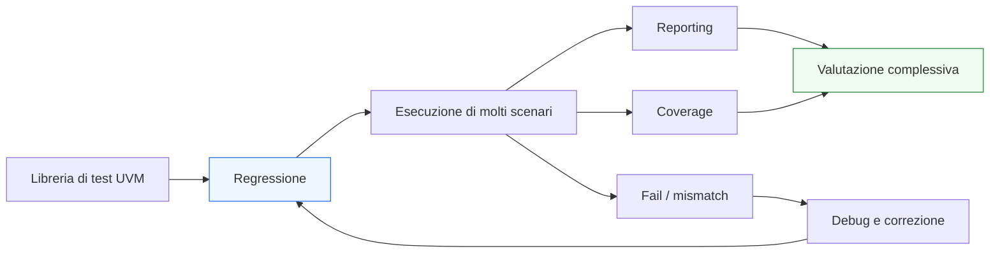

# Regressione e gestione dei test in UVM

Dopo aver introdotto **coverage**, **reporting** e **debug**, il passo successivo naturale è affrontare il livello in cui tutti questi elementi convergono in una pratica operativa concreta: la **regressione**.

In un ambiente UVM serio, la verifica non si esaurisce quasi mai in un singolo test. Anche quando un testbench è ben costruito, il DUT deve essere esercitato attraverso una famiglia di scenari diversi:
- smoke test;
- casi nominali;
- corner case;
- stress di protocollo;
- reset in condizioni critiche;
- traffico multi-agent;
- scenari con configurazioni diverse;
- campagne mirate di coverage.

La regressione è il contesto in cui questi test vengono organizzati, eseguiti, letti e migliorati nel tempo.

Dal punto di vista metodologico, la regressione è importante perché trasforma il testbench da insieme di test isolati a **sistema di verifica progressivo e misurabile**. In altre parole, la regressione è il luogo in cui:
- si accumula fiducia nel DUT;
- si misura il progresso della coverage;
- si osserva la stabilità del testbench;
- si identificano regressioni funzionali;
- si governa la crescita della verifica.

Questa pagina introduce la regressione in UVM con un taglio coerente con il resto della sezione:
- didattico ma tecnico;
- centrato sul suo significato architetturale e operativo;
- attento al rapporto tra test, coverage, reporting e debug;
- orientato a far capire che la regressione non è solo “lanciare tanti test”, ma costruire una campagna di verifica leggibile e disciplinata.

## 1. Che cos’è una regressione

Una regressione è una campagna strutturata di esecuzione di test multipli su un ambiente di verifica, pensata per valutare in modo sistematico il comportamento del DUT e del testbench.

### 1.1 Significato essenziale
La regressione:
- raccoglie più test;
- li esegue in modo ordinato;
- ne osserva gli esiti;
- accumula informazione di reporting e coverage;
- supporta il debug dei fallimenti;
- aiuta a misurare il progresso della verifica nel tempo.

### 1.2 Non è solo una lista di test
Una regressione utile non è un elenco casuale di simulazioni, ma una struttura organizzata di scenari con scopi diversi.

### 1.3 Perché è importante
È il livello in cui la verifica diventa un processo ripetibile, osservabile e migliorabile.

## 2. Perché serve una regressione

La prima domanda importante è: perché non limitarsi a eseguire qualche test manualmente?

### 2.1 Il limite del test isolato
Un singolo test può dire qualcosa di utile, ma non basta per:
- coprire scenari diversi;
- verificare la robustezza del DUT;
- controllare che modifiche successive non rompano casi già corretti;
- misurare l’avanzamento della coverage;
- capire la stabilità dell’ambiente nel tempo.

### 2.2 La risposta metodologica
La regressione permette di:
- costruire una famiglia di scenari;
- verificare il DUT in modo più ampio;
- ripetere i controlli dopo ogni evoluzione del design o del testbench.

### 2.3 Beneficio
La regressione è uno dei pilastri della verifica scalabile.

## 3. La regressione non è solo “tanti test”

Questo è uno dei chiarimenti più importanti da fare.

### 3.1 Visione riduttiva
Pensare alla regressione come semplice esecuzione di molti test porta spesso a:
- campagne ridondanti;
- risultati difficili da leggere;
- crescita disordinata della libreria di test;
- coverage non guidata;
- debug poco efficiente.

### 3.2 Visione corretta
Una regressione ben fatta deve essere:
- organizzata;
- leggibile;
- progressiva;
- guidata da obiettivi di coverage e stabilità;
- capace di evidenziare davvero i problemi.

### 3.3 Significato architetturale
La regressione è il livello operativo in cui l’architettura del testbench viene davvero messa al lavoro.

## 4. Quali test entrano in una regressione

Non tutti i test hanno lo stesso ruolo.

### 4.1 Smoke test
Servono a verificare rapidamente che l’infrastruttura di base e gli scenari principali siano ancora vivi.

### 4.2 Test nominali
Verificano i percorsi funzionali principali del DUT.

### 4.3 Corner case
Mirano a:
- valori limite;
- sequencing particolari;
- condizioni rare ma importanti;
- interazioni di protocollo non banali.

### 4.4 Stress test
Servono a esercitare:
- traffico intenso;
- throughput;
- backpressure;
- reset in situazioni critiche;
- concorrenza tra agent.

### 4.5 Test di configurazione
Verificano che il DUT si comporti correttamente in modalità operative differenti.

### 4.6 Perché questa distinzione conta
Una buona regressione combina tutti questi ruoli, invece di ripetere molti test simili senza strategia.

## 5. Regressione e struttura del testbench UVM

La regressione funziona bene solo se il testbench è stato progettato in modo modulare.

### 5.1 Il ruolo del test
Il test seleziona:
- scenario;
- configurazione;
- sequence o virtual sequence;
- modalità dell’ambiente.

### 5.2 Il ruolo dell’environment
L’environment resta stabile e riusabile.

### 5.3 Il ruolo delle sequence
Le sequence danno varietà controllata al traffico.

### 5.4 Il ruolo di scoreboard, subscriber e coverage
Permettono di valutare in modo consistente i risultati di molti test diversi.

### 5.5 Perché è importante
Una regressione forte dipende da un testbench in cui:
- infrastruttura e scenari sono separati;
- la variabilità è nei test, non nella duplicazione dell’ambiente.

## 6. Regressione e configurazione dei test

La qualità della regressione dipende molto da come i test vengono configurati.

### 6.1 Stesso environment, molti scenari
Una regressione efficace sfrutta il fatto che lo stesso environment può essere riusato con:
- agent attivi o passivi diversi;
- sequence differenti;
- coverage più o meno intensa;
- logging più o meno verboso;
- componenti specializzati tramite factory.

### 6.2 Beneficio
La regressione resta più leggibile e più economica da mantenere.

### 6.3 Collegamento importante
Questo è uno dei punti in cui si vede davvero il valore di:
- `test.md`
- `test-configuration.md`
- `uvm-factory-config.md`

## 7. Regressione e coverage

La coverage è uno dei grandi motori che guidano la regressione.

### 7.1 Perché
La regressione non serve solo a vedere se i test passano, ma anche a capire:
- se si stanno coprendo nuovi casi;
- se certe aree del DUT restano scoperte;
- se alcune sequence sono ridondanti;
- quali scenari mancano ancora.

### 7.2 Visione corretta
La coverage trasforma la regressione da semplice ripetizione di test a processo di crescita della verifica.

### 7.3 Beneficio
Ogni campagna di regressione può essere letta non solo in termini di pass/fail, ma anche in termini di:
- avanzamento;
- esplorazione;
- completezza relativa.

## 8. Regressione e reporting

Il reporting è essenziale per rendere leggibile una regressione.

### 8.1 Che cosa serve vedere
Per esempio:
- quali test sono passati;
- quali sono falliti;
- quanti warning o errori sono emersi;
- quali scenari hanno prodotto mismatch;
- quali configurazioni risultano fragili.

### 8.2 Perché il reporting deve essere buono
Una regressione senza reporting chiaro produce massa di dati, ma non conoscenza utile.

### 8.3 Beneficio metodologico
Il reporting rende la regressione:
- consultabile;
- triage-friendly;
- utile per debug e priorità.

## 9. Regressione e debug

La regressione e il debug sono strettamente collegati.

### 9.1 Perché
Una regressione non serve solo a confermare ciò che va bene. Serve anche a far emergere in modo ordinato ciò che va corretto.

### 9.2 Ruolo pratico
Quando alcuni test falliscono, il debug deve poter rispondere a domande come:
- il fallimento è nuovo o ricorrente?
- è limitato a un certo scenario?
- riguarda solo una configurazione?
- è causato dal DUT o dal testbench?
- è associato a una zona specifica della coverage?

### 9.3 Beneficio
Una buona regressione non aumenta solo il numero di fail visibili: aumenta la qualità con cui quei fail possono essere compresi e risolti.

## 10. Regressione e stabilità del testbench

La regressione verifica anche il testbench, non solo il DUT.

### 10.1 Perché
Un ambiente UVM può evolvere:
- nuove sequence;
- nuovi subscriber;
- nuovi scoreboards;
- nuovi agent;
- nuovi override;
- nuove configurazioni.

### 10.2 Che cosa misura la regressione
Misura anche se questa evoluzione:
- rompe test già validi;
- introduce flakiness;
- crea log più rumorosi;
- degrada il runtime o la leggibilità;
- rende coverage o checking incoerenti.

### 10.3 Beneficio
La regressione è una forma di controllo continuo della salute del testbench stesso.

## 11. Regressione e DUT con latenza o pipeline

La regressione è particolarmente importante per DUT con comportamento temporale non banale.

### 11.1 Perché
DUT con:
- latenza;
- pipeline;
- backpressure;
- ordering;
- burst;
- concorrenza tra transazioni

richiedono molti scenari diversi per costruire fiducia.

### 11.2 Cosa serve
Una regressione utile deve includere test che esplorino:
- ritmo del traffico;
- condizioni di stall;
- casi con più dati in volo;
- reset durante attività;
- output ritardati;
- ordering normale e corner.

### 11.3 Beneficio
La regressione permette di esplorare sistematicamente queste regioni senza affidarsi a pochi test manuali.

## 12. Regressione e DUT multi-agent

Nei DUT con più agent, la regressione diventa ancora più importante.

### 12.1 Perché
Bisogna verificare:
- canali singoli;
- interazioni tra canali;
- configurazione e traffico;
- request/response multi-interfaccia;
- casi di contesa o cooperazione.

### 12.2 Ruolo delle virtual sequence
Le virtual sequence diventano uno strumento chiave per costruire test di regressione più ricchi.

### 12.3 Beneficio architetturale
La regressione rende visibili problemi che spesso non emergono nei test localizzati su un solo agent.

## 13. Regressione e triage dei fallimenti

Uno degli aspetti più pratici della regressione è la gestione dei fallimenti.

### 13.1 Non tutti i fail sono uguali
Un fallimento può essere:
- nuovo;
- già noto;
- sporadico;
- sistematico;
- legato a una sola configurazione;
- esteso a molti test.

### 13.2 Perché il triage è importante
Aiuta a capire:
- priorità;
- origine probabile;
- impatto sul DUT;
- impatto sul testbench;
- direzione del debug.

### 13.3 Che cosa rende possibile un buon triage
- reporting chiaro;
- test ben nominati e ben strutturati;
- scoreboard diagnostico;
- coverage leggibile;
- log non rumorosi.

## 14. Regressione e qualità dei test

La regressione aiuta anche a valutare se la libreria di test è ben costruita.

### 14.1 Segnali di buona qualità
- test con ruoli chiari;
- buona distribuzione tra smoke, nominali, corner e stress;
- coverage che cresce;
- fallimenti interpretabili;
- bassa ridondanza inutile.

### 14.2 Segnali di bassa qualità
- molti test quasi identici;
- coverage che non aumenta;
- troppi fail opachi;
- test difficili da classificare;
- scenario e configurazione poco leggibili.

### 14.3 Beneficio
La regressione non serve solo a verificare il DUT, ma anche a migliorare la qualità dell’intero portafoglio di test.

## 15. Errori comuni

Alcuni errori ricorrono spesso quando si costruisce una regressione UVM.

### 15.1 Aggiungere test senza strategia
Questo produce volume, ma non vera copertura o comprensione.

### 15.2 Guardare solo pass/fail
Si perde il ruolo di coverage e di qualità della regressione.

### 15.3 Trascurare reporting e triage
Il risultato è una campagna difficile da leggere e poco utile al debug.

### 15.4 Duplicare ambienti invece di configurare i test
Si perde riuso e si aumenta il costo di manutenzione.

### 15.5 Non ripulire i test obsoleti o ridondanti
La regressione cresce di rumore e perde efficacia.

## 16. Buone pratiche di modellazione

Per costruire bene una regressione UVM, alcune linee guida sono particolarmente utili.

### 16.1 Pensarla come campagna, non come somma di run isolate
Ogni test dovrebbe avere un ruolo chiaro dentro una strategia più ampia.

### 16.2 Curare la libreria di test
Smoke, nominali, corner e stress dovrebbero essere distinguibili e ben bilanciati.

### 16.3 Usare coverage per guidare la crescita
La regressione dovrebbe evolvere in risposta a ciò che ancora manca.

### 16.4 Curare reporting e debug
Una regressione utile è leggibile e favorisce il triage.

### 16.5 Mantenere stabile l’infrastruttura
Environment, agent, scoreboard e subscriber dovrebbero essere riusati il più possibile; la variabilità deve vivere nei test e nella configurazione.

## 17. Collegamento con il resto della sezione

Questa pagina si collega direttamente a:
- **`test.md`**, che definisce gli scenari della regressione;
- **`test-configuration.md`**, che permette di variare i test senza duplicare l’ambiente;
- **`coverage-uvm.md`**, che guida la crescita della regressione;
- **`reporting.md`**, che rende leggibili i risultati;
- **`debug-uvm.md`**, che permette di analizzare i fallimenti;
- **`objections.md`**, perché la correttezza temporale dei test è essenziale per campagne ripetibili.

Prepara inoltre in modo naturale la pagina successiva:
- **`uvm-handshake-protocols.md`**

oppure, se si vuole prima chiudere la sezione con una visione trasversale,
- **`case-study-uvm.md`**

a seconda di come si preferisce proseguire la costruzione del ramo UVM.

## 18. In sintesi

La regressione in UVM è una campagna strutturata di test che usa la stessa infrastruttura di verifica per esercitare il DUT in molti scenari diversi, con l’obiettivo di costruire fiducia nel comportamento del design e nella qualità del testbench.

Il suo valore sta nel far convergere:
- test;
- configurazione;
- coverage;
- reporting;
- debug;
- stabilità dell’ambiente.

Capire bene la regressione significa capire come UVM trasformi un insieme di componenti e test in un processo di verifica continuo, misurabile e migliorabile nel tempo.

## Prossimo passo

Il passo più naturale ora è **`uvm-handshake-protocols.md`**, perché dopo aver chiuso il ramo metodologico generale conviene iniziare il blocco di integrazione con il DUT reale, partendo da uno dei casi più comuni:
- protocolli `valid/ready`
- request/response
- traffico con backpressure
- implicazioni per driver, monitor, scoreboard e coverage
