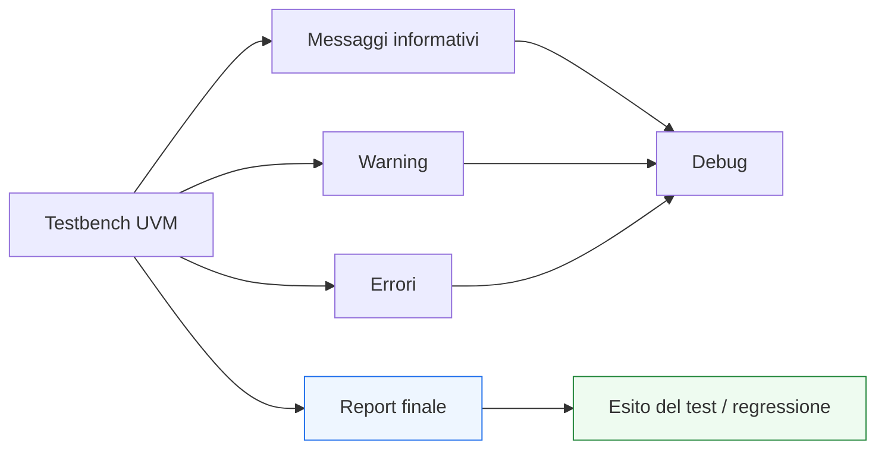

# Messaging e reporting in UVM

Dopo aver introdotto **test**, **configurazione dei test** e **objections**, il passo successivo naturale è affrontare il modo in cui un ambiente UVM comunica ciò che sta accadendo durante la simulazione e come riassume l’esito finale della verifica: il tema del **messaging e reporting**.

Questo argomento è molto importante perché un testbench UVM serio non deve soltanto:
- stimolare il DUT;
- osservare il protocollo;
- confrontare atteso e osservato;
- raccogliere coverage.

Deve anche saper **comunicare** in modo chiaro:
- che cosa sta facendo;
- quali condizioni ha osservato;
- quali warning meritano attenzione;
- quali errori rendono il test fallito;
- quale sia l’esito complessivo della simulazione.

Dal punto di vista metodologico, il reporting è fondamentale perché collega direttamente:
- debug;
- leggibilità della regressione;
- qualità della diagnosi;
- robustezza operativa del testbench.

Senza un sistema di messaggi ben strutturato, anche un buon testbench rischia di diventare difficile da usare:
- i log risultano rumorosi;
- gli errori risultano poco leggibili;
- la regressione è difficile da interpretare;
- la diagnosi dei fallimenti richiede troppo tempo.

Questa pagina introduce messaging e reporting in UVM con un taglio coerente con il resto della sezione:
- didattico ma tecnico;
- centrato sul loro significato architetturale;
- attento alla differenza tra informazione utile e rumore;
- orientato a chiarire perché il reporting non è un dettaglio accessorio, ma una parte integrante della qualità del testbench.

## 1. Perché servono messaging e reporting strutturati

La prima domanda importante è: perché UVM dedica così tanta attenzione ai messaggi e ai report?

### 1.1 Il problema dei log informali
In un testbench poco strutturato, i messaggi sono spesso:
- sparsi;
- incoerenti;
- troppo verbosi;
- troppo poveri;
- poco contestualizzati;
- difficili da filtrare;
- poco utili in regressione.

### 1.2 La risposta UVM
UVM introduce una disciplina comune per:
- produrre messaggi con severità e significato chiari;
- organizzare i log;
- rendere leggibile il comportamento del testbench;
- sintetizzare correttamente l’esito finale del test.

### 1.3 Beneficio metodologico
Questo migliora:
- debug quotidiano;
- affidabilità della regressione;
- leggibilità dei fallimenti;
- manutenibilità del testbench;
- uso collaborativo dell’ambiente di verifica.

## 2. Due dimensioni diverse: messaggi e report

È utile distinguere due aspetti correlati ma non identici.

### 2.1 Messaging
Riguarda i messaggi prodotti durante la simulazione:
- informativi;
- diagnostici;
- warning;
- errori;
- eventi di stato.

### 2.2 Reporting
Riguarda la sintesi dell’esito e il modo in cui il testbench presenta il risultato finale:
- pass/fail;
- conteggi di warning e errori;
- messaggi conclusivi;
- leggibilità del risultato della simulazione o della regressione.

### 2.3 Perché la distinzione è utile
I messaggi aiutano a capire **che cosa sta accadendo** durante il test.  
Il reporting aiuta a capire **com’è andato il test nel suo complesso**.

## 3. Perché il messaging è una parte dell’architettura del testbench

È un errore comune vedere i messaggi come semplice “contorno”.

### 3.1 Un buon log è parte della verificabilità
Un testbench complesso deve saper spiegare:
- quali sequence sono partite;
- quali agent sono attivi;
- quali condizioni anomale sono state viste;
- dove è avvenuto un mismatch;
- quale parte del flusso è ancora in attesa.

### 3.2 Messaggi come strumento architetturale
Messaggi ben progettati aiutano a leggere:
- la dinamica del test;
- il flusso dei dati;
- le connessioni tra componenti;
- il punto di fallimento.

### 3.3 Effetto pratico
Un ambiente con buoni messaggi è molto più facile da usare, estendere e mantenere.

## 4. Tipi di messaggi in UVM

Uno dei punti più utili del sistema UVM è la distinzione tra severità diverse.

### 4.1 Messaggi informativi
Servono a raccontare:
- avvio di fasi;
- configurazioni attive;
- partenza di sequence;
- eventi di interesse per il debug;
- stato dell’environment.

### 4.2 Warning
Servono a indicare:
- condizioni inattese ma non necessariamente fatali;
- situazioni sospette;
- casi che meritano attenzione;
- degradazioni del comportamento del testbench o del DUT che non equivalgono subito a fallimento.

### 4.3 Errori
Indicano condizioni che compromettono il corretto esito del test:
- mismatch funzionali;
- violazioni di protocollo rilevanti;
- setup incoerente del testbench;
- fallimenti del checking.

### 4.4 Errori fatali
Indicano condizioni per cui la simulazione non può proseguire in modo significativo:
- ambiente non costruito correttamente;
- connessioni essenziali mancanti;
- condizioni di esecuzione senza senso;
- errori strutturali gravi.

## 5. Messaggi informativi: perché non sono “rumore”

Spesso chi inizia tende a vedere i messaggi informativi come opzionali o fastidiosi. In realtà sono molto utili, se ben progettati.

### 5.1 A che cosa servono
Aiutano a capire:
- quale test è in corso;
- come è configurato l’environment;
- quali sequence sono state avviate;
- quali agent sono attivi o passivi;
- se il testbench ha raggiunto certi punti chiave.

### 5.2 Perché sono importanti
Senza questi messaggi, il comportamento del testbench può risultare opaco.

### 5.3 Ma con una condizione
Devono essere:
- selettivi;
- chiari;
- proporzionati;
- utili alla lettura del test.

## 6. Warning: il livello della cautela

I warning hanno un ruolo particolare.

### 6.1 Che cosa segnalano
Non un fallimento immediato, ma una situazione che può:
- indicare un comportamento sospetto;
- segnalare una configurazione non ideale;
- anticipare un problema più serio;
- suggerire che un caso non è stato gestito come previsto.

### 6.2 Perché sono utili
Aiutano a non ridurre tutto a:
- “tutto bene”
oppure
- “test fallito”

Esiste infatti una fascia intermedia di condizioni che merita attenzione.

### 6.3 Attenzione importante
Un eccesso di warning inutili degrada il valore del log quanto un eccesso di messaggi informativi.

## 7. Errori: il cuore del fallimento funzionale

Gli errori sono tra i messaggi più importanti del testbench.

### 7.1 Quando usare un errore
Quando il testbench osserva una condizione incompatibile con il corretto esito della verifica:
- mismatch nello scoreboard;
- violazione di regole attese;
- incoerenza nel protocollo;
- risultato funzionale sbagliato;
- condizione interna del testbench che compromette il test.

### 7.2 Perché è importante usarli bene
Se il testbench segnala come errore solo una parte dei veri fallimenti, la regressione perde affidabilità.  
Se segnala come errore troppe condizioni marginali, il debugging diventa più difficile.

### 7.3 Ruolo nel verdetto del test
Gli errori contribuiscono direttamente al risultato finale del test.

## 8. Fatal: quando fermare davvero la simulazione

Il livello fatale va usato con particolare attenzione.

### 8.1 Quando ha senso
Quando il testbench o il DUT si trovano in una condizione in cui proseguire la simulazione non è più sensato o affidabile.

### 8.2 Esempi tipici
Per esempio:
- mancanza di una connessione fondamentale;
- virtual interface non disponibile;
- configurazione impossibile;
- impossibilità di costruire correttamente l’ambiente;
- violazione strutturale grave.

### 8.3 Perché usarlo con disciplina
Un uso eccessivo dei fatal rende il testbench troppo fragile. Un uso insufficiente rende la simulazione capace di proseguire in condizioni senza valore.

## 9. Messaging e debug

Il messaging è uno degli strumenti più importanti per il debug quotidiano.

### 9.1 Perché
Durante un fallimento serve capire:
- quale scenario era in corso;
- quali transazioni erano attive;
- quale componente ha rilevato il problema;
- se il problema nasce nello stimolo, nel protocollo, nel DUT o nel checking.

### 9.2 Messaggi ben progettati
Un buon messaggio dovrebbe aiutare a capire:
- contesto;
- causa osservata;
- componente che l’ha prodotto;
- severità;
- implicazione per il test.

### 9.3 Effetto pratico
Un buon sistema di messaging riduce drasticamente il tempo richiesto per localizzare un bug.

## 10. Messaging e regression readability

La regressione è uno dei contesti in cui il reporting UVM mostra di più il suo valore.

### 10.1 Perché
In regressione si eseguono molti test:
- smoke;
- nominali;
- corner case;
- protocol stress;
- reset stress;
- casi multi-agent.

### 10.2 Problema tipico
Se ogni test produce log poco leggibili o non uniformi, la regressione diventa difficile da interpretare.

### 10.3 Beneficio del reporting strutturato
Con messaggi e report coerenti:
- è più facile identificare i test falliti;
- è più facile capire la severità dei problemi;
- è più facile distinguere warning da veri fallimenti;
- i risultati diventano più comparabili tra test diversi.

## 11. Messaging e phasing

Il messaging UVM è strettamente legato al phasing.

### 11.1 Fasi iniziali
Messaggi utili possono chiarire:
- costruzione dell’environment;
- configurazione degli agent;
- connessioni effettuate;
- modalità attive o passive.

### 11.2 Run phase
Durante la run phase, i messaggi possono descrivere:
- avvio delle sequence;
- eventi significativi del protocollo;
- condizioni di warning;
- mismatch rilevati.

### 11.3 Fasi finali
Nel report finale, il testbench può sintetizzare:
- esito complessivo;
- conteggi di warning/errori;
- informazioni di coverage o statistiche rilevanti.

## 12. Messaging e componenti diversi del testbench

Un testbench UVM ben progettato usa il messaging in modo distribuito ma coerente.

### 12.1 Il test
Può comunicare:
- scenario selezionato;
- configurazione dell’ambiente;
- obiettivi del run.

### 12.2 L’environment
Può comunicare:
- struttura attiva;
- presenza di componenti;
- setup globale della verifica.

### 12.3 Gli agent
Possono comunicare:
- modalità attiva o passiva;
- eventi rilevanti del protocollo.

### 12.4 Driver e monitor
Possono emettere messaggi mirati su:
- protocollo;
- traffico;
- condizioni inattese.

### 12.5 Scoreboard e subscriber
Possono produrre:
- mismatch;
- statistiche;
- coverage;
- warning analitici.

### 12.6 Perché questa distribuzione è utile
Ogni componente racconta il proprio livello di responsabilità.

## 13. Messaggi utili e messaggi inutili

Una parte importante della qualità del reporting è saper distinguere tra messaggi utili e rumore.

### 13.1 Messaggi utili
Sono quelli che aiutano a capire:
- stato;
- contesto;
- problema;
- conseguenza;
- punto del testbench coinvolto.

### 13.2 Messaggi inutili
Sono quelli che:
- ripetono informazioni ovvie;
- non aggiungono contesto;
- sono troppo frequenti;
- non distinguono bene severità e importanza;
- rendono il log più difficile da leggere.

### 13.3 Perché conta
Un log troppo rumoroso è quasi dannoso quanto un log troppo povero.

## 14. Reporting finale

Oltre ai messaggi durante l’esecuzione, conta molto anche il report finale del test.

### 14.1 Che cosa dovrebbe comunicare
Per esempio:
- test eseguito;
- esito finale;
- warning ed errori rilevanti;
- eventuali mismatch;
- sintesi delle statistiche più importanti;
- risultati di coverage o checking, se appropriato.

### 14.2 Perché è importante
Un buon report finale è essenziale per:
- regressione;
- triage dei fallimenti;
- debug iniziale;
- lettura rapida dello stato del test.

### 14.3 Relazione con il resto del testbench
Il report finale raccoglie e rende leggibile il lavoro fatto da:
- test;
- scoreboard;
- subscriber;
- environment;
- altri componenti analitici.

## 15. Messaging e DUT reale

Il valore del reporting si capisce molto bene sui DUT reali.

### 15.1 DUT semplici
Anche in DUT piccoli, buoni messaggi rendono il testbench più comprensibile e più facile da manutenere.

### 15.2 DUT con protocollo complesso
Qui il messaging può aiutare a capire:
- handshakes;
- stall;
- reset;
- eventi di corner case;
- flussi multi-agent.

### 15.3 DUT con latenza o pipeline
Messaggi e report ben progettati aiutano a seguire:
- la progressione del traffico;
- l’arrivo degli output;
- i punti di mismatch;
- il completamento dello scenario.

## 16. Errori comuni

Alcuni errori ricorrono spesso nel messaging e reporting dei testbench UVM.

### 16.1 Log troppo rumorosi
Troppi messaggi informativi rendono difficile vedere ciò che conta davvero.

### 16.2 Log troppo poveri
Se mancano contesto e stato, il debug diventa lento e frustrante.

### 16.3 Severità usate male
Usare warning come errori, o errori come informazioni, degrada il significato del log.

### 16.4 Messaggi poco contestualizzati
Messaggi del tipo “errore generico” o “mismatch” senza contesto servono poco.

### 16.5 Reporting finale debole
Un test che finisce senza un quadro chiaro del risultato è più difficile da usare in regressione.

## 17. Buone pratiche di modellazione

Per costruire bene messaging e reporting in UVM, alcune linee guida sono particolarmente utili.

### 17.1 Pensare ai messaggi come strumento di diagnosi
Ogni messaggio dovrebbe aiutare a capire qualcosa di utile.

### 17.2 Mantenere coerenza tra severità e significato
Informazione, warning, errore e fatal devono riflettere differenze reali.

### 17.3 Distribuire i messaggi nei componenti giusti
Ogni componente dovrebbe comunicare il proprio livello di responsabilità.

### 17.4 Curare il report finale
La sintesi conclusiva del test è parte importante della qualità del testbench.

### 17.5 Progettare per la regressione
Un buon sistema di reporting deve essere leggibile non solo nel debug locale, ma anche su grandi campagne di test.

## 18. Collegamento con il resto della sezione

Questa pagina si collega direttamente a:
- **`test.md`**, perché il test definisce il contesto in cui i messaggi acquistano significato;
- **`objections.md`**, perché il reporting finale dipende anche dalla chiusura ordinata della run phase;
- **`scoreboard.md`**, che produce alcuni dei messaggi più importanti legati al checking;
- **`subscriber.md`**, che può contribuire con statistiche, coverage e logging analitico;
- **`environment.md`**, che integra il flusso dei messaggi dei vari componenti.

Prepara inoltre in modo naturale le pagine successive:
- **`coverage-uvm.md`**
- **`debug-uvm.md`**
- **`regression.md`**

perché tutti questi temi dipendono fortemente dalla qualità del messaging e del reporting.

## 19. In sintesi

Il messaging e reporting in UVM è il sistema con cui il testbench comunica:
- ciò che sta facendo;
- le condizioni osservate;
- warning e anomalie;
- errori funzionali;
- esito finale del test.

Il suo valore è fortemente metodologico, perché rende il testbench più:
- leggibile;
- diagnosticabile;
- riusabile;
- adatto alla regressione.

Capire bene il reporting significa capire che la qualità della verifica non dipende solo dallo stimolo e dal checking, ma anche da quanto bene il testbench sa spiegare il proprio comportamento e i propri risultati.

## Prossimo passo

Il passo più naturale ora è **`coverage-uvm.md`**, perché dopo aver chiarito il lato del checking e della comunicazione conviene affrontare in modo diretto:
- che cosa significa coverage in ambiente UVM
- come si collega a monitor e subscriber
- come supporta regressione e qualità della verifica
