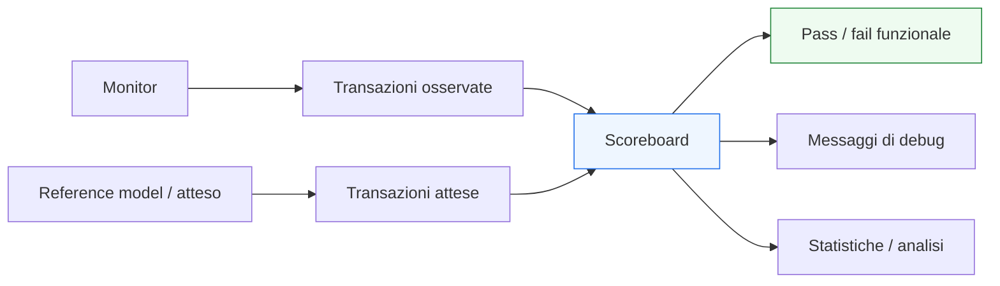

# `scoreboard` in UVM

Dopo aver introdotto **monitor**, **connessioni TLM** ed **environment**, il passo successivo naturale è affrontare uno dei componenti più importanti della verifica funzionale in UVM: lo **`scoreboard`**.

Se il monitor osserva ciò che accade realmente sui segnali del DUT e ricostruisce le transazioni, lo scoreboard è il luogo in cui il testbench inizia a rispondere in modo esplicito alla domanda più importante della verifica:

- il comportamento osservato è coerente con quello atteso?

Dal punto di vista metodologico, lo scoreboard è il componente che separa in modo molto chiaro:
- osservazione del comportamento;
- definizione del comportamento atteso;
- confronto tra i due;
- produzione di un esito funzionale significativo.

Questo è estremamente importante perché evita di concentrare il checking:
- nel driver;
- nel monitor;
- nel test;
- in logica informale dispersa nel testbench.

In UVM, lo scoreboard è quindi uno dei punti più forti della qualità architetturale dell’ambiente di verifica, perché rende il confronto funzionale:
- più leggibile;
- più riusabile;
- più modulare;
- più estendibile;
- più adatto a DUT reali con latenza, pipeline, più interfacce e configurazioni complesse.

Questa pagina introduce lo scoreboard con un taglio coerente con il resto della sezione UVM:
- didattico ma tecnico;
- centrato sul suo ruolo architetturale;
- attento al legame con monitor, reference model, coverage e debug;
- orientato a far capire che lo scoreboard non è solo un “posto dove fare if su atteso e osservato”, ma un componente chiave del metodo di verifica.

## 1. Che cos’è uno `scoreboard`

Lo `scoreboard` è il componente UVM che confronta il comportamento osservato del DUT con il comportamento atteso.

### 1.1 Significato essenziale
Lo scoreboard:
- riceve transazioni osservate;
- riceve o costruisce la vista attesa;
- applica una logica di confronto;
- determina se il comportamento del DUT è corretto oppure no.

### 1.2 Livello di astrazione
Lavora a livello di:
- transazioni;
- eventi osservati;
- dati con significato funzionale;
- relazioni tra input e output;

più che a livello di singoli segnali o singoli fronti di clock.

### 1.3 Perché è così importante
Lo scoreboard è uno dei componenti che più trasformano il testbench da semplice ambiente di stimolo a vera infrastruttura di verifica.

## 2. Perché serve uno `scoreboard`

La prima domanda importante è: se il monitor osserva il DUT e il test sa quali stimoli sono stati inviati, perché serve un componente dedicato al confronto?

### 2.1 Il problema del checking disperso
Senza uno scoreboard, il checking rischia di essere:
- disperso nei test;
- mescolato ai monitor;
- nascosto in logica locale del driver;
- difficile da riusare;
- difficile da mantenere;
- poco leggibile nei DUT più complessi.

### 2.2 La risposta UVM
UVM introduce lo scoreboard come punto esplicito in cui:
- il comportamento atteso viene confrontato con l’osservato;
- il risultato funzionale della verifica viene deciso;
- la logica di confronto resta separata dal resto del testbench.

### 2.3 Beneficio metodologico
Questo migliora:
- modularità;
- chiarezza del checking;
- riuso dell’ambiente;
- capacità di debug;
- qualità della regressione.

## 3. Cosa confronta davvero lo `scoreboard`

Uno scoreboard non confronta semplicemente “valori uguali o diversi” in astratto. Confronta il comportamento del DUT nel contesto della specifica di verifica.

### 3.1 Lato osservato
Il lato osservato arriva tipicamente dai monitor e rappresenta:
- ciò che il DUT ha realmente prodotto;
- ciò che il protocollo ha effettivamente trasferito;
- ciò che è stato osservato con indipendenza dal driver.

### 3.2 Lato atteso
Il lato atteso può derivare da:
- un modello di riferimento;
- un predictor;
- una trasformazione degli input osservati;
- regole deterministiche locali del testbench;
- una logica di confronto più semplice ma coerente con la specifica.

### 3.3 Il confronto
Lo scoreboard decide se:
- valori;
- ordine;
- latenza osservabile;
- presenza o assenza di transazioni;
- coerenza di campi e metadati

sono compatibili con il comportamento atteso.

## 4. Osservato e atteso: le due sorgenti fondamentali

Per capire bene lo scoreboard, è utile vedere il checking come incontro tra due flussi distinti.

### 4.1 Flusso osservato
Arriva dal DUT, tramite:
- monitor;
- transazioni ricostruite;
- eventi effettivamente avvenuti.

### 4.2 Flusso atteso
Arriva da:
- modello di riferimento;
- predictor;
- logica attesa locale;
- funzione di trasformazione degli input.

### 4.3 Perché questa separazione è così importante
Questa struttura impedisce di confondere:
- ciò che il DUT ha davvero fatto;
- ciò che il testbench si aspettava che facesse.

È proprio da questa separazione che nasce la credibilità del checking.

## 5. Lo scoreboard non è il monitor

Una distinzione fondamentale è quella tra scoreboard e monitor.

### 5.1 Il monitor osserva
Il monitor:
- legge i segnali;
- interpreta il protocollo;
- ricostruisce le transazioni.

### 5.2 Lo scoreboard confronta
Lo scoreboard:
- riceve le transazioni osservate;
- le confronta con una vista attesa;
- produce il verdetto funzionale.

### 5.3 Perché è essenziale separarli
Se il monitor facesse troppo checking:
- perderebbe indipendenza;
- diventerebbe meno riusabile;
- si mescolerebbero osservazione e confronto.

UVM preferisce separare questi ruoli con chiarezza.

## 6. Lo scoreboard non è il test

Anche il rapporto tra test e scoreboard va chiarito bene.

### 6.1 Il test decide lo scenario
Il test:
- configura l’ambiente;
- sceglie le sequence;
- imposta il contesto della simulazione.

### 6.2 Lo scoreboard decide il confronto funzionale
Lo scoreboard:
- applica la logica di checking;
- valuta gli esiti delle transazioni;
- accumula mismatch e risultati.

### 6.3 Perché questa distinzione aiuta
Così il test non diventa un contenitore di logica di confronto e lo scoreboard resta riusabile in più scenari.

## 7. Lo scoreboard vive naturalmente nell’`environment`

Lo scoreboard trova il suo posto naturale dentro l’environment.

### 7.1 Perché non nell’agent
L’agent è focalizzato su una singola interfaccia o protocollo.

### 7.2 Perché nello scoreboard serve una vista più alta
Lo scoreboard spesso ha bisogno di:
- input da più monitor;
- relazione tra input e output del DUT;
- confronto tra più canali;
- correlazione tra configurazione e risultati;
- visione complessiva del comportamento del blocco.

### 7.3 Conseguenza architetturale
Per questo motivo lo scoreboard è uno dei componenti che più chiaramente appartengono al livello environment.

## 8. Scoreboard e DUT semplici

Anche per DUT relativamente semplici, lo scoreboard resta molto utile.

### 8.1 Caso base
Per un DUT con una sola interfaccia e comportamento diretto, lo scoreboard può limitarsi a confronti semplici tra input e output osservati.

### 8.2 Perché usarlo comunque
Anche in questo caso:
- mantiene separazione di ruoli;
- rende il checking più leggibile;
- prepara il testbench alla crescita;
- aiuta riuso e regressione.

### 8.3 Visione corretta
Lo scoreboard non è riservato solo a DUT complessi. È utile anche come disciplina di base.

## 9. Scoreboard e DUT con latenza

Il valore dello scoreboard cresce molto quando il DUT ha latenza.

### 9.1 Perché il confronto si complica
Se tra input e output passano più cicli:
- non basta confrontare valori “nello stesso momento”;
- serve una logica che correli correttamente ciò che è uscito con ciò che era atteso;
- possono esserci pipeline, ritardi e ritmi di uscita differenti.

### 9.2 Ruolo dello scoreboard
Lo scoreboard diventa il luogo naturale in cui:
- si mantiene il contesto atteso;
- si correla la transazione osservata alla sua origine;
- si gestisce il confronto con la latenza corretta.

### 9.3 Beneficio
Questo evita di spargere logica temporale di checking in test, monitor o driver.

## 10. Scoreboard e DUT con pipeline

Per DUT pipelined, lo scoreboard è spesso indispensabile.

### 10.1 Perché
La pipeline introduce:
- più dati contemporaneamente in volo;
- ordine e latenza non banali;
- possibile backpressure;
- comportamenti da correlare su più cicli.

### 10.2 Che cosa fa lo scoreboard
Aiuta a:
- tenere traccia delle transazioni attese;
- confrontare output nel momento giusto;
- verificare il mantenimento dell’ordine o le regole previste;
- separare errori di protocollo da errori di dato.

### 10.3 Collegamento con la microarchitettura
Anche se non implementa la pipeline del DUT, lo scoreboard deve essere coerente con il modo in cui il DUT la rende osservabile.

## 11. Scoreboard e DUT con più interfacce

Lo scoreboard è particolarmente importante nei DUT con più agent o più canali.

### 11.1 Casi tipici
Per esempio:
- input e output separati;
- request e response;
- canali multipli;
- configurazione e dati;
- flussi concorrenti.

### 11.2 Perché qui è essenziale
Spesso il comportamento corretto non si legge da una sola interfaccia, ma dalla relazione tra più flussi.

### 11.3 Ruolo dello scoreboard
Lo scoreboard può:
- raccogliere dati da più monitor;
- correlare eventi;
- confrontare input, stato e output;
- verificare coerenza globale del DUT.

## 12. Scoreboard e reference model

Lo scoreboard lavora molto bene insieme a un reference model.

### 12.1 Perché
Il reference model produce il comportamento atteso del DUT a un livello appropriato.

### 12.2 Il ruolo dello scoreboard
Lo scoreboard:
- riceve l’atteso dal model;
- riceve l’osservato dal monitor;
- li confronta;
- produce mismatch o successo.

### 12.3 Beneficio della separazione
Il model si occupa di rappresentare la funzione attesa.  
Lo scoreboard si occupa del confronto.

Questa distinzione migliora chiarezza e riuso.

## 13. Scoreboard e predictor

In alcuni ambienti il lato atteso può essere costruito non da un model completo ma da un predictor.

### 13.1 Che cosa cambia
Il predictor può derivare il risultato atteso a partire da:
- input osservati;
- configurazione del DUT;
- stato rilevante del protocollo.

### 13.2 Perché lo scoreboard resta centrale
Anche in questo caso lo scoreboard resta il punto di confronto, non importa da dove arrivi la vista attesa.

### 13.3 Visione corretta
Lo scoreboard non coincide con il predictor. Ne usa i risultati.

## 14. Scoreboard e connessioni TLM

Lo scoreboard è uno dei principali consumatori delle connessioni TLM nell’environment UVM.

### 14.1 Che cosa riceve
Può ricevere:
- transazioni osservate dai monitor;
- dati attesi da reference model;
- eventi da più agent;
- segnali o oggetti di stato per il confronto.

### 14.2 Perché il TLM è utile
Lo scoreboard può così restare:
- indipendente dai monitor concreti;
- modulare;
- facilmente estendibile;
- poco accoppiato alla struttura interna del DUT.

### 14.3 Beneficio architetturale
Le connessioni TLM rendono lo scoreboard parte naturale del flusso informativo del testbench.

## 15. Scoreboard e ordine delle transazioni

Uno scoreboard non sempre confronta solo i contenuti. Spesso deve anche ragionare su:
- ordine;
- corrispondenza;
- presenza o assenza di transazioni;
- cardinalità degli eventi.

### 15.1 Perché conta
In molti DUT non basta sapere che un dato corretto è apparso: bisogna sapere che:
- è apparso nel momento corretto;
- è associato all’input giusto;
- non è stato duplicato;
- non è stato perso;
- rispetta l’ordine atteso o la politica prevista.

### 15.2 Ruolo del componente
Lo scoreboard è uno dei luoghi più naturali in cui codificare queste regole.

## 16. Scoreboard e debug

Lo scoreboard è uno dei componenti più importanti per il debug.

### 16.1 Perché
Quando il confronto fallisce, lo scoreboard può aiutare a capire:
- quale transazione osservata non corrisponde a quella attesa;
- quali campi divergono;
- in che punto del flusso si è prodotta la differenza;
- se il problema riguarda dato, ordine, latenza o protocollo osservato.

### 16.2 Valore diagnostico
Un buon scoreboard non si limita a dire “mismatch”, ma rende il fallimento:
- contestualizzato;
- leggibile;
- vicino alla semantica del DUT.

### 16.3 Effetto sul flusso di verifica
Più lo scoreboard è ben progettato, più la regressione produce risultati utili e non semplici fallimenti opachi.

## 17. Scoreboard e coverage

Lo scoreboard non è principalmente uno strumento di coverage, ma può contribuire a chiarire che cosa abbia davvero senso misurare.

### 17.1 Relazione indiretta
Il confronto tra atteso e osservato può suggerire:
- scenari non ancora coperti;
- casi in cui manca checking appropriato;
- combinazioni che producono mismatch sistematici;
- lacune nella verifica funzionale.

### 17.2 Ruolo principale
La coverage resta in componenti dedicati, ma lo scoreboard aiuta a capire la qualità sostanziale dei casi esercitati.

## 18. Errori comuni

Alcuni errori ricorrono spesso nella progettazione di uno scoreboard.

### 18.1 Fare il confronto nel monitor
Questo riduce la modularità e mescola osservazione e checking.

### 18.2 Fare il confronto nel test
Così si perde riuso e il test si appesantisce troppo.

### 18.3 Rendere lo scoreboard troppo dipendente da un singolo scenario
Uno scoreboard troppo specifico diventa fragile e poco riusabile.

### 18.4 Non distinguere chiaramente osservato e atteso
Questo è uno degli errori più gravi, perché mina la credibilità del checking.

### 18.5 Non considerare latenza, ordine o protocollo
Molti mismatch reali non sono solo di contenuto, ma di relazione temporale e strutturale tra eventi.

## 19. Buone pratiche di modellazione

Per progettare bene uno scoreboard UVM, alcune linee guida sono particolarmente utili.

### 19.1 Tenerlo focalizzato sul confronto
Lo scoreboard dovrebbe confrontare, non sostituirsi a monitor, driver o test.

### 19.2 Mantenere separati osservato e atteso
Questa è una delle condizioni fondamentali della qualità del checking.

### 19.3 Progettarlo per DUT reali
Deve essere coerente con:
- latenza;
- pipeline;
- protocollo;
- ordering;
- configurazione del DUT.

### 19.4 Renderlo diagnostico
I mismatch dovrebbero essere chiari, leggibili e utili al debug.

### 19.5 Favorire il riuso
Uno scoreboard ben strutturato può essere riusato o esteso in più ambienti di verifica.

## 20. Collegamento con il resto della sezione

Questa pagina si collega direttamente a:
- **`monitor.md`**, che fornisce il lato osservato;
- **`tlm-connections.md`**, che mostra come i dati arrivano allo scoreboard;
- **`environment.md`**, che è il suo contenitore naturale;
- **`reference-model.md`**, che affronterà il lato atteso;
- **`subscriber.md`**, che completerà il lato analitico e di coverage dell’environment.

Prepara inoltre molto bene la lettura di:
- **`reference-model.md`**
- **`subscriber.md`**
- **`test.md`**
- **`coverage-uvm.md`**
- **`debug-uvm.md`**

perché tutti questi temi si intrecciano con il modo in cui il confronto funzionale viene organizzato nel testbench.

## 21. In sintesi

Lo `scoreboard` è il componente UVM che confronta il comportamento osservato del DUT con quello atteso. È uno dei punti più importanti della verifica funzionale perché separa in modo chiaro:
- osservazione del protocollo;
- costruzione del comportamento atteso;
- confronto tra i due;
- produzione del verdetto di correttezza.

Il suo valore emerge in modo particolare quando il DUT ha:
- latenza;
- pipeline;
- più interfacce;
- ordering non banale;
- scenari configurabili.

Capire bene lo scoreboard significa capire uno dei cuori del checking in UVM e, più in generale, uno dei punti in cui la metodologia esprime con maggiore forza la propria qualità architetturale.

## Prossimo passo

Il passo più naturale ora è **`reference-model.md`**, perché completa in modo diretto il ruolo dello scoreboard chiarendo:
- da dove arriva il comportamento atteso
- che cos’è un modello di riferimento
- come si distingue dal DUT
- come collabora con monitor e scoreboard nel checking funzionale
