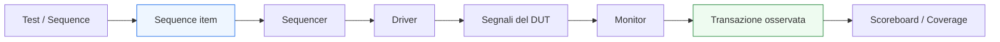
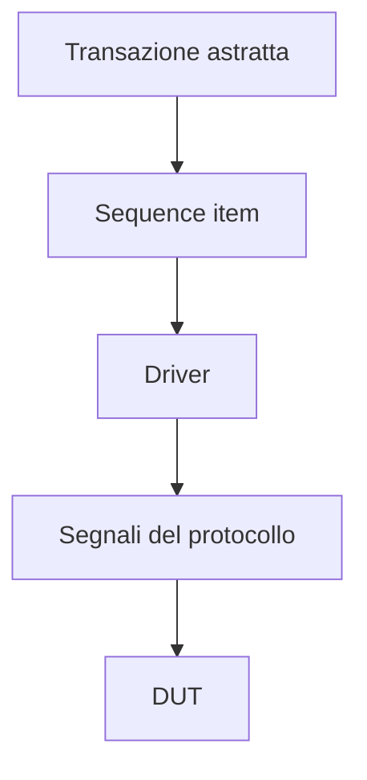

# `sequence item` in UVM

Dopo aver introdotto i **componenti principali di UVM**, il passo successivo naturale è affrontare il primo mattone davvero centrale del flusso transazionale: il **`sequence item`**. Questo componente è fondamentale perché rappresenta il punto in cui il testbench smette di ragionare direttamente in termini di segnali e inizia a ragionare in termini di **transazioni**.

Nella verifica RTL tradizionale, uno stimolo viene spesso pensato come:
- valori assegnati a un bus;
- handshake su `valid` / `ready`;
- sequenze di livelli sui segnali;
- eventi distribuiti nel tempo ciclo per ciclo.

In UVM, invece, si introduce un livello di astrazione intermedio molto importante: una **transazione** viene rappresentata come un oggetto che raccoglie in forma coerente ciò che il DUT deve ricevere o ciò che il monitor deve ricostruire. Il `sequence item` è proprio la forma standard con cui questo oggetto viene modellato.

Dal punto di vista metodologico, il `sequence item` è cruciale perché:
- rende più naturale descrivere lo stimolo;
- separa il protocollo a segnali dalla semantica della transazione;
- facilita il riuso delle sequence;
- aiuta driver, monitor e scoreboard a “parlare lo stesso linguaggio”;
- migliora la leggibilità del testbench.

Questa pagina introduce il `sequence item` in modo coerente con il resto della sezione UVM:
- con taglio didattico ma tecnico;
- senza appesantire troppo il discorso con dettagli di sintassi prematuri;
- mantenendo sempre il legame con interfacce reali, protocolli, timing, pipeline e verifica del DUT.

## 1. Perché serve un `sequence item`

La prima domanda importante è: perché UVM introduce un oggetto dedicato per rappresentare le transazioni?

### 1.1 Il limite del ragionare solo in termini di segnali
Se gli scenari di verifica vengono descritti direttamente manipolando:
- bus;
- handshake;
- clock;
- temporizzazione dei segnali;

allora ogni test tende a mescolare:
- intenzione funzionale;
- dettaglio del protocollo;
- dettaglio temporale;
- configurazione del DUT.

Questo rende più difficile:
- riusare gli stimoli;
- cambiare il protocollo senza riscrivere il test;
- mantenere separati scenario e implementazione del canale;
- condividere la stessa rappresentazione tra driver, monitor e scoreboard.

### 1.2 La risposta transazionale
Con il `sequence item`, invece, lo stimolo può essere descritto in modo più vicino al significato reale dell’operazione:
- una richiesta;
- un pacchetto;
- una lettura;
- una scrittura;
- una configurazione;
- una transazione di protocollo;
- un’operazione con dati e metadati.

### 1.3 Vantaggio metodologico
Questo significa che il testbench può parlare a livello di “cosa voglio far fare al DUT”, lasciando al driver il compito di tradurre quella intenzione nei segnali del protocollo.

## 2. Che cos’è un `sequence item`

Un `sequence item` è un oggetto che rappresenta una singola transazione o unità di stimolo nel testbench UVM.

### 2.1 Significato concettuale
Può rappresentare, a seconda del DUT e del protocollo:
- un comando;
- un trasferimento;
- una richiesta con payload;
- una risposta;
- una operazione di lettura o scrittura;
- un pacchetto con campi di controllo;
- una transazione interna di verifica.

### 2.2 Perché è chiamato “item”
Il termine “item” sottolinea che è il blocco elementare con cui una sequence costruisce lo stimolo.

### 2.3 Livello di astrazione
Il sequence item vive a un livello più alto dei segnali fisici, ma più basso dello scenario complessivo del test. Non descrive l’intero test, ma la singola unità significativa di traffico o azione.

## 3. `sequence item` e transazione

Uno dei punti più importanti da fissare è la relazione tra `sequence item` e concetto di **transazione**.

### 3.1 La transazione come oggetto logico
Una transazione è qualcosa che ha significato per il DUT o per il protocollo:
- invio di un dato;
- operazione con opcode;
- accesso a un registro;
- trasferimento su interfaccia stream;
- richiesta di configurazione.

### 3.2 Dal punto di vista del DUT
Il DUT non “vede” un sequence item. Vede segnali. Tuttavia, quei segnali nel loro insieme e nella loro evoluzione temporale rappresentano una certa transazione.

### 3.3 Dal punto di vista del testbench UVM
Il sequence item è il modo in cui il testbench rappresenta formalmente questa transazione:
- per generarla;
- per trasportarla tra sequence e driver;
- per ricostruirla nel monitor;
- per confrontarla nello scoreboard.

## 4. Differenza tra transazione e segnali

Per capire bene il ruolo del sequence item, è utile distinguere chiaramente tra:
- livello di transazione;
- livello di segnale.

### 4.1 Livello di segnale
Qui si ragiona in termini di:
- bus dati;
- handshake;
- clock;
- temporizzazione dei campi;
- validità del trasferimento.

### 4.2 Livello di transazione
Qui si ragiona in termini di:
- “invia questo pacchetto”
- “esegui questa operazione”
- “scrivi questo indirizzo con questo dato”
- “manda una richiesta con questi attributi”

### 4.3 Perché la distinzione è utile
Questa separazione rende più facile:
- costruire gli scenari di test;
- riusare gli stimoli;
- mantenere il driver specializzato sul protocollo;
- fare in modo che il monitor ricostruisca lo stesso oggetto logico osservato sul bus.

## 5. Che cosa contiene un `sequence item`

Un sequence item contiene i campi necessari a rappresentare la transazione di interesse.

### 5.1 Campi tipici
A seconda del caso, può contenere:
- payload dati;
- indirizzo;
- opcode;
- identificatore;
- flag di protocollo;
- bit di priorità;
- informazioni di controllo;
- metadati utili alla verifica.

### 5.2 Campi con significato architetturale
È importante che i campi del sequence item corrispondano a qualcosa di sensato rispetto al DUT e al protocollo. Non dovrebbero essere un semplice duplicato meccanico di tutti i segnali dell’interfaccia senza criterio.

### 5.3 Differenza rispetto alla lista porte
Le porte del DUT riflettono il livello fisico del protocollo. Il sequence item deve riflettere il livello logico della transazione.

## 6. `sequence item` e protocollo del DUT

Il sequence item non deve essere definito in astratto dal DUT, ma deve nascere dal significato delle sue interfacce.

### 6.1 DUT con interfaccia stream
Per un protocollo stream, un sequence item potrebbe rappresentare:
- dato;
- eventuale tag;
- segnali di fine pacchetto o controllo associato;
- attributi di validità logica del trasferimento.

### 6.2 DUT con interfaccia request/response
In questo caso il sequence item può rappresentare:
- tipo di richiesta;
- indirizzo;
- dato;
- campi di controllo;
- attributi di priorità o opzioni.

### 6.3 DUT configurabile o parametrico
Se il DUT ha:
- larghezze diverse;
- modalità operative;
- canali multipli;

allora il sequence item deve essere progettato in modo coerente con queste varianti.

## 7. Perché il `sequence item` aiuta il riuso

Uno dei grandi vantaggi del sequence item è che contribuisce fortemente al riuso del testbench.

### 7.1 Riuso delle sequence
Se la transazione è ben rappresentata, le sequence possono essere riusate su:
- test diversi;
- scenari diversi;
- configurazioni diverse;
- varianti del DUT con lo stesso protocollo.

### 7.2 Riuso del driver
Il driver può restare focalizzato sul protocollo, senza dover sapere in dettaglio perché una certa transazione sia stata generata.

### 7.3 Riuso del monitor e dello scoreboard
Anche monitor e scoreboard possono usare la stessa rappresentazione logica della transazione, facilitando:
- checking;
- coverage;
- logging;
- debug.

## 8. Sequence item come linguaggio comune del testbench

Il sequence item ha un ruolo metodologico molto forte: diventa il **linguaggio comune** tra parti diverse del testbench.

### 8.1 Sequence e driver
La sequence costruisce transazioni. Il driver le consuma.

### 8.2 Monitor e scoreboard
Il monitor osserva il protocollo e ricostruisce transazioni osservate, che vengono poi usate da scoreboard e collector di coverage.

### 8.3 Beneficio della rappresentazione comune
Avere una forma condivisa della transazione riduce la frammentazione concettuale del testbench e rende molto più naturale:
- confrontare atteso e osservato;
- raccogliere coverage per tipo di operazione;
- fare logging leggibile;
- isolare i problemi nel debug.

## 9. Relazione con il `driver`

Il driver è uno dei componenti più direttamente collegati al sequence item.

### 9.1 Che cosa riceve il driver
Il driver riceve un sequence item dal sequencer e lo interpreta come descrizione della transazione da applicare.

### 9.2 Che cosa fa il driver con quell’item
Lo traduce in:
- livelli dei segnali;
- ordine temporale;
- rispetto dell’handshake;
- sincronizzazione con il clock;
- comportamento coerente col protocollo.

### 9.3 Perché è utile questa separazione
Il driver può essere progettato una volta per il protocollo, mentre le sequence possono cambiare gli scenari costruendo item diversi.

## 10. Relazione con il `monitor`

Anche il monitor ha un legame molto importante con il sequence item.

### 10.1 Che cosa osserva il monitor
Il monitor vede i segnali reali del DUT.

### 10.2 Che cosa ricostruisce
A partire dai segnali osservati, ricostruisce transazioni logicamente equivalenti ai sequence item usati dal lato stimolo.

### 10.3 Perché questo è fondamentale
Questo permette al testbench di confrontare:
- ciò che si intendeva stimolare;
- ciò che il DUT ha effettivamente ricevuto o prodotto;
- ciò che il protocollo ha realmente realizzato.

## 11. Relazione con lo `scoreboard`

Lo scoreboard usa spesso il sequence item o una sua forma derivata per il confronto funzionale.

### 11.1 Atteso e osservato
Un risultato atteso può essere rappresentato come sequence item atteso, e il monitor può produrre sequence item osservato.

### 11.2 Vantaggio per il confronto
Confrontare oggetti transazionali è spesso più naturale che confrontare direttamente segnali a basso livello, soprattutto quando:
- esiste latenza;
- il protocollo è pipelined;
- il trasferimento è soggetto a handshake;
- il dato ha campi multipli.

### 11.3 Beneficio per la coverage
La stessa rappresentazione può essere usata per coverage di:
- opcodes;
- combinazioni di campi;
- tipi di transazione;
- sequenze rilevanti.

## 12. `sequence item` e randomizzazione

Uno dei motivi per cui UVM lavora con oggetti transazionali è che questi oggetti si prestano bene a una generazione più flessibile dello stimolo.

### 12.1 Perché è utile
Avere una rappresentazione strutturata della transazione permette di:
- costruire casi nominali;
- introdurre varianti;
- generare campi diversi;
- esercitare corner case;
- controllare meglio la distribuzione dei casi di test.

### 12.2 Significato metodologico
La randomizzazione non è il tema principale di questa pagina, ma è importante capire che il sequence item è il contenitore naturale su cui agiscono molte tecniche di generazione avanzata dello stimolo.

### 12.3 Disciplina necessaria
Perché questo sia utile, il sequence item deve essere progettato in modo pulito e semanticamente corretto.

## 13. `sequence item` e leggibilità del testbench

La qualità di un testbench UVM dipende molto dalla qualità del suo livello transazionale.

### 13.1 Oggetti con significato chiaro
Un sequence item ben progettato rende più leggibili:
- sequence;
- log;
- monitor;
- scoreboard;
- coverage.

### 13.2 Oggetti poco chiari
Se invece il sequence item è:
- troppo vicino ai segnali in modo meccanico;
- troppo confuso;
- troppo carico di dettagli inutili;
- poco coerente con il protocollo;

allora l’intero testbench diventa meno leggibile.

### 13.3 Impatto sul debug
Un bug espresso come:
- “transazione di tipo X con opcode Y e payload Z osservata in stato incoerente”
è spesso molto più chiaro di una diagnosi basata solo su singoli segnali e fronti di clock.

## 14. `sequence item` e DUT con più interfacce

In DUT più complessi possono esistere più tipi di transazioni.

### 14.1 Più canali, più item
Per esempio:
- item di richiesta;
- item di risposta;
- item di configurazione;
- item per canali stream diversi.

### 14.2 Perché è importante
Questo aiuta a mantenere coerente la modellazione del testbench rispetto alla struttura reale del DUT.

### 14.3 Collegamento con gli agent
Spesso ogni agent lavora con il proprio tipo di sequence item, coerente con la propria interfaccia o con il proprio protocollo.

## 15. Errori comuni nella definizione del `sequence item`

Alcuni errori ricorrono molto spesso quando si inizia a usare UVM.

### 15.1 Copiare meccanicamente tutti i segnali dell’interfaccia
Questo porta a oggetti poco semantici e troppo vicini al dettaglio fisico.

### 15.2 Rendere l’item troppo astratto
Se l’oggetto perde contatto con ciò che il protocollo realmente trasporta, il driver e il monitor diventano più difficili da progettare.

### 15.3 Mescolare significati diversi nello stesso item
Transazioni concettualmente distinte dovrebbero essere modellate con attenzione, senza creare contenitori troppo ambigui.

### 15.4 Ignorare latenza e protocollo
La rappresentazione transazionale deve essere coerente con il modo in cui il DUT riceve, elabora o restituisce l’informazione.

### 15.5 Dimenticare il riuso
Un item troppo legato a un singolo test o a una singola variante del DUT riduce molto il valore della metodologia.

## 16. Buone pratiche di modellazione

Per costruire bene un sequence item, alcune linee guida sono particolarmente utili.

### 16.1 Partire dal significato della transazione
Bisogna chiedersi:
- che cosa rappresenta davvero l’operazione per il DUT?
- quali campi sono semanticamente rilevanti?

### 16.2 Non confondere transazione e protocollo
Il protocollo definisce come la transazione viaggia sui segnali. Il sequence item definisce che cosa la transazione significa.

### 16.3 Progettare per il riuso
L’item dovrebbe poter essere usato da:
- sequence diverse;
- driver;
- monitor;
- scoreboard;
- coverage.

### 16.4 Mantenere chiarezza e proporzione
L’oggetto deve contenere abbastanza informazione da essere utile, ma non diventare un contenitore caotico di dettagli superflui.

### 16.5 Legarlo all’architettura del DUT
Se il DUT ha:
- opcodes;
- payload;
- tag;
- controllo di priorità;
- campi di configurazione;

allora il sequence item dovrebbe riflettere questi concetti in modo leggibile.

## 17. Collegamento con il resto della sezione

Questa pagina si collega direttamente a:
- **`uvm-components.md`**, che ha introdotto il ruolo generale dei componenti;
- **`uvm-architecture.md`**, che ha mostrato il flusso tra stimolo, DUT e checking.

Prepara inoltre in modo diretto le pagine successive:
- **`sequencer.md`**, che mostrerà come i sequence item vengano coordinati verso il driver;
- **`sequences.md`**, che spiegherà come costruire scenari a partire dagli item;
- **`driver.md`**, che tradurrà gli item in segnali;
- **`monitor.md`**, che ricostruirà item osservati dall’interfaccia;
- **`scoreboard.md`**, che userà queste transazioni per il confronto funzionale.

In questo senso, il sequence item è davvero il primo punto in cui l’architettura del testbench UVM diventa operativa.

## 18. In sintesi

Il `sequence item` è il mattone base del flusso transazionale in UVM. Rappresenta una singola operazione significativa per il DUT e consente al testbench di ragionare in termini più vicini alla semantica del protocollo e del comportamento del design, invece che solo in termini di segnali.

Il suo valore metodologico è molto forte perché:
- separa la transazione dal dettaglio del protocollo;
- rende più naturali le sequence;
- aiuta driver, monitor e scoreboard a condividere una rappresentazione comune;
- migliora riuso, coverage, logging e debug.

Capire bene il sequence item significa quindi capire il primo vero ponte tra:
- scenario di verifica;
- protocollo del DUT;
- checking funzionale;
- architettura del testbench UVM.

## Prossimo passo

Il passo più naturale ora è **`sequencer.md`**, perché dopo aver definito che cosa sia una transazione conviene capire:
- chi coordina il flusso dei sequence item
- come avviene il passaggio tra sequence e driver
- quale ruolo metodologico ha il sequencer
- perché è distinto sia dalle sequence sia dal driver
