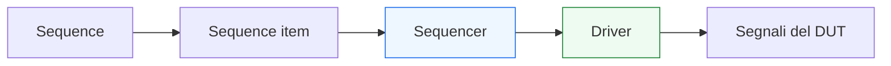
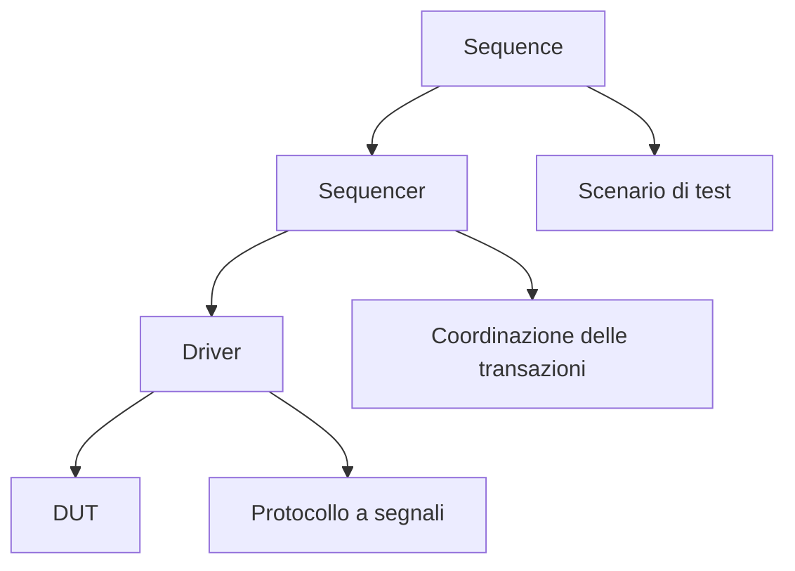

# `sequencer` in UVM

Dopo aver introdotto il **`sequence item`** come rappresentazione della transazione, il passo successivo naturale è capire quale componente coordina il flusso di queste transazioni verso il lato operativo del testbench. In UVM, questo ruolo è svolto dal **`sequencer`**.

Il `sequencer` è uno dei componenti fondamentali della metodologia, ma anche uno dei più fraintesi nelle prime fasi di apprendimento. Spesso viene descritto in modo troppo sintetico come “il blocco tra sequence e driver”, definizione che è corretta ma non sufficiente. Per capire davvero il suo ruolo bisogna chiarire:
- che cosa coordina;
- che cosa non fa;
- perché è distinto sia dalla `sequence` sia dal `driver`;
- come si inserisce nell’architettura dell’`agent`;
- quale vantaggio metodologico offre al testbench.

Dal punto di vista pratico, il sequencer è il componente che gestisce il flusso dei `sequence item` prodotti dalle sequence e li rende disponibili al driver in modo ordinato. Dal punto di vista metodologico, però, è ancora più importante: contribuisce a mantenere separati:
- il livello dello scenario di test;
- il livello della transazione;
- il livello del protocollo a segnali.

Questa pagina introduce il sequencer in modo coerente con il resto della sezione UVM:
- con taglio didattico ma tecnico;
- mettendo al centro il significato architetturale del componente;
- senza trasformarlo in una semplice lista di API;
- collegandolo sempre al flusso reale della verifica del DUT.

## 1. Perché serve un `sequencer`

La domanda fondamentale è: se la `sequence` genera transazioni e il `driver` le applica ai segnali del DUT, perché serve un componente intermedio?

### 1.1 Il problema da risolvere
In un ambiente di verifica ordinato, è utile distinguere:
- chi descrive lo scenario di test;
- chi rappresenta la transazione;
- chi decide il protocollo temporale sui segnali.

Senza questa separazione, la stessa entità finirebbe per dover:
- generare gli item;
- controllare il loro ordine;
- gestire l’interfaccia col driver;
- conoscere troppo del protocollo a basso livello.

### 1.2 La risposta UVM
Il sequencer è il componente che si occupa della **coordinazione del flusso transazionale**, mantenendo indipendenti:
- la logica delle sequence;
- la logica del driver.

### 1.3 Beneficio metodologico
Questa separazione rende più facile:
- riusare le sequence;
- mantenere il driver focalizzato sul protocollo;
- supportare più scenari di stimolo;
- costruire ambienti in cui diverse sequence possano essere orchestrate con maggiore controllo.

## 2. Che cos’è un `sequencer`

Il `sequencer` è il componente UVM che coordina il trasferimento dei `sequence item` dalle `sequence` al `driver`.

### 2.1 Significato essenziale
Il sequencer non inventa la transazione e non la traduce direttamente in segnali. Il suo ruolo è intermedio:
- riceve il flusso logico delle richieste generate dalle sequence;
- le gestisce nel contesto del testbench;
- le rende disponibili al driver nel modo atteso dal meccanismo UVM.

### 2.2 Livello di astrazione
Il sequencer lavora al livello delle transazioni, non dei segnali fisici.

### 2.3 Perché è importante capire questo punto
Se si pensa al sequencer come a una forma di “driver avanzato”, si perde il suo ruolo reale. Se si pensa al sequencer come a una “sequence passiva”, si perde altrettanto il senso della separazione.

## 3. Sequencer, sequence e driver: tre ruoli distinti

Uno dei punti più importanti è comprendere la differenza tra questi tre componenti.

### 3.1 La `sequence`
La sequence:
- descrive uno scenario;
- crea sequence item;
- definisce l’ordine logico delle operazioni;
- esprime l’intenzione del test.

### 3.2 Il `sequencer`
Il sequencer:
- coordina il flusso degli item;
- media tra sequence e driver;
- fornisce il canale di consegna delle transazioni;
- supporta l’organizzazione del traffico transazionale nell’agent.

### 3.3 Il `driver`
Il driver:
- riceve i sequence item;
- li converte in attività sui segnali;
- applica il protocollo del DUT;
- gestisce clock, handshake e temporizzazione dell’interfaccia.

### 3.4 Perché questa tripartizione è utile
La distinzione è fondamentale perché separa:
- **scenario**
- **coordinazione della transazione**
- **pilotaggio del protocollo**

Questa è una delle idee centrali dell’architettura UVM.

## 4. Dove si trova il `sequencer` nell’architettura UVM

Dal punto di vista della gerarchia del testbench, il sequencer si trova tipicamente all’interno di un `agent`.

### 4.1 Collocazione tipica
Un agent attivo contiene spesso:
- un `sequencer`
- un `driver`
- un `monitor`

### 4.2 Perché questa collocazione è naturale
L’agent rappresenta una interfaccia del DUT, e il sequencer appartiene a questo contesto perché coordina lo stimolo che attraversa proprio quella interfaccia.

### 4.3 Legame con il protocollo
Anche se il sequencer non guida direttamente i segnali, appartiene all’agent proprio perché è parte del meccanismo con cui il protocollo viene esercitato in modo transazionale.

## 5. Il flusso dei `sequence item`

Il modo più semplice per capire il sequencer è seguirne il ruolo nel flusso operativo.

### 5.1 Origine del flusso
Una `sequence` crea uno o più `sequence item` coerenti con uno scenario di verifica.

### 5.2 Passaggio al sequencer
Questi item vengono inviati al `sequencer`, che li coordina secondo il meccanismo UVM.

### 5.3 Consegna al driver
Il driver ottiene dal sequencer gli item da applicare all’interfaccia del DUT.

### 5.4 Perché questo flusso conta
Questo schema rende possibile cambiare:
- la sequence;
senza cambiare:
- il driver.

E viceversa, consente di adattare il driver a un protocollo senza cambiare il modo in cui i test descrivono gli scenari.

## 6. Il sequencer non conosce il protocollo a segnali

Questo è uno dei punti più importanti da fissare bene.

### 6.1 Che cosa non fa
Il sequencer non:
- guida `valid`, `ready`, `start`, `done`;
- decide i fronti di clock;
- applica livelli ai bus;
- interpreta direttamente il timing del protocollo.

### 6.2 Perché è importante
Queste responsabilità spettano al `driver`, che è il componente specializzato nell’interfaccia a segnali.

### 6.3 Vantaggio della separazione
Se il sequencer restasse coinvolto nei dettagli del protocollo:
- diventerebbe meno riusabile;
- si mescolerebbero livelli di astrazione diversi;
- il testbench perderebbe modularità.

## 7. Il sequencer non è la fonte dello scenario

Esiste un altro possibile equivoco: pensare che il sequencer sia il blocco che “decide” il test.

### 7.1 Chi decide lo scenario
La responsabilità dello scenario è della `sequence` e, a un livello ancora più alto, del `test`.

### 7.2 Che cosa fa allora il sequencer
Il sequencer fornisce il punto di raccordo e coordinamento attraverso cui la sequence invia le transazioni al lato operativo del testbench.

### 7.3 Perché questa distinzione è utile
Così si mantiene la giusta separazione:
- il test orchestra;
- la sequence descrive il traffico;
- il sequencer coordina la consegna;
- il driver applica il protocollo.

## 8. Sequencer e modularità del testbench

Il sequencer contribuisce in modo importante alla modularità dell’ambiente UVM.

### 8.1 Separazione del lato generativo da quello operativo
Grazie al sequencer:
- le sequence possono essere sviluppate e ragionate a livello di transazione;
- il driver può essere sviluppato e ragionato a livello di protocollo;
- l’agent rimane strutturato in modo ordinato.

### 8.2 Supporto al riuso
Un sequencer associato a un certo tipo di item e a un certo protocollo può supportare:
- più sequence diverse;
- più test;
- varianti di traffico sullo stesso DUT;
- ambienti riusati in contesti diversi.

### 8.3 Beneficio progettuale
La modularità non è un vantaggio astratto: migliora concretamente:
- leggibilità;
- manutenibilità;
- possibilità di estendere il testbench;
- stabilità della regressione.

## 9. Sequencer e agent attivi

Il ruolo del sequencer si capisce bene soprattutto negli agent attivi.

### 9.1 Agent attivo
Un agent attivo contiene la catena completa:
- sequence
- sequencer
- driver
- monitor

### 9.2 Agent passivo
In un agent passivo, tipicamente non serve il lato di stimolo e quindi:
- il monitor resta;
- il driver e il sequencer non sono necessari.

### 9.3 Perché questa distinzione è importante
Questo mostra bene che il sequencer appartiene al ramo del testbench dedicato alla **generazione e consegna dello stimolo**, non al ramo osservativo.

## 10. Sequencer e più sequence

Uno dei motivi per cui il sequencer è utile è che il testbench può dover gestire più sequence o più forme di traffico.

### 10.1 Non esiste un solo scenario
Nel tempo si vogliono spesso eseguire:
- test nominali;
- corner case;
- burst;
- sequenze con pause;
- traffico casuale;
- traffico controllato;
- scenari speciali di protocollo.

### 10.2 Il valore del sequencer
Il sequencer rende possibile coordinare questi flussi in modo ordinato, mantenendo stabile il lato driver.

### 10.3 Visione architetturale
In questo senso, il sequencer è una parte del “piano di controllo” del lato stimolo del testbench.

## 11. Sequencer e virtual sequence

Il ruolo del sequencer diventa ancora più interessante quando si passa a ambienti con più interfacce o più agent.

### 11.1 Più sequencer
Se il DUT ha:
- più canali;
- più protocolli;
- più interfacce attive;

allora ogni agent può avere il proprio sequencer.

### 11.2 Virtual sequence
Una `virtual sequence` può coordinare traffico su più sequencer contemporaneamente.

### 11.3 Perché è importante
Questo permette di descrivere scenari complessi che coinvolgono:
- ingressi e uscite interdipendenti;
- canali concorrenti;
- richieste e risposte su interfacce diverse;
- test di sottosistemi più ricchi.

Il sequencer è quindi un componente locale, ma inserito in una architettura che può scalare a livello di sistema.

## 12. Sequencer e DUT reale

Il sequencer ha senso solo se letto in relazione al DUT e al suo protocollo.

### 12.1 DUT semplice
Per un DUT con una sola interfaccia e traffico semplice, il sequencer può sembrare quasi “trasparente”, ma resta utile per mantenere la struttura corretta del testbench.

### 12.2 DUT con handshake
Se il protocollo prevede:
- `valid/ready`
- `start/done`
- burst
- backpressure

allora il driver deve gestire il dettaglio temporale, mentre il sequencer mantiene il flusso transazionale ordinato.

### 12.3 DUT con latenza e pipeline
In questi casi il sequencer resta sul lato stimolo, mentre monitor e scoreboard si occuperanno di osservare come la latenza interna del DUT modifica il comportamento nel tempo.

## 13. Sequencer e configurazione

Anche se il tema verrà approfondito più avanti, è utile notare che il sequencer partecipa alla configurabilità dell’ambiente.

### 13.1 Configurazione del flusso di stimolo
La configurazione può influenzare:
- tipo di sequence usata;
- modalità del traffico;
- politiche di arbitraggio;
- opzioni di comportamento del lato stimolo.

### 13.2 Separazione utile
L’ambiente può cambiare configurazione senza costringere a riscrivere il driver o a manipolare direttamente i segnali del DUT.

### 13.3 Vantaggio metodologico
Questo è coerente con la filosofia UVM: configurare e riusare piuttosto che riscrivere componenti per ogni test.

## 14. Sequencer e debug

Anche il sequencer contribuisce al debug, seppure in modo meno “visibile” del monitor o dello scoreboard.

### 14.1 Perché è utile nel debug
Aiuta a capire:
- quale item era in fase di consegna al driver;
- quale scenario di sequence era attivo;
- se il problema nasce nella generazione dello stimolo o nel suo pilotaggio;
- se il driver ha ricevuto la transazione corretta.

### 14.2 Distinguere i livelli del bug
Grazie alla presenza del sequencer, è più facile distinguere tra:
- bug nella sequence;
- bug nel driver;
- bug nel protocollo del DUT;
- bug nel checking.

### 14.3 Effetto sistemico
Più il testbench è ben separato nei suoi ruoli, più il debug risulta rapido e meno ambiguo.

## 15. Errori comuni nel comprendere o usare il `sequencer`

Alcuni errori ricorrono spesso nelle prime fasi.

### 15.1 Pensare che il sequencer guidi i segnali
No: il pilotaggio dei segnali è responsabilità del driver.

### 15.2 Pensare che il sequencer generi il test
No: la generazione dello scenario appartiene alle sequence e al test.

### 15.3 Vederlo come puro dettaglio tecnico
Anche se il sequencer può sembrare “invisibile” rispetto a driver e monitor, il suo ruolo metodologico è molto importante nella separazione delle responsabilità.

### 15.4 Mescolare troppe responsabilità nel driver
Se il driver assorbe anche logica che dovrebbe appartenere a sequence o sequencer, l’architettura del testbench si degrada rapidamente.

### 15.5 Non collegarlo al protocollo reale
Il sequencer non guida il protocollo, ma esiste proprio per rendere più pulita e coerente la relazione tra scenario transazionale e protocollo dell’agent.

## 16. Buone pratiche di lettura e progettazione

Per leggere e usare bene il sequencer, alcune linee guida sono particolarmente utili.

### 16.1 Pensarlo come coordinatore del flusso transazionale
Questa è la definizione più utile e meno fuorviante.

### 16.2 Tenerlo distinto dal driver
Il driver si occupa del protocollo a segnali; il sequencer si occupa del flusso degli item.

### 16.3 Tenerlo distinto dalle sequence
Le sequence descrivono lo scenario; il sequencer supporta la consegna strutturata delle transazioni.

### 16.4 Leggerlo nel contesto dell’agent
Il suo ruolo si capisce meglio se visto come parte del lato attivo di una interfaccia del DUT.

### 16.5 Considerarlo un componente di architettura, non solo di plumbing
Il sequencer non è solo un passaggio tecnico, ma una parte importante della disciplina UVM.

## 17. Collegamento con il resto della sezione

Questa pagina si collega direttamente a:
- **`sequence-item.md`**, che ha definito la forma della transazione;
- **`uvm-components.md`**, che ha introdotto il ruolo dei componenti principali;
- **`uvm-architecture.md`**, che ha descritto la struttura del testbench.

Prepara in modo naturale le pagine successive:
- **`sequences.md`**, che spiegherà come gli scenari di stimolo vengono costruiti;
- **`driver.md`**, che mostrerà come il driver consumi gli item dal sequencer;
- **`virtual-sequences.md`**, che estenderà il discorso a più agent e più canali;
- **`agent.md`**, che inquadrerà insieme sequencer, driver e monitor come parti della stessa interfaccia di verifica.

## 18. In sintesi

Il `sequencer` è il componente UVM che coordina il flusso dei `sequence item` tra `sequence` e `driver`. Non genera lo scenario di test e non guida direttamente i segnali del DUT, ma svolge un ruolo essenziale nella separazione tra:
- scenario transazionale;
- coordinazione del traffico;
- applicazione del protocollo.

Questa distinzione è uno dei motivi per cui UVM scala meglio dei testbench monolitici: sequence, sequencer e driver possono evolvere in modo più indipendente, con maggiore riuso e migliore leggibilità del banco di prova.

Capire il sequencer significa quindi capire uno dei meccanismi chiave con cui UVM organizza in modo disciplinato il lato attivo dello stimolo.

## Prossimo passo

Il passo più naturale ora è **`sequences.md`**, perché dopo aver chiarito la forma della transazione e il componente che ne coordina il flusso conviene spiegare:
- come si costruiscono gli scenari di stimolo
- come le sequence generano item
- come si esprime traffico nominale, corner case e pattern di protocollo
- come il livello transazionale del testbench prende davvero forma
