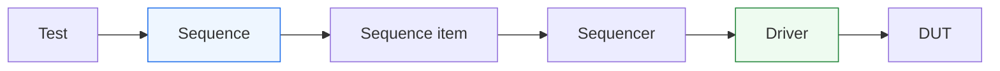
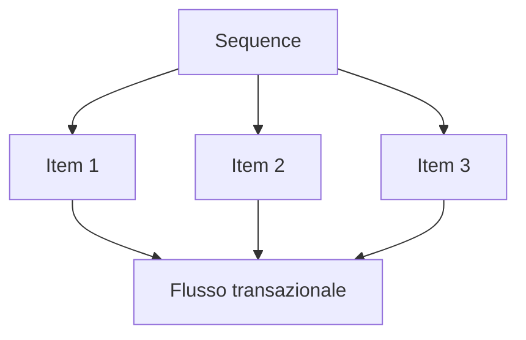

# `sequence` in UVM

Dopo aver introdotto il **`sequence item`** e il **`sequencer`**, il passo successivo naturale è affrontare il componente che descrive davvero lo **scenario di stimolo** nel testbench UVM: la **`sequence`**.

Se il `sequence item` rappresenta la singola transazione e il `sequencer` coordina il flusso di queste transazioni verso il driver, la `sequence` è il componente che decide **quali transazioni generare**, **in quale ordine**, **con quale logica** e **in quale forma di scenario**. In questo senso, la sequence è uno dei punti in cui UVM esprime più chiaramente la propria filosofia: separare il **significato funzionale dello stimolo** dal **dettaglio del protocollo a segnali**.

Dal punto di vista metodologico, le sequence sono molto importanti perché permettono di costruire scenari di verifica leggibili e riusabili:
- traffico nominale;
- burst;
- corner case;
- configurazioni speciali;
- pattern di protocollo;
- sequenze che forzano il DUT in situazioni interessanti;
- casi di reset, backpressure o latenza.

Questa pagina introduce il ruolo delle sequence in modo coerente con il resto della sezione UVM:
- con taglio didattico ma tecnico;
- centrato sul significato architetturale dello stimolo;
- attento al rapporto con DUT, protocollo, driver e sequencer;
- senza trasformare il tema in un semplice catalogo di meccanismi sintattici.

## 1. Che cos’è una `sequence`

Una `sequence` è il componente UVM che descrive **uno scenario di stimolo** a livello transazionale.

### 1.1 Significato essenziale
Una sequence stabilisce:
- quali transazioni generare;
- in quale ordine;
- con quali relazioni;
- con quali condizioni o variazioni;
- con quale logica di scenario.

### 1.2 Livello di astrazione
La sequence lavora a un livello più alto del protocollo a segnali. Non dovrebbe occuparsi direttamente di:
- `valid`
- `ready`
- handshake a singolo ciclo
- valori guidati sui bus ciclo per ciclo
- dettagli temporali del driver

Questi aspetti appartengono al driver.

### 1.3 Perché questo è importante
La sequence consente di descrivere l’intenzione del test in termini più vicini a:
- operazioni;
- transazioni;
- casi funzionali;
- scenari architetturali.

Questo rende il testbench più leggibile e più riusabile.

## 2. Sequence come descrizione dello scenario

Uno dei modi migliori per capire una sequence è vederla come la descrizione di uno **scenario di traffico** o di una **storia di verifica**.

### 2.1 Esempi di scenario
Una sequence può esprimere:
- invia una singola richiesta nominale;
- genera una serie di pacchetti consecutivi;
- alterna comandi di tipo diverso;
- crea burst con pause;
- produce combinazioni particolari di campi;
- forza il DUT a vedere traffico in condizioni di backpressure;
- genera richieste che stimolano transizioni specifiche della FSM.

### 2.2 Perché lo scenario non va nel driver
Il driver deve sapere **come** applicare una transazione ai segnali del DUT, ma non dovrebbe sapere **perché** quella transazione sia stata scelta o quale scenario di verifica stia realizzando.

### 2.3 Sequence come sede dell’intenzione
La sequence è quindi il luogo naturale in cui vive l’intenzione dello stimolo.

## 3. Relazione tra `sequence` e `sequence item`

Le sequence non esistono isolate: operano generando `sequence item`.

### 3.1 L’item come mattone
Ogni sequence costruisce uno o più item che rappresentano le transazioni elementari.

### 3.2 La sequence come organizzazione degli item
La sequence definisce:
- quanti item generare;
- in quale ordine;
- con quali vincoli;
- con quali pause logiche o pattern;
- con quali dipendenze tra un item e il successivo.

### 3.3 Perché la distinzione è utile
Questa separazione rende chiaro che:
- il `sequence item` rappresenta la singola operazione;
- la `sequence` rappresenta lo scenario che combina più operazioni.

## 4. Relazione tra `sequence` e `sequencer`

Il rapporto tra sequence e sequencer è uno dei punti più importanti della struttura UVM.

### 4.1 La sequence genera
La sequence costruisce il contenuto dello stimolo.

### 4.2 Il sequencer coordina
Il sequencer coordina il flusso degli item verso il driver.

### 4.3 Perché non coincidono
Se la stessa entità dovesse:
- definire lo scenario;
- arbitrare il flusso delle transazioni;
- gestire il collegamento al driver;

allora si perderebbe una parte importante della modularità della metodologia.

### 4.4 Vantaggio
La sequence resta focalizzata sulla logica di scenario, mentre il sequencer resta focalizzato sulla consegna ordinata degli item.

## 5. Sequence e driver: livelli diversi

Un altro chiarimento importante riguarda il rapporto tra sequence e driver.

### 5.1 La sequence non pilota i segnali
Una sequence non dovrebbe direttamente:
- guidare bus;
- aspettare handshake a basso livello;
- conoscere il dettaglio ciclo per ciclo del protocollo;
- manipolare direttamente il clock del DUT.

### 5.2 Il driver si occupa del protocollo
Il driver riceve gli item e li converte in attività sui segnali:
- valori sui bus;
- tempistiche del trasferimento;
- rispetto delle regole `valid/ready`;
- sincronizzazione con il clock;
- attesa delle condizioni di protocollo.

### 5.3 Beneficio metodologico
Grazie a questa separazione:
- le sequence possono essere più astratte e leggibili;
- il driver può essere riusato per scenari molto diversi;
- il DUT può essere stimolato in modo più sistematico e manutenibile.

## 6. Sequence nominali e sequence specializzate

Una delle grandi utilità di UVM è che le sequence possono essere usate per rappresentare classi diverse di scenari.

### 6.1 Sequence nominali
Rappresentano il traffico atteso in condizioni normali:
- una transazione corretta;
- un flusso regolare di richieste;
- burst semplici;
- pattern tipici d’uso del DUT.

### 6.2 Sequence di corner case
Servono a generare:
- campi limite;
- combinazioni rare;
- casi di protocollo poco frequenti;
- pattern difficili ma architetturalmente importanti.

### 6.3 Sequence di stress
Possono produrre:
- traffico intenso;
- sequenze lunghe;
- burst ravvicinati;
- variazioni rapide di stimolo;
- combinazioni che mettono sotto pressione il DUT o il protocollo.

### 6.4 Sequence di scenario
Possono essere costruite per verificare:
- reset durante attività;
- comportamento con backpressure;
- saturazione di una pipeline;
- particolari transizioni della FSM;
- protocollo in configurazioni non banali.

## 7. Sequence e riuso

Uno dei grandi motivi per cui le sequence sono così importanti è il loro contributo al riuso del testbench.

### 7.1 Riuso dello scenario
Una sequence ben progettata può essere:
- richiamata da più test;
- usata in più regressioni;
- combinata con altre sequence;
- adattata a configurazioni diverse dello stesso DUT.

### 7.2 Riuso senza toccare il driver
Poiché la sequence lavora a livello transazionale, si può cambiare lo scenario senza cambiare:
- il driver;
- il monitor;
- lo scoreboard;
- l’agent di base.

### 7.3 Beneficio di manutenzione
Questo riduce la duplicazione e rende più semplice:
- estendere la verifica;
- mantenere i test nel tempo;
- aggiungere corner case senza riscrivere l’infrastruttura.

## 8. Sequence e leggibilità del testbench

Le sequence sono uno dei punti in cui la qualità del testbench diventa molto visibile.

### 8.1 Sequence leggibili
Una buona sequence dovrebbe essere leggibile come descrizione di uno scenario:
- che cosa viene inviato;
- in quale ordine;
- con quale significato;
- con quali variazioni o condizioni.

### 8.2 Sequence poco leggibili
Se invece una sequence:
- contiene troppo dettaglio di protocollo;
- manipola troppi aspetti a basso livello;
- mescola generazione e timing fisico;
- dipende troppo da dettagli locali del DUT;

allora perde una parte importante del suo valore architetturale.

### 8.3 Sequence come documentazione del traffico
Una sequence ben costruita può diventare quasi una documentazione eseguibile degli scenari che la verifica vuole coprire.

## 9. Sequence e protocollo del DUT

Anche se la sequence non guida direttamente i segnali, deve restare fortemente coerente con il significato del protocollo del DUT.

### 9.1 Il protocollo resta sullo sfondo
La sequence dovrebbe sapere abbastanza del protocollo da generare transazioni sensate, ma non tanto da replicare il lavoro del driver.

### 9.2 Per esempio
Per un DUT con interfaccia stream:
- la sequence può descrivere pacchetti o parole da inviare;
- non dovrebbe decidere direttamente quando alzare `valid` sul fronte di clock.

Per un protocollo request/response:
- la sequence può costruire richieste con certi campi;
- non dovrebbe pilotare manualmente i singoli segnali del bus.

### 9.3 Equilibrio corretto
La sequence deve essere:
- abbastanza vicina all’architettura da avere significato;
- abbastanza distante dal protocollo da restare riusabile.

## 10. Sequence e randomizzazione

Le sequence sono uno dei punti naturali in cui la verifica UVM può introdurre varietà e ampiezza nello stimolo.

### 10.1 Perché è utile
Attraverso le sequence si possono generare:
- pattern controllati;
- combinazioni diverse di item;
- traffico più ricco;
- casi non banali;
- successioni difficili da scrivere a mano direttamente a livello di segnali.

### 10.2 Livello giusto per la variabilità
La variabilità dello stimolo è più naturale a livello di sequence e item che non a livello di pilotaggio diretto dei segnali.

### 10.3 Disciplina necessaria
La varietà ha valore solo se:
- resta coerente con la specifica del DUT;
- è osservabile;
- può essere verificata da checker, scoreboard e coverage;
- non trasforma il test in un generatore caotico di traffico poco interpretabile.

## 11. Sequence e casi architetturalmente significativi

Una buona sequence dovrebbe nascere dalle esigenze di verifica del DUT, non da un uso astratto della metodologia.

### 11.1 DUT con FSM
Le sequence possono essere progettate per:
- esercitare transizioni;
- forzare percorsi rari;
- verificare recovery;
- attraversare più stati in ordine specifico.

### 11.2 DUT con pipeline
Le sequence possono generare:
- traffico continuo;
- burst ravvicinati;
- casi con accumulo di dati in volo;
- sequenze che interagiscono con stall o flush.

### 11.3 DUT con handshake
Le sequence possono essere pensate per collaborare con testbench e configurazioni che producano:
- pressione sul protocollo;
- condizioni di attesa;
- transazioni consecutive;
- casi in cui la latenza del DUT diventa rilevante.

## 12. Sequence semplici e sequence complesse

Non tutte le sequence hanno lo stesso livello di complessità.

### 12.1 Sequence elementari
Possono descrivere:
- una singola richiesta;
- un burst piccolo;
- un caso di test puntuale.

### 12.2 Sequence più ricche
Possono includere:
- logica di scelta tra item;
- combinazioni di pattern;
- gestione di casi speciali;
- coordinamento di più fasi del traffico.

### 12.3 Perché è importante saperle distinguere
In un ambiente di verifica sano, conviene costruire una libreria di sequence:
- semplici, per i casi base e il riuso;
- più ricche, per scenari articolati;
- composte, quando serve esprimere un comportamento più vicino a una campagna di verifica.

## 13. Sequence e test

La relazione tra test e sequence è importante per capire la gerarchia della verifica UVM.

### 13.1 Il test decide lo scenario generale
Il test stabilisce:
- quale ambiente usare;
- quale configurazione attivare;
- quali sequence lanciare;
- quali obiettivi di verifica perseguire.

### 13.2 La sequence esegue la logica di stimolo
La sequence realizza concretamente il traffico transazionale necessario allo scenario scelto dal test.

### 13.3 Perché questa separazione è utile
Il test resta al livello della regia globale, mentre la sequence resta al livello dello stimolo operativo.

## 14. Sequence e coverage

Le sequence hanno anche un forte impatto sulla coverage.

### 14.1 Copertura dei casi nominali
Le sequence più semplici garantiscono che il DUT venga esercitato nei percorsi base.

### 14.2 Copertura dei corner case
Sequence dedicate possono essere costruite per colpire:
- transizioni FSM rare;
- combinazioni di campi particolari;
- scenari di protocollo meno frequenti;
- casi di latenza o backpressure interessanti.

### 14.3 Coverage guidata dalle sequence
Uno dei modi più naturali per migliorare la coverage è proprio arricchire la libreria delle sequence.

## 15. Sequence e debug

Le sequence aiutano molto anche nel debug, se sono ben progettate.

### 15.1 Scenario leggibile
Quando una sequence è chiara, è più facile capire:
- che cosa il testbench ha cercato di fare;
- quale transazione è stata generata;
- in quale ordine;
- con quale intento funzionale.

### 15.2 Distinguere i livelli del bug
Un fallimento può dipendere da:
- item generato male;
- sequence errata;
- driver che applica male il protocollo;
- DUT che risponde in modo scorretto;
- monitor o scoreboard che interpretano male il risultato.

Una sequence ordinata aiuta a isolare meglio questi livelli.

### 15.3 Valore diagnostico
Una libreria di sequence ben nominate e ben strutturate rende la regressione più leggibile e il fallimento dei test più interpretabile.

## 16. Errori comuni

Alcuni errori ricorrono spesso quando si inizia a usare le sequence.

### 16.1 Mettere troppo protocollo nella sequence
Questo rende la sequence meno astratta e meno riusabile.

### 16.2 Rendere la sequence troppo astratta e vaga
Se perde contatto con il significato reale del DUT e del protocollo, diventa poco utile per la verifica concreta.

### 16.3 Confondere test e sequence
Il test e la sequence operano a livelli diversi e non dovrebbero sovrapporsi troppo.

### 16.4 Scrivere solo sequence molto complesse
Senza una base di sequence semplici e riusabili, il testbench diventa presto difficile da mantenere.

### 16.5 Non collegare le sequence agli obiettivi di coverage
Le sequence dovrebbero essere guidate anche da ciò che manca alla verifica, non solo da ciò che è facile scrivere.

## 17. Buone pratiche di modellazione

Per costruire bene le sequence in UVM, alcune linee guida sono particolarmente utili.

### 17.1 Pensare in termini di scenario, non di segnali
La sequence dovrebbe descrivere che cosa si vuole far accadere, non il dettaglio fisico del protocollo.

### 17.2 Partire da sequence semplici
Le sequence semplici sono fondamentali come mattoni per scenari più ricchi.

### 17.3 Progettare per il riuso
Una buona sequence dovrebbe poter essere richiamata o adattata in più test.

### 17.4 Tenerla coerente con il DUT
Le sequence devono riflettere:
- protocollo;
- modalità operative;
- corner case;
- architettura del blocco.

### 17.5 Usarla per migliorare la coverage
Una buona libreria di sequence è uno dei modi più efficaci per ampliare la qualità della verifica.

## 18. Collegamento con il resto della sezione

Questa pagina si collega direttamente a:
- **`sequence-item.md`**, che ha introdotto il mattone elementare della transazione;
- **`sequencer.md`**, che coordina il flusso degli item verso il driver;
- **`uvm-components.md`**, che ha chiarito i ruoli generali dei componenti UVM.

Prepara inoltre in modo naturale le pagine successive:
- **`virtual-sequences.md`**, per coordinare più sequencer o più canali;
- **`driver.md`**, che mostrerà come la transazione venga applicata ai segnali del DUT;
- **`test.md`**, che chiarirà il livello superiore della regia dello scenario;
- **`agent.md`**, che integrerà sequencer, driver e monitor come struttura di interfaccia.

## 19. In sintesi

La `sequence` è il componente UVM che descrive lo scenario di stimolo a livello transazionale. Non guida direttamente i segnali del DUT e non si occupa del dettaglio del protocollo: il suo ruolo è generare `sequence item` in modo coerente con gli obiettivi della verifica.

Questo la rende uno dei componenti più importanti della metodologia, perché è il punto in cui il testbench esprime:
- traffico nominale;
- corner case;
- pattern di protocollo;
- scenari architetturalmente significativi.

Capire bene le sequence significa capire come UVM riesca a separare in modo efficace:
- intenzione del test;
- struttura della transazione;
- coordinazione del flusso;
- pilotaggio del protocollo.

## Prossimo passo

Il passo più naturale ora è **`virtual-sequences.md`**, perché dopo aver chiarito le sequence normali conviene spiegare come si coordinano scenari che coinvolgono:
- più agent
- più interfacce
- più sequencer
- flussi concorrenti o correlati
- casi di verifica più vicini a subsystem e SoC
