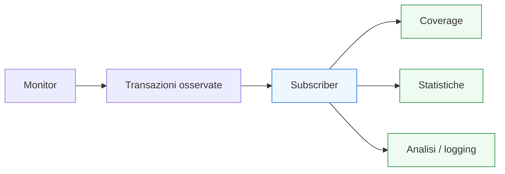

# `subscriber` in UVM

Dopo aver introdotto **scoreboard** e **reference model**, il passo successivo naturale è affrontare un altro componente molto importante del lato analitico del testbench UVM: il **`subscriber`**.

Se il monitor osserva il DUT e produce transazioni, e se lo scoreboard usa queste informazioni per il confronto funzionale, il subscriber è il componente che consuma eventi o transazioni osservate per scopi di:
- coverage;
- statistiche;
- analisi;
- logging specializzato;
- osservazione strutturata del comportamento.

Dal punto di vista metodologico, il subscriber è molto utile perché permette di aggiungere capacità di analisi al testbench senza:
- sovraccaricare il monitor;
- sporcare lo scoreboard con compiti che non gli appartengono;
- mettere logica di coverage o statistiche nel test;
- creare accoppiamenti troppo forti tra i componenti dell’environment.

In questo senso, il subscriber è uno dei componenti che meglio incarnano la filosofia UVM della separazione delle responsabilità. Non guida il DUT, non osserva direttamente i segnali, non decide il verdetto funzionale, ma usa in modo strutturato i dati osservati per arricchire la qualità della verifica.

Questa pagina introduce il subscriber con un taglio coerente con il resto della sezione UVM:
- didattico ma tecnico;
- centrato sul suo ruolo architetturale;
- attento al rapporto con monitor, TLM, coverage e debug;
- orientato a far capire perché il subscriber è un ottimo punto di estensione dell’ambiente di verifica.

## 1. Che cos’è un `subscriber`

Un `subscriber` è un componente UVM che riceve transazioni o eventi, tipicamente da connessioni TLM, e li usa per scopi di analisi.

### 1.1 Significato essenziale
Il subscriber:
- consuma transazioni osservate;
- non guida l’interfaccia del DUT;
- non ricostruisce direttamente i segnali;
- non esegue il confronto principale atteso/osservato;
- usa i dati ricevuti per analisi, coverage o raccolta di informazione.

### 1.2 Livello di astrazione
Lavora a livello transazionale, come altri componenti UVM analitici.

### 1.3 Perché è importante
Permette di estendere il testbench con capacità di osservazione strutturata senza compromettere la pulizia architetturale degli altri blocchi.

## 2. Perché serve un `subscriber`

La domanda utile è: se esistono già monitor e scoreboard, perché introdurre anche un subscriber?

### 2.1 Il problema della sovrapposizione di ruoli
Senza subscriber, si rischia di mettere:
- coverage nel monitor;
- statistiche nello scoreboard;
- logging specializzato nel test;
- analisi locali in componenti che hanno già altri compiti.

### 2.2 La risposta UVM
Il subscriber è un consumatore dedicato di transazioni osservate, pensato per prendere in carico funzioni analitiche che non appartengono né al monitor né allo scoreboard.

### 2.3 Beneficio metodologico
Questo migliora:
- modularità;
- estendibilità;
- riuso;
- leggibilità dell’environment;
- qualità del debug e della coverage.

## 3. Subscriber e monitor: ruoli diversi

È molto importante distinguere bene monitor e subscriber.

### 3.1 Il monitor osserva
Il monitor:
- legge i segnali del DUT;
- interpreta il protocollo;
- ricostruisce le transazioni.

### 3.2 Il subscriber consuma
Il subscriber:
- riceve le transazioni già ricostruite;
- le usa per analisi aggiuntiva;
- non ha bisogno di conoscere direttamente i segnali RTL.

### 3.3 Perché separarli
Questa separazione rende il monitor più riusabile e impedisce che diventi un contenitore eccessivo di checking, coverage e logging.

## 4. Subscriber e scoreboard: ruoli diversi

Anche la distinzione tra subscriber e scoreboard va chiarita bene.

### 4.1 Lo scoreboard confronta
Il suo ruolo principale è decidere se il comportamento osservato corrisponde a quello atteso.

### 4.2 Il subscriber analizza
Il subscriber invece:
- non è centrato sul verdetto funzionale globale;
- raccoglie informazioni;
- costruisce coverage;
- accumula statistiche;
- supporta analisi locali.

### 4.3 Perché è utile tenerli separati
Lo scoreboard resta focalizzato sul checking, mentre il subscriber resta focalizzato sull’analisi dei dati osservati.

## 5. Subscriber e connessioni TLM

Il subscriber è uno dei componenti che più chiaramente mostra il valore delle connessioni TLM in UVM.

### 5.1 Come riceve i dati
Riceve tipicamente:
- transazioni osservate dai monitor;
- eventi derivati;
- informazioni pubblicate da altri componenti del testbench.

### 5.2 Perché il TLM è naturale qui
Il subscriber non deve conoscere:
- i segnali del DUT;
- i dettagli del protocollo a basso livello;
- la gerarchia interna dell’agent.

Gli basta ricevere un oggetto significativo a livello transazionale.

### 5.3 Beneficio
Questo rende il subscriber estremamente modulare e facile da aggiungere o rimuovere dall’ambiente.

## 6. Usi tipici del `subscriber`

Il subscriber può essere impiegato in molti modi.

### 6.1 Coverage funzionale
Uno degli usi più comuni è raccogliere coverage su:
- tipi di transazione;
- combinazioni di campi;
- modalità operative;
- pattern di protocollo;
- sequenze significative di eventi.

### 6.2 Statistiche
Può accumulare informazioni come:
- conteggio delle transazioni;
- frequenza di certi opcodes;
- distribuzione di eventi;
- numero di stall o backpressure osservati;
- rapporti tra tipi diversi di traffico.

### 6.3 Logging specializzato
Può produrre log mirati su:
- eventi rari;
- pattern di protocollo;
- casi di debug;
- condizioni che non costituiscono errore ma meritano osservazione.

### 6.4 Analisi locale
Può essere usato per controlli o osservazioni che non sono il checking funzionale principale, ma che hanno valore per capire il comportamento del DUT.

## 7. Subscriber e coverage

La coverage è probabilmente il caso d’uso più tipico del subscriber.

### 7.1 Perché è naturale
La coverage dovrebbe lavorare su transazioni osservate, non solo su ciò che il testbench ha tentato di generare.

### 7.2 Che cosa può coprire
Per esempio:
- valori o range di campi;
- combinazioni di attributi;
- transizioni tra tipi di transazione;
- presenza di burst;
- eventi di backpressure;
- pattern di reset o di protocollo.

### 7.3 Perché non metterla nel monitor
Il monitor dovrebbe restare focalizzato sull’osservazione e sulla ricostruzione. Spostare coverage nel subscriber migliora la separazione dei ruoli.

## 8. Subscriber e statistiche del testbench

Un altro uso molto utile del subscriber è la raccolta di statistiche.

### 8.1 Perché è utile
Non tutto ciò che interessa alla verifica è un semplice pass/fail. A volte è utile sapere:
- quante transazioni di un certo tipo sono passate;
- se certi pattern sono rari o frequenti;
- come cambia il traffico tra test diversi;
- se un protocollo entra spesso in stall;
- quanto certi scenari si verificano davvero.

### 8.2 Perché farlo in un subscriber
Questo evita di:
- appesantire il monitor;
- sporcare il test;
- compromettere la chiarezza dello scoreboard.

### 8.3 Beneficio
Le statistiche diventano così una parte integrata ma ordinata del testbench.

## 9. Subscriber e debug

Il subscriber può essere molto utile anche in debug.

### 9.1 Come aiuta
Può raccogliere:
- pattern sospetti;
- eventi rari;
- occorrenze di condizioni particolari;
- tracce sintetiche di sequenze osservate;
- informazioni di contesto utili ai mismatch.

### 9.2 Perché è meglio di un logging disperso
Il logging “sparso” in molti componenti tende a diventare rumoroso. Un subscriber dedicato può concentrarsi su ciò che interessa davvero osservare.

### 9.3 Beneficio metodologico
Il debug diventa più strutturato e meno dipendente da messaggi informali disseminati nel testbench.

## 10. Subscriber e DUT reale

Il valore del subscriber si capisce bene anche rispetto a DUT reali.

### 10.1 DUT con protocolli semplici
Anche in DUT piccoli, un subscriber può raccogliere coverage o statistiche con grande pulizia.

### 10.2 DUT con pipeline e latenza
Può essere utile per misurare:
- burst;
- ritmi di traffico;
- eventi di stall;
- distribuzione delle operazioni;
- frequenza di pattern rilevanti.

### 10.3 DUT con più interfacce
Si possono avere subscriber distinti per:
- input;
- output;
- configurazione;
- eventi globali del sistema.

Questo rende il testbench molto più osservabile.

## 11. Subscriber e DUT con più agent

Quando il DUT ha più agent, i subscriber possono essere distribuiti o aggregati in modi diversi.

### 11.1 Subscriber locali
Possono essere associati a un flusso specifico:
- agent input;
- agent output;
- agent config.

### 11.2 Subscriber di environment
Possono anche operare a livello environment, dove osservano:
- più flussi;
- combinazioni di eventi;
- scenari sistemici;
- coverage globale.

### 11.3 Perché è utile
Questo permette al testbench di crescere in profondità senza perdere struttura.

## 12. Subscriber e riuso

Il subscriber è uno dei componenti più facili da rendere riusabili.

### 12.1 Perché
Se riceve transazioni ben definite via TLM:
- non dipende direttamente dai segnali del DUT;
- non dipende dalla forma del driver;
- non dipende troppo dallo scenario specifico del test.

### 12.2 Riuso pratico
Può essere riusato in:
- test diversi;
- ambienti diversi;
- regressioni;
- block-level e subsystem-level;
- modalità attiva o passiva degli agent.

### 12.3 Beneficio architetturale
Questo lo rende una leva molto forte per estendere l’analisi del testbench nel tempo.

## 13. Subscriber ed environment

Il subscriber vive molto naturalmente nell’environment.

### 13.1 Perché lì
L’environment è il livello in cui vengono integrati:
- monitor;
- scoreboard;
- reference model;
- coverage;
- analisi.

### 13.2 Ruolo nell’architettura
Il subscriber è uno dei consumatori naturali delle transazioni osservate prodotte dai monitor.

### 13.3 Distinzione importante
L’environment integra il subscriber, ma il subscriber mantiene un ruolo specifico e autonomo.

## 14. Subscriber e configurazione

Il subscriber si presta bene alla configurazione dell’ambiente.

### 14.1 Cosa si può configurare
Per esempio:
- attivazione o disattivazione della coverage;
- livello di verbosità del logging;
- tipi di statistiche raccolte;
- modalità leggere o estese di analisi;
- subscriber specializzati per debug o regressione.

### 14.2 Perché è utile
Questo rende il testbench più flessibile:
- test leggeri per smoke run;
- raccolta coverage completa in regressione;
- logging mirato in debug.

### 14.3 Collegamento con factory e configurazione
Il subscriber è uno dei componenti che più beneficiano della natura configurabile e sostituibile di UVM.

## 15. Subscriber e phasing

Anche il subscriber partecipa al ciclo di vita ordinato del testbench UVM.

### 15.1 Build
Viene creato come parte dell’environment.

### 15.2 Connect
Viene collegato ai produttori delle transazioni osservate.

### 15.3 Run
Riceve e analizza i dati durante la simulazione.

### 15.4 Check / report
Può contribuire alla sintesi dei risultati, della coverage o delle statistiche raccolte.

### 15.5 Perché conta
Anche questo conferma che il subscriber non è un’aggiunta “laterale”, ma una parte vera dell’architettura del testbench.

## 16. Errori comuni

Alcuni errori ricorrono spesso nell’uso del subscriber.

### 16.1 Mettere coverage nel monitor
Questo rende il monitor troppo carico e meno riusabile.

### 16.2 Usare il subscriber come scoreboard mascherato
Se il subscriber inizia a fare il confronto principale atteso/osservato, si perde chiarezza metodologica.

### 16.3 Accoppiarlo troppo a un singolo test
Un buon subscriber dovrebbe servire l’analisi, non un solo scenario locale.

### 16.4 Non progettare bene l’oggetto transazionale in ingresso
Il subscriber lavora bene se riceve transazioni pulite e semanticamente significative.

### 16.5 Vederlo come accessorio marginale
In realtà è uno degli strumenti migliori per far crescere coverage e osservabilità del testbench.

## 17. Buone pratiche di modellazione

Per progettare bene un subscriber UVM, alcune linee guida sono particolarmente utili.

### 17.1 Tenerlo focalizzato sull’analisi
Non deve sostituirsi a monitor o scoreboard.

### 17.2 Farlo lavorare su transazioni osservate pulite
La qualità del subscriber dipende molto dalla qualità dell’output del monitor.

### 17.3 Usarlo per coverage, statistiche e logging mirato
Questi sono i suoi ambiti più naturali.

### 17.4 Progettarlo per il riuso
Dovrebbe poter vivere in ambienti diversi con minima dipendenza dallo scenario.

### 17.5 Integrarlo bene nell’environment
La sua utilità cresce quando il flusso TLM dell’ambiente è chiaro e ben organizzato.

## 18. Collegamento con il resto della sezione

Questa pagina si collega direttamente a:
- **`monitor.md`**, che produce le transazioni osservate;
- **`tlm-connections.md`**, che mostra come queste transazioni vengano distribuite;
- **`environment.md`**, che è il contenitore naturale dei subscriber;
- **`coverage-uvm.md`**, che svilupperà in modo esplicito il tema della coverage in ambiente UVM;
- **`debug-uvm.md`**, perché il subscriber può avere un ruolo importante nel logging strutturato e nell’analisi dei casi critici.

Prepara inoltre molto bene la lettura di:
- **`test.md`**
- **`test-configuration.md`**
- **`coverage-uvm.md`**
- **`regression.md`**

perché tutti questi temi possono usare o beneficiare dei dati raccolti dai subscriber.

## 19. In sintesi

Il `subscriber` è un componente UVM che consuma transazioni o eventi osservati per svolgere compiti di analisi, tipicamente:
- coverage;
- statistiche;
- logging;
- osservazione strutturata del comportamento.

Il suo valore sta nel mantenere separati:
- osservazione del protocollo;
- confronto funzionale;
- analisi aggiuntiva del traffico e del comportamento del DUT.

Capire bene il subscriber significa capire come UVM permetta di estendere il testbench in modo modulare e pulito, senza compromettere la chiarezza di monitor e scoreboard.

## Prossimo passo

Il passo più naturale ora è **`test.md`**, perché dopo aver completato il ramo dell’environment conviene tornare al livello superiore della regia della verifica e chiarire:
- che cos’è un test UVM
- quale ruolo ha rispetto a environment e sequence
- come seleziona scenario e configurazione
- perché non va confuso con il resto dell’infrastruttura del testbench
