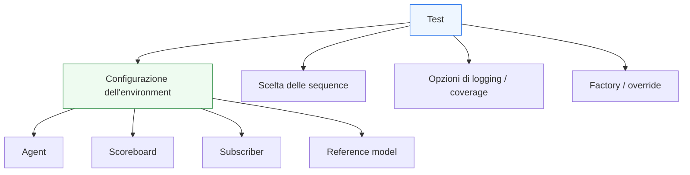

# Configurazione dei test in UVM

Dopo aver introdotto il ruolo del **`test`** in UVM, il passo successivo naturale è chiarire come il test configuri concretamente l’ambiente di verifica. Questa pagina affronta proprio questo punto: **come un test UVM controlla il comportamento dell’environment e dei suoi componenti senza dover riscrivere l’infrastruttura di base**.

Questo tema è molto importante perché uno dei punti di forza di UVM è la possibilità di riusare la stessa architettura di testbench in molti scenari diversi. Per ottenere questo risultato, però, non basta avere componenti ben separati: serve anche un modo ordinato per dire, di volta in volta:
- quali agent sono attivi o passivi;
- quali sequence vanno lanciate;
- quali opzioni di coverage o logging abilitare;
- quali parametri di scenario usare;
- quali versioni di certi componenti sostituire o specializzare;
- quali modalità di verifica sono appropriate per il test corrente.

Dal punto di vista metodologico, la configurazione del test è il punto in cui si incontrano:
- riuso dell’environment;
- flessibilità dello scenario;
- configurabilità dei componenti;
- phasing;
- factory;
- regressione.

Questa pagina introduce il tema in modo coerente con il resto della sezione UVM:
- didattico ma tecnico;
- centrato sul significato architetturale della configurazione;
- attento alla separazione tra infrastruttura stabile e variabilità del test;
- orientato a chiarire come i test possano restare potenti senza diventare caotici.

## 1. Perché serve configurare i test

La prima domanda importante è: perché non costruire direttamente un testbench diverso per ogni scenario?

### 1.1 Il limite dell’approccio rigido
Se ogni scenario richiedesse:
- un environment diverso;
- agent riscritti;
- varianti duplicate del testbench;
- scoreboards separati;
- componenti specifici per ogni caso;

allora la verifica diventerebbe rapidamente:
- difficile da mantenere;
- poco riusabile;
- fragile alle modifiche;
- costosa da far crescere.

### 1.2 La risposta UVM
UVM punta invece a:
- mantenere stabile l’infrastruttura di base;
- rendere variabile lo scenario;
- controllare il comportamento dei componenti tramite configurazione;
- introdurre override o specializzazioni solo quando servono davvero.

### 1.3 Beneficio metodologico
La configurazione dei test permette quindi di combinare:
- stabilità;
- riuso;
- flessibilità;
- leggibilità.

## 2. Che cosa significa “configurare un test”

Configurare un test significa decidere come l’ambiente di verifica dovrà comportarsi in quello scenario specifico.

### 2.1 Livello della configurazione
La configurazione può riguardare:
- la struttura dell’environment;
- la modalità degli agent;
- la scelta delle sequence;
- le opzioni di coverage;
- il livello di logging;
- i parametri funzionali del testbench;
- il comportamento di componenti specializzati.

### 2.2 Non è solo “passare parametri”
Configurare non significa solo assegnare qualche valore. Significa modellare il contesto operativo del test.

### 2.3 Perché questo è importante
In UVM, la configurazione è una parte fondamentale della separazione tra:
- infrastruttura stabile;
- scenario concreto della simulazione.

## 3. Test ed environment: chi configura chi

Uno dei punti più importanti da capire è che il test non sostituisce l’environment, ma lo configura.

### 3.1 L’environment
L’environment ospita:
- agent;
- scoreboard;
- subscriber;
- reference model;
- connessioni TLM;
- eventuali checker.

### 3.2 Il test
Il test decide:
- come quell’environment deve essere istanziato o usato;
- quali parti devono essere attive;
- quali opzioni sono appropriate;
- quali sequence devono essere eseguite.

### 3.3 Perché questa distinzione è utile
Così l’environment resta riusabile, mentre il test esprime la variabilità.

## 4. Che cosa si configura tipicamente

Ci sono alcune categorie molto ricorrenti di configurazione in un test UVM.

### 4.1 Modalità degli agent
Per esempio:
- agent attivo o passivo;
- monitor presente o ridotto;
- protocolli abilitati o meno.

### 4.2 Copertura e subscriber
Per esempio:
- coverage attiva;
- coverage ridotta;
- statistiche abilitate;
- logging analitico di supporto.

### 4.3 Checking
Per esempio:
- scoreboard completo;
- checker aggiuntivi;
- modalità debug più verbosa;
- modalità regressione più compatta.

### 4.4 Sequence e traffico
Per esempio:
- tipo di sequence;
- numero di transazioni;
- profilo di traffico;
- corner case;
- scenari multi-agent.

### 4.5 Parametri di ambiente
Per esempio:
- timeout;
- profondità o limiti di certi buffer del testbench;
- numero di canali osservati;
- livelli di osservazione o statistica.

## 5. Configurare non significa riscrivere

Questo è uno dei principi più importanti da mantenere.

### 5.1 Approccio sbagliato
Un errore comune è creare varianti di environment o agent quasi identiche per ogni piccolo cambiamento di scenario.

### 5.2 Approccio corretto
Il test dovrebbe usare la configurazione per:
- adattare il comportamento dei componenti;
- selezionare modalità;
- abilitare o disabilitare funzionalità;
- scegliere la sequence appropriata.

### 5.3 Beneficio
Questo riduce:
- duplicazione di codice;
- divergenza tra versioni;
- costi di manutenzione;
- rischio di incoerenze in regressione.

## 6. Configurazione degli agent

Uno dei luoghi più naturali in cui il test interviene è la configurazione degli agent.

### 6.1 Attivo o passivo
Il test può decidere se un certo agent debba:
- pilotare il DUT;
- limitarsi a osservare;
- cambiare modalità a seconda del contesto.

### 6.2 Perché è importante
Questo è molto utile quando:
- lo stesso protocollo deve essere verificato in ambienti diversi;
- il DUT viene osservato da più livelli;
- alcuni canali vanno guidati e altri solo monitorati.

### 6.3 Beneficio architetturale
La modalità degli agent può cambiare senza dover riscrivere il protocollo locale dell’agent stesso.

## 7. Configurazione delle sequence

Il test non si limita a scegliere quali sequence usare: può anche configurarle.

### 7.1 Cosa può controllare
Per esempio:
- numero di item;
- distribuzione dei tipi di transazione;
- presenza di corner case;
- intensità del traffico;
- pattern di burst;
- scenari di reset o backpressure.

### 7.2 Perché è utile
Questo permette di riusare la stessa sequence di base in:
- test nominali;
- test di stress;
- test di regressione rapida;
- scenari più aggressivi.

### 7.3 Relazione col test
Il test resta il luogo naturale in cui queste scelte si esprimono a livello alto.

## 8. Configurazione di coverage e logging

Un altro aspetto molto importante riguarda coverage e logging.

### 8.1 Coverage
Non tutti i test hanno bisogno dello stesso livello di coverage. Alcuni possono voler:
- coverage completa;
- coverage mirata;
- coverage ridotta per smoke test;
- raccolta di soli eventi significativi.

### 8.2 Logging
Allo stesso modo, si può volere:
- logging molto verboso per debug;
- logging leggero per regressione;
- logging selettivo su certi subscriber;
- report finali più o meno ricchi.

### 8.3 Perché è importante
La configurazione di coverage e logging permette di adattare il costo e il livello di osservazione del testbench allo scopo del test.

## 9. Configurazione e phasing

La configurazione non avviene in modo casuale: si inserisce nel phasing UVM.

### 9.1 Quando conta
Le decisioni di configurazione devono essere applicate in tempo utile perché i componenti vengano costruiti e connessi correttamente.

### 9.2 Fasi iniziali
Le fasi come `build_phase` sono particolarmente importanti perché lì:
- si prepara la struttura dell’ambiente;
- si decidono modalità e opzioni;
- si mette il testbench nella forma corretta per il test.

### 9.3 Perché è importante
Una configurazione applicata troppo tardi rischia di rendere l’ambiente incoerente o già cristallizzato in una forma sbagliata.

## 10. Configurazione e factory

La configurazione del test è strettamente collegata anche all’uso della factory.

### 10.1 Configurazione
La configurazione cambia il comportamento di componenti già previsti.

### 10.2 Factory
La factory permette di cambiare il tipo concreto di certi componenti:
- driver;
- scoreboard;
- monitor;
- subscriber;
- sequence;
- varianti dell’environment.

### 10.3 Perché lavorano bene insieme
Spesso un test:
- configura alcune opzioni;
- usa la factory per introdurre una variante specializzata;
- combina le due cose per ottenere lo scenario desiderato.

## 11. Configurazione e regressione

La qualità della regressione dipende molto da come i test vengono configurati.

### 11.1 Regressione ordinata
Una buona regressione è spesso una famiglia di test che condividono:
- stesso environment;
- stessi agent;
- stessi componenti base;

ma cambiano per:
- sequence;
- livello di coverage;
- modalità attiva/passiva;
- opzioni di checking o logging.

### 11.2 Perché la configurazione è decisiva
Senza configurazione, ogni variante rischia di diventare una nuova copia dell’ambiente.

### 11.3 Beneficio
Con una configurazione pulita, la regressione resta:
- leggibile;
- estendibile;
- più economica da mantenere.

## 12. Configurazione e DUT reale

La configurazione ha valore concreto soprattutto in relazione al DUT.

### 12.1 DUT con più interfacce
Si può configurare:
- quali agent siano attivi;
- quali flussi vengano monitorati;
- quali canali siano sotto stress;
- quali subscriber siano presenti.

### 12.2 DUT con pipeline o latenza
Si possono scegliere:
- sequence più o meno intense;
- logging più dettagliato sul traffico;
- coverage mirata su casi di ordering, stall o backpressure.

### 12.3 DUT con configurazioni operative
Il test può controllare:
- modalità funzionali;
- scenari di setup;
- pattern di traffico coerenti con la configurazione reale del blocco.

## 13. Configurazione e debug

La configurazione è molto utile anche in debug.

### 13.1 Perché
Quando si indaga un problema, spesso si vuole:
- aumentare il logging;
- attivare subscriber diagnostici;
- usare uno scoreboard più verboso;
- ridurre il traffico per rendere il bug riproducibile;
- cambiare alcune sequence per isolare il comportamento.

### 13.2 Beneficio
Un buon test configurabile permette queste operazioni senza cambiare l’architettura del testbench.

### 13.3 Effetto pratico
Il debug diventa più rapido e meno invasivo sul codice di base.

## 14. Errori comuni

Alcuni errori ricorrono spesso nella configurazione dei test.

### 14.1 Mettere troppa logica nel test
Il test dovrebbe configurare e scegliere, non assorbire il comportamento degli altri componenti.

### 14.2 Duplicare gli environment
Se ogni variazione di scenario produce un nuovo environment quasi uguale, si perde il vantaggio di UVM.

### 14.3 Configurazioni poco chiare
Opzioni troppe o ambigue rendono il testbench difficile da capire e manutenere.

### 14.4 Configurare troppo tardi
Se le decisioni arrivano fuori fase, l’ambiente può non essere costruito correttamente.

### 14.5 Usare la configurazione per compensare cattiva architettura
Se il testbench è mal separato nei ruoli, la configurazione da sola non risolve il problema.

## 15. Buone pratiche di modellazione

Per usare bene la configurazione dei test UVM, alcune linee guida sono particolarmente utili.

### 15.1 Tenere stabile l’infrastruttura
L’environment e i suoi componenti dovrebbero cambiare il meno possibile.

### 15.2 Usare il test per esprimere la variabilità
Il test è il luogo naturale in cui decidere modalità e scenari.

### 15.3 Configurare solo ciò che ha vero significato
Le opzioni dovrebbero corrispondere a differenze reali di scenario, protocollo o strategia di verifica.

### 15.4 Mantenere leggibili i test
Un buon test dovrebbe restare comprensibile come:
- scenario;
- configurazione;
- obiettivo della simulazione.

### 15.5 Integrare bene configurazione, factory e phasing
Questi tre elementi danno il meglio quando sono pensati insieme.

## 16. Collegamento con il resto della sezione

Questa pagina si collega direttamente a:
- **`test.md`**, che ha introdotto il ruolo del test;
- **`uvm-factory-config.md`**, che ha chiarito factory e configurazione come fondamenti della metodologia;
- **`uvm-phasing.md`**, perché la configurazione deve inserirsi correttamente nel ciclo di vita del testbench;
- **`environment.md`**, che è l’oggetto principale della configurazione;
- **`sequences.md`** e **`virtual-sequences.md`**, che vengono selezionate e parametrize dal test.

Prepara inoltre in modo naturale le pagine successive:
- **`objections.md`**
- **`reporting.md`**
- **`coverage-uvm.md`**
- **`regression.md`**

perché tutti questi temi dipendono dal modo in cui i test vengono configurati e gestiti.

## 17. In sintesi

La configurazione dei test in UVM è il meccanismo che permette di riusare la stessa infrastruttura di verifica in molti scenari diversi, cambiando:
- modalità degli agent;
- sequence eseguite;
- livelli di coverage e logging;
- opzioni di checking;
- varianti di componenti tramite factory.

Il suo valore metodologico è molto forte perché rende possibile una separazione pulita tra:
- environment stabile;
- scenario di test variabile.

Capire bene la configurazione dei test significa capire come UVM riesca a essere allo stesso tempo strutturato e flessibile, cioè adatto sia alla costruzione di ambienti seri sia alla gestione di molte varianti di verifica.

## Prossimo passo

Il passo più naturale ora è **`objections.md`**, perché dopo aver chiarito che cosa fa il test e come configura l’ambiente conviene spiegare come UVM controlla il ciclo di vita della simulazione durante la `run_phase`:
- avvio e fine del test
- coordinamento temporale dell’esecuzione
- ruolo delle objections nel controllo ordinato della run
