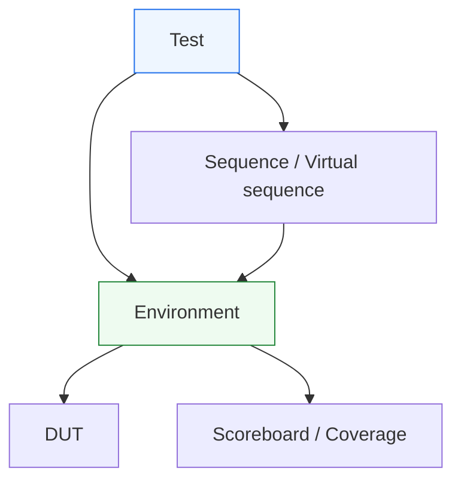

# `test` in UVM

Dopo aver costruito il ramo dell’**environment** — con **agent**, **scoreboard**, **reference model** e **subscriber** — il passo successivo naturale è tornare al livello più alto della regia del testbench e chiarire il ruolo del **`test`** in UVM.

Questo è un punto molto importante, perché nelle prime fasi di apprendimento è facile confondere il test con l’intero banco di prova. In realtà, in UVM il test non coincide con:
- l’environment;
- il driver;
- il monitor;
- lo scoreboard;
- la coverage;
- la struttura completa dell’infrastruttura di verifica.

Il test è piuttosto il componente che:
- seleziona lo scenario generale;
- configura l’ambiente;
- decide quali sequence o virtual sequence lanciare;
- controlla il contesto della simulazione;
- rappresenta la “regia di alto livello” della verifica.

Dal punto di vista metodologico, il test è fondamentale perché rende esplicita una distinzione chiave:
- l’**environment** è l’infrastruttura stabile della verifica;
- il **test** è la scelta concreta di uno scenario o di una campagna di verifica su quell’infrastruttura.

Questa separazione è uno dei motivi per cui UVM scala bene: la stessa infrastruttura può essere riusata da molti test diversi, ciascuno con:
- obiettivi diversi;
- configurazioni diverse;
- sequence diverse;
- livelli diversi di coverage o debug;
- modalità differenti di esercizio del DUT.

Questa pagina introduce il `test` con un taglio coerente con il resto della sezione UVM:
- didattico ma tecnico;
- centrato sul suo ruolo architetturale;
- attento al rapporto con environment, sequence, phasing e configurazione;
- orientato a chiarire che il test non è il posto in cui “si fa tutto”, ma il livello in cui si decide come usare bene il resto del testbench.

## 1. Che cos’è un `test` in UVM

Il `test` è il componente UVM che definisce il contesto concreto di una simulazione o di uno scenario di verifica.

### 1.1 Significato essenziale
Il test:
- costruisce o seleziona l’environment;
- configura componenti e modalità operative;
- sceglie quali sequence eseguire;
- decide il tipo di scenario da verificare;
- controlla il livello alto dell’esperimento di simulazione.

### 1.2 Livello di astrazione
Il test non vive al livello:
- dei segnali RTL;
- dell’handshake locale;
- del confronto atteso/osservato;
- della ricostruzione delle transazioni.

Vive invece al livello della **scelta dello scenario** e della **configurazione dell’ambiente**.

### 1.3 Perché è importante
È il punto in cui la verifica diventa concreta:
- quale caso provo?
- con quali opzioni?
- con quale sequenza di traffico?
- con quale intensità di checking o coverage?
- con quale obiettivo funzionale?

## 2. Perché serve un `test`

La prima domanda utile è: se esiste già l’environment, perché UVM introduce anche un test dedicato?

### 2.1 Il problema da evitare
Se l’environment includesse direttamente tutta la logica dei casi di prova:
- diventerebbe troppo rigido;
- sarebbe meno riusabile;
- mescolerebbe infrastruttura stabile e scenario specifico;
- renderebbe più difficile gestire molte simulazioni diverse sullo stesso DUT.

### 2.2 La risposta UVM
UVM separa:
- il **testbench stabile**, rappresentato dall’environment;
- il **caso specifico di verifica**, rappresentato dal test.

### 2.3 Beneficio metodologico
Questo permette di:
- riusare lo stesso environment;
- scrivere molti test diversi;
- fare regressione con scenari multipli;
- mantenere più leggibile la struttura complessiva.

## 3. Il test non è l’intero testbench

Questo è uno dei chiarimenti più importanti da fare.

### 3.1 Errore tipico iniziale
Nella terminologia informale, “test” viene spesso usato per indicare tutto il banco di prova. In UVM, però, il test è solo uno dei componenti della gerarchia.

### 3.2 Il testbench completo include
- test;
- environment;
- agent;
- driver;
- monitor;
- scoreboard;
- subscriber;
- sequence e virtual sequence;
- configurazione e phasing.

### 3.3 Perché la distinzione è utile
Capire questa differenza aiuta moltissimo a evitare che il test diventi un contenitore eccessivo di logica che dovrebbe stare altrove.

## 4. Test ed environment: ruoli diversi

La distinzione tra test ed environment è centrale nella metodologia UVM.

### 4.1 L’environment
L’environment rappresenta l’infrastruttura stabile della verifica del DUT.

### 4.2 Il test
Il test rappresenta uno scenario concreto di utilizzo di quella infrastruttura.

### 4.3 In termini intuitivi
Si può dire così:
- l’environment è il **laboratorio**;
- il test è l’**esperimento specifico** che si decide di svolgere nel laboratorio.

### 4.4 Perché è un buon modello mentale
Aiuta a capire che:
- l’environment dovrebbe essere riusabile;
- il test dovrebbe cambiare più spesso;
- la regressione è spesso una collezione di test diversi sullo stesso environment.

## 5. Che cosa decide il `test`

Il test è il luogo in cui si prendono decisioni di alto livello sulla verifica.

### 5.1 Scelta dello scenario
Per esempio:
- smoke test;
- caso nominale;
- corner case;
- reset durante attività;
- traffico stressato;
- scenario multi-agent;
- regressione ridotta o completa.

### 5.2 Configurazione dell’ambiente
Per esempio:
- agent attivi o passivi;
- coverage abilitata o ridotta;
- logging più o meno verboso;
- modelli o checker opzionali;
- parametri del DUT o del testbench.

### 5.3 Scelta delle sequence
Il test decide:
- quali sequence lanciare;
- se usare sequence locali o virtual sequence;
- con quale configurazione del traffico;
- con quale obiettivo di copertura o stress.

## 6. Che cosa non dovrebbe fare il `test`

Capire i limiti del test è quasi importante quanto capirne il ruolo.

### 6.1 Non dovrebbe guidare direttamente i segnali
Il pilotaggio dell’interfaccia è responsabilità del driver.

### 6.2 Non dovrebbe ricostruire transazioni dai segnali
Questo è il compito del monitor.

### 6.3 Non dovrebbe contenere il confronto funzionale principale
Questo appartiene a scoreboard e model.

### 6.4 Non dovrebbe sostituirsi all’environment
L’environment è l’infrastruttura stabile; il test non dovrebbe ricostruirla ogni volta in modo disordinato.

### 6.5 Perché questi limiti contano
Sono la chiave per mantenere il testbench:
- pulito;
- leggibile;
- riusabile;
- estendibile.

## 7. Test e sequence

Uno dei legami più importanti del test è con le sequence.

### 7.1 Ruolo del test
Il test sceglie quale sequence o virtual sequence eseguire.

### 7.2 Ruolo della sequence
La sequence descrive il traffico o lo scenario transazionale vero e proprio.

### 7.3 Perché la distinzione è utile
Il test decide il “quadro generale”, mentre la sequence realizza il comportamento di stimolo.

### 7.4 Beneficio metodologico
Così si possono riusare le stesse sequence in:
- test diversi;
- configurazioni diverse;
- regressioni diverse.

## 8. Test e virtual sequence

Il ruolo del test diventa ancora più chiaro quando ci sono virtual sequence.

### 8.1 Nei casi multi-agent
Un test può decidere di lanciare una virtual sequence che coordina:
- più sequencer;
- più interfacce;
- più agent;
- più canali di traffico.

### 8.2 Perché qui il test è importante
Il test resta il livello naturale in cui si decide:
- quale scenario multi-agent usare;
- con quali configurazioni;
- con quali varianti;
- con quali obiettivi di verifica.

### 8.3 Distinzione utile
Il test non implementa la regia dettagliata multi-canale: sceglie la virtual sequence che la implementa.

## 9. Test e configurazione

Uno degli usi più naturali del test è configurare l’environment.

### 9.1 Perché è utile
Lo stesso environment può essere usato in:
- modalità leggera;
- modalità completa;
- modalità debug;
- modalità coverage intensa;
- scenari block-level o subsystem-level.

### 9.2 Cosa può configurare
Per esempio:
- agent attivi/passivi;
- livelli di logging;
- coverage on/off;
- timeout;
- modelli o checker opzionali;
- parametri di certe sequence.

### 9.3 Beneficio
Questa è una delle ragioni per cui il test è il punto naturale della personalizzazione dello scenario.

## 10. Test e factory

Il test è anche uno dei luoghi in cui le capacità di factory di UVM vengono usate in modo più utile.

### 10.1 Perché
Il test può decidere di usare:
- versioni specializzate di driver;
- subscriber più ricchi;
- scoreboards estesi;
- monitor dedicati al debug;
- sequence derivate o più aggressive.

### 10.2 Beneficio metodologico
Questo permette di cambiare il comportamento della verifica senza riscrivere l’ambiente di base.

### 10.3 Collegamento importante
Il test è quindi uno dei punti principali in cui:
- configurazione;
- factory;
- scenario;

si incontrano.

## 11. Test e phasing

Il test vive pienamente dentro il phasing UVM.

### 11.1 Build phase
In questa fase costruisce o crea l’environment e imposta la configurazione necessaria.

### 11.2 Connect phase
Partecipa alla costruzione ordinata dell’ambiente, anche se gran parte delle connessioni interne è responsabilità dell’environment.

### 11.3 Run phase
Durante la run phase, il test:
- attiva le sequence;
- controlla l’esecuzione ad alto livello;
- gestisce la regia complessiva dello scenario.

### 11.4 Fasi finali
Può contribuire al resoconto finale o al controllo dell’esito complessivo.

### 11.5 Perché è importante
Questo conferma che il test è una parte attiva del ciclo di vita del testbench, non solo un selettore statico di opzioni.

## 12. Test e DUT reale

Il valore del test si capisce molto bene anche rispetto al tipo di DUT verificato.

### 12.1 DUT semplici
In DUT piccoli, il test può limitarsi a:
- scegliere una sequence;
- configurare pochi parametri;
- avviare il caso nominale o un corner case.

### 12.2 DUT con pipeline e latenza
Il test può decidere:
- scenari con traffico continuo;
- reset in momenti particolari;
- stress di throughput;
- verifiche di ordering o backpressure.

### 12.3 DUT con più interfacce
Il test può selezionare:
- virtual sequence multi-agent;
- modalità attive/passive degli agent;
- livelli diversi di osservazione e coverage.

## 13. Test e regressione

Il ruolo del test è centrale anche nella regressione.

### 13.1 Perché
Una regressione è spesso una collezione di test diversi, eseguiti sulla stessa infrastruttura.

### 13.2 Ogni test rappresenta uno scenario
Può essere:
- smoke;
- nominale;
- corner;
- protocol stress;
- reset stress;
- latency stress;
- multi-agent integration.

### 13.3 Beneficio architetturale
Questo rende la regressione più leggibile: la variabilità principale sta nei test, non nella ricostruzione continua dell’ambiente.

## 14. Test e debug

Il test è molto utile anche nel debug, ma in un modo particolare.

### 14.1 Non è il luogo del dettaglio del bug
Il bug locale spesso si capisce guardando:
- driver;
- monitor;
- scoreboard;
- model;
- coverage o log.

### 14.2 Però il test aiuta a capire il contesto
Per esempio:
- quale scenario era attivo;
- quali sequence sono state lanciate;
- quali opzioni erano abilitate;
- quali agent erano attivi o passivi;
- quale modalità di environment era in uso.

### 14.3 Beneficio diagnostico
Il test aiuta quindi a ricostruire la **cornice** del fallimento.

## 15. Test semplici e test complessi

Non tutti i test hanno lo stesso peso.

### 15.1 Test semplici
Possono limitarsi a:
- istanziare l’environment;
- configurare poche opzioni;
- lanciare una sequence nominale.

### 15.2 Test più ricchi
Possono:
- selezionare virtual sequence;
- usare override di factory;
- modificare la struttura o il comportamento dell’environment;
- orchestrare casi di stress o integrazione.

### 15.3 Perché è importante distinguerli
Questa distinzione aiuta a costruire una libreria di test:
- semplici e leggibili per la base;
- più ricchi per scenari avanzati.

## 16. Errori comuni

Alcuni errori ricorrono spesso nell’uso del test in UVM.

### 16.1 Mettere troppo codice nel test
Questo è l’errore più comune. Il test non dovrebbe sostituire l’environment o assorbire la logica di altri componenti.

### 16.2 Fare protocollo nel test
Il protocollo appartiene a driver e monitor.

### 16.3 Fare checking nel test
Il checking principale appartiene a scoreboard e componenti analitici dedicati.

### 16.4 Rendere il test troppo dipendente da un solo scenario
Un test troppo monolitico riduce riuso e leggibilità.

### 16.5 Non usare test diversi per scenari diversi
Si perde così una delle grandi forze della struttura UVM.

## 17. Buone pratiche di modellazione

Per progettare bene i test UVM, alcune linee guida sono particolarmente utili.

### 17.1 Pensare il test come regia di alto livello
Il test dovrebbe decidere:
- che cosa verificare;
- con quali opzioni;
- con quale sequence;
- su quale infrastruttura.

### 17.2 Tenerlo separato dall’infrastruttura
Environment e agent devono restare il più possibile stabili e riusabili.

### 17.3 Tenerlo separato dal protocollo
Il dettaglio dei segnali appartiene a driver e monitor.

### 17.4 Usarlo come punto di configurazione
Il test è il luogo naturale in cui si impostano modalità e varianti dell’ambiente.

### 17.5 Progettarlo per la regressione
Ogni test dovrebbe essere leggibile come scenario riconoscibile e ripetibile.

## 18. Collegamento con il resto della sezione

Questa pagina si collega direttamente a:
- **`environment.md`**, che rappresenta l’infrastruttura stabile della verifica;
- **`sequences.md`** e **`virtual-sequences.md`**, che implementano gli scenari di traffico selezionati dal test;
- **`uvm-phasing.md`**, che chiarisce come il test viva nel ciclo di vita del testbench;
- **`uvm-factory-config.md`**, perché il test è uno dei principali punti di uso di configurazione e override.

Prepara inoltre in modo naturale le pagine successive:
- **`test-configuration.md`**
- **`objections.md`**
- **`reporting.md`**
- **`regression.md`**

perché tutti questi temi dipendono fortemente dal ruolo del test come regia della verifica.

## 19. In sintesi

Il `test` in UVM è il componente che definisce lo scenario concreto della simulazione. Non coincide con tutto il testbench, ma rappresenta il livello in cui si decide:
- quale environment usare;
- come configurarlo;
- quali sequence o virtual sequence eseguire;
- quale obiettivo di verifica perseguire.

Il suo valore metodologico è molto forte perché separa la regia dello scenario dall’infrastruttura stabile della verifica. Questo rende possibile riusare lo stesso environment per molti test diversi e costruire regressioni ordinate, leggibili e scalabili.

Capire bene il test significa capire il punto in cui la metodologia UVM traduce la propria architettura in un caso di verifica concreto.

## Prossimo passo

Il passo più naturale ora è **`test-configuration.md`**, perché completa in modo diretto il ruolo del test chiarendo:
- come il test configura l’environment
- come passa opzioni ai componenti
- come si controllano modalità attive/passive, coverage e logging
- come rendere i test flessibili senza rompere il riuso dell’infrastruttura
