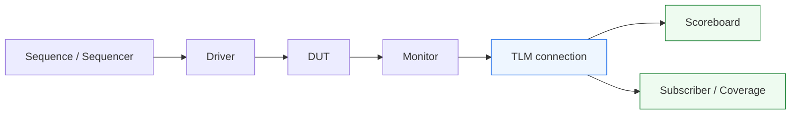
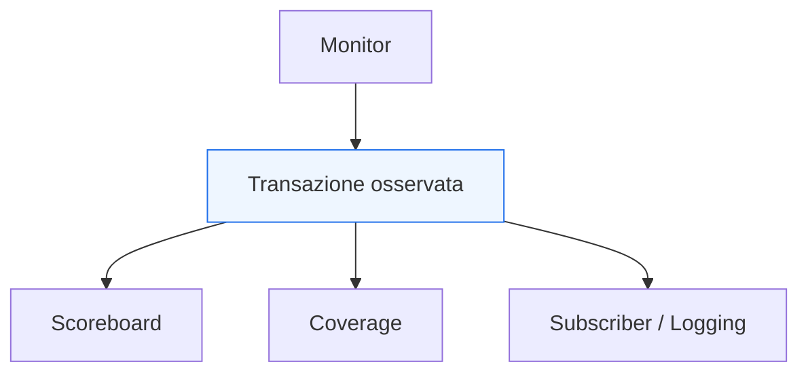

# Connessioni TLM e comunicazione tra componenti in UVM

Dopo aver chiarito il ruolo di **driver**, **monitor**, **agent** e **virtual interface**, il passo successivo naturale è affrontare un altro tema fondamentale dell’architettura UVM: il modo in cui i componenti del testbench si scambiano dati e transazioni tra loro. In UVM, questo tema è fortemente legato al **TLM**, cioè al **Transaction-Level Modeling** applicato alla comunicazione interna del banco di prova.

Questo argomento è molto importante perché un testbench UVM non è soltanto una collezione di componenti gerarchici. È una rete di blocchi che collaborano:
- il `sequencer` consegna transazioni al `driver`;
- il `monitor` osserva l’interfaccia e produce transazioni osservate;
- lo `scoreboard` riceve i dati da confrontare;
- i `subscriber` raccolgono coverage e statistiche;
- l’`environment` integra più agent e più percorsi di analisi.

Per far funzionare bene tutto questo, UVM deve offrire meccanismi che permettano ai componenti di comunicare in modo:
- modulare;
- leggibile;
- riusabile;
- poco accoppiato;
- coerente con il livello transazionale del testbench.

Dal punto di vista metodologico, il TLM è importante perché sposta la comunicazione interna dal livello del “chi chiama chi in modo diretto” a un livello più astratto e strutturato, in cui i componenti si scambiano **transazioni** e **oggetti significativi**, non dettagli RTL.

Questa pagina introduce le connessioni TLM in modo coerente con il resto della sezione UVM:
- con taglio didattico ma tecnico;
- centrato sul loro significato architetturale;
- senza ridurle a un elenco di primitive;
- mantenendo il legame con monitor, scoreboard, coverage e flow complessivo del testbench.

## 1. Perché servono connessioni strutturate tra componenti

La prima domanda importante è: perché UVM non lascia semplicemente che i componenti si chiamino tra loro in modo diretto e locale?

### 1.1 Il problema dell’accoppiamento diretto
Se monitor, scoreboard, subscriber e checker si conoscessero in modo troppo rigido:
- il testbench sarebbe meno modulare;
- il riuso dei componenti peggiorerebbe;
- l’environment diventerebbe più fragile ai cambiamenti;
- ogni nuova connessione richiederebbe modifiche più invasive.

### 1.2 La risposta UVM
UVM introduce canali di comunicazione transazionale che permettono ai componenti di:
- pubblicare eventi o transazioni;
- ricevere dati osservati;
- partecipare al flusso del testbench senza dipendere troppo l’uno dall’altro.

### 1.3 Beneficio metodologico
Questo migliora:
- modularità;
- estendibilità;
- leggibilità dell’architettura;
- riuso di monitor, scoreboard e collector;
- chiarezza del debug.

## 2. Che cosa significa TLM in questo contesto

Nel contesto UVM, TLM significa che la comunicazione tra componenti avviene a livello di **transazioni**, non a livello di segnali.

### 2.1 Livello di segnale contro livello transazionale
Nel mondo RTL si comunica con:
- bus;
- handshake;
- clock;
- reset;
- segnali di controllo.

Nel mondo UVM interno al testbench, invece, è spesso molto più naturale comunicare con:
- transazioni osservate;
- sequence item;
- pacchetti;
- oggetti che rappresentano eventi o trasferimenti.

### 2.2 Perché è utile
Questo permette ai componenti di collaborare in termini più vicini al significato funzionale della verifica.

### 2.3 TLM come linguaggio interno del testbench
Così come la `virtual interface` è il ponte tra classi e segnali RTL, il TLM è uno dei meccanismi che organizzano il flusso di dati **tra le classi UVM stesse**.

## 3. Dove compaiono le connessioni TLM in UVM

Le connessioni TLM compaiono in molti punti dell’architettura del testbench.

### 3.1 Monitor verso scoreboard
Uno dei casi più tipici è il monitor che produce transazioni osservate e le invia allo scoreboard.

### 3.2 Monitor verso coverage
Lo stesso monitor può inviare la stessa transazione osservata a:
- subscriber;
- collector di coverage;
- logger;
- checker di protocollo.

### 3.3 Altri casi
In ambienti più ricchi, anche:
- reference model;
- predictor;
- checker intermedi;
- aggregatori di eventi

possono scambiarsi informazioni tramite connessioni TLM.

### 3.4 Perché è importante
Questo rende il testbench più simile a una architettura a flusso di dati, non a un semplice insieme di chiamate dirette.

## 4. TLM e separazione delle responsabilità

Uno dei benefici più forti delle connessioni TLM è il rafforzamento della separazione dei ruoli.

### 4.1 Il monitor osserva
Il monitor:
- campiona i segnali;
- interpreta il protocollo;
- ricostruisce la transazione osservata.

### 4.2 Lo scoreboard confronta
Lo scoreboard:
- riceve dati osservati;
- li confronta con il comportamento atteso.

### 4.3 Il subscriber raccoglie
Il subscriber:
- riceve le transazioni;
- raccoglie coverage;
- può produrre statistiche o logging.

### 4.4 Perché è utile
Le connessioni TLM permettono al monitor di non doversi preoccupare di **chi** userà i dati osservati e con quale scopo.

## 5. La comunicazione del monitor come caso più didattico

Il monitor è spesso il componente più utile per introdurre il senso delle connessioni TLM.

### 5.1 Che cosa produce il monitor
Produce:
- transazioni osservate;
- eventi di protocollo;
- pacchetti ricostruiti;
- sequenze di informazioni significative per il testbench.

### 5.2 Chi può usarle
Possono essere usate da:
- scoreboard;
- coverage collector;
- subscriber;
- logger;
- predictor;
- checker specifici.

### 5.3 Perché non fare chiamate dirette
Se il monitor conoscesse direttamente tutti questi consumatori:
- sarebbe meno riusabile;
- si accoppierebbe troppo all’environment;
- diventerebbe più difficile da mantenere.

### 5.4 Valore del TLM
Il TLM permette al monitor di pubblicare la transazione osservata in modo strutturato e poco accoppiato.

## 6. Connessioni TLM e flusso dei dati nel testbench

Le connessioni TLM rendono il flusso dei dati nel testbench molto più leggibile.

### 6.1 Flusso tipico
Un flusso tipico è:
- il DUT produce attività sui segnali;
- il monitor osserva e ricostruisce una transazione;
- la transazione viene inoltrata;
- scoreboard e coverage ne fanno uso.

### 6.2 Perché è utile visualizzarlo così
Questo mostra che il testbench non è solo una gerarchia di componenti, ma anche un **grafo di flusso informativo**.

### 6.3 Effetto architetturale
La chiarezza delle connessioni TLM aiuta molto a:
- capire chi produce cosa;
- capire chi consuma cosa;
- isolare i punti di debug;
- estendere il testbench con nuovi subscriber o checker.

## 7. TLM e riuso

Il TLM è uno dei motivi per cui UVM scala bene e favorisce il riuso.

### 7.1 Riuso del monitor
Un monitor che pubblica transazioni osservate tramite connessioni TLM può essere riusato in:
- ambienti diversi;
- block-level;
- subsystem-level;
- casi con scoreboard o coverage differenti.

### 7.2 Riuso dei consumatori
Uno scoreboard o un subscriber può essere progettato per ricevere certi tipi di transazioni senza dover conoscere in dettaglio da quale monitor provengano.

### 7.3 Beneficio metodologico
Questo riduce l’accoppiamento e rende il testbench più modulare.

## 8. TLM e DUT con più interfacce

Il valore delle connessioni TLM cresce molto quando il DUT ha più interfacce o più agent.

### 8.1 Più monitor
Ogni agent può avere il proprio monitor.

### 8.2 Più flussi osservati
L’environment può dover raccogliere:
- transazioni di input;
- transazioni di output;
- eventi di controllo;
- dati di configurazione;
- stati di protocollo.

### 8.3 Integrazione ordinata
Le connessioni TLM permettono di integrare questi flussi in modo strutturato:
- uno scoreboard può ricevere più flussi;
- più subscriber possono osservare flussi diversi;
- il testbench resta leggibile anche quando cresce.

## 9. TLM e scoreboard

Lo scoreboard è uno dei principali consumatori delle connessioni TLM.

### 9.1 Perché ne ha bisogno
Lo scoreboard deve ricevere:
- transazioni osservate;
- eventualmente dati attesi;
- informazioni da reference model o predictor.

### 9.2 Beneficio della struttura TLM
Questo consente allo scoreboard di restare:
- indipendente dal monitor concreto;
- focalizzato sul confronto;
- più facile da estendere.

### 9.3 Visione corretta
Il monitor non dovrebbe “chiamare lo scoreboard come parte della propria logica interna”. Dovrebbe invece pubblicare informazioni in modo che lo scoreboard possa consumarle secondo l’architettura del testbench.

## 10. TLM e coverage

Anche la coverage beneficia fortemente del TLM.

### 10.1 Coverage su comportamento osservato
La coverage dovrebbe basarsi su ciò che è stato davvero osservato e ricostruito dal monitor.

### 10.2 Più consumatori, stessa sorgente
La stessa transazione osservata può servire contemporaneamente per:
- checking;
- coverage;
- logging;
- statistiche.

### 10.3 Beneficio
Il TLM rende naturale questa duplicazione di uso senza costringere il monitor a conoscere tutti i dettagli di ogni consumatore.

## 11. TLM e subscriber

Il subscriber è uno dei componenti che più chiaramente mostra il valore del TLM.

### 11.1 Ruolo del subscriber
Riceve transazioni o eventi e li usa per:
- coverage;
- statistiche;
- logging;
- analisi locale.

### 11.2 Perché il TLM è naturale qui
Il subscriber non ha bisogno di conoscere:
- i segnali del DUT;
- il protocollo nel dettaglio;
- la gerarchia interna dell’agent.

Ha bisogno di ricevere l’oggetto transazionale già ricostruito.

### 11.3 Effetto architetturale
Questo è un buon esempio di come il TLM aiuti a mantenere i componenti specializzati nel proprio ruolo.

## 12. TLM e leggibilità dell’environment

Le connessioni TLM non sono solo un meccanismo di comunicazione; sono anche una parte della leggibilità architetturale del testbench.

### 12.1 Gerarchia contro connessione
Il testbench UVM va letto su due livelli:
- gerarchia di contenimento;
- flusso delle connessioni tra componenti.

### 12.2 Perché entrambi contano
Due componenti possono essere contenuti nello stesso environment, ma il vero flusso dei dati tra loro emerge dalle connessioni TLM.

### 12.3 Beneficio
Questo aiuta a capire:
- come i dati scorrono;
- dove si accumula l’informazione osservata;
- dove avviene il confronto;
- dove si raccoglie coverage.

## 13. TLM e debug

Il TLM aiuta molto anche il debug del testbench.

### 13.1 Perché è utile
Quando il testbench è strutturato con connessioni chiare, è più facile capire:
- se il monitor ha davvero prodotto la transazione;
- se lo scoreboard l’ha ricevuta;
- se il subscriber l’ha usata;
- dove si è interrotto il flusso;
- se il problema è nel DUT o nel testbench.

### 13.2 Distinguere i punti del problema
Per esempio, si può distinguere tra:
- errore nel monitor;
- assenza di connessione corretta;
- scoreboard che riceve ma confronta male;
- coverage che non vede certe transazioni;
- issue di orchestrazione dell’environment.

### 13.3 Valore diagnostico
Le connessioni TLM rendono il flusso osservativo e di analisi molto più trasparente.

## 14. TLM e configurazione dell’ambiente

Le connessioni TLM si integrano bene con la natura configurabile di UVM.

### 14.1 Ambienti diversi
In un ambiente si può avere:
- solo scoreboard;
- scoreboard più coverage;
- coverage senza checking completo;
- subscriber aggiuntivi per debug;
- reference model opzionali.

### 14.2 Perché il TLM aiuta
Poiché i componenti sono meno accoppiati, è più facile:
- aggiungere un nuovo consumatore;
- sostituire un checker;
- cambiare la struttura dell’analisi;
- estendere la regressione.

### 14.3 Beneficio metodologico
Questo rafforza uno dei punti più forti di UVM: mantenere l’infrastruttura stabile mentre si fanno evolvere gli scenari e gli strumenti di verifica.

## 15. TLM e DUT reale

Il valore delle connessioni TLM diventa ancora più evidente in DUT complessi.

### 15.1 DUT semplici
Anche per un DUT piccolo, il TLM aiuta a evitare accoppiamenti inutili tra monitor e checker.

### 15.2 DUT con più protocolli
Per DUT con:
- ingressi multipli;
- uscite multiple;
- canali di controllo separati;
- request/response;
- interfacce di configurazione;

il TLM diventa uno dei modi più naturali per costruire uno strato di analisi leggibile.

### 15.3 Subsystem e SoC
A livello subsystem, più flussi di monitoraggio devono essere integrati, correlati e spesso confrontati. Il TLM diventa quindi ancora più importante.

## 16. Errori comuni

Alcuni errori ricorrono spesso quando si affrontano le connessioni TLM.

### 16.1 Vederle come puro dettaglio tecnico
Questo fa perdere il loro valore architetturale nella modularità del testbench.

### 16.2 Usare chiamate dirette ovunque
Questo accoppia troppo i componenti e riduce riuso e leggibilità.

### 16.3 Mettere troppa logica di checking nel monitor
Il monitor dovrebbe osservare e pubblicare; il confronto dovrebbe restare in componenti dedicati.

### 16.4 Non distinguere gerarchia e flusso dei dati
Il fatto che due componenti stiano nello stesso environment non significa automaticamente che il loro flusso informativo sia chiaro.

### 16.5 Non progettare i consumatori per ricevere transazioni pulite
TLM funziona bene se i dati scambiati sono oggetti significativi e ben modellati.

## 17. Buone pratiche di modellazione

Per usare bene le connessioni TLM in UVM, alcune linee guida sono particolarmente efficaci.

### 17.1 Pensare in termini di produttori e consumatori
È utile chiedersi:
- chi produce la transazione?
- chi la consuma?
- chi dovrebbe restare indipendente da chi?

### 17.2 Pubblicare transazioni pulite
Monitor e altri produttori dovrebbero rendere disponibili oggetti transazionali coerenti e leggibili.

### 17.3 Tenere separati osservazione e confronto
Il monitor non dovrebbe assorbire troppo checking.

### 17.4 Favorire estendibilità
Le connessioni TLM dovrebbero permettere di aggiungere nuovi subscriber o checker senza rompere il resto dell’ambiente.

### 17.5 Leggere l’environment come rete di flusso
Oltre alla gerarchia, conviene sempre capire il flusso delle informazioni osservate e attese.

## 18. Collegamento con il resto della sezione

Questa pagina si collega direttamente a:
- **`monitor.md`**, che produce le transazioni osservate;
- **`scoreboard.md`**, che consumerà queste transazioni per il checking;
- **`subscriber.md`**, che le userà per coverage e analisi;
- **`environment.md`**, che ospita e integra queste connessioni;
- **`uvm-architecture.md`**, che ha già mostrato la distinzione tra gerarchia e flusso operativo;
- **`virtual-interface.md`**, che ha chiarito il ponte tra componenti UVM e segnali RTL.

Prepara inoltre in modo naturale le pagine successive:
- **`environment.md`**
- **`scoreboard.md`**
- **`reference-model.md`**
- **`subscriber.md`**

perché tutte dipendono fortemente dal modo in cui le transazioni vengono distribuite nel testbench.

## 19. In sintesi

Le connessioni TLM in UVM sono il meccanismo con cui i componenti del testbench si scambiano transazioni e informazioni in modo strutturato, modulare e poco accoppiato. Il loro valore emerge soprattutto nel flusso osservativo del testbench:
- il monitor produce transazioni osservate;
- lo scoreboard le confronta;
- i subscriber raccolgono coverage e statistiche;
- l’environment integra questi percorsi.

Capire il TLM significa capire come UVM organizzi la comunicazione interna del testbench a livello di transazione, e non come semplice insieme di chiamate dirette tra componenti.

## Prossimo passo

Il passo più naturale ora è **`environment.md`**, perché dopo aver chiarito agent, virtual interface e connessioni TLM conviene affrontare il contenitore che integra tutto questo:
- ruolo dell’environment
- integrazione di agent e checker
- struttura complessiva della verifica del DUT
- relazione tra componenti locali e vista globale del testbench
