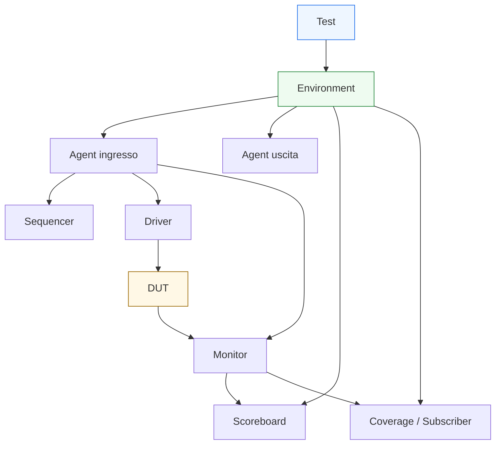
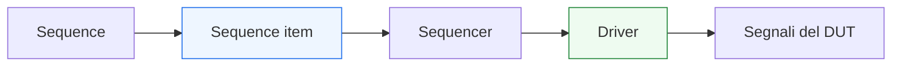

# Architettura del testbench UVM

Dopo aver introdotto la **panoramica di UVM**, il passo successivo naturale è descrivere con maggiore precisione la **struttura architetturale** di un testbench UVM. Questa pagina ha un ruolo fondamentale, perché costruisce la mappa concettuale che permette di leggere correttamente tutti i componenti che verranno affrontati nelle pagine successive.

Uno degli aspetti che più distingue UVM da un testbench SystemVerilog semplice è proprio il fatto che il banco di prova non è più un blocco unico che:
- genera stimoli;
- pilota i segnali;
- osserva il DUT;
- controlla il risultato.

In UVM, questi ruoli vengono separati in componenti distinti, organizzati in una gerarchia precisa e collegati tramite meccanismi standard di comunicazione. Questo approccio rende il testbench:
- più leggibile;
- più riusabile;
- più configurabile;
- più adatto a crescere insieme alla complessità del DUT.

Dal punto di vista metodologico, capire l’architettura del testbench UVM significa capire:
- chi decide lo scenario di test;
- chi genera le transazioni;
- chi le traduce in segnali;
- chi osserva le interfacce;
- chi confronta atteso e osservato;
- come tutto questo viene integrato in un ambiente unico.

Questa pagina descrive quindi l’architettura generale di un testbench UVM con un taglio coerente con il resto della documentazione:
- didattico ma tecnico;
- orientato a comprendere il significato dei ruoli, non solo i nomi delle classi;
- attento al legame tra struttura del testbench e struttura del DUT;
- pensato per preparare la lettura dei singoli componenti nelle pagine successive.

## 1. Perché serve una architettura del testbench

La prima domanda importante è: perché un testbench UVM ha bisogno di una vera architettura?

### 1.1 Il limite del banco di prova monolitico
Quando il DUT è piccolo, può funzionare un testbench in cui tutto è concentrato in pochi blocchi:
- stimolo;
- osservazione;
- checking;
- logica di controllo dei test.

Questo approccio, però, tende a degradare rapidamente quando aumentano:
- i casi di prova;
- i protocolli da esercitare;
- le interfacce;
- le configurazioni;
- le verifiche di corner case;
- il bisogno di regressione e riuso.

### 1.2 La risposta UVM
UVM introduce una architettura esplicita per distribuire le responsabilità. Questo permette di:
- isolare i ruoli;
- ridurre il codice duplicato;
- rendere il testbench più modulare;
- cambiare uno scenario senza riscrivere l’infrastruttura;
- riusare i componenti in ambienti diversi.

### 1.3 Architettura come linguaggio del testbench
Così come il DUT ha una sua architettura di datapath, controllo, pipeline e interfacce, anche il testbench UVM ha una sua architettura, che descrive come la verifica è organizzata.

## 2. Vista generale: i livelli del testbench UVM

Per capire il testbench UVM, è utile leggerlo come una gerarchia a livelli.

### 2.1 Livello alto: il test
Al vertice si trova il `test`, che decide:
- quale scenario eseguire;
- come configurare l’ambiente;
- quali sequence attivare;
- quali componenti o modalità abilitare.

### 2.2 Livello di integrazione: l’environment
Subito sotto c’è l’`environment`, che rappresenta il contenitore principale del banco di prova. È il luogo in cui vengono integrati:
- agent;
- scoreboard;
- coverage collector;
- eventuali reference model;
- altri checker o sottosistemi di verifica.

### 2.3 Livello di interfaccia: gli agent
Ogni `agent` rappresenta tipicamente la verifica di una certa interfaccia del DUT e raggruppa i componenti che servono a pilotarla e osservarla.

### 2.4 Livello operativo: driver, monitor, sequencer
Dentro l’agent si trovano spesso:
- `sequencer`, che coordina le transazioni in ingresso;
- `driver`, che traduce transazioni in segnali;
- `monitor`, che osserva i segnali reali e ricostruisce le transazioni viste sull’interfaccia.

### 2.5 Livello di checking: scoreboard e coverage
I dati osservati vengono poi usati da:
- `scoreboard`, per il confronto atteso/osservato;
- componenti di `coverage`, per misurare i comportamenti esercitati;
- eventuali subscriber o checker dedicati.

## 3. Il ruolo del test

Il `test` è il punto più alto della gerarchia UVM visibile al progettista di verifica.

### 3.1 Che cosa fa il test
Il test:
- seleziona o crea l’ambiente;
- configura agent e componenti;
- decide quali sequenze far partire;
- definisce il tipo di scenario da eseguire;
- controlla la simulazione a livello alto.

### 3.2 Che cosa non dovrebbe fare
Il test non dovrebbe:
- pilotare direttamente i segnali del DUT;
- sostituirsi al driver;
- contenere il dettaglio del protocollo a basso livello;
- concentrare il checking di dettaglio.

### 3.3 Perché è importante questa separazione
Il test dovrebbe descrivere l’intenzione di verifica, non il meccanismo elettrico o temporale con cui il DUT viene stimolato. Questo è un principio molto importante in UVM.

## 4. L’environment come contenitore principale

L’`environment` è il contenitore strutturale del banco di prova.

### 4.1 Che cosa contiene
Un environment può contenere:
- uno o più agent;
- uno scoreboard;
- uno o più subscriber di coverage;
- reference model;
- checker ausiliari;
- sub-environment dedicati a parti del DUT.

### 4.2 Perché è importante
L’environment è la sede naturale in cui si mette insieme la vista completa della verifica del DUT.

### 4.3 Legame con l’architettura del DUT
Un buon environment riflette in parte la struttura del DUT:
- se ci sono più interfacce, possono esserci più agent;
- se il DUT ha canali separati, può esserci una struttura modulare;
- se il checking richiede confronto tra più flussi osservati, l’environment è il luogo dove si integrano questi percorsi.

## 5. L’agent come rappresentazione di una interfaccia

Uno dei concetti più importanti in UVM è l’`agent`.

### 5.1 Che cos’è un agent
Un agent è un componente che raggruppa la logica di verifica relativa a una specifica interfaccia del DUT.

### 5.2 Cosa contiene tipicamente
Un agent contiene spesso:
- `sequencer`
- `driver`
- `monitor`

### 5.3 Ruolo metodologico
L’agent rende esplicito che:
- una certa interfaccia ha un suo protocollo;
- esiste un lato di stimolo e un lato di osservazione;
- questi componenti devono vivere insieme in modo riusabile.

### 5.4 Agent attivo e passivo
Un agent può essere:
- **attivo**, se genera stimoli e guida il DUT;
- **passivo**, se si limita a osservare l’interfaccia.

Questa distinzione è molto utile per il riuso del testbench in contesti diversi.

## 6. Il flusso dello stimolo: sequence, sequencer, driver

Una parte centrale dell’architettura UVM riguarda il percorso con cui lo stimolo viene generato e portato sul DUT.

### 6.1 Sequence
La `sequence` descrive lo stimolo a livello transazionale, cioè in termini di operazioni o transazioni da eseguire.

### 6.2 Sequence item
Le transazioni stesse vengono descritte come oggetti che rappresentano:
- richiesta;
- payload;
- comando;
- operazione;
- transazione di protocollo.

### 6.3 Sequencer
Il `sequencer` coordina il flusso di questi oggetti verso il `driver`.

### 6.4 Driver
Il `driver` converte la transazione in attività sui segnali dell’interfaccia del DUT:
- livelli dei bus;
- handshake;
- temporizzazione rispetto al clock;
- rispetto del protocollo.

### 6.5 Valore della separazione
Questa catena è importante perché separa:
- lo scenario di verifica;
- la rappresentazione astratta della transazione;
- il dettaglio fisico del protocollo a segnali.

## 7. Il flusso dell’osservazione: monitor e analisi

Se il driver rappresenta il lato “attivo” dello stimolo, il monitor rappresenta il lato “osservativo” del testbench.

### 7.1 Ruolo del monitor
Il `monitor` osserva i segnali reali dell’interfaccia e ricostruisce ciò che è realmente accaduto sul DUT:
- trasferimenti;
- pacchetti;
- eventi di protocollo;
- transazioni completate;
- validità e latenza di certe operazioni.

### 7.2 Perché non usare il driver per sapere cosa è successo
Il driver sa che cosa ha tentato di applicare, ma non è sempre la fonte corretta per sapere che cosa il DUT abbia realmente visto o completato. Il monitor serve proprio a costruire una vista indipendente e osservata del comportamento.

### 7.3 Output del monitor
Il monitor produce tipicamente transazioni osservate che possono essere inviate a:
- scoreboard;
- coverage;
- subscriber;
- checker di protocollo.

## 8. Scoreboard: confronto tra atteso e osservato

Lo `scoreboard` è il componente che contribuisce in modo centrale al checking funzionale.

### 8.1 Che cosa fa
Lo scoreboard confronta:
- comportamento atteso;
- comportamento osservato.

### 8.2 Sorgenti dell’informazione
Può ricevere:
- transazioni osservate dal monitor;
- transazioni attese generate da un modello di riferimento;
- informazioni derivate dal test;
- esiti di elaborazioni interne del banco di prova.

### 8.3 Perché è importante
Lo scoreboard consente di mantenere separato:
- il meccanismo di stimolo;
- il meccanismo di osservazione;
- il confronto funzionale.

Questa separazione è una delle chiavi della qualità architetturale del testbench UVM.

## 9. Coverage e subscriber

Accanto al checking, un testbench UVM serio raccoglie anche informazioni di coverage.

### 9.1 Coverage
La coverage aiuta a capire:
- quali scenari sono stati esercitati;
- quali transazioni sono state osservate;
- quali modalità del protocollo sono state percorse;
- quali corner case sono ancora scoperti.

### 9.2 Subscriber
Un `subscriber` è un componente che può ricevere eventi o transazioni osservate e usarli per:
- coverage;
- logging;
- statistiche;
- checking specializzato.

### 9.3 Ruolo architetturale
L’esistenza di subscriber e collector dedicati permette di non sovraccaricare monitor o scoreboard con responsabilità che appartengono a una fase diversa della verifica.

## 10. Comunicazione tra componenti

L’architettura UVM non è fatta solo di blocchi gerarchici, ma anche di canali di comunicazione tra questi blocchi.

### 10.1 Flusso verticale
Esiste una relazione gerarchica:
- test
- environment
- agent
- componenti interni

### 10.2 Flusso funzionale
Esiste poi un flusso operativo:
- sequenze verso driver;
- monitor verso scoreboard;
- monitor verso coverage;
- test verso configurazione dell’ambiente.

### 10.3 Perché questo è importante
Capire l’architettura UVM significa capire sia:
- **chi contiene chi**
sia:
- **chi parla con chi**

Queste due viste non coincidono sempre, ma sono entrambe essenziali.

## 11. Agent multipli e DUT con più interfacce

Uno dei motivi per cui UVM è potente è che l’architettura scala bene quando il DUT ha più interfacce.

### 11.1 Più interfacce, più agent
Un DUT reale può avere:
- interfaccia di comando;
- interfaccia dati in ingresso;
- interfaccia dati in uscita;
- interfaccia di configurazione;
- canali di risposta o interrupt.

In questi casi, è naturale costruire:
- un agent per ogni protocollo o canale significativo;
- un environment che li integra tutti.

### 11.2 Beneficio del modello
Questo rende il testbench:
- più modulare;
- più vicino alla struttura reale del DUT;
- più facile da manutenere e riusare.

### 11.3 Esempio concettuale
Un blocco stream-oriented potrebbe avere:
- agent di input;
- agent di output;
- monitor dedicato a un canale di stato;
- scoreboard che confronta pacchetti in ingresso e uscita;
- coverage che misura backpressure, latenza e reset.

## 12. Configurazione e variabilità dell’ambiente

L’architettura UVM è pensata anche per essere configurabile.

### 12.1 Perché serve
In verifica, è frequente voler cambiare:
- il numero di agent;
- modalità attiva o passiva di certi componenti;
- presenza di checker o coverage specifici;
- parametri del protocollo;
- comportamento di certe sequence.

### 12.2 Architettura e configurazione
Un buon testbench UVM separa:
- struttura base dell’ambiente;
- parametri o politiche che lo configurano.

### 12.3 Beneficio progettuale
Questo permette di mantenere l’infrastruttura stabile mentre si cambiano:
- test;
- scenari;
- configurazioni;
- strategie di stimolo e osservazione.

## 13. Phasing e ciclo di vita dell’architettura

L’architettura UVM vive secondo fasi ordinate.

### 13.1 Perché le fasi contano
In un testbench gerarchico serve sapere:
- quando creare i componenti;
- quando collegarli;
- quando iniziare la simulazione attiva;
- quando raccogliere e riportare i risultati.

### 13.2 Ruolo nell’architettura
Le fasi servono quindi a scandire il ciclo di vita dell’ambiente di verifica:
- costruzione;
- connessione;
- esecuzione;
- chiusura e report.

### 13.3 Importanza metodologica
Questo è uno dei modi in cui UVM evita che il testbench cresca in modo informale e poco prevedibile.

## 14. Architettura del testbench e architettura del DUT

È molto utile leggere il testbench UVM come una sorta di “architettura speculare” del DUT.

### 14.1 Il DUT ha struttura interna
Il DUT può avere:
- datapath;
- controllo;
- FSM;
- pipeline;
- interfacce;
- protocolli.

### 14.2 Il testbench UVM ha struttura di verifica
Il testbench UVM ha:
- componenti di stimolo;
- componenti di osservazione;
- checker;
- coverage;
- configurazione;
- gerarchia di ambienti e agent.

### 14.3 Relazione tra le due architetture
Un buon testbench non replica il DUT, ma ne rispecchia i punti di verifica più importanti:
- interfacce;
- flussi di dati;
- eventi di protocollo;
- risultati osservabili;
- proprietà di latenza, reset e avanzamento.

## 15. Errori comuni nel leggere l’architettura UVM

Quando si inizia, alcuni fraintendimenti sono molto comuni.

### 15.1 Pensare che la gerarchia coincida con il flusso dei dati
La gerarchia dice chi contiene chi. Il flusso funzionale dice chi genera, chi guida, chi osserva e chi confronta. Le due cose vanno distinte.

### 15.2 Confondere test ed environment
Il test decide e configura. L’environment integra e ospita l’infrastruttura.

### 15.3 Confondere driver e monitor
Il driver agisce sul DUT. Il monitor osserva il DUT. Sono ruoli concettualmente diversi e questa separazione va mantenuta con cura.

### 15.4 Vedere l’agent come semplice contenitore formale
L’agent è una unità architetturale del testbench che rappresenta una interfaccia del DUT. Non è solo un contenitore burocratico.

### 15.5 Mettere troppo checking nel posto sbagliato
Se il checking viene distribuito in modo caotico tra driver, monitor, test e agent, l’architettura perde chiarezza e il debug peggiora.

## 16. Buone pratiche di lettura e costruzione

Per leggere e costruire bene l’architettura UVM, alcune linee guida aiutano molto.

### 16.1 Partire dalle interfacce del DUT
Le interfacce sono spesso il punto più naturale da cui derivare la struttura degli agent.

### 16.2 Distinguere chiaramente i ruoli
È importante chiedersi sempre:
- chi genera lo scenario?
- chi guida i segnali?
- chi osserva?
- chi confronta?
- chi raccoglie coverage?

### 16.3 Mantenere il test al livello giusto
Il test dovrebbe descrivere lo scenario e la configurazione, non il dettaglio del protocollo a basso livello.

### 16.4 Progettare per il riuso
Agent, monitor e scoreboards dovrebbero essere pensati come elementi riusabili e non troppo dipendenti da un singolo caso di prova.

### 16.5 Legare l’architettura del testbench a quella del DUT
Un ambiente di verifica forte nasce quando la struttura del banco di prova è coerente con i punti realmente importanti del design.

## 17. Collegamento con il resto della sezione

Questa pagina prepara direttamente tutte le successive:
- **`uvm-components.md`** dettaglierà il ruolo dei principali componenti UVM;
- **`sequence-item.md`**, **`sequencer.md`** e **`sequences.md`** approfondiranno il lato dello stimolo transazionale;
- **`driver.md`**, **`monitor.md`** e **`agent.md`** chiariranno il lato di connessione concreta al DUT;
- **`environment.md`**, **`scoreboard.md`** e **`subscriber.md`** svilupperanno l’integrazione dell’ambiente e il checking;
- **`uvm-phasing.md`** e **`uvm-factory-config.md`** spiegheranno come l’architettura viva nel tempo e come venga configurata.

Questa pagina si collega anche al lavoro già fatto sulla sezione SystemVerilog, in particolare ai temi di:
- interfacce e handshake;
- pipeline e latenza;
- verifica di base;
- assertions;
- coverage;
- architettura del testbench.

## 18. In sintesi

L’architettura del testbench UVM è il modo in cui la metodologia organizza la verifica in componenti con ruoli distinti e gerarchia chiara. Invece di concentrare tutto in un unico banco di prova monolitico, UVM separa:
- definizione dello scenario di test;
- generazione delle transazioni;
- guida dei segnali sul DUT;
- osservazione del comportamento;
- confronto atteso/osservato;
- raccolta di coverage.

Questa struttura rende il testbench:
- più leggibile;
- più modulare;
- più riusabile;
- più adatto a DUT complessi e a regressioni estese.

Capire questa architettura significa creare la base giusta per affrontare i singoli componenti della metodologia senza considerarli elementi isolati.

## Prossimo passo

Il passo più naturale ora è **`uvm-components.md`**, per entrare in modo più diretto nei blocchi fondamentali della metodologia e chiarire:
- quali componenti esistono
- quale ruolo hanno
- come si distinguono
- come collaborano in un ambiente UVM completo
