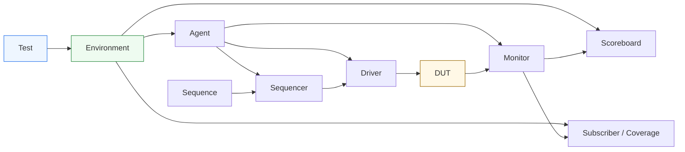

# Componenti principali di UVM

Dopo aver introdotto la **panoramica di UVM** e l’**architettura del testbench**, il passo successivo naturale è chiarire in modo sistematico **quali sono i componenti principali della metodologia** e quale ruolo svolge ciascuno di essi. Questa pagina ha una funzione molto importante: costruire un lessico stabile e una mappa concettuale chiara prima di entrare nei dettagli delle singole pagine dedicate a `driver`, `monitor`, `agent`, `sequencer`, `sequence`, `environment`, `scoreboard` e così via.

Uno dei motivi per cui UVM può apparire inizialmente complesso è che introduce molti nomi e molti blocchi distinti. Tuttavia, questa complessità diventa molto più gestibile quando si capisce che ogni componente esiste per risolvere un problema preciso nella verifica:
- generare lo stimolo;
- rappresentare una transazione;
- pilotare i segnali;
- osservare il DUT;
- confrontare atteso e osservato;
- raccogliere coverage;
- configurare e integrare l’ambiente;
- controllare l’esecuzione del test.

Questa pagina non ha l’obiettivo di entrare in profondità implementativa su ciascun componente. Il suo scopo è costruire una **visione organica** dell’insieme, mettendo in evidenza:
- funzione di ciascun blocco;
- relazioni tra i blocchi;
- livello di astrazione a cui operano;
- ruolo nella separazione delle responsabilità;
- utilità pratica rispetto a DUT reali con interfacce, protocollo, latenza, reset e checking.

## 1. Perché UVM separa i componenti

La prima idea fondamentale è che UVM non suddivide il testbench in molti componenti per gusto formale, ma per migliorare:
- chiarezza;
- riuso;
- configurabilità;
- scalabilità;
- verificabilità.

### 1.1 Il problema del testbench monolitico
In un banco di prova semplice, è facile mescolare:
- generazione di stimoli;
- pilotaggio dell’interfaccia;
- osservazione del DUT;
- checking;
- logging;
- configurazione del test.

Questo può funzionare per blocchi piccoli, ma con la crescita del DUT porta rapidamente a:
- codice difficile da leggere;
- forte duplicazione;
- bassa riusabilità;
- più difficoltà nel debug;
- maggiore fragilità alle modifiche.

### 1.2 La risposta di UVM
UVM divide l’ambiente in componenti con ruoli distinti. Questo permette di dire con chiarezza:
- chi decide lo scenario;
- chi descrive la transazione;
- chi la guida sui segnali;
- chi osserva il comportamento reale;
- chi controlla la correttezza;
- chi raccoglie coverage;
- chi integra e configura l’ambiente.

### 1.3 Effetto metodologico
Questa separazione rende la verifica più simile a una vera architettura di sistema, in cui ogni blocco ha un compito specifico e ben delimitato.

## 2. Le grandi categorie di componenti UVM

Prima di elencare i singoli componenti, è utile raggrupparli in famiglie logiche.

### 2.1 Componenti di scenario e controllo
Questi componenti decidono:
- che test eseguire;
- quali sequenze attivare;
- come configurare l’ambiente.

In questa categoria rientrano soprattutto:
- `test`
- `sequence`
- `virtual sequence`

### 2.2 Componenti di stimolo
Questi componenti trasformano scenari e transazioni in attività concrete sulle interfacce del DUT:
- `sequence item`
- `sequencer`
- `driver`

### 2.3 Componenti di osservazione
Questi componenti osservano il comportamento reale del DUT:
- `monitor`

### 2.4 Componenti di integrazione
Questi componenti mettono insieme più blocchi della verifica:
- `agent`
- `environment`

### 2.5 Componenti di checking e analisi
Questi componenti si occupano di:
- confronto atteso/osservato;
- raccolta coverage;
- analisi dei dati osservati.

Qui rientrano:
- `scoreboard`
- `subscriber`
- collector di coverage
- eventuale `reference model`

## 3. Il `test`

Il `test` è il componente di più alto livello nel testbench UVM visibile all’utente che esegue uno scenario di verifica.

### 3.1 Ruolo del test
Il test definisce:
- quale scenario verificare;
- come configurare l’ambiente;
- quali sequenze lanciare;
- quali politiche abilitare o disabilitare.

### 3.2 Che cosa esprime
Il test dovrebbe esprimere l’intenzione della verifica:
- smoke test;
- caso nominale;
- corner case;
- backpressure;
- reset durante attività;
- scenario di errore;
- configurazione specifica.

### 3.3 Che cosa non dovrebbe fare
Il test non dovrebbe diventare il luogo in cui si scrive:
- il dettaglio di protocollo;
- il pilotaggio manuale dei segnali;
- il checking a basso livello dell’interfaccia.

Queste responsabilità appartengono ad altri componenti.

## 4. Il `environment`

L’`environment`, spesso abbreviato in `env`, è il contenitore principale del banco di prova.

### 4.1 Ruolo dell’environment
L’environment integra i componenti che servono per verificare il DUT:
- agent;
- scoreboards;
- subscriber di coverage;
- reference model;
- eventuali checker o sub-environment.

### 4.2 Significato architetturale
L’environment rappresenta la vista complessiva del testbench per uno specifico DUT o sottosistema.

### 4.3 Perché è importante
L’environment aiuta a mantenere separati:
- il livello del test, che decide lo scenario;
- il livello dell’infrastruttura, che realizza concretamente la verifica.

## 5. L’`agent`

L’agent è uno dei componenti più caratteristici di UVM.

### 5.1 Che cos’è
Un agent è il blocco che raccoglie i componenti di verifica associati a una specifica interfaccia del DUT.

### 5.2 Cosa contiene tipicamente
Un agent contiene spesso:
- `sequencer`
- `driver`
- `monitor`

### 5.3 Perché esiste
L’agent rende esplicito che una certa interfaccia non è solo un insieme di segnali, ma un canale con:
- protocollo;
- lato di stimolo;
- lato di osservazione;
- eventuale riuso indipendente dal resto del DUT.

### 5.4 Modalità attiva e passiva
Un agent può essere:
- **attivo**, quando contiene anche il driver e partecipa alla generazione dello stimolo;
- **passivo**, quando contiene solo il monitor e osserva l’interfaccia senza pilotarla.

Questa distinzione è molto utile nel riuso e nella composizione di ambienti più complessi.

## 6. Il `sequence item`

Il `sequence item` è il contenitore base della transazione.

### 6.1 Che cosa rappresenta
Rappresenta un’operazione astratta che ha significato per il protocollo o per la verifica, per esempio:
- una richiesta;
- un pacchetto;
- un comando;
- una transazione di lettura o scrittura;
- un payload da inviare.

### 6.2 Perché è importante
Il sequence item è il punto in cui il testbench passa dal livello dei segnali al livello delle transazioni.

### 6.3 Vantaggio metodologico
Permette di descrivere lo stimolo in modo più vicino alla semantica del DUT, invece che in termini di:
- singoli fronti di clock;
- livelli manuali sui segnali;
- manipolazione diretta del bus in ogni test.

## 7. La `sequence`

La `sequence` descrive come le transazioni devono essere generate e ordinate nel tempo.

### 7.1 Che cosa fa
Una sequence costruisce e invia sequence item secondo uno scenario:
- singola transazione;
- burst;
- pattern di protocollo;
- corner case;
- sequenza con pause o backpressure simulato;
- combinazioni speciali di comandi.

### 7.2 Livello di astrazione
La sequence lavora a livello transazionale, non a livello di singolo segnale.

### 7.3 Perché è utile
Questo permette di scrivere scenari di verifica più leggibili e riusabili, separandoli dalla logica del driver.

## 8. Il `sequencer`

Il `sequencer` coordina il flusso tra sequence e driver.

### 8.1 Ruolo del sequencer
Fa da punto di arbitraggio e consegna delle transazioni generate dalle sequence verso il driver.

### 8.2 Perché è separato dal driver
Questa separazione consente di:
- mantenere il driver concentrato sul protocollo a segnali;
- mantenere le sequence concentrate sullo scenario di test;
- supportare un flusso ordinato di transazioni.

### 8.3 Significato metodologico
Il sequencer è quindi il ponte tra:
- intenzione di verifica a livello transazionale;
- esecuzione concreta sull’interfaccia del DUT.

## 9. Il `driver`

Il driver è il componente che traduce una transazione in attività concreta sui segnali del DUT.

### 9.1 Che cosa fa
Dato un sequence item, il driver:
- guida i segnali dell’interfaccia;
- rispetta il protocollo del DUT;
- sincronizza il comportamento con il clock;
- attende le condizioni di handshake necessarie;
- gestisce timing logico e sequenza dei segnali.

### 9.2 Perché è un componente fondamentale
Il driver è il punto in cui il livello transazionale incontra il livello RTL.

### 9.3 Responsabilità tipica
Il driver non decide “quale scenario” testare. Decide **come** applicare sul bus e nel tempo la transazione ricevuta.

## 10. Il `monitor`

Il monitor osserva l’interfaccia del DUT e ricostruisce ciò che è realmente accaduto.

### 10.1 Che cosa osserva
Tipicamente osserva:
- bus dati;
- `valid/ready`;
- `start/done`;
- segnali di stato o controllo;
- pacchetti o trasferimenti completati.

### 10.2 Che cosa produce
Il monitor ricostruisce transazioni osservate che possono essere inviate a:
- scoreboard;
- coverage collector;
- subscriber;
- checker ausiliari.

### 10.3 Perché è distinto dal driver
Il driver sa cosa ha cercato di fare. Il monitor sa cosa è stato realmente osservato sull’interfaccia. Questa distinzione è essenziale per una verifica robusta.

## 11. Lo `scoreboard`

Lo scoreboard è uno dei componenti chiave del checking funzionale.

### 11.1 Che cosa fa
Confronta:
- risultato atteso;
- risultato osservato.

### 11.2 Da dove arrivano i dati
Può ricevere:
- transazioni osservate dai monitor;
- output di un reference model;
- transazioni attese ricavate dagli stimoli;
- dati da più agent se il DUT ha più interfacce.

### 11.3 Perché è importante
Lo scoreboard separa il checking dal pilotaggio e dall’osservazione, rendendo il testbench più leggibile e manutenibile.

## 12. Il `subscriber`

Il subscriber è un componente che reagisce a eventi o transazioni osservate, tipicamente per scopi di analisi.

### 12.1 Usi tipici
Può essere usato per:
- coverage funzionale;
- logging specializzato;
- statistiche;
- analisi di pattern osservati;
- supporto al debug.

### 12.2 Perché è utile
Permette di raccogliere informazione senza sovraccaricare monitor e scoreboard con responsabilità non direttamente loro.

### 12.3 Ruolo nella metodologia
Il subscriber mostra bene la filosofia UVM: separare i ruoli e rendere ogni componente focalizzato su un compito preciso.

## 13. Il `reference model`

Anche se non è sempre presente come componente formale standard in ogni ambiente minimo, il reference model è spesso molto importante.

### 13.1 Che cos’è
È un modello che rappresenta il comportamento atteso del DUT a un livello opportuno per la verifica.

### 13.2 A cosa serve
Serve a produrre il risultato atteso da confrontare con quello osservato nello scoreboard.

### 13.3 Quando è particolarmente utile
È molto utile quando:
- il DUT esegue trasformazioni dati non banali;
- la latenza interna può variare;
- il checking non può limitarsi a confronti immediati ingresso/uscita;
- l’ambiente deve restare pulito e riusabile.

## 14. La `virtual sequence`

La virtual sequence è un componente importante nei testbench con più agent o più canali da coordinare.

### 14.1 Ruolo
Permette di coordinare sequenze su più interfacce o più sequencer contemporaneamente.

### 14.2 Quando serve
È utile quando il DUT:
- ha più canali;
- richiede scenari sincronizzati tra interfacce;
- deve ricevere traffico concorrente;
- richiede una regia più alta dello stimolo.

### 14.3 Significato architetturale
La virtual sequence opera a livello di orchestrazione del test, non di singolo protocollo.

## 15. Factory e configurazione come supporto ai componenti

Anche se factory e configurazione saranno trattate in pagine dedicate, vale la pena chiarire che fanno parte del modo in cui i componenti UVM vengono usati.

### 15.1 Factory
Permette di controllare in modo flessibile quali versioni dei componenti vengano istanziate.

### 15.2 Configurazione
Permette di impostare:
- modalità attiva/passiva degli agent;
- parametri di protocollo;
- opzioni di checking;
- comportamento delle sequenze;
- presenza di componenti opzionali.

### 15.3 Perché è rilevante qui
Questi meccanismi non sono “componenti funzionali” come driver o monitor, ma sono parte essenziale dell’architettura complessiva del testbench.

## 16. Relazioni tra i componenti

Ora che i blocchi principali sono stati introdotti, è importante osservare come si relazionano.

### 16.1 Flusso dello stimolo
Il flusso tipico è:
- test
- sequence
- sequencer
- driver
- DUT

### 16.2 Flusso dell’osservazione
Il flusso tipico osservativo è:
- DUT
- monitor
- scoreboard / coverage / subscriber

### 16.3 Flusso della struttura
La gerarchia tipica è:
- test
- environment
- agent
- componenti interni

### 16.4 Perché tenere distinti questi flussi
Per comprendere davvero UVM, bisogna distinguere:
- gerarchia di contenimento;
- flusso delle informazioni;
- responsabilità funzionali.

Queste tre viste si intrecciano, ma non vanno confuse.

## 17. Come leggere i componenti rispetto al DUT

I componenti UVM acquistano vero significato solo se letti in relazione al DUT reale.

### 17.1 DUT con interfacce semplici
Per un DUT piccolo può bastare:
- un agent;
- un monitor;
- uno scoreboard semplice.

### 17.2 DUT con più interfacce
Per DUT più ricchi, si introducono:
- più agent;
- scoreboards più articolati;
- sequence coordinate;
- eventuali virtual sequence;
- più componenti di coverage.

### 17.3 DUT con pipeline, reset e handshake
In questi casi i componenti UVM devono saper gestire:
- latenza;
- backpressure;
- reset;
- stati transitori;
- validità temporale dei dati osservati.

## 18. Errori comuni nel primo approccio ai componenti UVM

Alcuni errori ricorrono molto spesso quando si inizia.

### 18.1 Imparare i nomi senza capire le responsabilità
Questo porta a testbench formalmente UVM ma concettualmente confusi.

### 18.2 Mescolare i ruoli
Per esempio:
- mettere checking nel driver;
- mettere generazione dello stimolo nel monitor;
- usare il test come pilotaggio diretto del protocollo.

### 18.3 Vedere l’agent come semplice contenitore burocratico
In realtà l’agent rappresenta architetturalmente una interfaccia del DUT.

### 18.4 Pensare che più componenti significhino più complessità inutile
Se ben usati, i componenti riducono la complessità locale e migliorano il riuso globale.

### 18.5 Dimenticare il livello di astrazione corretto
Ogni componente ha un livello naturale:
- sequence e test parlano in termini di scenario;
- driver e monitor parlano in termini di protocollo;
- scoreboard parla in termini di correttezza funzionale;
- coverage parla in termini di esplorazione del comportamento.

## 19. Buone pratiche di lettura e uso

Per affrontare bene i componenti UVM, alcune linee guida aiutano molto.

### 19.1 Chiedersi sempre “che problema risolve questo componente?”
Questo evita di impararlo come puro elemento sintattico.

### 19.2 Tenere distinti scenario, protocollo e checking
Questa è una delle chiavi principali della metodologia.

### 19.3 Leggere i componenti come sistema cooperante
Nessun componente “fa tutto”. Il valore di UVM emerge proprio dalla loro collaborazione.

### 19.4 Collegare ogni componente al DUT
Ogni blocco del testbench dovrebbe essere leggibile anche in funzione di:
- interfacce reali del DUT;
- protocollo;
- reset;
- latenza;
- pipeline;
- configurazioni del design.

## 20. Collegamento con il resto della sezione

Questa pagina si collega naturalmente a quanto già introdotto in:
- **`index.md`**, che ha definito obiettivi e perimetro della sezione UVM;
- **`uvm-overview.md`**, che ha dato la visione metodologica generale;
- **`uvm-architecture.md`**, che ha descritto la gerarchia del testbench.

Prepara inoltre in modo diretto le pagine successive:
- **`sequence-item.md`**
- **`sequencer.md`**
- **`sequences.md`**
- **`driver.md`**
- **`monitor.md`**
- **`agent.md`**
- **`environment.md`**
- **`scoreboard.md`**
- **`subscriber.md`**

In questo senso, rappresenta il ponte tra il quadro generale della metodologia e lo studio dettagliato dei suoi blocchi fondamentali.

## 21. In sintesi

I componenti principali di UVM esistono per separare in modo chiaro i diversi ruoli della verifica:
- il `test` definisce lo scenario;
- la `sequence` descrive lo stimolo a livello transazionale;
- il `sequencer` coordina il flusso delle transazioni;
- il `driver` traduce le transazioni in segnali;
- il `monitor` osserva il comportamento reale del DUT;
- lo `scoreboard` confronta atteso e osservato;
- il `subscriber` e la coverage raccolgono informazione sul comportamento esercitato;
- l’`agent` organizza i componenti relativi a una interfaccia;
- l’`environment` integra l’intero banco di prova.

Capire questi componenti significa capire come UVM trasformi la verifica da banco di prova monolitico a infrastruttura strutturata, modulare e riusabile.

## Prossimo passo

Il passo più naturale ora è **`sequence-item.md`**, perché rappresenta il primo vero blocco del flusso transazionale e permette di fissare bene:
- che cos’è una transazione in UVM
- come viene rappresentata
- perché è diversa dal semplice insieme di segnali del DUT
- come diventa il mattone base per sequence, sequencer, driver, monitor e scoreboard
