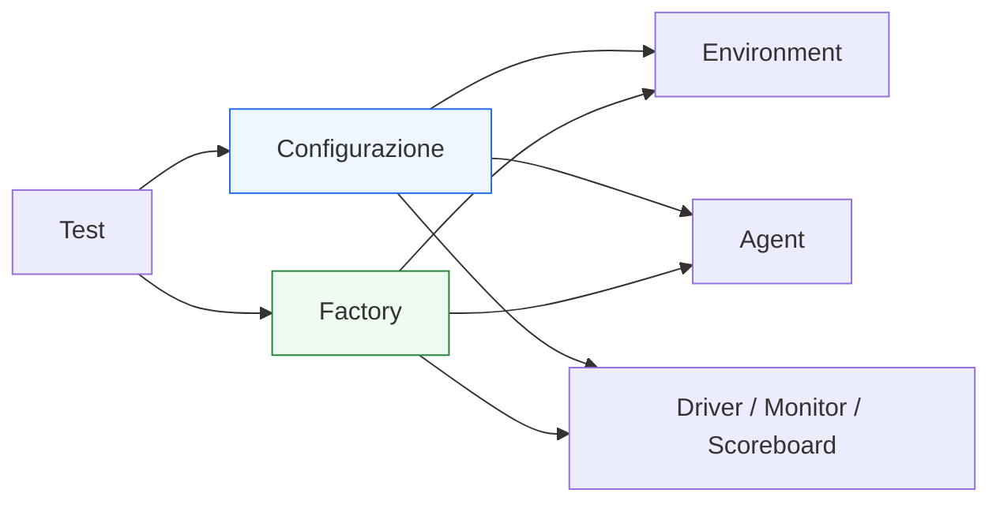

# Factory e configurazione in UVM

Dopo aver introdotto l’**architettura del testbench**, i **componenti principali** e il **phasing**, il passo successivo naturale è affrontare un altro pilastro della metodologia UVM: la combinazione tra **factory** e **configurazione**.

Questi due temi sono fondamentali perché spiegano come UVM riesca a costruire ambienti di verifica che non siano solo modulari, ma anche:
- adattabili;
- riusabili;
- sostituibili;
- estendibili;
- controllabili da test diversi senza dover riscrivere l’infrastruttura.

Dal punto di vista pratico, molti dei vantaggi attribuiti a UVM — come il riuso degli agent, l’estensione dei test, la possibilità di cambiare comportamento o di specializzare parti del testbench — si appoggiano proprio a questi meccanismi.

Dal punto di vista metodologico, factory e configurazione permettono di separare:
- struttura base del testbench;
- varianti del comportamento;
- scelta dei componenti concreti;
- impostazioni di ambiente e test;
- differenze tra scenari nominali, corner case e regressione.

Questa pagina introduce factory e configurazione con un taglio coerente con il resto della documentazione:
- didattico ma tecnico;
- centrato sul loro significato architetturale;
- attento al ruolo che hanno nel riuso del testbench;
- senza ridurli a puro dettaglio sintattico o meccanico.

## 1. Perché servono factory e configurazione

La prima domanda importante è: perché UVM introduce meccanismi così espliciti per configurare il testbench e sostituire componenti?

### 1.1 Il limite di un ambiente rigido
In un testbench non strutturato, cambiare il comportamento dell’ambiente spesso significa:
- modificare direttamente il codice dei componenti;
- duplicare interi file;
- creare versioni quasi identiche dello stesso agent;
- introdurre varianti difficili da mantenere.

### 1.2 L’obiettivo di UVM
UVM vuole evitare questo approccio rigido, permettendo di:
- usare una struttura comune;
- configurarla per test diversi;
- sostituire selettivamente componenti con versioni specializzate;
- estendere l’ambiente senza riscriverlo.

### 1.3 Valore metodologico
Questo è molto importante perché la verifica reale richiede quasi sempre:
- test multipli;
- ambienti attivi o passivi;
- policy di checking diverse;
- componenti specializzati per certi scenari;
- regressioni che riusano la stessa infrastruttura.

## 2. Configurazione e factory: due idee diverse ma complementari

Anche se spesso vengono presentati insieme, configurazione e factory non sono la stessa cosa.

### 2.1 Configurazione
La configurazione serve a dire ai componenti **come devono comportarsi** o **quali opzioni devono usare**.

Per esempio:
- agent attivo o passivo;
- abilitazione di coverage;
- modalità del monitor;
- parametri del protocollo;
- flag di checking;
- timeout o policy locali.

### 2.2 Factory
La factory serve a controllare **quale tipo concreto di componente venga istanziato**.

Per esempio:
- usare una versione base del driver o una specializzata;
- sostituire uno scoreboard standard con uno più ricco;
- rimpiazzare un monitor con una variante dedicata a debug;
- cambiare una sequence con una versione derivata più aggressiva.

### 2.3 Perché lavorano bene insieme
La configurazione controlla il comportamento di componenti esistenti.  
La factory controlla l’identità concreta del componente da usare.

## 3. La configurazione come leva di flessibilità

Cominciamo dalla configurazione.

### 3.1 Che cosa significa configurare un ambiente UVM
Configurare significa impostare proprietà e opzioni prima che il componente inizi a svolgere il proprio ruolo operativo.

### 3.2 Esempi tipici
Si possono configurare:
- agent attivi o passivi;
- presenza o assenza di coverage;
- modalità di logging;
- opzioni di checking;
- parametri del protocollo;
- politiche del driver;
- comportamento delle sequence;
- numeri di canali o istanze.

### 3.3 Perché è importante
Senza configurazione, lo stesso environment sarebbe molto meno riusabile, perché ogni variante richiederebbe una modifica strutturale del codice.

## 4. Configurazione e separazione tra infrastruttura e scenario

Uno dei grandi vantaggi della configurazione è che aiuta a separare:
- l’infrastruttura stabile del testbench;
- le variazioni richieste dai diversi test.

### 4.1 Infrastruttura stabile
L’environment, gli agent, il driver, il monitor e lo scoreboard possono restare sostanzialmente gli stessi.

### 4.2 Scenario variabile
Il test può cambiare:
- modalità degli agent;
- opzioni di coverage;
- intensità del logging;
- parametri di certi canali;
- sequenze da attivare.

### 4.3 Beneficio progettuale
Questo riduce:
- duplicazione di codice;
- rischio di divergenza tra varianti;
- costi di manutenzione;
- complessità della regressione.

## 5. La factory come meccanismo di sostituzione controllata

La factory è uno dei meccanismi più caratteristici di UVM.

### 5.1 Che cosa fa
Permette di decidere che, quando un componente viene creato, invece della sua classe base venga usata:
- una classe derivata;
- una variante specializzata;
- una implementazione differente ma compatibile nel ruolo.

### 5.2 Perché è utile
Questo rende possibile modificare il comportamento del testbench senza cambiare direttamente il codice che costruisce la gerarchia.

### 5.3 Significato metodologico
La factory aiuta UVM a supportare:
- estensione;
- override;
- riuso di ambienti;
- specializzazione di test;
- regressione su versioni alternative di componenti.

## 6. Override: il cuore pratico della factory

Il concetto chiave collegato alla factory è l’**override**.

### 6.1 Significato
Un override permette di dire:
- quando il testbench chiede un componente di tipo base, usa invece questo tipo derivato o alternativo.

### 6.2 Perché è potente
Questo consente di:
- provare versioni speciali di un driver;
- usare uno scoreboard più verboso in debug;
- sostituire una sequence base con una più aggressiva;
- introdurre componenti di tracing o checking aggiuntivo.

### 6.3 Perché è meglio della modifica diretta
Invece di cambiare la struttura del testbench o duplicare l’environment, si può controllare la variante dall’esterno o da un livello superiore del test.

## 7. Factory e riuso del testbench

La factory è strettamente legata all’idea di riuso.

### 7.1 Environment stabile
Si può mantenere lo stesso environment generale.

### 7.2 Componenti sostituibili
All’occorrenza si possono sostituire singoli componenti con versioni:
- specializzate;
- estese;
- orientate al debug;
- pensate per casi particolari.

### 7.3 Beneficio metodologico
Questo permette di ottenere:
- test più ricchi;
- ambienti più adattabili;
- regressioni meglio organizzate;
- minore dipendenza da modifiche invasive al codice di base.

## 8. Configurazione di agent e environment

Uno dei luoghi più naturali in cui la configurazione viene usata è il controllo di agent e environment.

### 8.1 Agent attivo o passivo
Un test può voler usare lo stesso agent:
- come attivo in un caso;
- come passivo in un altro.

### 8.2 Coverage on/off
Si può decidere se raccogliere coverage in tutti i test o solo in certi run.

### 8.3 Checking e logging
Alcuni test possono voler:
- più controlli;
- logging più verboso;
- più diagnostica;
- modalità più leggere per regressione veloce.

### 8.4 Beneficio pratico
Questa flessibilità è uno dei motivi per cui UVM è adatto a flussi reali di verifica.

## 9. Configurazione e sequence

Anche le sequence possono beneficiare della configurazione.

### 9.1 Casi tipici
Si può voler configurare:
- numero di transazioni;
- pattern di traffico;
- probabilità di certi campi;
- modalità di stress;
- limiti o opzioni del traffico generato.

### 9.2 Perché è utile
Questo permette di riusare la stessa sequence base in scenari diversi senza duplicarla.

### 9.3 Collegamento col test
Il test può così definire uno scenario generale e parametrare le sequence in modo coerente con l’obiettivo della verifica.

## 10. Factory, configurazione e phasing

Factory e configurazione sono strettamente legate al phasing.

### 10.1 Quando conta la configurazione
I componenti devono essere configurati prima di entrare nel loro comportamento operativo.

### 10.2 Quando conta la factory
Le sostituzioni tramite factory devono avvenire in un momento coerente con la costruzione dell’ambiente.

### 10.3 Perché build phase è importante
La build phase è il luogo naturale in cui:
- si costruiscono i componenti;
- si applicano le scelte che dipendono da configurazione e factory;
- si prepara l’ambiente nella forma corretta.

### 10.4 Beneficio metodologico
Questo rafforza il legame tra:
- phasing ordinato;
- costruzione della gerarchia;
- flessibilità del testbench.

## 11. Factory e configurazione in un DUT reale

Questi meccanismi acquistano significato soprattutto in relazione a DUT reali.

### 11.1 DUT con più interfacce
Si può voler configurare:
- alcuni agent attivi, altri passivi;
- politiche diverse di monitoraggio;
- livelli diversi di checking a seconda del test.

### 11.2 DUT con protocolli o modalità multiple
Si possono introdurre:
- sequence differenti;
- driver specializzati;
- scoreboards più ricchi;
- componenti di coverage o debug dedicati.

### 11.3 DUT in fasi diverse del progetto
Durante lo sviluppo, si può voler:
- una versione più verbosa del testbench per debug;
- una versione più leggera per regressione;
- una variante di monitor o scoreboard per casi particolari.

Factory e configurazione rendono queste transizioni molto più naturali.

## 12. Factory e configurazione come strumenti di estensione

Uno degli aspetti più interessanti è che questi meccanismi permettono di estendere il testbench senza distruggerne la struttura.

### 12.1 Estensione della base
Una struttura di base può essere mantenuta stabile.

### 12.2 Specializzazione
Singoli componenti o parti del comportamento possono essere specializzati:
- per un test particolare;
- per debug;
- per coverage;
- per condizioni rare;
- per un DUT leggermente diverso.

### 12.3 Vantaggio architetturale
Questo è molto più sano che moltiplicare varianti quasi identiche del testbench.

## 13. Errori comuni

Factory e configurazione sono molto utili, ma anche facili da usare male.

### 13.1 Vederli solo come meccanismo sintattico
Se non si capisce il loro ruolo architetturale, diventano strumenti usati in modo meccanico e confuso.

### 13.2 Abusare delle sostituzioni
Se ogni test cambia troppi componenti, il testbench diventa più difficile da seguire e mantenere.

### 13.3 Configurazione poco chiara
Troppe opzioni o opzioni con significato ambiguo peggiorano la leggibilità.

### 13.4 Duplicare comunque il codice
Se si continua a duplicare agent, environment o sequence invece di usare configurazione e factory in modo pulito, si perde gran parte del beneficio della metodologia.

### 13.5 Non collegarli al DUT reale
La configurazione deve servire bisogni reali del protocollo e del testbench, non introdurre flessibilità artificiale senza valore pratico.

## 14. Buone pratiche di modellazione

Per usare bene factory e configurazione, alcune linee guida sono particolarmente efficaci.

### 14.1 Mantenere stabile la struttura di base
Environment e agent dovrebbero essere pensati come infrastruttura durevole.

### 14.2 Configurare ciò che varia davvero
Le opzioni dovrebbero riflettere differenze reali di scenario, protocollo o strategia di verifica.

### 14.3 Usare la factory per estendere, non per complicare
La sostituzione di componenti ha valore quando migliora riuso e modularità.

### 14.4 Evitare flessibilità gratuita
Troppe opzioni rendono l’ambiente meno leggibile e più difficile da verificare.

### 14.5 Leggere sempre factory e configurazione insieme al phasing
Questi meccanismi hanno senso solo se il ciclo di vita del testbench è ordinato.

## 15. Collegamento con il resto della sezione

Questa pagina si collega direttamente a:
- **`uvm-architecture.md`**, che ha mostrato la gerarchia del testbench;
- **`uvm-components.md`**, che ha introdotto i blocchi fondamentali;
- **`uvm-phasing.md`**, che ha chiarito quando i componenti vengono creati e preparati.

Prepara inoltre in modo naturale le pagine successive:
- **`test.md`**
- **`test-configuration.md`**
- **`agent.md`**
- **`environment.md`**
- **`reporting.md`**
- **`regression.md`**

perché tutti questi temi dipendono fortemente dalla capacità di:
- configurare l’ambiente;
- sostituire componenti;
- mantenere riuso e leggibilità.

## 16. In sintesi

Factory e configurazione sono due meccanismi centrali di UVM che permettono di rendere il testbench:
- flessibile;
- riusabile;
- estendibile;
- più adatto a test multipli e regressione.

La configurazione permette di controllare il comportamento dei componenti senza modificarne la struttura. La factory permette di controllare quale implementazione concreta venga usata per un certo ruolo, favorendo override e specializzazione.

Capire questi meccanismi significa capire come UVM riesca a mantenere una infrastruttura stabile pur supportando ambienti di verifica ricchi e variabili.

## Prossimo passo

Il passo più naturale ora è **`driver.md`**, per tornare al ramo operativo del testbench e affrontare il componente che traduce davvero la transazione in segnali del DUT:
- protocollo
- clock
- reset
- handshake
- temporizzazione dello stimolo
