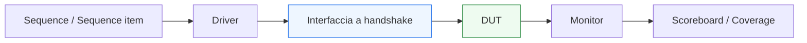

# UVM per protocolli a handshake

Dopo aver costruito la parte metodologica generale della sezione **UVM**, il passo successivo naturale è collegare questi concetti al comportamento reale del DUT. Uno dei primi casi da affrontare è quello dei **protocolli a handshake**, perché rappresentano una delle forme più comuni con cui i blocchi digitali scambiano dati e controllo.

Nel lavoro RTL e di verifica, protocolli come:
- `valid/ready`
- `request/response`
- `start/done`
- varianti con backpressure o accettazione condizionata

compaiono molto spesso, sia in blocchi semplici sia in contesti più complessi come pipeline, sottosistemi o SoC.

Dal punto di vista UVM, i protocolli a handshake sono particolarmente interessanti perché mettono subito in gioco quasi tutti i concetti fondamentali della metodologia:
- il `driver` deve applicare correttamente il protocollo;
- il `monitor` deve ricostruire in modo corretto le transazioni osservate;
- lo `scoreboard` deve confrontare atteso e osservato tenendo conto del completamento reale dei trasferimenti;
- la `coverage` deve misurare se sono stati esercitati stall, backpressure, burst, reset e casi limite;
- le `sequence` devono generare scenari significativi senza confondersi con il dettaglio ciclo per ciclo del protocollo.

Questa pagina introduce UVM nel contesto dei protocolli a handshake con un taglio coerente con il resto della documentazione:
- didattico ma tecnico;
- centrato sul significato architetturale e verificativo del protocollo;
- attento al collegamento tra RTL, protocollo e componenti UVM;
- orientato a mostrare come la metodologia diventi concreta quando incontra interfacce reali.

## 1. Perché partire dai protocolli a handshake

La prima domanda importante è: perché iniziare il collegamento con il DUT reale proprio dai protocolli a handshake?

### 1.1 Perché sono diffusissimi
Molti DUT usano protocolli in cui il trasferimento di informazione non dipende soltanto dal valore del dato, ma anche dal fatto che:
- il trasmettitore dichiari la validità del dato;
- il ricevitore dichiari la propria disponibilità;
- una richiesta sia stata accettata;
- una risposta sia stata completata;
- un’operazione sia partita o terminata.

### 1.2 Perché sono didatticamente ricchi
I protocolli a handshake fanno emergere subito concetti molto importanti:
- differenza tra tentativo di trasferimento e trasferimento completato;
- relazione tra stimolo e osservazione;
- gestione di stall e backpressure;
- ruolo del tempo e del clock;
- necessità di un monitor indipendente dal driver.

### 1.3 Perché sono ideali per UVM
UVM si adatta molto bene a questi protocolli perché separa:
- livello transazionale;
- protocollo sui segnali;
- osservazione;
- checking;
- coverage.

## 2. Che cos’è un protocollo a handshake

Un protocollo a handshake è un meccanismo con cui due entità coordinano il trasferimento di informazione attraverso segnali di controllo che indicano:
- disponibilità del dato;
- disponibilità alla ricezione;
- avvio di una operazione;
- completamento di un’operazione;
- accettazione o rifiuto temporaneo del trasferimento.

### 2.1 Livello concettuale
L’idea fondamentale è che il trasferimento non avviene semplicemente perché un bus contiene un valore, ma perché il protocollo stabilisce che in quel momento la comunicazione è valida.

### 2.2 Esempi comuni
Tra i casi più frequenti:
- `valid/ready`
- `request/ack`
- `request/response`
- `start/done`

### 2.3 Perché questo conta in verifica
Il testbench non deve solo generare dati: deve verificare **quando** e **in quali condizioni** quei dati vengono realmente trasferiti.

## 3. Il caso `valid/ready`

Il protocollo `valid/ready` è probabilmente il caso più tipico nei flussi RTL moderni.

### 3.1 Idea di base
Un lato della comunicazione:
- presenta dato e `valid`

L’altro lato:
- segnala `ready`

Il trasferimento è considerato completato quando:
- il dato è valido;
- il ricevente è pronto;
- la regola del protocollo considera la transazione accettata.

### 3.2 Perché è un caso didattico ideale
Mette in evidenza:
- backpressure;
- stall;
- burst;
- capacità del DUT di accettare traffico continuo;
- differenza tra dato presentato e dato realmente trasferito.

### 3.3 Implicazione UVM
Driver, monitor e scoreboard devono tutti essere coerenti con questa distinzione.

## 4. Il caso `request/response`

Un altro scenario molto comune è il protocollo request/response.

### 4.1 Struttura tipica
Una richiesta viene emessa su un canale, mentre la risposta compare su un altro o in un momento successivo.

### 4.2 Difficoltà di verifica
Questo introduce temi come:
- correlazione tra richiesta e risposta;
- latenza variabile o fissa;
- ordering;
- presenza di più richieste in volo;
- timeout o assenza di risposta.

### 4.3 Implicazione UVM
Lo scoreboard e il reference model diventano spesso più importanti, perché il checking deve correlare in modo corretto eventi separati nel tempo.

## 5. Il caso `start/done`

Esistono anche protocolli più orientati al controllo che al trasporto di flussi continui.

### 5.1 Struttura tipica
Un lato segnala l’avvio di una operazione:
- `start`

Il DUT, dopo un certo tempo, segnala il completamento:
- `done`

### 5.2 Perché è importante
Qui il testbench deve verificare:
- che l’avvio venga riconosciuto correttamente;
- che il completamento avvenga nel modo atteso;
- che reset, latenza e stato interno siano trattati correttamente.

### 5.3 Collegamento con UVM
Il protocollo è diverso da uno stream, ma il principio metodologico resta lo stesso:
- driver applica;
- monitor osserva;
- scoreboard confronta;
- coverage misura i casi esercitati.

## 6. UVM e livello transazionale nei protocolli a handshake

Uno dei vantaggi più importanti di UVM è la capacità di descrivere questi protocolli a livello transazionale.

### 6.1 Sequence item
Invece di ragionare direttamente su:
- `valid`
- `ready`
- fronti di clock
- cicli di stallo

il testbench può rappresentare una transazione come:
- richiesta;
- pacchetto;
- comando;
- payload.

### 6.2 Driver
Il driver traduce la transazione nel comportamento del protocollo.

### 6.3 Monitor
Il monitor ricostruisce le transazioni osservate a partire dai segnali dell’handshake.

### 6.4 Beneficio
Si mantiene così una separazione molto chiara tra:
- significato dello stimolo;
- meccanica del protocollo;
- osservazione del comportamento reale.

## 7. Il ruolo del `driver` nei protocolli a handshake

Il driver è uno dei componenti più coinvolti quando il DUT usa un protocollo a handshake.

### 7.1 Che cosa deve fare
Deve:
- presentare i campi della transazione;
- sincronizzarsi con il clock;
- rispettare il reset;
- gestire `valid`, `ready`, `start`, `done` o segnali equivalenti;
- completare correttamente il trasferimento solo quando il protocollo lo consente.

### 7.2 Perché è importante
Il driver non deve semplicemente “scrivere un dato” sull’interfaccia. Deve realizzare l’intero contratto temporale del protocollo.

### 7.3 Effetto sul debug
Molti bug apparenti del DUT nascono in realtà da un driver che applica il protocollo in modo scorretto.

## 8. Il ruolo del `monitor` nei protocolli a handshake

Il monitor è altrettanto importante.

### 8.1 Che cosa deve osservare
Deve capire:
- quando il trasferimento è stato solo presentato;
- quando è stato veramente accettato;
- quali campi erano validi in quel momento;
- quali stall o pause si sono verificati;
- quando il protocollo ha prodotto un evento significativo.

### 8.2 Perché è fondamentale
In protocolli con handshake, il monitor non può limitarsi a campionare un bus. Deve interpretare il contratto del protocollo.

### 8.3 Beneficio architetturale
Questo rende il monitor una sorgente molto affidabile di transazioni osservate per scoreboard e coverage.

## 9. Il ruolo dello `scoreboard` nei protocolli a handshake

Lo scoreboard deve tenere conto del fatto che non tutto ciò che viene presentato al DUT diventa automaticamente un trasferimento valido.

### 9.1 Cosa deve confrontare
Deve confrontare:
- ciò che il DUT ha realmente accettato o prodotto;
- ciò che il reference model o predictor considera atteso.

### 9.2 Temi tipici
Per esempio:
- transazioni perse;
- transazioni duplicate;
- ordering errato;
- risposta mancante;
- latenza o completamento non coerenti con il protocollo.

### 9.3 Perché è importante
Nei protocolli a handshake, il checking dipende fortemente dalla corretta distinzione tra:
- tentativo di trasferimento;
- trasferimento completato.

## 10. Il ruolo della `coverage` nei protocolli a handshake

La coverage è particolarmente ricca in questo contesto.

### 10.1 Casi interessanti da coprire
Per esempio:
- trasferimenti nominali;
- stall;
- backpressure;
- burst consecutivi;
- reset durante traffico;
- accettazione immediata o ritardata;
- sequenze di richieste e risposte.

### 10.2 Perché conta
Molti bug si manifestano proprio in condizioni di protocollo che i test semplici non esplorano.

### 10.3 Ruolo del subscriber
Subscriber e coverage collector sono i luoghi naturali per raccogliere questi dati in modo pulito.

## 11. Handshake e backpressure

Uno dei motivi per cui questi protocolli sono interessanti è la presenza del backpressure.

### 11.1 Che cos’è
Il ricevente non è sempre pronto ad accettare un nuovo trasferimento.

### 11.2 Implicazione per il driver
Il driver deve sapere:
- quando aspettare;
- quando mantenere i segnali stabili;
- quando considerare completata la transazione.

### 11.3 Implicazione per il monitor
Il monitor deve distinguere tra:
- dato presentato;
- dato accettato;
- stall del canale.

### 11.4 Implicazione per la coverage
Bisogna misurare se questi casi di backpressure sono stati davvero esercitati.

## 12. Handshake e reset

Anche il reset è un tema molto importante.

### 12.1 Perché
Durante reset:
- il protocollo può non essere attivo;
- certi trasferimenti non sono validi;
- i segnali devono essere trattati in modo specifico.

### 12.2 Implicazione UVM
Driver e monitor devono essere coerenti con:
- fase di reset;
- rilascio del reset;
- validità delle transazioni prima e dopo il reset.

### 12.3 Coverage e debug
È utile misurare e osservare anche:
- reset in presenza di traffico;
- comportamento del DUT al rientro in attività;
- eventuale perdita o ripetizione di transazioni.

## 13. Handshake e latenza

I protocolli a handshake sono spesso il punto di ingresso verso problemi di latenza.

### 13.1 Perché
Una richiesta può essere accettata in un certo ciclo, ma la risposta o l’effetto può comparire più tardi.

### 13.2 Implicazione UVM
Il reference model e lo scoreboard devono essere in grado di:
- correlare gli eventi;
- mantenere il contesto;
- gestire il ritardo tra input e output.

### 13.3 Perché è importante
Questo collega direttamente i protocolli a handshake ai temi di pipeline, ordering e throughput.

## 14. Handshake e multi-agent

Molti DUT non hanno un solo canale a handshake, ma più interfacce correlate.

### 14.1 Esempi
- input e output separati;
- request/response su canali diversi;
- configurazione + traffico dati;
- canali concorrenti.

### 14.2 Implicazione UVM
Serve coordinare:
- più agent;
- più driver;
- più monitor;
- più scoreboards o uno scoreboard centrale;
- virtual sequence se necessario.

### 14.3 Beneficio metodologico
Questo rende visibile il valore della struttura UVM nei casi più realistici.

## 15. Errori comuni nella verifica UVM di protocolli a handshake

Alcuni errori ricorrono spesso.

### 15.1 Confondere dato presentato e dato trasferito
Questo è uno degli errori più classici.

### 15.2 Mettere troppo protocollo nelle sequence
Le sequence devono esprimere lo scenario, non il dettaglio dei segnali.

### 15.3 Monitor troppo superficiale
Se non interpreta davvero il protocollo, produce transazioni osservate poco affidabili.

### 15.4 Scoreboard troppo ingenuo
Se non tiene conto di ordering, latenza o completamento reale, genera mismatch poco credibili.

### 15.5 Coverage troppo povera
Limitarsi ai casi nominali lascia scoperti molti bug reali.

## 16. Buone pratiche di modellazione

Per verificare bene protocolli a handshake in UVM, alcune linee guida sono particolarmente utili.

### 16.1 Modellare bene la transazione
Lo `sequence item` deve riflettere il significato della comunicazione, non solo i segnali.

### 16.2 Tenere il driver focalizzato sul protocollo
Il driver deve implementare bene handshake, reset e clock.

### 16.3 Costruire un monitor realmente indipendente
Deve osservare ciò che accade, non ciò che il driver intendeva fare.

### 16.4 Curare scoreboard e reference model
Devono riflettere il comportamento atteso in modo coerente con il protocollo.

### 16.5 Usare coverage per guidare i corner case
Stall, backpressure e ordering vanno misurati, non solo intuiti.

## 17. Collegamento con il resto della sezione

Questa pagina si collega direttamente a:
- **`driver.md`**, che applica il protocollo;
- **`monitor.md`**, che lo osserva;
- **`scoreboard.md`**, che confronta osservato e atteso;
- **`coverage-uvm.md`**, che misura casi nominali e corner;
- **`virtual-sequences.md`**, quando il protocollo coinvolge più agent o più canali;
- **`systemverilog-interfaces.md`** e **`interfaces-and-handshake.md`** della sezione SystemVerilog, che forniscono il contesto di base lato RTL.

Prepara inoltre in modo naturale la pagina successiva:
- **`uvm-pipelines-latency.md`**

perché i protocolli a handshake portano in modo molto naturale ai temi di:
- latenza;
- pipeline;
- ordering;
- più transazioni in volo.

## 18. In sintesi

L’uso di UVM per protocolli a handshake mostra molto bene come la metodologia si colleghi al comportamento reale del DUT. Driver, monitor, scoreboard e coverage devono tutti rispettare la logica del protocollo, distinguendo con precisione:
- dato presentato;
- dato accettato;
- trasferimento completato;
- effetti osservabili nel tempo.

Capire bene questo tema significa capire uno dei primi punti in cui UVM smette di essere solo metodologia astratta e diventa strumento concreto di verifica di interfacce reali.

## Prossimo passo

Il passo più naturale ora è **`uvm-pipelines-latency.md`**, perché estende in modo diretto il discorso dai protocolli a handshake ai casi in cui il DUT introduce:
- latenza
- pipeline
- ordering
- più transazioni contemporaneamente in volo
