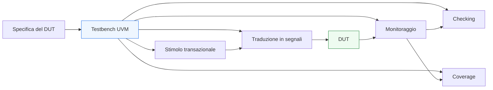
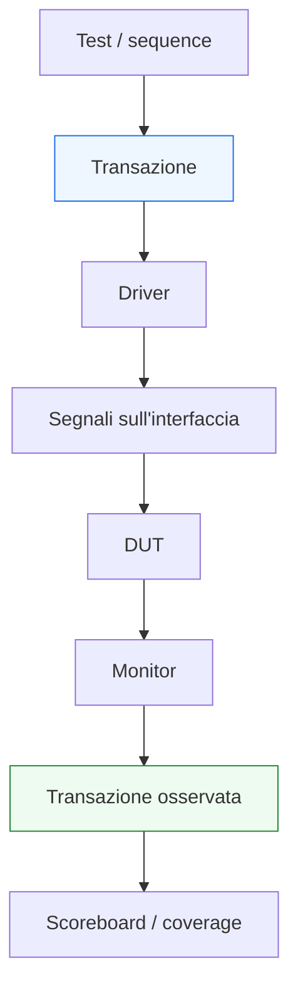

# Panoramica di UVM

Dopo aver introdotto la sezione **UVM**, il passo successivo naturale è costruire una visione d’insieme chiara della metodologia prima di entrare nei singoli componenti. Questa pagina ha proprio questo scopo: spiegare **che cos’è UVM**, **perché viene usata**, **quali problemi risolve** e **come leggere la sua architettura generale** senza perdersi subito nei dettagli delle classi o nelle convenzioni del framework.

Per chi proviene da una base di **RTL**, **testbench SystemVerilog** e **verifica di base**, UVM può apparire inizialmente come un livello di complessità aggiuntivo. In realtà, il suo senso emerge quando il DUT cresce e la verifica richiede:
- più casi di test;
- più configurazioni;
- più interfacce;
- maggiore riuso;
- separazione più netta tra generazione degli stimoli, osservazione e checking;
- regressione più sistematica;
- coverage più organizzata;
- migliore capacità di debug.

Dal punto di vista pratico, UVM è una metodologia standardizzata costruita sopra SystemVerilog per organizzare il testbench in modo **modulare**, **riusabile** e **scalabile**. Il suo obiettivo non è “rendere la verifica più astratta” in senso gratuito, ma aiutare a gestire la crescente complessità dei testbench moderni in modo disciplinato.

Questa pagina introduttiva non entra ancora nel dettaglio di:
- `driver`
- `sequencer`
- `monitor`
- `agent`
- `environment`
- `scoreboard`
- `factory`
- `phasing`

Questi temi verranno affrontati nelle pagine successive. Qui interessa soprattutto fissare:
- la motivazione di UVM;
- la sua visione metodologica;
- il lessico base;
- la struttura mentale con cui leggere i componenti del framework.

## 1. Che cos’è UVM

La **Universal Verification Methodology** è una metodologia standard per la verifica funzionale di design digitali, costruita sopra SystemVerilog, pensata per favorire:
- organizzazione chiara del testbench;
- separazione dei ruoli tra componenti;
- riuso di infrastruttura di verifica;
- configurabilità degli ambienti;
- supporto a test multipli e regressione;
- integrazione con checking, coverage e debugging.

### 1.1 Non solo libreria di classi
È importante capire subito che UVM non coincide semplicemente con:
- un set di classi predefinite;
- una sintassi particolare;
- una collezione di macro da usare meccanicamente.

Il suo valore reale sta nel fatto che propone una **architettura del testbench** e un modo coerente di organizzare la verifica.

### 1.2 UVM come metodologia
Dire che UVM è una metodologia significa che:
- suggerisce ruoli precisi per i componenti;
- impone una certa separazione tra responsabilità;
- favorisce il riuso di parti del testbench;
- rende più naturale far crescere la verifica nel tempo.

### 1.3 UVM come linguaggio organizzativo della verifica
In pratica, UVM aiuta a trasformare il testbench da:
- blocco locale e monolitico
a:
- ambiente gerarchico e strutturato.

Questo è il passaggio chiave per comprenderne il senso.

## 2. Perché UVM è utile

Per capire quando UVM ha valore, conviene partire dai limiti di un testbench SystemVerilog semplice.

### 2.1 Quando un testbench semplice basta
Per blocchi molto piccoli o verifiche molto locali, può essere sufficiente un banco di prova con:
- clock e reset;
- stimoli scritti direttamente;
- qualche checker;
- qualche assertion;
- casi di prova limitati.

### 2.2 Quando iniziano i problemi
Quando però il DUT cresce, emergono esigenze come:
- riusare la stessa logica di stimolo in test diversi;
- verificare più configurazioni;
- supportare più interfacce;
- separare meglio stimolo e osservazione;
- costruire scoreboards e monitor più ordinati;
- far crescere la regressione senza duplicare codice.

In questi casi, un testbench monolitico tende a diventare:
- difficile da leggere;
- poco riusabile;
- fragile nelle modifiche;
- difficile da manutenere;
- poco scalabile.

### 2.3 Che cosa offre UVM
UVM introduce una disciplina che aiuta a:
- modularizzare il testbench;
- riusare componenti;
- cambiare gli scenari di test senza riscrivere tutta l’infrastruttura;
- separare chiaramente chi genera stimoli, chi li guida sul DUT e chi osserva la risposta;
- strutturare meglio coverage e debug.

## 3. Il problema che UVM cerca di risolvere

La motivazione di UVM si capisce molto bene se si osserva il problema di fondo della verifica moderna: la complessità cresce più rapidamente della capacità di gestirla con testbench improvvisati.

### 3.1 Crescita del DUT
Al crescere del DUT aumentano:
- numero di interfacce;
- protocolli da rispettare;
- configurazioni possibili;
- casi di corner case;
- scenari di temporizzazione;
- interazioni tra sottoblocchi.

### 3.2 Crescita del testbench
Se il testbench non viene strutturato bene, cresce anch’esso in modo caotico:
- più codice duplicato;
- più casi speciali hard-coded;
- più checking mescolato agli stimoli;
- più difficoltà nel riuso;
- più bug nel banco di prova stesso.

### 3.3 Strategia UVM
UVM affronta questo problema introducendo:
- componenti specializzati;
- gerarchia ordinata;
- comunicazione standard tra componenti;
- configurazione centralizzata;
- riuso di agent, sequenze e ambienti;
- separazione tra scenario di test e infrastruttura.

## 4. Da segnale a transazione

Uno dei passaggi concettuali più importanti che UVM introduce è il passaggio dal livello di segnale al livello di **transazione**.

### 4.1 Livello di segnale
Il DUT continua a essere verificato tramite segnali reali:
- clock;
- reset;
- bus dati;
- `valid`;
- `ready`;
- `start`;
- `done`;
- stati e flag.

### 4.2 Livello di transazione
Nel testbench UVM, però, gli scenari vengono spesso descritti in termini più astratti:
- richiesta;
- pacchetto;
- payload;
- operazione;
- comando;
- risposta.

Questi oggetti astratti vengono rappresentati come **transaction object**, spesso derivati da `sequence item`.

### 4.3 Perché questo è utile
Questo livello intermedio rende più facile:
- costruire scenari di test;
- riusare stimoli;
- astrarre dal dettaglio del singolo fronte di clock;
- separare il “che cosa voglio verificare” dal “come lo applico sui segnali”.

## 5. Architettura generale di un testbench UVM

Senza entrare ancora troppo in profondità, è utile avere da subito una mappa mentale dei blocchi principali.

### 5.1 Test
Il `test` definisce lo scenario generale della simulazione e configura l’ambiente.

### 5.2 Environment
L’`environment` è il contenitore di alto livello che raggruppa agent, scoreboards e altri componenti della verifica.

### 5.3 Agent
Un `agent` raccoglie tipicamente i componenti legati a una certa interfaccia del DUT:
- driver;
- sequencer;
- monitor.

### 5.4 Driver
Il `driver` prende transazioni e le traduce in attività sui segnali fisici del DUT.

### 5.5 Sequencer e sequence
Il `sequencer` coordina il flusso delle transazioni generate dalle `sequence`, che descrivono lo stimolo a livello transazionale.

### 5.6 Monitor
Il `monitor` osserva l’interfaccia del DUT e ricostruisce ciò che è realmente accaduto.

### 5.7 Scoreboard
Lo `scoreboard` confronta atteso e osservato, contribuendo al checking funzionale.

### 5.8 Coverage e subscriber
Componenti dedicati possono raccogliere coverage o reagire agli eventi osservati per statistiche, logging o checking supplementare.

## 6. La separazione delle responsabilità

Uno dei motivi per cui UVM è potente è la forte separazione delle responsabilità tra i componenti.

### 6.1 Chi genera lo scenario
Le `sequence` descrivono lo stimolo in termini di transazioni.

### 6.2 Chi guida il DUT
Il `driver` è responsabile della traduzione della transazione in attività elettricamente o logicamente significative sui segnali.

### 6.3 Chi osserva
Il `monitor` guarda il DUT dall’esterno e ricostruisce il comportamento osservato.

### 6.4 Chi controlla
Lo `scoreboard` o altri checker confrontano il comportamento osservato con quello atteso.

### 6.5 Perché questa divisione è importante
Questa separazione aiuta moltissimo a:
- riusare componenti;
- cambiare i test senza cambiare il monitor;
- migliorare il debug;
- mantenere il testbench leggibile;
- far crescere la verifica in modo più robusto.

## 7. UVM e riuso

Il riuso è uno dei grandi vantaggi di UVM.

### 7.1 Riuso di agent
Un agent costruito bene per una certa interfaccia può essere riutilizzato:
- in più test;
- in più configurazioni;
- in più ambienti;
- talvolta anche in blocchi o sottosistemi simili.

### 7.2 Riuso delle sequence
Le sequenze possono essere combinate o specializzate per costruire:
- smoke test;
- corner case;
- stress test;
- sequenze di protocollo;
- campagne di regressione.

### 7.3 Riuso della struttura
Un environment ordinato rende possibile:
- aggiungere nuovi checker;
- estendere la coverage;
- integrare nuovi agent;
- riusare l’ossatura del testbench in progetti correlati.

## 8. UVM e configurazione

Un altro elemento importante della metodologia è la configurazione del testbench.

### 8.1 Perché serve configurare
Spesso si vuole cambiare:
- modalità attiva o passiva di un agent;
- numero di istanze;
- politiche di checking;
- parametri del protocollo;
- scenari di test;
- comportamento delle sequenze.

### 8.2 Configurazione senza riscrivere
UVM fornisce meccanismi per configurare l’ambiente senza dover duplicare tutto il codice del banco di prova.

### 8.3 Vantaggio metodologico
Questo contribuisce a mantenere separati:
- struttura stabile dell’ambiente;
- varianti specifiche dei test.

## 9. UVM e phasing

Uno dei concetti che più caratterizzano UVM è il **phasing**, cioè la suddivisione ordinata del ciclo di vita dei componenti del testbench.

### 9.1 Perché serve
In un ambiente gerarchico complesso, è utile che tutti i componenti seguano fasi ben definite:
- costruzione;
- connessione;
- esecuzione;
- report finale.

### 9.2 Beneficio
Questo aiuta a:
- creare i componenti in ordine coerente;
- collegare driver, monitor e scoreboards correttamente;
- evitare inizializzazioni improvvisate;
- rendere il flusso del testbench più prevedibile.

### 9.3 Aspetto importante
Il phasing non è un dettaglio burocratico di UVM: è uno dei modi con cui la metodologia impone ordine all’ambiente di verifica.

## 10. UVM e DUT reale

È importante ricordare che UVM non sostituisce la comprensione del DUT. Al contrario, un buon testbench UVM richiede una conoscenza molto chiara del design.

### 10.1 Il DUT resta al centro
Per costruire bene driver, monitor, scoreboards e sequenze, bisogna capire:
- protocollo delle interfacce;
- semantica del reset;
- latenza attesa;
- backpressure;
- comportamento della FSM;
- struttura del datapath;
- vincoli di timing logico osservabili in simulazione.

### 10.2 UVM non “magicamente” verifica il DUT
La metodologia aiuta a organizzare il testbench, ma:
- non sostituisce la specifica;
- non elimina il bisogno di buone assertion;
- non sostituisce il thinking architetturale;
- non evita i bug se i checker sono sbagliati.

### 10.3 UVM come moltiplicatore della qualità del metodo
Se il progetto è ben compreso e il testbench è ben pensato, UVM aiuta a rendere questa qualità più scalabile. Se la comprensione del DUT è debole, UVM può solo mascherare il problema dietro una struttura apparentemente sofisticata.

## 11. UVM nel contesto FPGA, ASIC e SoC

UVM ha valore in diversi contesti, ma con sfumature differenti.

### 11.1 Su FPGA
Nel flusso FPGA, UVM può essere molto utile per:
- validare protocolli e blocchi prima della prototipazione;
- stressare configurazioni;
- costruire ambienti riusabili su interfacce e sottoblocchi.

### 11.2 Su ASIC
Nel flusso ASIC, UVM è spesso particolarmente centrale, perché la verifica block-level e subsystem-level richiede:
- riuso;
- regressioni ampie;
- forte disciplina metodologica;
- integrazione di coverage e checking.

### 11.3 Nei SoC
In ambiente SoC, il riuso di agent e ambienti diventa ancora più importante, perché si devono verificare:
- interconnessioni;
- protocolli multipli;
- sottosistemi;
- scenari configurabili;
- comportamenti emergenti da più blocchi insieme.

## 12. UVM non è obbligatorio, ma è utile quando la complessità cresce

È importante evitare due errori opposti:
- pensare che UVM sia sempre necessario;
- pensare che sia solo sovrastruttura inutile.

### 12.1 Quando può essere eccessivo
Per un modulo molto piccolo e una verifica molto locale, UVM può introdurre più struttura del necessario.

### 12.2 Quando diventa molto utile
Quando il problema di verifica include:
- più interfacce;
- molti scenari di test;
- più test da mantenere nel tempo;
- riuso di componenti;
- need di regressione e coverage ben organizzate;

allora UVM diventa spesso una scelta molto sensata.

### 12.3 Criterio corretto
Non bisogna chiedersi “UVM è moderno o no?”, ma:
- la complessità del mio problema di verifica richiede una metodologia più strutturata?

Questa è la vera domanda.

## 13. Errori comuni nel primo approccio a UVM

Quando si inizia, alcuni equivoci sono molto frequenti.

### 13.1 Imparare i nomi senza capire i ruoli
Sapere che esistono `driver`, `monitor` o `sequencer` non basta. Bisogna capire perché sono separati.

### 13.2 Vedere UVM come pura sintassi
Il punto non è usare le macro giuste, ma costruire una buona architettura di verifica.

### 13.3 Credere che UVM sostituisca la specifica
UVM organizza il testbench, ma non definisce da solo che cosa sia corretto.

### 13.4 Voler costruire subito ambienti troppo complessi
Conviene partire da una comprensione chiara dei componenti essenziali, non da una replica meccanica di template complessi.

### 13.5 Dimenticare il DUT
Un buon ambiente UVM nasce da una buona comprensione del protocollo e dell’architettura del DUT.

## 14. Come leggere le prossime pagine della sezione

Dopo questa panoramica, la lettura della sezione UVM può diventare molto più lineare.

### 14.1 Prima il quadro strutturale
Le prossime pagine naturali sono quelle che spiegano:
- architettura generale del testbench UVM;
- componenti principali;
- ruoli dei blocchi.

### 14.2 Poi il flusso delle transazioni
Successivamente ha senso entrare in:
- sequence item;
- sequencer;
- sequence;
- virtual sequence.

### 14.3 Poi la connessione col DUT
Infine si chiariscono bene:
- driver;
- monitor;
- agent;
- interfacce;
- TLM;
- environment;
- scoreboard;
- test e configurazione.

### 14.4 Progressione consigliata
La cosa importante è non affrontare UVM come elenco di classi, ma come:
- architettura del testbench;
- flusso delle informazioni;
- disciplina della verifica.

## 15. In sintesi

UVM è una metodologia di verifica costruita sopra SystemVerilog che aiuta a organizzare il testbench in modo più modulare, riusabile e scalabile. Il suo valore emerge soprattutto quando la complessità del DUT e della verifica supera ciò che un banco di prova semplice può gestire in modo ordinato.

I concetti chiave da fissare fin da subito sono:
- passaggio da segnali a transazioni;
- separazione delle responsabilità tra componenti;
- architettura gerarchica del testbench;
- riuso di agent, sequenze e ambienti;
- configurazione e phasing come strumenti di ordine;
- forte legame tra qualità del DUT e qualità del testbench.

Capire questa panoramica significa creare la base giusta per affrontare i componenti UVM non come elementi isolati, ma come parti di una metodologia coerente.

## Prossimo passo

Il passo più naturale ora è **`uvm-architecture.md`**, per descrivere in modo ordinato:
- struttura gerarchica del testbench UVM
- relazione tra test, environment, agent e componenti interni
- flusso delle informazioni tra generazione, guida, monitoraggio e checking
- modo corretto di leggere l’architettura complessiva prima di entrare nei dettagli di ogni blocco
