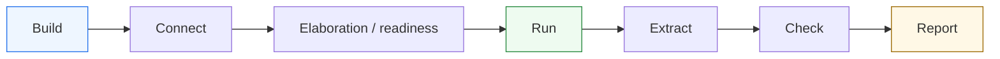
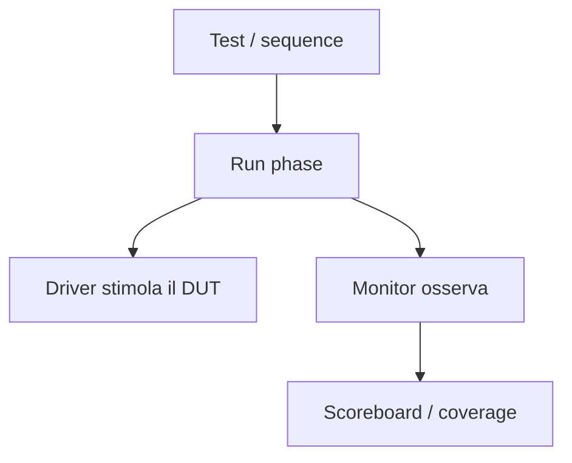

# Phasing UVM

Dopo aver introdotto la **panoramica di UVM**, l’**architettura del testbench** e i **componenti principali**, il passo successivo naturale è affrontare uno dei meccanismi che più caratterizzano la metodologia: il **phasing**.

Il phasing è il modo con cui UVM organizza nel tempo il ciclo di vita dei componenti del testbench. In un ambiente semplice, si potrebbe essere tentati di costruire tutto “in un unico flusso”:
- creare i componenti;
- collegarli;
- avviare la simulazione;
- lanciare lo stimolo;
- raccogliere risultati.

In un ambiente UVM, però, questa sequenza viene resa esplicita e strutturata in **fasi**. Questo è molto importante perché il testbench UVM è:
- gerarchico;
- composto da più componenti cooperanti;
- configurabile;
- spesso riusabile su più DUT o più scenari;
- adatto a crescere da block-level a subsystem-level.

Dal punto di vista metodologico, il phasing serve a garantire che ogni componente faccia la cosa giusta **nel momento giusto**:
- essere creato;
- ricevere configurazione;
- essere collegato agli altri componenti;
- partecipare alla simulazione attiva;
- contribuire al report finale.

Questa pagina introduce il phasing UVM con un taglio coerente con il resto della documentazione:
- didattico ma tecnico;
- focalizzato sul significato delle fasi;
- attento al rapporto tra gerarchia del testbench e ordine temporale delle operazioni;
- orientato a far capire perché il phasing non è solo “burocrazia del framework”, ma una parte fondamentale della qualità architetturale del testbench.

## 1. Perché serve il phasing

La prima domanda da porsi è: perché UVM introduce fasi esplicite per il testbench?

### 1.1 Il problema di un ambiente non strutturato
Se un testbench cresce senza una chiara separazione temporale delle attività, si rischia di:
- creare componenti troppo tardi o troppo presto;
- usare oggetti prima che siano configurati;
- collegare componenti in modo ambiguo;
- lanciare stimoli prima che l’ambiente sia pronto;
- ottenere testbench fragili e difficili da mantenere.

### 1.2 La risposta UVM
UVM risolve questo problema introducendo un ciclo di vita ordinato e condiviso da tutti i componenti.

### 1.3 Beneficio metodologico
Il phasing aiuta a:
- dare ordine all’inizializzazione;
- mantenere prevedibile il comportamento del testbench;
- supportare la gerarchia dei componenti;
- favorire riuso e configurazione;
- rendere più leggibile il flusso della verifica.

## 2. Che cos’è una fase UVM

Una fase UVM è una porzione del ciclo di vita del testbench in cui i componenti svolgono un certo tipo di attività.

### 2.1 Significato essenziale
Ogni fase ha uno scopo preciso, per esempio:
- costruzione dei componenti;
- collegamento dei canali interni;
- esecuzione del traffico di verifica;
- raccolta dei risultati;
- generazione del report finale.

### 2.2 Livello di applicazione
Le fasi non appartengono solo al `test`, ma a tutta la gerarchia del testbench:
- test;
- environment;
- agent;
- driver;
- monitor;
- scoreboard;
- coverage collector;
- altri componenti UVM.

### 2.3 Perché questo è importante
Il phasing rende possibile un comportamento coerente di componenti diversi anche in ambienti complessi e profondamente gerarchici.

## 3. Due famiglie concettuali di fasi

Per leggere bene il phasing, è utile distinguere due grandi famiglie di fasi.

### 3.1 Fasi di costruzione e preparazione
Servono a:
- creare i componenti;
- configurarli;
- collegarli;
- rendere pronto l’ambiente.

### 3.2 Fasi di esecuzione e chiusura
Servono a:
- eseguire lo scenario di test;
- raccogliere e analizzare i risultati;
- produrre controlli finali e report.

### 3.3 Perché la distinzione conta
Questa separazione aiuta a capire che:
- prima si costruisce l’infrastruttura;
- poi la si usa per la simulazione attiva;
- infine si raccolgono gli esiti.

## 4. `build_phase`: costruire la gerarchia

La `build_phase` è una delle fasi più importanti e intuitive.

### 4.1 Che cosa si fa qui
In questa fase si costruiscono i componenti del testbench:
- environment;
- agent;
- driver;
- sequencer;
- monitor;
- scoreboard;
- subscriber;
- eventuali reference model.

### 4.2 Significato architetturale
La build phase è il momento in cui prende forma la gerarchia del testbench.

### 4.3 Perché è così importante
Se la costruzione della gerarchia non è ordinata:
- la configurazione diventa fragile;
- il collegamento tra componenti diventa confuso;
- il testbench diventa difficile da estendere.

## 5. `connect_phase`: collegare i componenti

Dopo la costruzione, serve collegare i componenti tra loro.

### 5.1 Che cosa si collega
In questa fase si impostano i collegamenti logici e funzionali, per esempio:
- connessioni tra monitor e scoreboard;
- canali di comunicazione tra componenti;
- collegamento tra sequencer e driver;
- vie di distribuzione delle transazioni osservate o attese.

### 5.2 Perché non farlo tutto in build
Separare build e connect rende più chiaro:
- chi esiste;
- chi è collegato a chi;
- quando il testbench è realmente pronto a funzionare.

### 5.3 Beneficio metodologico
Questa distinzione migliora leggibilità e manutenibilità dell’ambiente.

## 6. Fasi di elaborazione e prontezza

Tra la costruzione e la simulazione attiva esistono fasi che aiutano a stabilizzare e verificare la preparazione dell’ambiente.

### 6.1 Scopo concettuale
Servono a:
- controllare che la struttura sia completa;
- consolidare la configurazione;
- rendere chiaro che il testbench sta passando da “infrastruttura costruita” a “infrastruttura pronta”.

### 6.2 Valore metodologico
Anche se spesso percepite come meno “operative”, queste fasi aiutano a mantenere ordinato il passaggio tra costruzione ed esecuzione.

## 7. `run_phase`: esecuzione del testbench

La `run_phase` è la fase più intuitivamente associata alla simulazione attiva.

### 7.1 Che cosa avviene qui
Durante la run phase:
- si attivano le sequence;
- il driver guida il DUT;
- il monitor osserva il comportamento;
- il scoreboard confronta atteso e osservato;
- la coverage viene raccolta;
- il testbench vive davvero nel tempo di simulazione.

### 7.2 Perché è centrale
È la fase in cui il DUT viene effettivamente verificato sotto stimolo.

### 7.3 Punto importante
La run phase non è l’unica fase importante, ma è quella in cui il testbench esercita concretamente il design.

## 8. Il significato del tempo nella `run_phase`

La run phase è diversa dalle altre perché è strettamente legata al tempo di simulazione.

### 8.1 Tempo di simulazione
Qui contano:
- clock;
- reset;
- handshake;
- latenza;
- sequenze temporali;
- durata degli scenari;
- condizioni di stop del test.

### 8.2 Perché è diversa dalle fasi di costruzione
Build e connect sono fasi strutturali. La run phase è una fase dinamica.

### 8.3 Impatto sul DUT
È il momento in cui il testbench incontra davvero:
- pipeline;
- FSM;
- protocolli;
- backpressure;
- reset durante attività;
- coverage di casi reali.

## 9. `extract`, `check` e `report`

Dopo la simulazione attiva, il phasing UVM prevede fasi che aiutano a chiudere il test in modo ordinato.

### 9.1 `extract`
Questa fase è concettualmente utile per raccogliere o consolidare i risultati emersi durante la simulazione.

### 9.2 `check`
Qui si possono esprimere controlli finali sullo stato complessivo della verifica:
- tutti i confronti hanno chiuso correttamente?
- ci sono mismatch residui?
- il numero di transazioni osservate è coerente?
- l’ambiente ha raggiunto le condizioni attese?

### 9.3 `report`
È la fase in cui il testbench produce il resoconto finale:
- esito del test;
- eventuali errori;
- statistiche;
- coverage;
- risultati di checking.

### 9.4 Perché queste fasi contano
Rendono esplicita la chiusura del processo di verifica, evitando che il testbench termini in modo informale o poco leggibile.

## 10. Il phasing come ordine condiviso in tutta la gerarchia

Uno degli aspetti più utili del phasing è che tutti i componenti UVM partecipano allo stesso ciclo di vita.

### 10.1 Visione gerarchica
Il test, l’environment, gli agent e i componenti interni condividono una sequenza ordinata di fasi.

### 10.2 Perché è potente
Questo permette a un ambiente grande di restare coerente senza che ogni componente inventi il proprio flusso di inizializzazione.

### 10.3 Effetto architetturale
Il phasing è quindi un meccanismo di coordinamento globale del testbench.

## 11. Phasing e separazione delle responsabilità

Il phasing aiuta molto la qualità architetturale del testbench.

### 11.1 Costruzione separata dall’esecuzione
Un componente non dovrebbe mescolare:
- creazione della propria struttura;
- collegamento agli altri;
- esecuzione della logica di verifica;
- controllo finale dei risultati.

### 11.2 Beneficio
Questo rende ogni componente più leggibile e più focalizzato.

### 11.3 Connessione con il resto di UVM
La stessa filosofia con cui UVM separa:
- sequence;
- sequencer;
- driver;
- monitor;
- scoreboard;

viene applicata anche nel tempo tramite il phasing.

## 12. Phasing e configurazione dell’ambiente

Il phasing è strettamente legato alla configurazione.

### 12.1 Quando la configurazione conta
Un componente deve essere configurato prima di essere usato operativamente.

### 12.2 Perché build e connect sono essenziali
Le fasi iniziali rendono possibile:
- istanziare correttamente i componenti;
- impostare opzioni;
- abilitare agent attivi o passivi;
- configurare monitor, scoreboards e coverage;
- preparare il flusso della run phase.

### 12.3 Beneficio pratico
Questo rende il testbench molto più modulare e adattabile a scenari diversi.

## 13. Phasing e DUT reale

Il phasing diventa particolarmente importante quando il DUT è non banale.

### 13.1 DUT con più interfacce
Se esistono più agent, il phasing garantisce che tutti i lati dell’ambiente siano costruiti e collegati in modo coerente prima di iniziare lo stimolo.

### 13.2 DUT con reset e pipeline
La run phase deve essere il luogo in cui si gestiscono:
- reset;
- avvio del traffico;
- osservazione della latenza;
- checking dei protocolli nel tempo.

### 13.3 DUT con scenari complessi
Più il DUT è vicino a un subsystem, più il phasing aiuta a mantenere controllato il ciclo di vita dell’ambiente.

## 14. Phasing e debug

Il phasing aiuta anche a fare debug in modo più ordinato.

### 14.1 Problemi di costruzione
Se un componente non esiste o non è configurato correttamente, il problema emerge nelle fasi iniziali.

### 14.2 Problemi di collegamento
Se monitor e scoreboard non sono connessi come previsto, il problema riguarda la connect phase.

### 14.3 Problemi dinamici
Se lo scenario di verifica fallisce nel tempo, il problema emerge in run phase.

### 14.4 Problemi di chiusura
Mismatch finali, statistiche incoerenti o check conclusivi falliti emergono nelle fasi finali di check e report.

### 14.5 Beneficio diagnostico
Questo rende più facile capire **quando** qualcosa è andato storto, non solo **che cosa** è andato storto.

## 15. Errori comuni nel comprendere il phasing

Alcuni errori sono molto frequenti all’inizio.

### 15.1 Vederlo come burocrazia del framework
Il phasing non è una formalità inutile: è il modo con cui UVM organizza il ciclo di vita del testbench.

### 15.2 Fare troppo lavoro nella fase sbagliata
Per esempio:
- costruire dinamicamente strutture che dovrebbero essere già pronte;
- collegare componenti troppo tardi;
- mettere logica di configurazione dentro il flusso operativo;
- fare checking finale in modo improvvisato.

### 15.3 Pensare che conti solo la run phase
La run phase è centrale, ma senza build, connect e fasi finali ben gestite il testbench perde robustezza.

### 15.4 Dimenticare la gerarchia
Il phasing funziona bene proprio perché attraversa tutta la gerarchia del testbench.

## 16. Buone pratiche di modellazione

Per usare bene il phasing UVM, alcune linee guida sono particolarmente efficaci.

### 16.1 Usare ogni fase per lo scopo giusto
- build per costruire
- connect per collegare
- run per eseguire
- check/report per chiudere e analizzare

### 16.2 Mantenere chiaro il ciclo di vita dei componenti
Ogni componente dovrebbe essere leggibile rispetto al proprio ruolo nelle fasi.

### 16.3 Non concentrare tutto nella run phase
Un ambiente ordinato distribuisce le responsabilità nel tempo.

### 16.4 Pensare alla diagnosi
Il phasing aiuta il debug proprio perché rende il flusso del testbench più strutturato.

### 16.5 Collegarlo all’architettura del DUT
Le fasi iniziali preparano l’ambiente, ma la run phase deve riflettere bene i bisogni del DUT:
- protocollo;
- reset;
- latenza;
- coverage;
- checking.

## 17. Collegamento con il resto della sezione

Questa pagina si collega direttamente a:
- **`uvm-architecture.md`**, che ha mostrato la gerarchia del testbench;
- **`uvm-components.md`**, che ha chiarito i ruoli dei componenti;
- **`test.md`**, che userà il phasing per descrivere meglio il ruolo del test;
- **`environment.md`** e **`agent.md`**, che vivono attraverso le fasi di costruzione, connessione ed esecuzione;
- **`simulation-workflow.md`** della sezione SystemVerilog, che può essere letto come il corrispettivo metodologico generale del flusso che UVM rende più strutturato.

Prepara inoltre bene la lettura di:
- **`objections.md`**
- **`reporting.md`**
- **`uvm-factory-config.md`**

perché tutti questi temi si appoggiano al corretto ciclo di vita del testbench.

## 18. In sintesi

Il phasing UVM è il meccanismo con cui la metodologia organizza nel tempo il ciclo di vita dei componenti del testbench. Serve a separare in modo ordinato:
- costruzione;
- connessione;
- esecuzione;
- analisi finale;
- reporting.

Il suo valore non è solo tecnico, ma fortemente metodologico: rende il testbench più prevedibile, più leggibile e più adatto a crescere in complessità senza perdere struttura.

Capire il phasing significa capire che UVM non organizza solo **chi fa cosa**, ma anche **quando ogni componente deve farlo**.

## Prossimo passo

Il passo più naturale ora è **`uvm-factory-config.md`**, perché completa in modo diretto i fondamenti della metodologia chiarendo:
- come UVM rende l’ambiente configurabile
- come si controlla la sostituzione dei componenti
- perché factory e configurazione sono centrali per riuso, flessibilità e regressione
