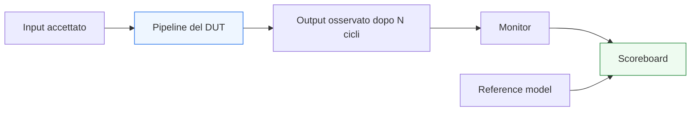

# UVM per pipeline e latenza

Dopo aver introdotto UVM nel contesto dei **protocolli a handshake**, il passo successivo naturale è affrontare uno dei temi che rendono la verifica più interessante e più delicata: la presenza di **latenza** e **pipeline** nel DUT.

Molti blocchi digitali reali non rispondono immediatamente a un input. Tra il momento in cui una transazione viene accettata e il momento in cui il risultato diventa osservabile possono esistere:
- uno o più cicli di ritardo;
- più stadi di pipeline;
- condizioni di stall;
- backpressure;
- più transazioni contemporaneamente in volo;
- regole di ordering da rispettare.

Dal punto di vista UVM, questi scenari sono particolarmente importanti perché mettono sotto stress quasi tutti i componenti del testbench:
- il `driver` deve sostenere il ritmo corretto del traffico;
- il `monitor` deve osservare in modo accurato eventi distribuiti nel tempo;
- lo `scoreboard` deve correlare input e output non più “vicini” nel tempo;
- il `reference model` deve produrre un atteso coerente con il comportamento osservabile del DUT;
- la `coverage` deve misurare non solo i valori, ma anche condizioni di throughput, stall, ordering e latenza;
- il `debug` deve distinguere tra difetti del DUT e limiti della correlazione nel testbench.

Questa pagina introduce pipeline e latenza nel contesto UVM con un taglio coerente con il resto della documentazione:
- didattico ma tecnico;
- centrato sul rapporto tra comportamento temporale del DUT e architettura del testbench;
- attento al legame tra RTL, protocollo, checking e coverage;
- orientato a far capire come UVM permetta di verificare correttamente comportamenti non immediati e non banali nel tempo.

## 1. Perché pipeline e latenza sono centrali nella verifica

La prima domanda importante è: perché questi temi meritano una trattazione specifica?

### 1.1 Il limite del confronto immediato
Per DUT molto semplici, si può talvolta pensare il checking come:
- applico un input;
- osservo subito l’output;
- confronto i due.

Ma appena compaiono:
- ritardo di elaborazione;
- stadi intermedi;
- throughput continuo;
- più transazioni accettate in sequenza;

questa visione non basta più.

### 1.2 La realtà dei DUT moderni
Molti blocchi reali usano pipeline per:
- aumentare la frequenza;
- separare funzioni;
- migliorare throughput;
- distribuire il calcolo su più stadi;
- sostenere flussi continui di dati.

### 1.3 Perché UVM è molto adatto
UVM è particolarmente utile qui perché già lavora a livello:
- transazionale;
- di osservazione strutturata;
- di confronto separato tra atteso e osservato;
- di coverage guidata da scenari reali.

## 2. Che cos’è la latenza

La **latenza** è il ritardo tra il momento in cui il DUT accetta una transazione significativa e il momento in cui il relativo effetto o risultato diventa osservabile.

### 2.1 Significato essenziale
Per esempio:
- input accettato al ciclo `t`
- output osservabile al ciclo `t + N`

### 2.2 Perché è importante in verifica
La latenza influenza:
- la correlazione tra input e output;
- il momento del confronto;
- il significato dei timeout;
- la struttura dello scoreboard;
- la coverage dei casi temporali.

### 2.3 Latenza osservabile vs latenza interna
Il testbench non ha sempre bisogno di conoscere ogni dettaglio microarchitetturale della pipeline, ma deve conoscere o saper gestire la latenza **osservabile** del comportamento del DUT.

## 3. Che cos’è una pipeline

Una **pipeline** è una struttura in cui l’elaborazione di una transazione è distribuita su più stadi nel tempo, permettendo spesso di avere più operazioni contemporaneamente in corso.

### 3.1 Significato essenziale
Mentre una transazione è in uno stadio avanzato:
- una nuova transazione può entrare nello stadio iniziale;
- più dati possono essere “in volo” nello stesso momento.

### 3.2 Perché è importante
Questo introduce problemi di verifica come:
- ordering;
- correlazione tra input e output;
- casi di stall;
- flush o reset;
- throughput effettivo;
- presenza simultanea di più risultati attesi.

### 3.3 Perché non basta guardare il dato
Il testbench deve considerare il comportamento del DUT nel tempo, non solo la correttezza del singolo valore isolato.

## 4. Latenza fissa e latenza variabile

Uno dei primi aspetti da chiarire è che non tutte le latenze sono uguali.

### 4.1 Latenza fissa
Ogni transazione produce un risultato dopo un numero costante di cicli.

### 4.2 Latenza variabile
Il ritardo può dipendere da:
- tipo di operazione;
- condizioni di backpressure;
- stato del DUT;
- presenza di stall;
- risorse interne;
- conflitti o dipendenze.

### 4.3 Perché questa distinzione conta
La struttura dello scoreboard, del model e del monitor può essere molto diversa nei due casi.

## 5. Più transazioni in volo

Una delle caratteristiche più importanti dei DUT pipelined è la possibilità di avere più transazioni contemporaneamente attive.

### 5.1 Che cosa significa
Il DUT può:
- accettare una nuova richiesta;
- mentre sta ancora elaborando richieste precedenti;
- e magari produrre risultati con un certo offset temporale.

### 5.2 Perché è un tema critico
Il testbench deve evitare errori come:
- confrontare l’output con l’input sbagliato;
- perdere il contesto di ordering;
- assumere che esista una sola transazione alla volta.

### 5.3 Implicazione UVM
Sequence, driver, monitor, scoreboard e reference model devono essere tutti coerenti con questa realtà.

## 6. Il ruolo del `driver` in presenza di pipeline

Il driver è il primo componente che incontra il comportamento temporale del DUT.

### 6.1 Che cosa deve fare
Deve:
- applicare il protocollo correttamente;
- sostenere il ritmo dello stimolo richiesto dal test;
- rispettare backpressure o condizioni di accettazione;
- non assumere erroneamente che il DUT debba completare una transazione prima di accettarne un’altra, salvo che il protocollo lo richieda.

### 6.2 Perché è importante
Un driver troppo semplificato può nascondere:
- problemi di throughput;
- problemi di ordering;
- limiti della pipeline del DUT;
- condizioni di stall.

### 6.3 Collegamento con la metodologia
Le sequence definiscono il traffico. Il driver lo traduce in modo coerente con il protocollo e con la capacità del DUT di accettare nuove transazioni.

## 7. Il ruolo del `monitor` in presenza di latenza

Il monitor è cruciale per capire quando un risultato è davvero apparso.

### 7.1 Che cosa deve osservare
Deve ricostruire:
- accettazione degli input;
- comparsa degli output;
- ordering effettivo;
- eventuali stall o pause;
- completamento reale delle transazioni.

### 7.2 Perché è importante
Il monitor fornisce la vista osservata che lo scoreboard userà per il confronto. Se questa vista è imprecisa, tutto il checking temporale si indebolisce.

### 7.3 Aspetto delicato
Nei DUT con latenza, il monitor non deve solo “vedere segnali”, ma capire **quando un evento ha davvero significato funzionale**.

## 8. Il ruolo dello `scoreboard` in presenza di pipeline

Lo scoreboard è probabilmente il componente che più chiaramente mostra la difficoltà dei DUT con pipeline e latenza.

### 8.1 Perché il confronto si complica
Non basta più confrontare:
- input attuale
con
- output attuale

Serve invece:
- mantenere il contesto delle transazioni attese;
- correlare output osservati con l’input corretto;
- considerare latenza fissa o variabile;
- tenere conto di ordering e possibili stall.

### 8.2 Problemi tipici
Lo scoreboard deve evitare:
- mismatch dovuti a confronto prematuro;
- associazione sbagliata input/output;
- perdita del contesto temporale;
- sottostima di casi in cui il DUT è corretto ma lento, o viceversa.

### 8.3 Perché è un punto centrale
Il checking temporale serio nei DUT pipelined vive soprattutto qui.

## 9. Il ruolo del `reference model`

Il reference model è il lato atteso del comportamento del DUT e diventa ancora più importante quando il risultato non è immediato.

### 9.1 Che cosa deve fare
Deve costruire una rappresentazione attesa coerente con:
- input accettati;
- configurazione del DUT;
- ordering previsto;
- semantica della latenza osservabile.

### 9.2 Perché è utile
Lo scoreboard da solo non può “inventare” il comportamento atteso. Il model gli fornisce il riferimento funzionale.

### 9.3 Aspetto importante
Il model non deve necessariamente replicare ogni dettaglio microarchitetturale della pipeline, ma deve essere coerente con il comportamento esterno che il testbench può verificare.

## 10. Ordering: un tema chiave

Quando si parla di pipeline e latenza, l’ordering diventa centrale.

### 10.1 Che cosa significa
Bisogna capire se il DUT:
- conserva l’ordine di ingresso;
- può riordinare risultati;
- può produrre output con tempi diversi ma ancora coerenti con la specifica.

### 10.2 Perché è importante
Uno scoreboard che assume un ordering sbagliato può produrre mismatch falsi oppure non rilevare errori reali.

### 10.3 Collegamento con la specifica
L’ordering non va dedotto in modo intuitivo: va letto dalla specifica o dalla semantica del DUT.

## 11. Stall e throughput

Un DUT pipelined non va verificato solo per correttezza funzionale, ma anche per il suo comportamento dinamico sotto carico.

### 11.1 Stall
Possono emergere condizioni in cui:
- uno stadio si ferma;
- il canale viene bloccato;
- il ritmo di avanzamento si riduce;
- l’output si ritarda.

### 11.2 Throughput
Può essere importante osservare:
- se il DUT accetta una transazione per ciclo;
- se il throughput degrada in certe condizioni;
- se la pipeline resta piena o si svuota;
- se burst consecutivi vengono realmente sostenuti.

### 11.3 Perché questi temi contano
Sono aspetti spesso essenziali per capire se il DUT si comporta correttamente nel suo contesto reale.

## 12. Coverage per pipeline e latenza

La coverage è uno degli strumenti più utili per verificare che il testbench stia davvero esercitando le regioni interessanti del comportamento temporale.

### 12.1 Casi da coprire
Per esempio:
- latenza minima;
- latenza massima;
- più transazioni in volo;
- stall;
- throughput continuo;
- burst consecutivi;
- reset durante traffico;
- ordering normale e casi limite.

### 12.2 Perché è importante
Molti bug di pipeline non emergono nei test nominali, ma nelle combinazioni di ritmo, pressione e temporizzazione.

### 12.3 Ruolo di subscriber e monitor
Questi sono i punti naturali per raccogliere coverage sulle dinamiche osservate.

## 13. Debug di pipeline e latenza

Il debug in questi scenari richiede metodo.

### 13.1 Domande utili
- il DUT ha accettato davvero l’input?
- l’output è arrivato troppo tardi o nel momento corretto?
- lo scoreboard sta correlando bene input e output?
- il monitor ricostruisce correttamente i completamenti?
- la sequence sta generando il traffico che si pensa di generare?

### 13.2 Perché è difficile
Molti errori possono sembrare simili:
- bug di DUT;
- bug di ordering;
- bug di scoreboard;
- bug di monitor;
- bug di configurazione del traffico.

### 13.3 Beneficio di UVM
Se il testbench è ben costruito, questi livelli restano distinguibili.

## 14. Pipeline e reset

Il reset in presenza di pipeline è un caso molto delicato.

### 14.1 Perché
Se il DUT viene resettato mentre ha transazioni in volo, bisogna capire:
- che cosa succede ai dati già accettati;
- quali output restano validi;
- se la pipeline si svuota;
- se il protocollo riparte in modo pulito.

### 14.2 Implicazione UVM
Driver, monitor, scoreboard e coverage devono essere progettati per trattare questi casi in modo coerente.

### 14.3 Valore della verifica
Questi scenari spesso rivelano bug reali e molto importanti.

## 15. Pipeline e DUT multi-agent

Quando il DUT ha più interfacce, pipeline e latenza diventano ancora più ricchi da verificare.

### 15.1 Esempi
- input e output separati;
- request e response su canali diversi;
- flussi di configurazione che influenzano la latenza;
- più canali concorrenti con ordering globale.

### 15.2 Implicazione per UVM
Serve coordinare:
- più monitor;
- più agent;
- più flussi attesi;
- scoreboards più ricchi;
- virtual sequence per scenari complessi.

### 15.3 Perché conta
Molti problemi di integrazione nascono proprio qui.

## 16. Errori comuni

Alcuni errori ricorrono spesso nella verifica UVM di DUT pipelined.

### 16.1 Assumere latenza fissa quando non lo è
Questo porta a mismatch falsi o a buchi nel checking.

### 16.2 Confrontare input e output troppo presto
Errore tipico nei DUT con ritardo.

### 16.3 Ignorare ordering
Molti bug reali sono di correlazione, non di dato puro.

### 16.4 Coverage troppo povera
Se si coprono solo i casi nominali, stall e throughput restano in ombra.

### 16.5 Driver troppo conservativo
Un driver che non stressa la pipeline può nascondere problemi importanti.

## 17. Buone pratiche di modellazione

Per verificare bene pipeline e latenza in UVM, alcune linee guida sono particolarmente utili.

### 17.1 Pensare in termini di transazioni in volo
Il testbench non deve ragionare come se esistesse una sola operazione alla volta.

### 17.2 Curare ordering e correlazione
Lo scoreboard deve essere coerente con la semantica reale del DUT.

### 17.3 Tenere distinti protocollo, osservazione e confronto
Questo aiuta moltissimo il debug.

### 17.4 Misurare anche il comportamento temporale
Coverage e reporting dovrebbero rendere visibili latenza, stall e throughput.

### 17.5 Considerare reset e casi di stress
Sono spesso le condizioni in cui la pipeline rivela i bug più seri.

## 18. Collegamento con il resto della sezione

Questa pagina si collega direttamente a:
- **`uvm-handshake-protocols.md`**, da cui eredita il contesto di input/output controllati da protocollo;
- **`scoreboard.md`**, che deve gestire correttamente ordering e correlazione;
- **`reference-model.md`**, che produce il lato atteso;
- **`coverage-uvm.md`**, che misura stall, burst, ordering e casi temporali;
- **`debug-uvm.md`**, che aiuta a isolare mismatch temporali e problemi di correlazione.

Prepara inoltre in modo naturale la pagina successiva:
- **`uvm-reset.md`**

oppure, se preferisci chiudere prima con un quadro applicativo,
- **`case-study-uvm.md`**

a seconda dell’ordine con cui vuoi completare la sezione.

## 19. In sintesi

L’uso di UVM per pipeline e latenza mostra chiaramente come la metodologia affronti il comportamento temporale reale del DUT. Quando il risultato non è immediato e più transazioni possono convivere nel tempo, il testbench deve saper gestire:
- latenza;
- ordering;
- throughput;
- stall;
- reset;
- più operazioni in volo.

Capire bene questo tema significa capire come UVM consenta di verificare in modo credibile non solo la correttezza del dato, ma anche la correttezza del comportamento nel tempo.

## Prossimo passo

Il passo più naturale ora è **`uvm-reset.md`**, perché completa in modo diretto l’integrazione col DUT reale affrontando:
- gestione del reset nei componenti UVM
- impatto del reset su driver, monitor e scoreboard
- reset in presenza di traffico, latenza e pipeline
