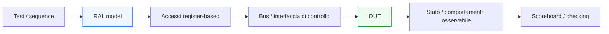

# UVM e registri: panoramica del RAL

Dopo aver introdotto UVM nel contesto di **protocolli a handshake**, **pipeline**, **latenza** e **reset**, il passo successivo naturale è affrontare un altro tema centrale nella verifica di molti DUT reali: il rapporto tra UVM e il mondo dei **registri**. In questo contesto entra in gioco il **RAL**, cioè il **Register Abstraction Layer**.

Molti blocchi digitali non si limitano a scambiare dati attraverso interfacce stream o request/response. Espongono anche una mappa di registri attraverso cui il software, il firmware o il testbench possono:
- configurare il comportamento del DUT;
- leggere stato interno esposto;
- avviare operazioni;
- controllare interrupt o flag;
- impostare modalità operative;
- osservare contatori, status e diagnostica.

Dal punto di vista UVM, questo è molto importante perché la verifica dei registri non riguarda solo:
- leggere e scrivere indirizzi;
- controllare che i dati tornino corretti.

Riguarda anche:
- coerenza tra configurazione e comportamento del DUT;
- allineamento tra vista del testbench e stato osservabile del design;
- relazione tra accessi ai registri e scenari di traffico;
- gestione ordinata di registri, campi, reset values, policy di accesso e side effect.

Questa pagina introduce il RAL con un taglio coerente con il resto della documentazione:
- didattico ma tecnico;
- centrato sul suo significato architetturale;
- attento al rapporto tra mappa registri, configurazione del DUT e testbench UVM;
- orientato a chiarire che il RAL non è un dettaglio accessorio, ma uno dei modi più efficaci per strutturare la verifica register-based.

## 1. Perché il tema dei registri è importante in UVM

La prima domanda importante è: perché i registri meritano una trattazione specifica nella sezione UVM?

### 1.1 Perché compaiono quasi ovunque
Molti DUT reali hanno:
- registri di configurazione;
- registri di stato;
- registri di controllo;
- flag di errore o interrupt;
- campi che influenzano datapath, FSM, latenza o protocolli.

### 1.2 Perché la loro verifica non è banale
Non basta verificare che una scrittura venga accettata. Bisogna anche capire:
- se il campo modifica davvero il comportamento del DUT;
- se i reset value sono corretti;
- se i registri readonly, write-only, clear-on-read o con side effect si comportano come previsto;
- se la vista del testbench resta coerente con quella del design.

### 1.3 Perché UVM offre un vantaggio forte
Il RAL permette di modellare i registri in modo strutturato e di collegare:
- accessi bus;
- semantica dei campi;
- configurazione del DUT;
- checking e debug.

## 2. Che cos’è il RAL

Il **Register Abstraction Layer** è un modello astratto della mappa registri del DUT, usato nel testbench UVM per rappresentare in modo ordinato:
- registri;
- campi;
- indirizzi;
- diritti di accesso;
- valori di reset;
- relazioni tra registri e comportamento atteso.

### 2.1 Significato essenziale
Il RAL non è il banco registri hardware del DUT. È la sua rappresentazione nel testbench.

### 2.2 Che cosa permette di fare
Permette di ragionare in termini di:
- nomi di registri;
- campi significativi;
- intenti di accesso;
- stato astratto dei registri;

invece che solo in termini di:
- indirizzi numerici;
- maschere bitwise;
- letture e scritture grezze sul bus.

### 2.3 Perché è importante
Rende la verifica register-based:
- più leggibile;
- più riusabile;
- più vicina alla specifica;
- più adatta a DUT grandi e ricchi di configurazione.

## 3. Perché serve un livello di astrazione sui registri

La domanda naturale è: perché non limitarsi a pilotare il bus di configurazione con sequence tradizionali?

### 3.1 Il limite dell’accesso grezzo
Se il testbench lavora solo con:
- indirizzi;
- dati;
- maschere;
- accessi low-level;

il codice tende a diventare:
- poco leggibile;
- fragile ai cambi di mappa;
- ripetitivo;
- difficile da mantenere;
- meno vicino alla semantica reale del DUT.

### 3.2 La risposta del RAL
Il RAL permette di esprimere l’accesso come:
- “scrivo questo registro”
- “leggo questo campo”
- “mi aspetto questo reset value”
- “verifico questa configurazione”

### 3.3 Beneficio metodologico
Si passa così dal livello:
- bus-oriented
al livello:
- register-oriented e field-oriented

## 4. Registro fisico e modello di registro

È molto importante distinguere bene questi due livelli.

### 4.1 Il registro fisico nel DUT
Fa parte dell’implementazione RTL:
- flip-flop o memorie;
- logica di scrittura/lettura;
- interfaccia bus;
- reset;
- eventuali side effect.

### 4.2 Il modello di registro nel testbench
È un oggetto che rappresenta:
- nome;
- campi;
- offset;
- diritti di accesso;
- valori attesi;
- stato astratto del registro.

### 4.3 Perché questa distinzione è utile
Permette al testbench di ragionare sulla mappa registri come parte della specifica, non solo come dettaglio di implementazione bus-level.

## 5. Registri e campi

Uno dei grandi vantaggi del RAL è la possibilità di modellare non solo il registro come parola intera, ma anche i suoi campi.

### 5.1 Perché i campi contano
Molti registri contengono:
- bit di enable;
- modalità operative;
- soglie;
- contatori;
- flag di stato;
- trigger di controllo.

### 5.2 Perché non basta la parola intera
Dal punto di vista funzionale, spesso interessa molto di più il significato di ciascun campo che non il valore dell’intero registro come numero.

### 5.3 Beneficio
Il RAL permette di lavorare in termini di:
- semantica dei bit;
- relazione con la specifica;
- impatto sul comportamento del DUT.

## 6. Accessi register-based e protocollo bus

Il RAL non sostituisce il bus. Si appoggia a esso.

### 6.1 Livello basso
Il DUT espone spesso un bus di controllo o configurazione:
- semplice bus interno;
- request/response;
- interfaccia memory-mapped;
- protocollo custom.

### 6.2 Livello alto
Il testbench, tramite RAL, ragiona in termini di registri e campi.

### 6.3 Perché è utile questa separazione
Il protocollo bus resta un problema di:
- driver;
- monitor;
- sequenze di bus.

Il RAL aggiunge sopra questo una vista:
- semantica;
- più leggibile;
- più vicina alla specifica.

## 7. RAL e `driver`

Il driver del bus di configurazione continua ad avere un ruolo fondamentale.

### 7.1 Che cosa cambia
Non guida più soltanto accessi grezzi scelti manualmente dal testbench, ma può diventare il mezzo con cui il modello di registro effettua operazioni di lettura e scrittura sul DUT.

### 7.2 Perché è importante
Questo mostra bene la separazione dei livelli:
- il RAL decide il significato dell’accesso;
- il driver implementa il protocollo a segnali del bus.

### 7.3 Beneficio
Si mantiene pulita la distinzione tra:
- significato del registro;
- meccanica del trasferimento sul bus.

## 8. RAL e `monitor`

Anche il monitor del canale di configurazione ha un ruolo importante.

### 8.1 Che cosa osserva
Può ricostruire:
- letture di registri;
- scritture;
- indirizzi;
- dati trasferiti;
- risposta del protocollo.

### 8.2 Perché è utile
Queste informazioni sono preziose per:
- debug;
- coverage;
- checking della corretta sequenza di accessi;
- allineamento tra attività sul bus e comportamento del DUT.

### 8.3 Collegamento metodologico
Il RAL non elimina la necessità del monitor: la rende più semantica e più utile.

## 9. RAL e `scoreboard`

Il rapporto tra RAL e scoreboard è molto interessante.

### 9.1 Non solo checking del bus
Lo scoreboard non deve limitarsi a verificare che una scrittura sia avvenuta. Può anche verificare che:
- il DUT si comporti coerentemente con la configurazione impostata;
- letture e side effect siano corretti;
- stato osservabile e stato modellato siano coerenti.

### 9.2 Perché il RAL aiuta
Fornisce una vista strutturata del significato dei registri, che lo scoreboard può usare come riferimento di contesto.

### 9.3 Beneficio
Il checking diventa più vicino alla funzione del DUT e meno dipendente dal solo traffico di bus.

## 10. RAL e `reference model`

Il RAL può interagire bene anche con il reference model.

### 10.1 Perché
Molti comportamenti attesi del DUT dipendono dalla configurazione attuale dei registri.

### 10.2 Ruolo del modello
Il reference model può usare la configurazione espressa tramite RAL per produrre attesi coerenti con:
- modalità operative;
- enable;
- soglie;
- politiche selezionate;
- condizioni di funzionamento del DUT.

### 10.3 Perché è importante
Questo rafforza il legame tra:
- configurazione register-based;
- comportamento osservabile del design;
- checking funzionale.

## 11. Reset value e coerenza del modello

Uno dei temi più interessanti nella verifica dei registri è il reset.

### 11.1 Perché conta
Molti registri hanno:
- valori di reset attesi;
- campi che devono partire in stato noto;
- bit che cambiano significato dopo il reset.

### 11.2 Ruolo del RAL
Il modello di registro può rappresentare questi valori attesi e aiutare il testbench a verificare che il DUT riparta correttamente.

### 11.3 Collegamento con la pagina sul reset
Questo si lega direttamente al tema già affrontato in **`uvm-reset.md`**, perché i registri sono spesso uno dei primi indicatori della correttezza della fase di reset e recovery.

## 12. RAL e side effect

I registri non sono sempre semplici contenitori di bit.

### 12.1 Casi tipici
Esistono registri o campi con comportamento come:
- clear-on-read;
- write-one-to-clear;
- write-only;
- readonly;
- set-on-event;
- flag con semantiche particolari.

### 12.2 Perché è importante
Questi casi sono difficili da gestire in modo pulito se il testbench lavora solo a livello di indirizzi e maschere.

### 12.3 Vantaggio del RAL
Il livello di astrazione rende più naturale modellare e verificare queste semantiche speciali.

## 13. RAL e coverage

Anche la coverage beneficia molto di una modellazione register-based.

### 13.1 Che cosa si può misurare
Per esempio:
- registri letti o scritti;
- campi esercitati;
- combinazioni di configurazione;
- reset value verificati;
- side effect osservati;
- interazioni tra configurazione e traffico.

### 13.2 Perché è utile
La coverage sui registri aiuta a capire non solo se il bus è stato attivo, ma se la **configurazione funzionale del DUT** è stata davvero esplorata.

### 13.3 Ruolo del subscriber
Subscriber e collector dedicati sono luoghi naturali per raccogliere questa informazione.

## 14. RAL e debug

Il RAL è molto utile anche nel debug.

### 14.1 Perché
Rende più leggibile:
- quale registro è stato scritto;
- quale campo era attivo;
- quale configurazione era in uso;
- se il DUT si è comportato in modo coerente con quella configurazione.

### 14.2 Beneficio
Quando compare un mismatch, è molto più utile leggere:
- “modalità X abilitata”
che non
- “scrittura a indirizzo 0x34 con dato 0x00000008”

### 14.3 Effetto pratico
Il debug diventa più vicino alla specifica e meno dipendente dalla sola lettura del traffico di bus.

## 15. RAL e DUT con più interfacce

In DUT più complessi, il tema dei registri si intreccia con più sottosistemi.

### 15.1 Perché
La configurazione register-based può influenzare:
- datapath;
- FSM;
- interfacce a handshake;
- gestione della pipeline;
- generazione di interrupt;
- policy di scheduling o arbitraggio.

### 15.2 Implicazione UVM
Il RAL diventa un ponte molto utile tra:
- interfaccia di configurazione;
- comportamento funzionale del DUT;
- model e scoreboard;
- coverage di sistema.

### 15.3 Beneficio architetturale
Questo rende il testbench più capace di verificare il DUT come sistema configurabile, non solo come blocco statico.

## 16. Errori comuni

Alcuni errori ricorrono spesso quando si introduce il RAL.

### 16.1 Vederlo come puro dettaglio di bus
Il RAL non serve solo a leggere e scrivere indirizzi, ma a modellare la semantica dei registri.

### 16.2 Ignorare il legame con il comportamento del DUT
La configurazione ha valore solo se viene collegata a ciò che il design fa davvero.

### 16.3 Trattare i registri come parole opache
Così si perde il valore della modellazione per campi.

### 16.4 Non considerare reset value e side effect
Sono spesso tra gli aspetti più interessanti da verificare.

### 16.5 Usare il RAL senza integrarlo con coverage, scoreboard e debug
Si perde gran parte del beneficio metodologico.

## 17. Buone pratiche di modellazione

Per introdurre bene il RAL in una sezione UVM, alcune linee guida sono particolarmente utili.

### 17.1 Pensare ai registri come parte della specifica
Non solo come indirizzi e dati.

### 17.2 Modellare i campi con significato funzionale
Questo rende la verifica molto più leggibile.

### 17.3 Collegare configurazione e comportamento osservabile
Il RAL ha valore pieno solo quando il testbench usa i registri per interpretare il DUT.

### 17.4 Curare reset, access policy e side effect
Sono i punti che spesso fanno la differenza tra una verifica superficiale e una verifica seria.

### 17.5 Usare il RAL come strato semantico
Sopra il bus, ma coerente con il protocollo e con la struttura reale del design.

## 18. Collegamento con il resto della sezione

Questa pagina si collega direttamente a:
- **`uvm-reset.md`**, perché i registri sono fortemente legati ai valori di reset e alla recovery del DUT;
- **`reference-model.md`**, che può usare la configurazione register-based per produrre l’atteso;
- **`scoreboard.md`**, che può confrontare comportamento e configurazione;
- **`coverage-uvm.md`**, per la misura della coverage dei registri e delle configurazioni;
- **`debug-uvm.md`**, perché il RAL migliora molto la leggibilità del contesto di configurazione;
- **`systemverilog-interfaces.md`** e più in generale ai temi SoC/ASIC, dove il controllo register-based è spesso centrale.

Prepara inoltre in modo naturale la pagina successiva:
- **`case-study-uvm.md`**

perché a questo punto la sezione UVM ha ormai tutti i mattoni principali per essere ricapitolata in un esempio applicativo coerente.

## 19. In sintesi

Il RAL in UVM è il livello di astrazione che permette di modellare la mappa registri del DUT in modo strutturato, leggibile e vicino alla specifica. Il suo valore sta nel collegare:
- accessi di bus;
- campi e registri;
- reset value;
- side effect;
- configurazione del DUT;
- checking e coverage.

Capire bene il RAL significa capire come UVM affronti in modo serio la verifica dei registri non solo come traffico di controllo, ma come parte integrante del comportamento configurabile del design.

## Prossimo passo

Il passo più naturale ora è **`case-study-uvm.md`**, perché permette di chiudere la sezione con una pagina applicativa che colleghi in un quadro unico:
- sequence
- agent
- driver e monitor
- scoreboard e reference model
- coverage, debug, regressione
- handshake, reset, latenza e configurazione register-based
