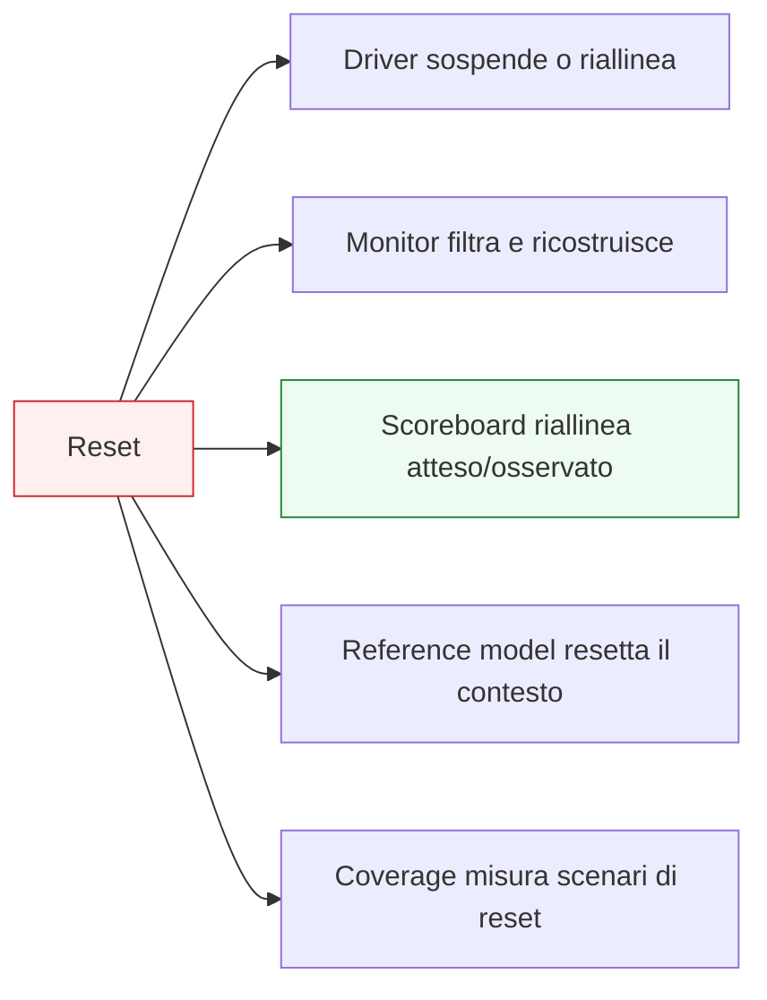

# UVM e reset

Dopo aver introdotto UVM nel contesto dei **protocolli a handshake**, della **latenza** e delle **pipeline**, il passo successivo naturale è affrontare un tema trasversale e spesso critico nella verifica reale: il **reset**.

Il reset è uno degli aspetti più importanti del comportamento di un DUT, perché definisce:
- la condizione iniziale del blocco;
- il modo in cui il design entra in uno stato noto;
- il comportamento durante l’inizializzazione;
- la reazione a reset applicati durante traffico o attività interna;
- il recupero dopo condizioni anomale o sequenze di riavvio.

Dal punto di vista UVM, il reset è particolarmente interessante perché non coinvolge solo il DUT, ma quasi tutti i componenti del testbench:
- il `driver` deve sapere quando sospendere, iniziare o riprendere il traffico;
- il `monitor` deve capire quali eventi sono validi e quali vanno ignorati;
- lo `scoreboard` deve sapere come trattare transazioni in volo o attese non più valide;
- il `reference model` deve riallineare il comportamento atteso;
- la `coverage` deve misurare anche scenari in cui il reset interagisce con protocollo, latenza e traffico;
- il `test` deve sapere se il reset è parte del setup iniziale o di uno scenario funzionale.

Questa pagina introduce il reset in UVM con un taglio coerente con il resto della documentazione:
- didattico ma tecnico;
- centrato sul rapporto tra semantica del reset e architettura del testbench;
- attento ai casi reali di traffico, handshake, pipeline e recovery;
- orientato a mostrare come il reset non sia solo un dettaglio di inizializzazione, ma una parte sostanziale della verifica.

## 1. Perché il reset è un tema centrale

La prima domanda importante è: perché il reset merita una trattazione dedicata nel contesto UVM?

### 1.1 Non è solo inizializzazione
In molti progetti il reset non serve soltanto ad avviare il DUT una volta all’inizio della simulazione. Può intervenire anche:
- tra scenari diversi;
- durante il traffico;
- in condizioni di recovery;
- come parte della strategia di robustezza del sistema.

### 1.2 Coinvolge tutto il testbench
Il reset non riguarda solo il DUT, ma anche la coerenza del testbench:
- quali transazioni restano valide?
- quali output vanno ancora attesi?
- quali eventi il monitor deve ignorare?
- quando il driver può riprendere il traffico?
- come si riallinea il model?

### 1.3 Beneficio metodologico
Affrontare bene il reset rende il testbench:
- più realistico;
- più robusto;
- più credibile nei casi reali;
- meno fragile nei confronti di stati transitori.

## 2. Che cos’è il reset nel contesto della verifica

Dal punto di vista del testbench, il reset non è solo un segnale attivo per alcuni cicli. È una **condizione di sistema** che cambia il significato dei segnali e delle transazioni.

### 2.1 Effetto sul DUT
Il DUT può:
- tornare a uno stato iniziale;
- perdere il contenuto di pipeline o buffer;
- annullare operazioni in corso;
- ripartire da una configurazione nota;
- richiedere qualche ciclo di stabilizzazione.

### 2.2 Effetto sul protocollo
Durante reset:
- alcuni handshake non devono essere considerati validi;
- alcuni output non hanno significato funzionale;
- il canale può trovarsi in una condizione “non attiva”.

### 2.3 Effetto sul testbench
Il testbench deve quindi sapere:
- cosa considerare annullato;
- cosa considerare ancora valido;
- quando riprendere il checking normale.

## 3. Reset iniziale e reset durante attività

Non tutti i reset hanno lo stesso significato.

### 3.1 Reset iniziale
È il caso più semplice:
- il DUT parte da una condizione nota;
- l’ambiente si stabilizza;
- il traffico parte solo dopo il rilascio del reset.

### 3.2 Reset durante traffico
È il caso più interessante e delicato:
- possono esistere transazioni in volo;
- il protocollo può essere interrotto;
- lo scoreboard può avere attesi pendenti;
- il monitor può osservare segnali che non vanno interpretati come trasferimenti normali.

### 3.3 Perché la distinzione conta
Molti testbench gestiscono bene il reset iniziale ma non il reset in presenza di attività reale.

## 4. Il ruolo del `driver` rispetto al reset

Il driver è uno dei primi componenti che devono essere coerenti con la semantica del reset.

### 4.1 Che cosa deve fare
Deve sapere:
- quando non deve pilotare traffico normale;
- quando l’interfaccia deve essere mantenuta in stato inattivo o definito;
- quando una transazione non può più essere considerata valida;
- quando il traffico può riprendere.

### 4.2 Perché è importante
Un driver che ignora il reset può:
- generare traffico spurio;
- far partire transazioni in momenti invalidi;
- mascherare problemi del DUT o crearne di artificiali.

### 4.3 Collegamento col protocollo
Il comportamento corretto del driver durante reset dipende sempre dal protocollo del DUT.

## 5. Il ruolo del `monitor` rispetto al reset

Il monitor deve interpretare il significato dei segnali nel contesto del reset.

### 5.1 Che cosa deve capire
Deve distinguere tra:
- evento valido;
- segnale transitorio da ignorare;
- trasferimento annullato;
- stato di protocollo non ancora stabilizzato.

### 5.2 Perché è delicato
Durante e subito dopo il reset, i segnali possono assumere valori che non corrispondono a vere transazioni osservabili.

### 5.3 Rischio tipico
Un monitor non progettato bene può ricostruire:
- transazioni fantasma;
- eventi inconsistenti;
- output falsamente validi.

## 6. Il ruolo dello `scoreboard` rispetto al reset

Lo scoreboard è uno dei punti più delicati da gestire quando il reset compare in mezzo al traffico.

### 6.1 Il problema
Se il DUT viene resettato:
- transazioni attese potrebbero non arrivare più;
- risultati parziali potrebbero non essere più validi;
- il contesto di confronto potrebbe dover essere svuotato o riallineato.

### 6.2 Che cosa deve fare lo scoreboard
Deve sapere:
- quando invalidare attesi pendenti;
- quando sospendere temporaneamente il confronto;
- quando ripartire da uno stato pulito;
- come trattare eventuali output osservati al margine del reset.

### 6.3 Perché è importante
Molti mismatch artificiali nascono proprio da uno scoreboard che continua a ragionare come se il reset non avesse cambiato il contesto.

## 7. Il ruolo del `reference model`

Anche il reference model deve essere coerente con il reset.

### 7.1 Che cosa significa
Il model deve sapere:
- quando il proprio stato interno atteso va azzerato o riallineato;
- quali transazioni pendenti sono ancora valide;
- quali effetti del DUT vanno considerati annullati.

### 7.2 Perché è importante
Se il model continua a costruire attesi come se il reset non fosse avvenuto, lo scoreboard riceverà un lato atteso ormai incoerente.

### 7.3 Beneficio
Il reset, se ben gestito nel model, rende il checking molto più credibile nei casi reali.

## 8. Reset e protocolli a handshake

Il reset interagisce in modo molto forte con i protocolli a handshake.

### 8.1 Perché
Durante reset o attorno al suo rilascio bisogna capire:
- se `valid` ha ancora significato;
- se `ready` è da considerare attivo o inattivo;
- se un trasferimento in corso viene completato o annullato;
- se il protocollo riparte immediatamente o dopo una fase di riinizializzazione.

### 8.2 Implicazione UVM
Driver e monitor devono essere progettati in modo coerente con questa semantica.

### 8.3 Coverage utile
È importante misurare se il testbench esercita:
- reset in presenza di `valid`;
- reset in presenza di backpressure;
- ripresa del traffico dopo reset;
- casi limite attorno al confine tra stato attivo e reset.

## 9. Reset e pipeline

La presenza di pipeline rende il reset ancora più interessante.

### 9.1 Perché
Se il DUT ha più stadi interni:
- ci possono essere transazioni già accettate ma non ancora uscite;
- lo stato interno può contenere dati in volo;
- il reset può svuotare o invalidare la pipeline.

### 9.2 Implicazione per il testbench
Scoreboard e model devono sapere se:
- quelle transazioni vanno considerate perse;
- alcune possono ancora produrre effetti;
- la pipeline deve essere trattata come completamente cancellata.

### 9.3 Valore del caso di verifica
Questi scenari spesso rivelano bug reali e difficili da vedere nei test nominali.

## 10. Reset e latenza

Nei DUT con latenza, il reset introduce un problema di correlazione temporale ancora più delicato.

### 10.1 Perché
Un input accettato poco prima del reset può:
- produrre ancora output;
- non produrlo più;
- produrre un risultato parziale o invalido;

a seconda della semantica del DUT.

### 10.2 Cosa deve sapere il testbench
Il testbench deve trattare questi casi in modo coerente con la specifica:
- non troppo severo;
- non troppo permissivo.

### 10.3 Perché è importante
Questo è uno dei punti in cui il riferimento alla specifica reale del DUT è assolutamente essenziale.

## 11. Reset e coverage

La coverage è molto utile per verificare che i casi di reset siano davvero stati esercitati.

### 11.1 Casi interessanti da coprire
Per esempio:
- reset iniziale;
- reset durante traffico;
- reset con backpressure;
- reset con più transazioni in volo;
- reset vicino alla produzione dell’output;
- ripartenza corretta dopo reset;
- combinazioni tra reset e modalità operative del DUT.

### 11.2 Perché è importante
Molti bug di reset emergono solo in condizioni particolari che i test nominali non esercitano.

### 11.3 Ruolo del subscriber
Subscriber e collector di coverage sono i luoghi naturali per misurare queste situazioni.

## 12. Reset e sequence

Le sequence possono essere costruite in modo da rendere il reset parte dello scenario di verifica.

### 12.1 Non solo setup iniziale
Il reset può diventare:
- evento interno a uno scenario;
- parte di un test di recovery;
- elemento di stress;
- condizione per verificare robustezza del DUT.

### 12.2 Perché è utile
Permette di esplorare casi realistici in cui il DUT non lavora sempre in condizioni perfettamente lineari.

### 12.3 Collegamento con virtual sequence
In contesti multi-agent, il reset può dover essere coordinato con più flussi di traffico contemporaneamente.

## 13. Reset e phasing

Il reset ha anche un rapporto importante con il phasing.

### 13.1 Reset iniziale
Spesso si colloca naturalmente nella parte iniziale dell’esecuzione.

### 13.2 Reset come scenario di run phase
Quando il reset è parte del comportamento verificato, diventa invece un evento della run phase e va trattato come tale.

### 13.3 Perché la distinzione conta
Reset di setup e reset di scenario non hanno sempre lo stesso significato per il testbench.

## 14. Reset e debug

Il reset è una delle fonti più comuni di bug difficili da diagnosticare.

### 14.1 Perché
I sintomi possono sembrare:
- mismatch di dato;
- output mancanti;
- transazioni fantasma;
- scoreboards disallineati;
- monitor incoerenti;
- timeouts o chiusure premature.

### 14.2 Domande utili nel debug
- il driver ha sospeso correttamente il traffico?
- il monitor ha ignorato gli eventi non validi?
- lo scoreboard ha invalidato gli attesi pendenti?
- il model si è riallineato?
- il DUT era davvero tenuto a produrre l’output atteso dopo quel reset?

### 14.3 Beneficio di una buona architettura
Se i ruoli del testbench sono ben separati, il reset resta difficile ma molto più leggibile.

## 15. Reset e DUT multi-agent

Nei DUT con più interfacce, il reset introduce ancora più sfide.

### 15.1 Perché
Bisogna capire:
- se il reset colpisce tutti i canali o solo alcuni;
- come si riallineano agent diversi;
- se request e response vengono entrambe invalidate;
- come gestire flussi concorrenti interrotti dal reset.

### 15.2 Implicazione UVM
L’environment e le virtual sequence possono dover coordinare:
- sospensione;
- svuotamento del contesto;
- ripresa del traffico;
- riallineamento di scoreboards e subscriber.

### 15.3 Perché è importante
Molti bug di integrazione emergono proprio qui.

## 16. Errori comuni

Alcuni errori ricorrono spesso nella verifica UVM del reset.

### 16.1 Trattare il reset solo come inizializzazione
Si perdono i casi di recovery e interazione con traffico reale.

### 16.2 Ignorare le transazioni in volo
Questo produce mismatch o passaggi falsamente corretti.

### 16.3 Monitor troppo ingenuo
Può ricostruire eventi che la specifica non considera validi.

### 16.4 Scoreboard non riallineato
È una delle fonti più comuni di fail artificiali.

### 16.5 Coverage troppo povera
Limitarsi al reset iniziale lascia scoperti molti casi interessanti.

## 17. Buone pratiche di modellazione

Per verificare bene il reset in UVM, alcune linee guida sono particolarmente utili.

### 17.1 Definire chiaramente la semantica del reset
Il testbench deve essere coerente con la specifica del DUT.

### 17.2 Tenere distinti setup iniziale e reset di scenario
Hanno ruoli diversi e vanno trattati in modo diverso.

### 17.3 Curare driver, monitor, scoreboard e model in modo coordinato
Il reset attraversa tutto il testbench.

### 17.4 Usare coverage per guidare i corner case
Reset + traffico + pipeline + backpressure sono scenari preziosi.

### 17.5 Progettare il testbench per la recovery
Non solo per il comportamento nominale.

## 18. Collegamento con il resto della sezione

Questa pagina si collega direttamente a:
- **`reset-strategies.md`** della sezione SystemVerilog, che fornisce il contesto generale lato RTL;
- **`uvm-handshake-protocols.md`**, perché il reset interagisce fortemente con handshake e validità dei trasferimenti;
- **`uvm-pipelines-latency.md`**, perché reset e transazioni in volo sono strettamente collegati;
- **`driver.md`**, **`monitor.md`**, **`scoreboard.md`** e **`reference-model.md`**, che sono tutti coinvolti nella gestione del reset;
- **`coverage-uvm.md`** e **`debug-uvm.md`**, perché coverage e debug sono strumenti essenziali nei casi di reset.

Prepara inoltre in modo naturale la pagina successiva:
- **`uvm-ral-overview.md`**

oppure, se vuoi passare prima a una chiusura applicativa,
- **`case-study-uvm.md`**

a seconda dell’ordine con cui vuoi completare la sezione.

## 19. In sintesi

Il reset in UVM non è solo un dettaglio di inizializzazione, ma una parte sostanziale della verifica del DUT. Driver, monitor, scoreboard, reference model, coverage e test devono tutti essere coerenti con la semantica del reset e con il modo in cui esso interagisce con:
- traffico;
- handshake;
- latenza;
- pipeline;
- ordering;
- recovery.

Capire bene questo tema significa capire come il testbench possa restare credibile anche nei casi transitori e più delicati del comportamento reale del design.

## Prossimo passo

Il passo più naturale ora è **`uvm-ral-overview.md`**, perché permette di completare il blocco di integrazione col DUT reale introducendo:
- il ruolo dei registri nel testbench UVM
- il significato del Register Abstraction Layer
- il collegamento tra configurazione, accessi register-based e verifica
