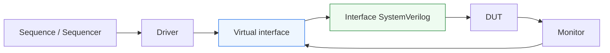
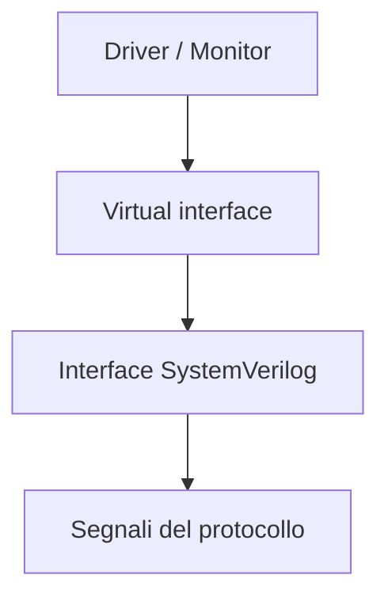

# `virtual interface` in UVM

Dopo aver introdotto **driver**, **monitor** e **agent**, il passo successivo naturale è affrontare il meccanismo che permette ai componenti UVM class-based di interagire con il mondo dei segnali RTL: la **`virtual interface`**.

Questo tema è fondamentale perché UVM vive soprattutto nel mondo delle classi SystemVerilog, mentre il DUT e le sue interfacce vivono nel mondo:
- dei segnali;
- del clock;
- del reset;
- dei protocolli RTL;
- delle connessioni strutturali tra moduli.

Per far dialogare questi due livelli serve un ponte chiaro e disciplinato. Questo ponte è proprio la `virtual interface`.

Dal punto di vista metodologico, la virtual interface è molto importante perché:
- consente al driver di guidare i segnali del DUT;
- consente al monitor di osservare i segnali del DUT;
- mantiene separati il mondo class-based e il mondo RTL;
- rende più ordinata la connessione tra agent UVM e interfacce SystemVerilog;
- favorisce riuso e modularità del testbench.

Questa pagina introduce la virtual interface con un taglio coerente con il resto della sezione UVM:
- didattico ma tecnico;
- centrato sul suo significato architetturale;
- attento al rapporto tra classi UVM e segnali RTL;
- orientato a chiarire perché questo meccanismo è uno dei punti chiave della connessione tra testbench e DUT.

## 1. Perché serve una `virtual interface`

La prima domanda importante è: perché UVM ha bisogno di una `virtual interface`?

### 1.1 Il problema di fondo
I componenti UVM come:
- `driver`
- `monitor`
- `agent`

sono tipicamente classi SystemVerilog. Le classi non possono essere collegate direttamente ai segnali RTL nel modo in cui lo fanno i moduli o le interfacce strutturali.

### 1.2 Il mondo del DUT
Il DUT espone:
- segnali;
- clock;
- reset;
- bus;
- handshake;
- protocolli di interfaccia.

Questi elementi appartengono al livello RTL.

### 1.3 La risposta
La `virtual interface` permette a una classe UVM di avere un riferimento a una interfaccia SystemVerilog reale, attraverso la quale può:
- leggere i segnali;
- guidare i segnali;
- sincronizzarsi col clock;
- rispettare reset e protocollo.

## 2. Che cos’è una `virtual interface`

Una `virtual interface` è un riferimento, usabile nel mondo class-based di SystemVerilog, a una interfaccia SystemVerilog concreta presente nel testbench o attorno al DUT.

### 2.1 Significato essenziale
Non è una nuova interfaccia fisica. È una vista riferita a una interfaccia esistente.

### 2.2 Che cosa permette di fare
Consente ai componenti UVM di:
- accedere ai segnali dell’interfaccia;
- osservare il clock;
- leggere lo stato del reset;
- guidare bus e handshake;
- usare in modo ordinato la struttura del protocollo.

### 2.3 Perché è così importante
Senza una virtual interface, un driver o un monitor resterebbero logicamente scollegati dal mondo RTL.

## 3. Il ponte tra classi e segnali

Uno dei modi migliori per capire la virtual interface è considerarla il ponte tra:
- il mondo orientato agli oggetti del testbench UVM;
- il mondo a segnali del DUT.

### 3.1 Sopra il ponte
Ci sono:
- sequence;
- sequencer;
- driver;
- monitor;
- agent;
- environment.

### 3.2 Sotto il ponte
Ci sono:
- segnali del protocollo;
- clock;
- reset;
- bus dati;
- linee di controllo;
- interfacce SystemVerilog collegate al DUT.

### 3.3 Perché questa immagine è utile
Aiuta a capire che la virtual interface non è un dettaglio sintattico marginale, ma il meccanismo che rende concretamente operativa la connessione tra:
- stimolo transazionale;
- comportamento osservabile del DUT.

## 4. Differenza tra `interface` e `virtual interface`

È molto importante non confondere questi due concetti.

### 4.1 `interface`
Una `interface` SystemVerilog è una struttura RTL che raccoglie:
- segnali;
- protocolli;
- eventualmente modport;
- relazioni strutturali tra i segnali di una connessione.

### 4.2 `virtual interface`
Una `virtual interface` è un riferimento a quella interfaccia, usabile dentro una classe.

### 4.3 In termini intuitivi
Si può dire così:
- l’`interface` è il canale fisico/logico;
- la `virtual interface` è il modo in cui una classe UVM può “vedere” e usare quel canale.

## 5. Perché il `driver` ha bisogno della `virtual interface`

Il driver è uno dei componenti che dipendono più direttamente dalla virtual interface.

### 5.1 Ruolo del driver
Il driver deve:
- guidare i segnali del DUT;
- sincronizzarsi al clock;
- rispettare il reset;
- applicare il protocollo.

### 5.2 Come può farlo
Per farlo deve avere accesso all’interfaccia reale. La virtual interface gli fornisce proprio questo accesso.

### 5.3 Perché non basta la transazione
Il `sequence item` dice che cosa va trasferito, ma non dà accesso fisico ai segnali. La virtual interface è ciò che permette al driver di tradurre la transazione in comportamento osservabile sull’interfaccia RTL.

## 6. Perché il `monitor` ha bisogno della `virtual interface`

Anche il monitor dipende fortemente dalla virtual interface.

### 6.1 Ruolo del monitor
Il monitor deve:
- osservare i segnali dell’interfaccia;
- capire quando una transazione è realmente avvenuta;
- ricostruire gli oggetti osservati;
- rilevare eventi di protocollo.

### 6.2 Come può farlo
Ha bisogno di leggere:
- segnali dati;
- linee di controllo;
- clock;
- reset;
- condizioni di handshake.

### 6.3 Perché la virtual interface è essenziale
Senza virtual interface, il monitor non avrebbe un accesso ordinato e strutturato al mondo RTL.

## 7. Virtual interface e `agent`

La virtual interface è un elemento molto naturale nella struttura dell’agent.

### 7.1 Perché l’agent è il luogo giusto
L’agent rappresenta una interfaccia del DUT e contiene i componenti che interagiscono con quella interfaccia:
- driver;
- monitor;
- eventualmente sequencer.

### 7.2 Ruolo della virtual interface nell’agent
La virtual interface rappresenta il riferimento condiviso al canale reale su cui questi componenti lavorano.

### 7.3 Beneficio architetturale
Questo rafforza l’idea che l’agent non è solo un contenitore, ma una unità di verifica locale di protocollo.

## 8. Virtual interface e protocollo

La virtual interface è strettamente legata al protocollo dell’interfaccia del DUT.

### 8.1 Non solo accesso ai segnali
Non serve solo a “vedere dei fili”. Serve a dare accesso a una struttura coerente di protocollo.

### 8.2 Per esempio
Un’interfaccia può raccogliere:
- dati;
- `valid`
- `ready`
- segnali di sideband;
- clock;
- reset;
- linee di stato.

### 8.3 Perché questo è utile
Il driver e il monitor possono così ragionare in modo più ordinato sulla semantica del protocollo, invece di lavorare con segnali sparsi e disorganizzati.

## 9. Virtual interface e clock

Uno dei vantaggi pratici della virtual interface è che porta con sé anche la relazione col clock.

### 9.1 Perché conta
Driver e monitor devono spesso:
- attendere fronti di clock;
- campionare segnali in un certo istante;
- guidare il protocollo in modo sincronizzato;
- rispettare la dinamica temporale del DUT.

### 9.2 Collegamento naturale
Se clock e segnali di protocollo sono organizzati nella stessa interfaccia, la virtual interface rende questo accesso molto più pulito.

### 9.3 Effetto sul testbench
Questo migliora:
- leggibilità;
- coerenza temporale;
- debuggabilità del protocollo.

## 10. Virtual interface e reset

Anche il reset è spesso parte integrante di ciò che la virtual interface rende accessibile.

### 10.1 Perché è importante
Driver e monitor devono sapere:
- quando il DUT è in reset;
- quando il protocollo può considerarsi attivo;
- quando ignorare eventi non validi;
- quando iniziare o interrompere il traffico.

### 10.2 Beneficio della struttura unificata
Avere reset nella stessa interfaccia del protocollo aiuta a trattare in modo coerente:
- stato iniziale;
- rilascio del reset;
- avvio del traffico;
- campionamento corretto delle transazioni.

## 11. Virtual interface e riuso

La virtual interface è importante anche per il riuso del testbench.

### 11.1 Riuso del driver e del monitor
Un driver o monitor progettato per una certa interfaccia può essere riusato più facilmente se accede a essa tramite una virtual interface pulita e ben definita.

### 11.2 Riuso dell’agent
L’agent diventa più facilmente riusabile perché la connessione alla parte RTL è standardizzata attraverso l’interfaccia.

### 11.3 Beneficio metodologico
Questo rende più naturale:
- usare lo stesso agent in più test;
- inserire lo stesso protocollo in ambienti diversi;
- mantenere separazione tra struttura class-based e struttura RTL.

## 12. Virtual interface e leggibilità del testbench

La virtual interface migliora anche la leggibilità complessiva.

### 12.1 Accesso strutturato
Driver e monitor non leggono o guidano segnali dispersi in modo informale, ma operano tramite una interfaccia coerente.

### 12.2 Beneficio per il protocollo
Questo rende più chiaro:
- quali segnali appartengono allo stesso canale;
- quali linee fanno parte dello stesso protocollo;
- quali componenti sono responsabili di quella interfaccia.

### 12.3 Effetto sul debug
Una struttura ordinata aiuta a leggere meglio:
- waveform;
- log;
- punti di fallimento;
- errori di protocollo o reset.

## 13. Virtual interface e DUT con più interfacce

In DUT reali spesso esistono più interfacce.

### 13.1 Più protocolli, più virtual interface
Ogni agent può usare la propria virtual interface corrispondente al protocollo che deve gestire.

### 13.2 Perché è utile
Questo permette di mantenere separati:
- canali di input;
- canali di output;
- interfacce di configurazione;
- linee di controllo o status.

### 13.3 Beneficio architetturale
Il testbench resta più pulito e meglio allineato alla struttura reale del DUT.

## 14. Virtual interface e block-level / subsystem-level

Il valore della virtual interface resta importante a più livelli del flusso di verifica.

### 14.1 Block-level
Aiuta a collegare driver e monitor al DUT in modo ordinato e ripetibile.

### 14.2 Subsystem-level
Diventa ancora più utile quando il testbench integra più agent e più interfacce, ognuna con la propria connessione strutturata al mondo RTL.

### 14.3 Perché conta
Più l’ambiente cresce, più è importante che la connessione tra classi UVM e segnali RTL resti chiara e modulare.

## 15. Virtual interface e debug

La virtual interface ha anche un ruolo diagnostico indiretto ma importante.

### 15.1 Perché aiuta il debug
Se driver e monitor sono connessi in modo chiaro all’interfaccia corretta:
- è più facile capire quale protocollo si sta osservando;
- è più facile localizzare problemi di connessione;
- è più facile distinguere errori di stimolo da errori del DUT.

### 15.2 Problemi tipici che rende più visibili
Per esempio:
- segnali letti o guidati sul canale sbagliato;
- reset non osservato correttamente;
- clock di interfaccia usato in modo scorretto;
- monitor e driver non allineati alla stessa interfaccia.

## 16. Errori comuni

Alcuni errori ricorrono spesso nell’uso o nella comprensione della virtual interface.

### 16.1 Vederla come puro dettaglio sintattico
Questo fa perdere il suo ruolo di ponte architetturale tra classi UVM e mondo RTL.

### 16.2 Confonderla con l’interfaccia stessa
La virtual interface non è la struttura RTL, ma il riferimento usato dalle classi.

### 16.3 Usare accessi informali ai segnali
Questo rende il testbench meno leggibile e più fragile.

### 16.4 Non collegarla al protocollo
Una virtual interface ha valore quando riflette una interfaccia di protocollo ben definita, non un insieme casuale di segnali.

### 16.5 Non considerare clock e reset
Questi fanno parte integrante del suo valore pratico.

## 17. Buone pratiche di modellazione

Per usare bene le virtual interface in UVM, alcune linee guida sono particolarmente utili.

### 17.1 Pensare per interfacce di protocollo
Ogni virtual interface dovrebbe corrispondere a una interfaccia significativa del DUT.

### 17.2 Tenerla coerente con driver e monitor
I componenti che la usano dovrebbero riflettere il protocollo associato a quell’interfaccia.

### 17.3 Includere clock e reset quando ha senso
Questo rende il comportamento temporale del driver e del monitor più naturale e leggibile.

### 17.4 Favorire il riuso
Una interfaccia ben progettata rende più riusabili driver, monitor e agent.

### 17.5 Legarla alla struttura reale del DUT
La qualità della virtual interface dipende anche da quanto bene rispecchia la vera architettura del canale verificato.

## 18. Collegamento con il resto della sezione

Questa pagina si collega direttamente a:
- **`driver.md`**, che usa la virtual interface per guidare i segnali;
- **`monitor.md`**, che la usa per osservare e campionare i segnali;
- **`agent.md`**, che organizza questi componenti attorno a una interfaccia del DUT;
- **`systemverilog-interfaces.md`** nella sezione SystemVerilog, che ha introdotto il ruolo delle interfacce come strutture di protocollo;
- **`uvm-architecture.md`**, che ha mostrato come l’agent si colleghi al DUT.

Prepara inoltre molto bene la pagina successiva:
- **`tlm-connections.md`**

perché una volta chiarito il ponte tra classi e RTL, il passo naturale è capire come i componenti UVM si scambiano dati e transazioni tra loro.

## 19. In sintesi

La `virtual interface` è il meccanismo che permette ai componenti UVM class-based di accedere in modo ordinato alle interfacce RTL del DUT. È il ponte tra:
- il mondo delle classi;
- il mondo dei segnali;
- il protocollo dell’interfaccia;
- clock e reset;
- osservazione e pilotaggio.

Il suo valore è fortemente architetturale: rende la connessione tra testbench e DUT più pulita, più riusabile e più coerente con la struttura reale del protocollo.

Capire bene la virtual interface significa capire uno dei punti chiave con cui UVM riesce a collegare la metodologia di verifica al comportamento concreto del design RTL.

## Prossimo passo

Il passo più naturale ora è **`tlm-connections.md`**, perché dopo aver chiarito il ponte tra UVM e segnali RTL conviene spiegare il ponte interno tra i componenti UVM stessi:
- scambio di transazioni
- comunicazione tra monitor, scoreboard e subscriber
- flusso dei dati osservati nel testbench
- ruolo del TLM nell’architettura UVM
