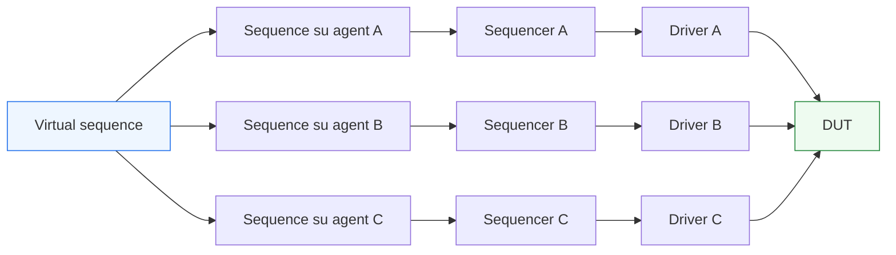
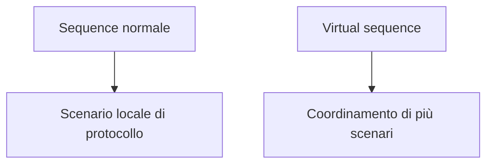

# `virtual sequence` in UVM

Dopo aver introdotto le **`sequence`** come meccanismo per descrivere lo stimolo a livello transazionale, il passo successivo naturale è affrontare un caso più ricco e molto realistico: che cosa succede quando il DUT o il sottosistema da verificare non ha più una sola interfaccia, ma **più canali**, **più agent** o **più sequencer** da coordinare contemporaneamente?

In questo scenario entra in gioco la **`virtual sequence`**.

La virtual sequence è un concetto molto importante in UVM perché permette di descrivere scenari di verifica che non riguardano un solo flusso di transazioni su una singola interfaccia, ma il coordinamento di più flussi tra loro correlati. Questo è particolarmente utile quando si vogliono verificare:
- interazioni tra canali di ingresso e uscita;
- protocolli request/response separati;
- sottosistemi con più agent;
- casi di traffico concorrente;
- scenari più vicini a subsystem e SoC;
- test che coinvolgono simultaneamente configurazione, dati e controllo.

Dal punto di vista metodologico, la virtual sequence non sostituisce le sequence normali: le coordina a un livello più alto. In altre parole, se la sequence è il luogo in cui si descrive uno scenario su un certo canale o protocollo, la virtual sequence è il luogo in cui si descrive **la regia complessiva di più sequence**.

Questa pagina introduce la virtual sequence con un taglio coerente con il resto della sezione UVM:
- didattico ma tecnico;
- centrato sul significato architetturale del componente;
- collegato a DUT reali con più interfacce;
- attento alla separazione tra coordinamento dello scenario e dettaglio del protocollo.

## 1. Perché servono le `virtual sequence`

La domanda di partenza è semplice: se abbiamo già le sequence, perché introdurre un ulteriore livello?

### 1.1 Il limite della sequence “locale”
Una sequence tradizionale è normalmente associata a un certo tipo di transazione e a un certo sequencer, quindi lavora molto bene quando il test riguarda:
- un solo protocollo;
- una sola interfaccia;
- un solo flusso di traffico.

### 1.2 Quando il DUT cresce
Molti DUT reali, però, hanno:
- canale di input e canale di output distinti;
- interfaccia di configurazione separata da quella dati;
- più sorgenti o più sink;
- più agent attivi nello stesso ambiente;
- scenari in cui un evento su un canale deve causarne uno su un altro.

### 1.3 La risposta UVM
In questi casi serve un livello superiore di coordinamento che sappia dire:
- quando partire con una certa sequence;
- come combinare sequence su più agent;
- come sincronizzare flussi diversi;
- come costruire scenari che attraversano più interfacce.

Questo è esattamente il ruolo della virtual sequence.

## 2. Che cos’è una `virtual sequence`

Una virtual sequence è una sequence che non si occupa direttamente di generare transazioni per un singolo protocollo locale, ma di **coordinare altre sequence**.

### 2.1 Significato essenziale
La virtual sequence opera a un livello più alto:
- non descrive il singolo item di una interfaccia;
- non guida direttamente il traffico di un solo agent;
- coordina lo scenario complessivo coinvolgendo più sequencer o più canali.

### 2.2 Livello di astrazione
La virtual sequence appartiene al livello della **regia multi-canale** del testbench.

### 2.3 Perché è utile
Questo permette di tenere separati:
- scenari locali di protocollo;
- coordinamento sistemico di più interfacce.

## 3. Sequence normale e virtual sequence: differenza concettuale

La distinzione tra sequence normale e virtual sequence è molto importante.

### 3.1 Sequence normale
Una sequence normale:
- genera sequence item;
- lavora tipicamente su un sequencer specifico;
- descrive il traffico relativo a un protocollo o interfaccia.

### 3.2 Virtual sequence
Una virtual sequence:
- non è centrata su un solo tipo di item o un solo canale;
- orchestra più sequence;
- coordina più sequencer;
- esprime uno scenario di livello più alto.

### 3.3 In termini intuitivi
Si può dire così:
- la sequence normale descrive **il traffico su una strada**;
- la virtual sequence descrive **la regia del traffico in tutto l’incrocio**.

## 4. Quando ha senso usare una `virtual sequence`

La virtual sequence ha senso quando il problema di verifica non è più locale a una sola interfaccia.

### 4.1 DUT con più agent
Se il DUT ha:
- un agent di input;
- un agent di output;
- un agent di configurazione;

allora una virtual sequence può coordinare attività su tutti e tre.

### 4.2 Scenario request/response
Per esempio:
- una richiesta entra da un canale;
- una risposta deve apparire su un altro;
- il test vuole coordinare lo stimolo su entrambi i lati.

### 4.3 Interazione tra dati e configurazione
Un test può voler:
- configurare il DUT;
- poi inviare traffico dati;
- poi cambiare configurazione;
- poi continuare il traffico con modalità diverse.

### 4.4 Verification di subsystem
Quando si passa da block-level a subsystem-level, i casi in cui più agent devono essere orchestrati insieme diventano molto comuni.

## 5. Il problema che la virtual sequence risolve

Per capire meglio il suo valore, conviene osservare il problema che risolve.

### 5.1 Senza virtual sequence
Se si volesse coordinare più sequence locali senza una regia strutturata, si rischierebbe di:
- spostare troppo controllo nel `test`;
- creare accoppiamenti confusi tra agent;
- perdere modularità;
- rendere difficile il riuso degli scenari.

### 5.2 Con virtual sequence
La virtual sequence permette invece di:
- mantenere il `test` al livello della configurazione generale;
- mantenere le sequence locali focalizzate sul loro protocollo;
- introdurre un livello intermedio che coordina gli scenari complessi.

### 5.3 Beneficio metodologico
Questo rafforza la separazione delle responsabilità:
- il test decide l’obiettivo;
- la virtual sequence orchestra più sequenze;
- le sequence locali generano il traffico del proprio canale;
- i driver applicano i protocolli.

## 6. Virtual sequence come regia multi-interfaccia

Il modo più corretto di leggere una virtual sequence è come **regista del traffico multi-interfaccia**.

### 6.1 Che cosa può coordinare
Può decidere, per esempio:
- prima configura il DUT;
- poi avvia il traffico di input;
- contemporaneamente osserva o attiva il canale di output;
- in un secondo momento lancia un’altra sequence su un canale differente;
- sincronizza più flussi con certe relazioni temporali.

### 6.2 Che cosa non dovrebbe fare
La virtual sequence non dovrebbe:
- sostituirsi al driver;
- guidare direttamente i segnali;
- replicare la logica del protocollo locale;
- diventare un contenitore disordinato di dettagli di basso livello.

### 6.3 Livello corretto
Il suo livello corretto è:
- coordinare;
- orchestrare;
- sincronizzare;
- strutturare lo scenario globale.

## 7. Virtual sequence e DUT reale

Il valore della virtual sequence si capisce molto bene guardando DUT più realistici.

### 7.1 DUT con canale di controllo e canale dati
Un test può voler:
- programmare registri o configurazioni;
- poi avviare il traffico sul canale dati;
- osservare la risposta;
- modificare i parametri durante l’attività.

### 7.2 DUT con request e response separati
La virtual sequence può coordinare:
- la generazione delle richieste;
- la gestione del ritmo di risposta;
- eventuali agent ausiliari che influenzano il protocollo.

### 7.3 DUT con più ingressi concorrenti
In blocchi più complessi, si può voler verificare:
- competizione tra canali;
- sincronizzazione di eventi;
- interazioni tra sorgenti multiple;
- effetti di backpressure o congestione.

In tutti questi casi, la virtual sequence è uno strumento molto naturale.

## 8. Rapporto tra `test` e `virtual sequence`

È importante distinguere bene i ruoli di questi due livelli.

### 8.1 Il test
Il test:
- costruisce l’ambiente;
- configura i componenti;
- seleziona lo scenario generale;
- decide quale virtual sequence lanciare.

### 8.2 La virtual sequence
La virtual sequence:
- realizza la regia dello scenario multi-interfaccia;
- coordina sequence locali;
- controlla la relazione tra più flussi.

### 8.3 Perché questa separazione è utile
Così il test non diventa un contenitore eccessivamente operativo, mentre la virtual sequence resta il luogo naturale per la logica di coordinamento tra agent.

## 9. Rapporto tra `virtual sequence` e sequence locali

La virtual sequence non sostituisce le sequence locali: le usa e le coordina.

### 9.1 Sequence locali
Continuano a essere responsabili di:
- generazione del traffico su un singolo protocollo;
- costruzione dei sequence item specifici;
- espressione delle varianti locali del canale.

### 9.2 Virtual sequence
Si occupa di:
- decidere quando avviare le sequence locali;
- stabilire le relazioni tra loro;
- costruire scenari globali più complessi.

### 9.3 Beneficio di riuso
Questa divisione permette di:
- riusare le sequence locali in più scenari;
- costruire virtual sequence diverse sopra la stessa base di agent e di sequence locali.

## 10. Virtual sequence e più sequencer

La virtual sequence è particolarmente utile quando sono presenti più sequencer.

### 10.1 Un sequencer per agent
Ogni agent attivo ha tipicamente il proprio sequencer.

### 10.2 Coordinamento da un livello superiore
La virtual sequence può lavorare sopra questi sequencer, coordinandone l’attività.

### 10.3 Perché è importante
Questo permette di esprimere scenari come:
- traffico coordinato tra input e output;
- configurazione e dati in parallelo;
- richieste simultanee su canali multipli;
- sequenze concorrenti con sincronizzazioni esplicite.

## 11. Virtual sequence e sottosistemi

Il valore della virtual sequence cresce molto quando il DUT non è più un semplice blocco isolato.

### 11.1 Block-level
A livello di singolo blocco, a volte una virtual sequence può anche essere superflua, se tutto ruota attorno a una sola interfaccia.

### 11.2 Subsystem-level
Quando si verificano più blocchi insieme o un sottosistema, le interazioni tra agent aumentano e diventa naturale avere uno strato di orchestrazione superiore.

### 11.3 SoC-oriented verification
In scenari più vicini al SoC, la regia multi-agent è praticamente inevitabile:
- più protocolli;
- più domini funzionali;
- più flussi concorrenti;
- più configurazioni e modalità.

## 12. Virtual sequence e riuso del testbench

Uno dei motivi forti per usare la virtual sequence è il riuso.

### 12.1 Riuso delle sequence locali
Le sequence locali possono restare stabili e riusabili.

### 12.2 Riuso degli agent
Gli agent continuano a essere focalizzati sui protocolli locali.

### 12.3 Riuso degli scenari globali
La virtual sequence rende riusabile anche il livello di scenario complesso, perché permette di costruire:
- regie nominali;
- regie di stress;
- regie di corner case;
- regie di inizializzazione e traffico.

### 12.4 Beneficio di manutenzione
Questo evita di concentrare troppo comportamento nel test e rende più semplice estendere la verifica nel tempo.

## 13. Virtual sequence e coverage

Le virtual sequence possono avere un impatto molto importante sulla coverage.

### 13.1 Coverage locale contro coverage di interazione
Le sequence locali aiutano a coprire il comportamento di un singolo protocollo. La virtual sequence, invece, aiuta a coprire:
- interazioni tra canali;
- ordini di eventi;
- scenari multi-agent;
- sequenze di configurazione seguite da traffico;
- effetti sistemici del comportamento concorrente.

### 13.2 Perché è importante
Molti bug interessanti emergono proprio dalle interazioni tra componenti o interfacce, non dai singoli canali presi isolatamente.

### 13.3 Ruolo pratico
La virtual sequence aiuta quindi a trasformare la coverage da puramente locale a più sistemica.

## 14. Virtual sequence e debug

La virtual sequence è anche uno strumento utile per il debug di scenari complessi.

### 14.1 Chiarezza della regia
Quando un test fallisce, è molto utile capire:
- quale scenario globale era stato impostato;
- quali sequence locali erano state avviate;
- con quale relazione temporale;
- su quali agent.

### 14.2 Distinguere il livello del problema
Un bug può derivare da:
- sequence locale;
- driver locale;
- protocollo del DUT;
- interazione tra più canali;
- errore nella stessa regia della virtual sequence.

### 14.3 Beneficio diagnostico
Se la regia multi-agent è centralizzata in una virtual sequence, il debug dei test complessi diventa più ordinato.

## 15. Errori comuni

Alcuni errori sono molto frequenti nell’uso delle virtual sequence.

### 15.1 Usarle troppo presto
Per un DUT con una sola interfaccia e scenari locali semplici, introdurre subito virtual sequence può aggiungere struttura senza reale bisogno.

### 15.2 Mettere troppo dettaglio di protocollo nella virtual sequence
Questo la rende meno leggibile e fa perdere la distinzione rispetto alle sequence locali e ai driver.

### 15.3 Usare il test al posto della virtual sequence
Se il coordinamento multi-agent viene spostato interamente nel test, il testbench perde modularità.

### 15.4 Trasformarla in un contenitore troppo generico
Se la virtual sequence cerca di fare tutto, diventa difficile da capire e poco riusabile.

### 15.5 Non collegarla agli obiettivi reali del DUT
La virtual sequence ha valore quando rispecchia scenari veri di sistema o di sottosistema, non quando è introdotta solo perché “in UVM si fa così”.

## 16. Buone pratiche di modellazione

Per usare bene le virtual sequence, alcune linee guida sono particolarmente efficaci.

### 16.1 Introdurle quando c’è vero coordinamento multi-agent
Devono risolvere un problema reale di orchestrazione.

### 16.2 Mantenere le sequence locali semplici e focalizzate
La virtual sequence funziona bene solo se le sequence locali sono ben separate e riusabili.

### 16.3 Tenere il test a livello di configurazione
Il test dovrebbe scegliere e lanciare la virtual sequence, non sostituirsi a essa.

### 16.4 Pensare per scenari di sistema
Le virtual sequence hanno senso quando riflettono casi reali come:
- configurazione + traffico;
- più canali concorrenti;
- request/response su interfacce separate;
- interazione tra dati e controllo.

### 16.5 Usarle anche per migliorare coverage e debug
Non sono solo uno strumento di organizzazione, ma anche una leva per rendere la verifica più ricca e più interpretabile.

## 17. Collegamento con il resto della sezione

Questa pagina si collega direttamente a:
- **`sequences.md`**, che ha introdotto le sequence locali;
- **`sequencer.md`**, che ha chiarito il ruolo del sequencer;
- **`uvm-architecture.md`**, che ha mostrato la struttura del testbench multi-agent;
- **`uvm-components.md`**, che ha presentato la virtual sequence come componente di orchestrazione avanzata.

Prepara inoltre in modo naturale le pagine successive:
- **`driver.md`**, che riporterà il discorso sul lato di pilotaggio dei segnali;
- **`monitor.md`**, che mostrerà il lato osservativo;
- **`agent.md`**, che integrerà questi componenti in una vista coerente di interfaccia;
- **`test.md`**, che chiarirà il rapporto tra test e orchestrazione complessiva dello scenario.

## 18. In sintesi

La `virtual sequence` è il componente UVM che coordina più sequence locali e permette di descrivere scenari di verifica che coinvolgono più agent, più interfacce e più sequencer. Non sostituisce le sequence normali, ma aggiunge un livello superiore di regia, particolarmente utile quando il DUT o il sottosistema da verificare ha una struttura multi-canale o richiede interazioni tra protocolli diversi.

Il suo valore emerge soprattutto quando la verifica smette di essere locale a una sola interfaccia e diventa:
- multi-agent;
- multi-protocollo;
- multi-flusso;
- più vicina a subsystem e SoC.

Capire bene la virtual sequence significa quindi capire come UVM scala dal testbench di singolo protocollo a un ambiente di verifica più sistemico e integrato.

## Prossimo passo

Il passo più naturale ora è **`driver.md`**, perché dopo aver completato il lato dello stimolo transazionale conviene tornare al punto in cui questo stimolo incontra davvero il DUT:
- traduzione della transazione in segnali
- rispetto del protocollo
- relazione con clock, reset e handshake
- ruolo del driver nel lato attivo dell’agent
