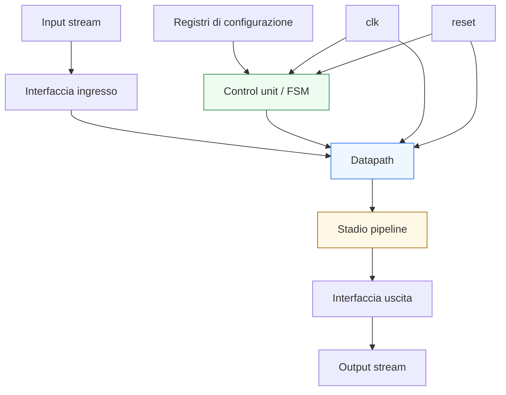
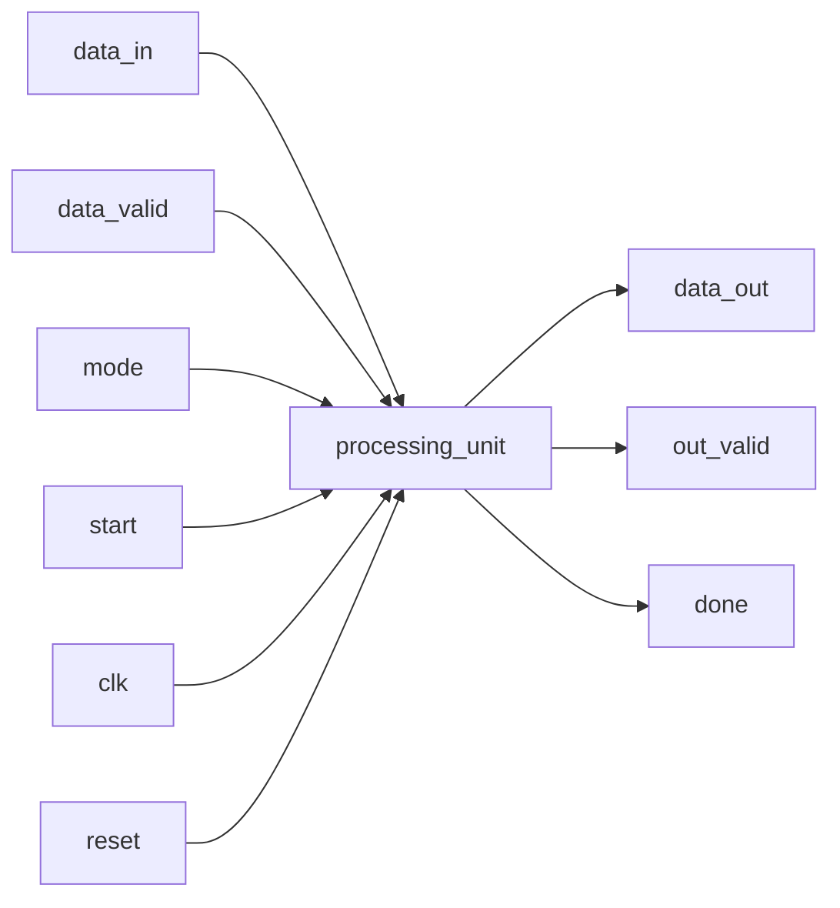
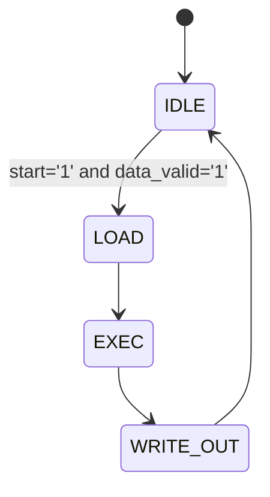

# Caso di studio VHDL

Dopo aver costruito l’intera sezione **VHDL** — dai fondamenti del linguaggio fino a sintesi, timing, verifica, interfacce e confronto con Verilog e SystemVerilog — il passo conclusivo naturale è raccogliere questi concetti in un **caso di studio** coerente. L’obiettivo di questa pagina non è introdurre nuovi costrutti isolati, ma mostrare come i diversi elementi della progettazione VHDL collaborino davvero in un modulo realistico.

Nel corso della sezione abbiamo affrontato:
- struttura del linguaggio;
- `entity`, `architecture` e tipi;
- segnali, variabili e semantica;
- process e descrizione concorrente;
- logica combinatoria e sequenziale;
- registri, mux, enable e reset;
- FSM;
- datapath, controllo e pipeline;
- parametrizzazione con generic e generate;
- sintesi e timing;
- verifica, self-checking e debug;
- integrazione in contesti FPGA/ASIC;
- handshake e CDC.

Questa pagina li ricompone in un esempio unitario, con un taglio coerente con il resto della documentazione:
- didattico ma tecnico;
- ordinato e progressivo;
- centrato sul significato architetturale del modulo;
- orientato a mostrare il legame tra linguaggio, RTL, timing, verifica e integrazione.

Il caso di studio proposto non è tool-specific e non cerca di essere una implementazione completa di produzione. Serve invece a mostrare **come ragionare** su un progetto VHDL realistico e su come organizzarne la descrizione.



## 1. Obiettivo del caso di studio

Per chiudere bene la sezione conviene scegliere un DUT che sia:
- abbastanza semplice da restare leggibile;
- abbastanza ricco da giustificare davvero i temi della sezione;
- abbastanza realistico da mostrare il legame tra RTL, timing e verifica.

### 1.1 Il DUT scelto
Consideriamo un **blocco di elaborazione dati configurabile**, con queste caratteristiche:
- ingresso dati sincronizzato a clock;
- uscita dati registrata;
- modalità operative selezionabili tramite registri di configurazione;
- FSM di controllo per avvio, elaborazione e completamento;
- piccola pipeline interna;
- reset iniziale e possibilità di restart;
- segnale di validità dell’output.

### 1.2 Perché questo DUT è adatto
Questo esempio mette insieme in modo naturale:
- interfaccia;
- registri;
- FSM;
- datapath;
- pipeline;
- timing;
- testbench;
- debug.

### 1.3 Che cosa vogliamo mostrare
L’obiettivo non è tanto “il risultato numerico” del blocco, ma il modo in cui VHDL organizza:
- struttura;
- controllo;
- trasformazione del dato;
- sincronizzazione;
- verifica.

---

## 2. Descrizione funzionale del blocco

Prima di parlare dell’RTL, conviene chiarire il comportamento del DUT a livello concettuale.

### 2.1 Funzione generale
Il blocco riceve un dato in ingresso e, in base alla configurazione, esegue una trasformazione semplice, per esempio:
- pass-through;
- inversione bitwise;
- mascheramento;
- somma con offset costante;
- saturazione semplificata.

### 2.2 Controllo operativo
L’elaborazione non avviene in modo completamente “sempre attivo”, ma secondo una sequenza di controllo:
- il blocco parte in stato di attesa;
- riceve una richiesta di avvio o un ingresso valido;
- processa il dato;
- produce l’uscita e segnala il completamento.

### 2.3 Aspetti temporali
Il modulo:
- usa un clock singolo;
- ha reset;
- contiene un piccolo stadio pipeline;
- produce l’uscita con una latenza finita e leggibile.

---

## 3. Interfaccia del modulo

Una buona pagina di caso di studio deve iniziare dalla `entity`, perché è lì che il modulo espone il proprio contratto verso l’esterno.

### 3.1 Segnali principali
L’interfaccia può contenere:
- `clk`
- `reset`
- `data_in`
- `data_valid`
- `mode`
- `start`
- `data_out`
- `out_valid`
- `done`

### 3.2 Significato dei segnali
- `data_in` porta il dato di ingresso
- `data_valid` indica che l’ingresso è significativo
- `mode` seleziona la modalità operativa
- `start` avvia l’elaborazione
- `data_out` produce il risultato
- `out_valid` segnala che l’uscita è valida
- `done` segnala il completamento del ciclo di lavoro

### 3.3 Perché l’interfaccia è importante
Già dalla `entity` si deve capire:
- quali segnali trasportano dati;
- quali segnali controllano il comportamento;
- che il modulo è sincrono e regolato da protocollo semplice.



---

## 4. Struttura architetturale del DUT

Dal punto di vista RTL, il blocco può essere letto come combinazione di tre parti principali:
- interfaccia e registri di ingresso/uscita;
- datapath;
- control unit.

### 4.1 Datapath
Il datapath contiene:
- registro di ingresso;
- logica di trasformazione;
- eventuale mux di selezione della modalità;
- stadio pipeline;
- registro di uscita.

### 4.2 Control unit
La control unit:
- osserva `start` e `data_valid`;
- governa il caricamento dei registri;
- decide quando `out_valid` e `done` devono attivarsi;
- coordina il flusso della pipeline.

### 4.3 Perché questa separazione aiuta
Permette di vedere in modo chiaro:
- dove stanno i dati;
- dove sta il controllo;
- come il comportamento si distribuisce nel tempo.

---

## 5. La FSM di controllo

La control unit può essere modellata con una FSM semplice ma significativa.

### 5.1 Stati possibili
Per esempio:
- `IDLE`
- `LOAD`
- `EXEC`
- `WRITE_OUT`

### 5.2 Significato degli stati
- `IDLE`: il blocco aspetta avvio
- `LOAD`: il dato viene catturato
- `EXEC`: il datapath processa
- `WRITE_OUT`: il risultato viene registrato e dichiarato valido

### 5.3 Perché è utile
Questa struttura mostra bene:
- stato iniziale;
- avanzamento controllato;
- dipendenza dal clock;
- gestione del completamento.



---

## 6. Il ruolo del datapath

Il datapath è la parte del blocco che esegue davvero la trasformazione del dato.

### 6.1 Elementi principali
Per esempio:
- registro `in_reg`
- segnale combinatorio `op_result`
- registro pipeline `pipe_reg`
- registro finale `out_reg`

### 6.2 Modalità operative
In funzione di `mode`, il datapath può selezionare operazioni diverse, per esempio:
- `mode = "00"` → pass-through
- `mode = "01"` → NOT bitwise
- `mode = "10"` → mascheramento
- `mode = "11"` → somma con costante

### 6.3 Perché è interessante
Questo mostra bene:
- mux di selezione funzionale;
- logica combinatoria;
- stadi registrati;
- rapporto tra configurazione e dato.

---

## 7. Il ruolo della pipeline

Anche in un caso di studio introduttivo, una piccola pipeline è molto utile.

### 7.1 Perché
Permette di mostrare:
- suddivisione del calcolo in più cicli;
- registri intermedi;
- rapporto tra timing e latenza;
- allineamento tra dato e controllo.

### 7.2 Scelta progettuale
Il modulo potrebbe essere descritto tutto in un solo ciclo, ma introdurre uno stadio pipeline aiuta a:
- rendere visibile il rapporto tra combinatoria e sequenziale;
- far emergere il concetto di latenza;
- collegare più direttamente il caso di studio ai temi di timing.

### 7.3 Implicazione di verifica
Il testbench non deve controllare solo il valore corretto, ma anche il momento corretto in cui compare l’uscita.

---

## 8. Esempio di frammento RTL: registro di stato

Un primo frammento rilevante è il process che aggiorna lo stato.

```vhdl
process(clk, reset)
begin
  if reset = '1' then
    state <= IDLE;
  elsif rising_edge(clk) then
    state <= next_state;
  end if;
end process;
```

### 8.1 Che cosa mostra
- uso del reset;
- registro di stato;
- separazione tra stato corrente e prossimo stato.

### 8.2 Perché è importante
Questo è il cuore sequenziale della FSM.

---

## 9. Esempio di frammento RTL: logica di prossimo stato

```vhdl
process(state, start, data_valid)
begin
  case state is
    when IDLE =>
      if start = '1' and data_valid = '1' then
        next_state <= LOAD;
      else
        next_state <= IDLE;
      end if;

    when LOAD =>
      next_state <= EXEC;

    when EXEC =>
      next_state <= WRITE_OUT;

    when WRITE_OUT =>
      next_state <= IDLE;
  end case;
end process;
```

### 9.1 Che cosa mostra
- controllo tramite tipo enumerativo;
- transizioni leggibili;
- struttura chiara della macchina.

### 9.2 Perché è utile
È un buon esempio di separazione tra:
- stato registrato;
- logica combinatoria di transizione.

---

## 10. Esempio di frammento RTL: datapath combinatorio

```vhdl
process(in_reg, mode)
begin
  case mode is
    when "00" =>
      op_result <= in_reg;
    when "01" =>
      op_result <= not in_reg;
    when "10" =>
      op_result <= in_reg and x"0F";
    when others =>
      op_result <= in_reg xor x"FF";
  end case;
end process;
```

### 10.1 Che cosa mostra
- selezione funzionale;
- descrizione combinatoria ordinata;
- relazione tra configurazione e risultato.

### 10.2 Perché è importante
Il caso di studio mostra così il ruolo del datapath come trasformazione del dato.

---

## 11. Esempio di frammento RTL: registri del percorso dati

```vhdl
process(clk, reset)
begin
  if reset = '1' then
    in_reg   <= (others => '0');
    pipe_reg <= (others => '0');
    out_reg  <= (others => '0');
  elsif rising_edge(clk) then
    if load_in = '1' then
      in_reg <= data_in;
    end if;

    if load_pipe = '1' then
      pipe_reg <= op_result;
    end if;

    if load_out = '1' then
      out_reg <= pipe_reg;
    end if;
  end if;
end process;
```

### 11.1 Che cosa mostra
- registri multipli;
- enable distinti;
- pipeline e controllo del flusso.

### 11.2 Perché è utile
Rende molto visibile il legame tra:
- datapath;
- FSM;
- timing;
- latenza.

---

## 12. Lettura architetturale complessiva

A questo punto il modulo può essere letto come una microarchitettura completa.

### 12.1 Flusso del dato
- il dato entra;
- viene registrato;
- subisce una trasformazione combinatoria;
- passa per uno stadio pipeline;
- viene scritto in uscita.

### 12.2 Flusso del controllo
- la FSM decide quando caricare i registri;
- governa i segnali `load_in`, `load_pipe`, `load_out`;
- gestisce `out_valid` e `done`.

### 12.3 Perché è importante
Questo mostra come VHDL sia davvero un linguaggio di:
- struttura;
- comportamento temporale;
- organizzazione architetturale.

---

## 13. Aspetti di sintesi del caso di studio

Dal punto di vista della sintesi, questo caso di studio è utile perché mostra pattern molto classici.

### 13.1 Che cosa verrà inferito
- registro di stato;
- registri del datapath;
- mux e logica combinatoria nel path di `op_result`;
- segnali di controllo e logica di transizione.

### 13.2 Perché è importante
Permette di rileggere tutto il modulo alla luce della pagina su sintesi:
- il tool non “esegue” il codice;
- inferisce una struttura hardware precisa.

### 13.3 Messaggio progettuale
La chiarezza dell’RTL migliora anche la prevedibilità della sintesi.

---

## 14. Aspetti di timing del caso di studio

Anche il timing emerge in modo naturale.

### 14.1 Cammino potenzialmente critico
Uno dei percorsi più importanti è:
- `in_reg` → logica combinatoria di `op_result` → `pipe_reg`

### 14.2 Perché è importante
È qui che il progettista dovrebbe chiedersi:
- la logica è troppo profonda?
- la frequenza obiettivo è compatibile?
- serve o no uno stadio pipeline?

### 14.3 Effetto della pipeline
L’introduzione di `pipe_reg` spezza il percorso:
- migliora il timing;
- aumenta la latenza;
- richiede un controllo più ordinato di `out_valid`.

---

## 15. Verifica del caso di studio

Questo DUT si presta bene a una verifica di base ma significativa.

### 15.1 Che cosa verificare
- reset iniziale;
- caricamento corretto del dato;
- transizioni corrette della FSM;
- uscita corretta per ogni `mode`;
- latenza attesa;
- attivazione corretta di `out_valid` e `done`.

### 15.2 Stimoli utili
Per esempio:
- caso nominale con ogni modalità;
- reset nel mezzo della sequenza;
- `start` senza `data_valid`;
- sequenze consecutive di input;
- casi limite sul dato.

### 15.3 Perché è importante
Il caso di studio mostra bene che il testbench deve verificare:
- funzione;
- controllo;
- tempo.

---

## 16. Self-checking nel testbench

Il testbench può essere scritto in modo da confrontare:
- il valore atteso di uscita;
- il ciclo atteso in cui l’uscita deve diventare valida;
- il comportamento della FSM in condizioni chiave.

### 16.1 Perché è utile
Un semplice `assert` può già segnalare:
- valore errato;
- latenza errata;
- protocollo di `done` scorretto.

### 16.2 Esempio concettuale
Dopo l’applicazione di un input valido in una certa modalità, il testbench può:
- attendere il numero di cicli previsto;
- controllare `out_valid`;
- controllare `data_out`.

### 16.3 Perché è importante
Questo collega il caso di studio alle lezioni su self-checking e simulazione.

---

## 17. Debug del caso di studio

Il caso di studio è anche un buon terreno per esercitare il debug.

### 17.1 Segnali utili in waveform
- `clk`
- `reset`
- `state`
- `next_state`
- `data_in`
- `in_reg`
- `op_result`
- `pipe_reg`
- `out_reg`
- `out_valid`
- `done`

### 17.2 Che cosa permette di capire
- dove si rompe la transizione di stato;
- in quale stadio il dato diventa scorretto;
- se il reset si comporta bene;
- se il risultato è giusto ma arriva nel ciclo sbagliato.

### 17.3 Perché è importante
Mostra molto bene il rapporto tra:
- qualità dell’RTL;
- leggibilità delle waveform;
- efficacia del debug.

---

## 18. Collegamento con FPGA e ASIC

Questo modulo è piccolo, ma contiene già temi rilevanti per entrambi i contesti.

### 18.1 In FPGA
Il progettista guarderebbe in particolare:
- chiusura del timing;
- uso ordinato di registri e logica;
- semplicità di debug e iterazione.

### 18.2 In ASIC
Il progettista guarderebbe con più severità:
- qualità del reset;
- pulizia della FSM;
- struttura del datapath;
- impatto di area e timing;
- robustezza del flusso di verifica.

### 18.3 Perché è utile
Mostra bene come la stessa microarchitettura VHDL possa essere letta in modo diverso a seconda del contesto finale.

---

## 19. Che cosa insegna questo caso di studio

Questa pagina non serve solo a “riassumere il corso”, ma a mostrare alcune lezioni forti.

### 19.1 VHDL è davvero un linguaggio di progetto RTL
Non solo di sintassi o di simulazione.

### 19.2 La qualità nasce dalla separazione dei ruoli
Interfaccia, stato, controllo, datapath e pipeline devono essere leggibili.

### 19.3 Timing e verifica non arrivano dopo
Fanno già parte del modo corretto di scrivere il modulo.

### 19.4 Un buon testbench è parte del progetto
Non solo un accessorio finale.

---

## 20. Errori che questo caso aiuta a evitare

Il caso di studio aiuta a rileggere molti errori tipici della sezione.

### 20.1 Mescolare troppo controllo e datapath
Qui la separazione rende il modulo più chiaro.

### 20.2 Non modellare bene stato e prossimo stato
La FSM ben strutturata aiuta la leggibilità.

### 20.3 Ignorare timing e latenza
Lo stadio pipeline rende il tema esplicito.

### 20.4 Verificare solo il valore finale
Il testbench deve controllare anche il momento corretto del risultato.

### 20.5 Trascurare reset e segnali di validità
Il caso di studio mostra che sono parte sostanziale della correttezza del blocco.

---

## 21. Collegamento con il resto della sezione

Questa pagina si collega trasversalmente a tutta la sezione VHDL, in particolare a:
- **`language-basics.md`**
- **`entity-architecture-and-types.md`**
- **`signals-variables-and-semantics.md`**
- **`process-and-concurrent-statements.md`**
- **`combinational-vs-sequential.md`**
- **`registers-mux-enables-reset.md`**
- **`fsm.md`**
- **`datapath-control-and-pipelining.md`**
- **`generics-and-generate.md`**
- **`synthesis.md`**
- **`timing-and-clocking.md`**
- **`common-pitfalls.md`**
- **`verification-and-testbench.md`**
- **`stimulus-self-checking-and-simulation.md`**
- **`debug-and-waveforms.md`**
- **`vhdl-for-fpga-and-asic.md`**
- **`interfaces-handshake-and-cdc.md`**
- **`vhdl-vs-verilog-systemverilog.md`**

In questo senso, è la pagina che chiude davvero il percorso e mostra come i singoli argomenti non siano blocchi isolati, ma parti di un’unica architettura di progettazione e verifica.

---

## 22. In sintesi

Questo caso di studio mostra come un modulo VHDL relativamente compatto possa già contenere tutti i temi fondamentali della progettazione RTL:
- interfaccia chiara;
- stato e controllo tramite FSM;
- datapath e logica combinatoria;
- registri e pipeline;
- sintesi e timing;
- testbench, self-checking e debug.

Il valore della sezione VHDL emerge proprio qui: non nel singolo costrutto, ma nella capacità di usare il linguaggio come strumento coerente per descrivere, verificare e comprendere una microarchitettura digitale reale.

## Prossimo passo

Il passo successivo naturale, a questo punto, è preparare il **nav completo della sezione VHDL** oppure un **`index.md` finale rifinito**, così da consolidare l’intera documentazione in una struttura MkDocs pronta da integrare con SoC, ASIC, FPGA, SystemVerilog e UVM.
