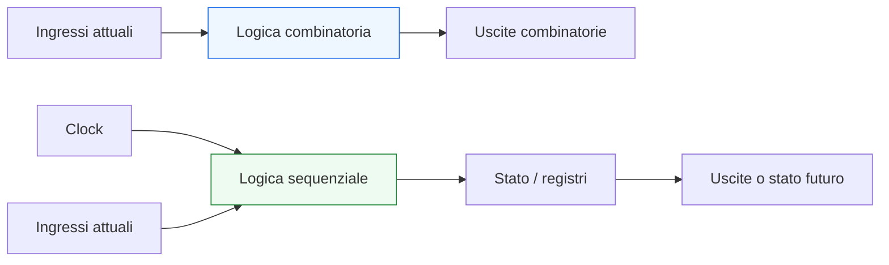
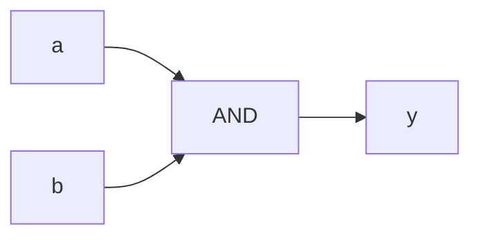
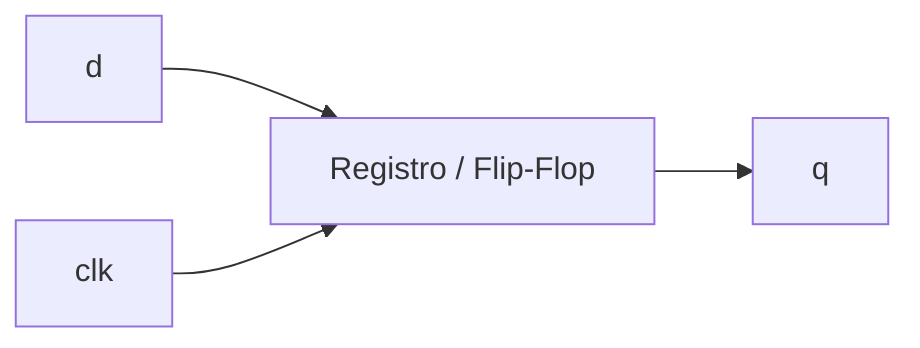
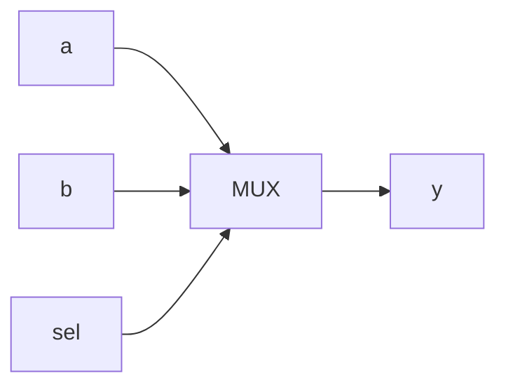
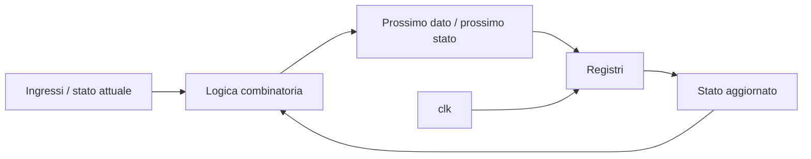

# Logica combinatoria e logica sequenziale

Dopo aver chiarito il ruolo dei **process** e degli **assegnamenti concorrenti**, il passo successivo naturale è affrontare una delle distinzioni più importanti di tutta la progettazione digitale: quella tra **logica combinatoria** e **logica sequenziale**.

Questa distinzione è centrale non solo per comprendere VHDL, ma per leggere correttamente qualsiasi descrizione RTL. In pratica, gran parte della qualità di un modulo dipende dal fatto che il progettista sappia riconoscere con chiarezza:
- quali parti del codice descrivono una funzione puramente combinatoria;
- quali parti introducono stato;
- quali segnali dipendono solo dagli ingressi attuali;
- quali segnali dipendono anche dalla storia precedente del circuito.

Dal punto di vista progettuale, questa distinzione ha un impatto diretto su:
- sintesi;
- timing;
- correttezza funzionale;
- leggibilità del codice;
- debug;
- struttura di FSM, datapath e pipeline.

Questa lezione mantiene il taglio della sezione:
- didattico ma tecnico;
- orientato all’RTL;
- attento al significato hardware;
- accompagnato da esempi di codice e schemi quando utili.



## 1. Perché questa distinzione è così importante

La prima domanda utile è: perché conviene dedicarle una pagina specifica?

### 1.1 Perché è la base della lettura RTL
Quando si guarda un modulo VHDL, una delle prime domande da farsi è:
- questa parte del codice descrive una rete combinatoria?
- oppure descrive un elemento di stato?

### 1.2 Perché determina il significato hardware
La differenza tra combinatoria e sequenziale separa:
- porte logiche;
- multiplexer;
- decoder;
- reti di calcolo;

da:
- registri;
- flip-flop;
- stato di FSM;
- pipeline stage.

### 1.3 Perché influenza tutto il flusso
Una descrizione sbagliata o ambigua su questo punto può causare:
- inferenza involontaria di latch;
- comportamento simulativo inatteso;
- timing poco controllabile;
- codice RTL difficile da verificare.

---

## 2. Che cos’è la logica combinatoria

La logica combinatoria è quella parte del circuito in cui l’uscita dipende solo dai valori **attuali** degli ingressi.

### 2.1 Significato essenziale
Se cambiano gli ingressi, cambia l’uscita in funzione della rete logica, senza introdurre memoria del passato.

### 2.2 Esempi tipici
- porte logiche
- mux
- decoder
- comparatori
- funzioni aritmetiche semplici
- logica di selezione

### 2.3 Esempio VHDL semplice

```vhdl
y <= a and b;
```

### 2.4 Significato hardware
Questa è una relazione puramente combinatoria.



---

## 3. Che cos’è la logica sequenziale

La logica sequenziale è quella parte del circuito in cui l’uscita o lo stato dipendono non solo dagli ingressi attuali, ma anche dalla **storia precedente** del sistema.

### 3.1 Significato essenziale
Qui compare memoria:
- registri;
- flip-flop;
- stato memorizzato;
- dipendenza dal clock.

### 3.2 Esempi tipici
- registri
- contatori
- FSM
- pipeline stage
- accumulatori
- stato di controllo

### 3.3 Esempio VHDL semplice

```vhdl
process(clk)
begin
  if rising_edge(clk) then
    q <= d;
  end if;
end process;
```

### 3.4 Significato hardware
Questa descrizione introduce un elemento di memoria sincronizzato al clock.



---

## 4. Differenza fondamentale: dipendenza dal presente o dal passato

Un modo molto efficace per distinguere i due casi è questo.

### 4.1 Logica combinatoria
L’uscita dipende solo da:
- ingressi attuali;
- eventuali segnali correnti che sono a loro volta funzione combinatoria.

### 4.2 Logica sequenziale
L’uscita o il nuovo stato dipendono anche da:
- stato precedente;
- valore memorizzato;
- fronte di clock;
- eventi di reset.

### 4.3 Perché è una buona regola mentale
Aiuta a leggere il codice in termini di comportamento hardware, non solo di forma sintattica.

---

## 5. Esempio combinatorio: multiplexer

Un multiplexer è uno dei casi più tipici di logica combinatoria.

```vhdl
process(a, b, sel)
begin
  if sel = '0' then
    y <= a;
  else
    y <= b;
  end if;
end process;
```

### 5.1 Perché è combinatorio
L’uscita `y` dipende solo dai valori attuali di:
- `a`
- `b`
- `sel`

### 5.2 Significato hardware
Il process descrive un mux 2:1.



### 5.3 Punto importante
Anche se è scritto dentro un process, non per questo diventa sequenziale.  
Il tipo di hardware dipende dal comportamento descritto, non solo dalla presenza del process.

---

## 6. Esempio sequenziale: registro con reset

Vediamo ora un caso tipicamente sequenziale.

```vhdl
process(clk, reset)
begin
  if reset = '1' then
    q <= '0';
  elsif rising_edge(clk) then
    q <= d;
  end if;
end process;
```

### 6.1 Perché è sequenziale
Qui il valore di `q`:
- non cambia semplicemente perché cambia `d`;
- cambia secondo regole legate a `clk` e `reset`.

### 6.2 Significato hardware
Questo process descrive un registro con reset.

### 6.3 Perché è importante
È uno dei pattern fondamentali di tutta la modellazione RTL.

---

## 7. Il `process` non basta a dire se il codice è combinatorio o sequenziale

Questo è uno dei punti più importanti dell’intera pagina.

### 7.1 Errore comune
Pensare che:
- “se c’è un process, allora è sequenziale”

### 7.2 Perché è sbagliato
Un process può descrivere:
- logica combinatoria
oppure
- logica sequenziale

a seconda della sua struttura.

### 7.3 Che cosa conta davvero
Conta:
- la sensitivity list;
- la presenza o meno del clock;
- l’uso di `rising_edge`;
- la completezza delle assegnazioni;
- il comportamento descritto.

---

## 8. Processo combinatorio e sensitivity list

Nel caso della logica combinatoria, il process deve essere coerente con i segnali letti.

### 8.1 Esempio corretto

```vhdl
process(a, b, sel)
begin
  if sel = '0' then
    y <= a;
  else
    y <= b;
  end if;
end process;
```

### 8.2 Perché è importante
Tutti i segnali letti nel process compaiono nella sensitivity list:
- `a`
- `b`
- `sel`

### 8.3 Che cosa implica
Questo aiuta a far sì che la simulazione rifletta correttamente la natura combinatoria della descrizione.

---

## 9. Processo sequenziale e clock

Nel caso della logica sequenziale, il process è tipicamente strutturato intorno al clock.

### 9.1 Pattern tipico

```vhdl
process(clk)
begin
  if rising_edge(clk) then
    q <= d;
  end if;
end process;
```

### 9.2 Significato
Qui il process non deve reagire a tutti i cambiamenti degli ingressi, ma solo all’evento rilevante di clock.

### 9.3 Perché è importante
Questa è la forma che guida l’inferenza di registri nella sintesi RTL.

---

## 10. Combinatoria: assenza di memoria

Un’altra proprietà molto utile da ricordare è questa.

### 10.1 In logica combinatoria
Non c’è memoria esplicita del valore precedente.

### 10.2 Che cosa significa in pratica
Se gli ingressi ritornano a una certa combinazione, anche l’uscita ritorna alla stessa funzione di quella combinazione.

### 10.3 Perché è importante
Aiuta a capire perché mux, decoder e reti logiche sono combinatori.

---

## 11. Sequenziale: presenza di stato

Nel caso sequenziale, invece, la memoria è parte integrante del comportamento.

### 11.1 Che cosa significa
Il circuito conserva informazione tra un evento di clock e il successivo.

### 11.2 Esempio intuitivo
Un contatore sa a che valore si trovava in precedenza, e proprio per questo può passare al valore successivo.

### 11.3 Collegamento con il codice
Questo tipo di comportamento si esprime in VHDL attraverso process sincroni e segnali di stato.

---

## 12. Esempio combinatorio più articolato

Vediamo un blocco combinatorio leggermente più ricco.

```vhdl
process(a, b, c, sel)
begin
  if sel = '0' then
    y <= (a and b);
  else
    y <= (a or c);
  end if;
end process;
```

### 12.1 Che cosa descrive
Una logica di selezione tra due funzioni combinatorie.

### 12.2 Perché è ancora combinatorio
L’uscita dipende sempre e solo dai valori attuali degli ingressi.

### 12.3 Perché è utile
Mostra che la presenza di `if` non implica automaticamente logica sequenziale.

---

## 13. Esempio sequenziale: contatore

Vediamo ora un caso classico di sequenziale con stato esplicito.

```vhdl
process(clk, reset)
begin
  if reset = '1' then
    q <= "0000";
  elsif rising_edge(clk) then
    q <= q + 1;
  end if;
end process;
```

### 13.1 Che cosa mostra
Il nuovo valore di `q` dipende dal valore precedente di `q`.

### 13.2 Perché è sequenziale
Senza memoria del valore precedente, il comportamento non avrebbe senso.

### 13.3 Significato hardware
Qui il modulo descrive:
- registri per memorizzare `q`
- logica combinatoria per calcolare `q + 1`
- aggiornamento sincronizzato al clock

---

## 14. Relazione tra combinatoria e sequenziale in un blocco reale

Nella pratica, molti moduli RTL contengono entrambe le parti.

### 14.1 Combinatoria
Usata per:
- calcolo di next-state;
- selezione dei dati;
- mux;
- decodifica;
- logica di controllo locale.

### 14.2 Sequenziale
Usata per:
- memorizzare lo stato;
- campionare i dati;
- scandire la pipeline;
- sincronizzare il comportamento del sistema.

### 14.3 Perché è importante
Capire come le due parti si combinano è essenziale per leggere:
- FSM;
- datapath;
- pipeline;
- moduli di controllo.



---

## 15. Combinatoria e cammino critico

La logica combinatoria è direttamente legata al tema del timing.

### 15.1 Perché
Ogni rete combinatoria introduce ritardo.

### 15.2 Cammino critico
Uno dei cammini più importanti in un progetto è:

FF → Logica combinatoria → FF

### 15.3 Implicazione progettuale
Una logica combinatoria troppo profonda può limitare la frequenza massima del sistema.

### 15.4 Collegamento futuro
Questo tema sarà ripreso in modo più esplicito nella sezione su sintesi e timing.

---

## 16. Sequenziale e pipeline

La logica sequenziale è ciò che permette di introdurre pipeline.

### 16.1 Perché
Ogni registro inserito nel percorso dati divide il calcolo in stadi temporali.

### 16.2 Implicazione
Questo può:
- ridurre il cammino critico;
- aumentare la frequenza;
- aumentare la latenza;
- cambiare il comportamento osservabile del DUT.

### 16.3 Perché è importante qui
Mostra che la logica sequenziale non è solo “memoria”, ma anche strumento architetturale per organizzare il progetto.

---

## 17. Errori comuni: inferenza involontaria di latch

Uno degli errori classici nella descrizione combinatoria è la creazione involontaria di memoria.

### 17.1 Quando succede
Per esempio, quando in un process combinatorio non si assegna un valore all’uscita in tutti i casi possibili.

### 17.2 Perché è un problema
Se il valore deve essere mantenuto implicitamente, la sintesi può inferire un latch, cioè un elemento di memoria non desiderato.

### 17.3 Esempio problematico

```vhdl
process(a, b, sel)
begin
  if sel = '1' then
    y <= a and b;
  end if;
end process;
```

### 17.4 Che cosa manca
Non c’è un’assegnazione esplicita a `y` quando `sel = '0'`.

### 17.5 Perché è pericoloso
La descrizione non è più puramente combinatoria come probabilmente si intendeva.

---

## 18. Errori comuni: leggere il sequenziale come combinatorio

Anche l’errore opposto è frequente.

### 18.1 Esempio
Un process con `rising_edge(clk)` non rappresenta una rete che reagisce istantaneamente ai dati, ma una rete che aggiorna stato al fronte di clock.

### 18.2 Perché è importante
Confondere questi livelli porta a errori di:
- aspettative funzionali;
- interpretazione della waveform;
- timing;
- struttura hardware.

---

## 19. Buone pratiche di modellazione

Per distinguere bene combinatoria e sequenziale in VHDL, alcune regole aiutano molto.

### 19.1 Chiediti sempre se esiste memoria
Se il comportamento dipende dal passato o dal clock, sei nel mondo sequenziale.

### 19.2 Rendi esplicita la natura del process
Un process combinatorio e uno sincrono dovrebbero essere riconoscibili a colpo d’occhio.

### 19.3 Completa sempre le assegnazioni nei process combinatori
Questo evita latch involontari.

### 19.4 Tieni separati i ruoli
Quando possibile, conviene mantenere leggibili:
- logica combinatoria
- logica registrata
- calcolo del prossimo stato
- stato attuale

### 19.5 Leggi il codice anche in termini di timing
La combinatoria impatta il cammino critico. Il sequenziale introduce stato e sincronizzazione.

---

## 20. Collegamento con il resto della sezione

Questa pagina si collega direttamente a:
- **`process-and-concurrent-statements.md`**, che ha chiarito il rapporto tra process e descrizione concorrente;
- **`registers-mux-enables-reset.md`**, dove vedremo applicazioni tipiche di combinatoria e sequenziale;
- **`fsm.md`**, dove la separazione tra logica combinatoria e stato registrato diventa fondamentale;
- **`datapath-control-and-pipelining.md`**, dove questa distinzione verrà usata a livello architetturale;
- le future pagine su sintesi, timing, verifica e debug.

---

## 21. In sintesi

La logica **combinatoria** dipende solo dagli ingressi attuali e descrive reti senza memoria.  
La logica **sequenziale** dipende anche dal passato del sistema, introduce stato ed è tipicamente sincronizzata da clock e reset.

Capire bene questa distinzione significa porre una base solida per tutta la modellazione RTL in VHDL, perché quasi ogni modulo reale è costruito proprio dall’interazione tra:
- combinatoria
- sequenziale
- clock
- stato
- percorso dati

## Prossimo passo

Il passo successivo naturale è **`registers-mux-enables-reset.md`**, perché adesso conviene applicare in modo diretto questa distinzione a strutture RTL molto frequenti:
- registri
- multiplexer
- enable
- reset
- pattern di codifica tipici della progettazione digitale
