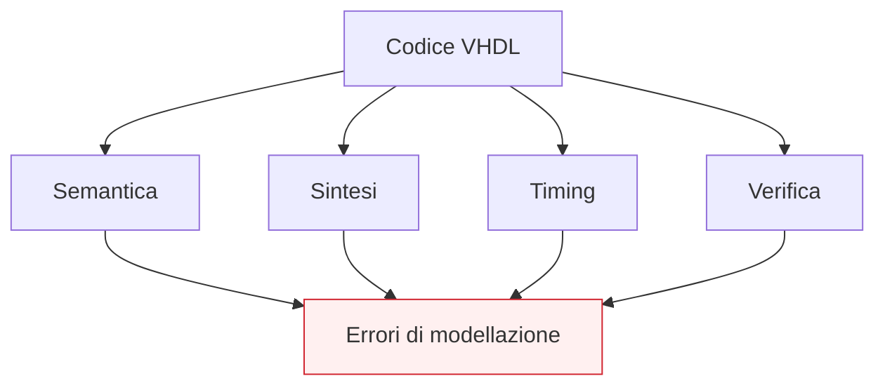

# Errori comuni di sintesi e codifica

Dopo aver affrontato **sintesi**, **timing**, **clock**, **FSM**, **datapath** e **pipeline**, il passo successivo naturale è fermarsi a raccogliere gli errori di modellazione più frequenti in VHDL. Questa pagina ha proprio questo obiettivo: trasformare molti problemi tipici dell’RTL in una mappa chiara di **pitfall** progettuali.

Questa lezione è molto importante perché molti errori in VHDL non nascono da una sintassi palesemente sbagliata, ma da descrizioni che:
- sembrano ragionevoli;
- magari simulano in modo plausibile;
- ma producono hardware inatteso;
- oppure peggiorano leggibilità, timing o qualità della sintesi.

Dal punto di vista progettuale, riconoscere questi errori è fondamentale per:
- scrivere RTL più robusto;
- evitare mismatch tra intenzione e hardware risultante;
- migliorare la prevedibilità della sintesi;
- ridurre problemi di timing o debug;
- costruire moduli più leggibili e verificabili.

Questa pagina mantiene il taglio della sezione:
- didattico ma tecnico;
- orientato all’RTL sintetizzabile;
- attento alla semantica del linguaggio;
- costruito come sintesi ragionata delle lezioni precedenti.



## 1. Perché serve una pagina sugli errori comuni

La prima domanda utile è: perché ha senso dedicare una lezione specifica ai pitfall?

### 1.1 Perché molti errori non sono “vistosi”
Il problema non è sempre un codice che non compila. Spesso il problema è un codice che:
- compila;
- simula;
- ma descrive un hardware diverso da quello immaginato.

### 1.2 Perché gli errori si ripetono
Ci sono alcuni schemi sbagliati che ritornano spesso:
- process combinatori incompleti;
- lettura software-oriented del linguaggio;
- uso poco disciplinato di segnali e variabili;
- reset o clock scritti in modo ambiguo;
- RTL poco leggibile dal punto di vista hardware.

### 1.3 Perché riconoscerli migliora subito il livello progettuale
Capire questi errori aiuta non solo a evitarli, ma anche a leggere meglio il codice altrui e a progettare in modo più prevedibile.

---

## 2. Primo errore: leggere VHDL come un linguaggio software

Questo è probabilmente l’errore più comune e più profondo.

### 2.1 In che cosa consiste
Si tende a leggere il codice come se fosse:
- una sequenza lineare di istruzioni;
- una routine software;
- un algoritmo che “esegue righe” in ordine assoluto.

### 2.2 Perché è sbagliato
VHDL descrive hardware:
- relazioni concorrenti;
- process con semantica propria;
- segnali e tempo di simulazione;
- logica combinatoria e sequenziale.

### 2.3 Conseguenze tipiche
- uso scorretto dei segnali;
- cattiva interpretazione dei process;
- aspettative sbagliate sulla simulazione;
- strutture RTL poco chiare.

### 2.4 Buona pratica
Leggere sempre il codice su due livelli:
- semantica del linguaggio;
- struttura hardware risultante.

---

## 3. Secondo errore: confondere segnali e variabili

Questo è uno dei classici equivoci di VHDL.

### 3.1 In che cosa consiste
Si usa un segnale come se fosse una variabile locale immediatamente aggiornata, oppure si usa una variabile senza chiarire il suo ruolo nel process.

### 3.2 Perché è pericoloso
Segnali e variabili non hanno la stessa semantica:
- il segnale rappresenta comunicazione, stato o relazione osservabile;
- la variabile rappresenta un appoggio locale di calcolo.

### 3.3 Effetti tipici
- simulazione interpretata male;
- codice meno leggibile;
- aspettative sbagliate sul valore usato nelle righe successive.

### 3.4 Buona pratica
Usare:
- **segnali** per stato, connessioni e relazioni del modulo;
- **variabili** per calcoli locali interni al process.

---

## 4. Terzo errore: process combinatori incompleti

Questo è uno dei pitfall più classici in RTL.

### 4.1 In che cosa consiste
Nel process combinatorio non si assegnano tutte le uscite in tutti i casi rilevanti.

### 4.2 Esempio problematico

```vhdl
process(a, b, sel)
begin
  if sel = '1' then
    y <= a and b;
  end if;
end process;
```

### 4.3 Perché è un problema
Quando `sel = '0'`, il codice non dice esplicitamente che cosa debba accadere a `y`.

### 4.4 Conseguenza
La sintesi può inferire un latch per mantenere il valore precedente.

### 4.5 Buona pratica
In un process combinatorio:
- assegnare tutte le uscite in tutti i rami;
- oppure dare valori di default chiari all’inizio del process.

---

## 5. Quarto errore: sensitivity list incompleta

Questo è un problema molto comune nella modellazione combinatoria.

### 5.1 In che cosa consiste
Il process legge alcuni segnali, ma non tutti compaiono nella sensitivity list.

### 5.2 Esempio problematico

```vhdl
process(a, b)
begin
  y <= (a and b) or c;
end process;
```

### 5.3 Perché è sbagliato
Il process legge anche `c`, ma `c` non compare nella sensitivity list.

### 5.4 Effetto tipico
La simulazione può non riflettere bene la natura combinatoria del blocco.

### 5.5 Buona pratica
Nei process combinatori, assicurarsi che la sensitivity list sia coerente con i segnali letti.

---

## 6. Quinto errore: process poco chiaramente combinatorio o sequenziale

Un altro problema molto diffuso è scrivere process che non rendono evidente la loro natura.

### 6.1 In che cosa consiste
Il codice mescola:
- logica di controllo;
- aggiornamento dello stato;
- assegnazioni combinatorie;
- gestione poco chiara del clock.

### 6.2 Perché è un problema
Diventa difficile capire se il process descriva:
- combinatoria;
- sequenziale;
- oppure una combinazione poco pulita dei due.

### 6.3 Effetti tipici
- scarsa leggibilità;
- sintesi meno prevedibile;
- maggiore difficoltà di debug.

### 6.4 Buona pratica
Far sì che un process sia riconoscibile a colpo d’occhio come:
- combinatorio
oppure
- sincrono

---

## 7. Sesto errore: reset ambiguo o incoerente

Il reset è spesso scritto in modo poco disciplinato.

### 7.1 In che cosa consiste
- reset applicato in modo non uniforme;
- reset poco leggibile;
- reset mescolato a logiche poco chiare;
- stato iniziale non evidente.

### 7.2 Perché è un problema
Il reset è una parte strutturale della logica sequenziale e influenza:
- correttezza dell’avvio;
- leggibilità della FSM;
- verificabilità del modulo;
- sintesi del registro.

### 7.3 Effetti tipici
- stato iniziale poco chiaro;
- recovery difficile da interpretare;
- codice meno robusto.

### 7.4 Buona pratica
Esplicitare chiaramente:
- stato iniziale;
- comportamento del reset;
- relazione tra reset, clock e registri.

---

## 8. Settimo errore: usare nomi poco significativi

Questo può sembrare un problema “stilistico”, ma in realtà ha un forte impatto progettuale.

### 8.1 In che cosa consiste
Usare nomi come:
- `x1`
- `temp2`
- `sig_a`
- `var1`

senza collegarli al loro ruolo.

### 8.2 Perché è un problema
Rende difficile capire:
- che cosa è stato;
- che cosa è next-state;
- che cosa è dato;
- che cosa è controllo;
- che cosa è un appoggio locale.

### 8.3 Effetti tipici
- maggiore rischio di errori;
- difficoltà di manutenzione;
- RTL meno leggibile.

### 8.4 Buona pratica
Usare nomi che riflettano il ruolo del segnale:
- `state`
- `next_state`
- `q_reg`
- `d_next`
- `load_en`
- `stage1_reg`

---

## 9. Ottavo errore: codifiche FSM poco leggibili

Nelle FSM è frequente vedere codifiche che nascondono il significato del controllo.

### 9.1 In che cosa consiste
Usare codici numerici o bit pattern poco espressivi invece di stati leggibili.

### 9.2 Perché è un problema
La macchina perde trasparenza:
- è più difficile leggere le transizioni;
- il debug diventa meno immediato;
- la manutenzione peggiora.

### 9.3 Buona pratica
Usare tipi enumerativi per descrivere gli stati quando possibile.

---

## 10. Nono errore: mescolare troppo datapath e controllo

Questo è un errore architetturale molto comune quando il modulo cresce.

### 10.1 In che cosa consiste
Lo stesso process o lo stesso blocco di codice gestisce insieme:
- dato;
- stato;
- selezione dei percorsi;
- condizioni di controllo;
- output del protocollo.

### 10.2 Perché è un problema
Il modulo diventa:
- più difficile da leggere;
- meno modulare;
- più difficile da verificare;
- più fragile rispetto alle modifiche.

### 10.3 Buona pratica
Quando possibile, distinguere meglio:
- datapath;
- control unit;
- prossimi valori;
- uscite di controllo.

---

## 11. Decimo errore: ignorare l’hardware implicato dal codice

Questo è uno degli errori più “silenziosi”.

### 11.1 In che cosa consiste
Si scrive il codice pensando solo alla funzione logica desiderata, senza chiedersi:
- quanti mux vengono creati;
- dove sono i registri;
- quanto è profonda la logica;
- se si sta introducendo memoria;
- come il tool leggerà il pattern.

### 11.2 Perché è un problema
Il codice può essere formalmente corretto, ma progettualmente debole.

### 11.3 Buona pratica
Per ogni blocco RTL chiedersi sempre:
- che struttura hardware descrive?
- che impatto ha su area e timing?
- è coerente con l’architettura desiderata?

---

## 12. Undicesimo errore: sottovalutare il timing

Molti problemi nascono dal considerare il timing come qualcosa che riguarda solo le fasi successive.

### 12.1 In che cosa consiste
Si scrive una logica lunga o intricata senza considerare:
- cammino critico;
- profondità della combinatoria;
- effetto dei mux;
- ruolo dei registri.

### 12.2 Perché è un problema
Il modulo può risultare:
- corretto in simulazione;
- ma troppo lento alla frequenza richiesta.

### 12.3 Buona pratica
Leggere sempre il codice anche come:
- registro → logica → registro

e chiedersi quanto sia profondo il percorso combinatorio.

---

## 13. Dodicesimo errore: pipeline inserita senza logica architetturale chiara

La pipeline è utile, ma non deve essere usata in modo casuale.

### 13.1 In che cosa consiste
Si aggiungono registri “per migliorare il timing” senza ridefinire chiaramente:
- validità del dato;
- latenza;
- sincronizzazione delle uscite;
- interazione con il controllo.

### 13.2 Perché è un problema
Si può ottenere un modulo più complicato senza vera chiarezza di comportamento.

### 13.3 Buona pratica
Inserire pipeline come scelta architetturale esplicita:
- con stadi ben identificati;
- con dati e controllo allineati;
- con significato temporale chiaro.

---

## 14. Tredicesimo errore: parametrizzazione senza vero beneficio

`generic` e `generate` sono potenti, ma possono essere abusati.

### 14.1 In che cosa consiste
Si introducono troppi parametri o strutture generate dove non c’è una vera necessità architetturale.

### 14.2 Perché è un problema
Il codice diventa:
- più difficile da leggere;
- più difficile da istanziare;
- meno trasparente.

### 14.3 Buona pratica
Parametrizzare solo ciò che rappresenta una vera scelta di progetto:
- larghezza;
- numero di stadi;
- numero di canali;
- profondità o scala della struttura.

---

## 15. Quattordicesimo errore: duplicazione manuale di strutture ripetitive

Questo è l’errore opposto al precedente.

### 15.1 In che cosa consiste
Si scrivono a mano più copie quasi identiche di:
- registri;
- canali;
- stadi;
- percorsi dati.

### 15.2 Perché è un problema
Aumentano:
- errori da copia e incolla;
- manutenzione;
- incoerenza tra istanze.

### 15.3 Buona pratica
Quando la struttura è regolare e ripetitiva, usare parametrizzazione e `generate` in modo ordinato.

---

## 16. Quindicesimo errore: codice che simula ma sintetizza in modo inatteso

Questo è uno degli errori più importanti da capire.

### 16.1 In che cosa consiste
Il comportamento osservato in simulazione sembra accettabile, ma il codice:
- è ambiguo;
- inferisce hardware indesiderato;
- produce una struttura poco pulita;
- non riflette bene l’intenzione progettuale.

### 16.2 Perché succede
Perché simulazione e sintesi non vanno lette come la stessa cosa:
- la simulazione segue la semantica del linguaggio;
- la sintesi inferisce hardware da pattern RTL.

### 16.3 Buona pratica
Scrivere codice che sia:
- semanticamente corretto;
- chiaramente RTL;
- leggibile anche dal punto di vista della sintesi.

---

## 17. Sedicesimo errore: testare poco i casi “scomodi”

Questo pitfall riguarda il modo in cui il codice viene validato.

### 17.1 In che cosa consiste
Si verifica solo il caso nominale, trascurando:
- reset;
- cambi rapidi degli ingressi;
- transizioni di FSM;
- combinazioni limite;
- comportamento con enable e selezioni diverse.

### 17.2 Perché è un problema
Molti errori di RTL emergono proprio nei casi meno “lineari”.

### 17.3 Buona pratica
Pensare già in fase di modellazione a:
- verificabilità;
- casi limite;
- leggibilità delle waveform;
- facilità di debug.

---

## 18. Una checklist pratica di rilettura del codice

Prima di considerare “buono” un modulo RTL, conviene porsi alcune domande.

### 18.1 Sul significato del codice
- Il blocco è chiaramente combinatorio o sequenziale?
- I segnali e le variabili sono usati con ruolo coerente?

### 18.2 Sulla sintesi
- I registri, mux e reset sono chiaramente inferibili?
- Esistono process combinatori incompleti?

### 18.3 Sul timing
- Dove sono i registri?
- Quanto è lunga la logica tra due registri?

### 18.4 Sulla leggibilità
- I nomi aiutano davvero a capire il ruolo dei segnali?
- Datapath e controllo sono abbastanza distinguibili?

### 18.5 Sul riuso
- La parametrizzazione è motivata?
- La struttura ripetitiva è descritta in modo pulito?

---

## 19. Buone pratiche generali

Molti errori si evitano non con “trucchi”, ma con alcune regole di disciplina progettuale.

### 19.1 Rendere i pattern RTL riconoscibili
Registri, process combinatori, FSM, mux e pipeline dovrebbero essere leggibili a colpo d’occhio.

### 19.2 Tenere separati i ruoli del codice
Quando possibile:
- stato;
- prossimo stato;
- percorso dati;
- controllo;
- uscita.

### 19.3 Curare la semantica prima della sintassi
Capire che cosa il codice significa è più importante che “farlo passare”.

### 19.4 Scrivere pensando alla sintesi e al timing
Ogni blocco va letto anche come struttura hardware.

### 19.5 Favorire verifica e debug
Il codice migliore è quello che, oltre a funzionare, si lascia leggere, verificare e correggere con facilità.

---

## 20. Collegamento con il resto della sezione

Questa pagina si collega direttamente a quasi tutta la parte RTL già costruita, in particolare a:
- **`signals-variables-and-semantics.md`**
- **`process-and-concurrent-statements.md`**
- **`combinational-vs-sequential.md`**
- **`registers-mux-enables-reset.md`**
- **`fsm.md`**
- **`datapath-control-and-pipelining.md`**
- **`generics-and-generate.md`**
- **`synthesis.md`**
- **`timing-and-clocking.md`**

Serve quindi come pagina di consolidamento e di rilettura critica di tutti i concetti RTL affrontati fin qui.

---

## 21. In sintesi

Gli errori comuni in VHDL non dipendono quasi mai solo dalla sintassi. Nascono soprattutto da:
- lettura sbagliata della semantica;
- modellazione RTL ambigua;
- scarso controllo di sintesi e timing;
- struttura del codice poco leggibile;
- mancanza di disciplina progettuale.

Capire bene questi pitfall significa migliorare molto rapidamente la qualità del proprio codice, perché permette di passare da una scrittura “che funziona” a una scrittura:
- più pulita;
- più prevedibile;
- più sintetizzabile;
- più adatta a progetti reali.

## Prossimo passo

Il passo successivo naturale è **`verification-and-testbench.md`**, perché adesso conviene spostare l’attenzione dal lato della modellazione RTL al lato della verifica, chiarendo:
- come si costruisce un testbench VHDL di base
- come si osserva il comportamento del DUT
- come si iniziano a validare in modo sistematico i moduli sviluppati
