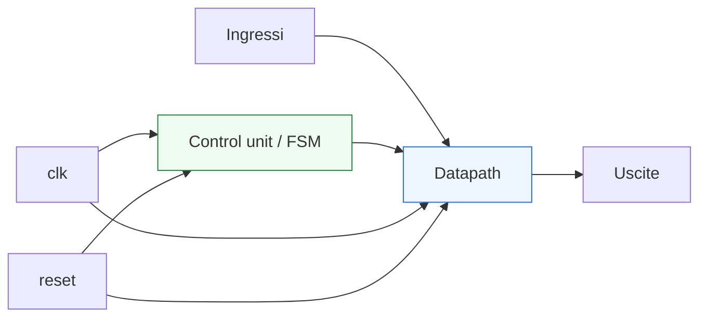
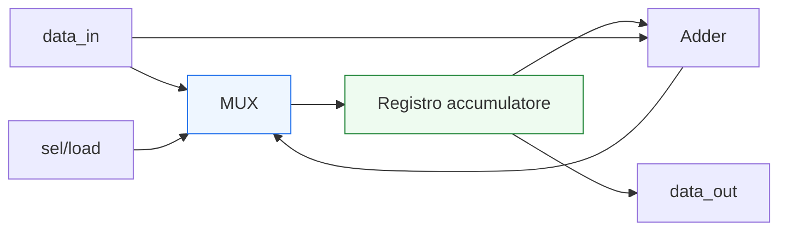
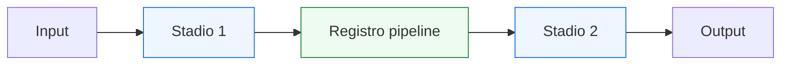

# Datapath, control unit e pipeline

Dopo aver introdotto le **FSM** come struttura di controllo fondamentale, il passo successivo naturale è collocarle dentro una visione più ampia dell’architettura RTL. In molti blocchi reali, infatti, il comportamento del sistema nasce dalla collaborazione tra:
- un **datapath**, che elabora e trasferisce i dati;
- una **control unit**, che decide quando e come le operazioni devono avvenire;
- una eventuale **pipeline**, che distribuisce il lavoro nel tempo per migliorare il timing o il throughput.

Questa pagina è molto importante perché segna il passaggio dalla lettura dei singoli costrutti del linguaggio alla lettura di una vera **microarchitettura RTL**. In altre parole, non ci si limita più a capire che cosa sia un registro o una FSM, ma si inizia a vedere come questi elementi si combinino in un blocco progettuale realistico.

Dal punto di vista VHDL, questo è uno dei momenti in cui il linguaggio mostra il suo valore più chiaramente: non come insieme di regole sintattiche, ma come strumento per descrivere:
- flusso dei dati;
- logica di controllo;
- sincronizzazione al clock;
- suddivisione del calcolo in stadi;
- relazione tra funzionalità e timing.

Questa lezione mantiene il taglio della sezione:
- didattico ma tecnico;
- orientato all’RTL sintetizzabile;
- attento al significato architetturale;
- accompagnato da esempi di codice e schemi quando utili.



## 1. Perché parlare insieme di datapath, controllo e pipeline

La prima domanda utile è: perché questi tre temi vengono trattati nella stessa pagina?

### 1.1 Perché in molti blocchi reali non esistono separati
In un progetto RTL reale, il comportamento del modulo nasce spesso dall’interazione stretta tra:
- dati che si muovono o vengono trasformati;
- segnali di controllo che abilitano, selezionano o sincronizzano;
- registri che suddividono il lavoro nel tempo.

### 1.2 Perché sono il cuore della microarchitettura
Quando si progetta un blocco digitale, una delle domande principali è:
- dove stanno i dati?
- come vengono trasformati?
- chi decide quando una certa operazione deve partire?
- in quanti cicli avviene?
- dove conviene inserire registri?

### 1.3 Perché aiutano a leggere il codice in modo più maturo
Una volta compresi questi concetti, i moduli VHDL smettono di apparire come semplici “pezzi di sintassi” e iniziano a essere leggibili come strutture architetturali.

---

## 2. Che cos’è un datapath

Il **datapath** è la parte del circuito che trasporta, seleziona, memorizza e trasforma i dati.

### 2.1 Significato essenziale
Nel datapath troviamo tipicamente:
- registri;
- mux;
- operatori aritmetici o logici;
- comparatori;
- percorsi dati tra ingressi, blocchi intermedi e uscite.

### 2.2 Che cosa fa
Il datapath realizza operazioni come:
- somma;
- sottrazione;
- mascheramento;
- selezione del dato;
- caricamento e spostamento tra registri;
- combinazione di campi o bus.

### 2.3 Perché è importante
È la parte del modulo in cui la funzione “materiale” del blocco si concretizza.

---

## 3. Che cos’è una control unit

La **control unit** è la parte del circuito che governa il comportamento del datapath.

### 3.1 Significato essenziale
La control unit decide:
- quale operazione eseguire;
- quale mux selezionare;
- quando aggiornare un registro;
- quando avanzare di stato;
- quando dichiarare un’operazione completata.

### 3.2 Forma tipica
Molto spesso la control unit è modellata come:
- FSM;
- logica di stato;
- segnali di enable e select;
- logica di avvio/fine operazione.

### 3.3 Perché è importante
Senza controllo, il datapath non sa:
- quando caricare;
- quando attendere;
- quando propagare;
- quale percorso dati usare.

---

## 4. Datapath e control unit: differenza concettuale

Questa separazione è uno dei principi più utili di tutta la progettazione RTL.

### 4.1 Il datapath elabora
Lavora sui dati:
- li riceve;
- li trasforma;
- li memorizza;
- li inoltra.

### 4.2 La control unit decide
Stabilisce:
- quali operazioni abilitare;
- in che sequenza;
- in quale stato si trova il sistema;
- quando passare alla fase successiva.

### 4.3 Perché separarli è utile
Questa distinzione migliora:
- chiarezza dell’architettura;
- verificabilità;
- possibilità di modifica;
- leggibilità del codice VHDL.

---

## 5. Esempio intuitivo: accumulatore controllato

Consideriamo un blocco molto semplice:
- riceve un dato in ingresso;
- può caricarlo in un registro;
- può sommarlo al contenuto attuale;
- può azzerarsi in reset;
- è guidato da segnali di controllo.

### 5.1 Datapath
Contiene:
- un registro;
- un adder;
- un mux di selezione del dato da caricare.

### 5.2 Control unit
Decide:
- se caricare il dato nuovo;
- se accumulare;
- se mantenere il valore;
- quando segnalare fine operazione.

### 5.3 Perché è un buon esempio
Mostra subito che il dato e il controllo non sono la stessa cosa, anche se convivono nello stesso modulo.



---

## 6. VHDL e descrizione del datapath

In VHDL, il datapath si descrive tipicamente con:
- segnali interni;
- assegnamenti concorrenti;
- process sincroni per i registri;
- logica combinatoria per mux e funzioni.

### 6.1 Esempio semplificato

```vhdl
signal q_reg  : std_logic_vector(7 downto 0);
signal d_next : std_logic_vector(7 downto 0);

d_next <= data_in when load = '1' else q_reg;

process(clk, reset)
begin
  if reset = '1' then
    q_reg <= (others => '0');
  elsif rising_edge(clk) then
    if en = '1' then
      q_reg <= d_next;
    end if;
  end if;
end process;
```

### 6.2 Che cosa si vede qui
- il mux che genera `d_next`
- il registro `q_reg`
- il reset
- l’enable

### 6.3 Significato architetturale
Questa è già una struttura di datapath, anche se molto semplice.

---

## 7. VHDL e descrizione della control unit

La control unit è spesso modellata con una FSM.

### 7.1 Esempio concettuale
La macchina può decidere:
- quando caricare un registro;
- quando attendere;
- quando avviare una trasformazione;
- quando dichiarare `done`.

### 7.2 Forma tipica in VHDL
- tipo enumerativo per lo stato
- process sincrono per il registro di stato
- process combinatorio per prossimo stato e segnali di controllo

### 7.3 Perché è una scelta naturale
La FSM si presta bene a rappresentare:
- sequenze operative;
- protocolli;
- fasi del trattamento del dato.

---

## 8. Interazione tra datapath e control unit

Qui si trova uno dei punti più importanti della progettazione RTL.

### 8.1 La control unit osserva
Può osservare:
- segnali di stato;
- flag;
- confronti;
- condizioni di fine operazione;
- richieste di input.

### 8.2 La control unit comanda
Produce segnali come:
- enable;
- select;
- load;
- clear;
- start;
- done.

### 8.3 Il datapath esegue
Il datapath usa questi segnali per:
- scegliere un percorso;
- caricare un registro;
- trasformare il dato;
- avanzare nell’elaborazione.

### 8.4 Perché è utile vedere questo ciclo
Aiuta a capire che la microarchitettura è una collaborazione continua tra:
- elaborazione del dato;
- decisione del controllo.

---

## 9. Che cos’è una pipeline

Una **pipeline** è una struttura in cui l’elaborazione viene suddivisa in più stadi separati da registri.

### 9.1 Significato essenziale
Invece di fare tutto in un solo tratto combinatorio, si inseriscono registri intermedi in modo che:
- ogni stadio esegua solo parte del lavoro;
- il risultato complessivo si ottenga in più cicli;
- il cammino critico venga ridotto.

### 9.2 Perché è importante
La pipeline è uno degli strumenti più importanti per:
- aumentare la frequenza massima;
- organizzare il trattamento dei dati;
- sostenere throughput più elevato.

### 9.3 Costo progettuale
La pipeline introduce anche:
- latenza;
- maggiore complessità del controllo;
- necessità di verificare dati “in volo” su più stadi.

---

## 10. Esempio intuitivo di pipeline

Supponiamo di voler calcolare una funzione in due fasi:
- prima una trasformazione intermedia;
- poi una elaborazione finale.

### 10.1 Senza pipeline
Tutta la logica starebbe tra un registro iniziale e un registro finale.

### 10.2 Con pipeline
Si inserisce un registro intermedio:
- stadio 1: prima trasformazione
- registro pipeline
- stadio 2: seconda trasformazione



### 10.3 Effetto
- il dato impiega più cicli ad arrivare in uscita;
- ogni stadio ha però meno logica combinatoria da attraversare.

---

## 11. Pipeline e timing

La pipeline è strettamente collegata al timing.

### 11.1 Cammino critico
Senza pipeline, un cammino molto lungo può limitare la frequenza del progetto.

### 11.2 Inserimento di registri
Dividendo la logica con registri intermedi, si riduce il tratto combinatorio per stadio.

### 11.3 Beneficio
Questo può migliorare:
- frequenza massima;
- robustezza temporale;
- scalabilità del design.

### 11.4 Compromesso
In cambio si introduce:
- latenza maggiore;
- complessità di controllo e verifica.

---

## 12. Pipeline e datapath

Il datapath è il luogo naturale in cui compare la pipeline.

### 12.1 Perché
Il datapath contiene:
- operatori;
- mux;
- registri;
- trasformazioni sui dati;

ed è quindi la parte del modulo in cui conviene decidere:
- dove mettere i registri intermedi;
- come segmentare il calcolo;
- come bilanciare area, timing e latenza.

### 12.2 Perché è una scelta architetturale
La pipeline non è un semplice dettaglio di sintassi: è una decisione di microarchitettura.

---

## 13. Pipeline e control unit

Quando compare la pipeline, anche la control unit può diventare più importante.

### 13.1 Perché
Il sistema deve sapere:
- quando un dato entra;
- in che stadio si trova;
- quando il risultato è valido;
- come gestire stall o condizioni di attesa;
- come allineare segnali di controllo e dati.

### 13.2 Implicazione
Una pipeline semplice può richiedere controllo minimo. Una pipeline più ricca può richiedere:
- FSM dedicate;
- enable per stadi diversi;
- gestione del valid;
- sincronizzazione del flusso.

### 13.3 Perché è importante
Questo mostra che datapath e controllo non sono mondi separati: si influenzano continuamente.

---

## 14. Esempio semplice di datapath pipelined

Vediamo una struttura minimale.

```vhdl
signal stage1_reg : std_logic_vector(7 downto 0);
signal stage2_reg : std_logic_vector(7 downto 0);
signal comb1      : std_logic_vector(7 downto 0);
signal comb2      : std_logic_vector(7 downto 0);

comb1 <= a xor b;
comb2 <= stage1_reg and mask;

process(clk, reset)
begin
  if reset = '1' then
    stage1_reg <= (others => '0');
    stage2_reg <= (others => '0');
  elsif rising_edge(clk) then
    stage1_reg <= comb1;
    stage2_reg <= comb2;
  end if;
end process;
```

### 14.1 Che cosa mostra
- logica combinatoria tra gli stadi
- due registri pipeline
- reset
- flusso di dato attraverso più cicli

### 14.2 Significato architetturale
Il dato viene trasformato in due passi separati nel tempo.

---

## 15. Datapath, controllo e validità del dato

Quando il blocco cresce, non basta più sapere “che cosa viene calcolato”. Bisogna anche sapere **quando** quel risultato è valido.

### 15.1 Perché
In presenza di pipeline o controlli più ricchi:
- il dato può essere in transito;
- uno stadio può contenere informazione ancora non pronta per l’uscita;
- la control unit può dover accompagnare il dato con segnali di validità.

### 15.2 Collegamento futuro
Questo punto si collegherà molto bene, più avanti, ai temi di:
- interfacce a handshake;
- timing e clocking;
- verifica e debug.

---

## 16. Errori comuni

Questi temi sono potenti, ma anche facili da gestire male se non si mantiene ordine.

### 16.1 Mescolare controllo e datapath senza struttura
Il codice diventa rapidamente difficile da leggere.

### 16.2 Non distinguere il prossimo valore dal valore registrato
Questo rende più confusi enable, mux e stato.

### 16.3 Inserire registri senza una logica architetturale chiara
Si rischia di aumentare la complessità senza migliorare davvero il timing.

### 16.4 Trattare la pipeline come semplice copia di registri
La pipeline ha significato architetturale e temporale, non solo sintattico.

### 16.5 Dimenticare l’impatto sul controllo
Ogni stadio aggiunto cambia:
- latenza;
- sincronizzazione;
- condizioni di validità del risultato.

---

## 17. Buone pratiche di modellazione

Per descrivere bene datapath, control unit e pipeline in VHDL, alcune linee guida sono molto utili.

### 17.1 Separare i ruoli
Quando possibile, distinguere chiaramente:
- percorso dati;
- controllo;
- stato;
- stadi di pipeline.

### 17.2 Usare nomi che riflettano l’architettura
Per esempio:
- `state`
- `next_state`
- `data_reg`
- `stage1_reg`
- `sel_in`
- `en_acc`

### 17.3 Pensare sempre in termini di flusso
Non solo “quale riga fa cosa”, ma:
- dove nasce il dato;
- dove viene memorizzato;
- chi decide quando avanza;
- in quale ciclo diventa utile.

### 17.4 Curare il rapporto con il timing
La pipeline va introdotta per una ragione architetturale chiara, non in modo casuale.

### 17.5 Mantenere il codice leggibile
Una buona microarchitettura deve essere leggibile sia nel diagramma mentale sia nel codice VHDL.

---

## 18. Collegamento con il resto della sezione

Questa pagina si collega direttamente a:
- **`fsm.md`**, che fornisce il modello naturale della control unit;
- **`registers-mux-enables-reset.md`**, che ha introdotto i mattoni del datapath;
- le future pagine su:
  - **`generics-and-generate.md`**
  - **`synthesis.md`**
  - **`timing-and-clocking.md`**
  - **`vhdl-for-fpga-and-asic.md`**
  - **`interfaces-handshake-and-cdc.md`**

perché tutti questi temi dipendono fortemente da come il progetto organizza dati, controllo e registri nel tempo.

---

## 19. In sintesi

Il **datapath** è la parte del circuito che trasforma e trasferisce i dati.  
La **control unit** è la parte che decide quando e come queste trasformazioni devono avvenire.  
La **pipeline** è la tecnica che distribuisce queste operazioni in più stadi separati da registri.

Capire bene questi tre elementi significa iniziare a leggere davvero VHDL come linguaggio di microarchitettura RTL, cioè come strumento con cui si descrivono non solo funzioni logiche, ma anche:
- flusso dei dati;
- organizzazione del controllo;
- relazione tra funzione e timing.

## Prossimo passo

Il passo successivo naturale è **`generics-and-generate.md`**, perché adesso conviene vedere come questa microarchitettura possa essere resa più flessibile e riusabile attraverso:
- parametrizzazione
- dimensionamento del datapath
- istanziazione strutturata
- replicazione controllata di blocchi
