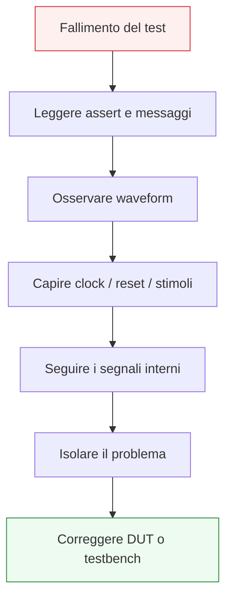

# Debug e lettura delle waveform

Dopo aver introdotto **testbench**, **stimoli**, **self-checking** e **simulazione**, il passo successivo naturale è affrontare il tema più operativo di tutta la verifica di base: il **debug**. In questa pagina il focus è su come leggere le **waveform** in modo utile e su come usare il testbench per localizzare gli errori nel DUT o nell’ambiente di prova.

Questa lezione è molto importante perché la simulazione, da sola, non basta. Anche quando un testbench include `assert` e controlli automatici, il progettista deve comunque essere in grado di rispondere a domande come:
- dove nasce il problema?
- l’errore è nel DUT o nel testbench?
- il reset è stato applicato correttamente?
- il clock e gli stimoli sono coerenti?
- il valore sbagliato è comparso subito o si è propagato da un errore precedente?
- il bug riguarda la logica combinatoria, la parte sequenziale, il controllo o l’allineamento temporale?

Dal punto di vista progettuale, il debug è il momento in cui si verifica davvero la qualità dell’RTL e del testbench. Un modulo ben scritto e un testbench ben organizzato producono waveform più leggibili e rendono molto più facile isolare gli errori.

Questa lezione mantiene il taglio della sezione:
- didattico ma tecnico;
- orientato alla verifica funzionale di moduli RTL;
- attento al legame tra semantica del linguaggio, comportamento temporale e osservazione del DUT;
- accompagnato da esempi di codice e schemi quando utili.



## 1. Perché serve una pagina su debug e waveform

La prima domanda utile è: perché il debug merita una lezione specifica?

### 1.1 Perché i bug non si correggono da soli
Un `assert` può dirti che qualcosa non va, ma quasi mai spiega da solo:
- quale parte del circuito ha sbagliato;
- quale segnale si è rotto per primo;
- se il problema nasce nella logica o nella verifica.

### 1.2 Perché le waveform sono uno strumento progettuale
Le waveform non sono solo una rappresentazione grafica dei segnali. Sono una vista temporale del comportamento del sistema:
- ingressi;
- uscite;
- clock;
- reset;
- stato;
- segnali intermedi.

### 1.3 Perché un buon debug migliora tutto il flusso
Capire bene il debug aiuta a:
- scrivere RTL più leggibile;
- costruire testbench migliori;
- individuare errori più in fretta;
- ridurre l’ambiguità tra bug del DUT e bug del testbench.

---

## 2. Che cos’è una waveform

Una **waveform** è la rappresentazione temporale dei segnali osservati durante la simulazione.

### 2.1 Che cosa mostra
Per ogni segnale visibile si può osservare:
- il valore nel tempo;
- i fronti di clock;
- il comportamento durante reset;
- i cambiamenti di stato;
- la relazione tra ingressi e uscite.

### 2.2 Perché è importante
Una waveform permette di capire non solo **che cosa** è successo, ma anche **quando** è successo.

### 2.3 Perché questo conta
Molti bug digitali non sono solo errori di valore, ma errori di:
- allineamento temporale;
- transizione di stato;
- ritardo;
- sequenza degli eventi.

---

## 3. Waveform e lettura temporale del DUT

Le waveform sono particolarmente utili perché mostrano il comportamento del DUT nel tempo.

### 3.1 Perché il tempo conta
Un modulo sequenziale non va giudicato solo per i valori che produce, ma anche per:
- il ciclo in cui li produce;
- il fronte di clock a cui reagisce;
- il comportamento durante reset;
- la latenza del percorso dati o del controllo.

### 3.2 Esempi di domande tipiche
- l’uscita cambia al fronte corretto?
- il reset riporta il sistema allo stato atteso?
- il dato compare con un ciclo di ritardo o con due?
- la FSM entra nello stato giusto?

### 3.3 Perché è importante
La waveform rende queste domande visibili.

---

## 4. Il primo passo del debug: leggere il fallimento

Il debug non dovrebbe partire aprendo casualmente tutte le waveform. Il primo passo è leggere bene il fallimento.

### 4.1 Che cosa guardare per primo
- messaggio di `assert`
- tempo di simulazione dell’errore
- caso di test che stava girando
- condizioni di input in quel punto

### 4.2 Perché è importante
Questo restringe subito il problema e evita di cercare “al buio” nei segnali.

### 4.3 Buona pratica
Ogni `assert` dovrebbe aiutare il debug indicando:
- il caso in corso;
- il valore atteso;
- il momento o la condizione rilevante.

---

## 5. Il secondo passo: osservare clock e reset

Prima di cercare l’errore nella logica, conviene controllare i due segnali più fondamentali del sistema sincrono:
- clock
- reset

### 5.1 Perché partire da qui
Se clock o reset sono gestiti male nel testbench, tutto il resto può risultare fuorviante.

### 5.2 Che cosa controllare
- il clock ha il periodo atteso?
- il reset è attivo quando dovrebbe?
- il DUT esce davvero dal reset nel momento previsto?
- gli stimoli partono troppo presto o nel momento corretto?

### 5.3 Perché è importante
Molti bug apparenti del DUT sono in realtà problemi di temporizzazione del testbench.

---

## 6. Il terzo passo: osservare ingressi e uscite

Dopo clock e reset, conviene osservare il rapporto tra:
- ingressi applicati;
- uscite del DUT;
- tempo in cui avvengono i cambiamenti.

### 6.1 Per logica combinatoria
Bisogna chiedersi:
- l’uscita segue correttamente gli ingressi?
- c’è un valore inatteso?
- il testbench controlla l’uscita nel momento giusto?

### 6.2 Per logica sequenziale
Bisogna chiedersi:
- il dato è campionato al fronte corretto?
- l’uscita cambia dopo il numero di cicli atteso?
- il reset ha riportato i registri al valore previsto?

### 6.3 Perché è importante
Questa è la prima verifica di coerenza tra stimolo e risposta del DUT.

---

## 7. Il quarto passo: seguire i segnali interni

Quando l’errore non è ovvio dagli ingressi e dalle uscite, bisogna seguire i segnali interni del modulo.

### 7.1 Che cosa guardare
A seconda del DUT, possono essere molto utili:
- registri interni;
- prossimo stato;
- stato corrente;
- mux intermedi;
- enable;
- segnali di controllo;
- stadi di pipeline.

### 7.2 Perché è utile
Spesso l’errore reale compare prima su un segnale interno e solo dopo si riflette sull’uscita.

### 7.3 Perché serve un RTL leggibile
Se i segnali interni sono ben nominati e ben organizzati, il debug diventa molto più rapido.

---

## 8. Debug di logica combinatoria

Il debug della logica combinatoria ha caratteristiche specifiche.

### 8.1 Che cosa cercare
- condizioni di ingresso che portano a un valore errato;
- rami di `if` o `case` non coperti correttamente;
- valori mancanti o incoerenti;
- uscite non assegnate in tutti i casi.

### 8.2 Segnale tipico di problema
Un’uscita che:
- non segue la funzione attesa;
- mantiene un valore quando non dovrebbe;
- assume un valore incoerente con la combinazione degli ingressi.

### 8.3 Collegamento con i pitfall
Molti errori di combinatoria sono dovuti a:
- process incompleti;
- sensitivity list sbagliata;
- inferenza involontaria di latch.

---

## 9. Debug di logica sequenziale

Il debug della logica sequenziale richiede sempre una lettura sincronizzata al clock.

### 9.1 Che cosa cercare
- aggiornamento del registro al fronte corretto;
- valore caricato nel ciclo giusto;
- reset applicato in modo coerente;
- eventuale enable che impedisce o consente il caricamento.

### 9.2 Domande utili
- il valore di `d` era corretto al fronte di clock?
- `q` si aggiorna esattamente quando dovrebbe?
- il reset ha azzerato il registro?
- l’uscita è stata osservata troppo presto dal testbench?

### 9.3 Perché è importante
Molti errori sequenziali sono in realtà errori di interpretazione temporale.

---

## 10. Debug di FSM

Le FSM sono uno dei casi in cui la waveform è particolarmente preziosa.

### 10.1 Che cosa osservare
- stato corrente;
- prossimo stato;
- segnali di ingresso rilevanti;
- uscite della FSM;
- effetto del reset.

### 10.2 Domande utili
- la macchina parte dallo stato giusto?
- entra nello stato atteso al ciclo corretto?
- resta bloccata in uno stato?
- le transizioni dipendono davvero dagli ingressi previsti?

### 10.3 Buona pratica
Mostrare sempre in waveform almeno:
- `state`
- eventualmente `next_state`
- ingressi di controllo
- uscite principali

### 10.4 Perché aiuta molto
Le FSM, se ben strutturate e ben nominate, sono tra i blocchi più debug-friendly del progetto.

---

## 11. Debug di datapath e pipeline

Quando il DUT contiene datapath o pipeline, il debug va letto come flusso del dato.

### 11.1 Che cosa osservare
- valori in ingresso;
- registri di stadio;
- segnali di select e enable;
- uscite intermedie;
- output finale.

### 11.2 Domande utili
- il dato entra correttamente nello stadio 1?
- si propaga nello stadio successivo al ciclo giusto?
- viene selezionato il percorso corretto dai mux?
- la latenza osservata è coerente con la pipeline attesa?

### 11.3 Perché è importante
Nei blocchi pipelined il bug non è solo “dato sbagliato”, ma spesso:
- dato giusto nel ciclo sbagliato;
- dato perso in uno stadio;
- disallineamento tra controllo e dati.

---

## 12. Debug del testbench

Non tutti i fallimenti sono bug del DUT. A volte il problema è nel testbench.

### 12.1 Casi tipici
- stimoli applicati troppo presto;
- reset gestito male;
- controllo dell’uscita nel momento sbagliato;
- atteso errato nel self-checking;
- `assert` scritte in modo incoerente.

### 12.2 Come riconoscerlo
Se le waveform mostrano che il DUT si comporta correttamente rispetto alla propria semantica, ma il test fallisce, allora il sospetto deve cadere anche sul banco di prova.

### 12.3 Perché è importante
Saper distinguere:
- bug del DUT
da
- bug del testbench

è una delle competenze più importanti della verifica.

---

## 13. Debug e `assert`

Le `assert` non sostituiscono le waveform, ma sono un punto di partenza molto utile.

### 13.1 Che cosa fanno bene
- segnalano il fallimento;
- localizzano il punto della simulazione;
- rendono esplicita una condizione attesa.

### 13.2 Che cosa non fanno da sole
Non mostrano automaticamente:
- il percorso completo che ha portato al bug;
- quale segnale interno si è guastato per primo;
- se il problema è del DUT o del testbench.

### 13.3 Visione corretta
- `assert` → rileva e segnala
- waveform → aiuta a spiegare e localizzare

---

## 14. Esempio di metodo di debug su un registro semplice

Consideriamo un DUT con registro sincrono.

```vhdl
process(clk, reset)
begin
  if reset = '1' then
    q <= (others => '0');
  elsif rising_edge(clk) then
    q <= d;
  end if;
end process;
```

### 14.1 Caso di errore ipotetico
L’`assert` dice che `q` non vale il dato atteso.

### 14.2 Metodo di debug
Conviene osservare:
- `clk`
- `reset`
- `d`
- `q`

### 14.3 Domande da farsi
- `reset` era ancora attivo?
- `d` era già stabile al fronte di clock?
- `q` è stato controllato subito dopo il fronte corretto?
- il DUT è giusto ma il testbench legge troppo presto?

### 14.4 Perché è utile
Mostra bene che il debug deve sempre partire dalla relazione tra:
- tempo;
- segnali;
- atteso del testbench.

---

## 15. Esempio di metodo di debug su una FSM

Supponiamo che il DUT non raggiunga lo stato `DONE` atteso.

### 15.1 Segnali da osservare
- `clk`
- `reset`
- `start`
- `finish`
- `state`
- `next_state`
- `done`

### 15.2 Domande utili
- la FSM parte in `IDLE`?
- `start` è attivo nel ciclo corretto?
- la transizione verso `WORK` avviene?
- `finish` è osservato nello stato atteso?
- la macchina resta bloccata in `WORK`?
- l’uscita `done` dipende dallo stato corretto?

### 15.3 Perché è importante
Il debug delle FSM è uno dei casi in cui la waveform mostra molto chiaramente la dinamica dell’errore.

---

## 16. Errori comuni nel debug

Ci sono anche errori metodologici nel modo di fare debug.

### 16.1 Guardare troppi segnali senza criterio
La waveform diventa rumorosa e difficile da leggere.

### 16.2 Non partire dal messaggio di errore
Si perde subito il contesto del fallimento.

### 16.3 Saltare direttamente alla conclusione “il DUT è sbagliato”
A volte il problema è nel testbench o nella lettura del tempo.

### 16.4 Guardare solo il punto del fallimento finale
Spesso l’errore reale nasce prima e si propaga fino all’uscita.

### 16.5 Non usare la struttura del modulo
Se il DUT è organizzato in:
- registri;
- FSM;
- datapath;
- pipeline

allora anche il debug deve seguire questa struttura.

---

## 17. Buone pratiche di debug

Per fare debug bene in VHDL, alcune regole aiutano molto.

### 17.1 Parti sempre da clock e reset
Sono la base di tutta la lettura temporale.

### 17.2 Segui il flusso del segnale
- ingressi
- segnali interni
- uscite

### 17.3 Usa nomi chiari nel DUT
Il debug diventa molto più semplice se i segnali riflettono il loro ruolo.

### 17.4 Combina assert e waveform
Non scegliere uno strumento “contro” l’altro.

### 17.5 Riduci il problema
Se il DUT è complesso, isola:
- il caso di test;
- il sottoblocco;
- lo stadio pipeline;
- la transizione di stato sospetta.

---

## 18. Waveform e qualità dell’RTL

Un punto importante da capire è che la facilità di leggere le waveform dipende anche da come è scritto il DUT.

### 18.1 RTL leggibile
Produce segnali:
- ben nominati;
- ben separati per ruolo;
- più facili da osservare.

### 18.2 RTL confuso
Produce waveform:
- più rumorose;
- meno interpretabili;
- più difficili da seguire.

### 18.3 Perché è importante
Il debug non è solo un’attività dopo il codice. È anche una proprietà del modo in cui il codice è stato scritto.

---

## 19. Collegamento con il resto della sezione

Questa pagina si collega direttamente a:
- **`verification-and-testbench.md`**, che ha introdotto la struttura del banco di prova;
- **`stimulus-self-checking-and-simulation.md`**, che ha mostrato come costruire casi di verifica e `assert`;
- **`fsm.md`**, **`datapath-control-and-pipelining.md`** e **`timing-and-clocking.md`**, perché il debug dipende fortemente dalla struttura del DUT;
- le future pagine di integrazione progettuale, in cui la leggibilità del comportamento del modulo diventa ancora più importante.

---

## 20. In sintesi

Il debug in VHDL consiste nel collegare in modo ordinato:
- messaggi di errore del testbench;
- segnali osservati in simulazione;
- struttura interna del DUT;
- relazione temporale tra clock, reset, ingressi e uscite.

Le waveform sono uno strumento fondamentale perché permettono di vedere **quando** e **come** il DUT ha prodotto un comportamento errato. Ma diventano davvero efficaci solo se lette con metodo e con una buona comprensione della microarchitettura del modulo.

Capire bene debug e waveform significa imparare non solo a vedere un errore, ma a isolarlo e spiegarlo in modo progettualmente utile.

## Prossimo passo

Il passo successivo naturale è **`vhdl-for-fpga-and-asic.md`**, perché adesso conviene collegare tutto il lavoro fatto su RTL, sintesi, timing e verifica ai due contesti implementativi principali:
- uso di VHDL in FPGA
- uso di VHDL in flussi ASIC
- differenze di sensibilità progettuale tra i due mondi
