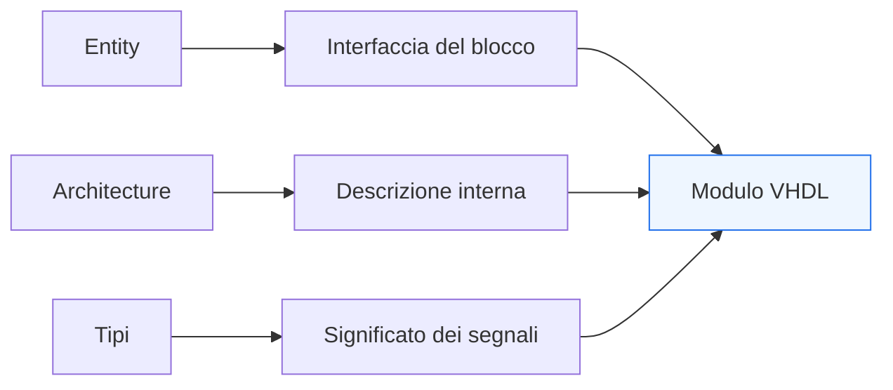
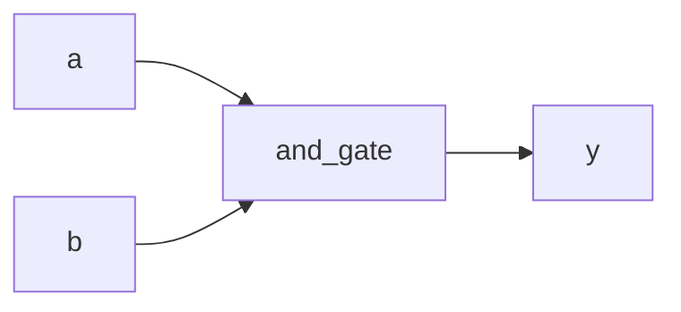
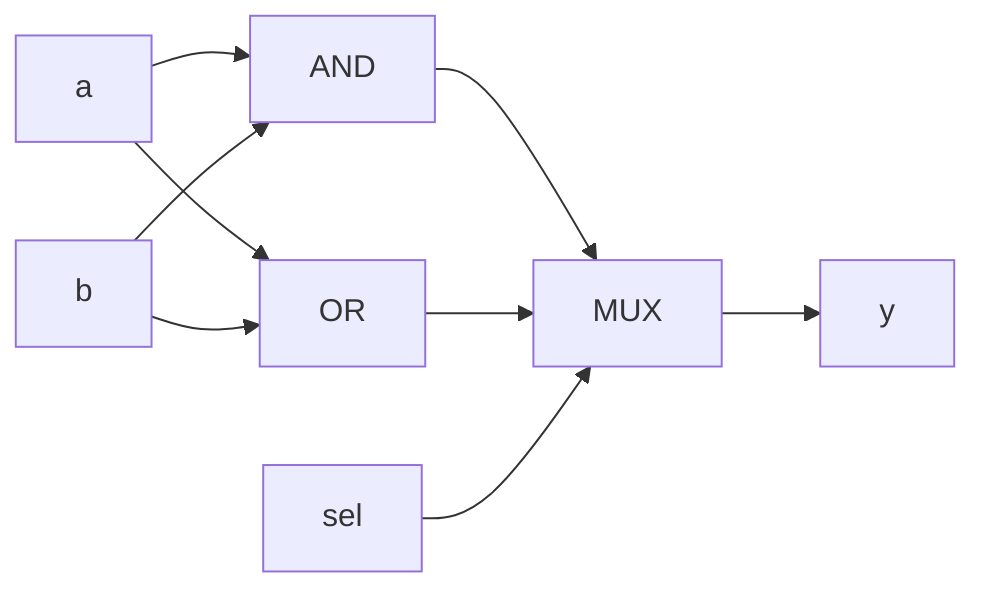

# Entity, architecture e tipi

Dopo aver introdotto la struttura minima di un file VHDL, il passo successivo naturale è approfondire i tre elementi che definiscono l’identità di un modulo RTL ben scritto:
- la **`entity`**
- la **`architecture`**
- i **tipi**

Questi tre aspetti sono strettamente collegati. La `entity` definisce il confine del blocco verso l’esterno, la `architecture` ne descrive il contenuto o il comportamento, mentre i tipi determinano in modo molto forte che cosa i segnali rappresentano e come possano essere usati.

Dal punto di vista progettuale, questa pagina è molto importante perché in VHDL la chiarezza dell’interfaccia e la correttezza tipologica non sono dettagli secondari, ma influenzano direttamente:
- leggibilità del modulo;
- correttezza della simulazione;
- qualità della sintesi;
- robustezza del riuso;
- facilità di verifica e integrazione.

Questa lezione mantiene l’impostazione della sezione:
- didattica ma tecnica;
- orientata all’RTL;
- attenta al significato hardware;
- accompagnata da esempi di codice e schemi quando utili.



## 1. Perché questi tre elementi sono centrali

La prima domanda importante è: perché conviene affrontare insieme `entity`, `architecture` e tipi?

### 1.1 Perché definiscono l’identità del modulo
Un blocco VHDL non è solo un insieme di righe di codice. È una descrizione hardware che deve dire con chiarezza:
- che cosa entra;
- che cosa esce;
- come il blocco si comporta;
- quale significato hanno i dati che attraversano l’interfaccia.

### 1.2 Perché il tipo conta quasi quanto la funzione
In VHDL non basta dichiarare un segnale “esistente”. Occorre anche dire:
- se è un singolo bit o un vettore;
- se rappresenta un valore logico o numerico;
- se può essere combinato con altri segnali in un certo modo;
- se la sua interpretazione è coerente con il resto del progetto.

### 1.3 Perché un buon modulo si capisce già dalla sua forma
Un modulo VHDL ben scritto dovrebbe risultare leggibile già osservando:
- `entity`
- `architecture`
- porte
- tipi principali

prima ancora di studiare il dettaglio interno.

---

## 2. Che cos’è una `entity`

La `entity` descrive l’interfaccia esterna del blocco.

### 2.1 Significato essenziale
La `entity` dice:
- come si chiama il blocco;
- quali porte ha;
- quali segnali entrano;
- quali segnali escono;
- di che tipo sono questi segnali.

### 2.2 Che cosa non descrive
La `entity` non dice ancora:
- come il blocco implementa la sua funzione;
- quale logica interna contiene;
- se il comportamento è combinatorio o sequenziale.

### 2.3 Visione intuitiva
La `entity` è il “contratto esterno” del modulo.

### 2.4 Esempio semplice

```vhdl
entity and_gate is
  port (
    a : in  std_logic;
    b : in  std_logic;
    y : out std_logic
  );
end entity and_gate;
```

### 2.5 Come leggerla
Da questa `entity` si capisce subito che il blocco:
- ha due ingressi a singolo bit;
- ha una uscita a singolo bit;
- è pensato come funzione logica elementare.



---

## 3. Le porte nella `entity`

La parte più importante della `entity` è spesso la dichiarazione delle porte.

### 3.1 Componenti di una porta
Ogni porta specifica:
- nome;
- direzione;
- tipo.

### 3.2 Direzioni più comuni
Le direzioni di base sono:
- `in`
- `out`

### 3.3 Esempio

```vhdl
entity simple_reg is
  port (
    clk : in  std_logic;
    d   : in  std_logic;
    q   : out std_logic
  );
end entity simple_reg;
```

### 3.4 Significato progettuale
Una buona definizione delle porte aiuta a capire subito:
- natura del blocco;
- ruolo del clock;
- presenza di dati singoli o vettoriali;
- livello di astrazione dell’interfaccia.

---

## 4. Che cos’è una `architecture`

La `architecture` descrive il contenuto del modulo associato a una `entity`.

### 4.1 Significato essenziale
Dice:
- come i segnali interni vengono dichiarati;
- come il comportamento viene espresso;
- come i dati passano dall’ingresso all’uscita;
- se il blocco è combinatorio, sequenziale o strutturale.

### 4.2 Relazione con la `entity`
La `entity` definisce **che cosa il blocco espone**.  
La `architecture` definisce **che cosa il blocco fa**.

### 4.3 Esempio

```vhdl
architecture rtl of and_gate is
begin
  y <= a and b;
end architecture rtl;
```

### 4.4 Perché il nome `rtl` è utile
È una convenzione molto comune e chiara, perché segnala l’intenzione progettuale della descrizione.

---

## 5. Struttura interna della `architecture`

Una `architecture` ha due parti principali:
- parte dichiarativa
- parte descrittiva

### 5.1 Parte dichiarativa
Qui si introducono elementi come:
- segnali interni;
- costanti;
- eventualmente tipi locali;
- componenti o funzioni, in contesti più articolati.

### 5.2 Parte descrittiva
Qui si inseriscono:
- assegnamenti concorrenti;
- process;
- istanziazioni;
- altra logica del blocco.

### 5.3 Forma generale

```vhdl
architecture rtl of example_block is
  signal tmp : std_logic;
begin
  tmp <= a and b;
  y   <= tmp or c;
end architecture rtl;
```

### 5.4 Perché è utile saperlo
Questa distinzione rende più leggibile la struttura del modulo:
- prima si dichiarano gli oggetti;
- poi si descrive il comportamento.

---

## 6. `entity` e `architecture` insieme

Il blocco VHDL prende forma completa solo quando `entity` e `architecture` vengono lette insieme.

### 6.1 Esempio completo

```vhdl
library ieee;
use ieee.std_logic_1164.all;

entity or_gate is
  port (
    a : in  std_logic;
    b : in  std_logic;
    y : out std_logic
  );
end entity or_gate;

architecture rtl of or_gate is
begin
  y <= a or b;
end architecture rtl;
```

### 6.2 Come leggerlo correttamente
La `entity` dice:
- due ingressi;
- una uscita.

La `architecture` dice:
- l’uscita è l’OR dei due ingressi.

### 6.3 Significato hardware
Questo descrive logica combinatoria molto semplice.

---

## 7. Il ruolo dei tipi in VHDL

Uno dei tratti più caratteristici di VHDL è la forte attenzione ai tipi.

### 7.1 Perché i tipi contano così tanto
Il tipo di un segnale dice:
- che genere di informazione rappresenta;
- quali operazioni sono lecite;
- come il segnale può essere collegato o confrontato;
- in che modo il progettista intende interpretarlo.

### 7.2 Perché è un vantaggio
Una tipizzazione più rigorosa:
- riduce ambiguità;
- migliora la leggibilità;
- aiuta a evitare errori di modellazione;
- rende più chiaro il significato del codice.

### 7.3 Perché richiede disciplina
In cambio, il progettista deve essere più attento nella scelta dei tipi e nelle conversioni.

---

## 8. `std_logic`: il tipo base più usato

Il tipo più comune nei progetti RTL introduttivi e in molti flussi reali è `std_logic`.

### 8.1 Che cos’è
Rappresenta un segnale logico a un bit.

### 8.2 Perché è usato così spesso
È il tipo standard più diffuso per:
- clock;
- reset;
- enable;
- segnali di controllo;
- bit singoli di dato.

### 8.3 Esempio

```vhdl
signal clk   : std_logic;
signal reset : std_logic;
signal en    : std_logic;
```

### 8.4 Significato hardware
Questi segnali sono tipicamente linee di controllo o sincronizzazione.

---

## 9. `std_logic_vector`: il tipo vettoriale più comune

Quando un segnale rappresenta più bit, si usa spesso `std_logic_vector`.

### 9.1 Esempio

```vhdl
signal data_in  : std_logic_vector(7 downto 0);
signal data_out : std_logic_vector(7 downto 0);
```

### 9.2 Che cosa significa
I due segnali sono bus da 8 bit.

### 9.3 Perché è importante
Gran parte dei datapath e delle interfacce reali usa vettori:
- dati;
- indirizzi;
- campi multipli;
- bus di configurazione.

### 9.4 Attenzione concettuale
`std_logic_vector` rappresenta una collezione di bit, ma non implica automaticamente una interpretazione numerica.

---

## 10. Intervalli e direzione degli indici

Un punto importante nella lettura dei vettori è la direzione dell’indice.

### 10.1 Esempio classico

```vhdl
signal x : std_logic_vector(7 downto 0);
```

### 10.2 Significato
Il bit più significativo è a sinistra, il meno significativo a destra, secondo una convenzione molto comune nei datapath.

### 10.3 Perché conta
La direzione degli indici influenza:
- leggibilità del codice;
- slicing;
- concatenazioni;
- compatibilità con altri blocchi.

### 10.4 Buona abitudine
Conviene mantenere scelte coerenti all’interno del progetto.

---

## 11. Tipi e significato numerico

Uno dei punti più importanti da capire è che non tutti i vettori vanno trattati automaticamente come numeri.

### 11.1 Primo chiarimento
Un `std_logic_vector` è, in prima lettura, un vettore di bit.

### 11.2 Che cosa manca
Per trattarlo in modo numerico in maniera ordinata servono convenzioni e package appropriati, che verranno approfonditi meglio nelle lezioni successive.

### 11.3 Perché dirlo già ora
Per evitare un equivoco molto comune: confondere un bus di bit con un valore numerico già semanticamente definito.

---

## 12. Segnali di controllo e segnali dati

Un uso corretto dei tipi migliora molto anche la chiarezza dell’interfaccia.

### 12.1 Segnali di controllo
Tipicamente sono:
- `std_logic`

per esempio:
- `clk`
- `reset`
- `valid`
- `ready`
- `enable`

### 12.2 Segnali dati
Tipicamente sono:
- `std_logic_vector(...)`

### 12.3 Perché è utile distinguerli
Anche solo osservando la `entity`, il lettore capisce meglio:
- quali porte controllano il comportamento;
- quali porte trasportano informazione.

---

## 13. Esempio con porte multi-bit

Vediamo un modulo leggermente più realistico.

```vhdl
library ieee;
use ieee.std_logic_1164.all;

entity logic_unit is
  port (
    a   : in  std_logic_vector(7 downto 0);
    b   : in  std_logic_vector(7 downto 0);
    sel : in  std_logic;
    y   : out std_logic_vector(7 downto 0)
  );
end entity logic_unit;
```

### 13.1 Che cosa mostra
Si vede subito una distinzione tra:
- dati multi-bit (`a`, `b`, `y`)
- controllo a singolo bit (`sel`)

### 13.2 Perché è una buona interfaccia iniziale
La lettura del modulo risulta ordinata già solo dalla forma della `entity`.

---

## 14. Esempio con segnali interni dichiarati nell’`architecture`

```vhdl
library ieee;
use ieee.std_logic_1164.all;

entity logic_unit is
  port (
    a   : in  std_logic_vector(7 downto 0);
    b   : in  std_logic_vector(7 downto 0);
    sel : in  std_logic;
    y   : out std_logic_vector(7 downto 0)
  );
end entity logic_unit;

architecture rtl of logic_unit is
  signal and_res : std_logic_vector(7 downto 0);
  signal or_res  : std_logic_vector(7 downto 0);
begin
  and_res <= a and b;
  or_res  <= a or b;

  y <= and_res when sel = '0' else or_res;
end architecture rtl;
```

### 14.1 Che cosa si impara da questo esempio
Si vede:
- una `entity` chiara;
- una `architecture` con segnali interni;
- una parte dichiarativa ordinata;
- una parte descrittiva con logica combinatoria.

### 14.2 Significato hardware
Questa descrizione corrisponde a:
- una rete AND;
- una rete OR;
- un multiplexer selezionato da `sel`.



---

## 15. Perché la scelta dei tipi influenza la qualità del modulo

In VHDL, una buona definizione dei tipi rende il codice più robusto.

### 15.1 Migliora la leggibilità
Il lettore capisce meglio:
- natura dei segnali;
- ampiezza dei bus;
- ruolo dell’interfaccia.

### 15.2 Riduce errori
La tipizzazione aiuta a evitare collegamenti e operazioni ambigue.

### 15.3 Favorisce il riuso
Un modulo con interfaccia chiara e tipi ben scelti è più facile da:
- integrare;
- verificare;
- riutilizzare in altri progetti.

---

## 16. Errori comuni

Alcuni errori ricorrono molto spesso quando si inizia a lavorare con `entity`, `architecture` e tipi.

### 16.1 Interfacce poco leggibili
Per esempio:
- nomi poco chiari;
- segnali mescolati senza ordine;
- porte dati e controllo non distinguibili.

### 16.2 Tipi scelti in modo superficiale
Questo rende il codice più difficile da leggere e da mantenere.

### 16.3 Confondere vettori di bit e valori numerici
Errore molto comune, soprattutto all’inizio.

### 16.4 Architettura poco ordinata
Mescolare dichiarazioni e comportamento in modo poco leggibile peggiora rapidamente la qualità del modulo.

---

## 17. Buone pratiche iniziali

Per partire bene nella scrittura dei moduli VHDL, alcune linee guida aiutano molto.

### 17.1 Curare la `entity`
L’interfaccia deve essere chiara già a colpo d’occhio.

### 17.2 Usare nomi coerenti
Per porte, segnali interni e architetture.

### 17.3 Scegliere i tipi con intenzione
Il tipo deve riflettere il significato del segnale, non solo “funzionare”.

### 17.4 Tenere ordinata l’`architecture`
Separare bene:
- dichiarazioni interne;
- comportamento.

### 17.5 Pensare sempre all’hardware
Ogni scelta di interfaccia e di tipo dovrebbe essere leggibile anche dal punto di vista architetturale.

---

## 18. Collegamento con il resto della sezione

Questa pagina si collega direttamente a:
- **`language-basics.md`**, che ha introdotto la forma generale del file VHDL;
- **`signals-variables-and-semantics.md`**, che chiarirà il comportamento dei segnali e la differenza rispetto alle variabili;
- **`process-and-concurrent-statements.md`**, che mostrerà come si esprime il comportamento dentro e fuori i process;
- le lezioni successive di modellazione RTL, dove la qualità dell’interfaccia e la scelta dei tipi diventano ancora più importanti.

---

## 19. In sintesi

`entity`, `architecture` e tipi sono tre elementi fondamentali della progettazione in VHDL:
- la `entity` definisce il confine esterno del blocco;
- la `architecture` ne descrive il contenuto;
- i tipi danno significato ai segnali e ne guidano l’uso corretto.

Capire bene questi elementi significa porre una base molto solida per leggere e scrivere RTL VHDL in modo:
- ordinato;
- sintetizzabile;
- leggibile;
- coerente con il significato hardware del progetto.

## Prossimo passo

Il passo successivo naturale è **`signals-variables-and-semantics.md`**, perché adesso conviene chiarire uno dei punti più importanti e spesso più fraintesi del linguaggio:
- che cos’è un segnale
- che cos’è una variabile
- come cambia il significato delle assegnazioni
- perché la semantica temporale conta così tanto in VHDL
