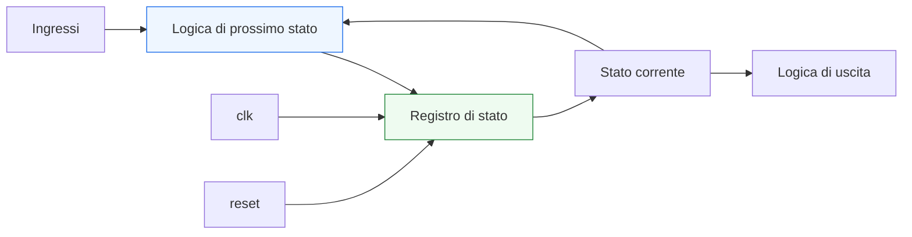
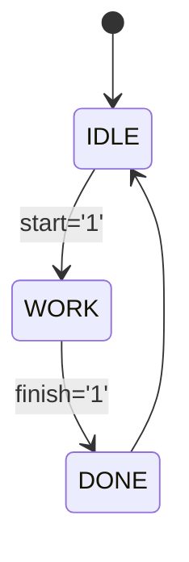

# FSM in VHDL

Dopo aver introdotto **registri**, **mux**, **enable** e **reset**, il passo successivo naturale è affrontare una delle strutture più importanti della progettazione digitale: la **FSM**, cioè la **Finite State Machine** o **macchina a stati finiti**.

Le FSM sono centrali in moltissimi progetti RTL perché permettono di descrivere in modo ordinato il comportamento di controllo di un sistema nel tempo. In pratica, una FSM è il meccanismo con cui un blocco decide:
- in quale stato si trova;
- quando cambiare stato;
- come reagire agli ingressi;
- quali uscite produrre nelle diverse condizioni operative.

Dal punto di vista VHDL, le FSM sono un caso particolarmente istruttivo perché mettono insieme molti dei concetti introdotti fin qui:
- logica combinatoria;
- logica sequenziale;
- registri;
- reset;
- process;
- tipi enumerativi;
- leggibilità del codice RTL.

Dal punto di vista progettuale, saper modellare bene una FSM è essenziale per:
- controllare datapath e protocolli;
- descrivere sequenze di operazioni;
- costruire controller leggibili e verificabili;
- preparare il terreno a pipeline, handshake e moduli più complessi;
- evitare codifica confusa o fragile.

Questa lezione mantiene il taglio della sezione:
- didattico ma tecnico;
- orientato all’RTL sintetizzabile;
- attento al significato hardware;
- accompagnato da esempi di codice e schemi quando utili.



## 1. Che cos’è una FSM

Una **Finite State Machine** è un modello di controllo in cui il comportamento del circuito viene descritto in termini di:
- un insieme finito di stati;
- regole di transizione tra stati;
- eventuali uscite associate agli stati o alle transizioni.

### 1.1 Significato essenziale
Una FSM permette di dire:
- “il sistema è in una certa fase del comportamento”
- “in base agli ingressi può passare a un’altra fase”
- “in ogni fase attiva certe uscite o certe decisioni di controllo”

### 1.2 Perché è utile
Molti blocchi non si descrivono bene come semplice funzione combinatoria degli ingressi. Hanno bisogno di:
- memoria dello stato attuale;
- evoluzione nel tempo;
- controllo ordinato di sequenze operative.

### 1.3 Esempi tipici
Le FSM compaiono in:
- controller;
- protocolli di comunicazione;
- sequenze di avvio;
- arbitri;
- gestione di handshake;
- unità di controllo di datapath.

---

## 2. Perché le FSM sono importanti in RTL

La prima domanda utile è: perché una FSM occupa un ruolo così centrale nella modellazione RTL?

### 2.1 Perché introducono controllo strutturato
In un sistema digitale reale, non tutto è semplice trasformazione dei dati. Serve anche decidere:
- quando partire;
- quando aspettare;
- quando terminare;
- quando ripetere;
- come reagire a eventi esterni.

### 2.2 Perché separano controllo e funzione
Molto spesso:
- il **datapath** elabora i dati;
- la **FSM** controlla la sequenza delle operazioni.

### 2.3 Perché migliorano leggibilità
Una logica di controllo scritta come FSM è spesso più chiara di una rete di condizioni sparse e poco organizzate.

---

## 3. Gli elementi fondamentali di una FSM

Una FSM ben modellata contiene tipicamente tre elementi concettuali.

### 3.1 Stato corrente
È il valore che rappresenta “dove si trova” attualmente il sistema.

### 3.2 Logica di prossimo stato
È la logica combinatoria che decide a quale stato passare nel ciclo successivo.

### 3.3 Logica di uscita
È la logica che decide le uscite in funzione:
- dello stato corrente;
- eventualmente degli ingressi attuali.

### 3.4 Perché questa decomposizione è utile
Aiuta a tenere separati:
- memoria dello stato;
- transizioni;
- comportamento di uscita.

---

## 4. Stato e registro di stato

Lo stato di una FSM è, dal punto di vista hardware, una informazione memorizzata.

### 4.1 Che cosa significa
Lo stato corrente vive in un registro o in un insieme di flip-flop.

### 4.2 Perché è importante
Questo rende la FSM una struttura **sequenziale**:
- lo stato attuale dipende dal passato;
- il passaggio al prossimo stato avviene tipicamente al clock;
- il reset porta la macchina in uno stato iniziale noto.

### 4.3 Visione hardware
Una FSM contiene sempre almeno:
- un registro di stato;
- logica combinatoria attorno al registro.

---

## 5. Tipi enumerativi: il modo naturale di esprimere gli stati in VHDL

Uno dei grandi vantaggi di VHDL è che le FSM si prestano molto bene all’uso dei **tipi enumerativi**.

### 5.1 Esempio

```vhdl
type state_t is (IDLE, LOAD, RUN, DONE);
signal state, next_state : state_t;
```

### 5.2 Perché è una scelta molto buona
Questa forma rende il codice:
- più leggibile;
- più vicino al significato funzionale;
- meno dipendente da codifiche numeriche manuali;
- più semplice da verificare e manutenere.

### 5.3 Perché è meglio di codifiche “magiche”
Invece di scrivere:
- `state = "00"`
- `state = "01"`

si leggono direttamente nomi che esprimono il ruolo dello stato.

---

## 6. Esempio concettuale: una FSM molto semplice

Consideriamo una macchina elementare con tre stati:
- `IDLE`
- `WORK`
- `DONE`

### 6.1 Significato del comportamento
- In `IDLE` il blocco aspetta un comando di avvio
- In `WORK` esegue l’operazione
- In `DONE` segnala completamento e poi torna a `IDLE`

### 6.2 Diagramma concettuale



### 6.3 Perché è un buon esempio
È abbastanza semplice da restare leggibile, ma già sufficiente per mostrare:
- stato iniziale;
- transizioni;
- controllo basato su ingressi;
- uscita di completamento.

---

## 7. Struttura tipica di una FSM in VHDL

Una delle forme più comuni e leggibili è quella che separa:
- process dello stato;
- logica di prossimo stato;
- eventuale logica di uscita.

### 7.1 Registro di stato

```vhdl
process(clk, reset)
begin
  if reset = '1' then
    state <= IDLE;
  elsif rising_edge(clk) then
    state <= next_state;
  end if;
end process;
```

### 7.2 Logica di prossimo stato

```vhdl
process(state, start, finish)
begin
  case state is
    when IDLE =>
      if start = '1' then
        next_state <= WORK;
      else
        next_state <= IDLE;
      end if;

    when WORK =>
      if finish = '1' then
        next_state <= DONE;
      else
        next_state <= WORK;
      end if;

    when DONE =>
      next_state <= IDLE;
  end case;
end process;
```

### 7.3 Logica di uscita
La si può tenere separata oppure integrare nella logica di stato, a seconda del caso.

### 7.4 Perché questa struttura è utile
Rende molto chiari i tre ruoli fondamentali della FSM.

---

## 8. Registro di stato: parte sequenziale

Il process che aggiorna `state` è la parte sequenziale della macchina.

### 8.1 Che cosa fa
- mantiene lo stato corrente;
- lo aggiorna al clock;
- gestisce il reset.

### 8.2 Perché è importante
Questo process è il luogo in cui la FSM acquisisce memoria del proprio stato.

### 8.3 Pattern tipico

```vhdl
process(clk, reset)
begin
  if reset = '1' then
    state <= IDLE;
  elsif rising_edge(clk) then
    state <= next_state;
  end if;
end process;
```

### 8.4 Significato hardware
Questa è la parte che inferisce il registro di stato.

---

## 9. Logica di prossimo stato: parte combinatoria

La logica di prossimo stato è tipicamente combinatoria.

### 9.1 Che cosa usa
Dipende da:
- stato corrente;
- ingressi;
- eventuali condizioni del protocollo o del datapath.

### 9.2 Che cosa produce
Genera `next_state`, cioè lo stato che verrà caricato nel registro al prossimo fronte di clock.

### 9.3 Perché è importante separarla
Questa separazione aiuta moltissimo la leggibilità e il debug.

### 9.4 Forma tipica
Il costrutto più naturale per descriverla è spesso il `case`.

---

## 10. Logica di uscita

Le uscite della FSM possono essere modellate in modi diversi.

### 10.1 Uscite dipendenti solo dallo stato
In questo caso la macchina si comporta come una forma classica di controllo in cui ogni stato definisce un certo insieme di uscite.

### 10.2 Uscite dipendenti da stato e ingressi
In altri casi le uscite dipendono sia dallo stato corrente sia dagli ingressi attuali.

### 10.3 Perché è importante saperlo
Dal punto di vista RTL, questo influisce su:
- struttura del codice;
- chiarezza della macchina;
- sensibilità ai cambiamenti degli ingressi;
- timing e comportamento osservabile.

---

## 11. Esempio completo di FSM semplice

Vediamo una versione completa e leggibile.

```vhdl
library ieee;
use ieee.std_logic_1164.all;

entity simple_fsm is
  port (
    clk    : in  std_logic;
    reset  : in  std_logic;
    start  : in  std_logic;
    finish : in  std_logic;
    done   : out std_logic
  );
end entity simple_fsm;

architecture rtl of simple_fsm is
  type state_t is (IDLE, WORK, DONE);
  signal state, next_state : state_t;
begin

  process(clk, reset)
  begin
    if reset = '1' then
      state <= IDLE;
    elsif rising_edge(clk) then
      state <= next_state;
    end if;
  end process;

  process(state, start, finish)
  begin
    case state is
      when IDLE =>
        if start = '1' then
          next_state <= WORK;
        else
          next_state <= IDLE;
        end if;

      when WORK =>
        if finish = '1' then
          next_state <= DONE;
        else
          next_state <= WORK;
        end if;

      when DONE =>
        next_state <= IDLE;
    end case;
  end process;

  process(state)
  begin
    case state is
      when IDLE =>
        done <= '0';
      when WORK =>
        done <= '0';
      when DONE =>
        done <= '1';
    end case;
  end process;

end architecture rtl;
```

### 11.1 Che cosa mostra
Si vedono chiaramente:
- tipo enumerativo degli stati;
- registro di stato;
- logica di prossimo stato;
- logica di uscita.

### 11.2 Perché è un buon pattern iniziale
È molto leggibile e adatto a capire la struttura della macchina.

---

## 12. FSM e reset

Il reset è uno degli elementi più importanti in una FSM.

### 12.1 Perché
La macchina deve partire in uno stato noto.

### 12.2 Stato iniziale
Spesso uno stato come `IDLE` rappresenta la condizione iniziale del sistema.

### 12.3 Perché è importante nella verifica
Il reset corretto permette di:
- riallineare la macchina;
- evitare stati indefiniti;
- semplificare debug e testbench;
- rendere coerente la partenza del sistema.

---

## 13. FSM e mux

Una FSM non è solo “un registro con un nome elegante”. Dal punto di vista hardware, contiene anche selezione combinatoria.

### 13.1 Perché
La logica di prossimo stato spesso seleziona tra più possibili stati futuri.

### 13.2 Interpretazione hardware
Molto spesso, dietro la logica di `next_state`, si possono leggere:
- comparazioni;
- condizioni;
- mux;
- reti combinatorie di selezione.

### 13.3 Perché è utile capirlo
Aiuta a leggere la FSM non solo come codice, ma come struttura reale di controllo.

---

## 14. FSM e timing

Anche le FSM hanno implicazioni di timing.

### 14.1 Percorso tipico
Un percorso comune è:

Registro di stato → logica di transizione → registro di stato

### 14.2 Perché conta
Una logica di transizione troppo complessa può allungare il cammino critico.

### 14.3 Uscite e timing
Anche la logica di uscita della FSM può contribuire al timing del blocco.

### 14.4 Perché è importante
Questo collega subito la modellazione della FSM ai temi di sintesi e clocking.

---

## 15. FSM e datapath

Molto spesso una FSM non vive da sola, ma controlla un datapath.

### 15.1 Che cosa significa
La FSM può:
- generare enable;
- selezionare mux;
- attivare registri;
- avviare operazioni;
- decidere quando terminare una sequenza.

### 15.2 Perché è importante
Questo rende la FSM la naturale unità di controllo di molti moduli RTL.

### 15.3 Collegamento con le pagine successive
Questo punto sarà particolarmente importante quando entreremo in:
- datapath;
- control unit;
- pipeline.

---

## 16. FSM e protocolli

Le FSM compaiono molto spesso anche nella gestione dei protocolli.

### 16.1 Esempi tipici
- attesa di `start`
- gestione di `valid/ready`
- request/response
- sequenze di handshaking
- gestione di timeout o errore

### 16.2 Perché sono adatte
Perché il protocollo è spesso, di fatto, una sequenza di stati e condizioni.

### 16.3 Beneficio progettuale
La macchina a stati rende il comportamento molto più leggibile rispetto a logiche sparse.

---

## 17. Errori comuni

Le FSM sono molto potenti, ma anche facili da scrivere male se non si adotta una struttura chiara.

### 17.1 Mescolare troppi ruoli nello stesso process
Questo può rendere il codice più opaco e difficile da verificare.

### 17.2 Non coprire bene tutti gli stati o tutte le transizioni
Questo può creare comportamento ambiguo o poco chiaro.

### 17.3 Dimenticare assegnazioni nella logica combinatoria
Si rischiano latch involontari o simulazioni poco affidabili.

### 17.4 Usare codifiche numeriche poco leggibili
Questo peggiora molto la manutenibilità, soprattutto rispetto ai tipi enumerativi.

### 17.5 Reset poco chiaro
Una FSM senza reset ben definito è più difficile da integrare e da verificare.

---

## 18. Buone pratiche di modellazione

Per scrivere FSM leggibili e robuste in VHDL, alcune linee guida sono particolarmente utili.

### 18.1 Usare tipi enumerativi
Rendono gli stati molto più leggibili.

### 18.2 Separare stato, prossimo stato e uscite quando migliora la chiarezza
È una struttura molto formativa e spesso molto efficace.

### 18.3 Tenere chiaro il reset
Lo stato iniziale deve essere evidente.

### 18.4 Pensare alla FSM anche come hardware
Dietro il codice ci sono:
- un registro di stato;
- logica combinatoria di transizione;
- logica di uscita.

### 18.5 Curare i nomi degli stati
`IDLE`, `LOAD`, `RUN`, `DONE` comunicano molto più chiaramente l’intenzione progettuale rispetto a etichette poco espressive.

---

## 19. Collegamento con il resto della sezione

Questa pagina si collega direttamente a:
- **`registers-mux-enables-reset.md`**, perché la FSM è costruita proprio su questi elementi;
- **`datapath-control-and-pipelining.md`**, dove il rapporto tra controllo e percorso dati diventerà esplicito;
- **`timing-and-clocking.md`**, perché la logica di transizione e la registrazione dello stato influenzano il timing;
- **`verification-and-testbench.md`**, dove le FSM diventeranno anche oggetto di verifica;
- più avanti, ai temi di interfacce, handshake e confronto con altri linguaggi RTL.

---

## 20. In sintesi

Una FSM in VHDL è una struttura di controllo che combina:
- un registro di stato;
- logica combinatoria di transizione;
- logica di uscita.

Dal punto di vista del linguaggio, VHDL la esprime in modo particolarmente leggibile grazie a:
- process;
- tipi enumerativi;
- separazione chiara tra sequenziale e combinatorio.

Capire bene le FSM significa compiere un passo molto importante verso la progettazione di moduli RTL realistici, ordinati e adatti a controller, protocolli e unità di controllo.

## Prossimo passo

Il passo successivo naturale è **`datapath-control-and-pipelining.md`**, perché adesso conviene vedere come la FSM si inserisce in una visione architetturale più ampia, insieme a:
- percorso dati
- unità di controllo
- pipeline
- relazione tra stato, operazioni e timing
